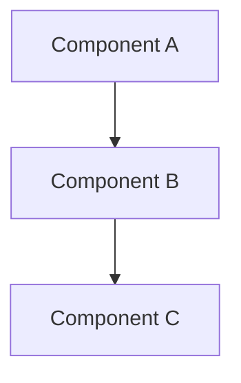

# Lesson Craft

The craft of writing a **deep, self-contained technical lesson** — a file someone returns to as a reference and learns the *why* from, not just the *what*. This skill is content-agnostic: it's the *how to write*. The track's `GUIDELINES.md` is the *what this track is* (domain, audience, file naming, snippet languages, acronyms, examples). **Read both before writing or reviewing a lesson.**

The benchmark is not "is this correct?" but "can a first-time reader follow it in one pass without stopping to ask a question?" Most confusion comes not from a wrong fact but from a missing link the author had in their head and never wrote down. Everything below exists to close those gaps.

## Format modes

**Four things are mode-dependent** — cited by every other rule in this skill and by `lesson-eval`
rather than restated: the *Document structure* section's structure and naming (including
"Practical Limits and Trade-offs"), the *Analogies* section's requirement, the bullet-vs-prose rule
in each mode below, and the *Tone* section's target section-count range. Everything else — depth
bar, mental-model rules, trade-offs, walkthroughs, quantification, currency, terminology,
readability, diagrams, tables, snippets, cross-references — applies unconditionally, under either
mode. A mode changes *packaging* (a bullet instead of a paragraph, a table instead of a prose
recap), never whether the mechanic, its why, its trade-off, or its selection guidance is present. A
track picks one mode for all of its lessons.

**Selection**: a track declares its mode with a one-line **`Format mode: <name>`** entry in its
`GUIDELINES.md`. No such line → default silently to `deep-prose`, no halt.

### Mode: `deep-prose` (default)

The original genre this skill was built for: a file someone reads start to end to *learn* a topic,
not scan under time pressure.

- **Structure**: the *Document structure* section's template, verbatim — including the
  `## N-1. Practical Limits and Trade-offs` section, bulleted with a bold label + reasoning per item.
- **Analogies**: required for every non-trivial concept (see *Analogies*) — a peer wouldn't grasp it
  from its name alone.
- **Prose over bullets**: a list of fact fragments is not a lesson — prose carries the explanation;
  bullets are reserved for the final limits/trade-offs section.

### Mode: `scannable-reference`

For a track whose lessons are read under time pressure — certification study, an on-call runbook —
where a reader needs to find a fact, config, or limit fast, not read a narrative.

- **Scan-first, not narrative.** Open each point with the key phrase **bolded**. Keep paragraphs to
  3 sentences or fewer. Prefer a bulleted list over prose for prerequisites, conditions, steps,
  enumerations, and property comparisons — reserve prose for the one or two sentences of *why* a
  bullet can't hold.
- **Analogies off by default.** State the mechanic directly instead of reaching for a real-world
  analogy. Keep at most a one-line analogy for a genuinely abstract idea with no direct technical
  description.
- **Lead with the takeaway.** The first bolded phrase of a section or subsection is the fact to
  remember; supporting detail follows it, never precedes it.
- **Inline the gotchas.** A constraint, trap, or failure mode is a `> ⚠️` or `> Note:` callout in
  the section it applies to, not held back for an end-of-file list.
- **A compact, dated Limits and Sources table replaces "Practical Limits and Trade-offs"** — columns
  *Limit | What it forces | As-of + docs* — so every volatile numeric limit still carries an as-of
  date and a doc link (re-verification stays one table, one click per fact), while the *reasoning*
  for each limit lives inline, at its callout, not in the table.
- **Depth is unchanged.** Tables, 2–3 diagrams, real code/config snippets, and a worked walkthrough
  are still required — only the surrounding prose becomes bullets-first.

---

## Execution Workflow

Run these in order for any lesson you write, expand, or review:

1. **Locate environment parameters — the canonical lookup, cited (not repeated) elsewhere in this repo.** Before drafting any prose:
   - Walk up from the lesson's target folder toward the repo root; take the first `GUIDELINES.md`
     found (or the `README.md` that serves that role). One shared file can cover several
     sub-tracks — e.g. `04-oracle/GUIDELINES.md` serves both `developer-professional/` and
     `observability-professional/`.
   - Load its **Snippet languages**, **Acronyms**, **Domain trade-off pairs**, and **Format mode**
     (a *missing* `Format mode:` line is not grounds to halt — see "Format modes" above).
   - No parameter file found anywhere up to the repo root → **halt and ask** the user to declare
     the track parameters; never guess them. This skill supplies the craft and depth bar; the
     track file supplies these domain inputs.
2. **Draft against the craft.** Write to the structure (§1), the depth bar (§2), and the writing rules (§3–§7). Do not hard-code a section number when pointing at another part of the same file — see §7.
3. **Final Self-Review sweep.** Run the One-Pass Test (§8) end to end, resolve every deferred cross-reference placeholder to a real number or stable anchor, and confirm currency/deprecation before declaring the lesson done.

---

## 1. Document structure

Every lesson follows this order. Do not skip sections.

```
# <Topic>: <Optional Subtitle>

<Intro paragraph — 2–4 sentences. State the core idea upfront.
Call out any common misconception or surprising nuance right here,
before the reader has formed a wrong mental model.>

---

## Contents

1. [<First Major Section>](#1-first-major-section)
2. [...](#2-)
...

---

## 1. <First Major Section>

### 1.1 <Sub-topic>
...

---

## 2. ...

---

<More topic sections as needed — N total.>

---

## N-1. Practical Limits and Trade-offs

<Always the second-to-last section, whatever N is. Bulleted list of real-world
constraints, failure modes, and design trade-offs. Each bullet starts with a
**bold label** followed by a sentence of explanation — never a bare fact
fragment. This is the `deep-prose` mode shape; under `scannable-reference` mode
this section becomes a dated "Limits and Sources" table instead (see "Format
modes" above).>

---

## N. Summary

<2–3 short paragraphs of prose (one theme per paragraph — e.g. what it is, why it
behaves this way, what that means for you), ~3–6 sentences total, a reader can use
as a quick recap without re-reading the whole file. One idea per sentence — never
chain three or more clauses into one sentence. No bullet lists here, under either
format mode — prose forces you to show how the ideas connect, but a single
unbroken block is a wall; break it at each topic seam (see *Readability and visual
rhythm*).>
```

**Structural rules:**
- Separate every major section (`## N.`) with a `---` horizontal rule.
- Top-level sections use `## N.` (e.g. `## 1.`, `## 2.`).
- Sub-sections use `### N.M` (e.g. `### 1.1`, `### 2.3`). Never use `##` for a sub-section — it renders as a top-level section.
- **Decompose each major section into `### N.M` sub-sections.** A `## N.` section that is one undivided block of prose is under-developed only when the *subject* genuinely has more than one mechanical part to it — break it into the two-to-four parts it is really made of, each with its own sub-heading, explanation, and (where it helps) snippet or diagram. A short, genuinely single-mechanism topic stays undivided; don't invent sub-parts just to satisfy this rule (see §2's proportional depth bar).
- **Open with a `## Contents` list of the top-level `## N.` sections** (not `### N.M` sub-sections), placed right after the intro's `---` and before `## 1.`. A real Markdown ordered list, number as the list marker only — don't also repeat it in the link text (e.g. `1. [Tokens: The Unit the Model Sees](#1-tokens-the-unit-the-model-sees)`, not `- [1. Tokens...]`). Generate it in the final Self-Review sweep (§8), not while drafting — see §7 for the anchor-slug rule.
- **Never add a standalone "why this matters" section.** The why belongs inside the section where the mechanism is introduced (§3.1); the Summary is the only place for restatement.

---

## 2. The depth bar (standard requirement)

These notes are for *learning a topic deeply*, not skimming it. The bar below is the **standard for every lesson** — not a per-track dial. Model *depth* on `02-redis-internal/03-event-loops.md` (decomposes every section, real data structures and system calls, an end-to-end request trace, several diagrams) — it's `deep-prose`-mode, so a `scannable-reference` track models its depth, not its format. **Treat it as the minimum, not the target.**

- **Sub-sections throughout.** Every `## N.` section is decomposed into `### N.M` parts. Zero sub-sections means the topic was summarised, not unpacked.
- **6+ code/config/data snippets** where the topic supports it. Show the real mechanics — a config, an API payload, a data format, an algorithm — not a prose description of them.
- **2–3 diagrams.** See *Diagrams*.
- **At least one end-to-end worked walkthrough** for any topic with a request or data lifecycle. See *Worked walkthroughs*.
- **Concrete numbers.** See *Quantify*.
- **Balanced depth.** Go deep on *both* how the thing works internally *and* the operational reality of building, running, and operating it. A lesson that does only one is half-finished.
- **Depth proportional to prominence.** The concept the lesson headlines must be the *most* thoroughly developed. If a secondary topic carries concrete techniques while the headline gets only a definition and a diagram, the lesson is inverted — deepen the headline.

> Note: Depth is not length for its own sake. Every sub-section, snippet, diagram, and number must teach a distinct mechanic the reader did not already have. If a paragraph only restates something or pads the count, cut it. A tight lesson that teaches ten real mechanics beats a longer one that teaches six and repeats them.

**The bar is proportional, not a quota.** "6+ snippets, 2–3 diagrams" describes a subject with real surface area to cover — it is not a floor every topic must be padded up to reach. A service with a small, genuinely simple surface earns a short lesson; that is the bar correctly met, not under-development. Padding a thin OCI topic out to a fixed count is itself a depth-bar failure, and it has a specific failure mode worth naming: the only material available to fill a thin topic out is usually generic, vendor-neutral background — re-explaining Docker, REST, or pub/sub instead of the OCI service at hand. Reaching for that material to hit a count is exactly the kind of padding the note above already forbids; don't let a `## N.` section expand just because it is short. It expands only when the *subject itself* has more real surface than the current draft shows — never merely to satisfy a number.

There is deliberately no maximum word count either. Length is a **diagnostic trigger, not a limit**: a long lesson or section should prompt the question *"is this length carrying distinct OCI mechanics, or generic background and clause-chained prose?"* — only the second answer calls for a cut (see §3.13's Cut pass).

---

## 3. Writing style

### 3.1 Explain the why

For every mechanism or design decision, answer: *why is it built this way, and what problem does it solve?* Describing how something works without why leaves the reader unable to reason about it in a new context. And for anything the system relies on that isn't a bare fact — a table, an index, a cache — explain how it came to be (built, derived, learned), not only what it is once finished; a reader who knows only the end state can't reason about why it has the properties it does.

Bad: "The store uses a write-ahead log."
Good: "The store uses a **write-ahead log** because applying a change straight to the main data file means a crash mid-write can leave it corrupt; recording the change in an append-only log *first* lets the store replay or roll back after a crash, so a partial write never leaves the data inconsistent."

Never paste source material verbatim or vendor hype — rewrite in your own words and ground every claim in a mechanism or trade-off, per this rule.

### 3.2 Build the mental model in one pass

The rules below close the gaps that force re-reads. The One-Pass Test (§8) enforces them.

- **Show the connecting artifact.** When one stage feeds another (X produces Y, Y is consumed by Z), show the concrete data structure or shared contract that joins them. Never narrate a transformation while hiding the thing being transformed — the bridge *is* the lesson.
  - Bad: "the request becomes a row."
  - Good: show the identifier the request carries, then show that the *same* identifier is the primary key of the row — so the reader sees the ID is a shared key across both stages, not magic.

- **Match the claim to what you show.** If a heading or sentence names a count — "four-step exchange", "three modes" — enumerate and label *all* of them; a block labelled "Step 2 … Step 4" with steps 1 and 3 missing reads as broken. When a step legitimately produces **no artifact**, say so explicitly (*"step 3 happens inside the worker; there is no message for it"*) rather than leave the reader hunting for one. (Inverse of *Show the connecting artifact*: there the bug hides an artifact that exists; here it leaves the reader hunting for one that doesn't.)

- **Name and refute the wrong mental model.** For any concept a reader is likely to misread, state the plausible-but-wrong intuition out loud and say why it is wrong — don't just assert the right one. Deliver it with a `> Nuance:` callout (see *Nuances and caveats*).
  - Example: "An index is *not* a second copy of the data sorted differently. It stores only the keys plus pointers back to the rows — which is why it speeds lookups without doubling storage."

- **Answer the obvious follow-up.** At each mechanism, answer the "but then what about…?" a curious reader asks the moment they understand it — don't leave the thread dangling.

- **Disambiguate confusable terms.** When you introduce a term that sounds like, or sits next to, one already introduced, contrast them explicitly — what is the same, what is different. A small two-column table (see *Tables*) is usually clearest. Silent adjacency is how a reader fuses two distinct concepts into one wrong one.

- **Anchor every abstraction in a concrete instance.** The moment you define an abstract role, layer, or protocol concept — client/server, producer/consumer, "a transport" — give one named, concrete example in the same breath. Worked walkthroughs cover things with a lifecycle; this covers static definitions, which strand the reader the same way left abstract.

- **Present a taxonomy by purpose and selection, not just definition.** When you enumerate a set — the modes of X, the strategies for Y — each item must answer *what it means in this lesson* and *when you would reach for it*, not a dictionary gloss the reader can't connect to anything. Then add explicit **selection guidance**: which to choose for a given need, and why. A list of bare definitions with no "when/which" tells the reader the options exist but not how to act on them.

### 3.3 Structural cohesion

The rules above keep a *passage* coherent; these keep the *whole document* coherent. A lesson can be locally flawless and still fail because the reader can't see how the major sections fit together.

- **Map every section to the lesson's spine — in one sentence.** When a lesson states a framework, taxonomy, or thesis, open each later `## N.` major section (not every `### N.M` subsection) with **one sentence** naming where it sits in that frame, then move straight into new content — a reader should never reach a section and wonder "how does this connect?" But the valve runs both ways: a subsection that spends half a paragraph recapping "as section 1 showed…" before saying anything new is placement *over*-applied, forcing the reader to hold the whole document in their head for the next fact. Good: "So far there have been two levers: *what* goes in and *how* it is shaped. This is a third, distinct one — it constrains *what comes back*." — then straight into the section's own material. Bad either way it fails: opening straight into mechanics with no placement, or a paragraph that re-explains a prior section before introducing its own.

- **Headings are signposts — make them accurate and directional.** A heading must name its content correctly and, where it expresses a relationship or transformation, point the right way. Re-read each heading against its section: does it mislabel the scope or state a relationship backwards?

- **Be honest about coverage.** When you present a *selected subset* rather than the full set, say so — name that it is a curated high-leverage subset, why these, and where the rest are covered. An undisclosed subset reads as exhaustive and misleads.

- **Don't let prose restate a table or diagram.** Where a table or diagram already shows a fact, adjacent prose earns its place only by adding a *why* or a mechanic the rows can't hold — not by narrating the rows back. A reader who reads both the table and a paragraph re-listing its contents has been asked to read the same fact twice.

### 3.4 Analogies

Use a concrete, real-world analogy for every non-trivial concept. Place it *after* the technical explanation, not before — the reader needs the concept first so the analogy clicks. A concept is "non-trivial" if a peer would not grasp it from its name alone.

A good analogy maps the mechanics, not just the name:

Bad: "A connection pool is like a parking lot."
Good: "A **connection pool** is like a fleet of taxis kept on standby: opening a fresh connection per request is like building a new taxi for every trip; a pool keeps a fixed set of already-open connections that callers borrow and return, so the build cost is paid once and reused."

### 3.5 Nuances and caveats

When a concept is commonly misunderstood or oversimplified, surface it with a Markdown blockquote prefixed `> Nuance:` or `> Note:` — it renders as a visually distinct callout.

```
> Nuance: A bigger cache does not always mean fewer misses. If the workload's
> access pattern has no locality, a larger cache just holds more data that
> nothing ever asks for again — the hit rate barely moves.
```

### 3.6 Trade-offs

Every significant design choice has a cost. Always name both sides: what is gained and what is given up. Calling out trade-offs is what separates an engineering note from a vendor pitch. (The track's `GUIDELINES.md` lists the common trade-off pairs for its domain.)

- **Placement:** weave each trade-off into the prose where the mechanism is introduced — *"The gain is X; the cost is Y."* Then consolidate the most important ones in the final limits/trade-offs section (named and shaped per the active format mode) so a skimming reader gets the full picture.
- **Pre-empt the obvious objection.** When you introduce a fix, name the *first* objection a sharp reader feels the instant they read it, and answer it on the spot — not pages later. Present a cache as "just keep recent results" and the reader instantly thinks "but stale entries return wrong answers"; address invalidation right there.

### 3.7 Worked walkthroughs

For any topic with a request or data lifecycle — a query flowing through a system, a pipeline transforming data, a step producing output — include a **numbered, end-to-end walkthrough** that traces one concrete instance start to finish. This is the single technique that most separates a deep lesson from a shallow one: it forces every intermediate state into the open.

A good walkthrough picks one concrete, **non-trivial** example (a real input string, a specific config, an actual incident — not the minimal toy case, which hides the intermediate states that only appear under load), numbers each step, shows the data changing shape at each stage (often a small snippet per step), and is paired with a `sequenceDiagram`. State real values, not placeholders, and work the example far enough to expose how the mechanism scales.

### 3.8 Quantify

Make trade-offs tangible with concrete numbers and show the arithmetic. Abstract claims teach far less than worked figures: "each entry is ~256 bytes, so 1M entries ≈ 256 MB; a 4 GB cache then holds ~16M entries before eviction starts" beats "a bigger cache uses more memory." Reach for numbers wherever a reader would otherwise be left with a vague "it depends" — counts, memory math, latency, cost, percentages. Flag rough figures with `~` and keep the arithmetic visible so the reader can re-run it.

### 3.9 Technical currency and deprecation

Many topics cover fast-moving surfaces — protocol versions, API shapes, command flags. Verify volatile facts against a current source, not memory. When a mechanism has been superseded, present the **current** one as default and **label the legacy one deprecated** — don't silently omit it (readers still meet it in the wild) and don't teach it as current.

Bad: list three options as co-equal when one is deprecated.
Good: "A and B are current; C was the original and is now deprecated, folded into B — recognise it when you meet it, but build new work on B."

### 3.10 Tone

Educational and precise. Avoid over-brevity — a reader should fully understand the topic from the file alone. At the same time, do not pad; every sentence should earn its place. Lean on the reader's existing vocabulary (stated in the track's `GUIDELINES.md`) to explain the unfamiliar.

**No framing narration.** State facts and mechanics, not commentary about why the lesson is telling the reader something — never "this is exam-relevant" or "this is exam bait." If a fact matters for a stated purpose (e.g. certification study), let the track's declared framing (`GUIDELINES.md`) shape *what* gets covered; don't narrate that framing back to the reader inside the prose.

Aim for **5–8 major sections** under `deep-prose` (fewer = under-unpacked, more = likely two topics that should split); **8–10** under `scannable-reference`, since each section is shorter and cheaper to add — same principle, higher ceiling.

### 3.11 Terminology

- **Bold every key term on first definition**, at the exact sentence it is defined, so readers can skim-locate definitions.
- **Expand every acronym on first use** — full form, then the abbreviation in parentheses, e.g. *"**Write-Ahead Log (WAL)**"*; the abbreviation alone is fine afterward. (The track's `GUIDELINES.md` lists the domain acronyms to watch for.)

### 3.12 Readability and visual rhythm

Density that reads fine sentence-by-sentence in your head can still land as a wall of text on the page. Three rules keep prose scannable:

- **One idea per sentence.** A sentence stacking three or more clauses gets split — the reader should never have to re-parse it to find its spine.
- **Paragraphs of 2–4 sentences.** Break at every topic seam (*what* → *why*, mechanism → consequence). Longer than ~4 sentences, or one unbroken screen-filling line, is a wall — split it.
- **Lead with the takeaway.** Open each subsection — and most paragraphs — with a short, plain sentence stating the load-bearing point before the qualifications or supporting detail. A reader who only reads first sentences should still walk away with the spine; bury the point and no sentence reads as the one to remember.

This applies everywhere, but density creeps in unnoticed in two spots most: the **Summary** (§1) and `> Nuance:`/`> Note:` callouts (§3.5) — both tend to compress a whole section's worth of ideas into one paragraph. Check those first.

Bad: "An LLM is a next-token predictor: text is split into sub-word tokens, each token ID is looked up as an embedding that encodes meaning as position in space, attention weighs which tokens matter for each other, and inference loops — scoring logits, softmaxing to probabilities, and sampling one token at a time — to produce output." *(one 90-word sentence, five clauses)*

Good: "An LLM predicts one token at a time. Text is split into sub-word tokens, and each token ID is looked up as an embedding — a point in space that encodes meaning. Attention then weighs which tokens matter to each other, and inference loops through scoring logits, softmaxing to probabilities, and sampling a token to produce output." *(same content, one idea per sentence)*

### 3.13 One layer per sentence; shape picks the container

§3.12 splits sentences that stack clauses. This section is about *why* they stack in the first place: a sentence carrying two or more distinct **layers** — a resource and its IAM policy, a limit and the strategy it forces, an API and the retry semantics behind it, three parallel options and their trade-offs — is not one idea wearing extra clauses. It is several ideas that were never given their own container. Cutting words from a sentence like that doesn't fix it; the fix is recognizing what *kind* of content it is and routing it to the container built for that kind.

- **One layer per sentence.** A sentence may name things from one layer only. The moment it reaches for a second layer, it becomes a new sentence, a new bullet, or a new row — never an appended clause.
- **Classify before you write.** Before drafting a passage, ask what kind of content it is. Prose earns its place only for *causal* explanation — why something is built this way, what it costs, how one thing leads to another. Anything that is fundamentally a **set** — of items, steps, states, or comparisons — belongs in a container built for sets, not narrated in a sentence.

| What you're about to write | Container | Never |
| :--- | :--- | :--- |
| 3+ parallel items | Bulleted list | A semicolon chain |
| Items compared on 2+ dimensions | Table | Prose enumeration |
| An ordered sequence of operations | Numbered steps, or a snippet | A comma-joined verb list |
| States and transitions | Table or `stateDiagram-v2` | A run-on definition chain |
| A constraint, trap, or failure mode | `> ⚠️` / `> Note:` callout | An em-dash aside |
| A concrete form (API call, config, payload) | Fenced snippet | A description of it |
| *Why* it works this way; a trade-off | Prose, 1–3 sentences | — |

Two mechanical habits reliably signal a sentence carrying more than it should:

- **At most one aside per sentence.** A single paired em-dash — like this one — marking one interruption is standard punctuation, not a violation; the failure mode is a *second*, independent em-dash (paired or trailing) tacking on another mechanism after the first aside closes, or after "and". A sentence with two unrelated dash-marked ideas is very often two sentences that should be split apart, or content that belongs in the table above.
- **Keep citations out of prose sentences.** A `(as of <date>, [docs](…))` tag belongs in the Limits and Sources table (or, under `deep-prose` mode, the Practical Limits and Trade-offs section) — not inlined into an explanatory sentence, where it adds a clause the reader has to parse past to reach the point.

Bad: "A connector reads from one source, optionally runs a task, and writes to one target — Logging, Monitoring, Queue, or Streaming as a source; Functions, Streaming, Notifications, Object Storage, Monitoring, or Log Analytics as a target; an optional Functions task for custom processing, or a Logging task to filter before delivery (as of Jul 2026, [docs](…))." *(a three-column table — source options, target options, task options — written as one 60-word sentence)*

Good: "A connector reads from one source, optionally runs a task, and writes to one target." Then a table:

| Role | Options |
| :--- | :--- |
| Source | Logging, Monitoring, Queue, Streaming |
| Task (optional) | Functions (custom processing), Logging (filter before delivery) |
| Target | Functions, Streaming, Notifications, Object Storage, Monitoring, Log Analytics |

*(the figure's as-of date and doc link move to the Limits and Sources table)*

---

## 4. Diagrams

Include **2–3 diagrams per file**. Diagrams are written in **Mermaid** inside a fenced block labelled `mermaid`.

````

````

| Situation | Diagram type | What it looks like |
| :--- | :--- | :--- |
| Multi-layer or component architecture | `graph TD` (or `graph LR` for left-to-right) | Boxes connected by arrows |
| Request lifecycle or events over time | `sequenceDiagram` | Vertical swimlanes per participant |
| Object states and transitions | `stateDiagram-v2` | Bubbles connected by labelled arrows |
| Simple short pipeline (3–4 steps) | ASCII `text` block | Plain characters, no tooling |

**Rules:**
- Every diagram has a one-line italic caption immediately below it (`*caption*`) describing what it shows.
- Diagrams must be tied to the surrounding text — no decorative diagrams.
- Keep node labels short. Use `["Label text"]` for boxes with spaces/special characters.
- For multi-line node labels in `graph` diagrams, use `<br/>`, never `\n` — GitHub's renderer prints `\n` literally inside the box.
- Wrap every node label in double quotes inside its brackets, even a short one — `id1["Label Text (with detail)"]` — and never nest an unescaped double quote inside an already-quoted label; invalid syntax fails silently as an unrendered block, not an error you'll see while drafting.
- In a `sequenceDiagram`, give any participant with spaces or punctuation a clean alphanumeric alias: `participant U as End User`, not a raw multi-word name.

---

## 5. Tables

Use a Markdown table when comparing multiple options, mechanisms, or properties side by side — comparisons become scannable in a way prose cannot.

```
| Column A | Column B |
| :---     | :---     |
| value    | value    |
```

The `:---` row is required (marks the header and left-aligns). Use left-alignment unless there is a specific reason otherwise.

---

## 6. Code snippets

Whenever a mechanism has a concrete form — an API call, a config, a data format, an algorithm — *show it* rather than describing it in prose; the real form surfaces detail prose lets you gloss over. (The track's `GUIDELINES.md` specifies which **languages** to use.) If a concept isn't covered by the track's named languages, use whatever a practitioner would actually reach for — never fall back to unformatted or unfenced prose. A track's own deliberate pseudocode choice (e.g. `02-redis-internal`'s C-style pseudocode for low-level internals) is a real answer here, not a fallback to avoid.

**Style rules:**
- Introduce every snippet with exactly one sentence explaining what it demonstrates.
- Comment every non-obvious line. Do not comment the obvious (`# set count to 3`).
- Keep snippets under roughly 20 lines. If a concept needs more, split it into two with prose between.
- Use a `# Simplified — ...` comment to flag when a snippet omits real detail for clarity.

---

## 7. Cross-references

- **Backward references** (to a previous lesson): use in the intro or at the start of a section that zooms into something a prior lesson introduced at a higher level. One sentence pointing back is enough — don't re-explain at the same depth.
- **Forward references** (to a future lesson): use at the end of a section or a diagram caption when the current lesson deliberately leaves something at a high level.
- **Intra-document references** (to another part of the *same* file): **never emit a hard `§N.M` mid-draft** — it goes stale the instant a section is reordered.
  - Default to a name-based prose reference — "see the *Transports* section" — never stale on renumber; covers the large majority of cases.
  - For an actual clickable link: a named anchor (`<a id="transports"></a>`, linked as `[Transports](#transports)`, stable across renumber), or — only while actively drafting — a deferred placeholder `§<!--ref:transports-->` resolved to a real number in the final sweep (§8). A bare `#34-transports` link is *not* safe — GitHub's auto-slug embeds the heading number.
  - The sweep greps for `Section [0-9]` / `§[0-9]` and any leftover `ref:` placeholder, catching both.
- **The `## Contents` TOC** is the one sanctioned plain `#N-heading-slug` link — exempt because it's regenerated from the final headings in the same sweep, never written mid-draft and left stale. Build each slug from GitHub's auto-slug rule: lowercase the heading (number included), drop every character that isn't a letter/digit/space/hyphen, spaces → hyphens (e.g. `## 2. The KV-Cache: The Memory That Governs Capacity` → `#2-the-kv-cache-the-memory-that-governs-capacity`). The link text drops the leading number — the ordered-list marker supplies it (§1) — so the entry reads `2. [The KV-Cache: The Memory That Governs Capacity](#2-the-kv-cache-the-memory-that-governs-capacity)`.

---

## 8. Self-Review: The One-Pass Test

Before a lesson is done, read it once *as someone seeing the topic for the first time* and confirm each item. A "no" marks a spot where the reader will stop and ask a question. Fix every "no".

- [ ] **Connecting artifacts shown** (§3.2) — every "X produces Y" shows the concrete structure/key linking the two stages.
- [ ] **Counts fully shown** (§3.2) — a stated N enumerates and labels all N; an artifact-less step says so.
- [ ] **Abstractions anchored** (§3.2) — every abstract role has a named, concrete instance at the moment it's defined.
- [ ] **Taxonomies offer selection guidance** (§3.2) — each enumerated option says *when* to choose it, not just what it is.
- [ ] **Origins explained** (§3.1) — every relied-upon artifact shows how it comes to be, not only what it is.
- [ ] **Wrong models refuted** (§3.2) — likely misreadings are named and refuted, not just silently corrected.
- [ ] **Confusable terms contrasted** (§3.2) — same-vs-different stated explicitly for any lookalike term.
- [ ] **Follow-ups answered** (§3.2) — the obvious "but then what about…?" is answered at each mechanism.
- [ ] **Objections pre-empted** (§3.6) — every fix names and answers the first objection, in place.
- [ ] **Sections mapped to the spine** (§3.3) — each major section opens with one placement sentence, not a recap paragraph.
- [ ] **No prose echoes a table/diagram** (§3.3) — adjacent prose adds a why or mechanic, not a restatement of the rows.
- [ ] **Takeaway-first** (§3.12) — each subsection opens with its load-bearing point before the qualifications.
- [ ] **No framing narration** (§3.10) — no "exam bait"-style commentary about why something is being said.
- [ ] **Headings accurate and directional** (§3.3) — every heading names its content correctly and points the right way.
- [ ] **Readable rhythm** (§3.12) — no run-on sentences or monolithic paragraphs; Summary is 2–3 short paragraphs.
- [ ] **Currency & deprecation** (§3.9) — volatile facts verified; superseded mechanisms marked deprecated, not omitted or taught as current.
- [ ] **Internal references resolve** (§7) — every same-file reference resolves; no leftover placeholders or bare `§N.M`.
- [ ] **TOC present and resolves** (§1) — ordered list of top-level sections, number not repeated in link text, slugs match headings.
- [ ] **Depth bar met** (§2) — sub-sections throughout (proportional to the subject, not padded), 6+ snippets, 2–3 diagrams, a walkthrough that goes beyond the minimal toy case, concrete numbers, both internal and operational depth.

**Shape** (§3.13 — the items above catch missing content; these catch content in the wrong container):

- [ ] **One layer per sentence** — no sentence names things from two distinct layers (a resource and its policy, a limit and the strategy it forces, a step and its trade-off).
- [ ] **Sets are in containers** — every enumeration of 3+ parallel items, every ordered sequence, every state/transition set is a list, table, numbered walkthrough, or diagram — never a sentence.
- [ ] **Every subsection is scannable** (mode) — each `### N.M` carries a table, snippet, diagram, callout, or short bullet list, or is short enough to scan in one glance.
- [ ] **Paragraphs are short** (§3.12 / mode) — check the Summary and `> Nuance:`/`> Note:` callouts first; that's where density hides.
- [ ] **Citation hygiene** (§3.13) — no inline as-of/doc citation sits inside a prose sentence; it's in the Limits table or the Practical Limits section instead.

**Cut pass** (the counterweight to the rest of this checklist, which is otherwise entirely additive): name the **three lowest-value passages** in the lesson and delete or compress each. A passage qualifies if it restates a table or diagram already on the page, re-teaches something the stated audience already knows, or narrates a transferable pattern without adding a mechanic specific to this lesson's subject. A lesson that passes every item above but skips this one is very likely padded.

If a reader still has to re-read a passage to follow it, the passage — not the reader — is the problem.
