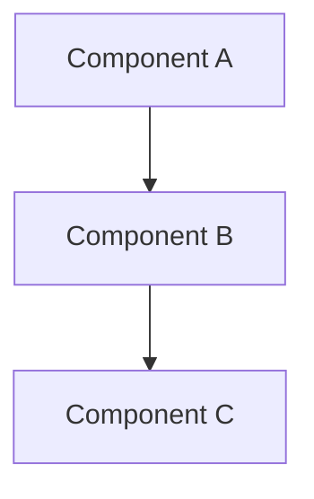

# Technical Lesson Authoring

The craft of writing a **deep, self-contained technical lesson** — a file someone can return to as a reference and learn the *why* from, not just the *what*. This skill is content-agnostic: it is the *how to write*. The track's `GUIDELINES.md` is the *what this track is* — its domain, audience, file naming, snippet languages, acronyms, and domain-specific examples. **Read both before writing or reviewing a lesson**: this skill for the craft and the standard depth bar, the track file for the parameters only it can supply.

The benchmark is not "is this correct?" but "can a first-time reader follow it in one pass without stopping to ask a question?" Most confusion comes not from a wrong fact but from a missing link the author had in their head and never wrote down. Everything below exists to close those gaps.

---

## Execution Workflow

Run these in order for any lesson you write, expand, or review:

1. **Locate environment parameters.** Before drafting any prose, search the working directory for the track's parameter file (`*GUIDELINES.md`, or the `README.md` that serves that role) and load its **Snippet languages**, **Acronyms**, and **Domain trade-off pairs**. If no such file is found, **halt and ask the user to declare the current track parameters** — do not guess them. (This skill supplies the craft and the depth bar; the track file supplies these domain inputs.)
2. **Draft against the craft.** Write to the structure (§1), the depth bar (§2), and the writing rules (§3–§7). Do not hard-code a section number when pointing at another part of the same file — see §7.
3. **Final Self-Review sweep.** Run the One-Pass Test (§8) end to end, resolve every deferred cross-reference placeholder to a real number or stable anchor, and confirm currency/deprecation before declaring the lesson done.

---

## 1. Document structure

Every lesson follows this order. Do not skip sections.

```
# <Topic>: <Optional Subtitle>

<Intro paragraph — 2–4 sentences. State the core idea upfront.
Call out any common misconception or surprising nuance right here,
before the reader has formed a wrong mental model.>

---

## Contents

1. [<First Major Section>](#1-first-major-section)
2. [...](#2-)
...

---

## 1. <First Major Section>

### 1.1 <Sub-topic>
...

---

## 2. ...

---

## 3. Practical Limits and Trade-offs

<Bulleted list of real-world constraints, failure modes, and design trade-offs.
Each bullet starts with a **bold label** followed by a sentence of explanation —
never a bare fact fragment.>

---

## 4. Summary

<2–3 short paragraphs of prose (one theme per paragraph — e.g. what it is, why it
behaves this way, what that means for you), ~3–6 sentences total, a reader can use
as a quick recap without re-reading the whole file. One idea per sentence — never
chain three or more clauses into one sentence. No bullet lists here — prose forces
you to show how the ideas connect, but a single unbroken block is a wall; break it
at each topic seam (see §3.12).>
```

**Structural rules:**
- Separate every major section (`## N.`) with a `---` horizontal rule.
- Top-level sections use `## N.` (e.g. `## 1.`, `## 2.`).
- Sub-sections use `### N.M` (e.g. `### 1.1`, `### 2.3`). Never use `##` for a sub-section — it renders as a top-level section.
- **Decompose each major section into `### N.M` sub-sections.** A `## N.` section that is one undivided block of prose is almost always under-developed — break it into the two-to-four mechanical parts it is really made of, each with its own sub-heading, explanation, and (where it helps) snippet or diagram.
- **Open with a `## Contents` list of the top-level `## N.` sections** (not the `### N.M` sub-sections), placed right after the intro's `---` and before `## 1.`. Use a real Markdown ordered list (`1.`, `2.`, ...) with the section number *only* as the list marker — do not also repeat the number inside the link text (e.g. `1. [Tokens: The Unit the Model Sees](#1-tokens-the-unit-the-model-sees)`, not `- [1. Tokens...]`), otherwise the rendered list shows the number twice. Generate it from the final headings in the Self-Review sweep (§8), not while drafting — see §7 for the anchor-slug rule.

---

## 2. The depth bar (standard requirement)

These notes are for *learning a topic deeply*, not skimming it. The bar below is the **standard for every lesson** — it is not a per-track dial. The repo exemplar to model depth on is `02-redis-internal/03-event-loops.md` (decomposes every section, shows real data structures and system calls across many snippets, traces one request end-to-end, draws several diagrams). **Treat it as the *minimum*, not the target.**

- **Sub-sections throughout.** Every `## N.` section is decomposed into `### N.M` parts. Zero sub-sections means the topic was summarised, not unpacked.
- **6+ code/config/data snippets** where the topic supports it. Show the real mechanics — a config, an API payload, a data format, an algorithm — not a prose description of them.
- **2–3 diagrams.** See §5.
- **At least one end-to-end worked walkthrough** for any topic with a request or data lifecycle. See §4 "Worked walkthroughs".
- **Concrete numbers.** See §4 "Quantify".
- **Balanced depth.** Go deep on *both* how the thing works internally *and* the operational reality of building, running, and operating it. A lesson that does only one is half-finished.
- **Depth proportional to prominence.** The concept the lesson headlines must be the *most* thoroughly developed. If a secondary topic carries concrete techniques while the headline gets only a definition and a diagram, the lesson is inverted — deepen the headline.

> Note: Depth is not length for its own sake. Every sub-section, snippet, diagram, and number must teach a distinct mechanic the reader did not already have. If a paragraph only restates something or pads the count, cut it. A tight lesson that teaches ten real mechanics beats a longer one that teaches six and repeats them.

---

## 3. Writing style

### 3.1 Explain the why

For every mechanism or design decision, answer: *why is it built this way, and what problem does it solve?* Describing how something works without why leaves the reader unable to reason about it in a new context.

Bad: "The store uses a write-ahead log."
Good: "The store uses a **write-ahead log** because applying a change straight to the main data file means a crash mid-write can leave it corrupt; recording the change in an append-only log *first* lets the store replay or roll back after a crash, so a partial write never leaves the data inconsistent."

### 3.2 Build the mental model in one pass

The rules below close the gaps that force re-reads. The One-Pass Test (§9) enforces them.

- **Show the connecting artifact.** When one stage feeds another (X produces Y, Y is consumed by Z), show the concrete data structure or shared contract that joins them. Never narrate a transformation while hiding the thing being transformed — the bridge *is* the lesson.
  - Bad: "the request becomes a row."
  - Good: show the identifier the request carries, then show that the *same* identifier is the primary key of the row — so the reader sees the ID is a shared key across both stages, not magic.

- **Match the claim to what you show.** If a heading or sentence names a count — "four-step exchange", "three modes", "two phases" — enumerate and label *all* of them consistently. A block labelled "Step 2 … Step 4" with steps 1 and 3 absent reads as broken and the reader stops to find the missing pieces. Corollary: when a step legitimately produces **no artifact** — it runs inside one component and emits nothing on the wire — say so explicitly (*"step 3 happens inside the worker; there is no message for it"*) so the reader doesn't hunt for one. (Inverse of *Show the connecting artifact*: there the bug is hiding an artifact that exists; here it is leaving the reader hunting for one that doesn't.)

- **Explain origin, not just definition.** For any artifact the system relies on — a table, an index, a cache, a generated config — show *how it comes to be* (built, derived, learned), not only what it is once finished. A reader who knows only the end state cannot reason about why it has the properties it does. (Complements *Explain the why*: that covers *why it is designed this way*; this covers *how it came to exist*.)

- **Name and refute the wrong mental model.** For any concept a reader is likely to misread, state the plausible-but-wrong intuition out loud and say why it is wrong — don't just assert the right one. Deliver it with a `> Nuance:` callout (§3.4).
  - Example: "An index is *not* a second copy of the data sorted differently. It stores only the keys plus pointers back to the rows — which is why it speeds lookups without doubling storage."

- **Answer the obvious follow-up.** At each mechanism, answer the "but then what about…?" a curious reader asks the moment they understand it — don't leave the thread dangling.

- **Disambiguate confusable terms.** When you introduce a term that sounds like, or sits next to, one already introduced, contrast them explicitly — what is the same, what is different. A small two-column table (§6) is usually clearest. Silent adjacency is how a reader fuses two distinct concepts into one wrong one.

- **Anchor every abstraction in a concrete instance.** The moment you define an abstract role, layer, or protocol concept — client/server, producer/consumer, "a transport", "a handler" — give one named, concrete example in the same breath. The worked-walkthrough rule covers things with a lifecycle; this covers static definitions, which strand the reader the same way when left abstract.

- **Present a taxonomy by purpose and selection, not just definition.** When you enumerate a set — the modes of X, the strategies for Y — each item must answer *what it means in this lesson* and *when you would reach for it*, not a dictionary gloss the reader can't connect to anything. Then add explicit **selection guidance**: which to choose for a given need, and why. A list of bare definitions with no "when/which" tells the reader the options exist but not how to act on them. (Complements *Disambiguate confusable terms*, which handles same-vs-different; this adds purpose and choice.)

### 3.3 Structural cohesion

The rules above keep a *passage* coherent; these keep the *whole document* coherent. A lesson can be locally flawless and still fail because the reader can't see how the major sections fit together.

- **Map every section to the lesson's spine.** When a lesson states a framework, taxonomy, or thesis, open every later major section by stating where it sits in that frame. A reader should never reach a section and wonder "how does this connect to what came before?" — a silent topic-switch is the macro version of the missing-link problem.
  - Bad: a section that opens straight into its mechanics.
  - Good: open with placement first — "So far there have been two levers: *what* goes in and *how* it is shaped. This is a third, distinct one — it constrains *what comes back*."

- **Headings are signposts — make them accurate and directional.** A heading must name its content correctly and, where it expresses a relationship or transformation, point the right way. Re-read each heading against its section: does it mislabel the scope or state a relationship backwards?

- **Be honest about coverage.** When you present a *selected subset* rather than the full set, say so — name that it is a curated high-leverage subset, why these, and where the rest are covered. An undisclosed subset reads as exhaustive and misleads.

### 3.4 Analogies

Use a concrete, real-world analogy for every non-trivial concept. Place it *after* the technical explanation, not before — the reader needs the concept first so the analogy clicks. A concept is "non-trivial" if a peer would not grasp it from its name alone.

A good analogy maps the mechanics, not just the name:

Bad: "A connection pool is like a parking lot."
Good: "A **connection pool** is like a fleet of taxis kept on standby: opening a fresh connection per request is like building a new taxi for every trip; a pool keeps a fixed set of already-open connections that callers borrow and return, so the build cost is paid once and reused."

### 3.5 Nuances and caveats

When a concept is commonly misunderstood or oversimplified, surface it with a Markdown blockquote prefixed `> Nuance:` or `> Note:` — it renders as a visually distinct callout.

```
> Nuance: A bigger cache does not always mean fewer misses. If the workload's
> access pattern has no locality, a larger cache just holds more data that
> nothing ever asks for again — the hit rate barely moves.
```

### 3.6 Trade-offs

Every significant design choice has a cost. Always name both sides: what is gained and what is given up. Calling out trade-offs is what separates an engineering note from a vendor pitch. (The track's `GUIDELINES.md` lists the common trade-off pairs for its domain.)

- **Placement:** weave each trade-off into the prose where the mechanism is introduced — *"The gain is X; the cost is Y."* Then consolidate the most important ones in the final "Practical Limits and Trade-offs" section so a skimming reader gets the full picture.
- **Pre-empt the obvious objection.** When you introduce a fix, name the *first* objection a sharp reader raises the instant they read it — and answer it on the spot. This is the trade-off the reader immediately *feels*. If you present a cache as "just keep recent results", the reader instantly thinks "but stale entries return wrong answers" — so address invalidation there, not pages later.

### 3.7 Worked walkthroughs

For any topic with a request or data lifecycle — a query flowing through a system, a pipeline transforming data, a step producing output — include a **numbered, end-to-end walkthrough** that traces one concrete instance start to finish. This is the single technique that most separates a deep lesson from a shallow one: it forces every intermediate state into the open.

A good walkthrough picks one concrete example (a real input string, a specific config, an actual incident), numbers each step, shows the data changing shape at each stage (often a small snippet per step), and is paired with a `sequenceDiagram`. State real values, not placeholders.

Include at least one **non-trivial** case. A minimal example proves the mechanism exists; it does not prove the reader can apply it to anything real, and it hides the intermediate states that only appear under load. Work a realistic example far enough to expose how the mechanism scales.

### 3.8 Quantify

Make trade-offs tangible with concrete numbers and show the arithmetic. Abstract claims teach far less than worked figures: "each entry is ~256 bytes, so 1M entries ≈ 256 MB; a 4 GB cache then holds ~16M entries before eviction starts" beats "a bigger cache uses more memory." Reach for numbers wherever a reader would otherwise be left with a vague "it depends" — counts, memory math, latency, cost, percentages. Flag rough figures with `~` and keep the arithmetic visible so the reader can re-run it.

### 3.9 Technical currency and deprecation

Many topics cover fast-moving surfaces — protocol versions, API shapes, names, command flags. Verify volatile facts against a current source rather than from memory. When a mechanism has been superseded, present the **current** one as the default and **label the legacy one as deprecated** — don't silently omit it (readers still meet it in the wild) and don't teach it as current.

Bad: list three options as co-equal when one is deprecated.
Good: "A and B are current; C was the original and is now deprecated, folded into B — recognise it when you meet it, but build new work on B."

(Distinct from *Be honest about coverage*, which discloses a curated *subset*; this is about correctness *over time*.)

### 3.10 Tone

Educational and precise. Avoid over-brevity — a reader should fully understand the topic from the file alone. At the same time, do not pad; every sentence should earn its place. Lean on the reader's existing vocabulary (stated in the track's `GUIDELINES.md`) to explain the unfamiliar.

Aim for **5–8 major sections** per lesson. Fewer than five usually means a concept was not fully unpacked; more than eight usually means the lesson covers two topics and should be split.

### 3.11 Terminology

- **Bold every key term on first definition**, at the exact sentence it is defined, so readers can skim-locate definitions.
- **Expand every acronym on first use** — full form, then the abbreviation in parentheses, e.g. *"**Write-Ahead Log (WAL)**"*; the abbreviation alone is fine afterward. (The track's `GUIDELINES.md` lists the domain acronyms to watch for.)

### 3.12 Readability and visual rhythm

Density that reads fine sentence-by-sentence in your head can still land as a wall of text on the page. Two rules keep prose scannable:

- **One idea per sentence.** If a sentence stacks three or more clauses joined by commas or em-dashes, split it. The reader should never have to re-parse a sentence to find its spine.
- **Paragraphs of 2–4 sentences.** Break a block at every topic seam — a shift from *what* to *why*, or from mechanism to consequence. A paragraph longer than ~4 sentences, or one that renders as a single unbroken line filling the screen, is a wall — split it into two.

This applies everywhere, but density creeps in unnoticed in two spots most: the **Summary** (§1) and `> Nuance:`/`> Note:` callouts (§3.5) — both tend to compress a whole section's worth of ideas into one paragraph. Check those first.

Bad (one 90-word sentence chaining five clauses):
"An LLM is a next-token predictor: text is split into sub-word tokens, each token ID is looked up as an embedding that encodes meaning as position in space, attention weighs which tokens matter for each other, and inference loops — scoring logits, softmaxing to probabilities, and sampling one token at a time — to produce output."

Good (same content, one idea per sentence, grouped by theme):
"An LLM predicts one token at a time. Text is split into sub-word tokens, and each token ID is looked up as an embedding — a point in space that encodes meaning. Attention then weighs which tokens matter to each other, and inference loops through scoring logits, softmaxing to probabilities, and sampling a token to produce output."

---

## 4. Diagrams

Include **2–3 diagrams per file**: at least one architecture/concept diagram of how the parts fit, plus a `sequenceDiagram` or `stateDiagram-v2` for any lifecycle or loop, plus an optional comparison diagram where it earns its place. Diagrams are written in **Mermaid** inside a fenced block labelled `mermaid`.

````

````

| Situation | Diagram type | What it looks like |
| :--- | :--- | :--- |
| Multi-layer or component architecture | `graph TD` | Boxes connected by arrows, top-down |
| Request lifecycle or events over time | `sequenceDiagram` | Vertical swimlanes per participant |
| Object states and transitions | `stateDiagram-v2` | Bubbles connected by labelled arrows |
| Simple short pipeline (3–4 steps) | ASCII `text` block | Plain characters, no tooling |

`graph TD` is top-down; use `graph LR` for left-to-right when it suits the layout.

**Rules:**
- Every diagram has a one-line italic caption immediately below it (`*caption*`) describing what it shows.
- Diagrams must be tied to the surrounding text — no decorative diagrams.
- Keep node labels short. Use `["Label text"]` for boxes with spaces/special characters.
- For multi-line node labels in `graph` diagrams, use `<br/>`, never `\n` — GitHub's renderer prints `\n` literally inside the box.

---

## 5. Tables

Use a Markdown table when comparing multiple options, mechanisms, or properties side by side — comparisons become scannable in a way prose cannot.

```
| Column A | Column B |
| :---     | :---     |
| value    | value    |
```

The `:---` row is required (marks the header and left-aligns). Use left-alignment unless there is a specific reason otherwise.

---

## 6. Code snippets

Whenever a mechanism has a concrete form — an API call, a config, a data format, a payload, an algorithm — *show it* rather than describing it in prose. A snippet of the real thing teaches more than a paragraph about it, and writing the real form surfaces detail prose lets you gloss over. (The track's `GUIDELINES.md` specifies which **languages** to use.)

**Style rules:**
- Introduce every snippet with exactly one sentence explaining what it demonstrates.
- Comment every non-obvious line. Do not comment the obvious (`# set count to 3`).
- Keep snippets under roughly 20 lines. If a concept needs more, split it into two with prose between.
- Use a `# Simplified — ...` comment to flag when a snippet omits real detail for clarity.

---

## 7. Cross-references

- **Backward references** (to a previous lesson): use in the intro or at the start of a section that zooms into something a prior lesson introduced at a higher level. Do not re-explain a concept a prior lesson already covered at the same depth — one sentence pointing back is enough.
- **Forward references** (to a future lesson): use at the end of a section or a diagram caption when the current lesson deliberately leaves something at a high level.
- **Intra-document references** (to another part of the *same* file): a bare section number like "§3.2" goes stale the instant a section is inserted or reordered — and because you generate the file top-to-bottom, you usually write the reference *before* the final layout is settled, so re-verifying "later" is too late. Avoid the moving-target bug; pick one:
  - **Prefer name-based references** in prose — "see the *Transports* section" — which never go stale on renumber.
  - **Or use an explicit named anchor**: drop `<a id="transports"></a>` beside the section and link `[Transports](#transports)`. The `id` is stable even when the heading number changes. (A plain `[...](#34-transports)` link is *not* safe — GitHub's auto-slug embeds the heading number, so it breaks on renumber.)
  - **Or defer the number**: while drafting, write a placeholder such as `§<!--ref:transports-->` instead of a number, and resolve every placeholder to a real number only in the final Self-Review sweep (§8). **Never emit a hard `§N.M` mid-draft.**
  - The sweep greps for `Section [0-9]` / `§[0-9]` **and** for any leftover `ref:` placeholder, catching both stale numbers and unresolved refs.

- **The `## Contents` TOC is the one sanctioned use of a plain `#N-heading-slug` link.** It is exempt from the moving-target bug above only because it is regenerated from the final headings in the same Self-Review sweep that resolves everything else — it is never written mid-draft and left stale. Build each slug from GitHub's auto-slug rule: lowercase the heading (number included), drop every character that is not a letter, digit, space, or hyphen, then turn spaces into hyphens (e.g. `## 2. The KV-Cache: The Memory That Governs Capacity` → `#2-the-kv-cache-the-memory-that-governs-capacity`). The link *text*, though, drops the leading number — the ordered-list marker supplies it (see §1) — so the entry reads `2. [The KV-Cache: The Memory That Governs Capacity](#2-the-kv-cache-the-memory-that-governs-capacity)`. Regenerating the TOC — not just resolving `§` refs — is part of the sweep.

---

## 8. Self-Review: The One-Pass Test

Before a lesson is done, read it once *as someone seeing the topic for the first time* and confirm each item. A "no" marks a spot where the reader will stop and ask a question. Fix every "no".

- [ ] **Connecting artifacts shown.** Every "X produces Y" / "Y becomes Z" transition shows the concrete structure or shared key linking the two stages.
- [ ] **Counts fully shown.** Every stated count (N steps/modes/phases) enumerates and labels all N; any step that emits no artifact is flagged as such.
- [ ] **Abstractions anchored.** Every abstract role (e.g. 'client', 'transport', 'producer/consumer') is anchored in a named, concrete instance the moment it is defined.
- [ ] **Taxonomies offer selection guidance.** Every enumerated set/taxonomy says *when* to choose which option, not just what each one is.
- [ ] **Origins explained.** Every artifact the system uses (table, index, cache, generated config) is explained by *how it comes to be*, not only what it is once built.
- [ ] **Wrong models refuted.** Every concept a reader is likely to misread names the plausible-but-wrong intuition and says why it's wrong.
- [ ] **Confusable terms contrasted.** Every new term that resembles a prior one is explicitly contrasted with it (same vs. different).
- [ ] **Follow-ups answered.** Every mechanism answers the obvious "but then what about…?".
- [ ] **A non-trivial example exists.** At least one worked example is realistic, not only the minimal toy case.
- [ ] **Objections pre-empted.** Every fix names the first objection a reader feels and answers it in place.
- [ ] **Sections mapped to the spine.** If the lesson states a framework or thesis, every major section's opening places it within that frame.
- [ ] **Headings accurate and directional.** Every heading names its content correctly and points the right way.
- [ ] **Readable rhythm.** No monolithic paragraph or 3+-clause run-on sentence anywhere; the Summary is 2–3 short paragraphs, not one block.
- [ ] **Currency & deprecation.** Volatile facts verified against a current source; legacy/superseded mechanisms are explicitly preserved but clearly marked deprecated — not omitted, not taught as current.
- [ ] **Internal references resolve.** Every same-file reference resolves against the final headings; all drafting placeholders (`§<!--ref:...-->`) are replaced with real numbers or stable anchors, and no bare section number was emitted before the final sweep.
- [ ] **TOC present and resolves.** The lesson opens with a `## Contents` block as a Markdown ordered list (not dash bullets) of every top-level `## N.` section, the number appears once (as the list marker, not repeated in the link text), and each link's slug matches its heading exactly (regenerated after any renumber).
- [ ] **Depth bar met.** Sub-sections throughout, 6+ snippets, 2–3 diagrams, an end-to-end walkthrough, concrete numbers, both internals and operational depth (§2).

If a reader still has to re-read a passage to follow it, the passage — not the reader — is the problem.

---

## 9. What to avoid

- **Do not produce bare bullet-point lists.** A list of fact fragments is not a lesson. Prose carries the explanation. Bullets are acceptable only in "Practical Limits and Trade-offs", where each starts with a **bold label** + a sentence of reasoning.
- **Do not skip analogies or trade-offs for brevity.** They are required.
- **Do not leave a major section as undivided prose.** No `### N.M` sub-sections means you summarised rather than unpacked — decompose it.
- **Do not describe in prose a mechanism you could show.** If it has a concrete form — a config, a payload, a data format, an algorithm, a computed number — show it.
- **Do not end a file without a Summary section.**
- **Do not paste source material verbatim or vendor hype.** Rewrite in your own words and ground every claim in a mechanism or trade-off.
- **Do not add a standalone "why this matters" section.** The why belongs inside the section where the mechanism is introduced; the Summary is the only place for restatement.
- **Do not narrate a transformation while hiding the artifact that links the two stages.**
- **Do not define an artifact without explaining how it comes to be.**
- **Do not introduce a term confusable with a prior one without contrasting them.**
- **Do not present a fix without its first obvious objection.**
- **Do not switch topics between sections without placing the new section in the lesson's frame.**
- **Do not let the headline concept be the least-developed.**
- **Do not present a curated subset as exhaustive, or write a heading that mislabels or reverses its content.**
- **Do not state a count you do not fully show.** Enumerate all N, label consistently, and call out any step that emits no artifact.
- **Do not leave an abstraction or taxonomy unanchored.** Give a concrete named instance and selection guidance.
- **Do not teach a deprecated mechanism as current, or omit it silently.** Present the current default and mark the superseded alternative deprecated.
- **Do not let internal section references go stale.** Re-verify every same-file reference after renumbering or inserting sections.
- **Do not pack prose into one unbroken wall**, or chain three-plus clauses into a single sentence. Break at topic seams; one idea per sentence. This applies everywhere but especially the Summary.
