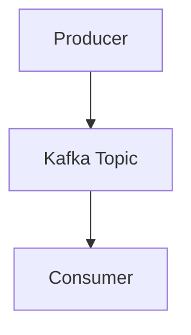
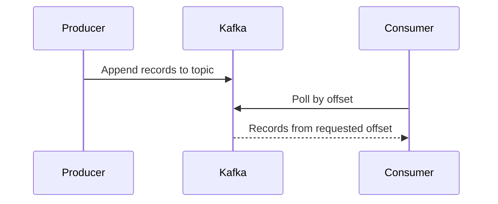

# Exercise 4 - Message Streaming (Kafka)

Deploy Apache Kafka using the Strimzi operator and test producer/consumer patterns.

**Objectives**:
1. Install Strimzi operator to manage Kafka lifecycle
2. Deploy a single-node Kafka cluster via CRD
3. Test producer/consumer communication using console tools
4. Understand Kafka's immutable log and offset-based consumption

## Context

Kafka is optimized for durable event streaming with replayable logs. In this exercise, Strimzi acts as the Kubernetes operator that manages Kafka cluster lifecycle through CRDs.

## Design





## Setup

[Strimzi](https://strimzi.io/) operator will be used. Kafka will be deployed via Strimzi CRD.

```sh
# https://strimzi.io/quickstarts/
kubectl create namespace kafka
kubectl create -f 'https://strimzi.io/install/latest?namespace=kafka' -n kafka
# Run the below and wait for pod to be ready
kubectl get pod -n kafka --watch
kubectl apply -f https://strimzi.io/examples/latest/kafka/kafka-single-node.yaml -n kafka 

```

## Test

Test will be done using two terminal to run a producer and consumer.

```sh
# run a producer
kubectl -n kafka run kafka-producer -ti --image=quay.io/strimzi/kafka:0.49.1-kafka-4.1.1 --rm=true --restart=Never -- bin/kafka-console-producer.sh --bootstrap-server my-cluster-kafka-bootstrap:9092 --topic my-topic
# in a separate terminal, run a consumer
kubectl -n kafka run kafka-consumer -ti --image=quay.io/strimzi/kafka:0.49.1-kafka-4.1.1 --rm=true --restart=Never -- bin/kafka-console-consumer.sh --bootstrap-server my-cluster-kafka-bootstrap:9092 --topic my-topic --from-beginning
```

Simply type messages in the producer prompt and see message arriving in the consumer terminal.

## Cleanup

Kubernetes

```sh
kubectl delete -f https://strimzi.io/examples/latest/kafka/kafka-single-node.yaml -n kafka 
kubectl delete -f 'https://strimzi.io/install/latest?namespace=kafka' -n kafka
kubectl delete pvc data-0-my-cluster-dual-role-0 -n kafka
kubectl delete namespace kafka
```

## References / Appendix

- [Strimzi Quickstart](https://strimzi.io/quickstarts/)
- [Apache Kafka Documentation](https://kafka.apache.org/documentation/)
