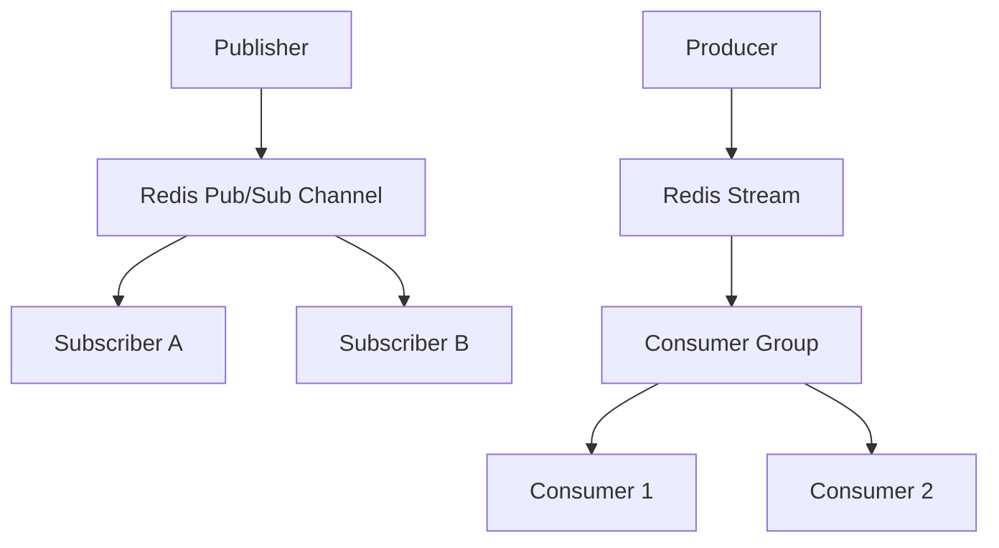

# Exercise 5 - Redis Pub/Sub vs Streams

Compare Redis Pub/Sub (fire-and-forget) with Redis Streams (persistent, append-only log).

**Objectives**:
1. Deploy Redis on Kubernetes via Helm
2. Test Pub/Sub for real-time broadcast (no persistence)
3. Test Streams for persistent message queues with consumer groups
4. Understand the trade-offs between ephemeral and durable messaging

## Context

Redis Pub/Sub is fire-and-forget. Messages vanish after delivery to current subscribers. The CLI syntax follows:

```sh
SUBSCRIBE {channel_name}
PUBLISH {channel_name} {message}
```

Redis Streams are Redis's persistent, append-only log data structure, and support multiple consumers similar to Kafka. The CLI syntax follows:

```sh
XADD {stream_name} * {field1} {value1} {field2} {value2}
XREAD [BLOCK {ms}] STREAMS {stream_name} {start_id}
XGROUP CREATE {stream_name} {group_name} {start_id}
XREADGROUP GROUP {group_name} {consumer_name} STREAMS {stream_name} >
```

Each stream contains an array of messages. A message contains a dictionary (key-value pair).

## Design


## Setup

- Install a bitnami redis helm chart

```sh
# Install Redis without auth
helm install ex-4 oci://registry-1.docker.io/bitnamicharts/redis \
  --set architecture=standalone \
  --set auth.enabled=false
```

## Test

### Redis Pubsub

#### Basic Pubsub

Use `kubectl exec` into the Redis server to run the `redis-cli` binary interactively.

```sh
# Run the below command in two terminal
kubectl exec -it $(kubectl get pods -l app.kubernetes.io/name=redis -o jsonpath='{.items[0].metadata.name}') -- redis-cli
# In terminal 1, subscribe to channel "c1"
SUBSCRIBE c1
# In terminal 2, publish a message to c1 and validate in terminal 1
PUBLISH c1 "Hello, do you copy?"
```

#### No old message persistency

Continuing from the above example, create a third terminal

```sh
# Run the below command to get a third terminal
kubectl exec -it $(kubectl get pods -l app.kubernetes.io/name=redis -o jsonpath='{.items[0].metadata.name}') -- redis-cli
# In terminal 3, subscribe to channel c1, notice that the previous message is not received
SUBSCRIBE c1
# In terminal 2, publish a message to c1 and validate in terminal 1 and 3
PUBLISH c1 "Hello, do you copy? - I repeat"
```

### Redis Stream

Use `kubectl exec` into the Redis server to run the `redis-cli` binary interactively.

```sh
kubectl exec -it $(kubectl get pods -l app.kubernetes.io/name=redis -o jsonpath='{.items[0].metadata.name}') -- redis-cli
# Create a two message
XADD order_stream * order_number "1" price "1.20"
XADD order_stream * order_number "2" price "21.20"
# Read all message in stream
XRANGE order_stream - +
# Read first N message
XREAD COUNT 1 STREAMS order_stream 0-0 # 0-0 indicates message id from beginning
# Read last message
XREAD STREAMS order_stream +
XREVRANGE order_stream + - COUNT 1
```

## Cleanup

```sh
helm uninstall ex-5
kubectl get pvc | grep 'redis-data-ex-5' | awk '{print $1}' | xargs kubectl delete pvc 
```

## References / Appendix

- [Redis Pub/Sub](https://redis.io/docs/latest/develop/interact/pubsub/)
- [Redis Streams](https://redis.io/docs/latest/develop/data-types/streams/)
