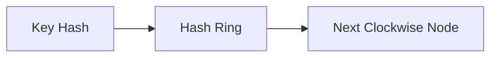

# Exercise 9 - Consistent Hashing

Implement consistent hashing in Python using a two-array structure for efficient distributed data placement.

**Objectives**:
1. Understand consistent hashing fundamentals: hash ring, virtual nodes
2. Implement using two arrays (ring_pos + nodes) with binary search
3. Test data distribution and minimize rebalancing when nodes change
4. Use MD5 for stable, deterministic hashing across sessions

## Context

Consistent hashing is a distributed hashing scheme that operates independently of the number of servers. It is designed to minimize data movement (rebalancing) when nodes are added or removed from a cluster.

Core Concepts
- The Hash Ring: We treat the range of possible hash values (e.g., 0 to 100) as a circular track.
- Node Placement: Servers are hashed and placed at specific positions on this ring.
- The Binary Search: To find which server owns a piece of data, we hash the data key and move clockwise until we hit the first server position.
- Virtual Nodes (Replicas): To prevent "hotspots" (where one server gets too much data), we place each server on the ring multiple times using different names (e.g., Server-A:0, Server-A:1).

The Two-Array Implementation
- ring_pos (Sorted): Stores the numeric positions of servers on the ring.
- nodes: Stores the server names. The name at nodes[i] corresponds to the position at ring_pos[i].

## Setup

This is a pure Python implementation exercise (no Kubernetes deployment required).

## Design



### Core Implementation

```python
import hashlib
import bisect

class ConsistentHash:
    def __init__(self, nodes=None, ring_size=100, replicas=1):
        self.ring_size = ring_size
        self.replicas = replicas
        self.ring_pos = []   # Array 1: Sorted hash positions
        self.nodes = []      # Array 2: Corresponding node names
        
        if nodes:
            for node in nodes:
                self.add_node(node)

    # Hash function to generate index on the ring
    # Using a stable hash like MD5 is better than built-in hash() as it is deterministic unlike hash() which changes between Python sessions.
    def _hash(self, key):
        return int(hashlib.md5(key.encode()).hexdigest(),16)

    def add_node(self, node):
        for i in range(self.replicas):
            # Create a unique string for each replica (e.g., 'Server-A:0')
            replica_key = f"{node}:{i}"
            pos = self._hash(replica_key) % self.ring_size
            
            # Find insertion point to maintain sorted order
            idx = bisect.bisect_left(self.ring_pos, pos)
            
            # Insert at same index in both arrays
            self.ring_pos.insert(idx, pos)
            self.nodes.insert(idx, node)
            print(f"Added {node} (Replica {i}) at position {pos}")

    def get_node(self, key):
        if not self.ring_pos:
            return None
        
        pos = self._hash(key) % self.ring_size
        print(f"Key {key} has a hash value of {pos}")
        
        # Find first node position >= key's position
        idx = bisect.bisect_left(self.ring_pos, pos)
        
        # Wrap around if past the last node
        if idx == len(self.ring_pos):
            idx = 0
            
        return self.nodes[idx]
```

## Test

### Basic usage

With replicas=1, servers are placed once. If a key's hash is higher than the last server, it "wraps around" to the first one.

```python
ch = ConsistentHash(nodes=["Server-A", "Server-B"], ring_size=100)
print(f'User A will be placed in {ch.get_node("User A")}')
```

Sample output

```sh
Added Server-A (Replica 0) at position 56
Added Server-B (Replica 0) at position 93
Key: User A has a hash value of 98
User A will be placed in Server-A
```

The value 98 wrap around to 56 which is server A.

### Virtual nodes (Improved Distribution)

```python
ch = ConsistentHash(nodes=["Server-A", "Server-B"], ring_size=100, replicas=3)
print(f'User A will be placed in {ch.get_node("User A")}')
```

Sample output

```sh
Added Server-A (Replica 0) at position 56
Added Server-A (Replica 1) at position 63
Added Server-A (Replica 2) at position 41
Added Server-B (Replica 0) at position 93
Added Server-B (Replica 1) at position 6
Added Server-B (Replica 2) at position 2
Key User A has a hash value of 98
User A will be placed in Server-B
```

## Cleanup

No cleanup required (pure Python implementation, no external resources).

The value 98 wrap around to 2 which is server B. Each server are better distributed with virtual nodes, essentially having more points on the hash.


#### Rebalancing (Adding a Server)

```python
ch = ConsistentHash(nodes=["Server-A", "Server-B"], ring_size=100)
print(f'User A will be placed in {ch.get_node("User A")}')
ch.add_node("Server-C")
print(f'User A will be placed in {ch.get_node("User A")}')
```

Example output

```sh
Added Server-A (Replica 0) at position 56
Added Server-B (Replica 0) at position 93
Key User A has a hash value of 98
User A will be placed in Server-A
Added Server-C (Replica 0) at position 35
Key User A has a hash value of 98
User A will be placed in Server-C
```

The value 98 wrap around to 35 which is server C.

## References / Appendix

- [Consistent Hashing (Wikipedia)](https://en.wikipedia.org/wiki/Consistent_hashing)
