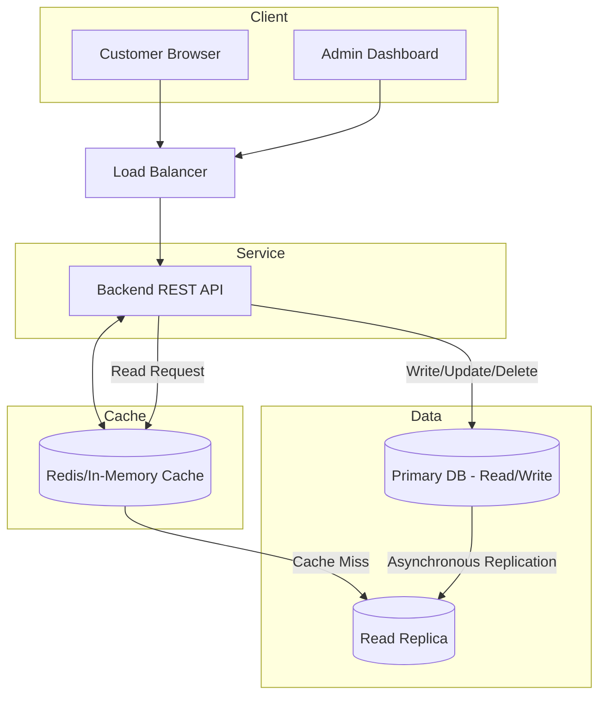

# Exercise 11 - E-commerce API with PostgreSQL Replication

Build a REST API in Rust (Axum) with read/write splitting using CloudNativePG for PostgreSQL replication.

**Objectives**:
1. Deploy CloudNativePG operator to manage PostgreSQL clusters
2. Design a product catalog schema with categories and variants
3. Implement REST API with read/write pool separation
4. Route writes to primary database, reads to replica for load distribution

## Context

### Requirements

For a small shop of 100 items, design a system in which the shop owner can:
- Add a new product
- Update/delete existing product
- List all products on the website
- Customers should be able to access catalog quickly

## Design

### Architecture 

Classic 3 tier architecture: Client -> Server -> DB.

This exercise will only cover the backend and db.



#### Storage

- Small, only 100 rows
- Structured data -> RDB
- Read replicas to handle read

#### Services

- One frontend for client, another for admin and a backend
- REST HTTP
- Scalable
- Frontend by load balancer

#### Cache

- Cache layer before DB 

### Database

#### Schema

```sql
CREATE TABLE categories (
    id SERIAL PRIMARY KEY,
    name VARCHAR(100) UNIQUE NOT NULL,
    created_at TIMESTAMP DEFAULT CURRENT_TIMESTAMP
);

CREATE TABLE products (
    id SERIAL PRIMARY KEY,
    name VARCHAR(255) NOT NULL,
    description TEXT,
    category_id INTEGER REFERENCES categories(id) ON DELETE SET NULL, -- foreign key on category, if category is deleted, set to null
    created_at TIMESTAMP DEFAULT CURRENT_TIMESTAMP
);

CREATE INDEX idx_products_category_id ON products(category_id); -- postgres does not automatically index foreign keys

CREATE TABLE product_variants(
    id SERIAL PRIMARY KEY,
    product_id INTEGER NOT NULL REFERENCES products(id) ON DELETE CASCADE, -- foreign key on product, if product is delete, delete all variant
    sku VARCHAR(100) UNIQUE NOT NULL,
    attributes JSONB NOT NULL,
    price DECIMAL(10, 2) NOT NULL,
    stock_quantity INTEGER DEFAULT 0,
    created_at TIMESTAMP DEFAULT CURRENT_TIMESTAMP
);

CREATE INDEX idx_variants_attributes ON product_variants USING GIN (attributes); -- index on json using GIN to filter attribute 
```

#### Sample data and query

```sql
INSERT INTO categories (name) VALUES 
('Electronics'), 
('Apparel');

INSERT INTO products (name, description, category_id) VALUES
('SuperPhone 13', 'A high-end smartphone', 1),
('DevLaptop Pro', 'Powerful laptop for devs', 1),
('Organic Cotton T-Shirt', 'Soft and sustainable', 2);

INSERT INTO product_variants (product_id, sku, attributes, price, stock_quantity) VALUES
(1, 'SP13-RED-128', '{"color": "Red", "storage": "128GB", "type": "OLED"}', 799.99, 50),
(2, 'LAP-GRY-16', '{"color": "Space Gray", "ram": "16GB", "cpu": "M2"}', 1299.00, 20),
(3, 'TSHIRT-RED-L', '{"color": "Red", "size": "L", "material": "Cotton"}', 25.00, 100);

-- Query by category
SELECT 
    p.name AS product_name, 
    c.name AS category_name, 
    pv.price, 
    pv.stock_quantity AS quantity
FROM products p
JOIN categories c ON p.category_id = c.id
JOIN product_variants pv ON pv.product_id = p.id
WHERE p.category_id = 1;

-- Query by Attribute
-- Using the "Contains" operator (@>) which is powered by a GIN index
SELECT 
    p.name AS product_name, 
    pv.sku, 
    pv.price, 
    pv.stock_quantity AS quantity,
    pv.attributes->>'color' AS color
FROM product_variants pv
JOIN products p ON pv.product_id = p.id
WHERE pv.attributes @> '{"color": "Red"}';
```

## Setup

```sh
# use server-side as the entire state of the object in a "last-applied-configuration" annotation is too big
kubectl apply --server-side -f https://raw.githubusercontent.com/cloudnative-pg/cloudnative-pg/main/releases/cnpg-1.28.0.yaml

# wait for cnpg controller to be running
kubectl get pod -n cnpg-system --watch

# create a db instance with 2 replicas
cat <<EOF | kubectl apply -f -
apiVersion: postgresql.cnpg.io/v1
kind: Cluster
metadata:
  name: my-ecommerce-db
spec:
  instances: 2
  storage:
    size: 1Gi
EOF
```

Run a SQL client and execute the SQL commands from the above section.

```sh
export POSTGRES_PASSWORD=$(kubectl get secret my-ecommerce-db-app -o jsonpath="{.data.password}" | base64 -d)
kubectl run postgresql-client --rm --tty -i --restart='Never' --image registry-1.docker.io/bitnami/postgresql:latest --env="PGPASSWORD=$POSTGRES_PASSWORD" \
      --command -- psql --host my-ecommerce-db-rw  -U app -d app -p 5432
```

Port-forward to allow accessing the db from local

```sh
kubectl port-forward svc/my-ecommerce-db-rw 5432:5432
```

### Rust Catalog Service

Rust files are created under `./resources/ex-11`.

This project is a high-performance backend service for an e-commerce platform. 

### Overview

The application follows a Read-Write Splitting architecture. This is a common production pattern used to scale database-heavy applications.


#### 1. Dual Connection Pooling
Instead of a single database connection, the app maintains two separate `PgPool` instances:
* **RW (Read-Write) Pool:** Connects to the Primary database node. All state-changing operations (`INSERT`, `UPDATE`, `DELETE`) are routed here.
* **RO (Read-Only) Pool:** Connects to Replica nodes. All data fetching (`GET`) is routed here to reduce the load on the Primary node.

#### 2. Transactional Product Logic
The API treats "Products" and "Variants" as a single unit. When adding a product, the code uses **PostgreSQL Transactions**. 
* If the product is created but the variant fails (e.g., a duplicate SKU), the entire operation rolls back.
* This ensures your database never ends up with "orphaned" products that have no pricing or stock information.


#### 3. Strongly Typed Schemas
Unlike interpreted languages, this API uses **compile-time verified queries**. 
* **SQLx Macros:** The `query!` macro connects to your database during compilation to check if your SQL syntax and column types match your Rust structs.
* **Serde Integration:** Automatically maps complex PostgreSQL `JSONB` data into Rust types, allowing for flexible product attributes (like size, color, or technical specs) without losing type safety.

#### Libraries

* **Axum:** A web framework that leverages `tokio` and `tower`. It treats routing like a state machine, making the API fast and memory-efficient.
* **SQLx:** A "raw SQL" library that provides the safety of an ORM without the performance overhead or hidden magic.
* **Tokio:** The industry-standard asynchronous runtime for Rust.


#### Data Flow Lifecycle

1.  **Request:** A JSON payload hits an Axum route.
2.  **Extraction:** Axum validates the JSON structure into a Rust `struct` using `serde`.
3.  **Database:** The app acquires a connection from the relevant pool (RW or RO).
4.  **Transformation:** SQLx converts database rows into `ProductResponse` objects.
5.  **Response:** The result is serialized back to JSON and returned to the client with appropriate HTTP status codes (e.g., `201 Created` or `404 Not Found`).

## Test

```sh
# Create product and capture the ID
NEW_ID=$(curl -s -X POST http://localhost:3000/products \
  -H "Content-Type: application/json" \
  -d '{
    "name": "Mechanical Keyboard",
    "description": "RGB Backlit, Blue Switches",
    "category_id": 1,
    "sku": "KB-RGB-02",
    "price": 89.99,
    "attributes": {
      "color": "Black",
      "switch": "Tactile Blue",
      "layout": "US"
    }
  }' | jq '.id')

# List all products
curl -s -X GET http://localhost:3000/products | jq

# Fetch by ID
curl -s -X GET http://localhost:3000/products/${NEW_ID} | jq

# Update name
curl -X PUT http://localhost:3000/products/${NEW_ID} \
  -H "Content-Type: application/json" \
  -d '{"name": "Ultra-Wide Mechanical Keyboard"}'

# Verify the change
curl -s -X GET http://localhost:3000/products/${NEW_ID} | jq

# Delete product
curl -X DELETE http://localhost:3000/products/${NEW_ID}

# Verify product deleted 
curl -s -X GET http://localhost:3000/products | jq
```

## Cleanup

```sh
kubectl delete cluster my-ecommerce-db
kubectl get pvc | grep 'my-ecommerce-db' | awk '{print $1}' | xargs kubectl delete pvc 
helm uninstall pgdb
kubectl delete -f https://raw.githubusercontent.com/cloudnative-pg/cloudnative-pg/main/releases/cnpg-1.28.0.yaml
```

## References / Appendix

- [CloudNativePG](https://cloudnative-pg.io/documentation/)
- [Axum](https://docs.rs/axum/latest/axum/)