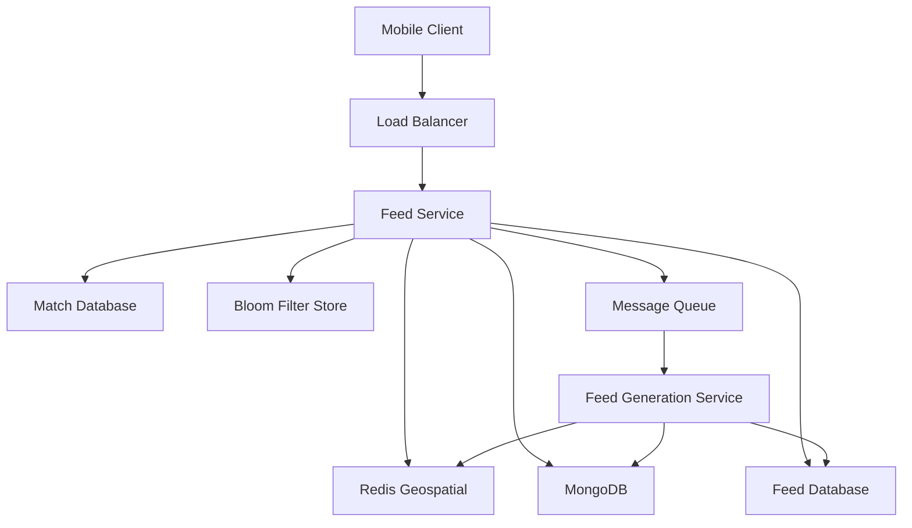
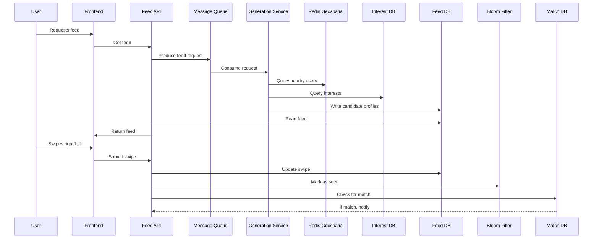
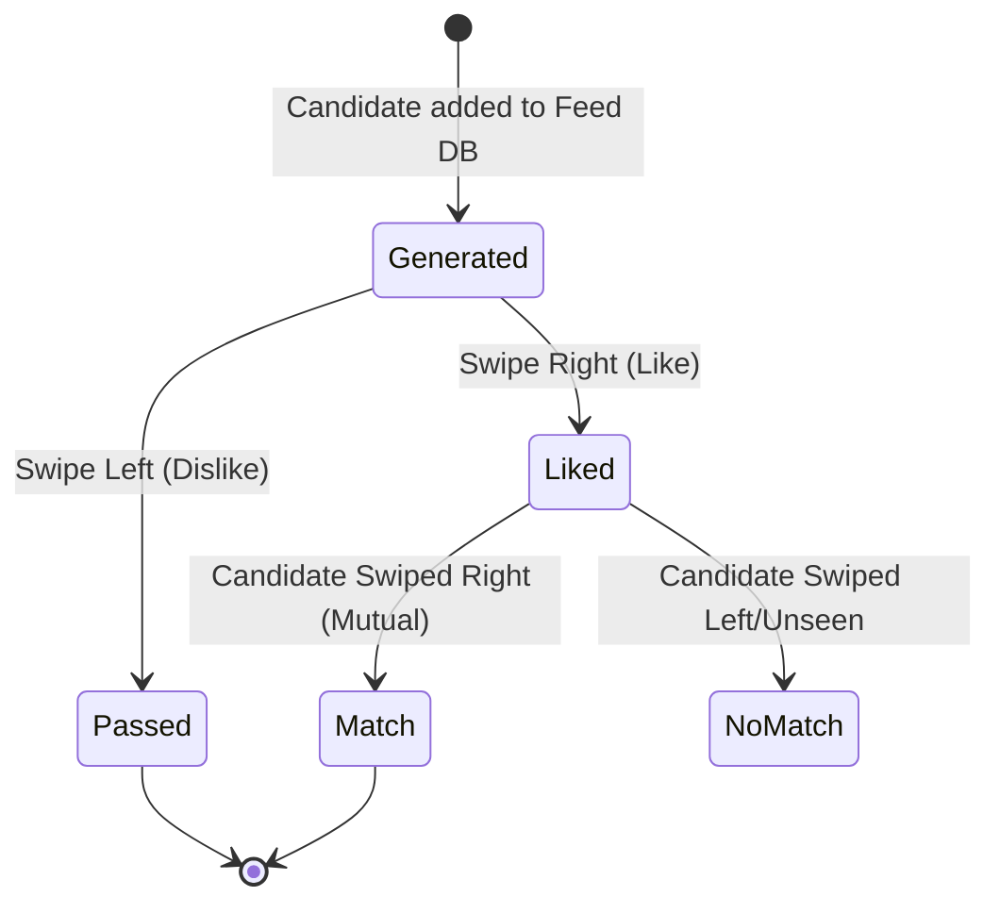

# Exercise 15 - Tinder Feed Recommendation System

Design a scalable, personalized feed system for a dating app that serves relevant profiles to users based on preferences, location, and engagement patterns.

**Objectives**:
1. Design real-time profile recommendation algorithm with proximity-based matching
2. Implement efficient storage and retrieval for user interests and locations
3. Ensure users never see the same profile twice (seen tracking)
4. Handle swipe actions and match detection
5. Discuss trade-offs in feed storage and retrieval

## Context

This is a design-only exercise. The goal is to architect a Tinder-like feed system that:
- Recommends profiles based on proximity and common interests
- Ensures users do not see already-seen profiles
- Handles high throughput and low latency

## Design

### Proximity Handling
- User devices emit location updates every 30s
- Store user ID as key with latitude/longitude as value (e.g., Redis geospatial)
- Use geospatial queries to find nearby users

### Common Interest Enrichment
- Users sign in via auth provider (Google, Facebook, etc.)
- Enrich user profiles with bio/interests from provider
- Store flexible user profile data in MongoDB (schema-less)

### Feed Retrieval
- Combine proximity and interest filters to generate candidate profiles
- Feed can be generated on backend (recommended for consistency and cost)
- Avoid storing candidate lists as arrays (prefer one row per candidate)

#### Feed Storage Options
- **Option A (Normalized)**: Store `(user_id, candidate_id, created_at)`. Requires a read-time fetch of the `candidate_id` profile from the source (e.g., InterestDB). **Recommended:** This keeps the user's feed document lightweight and guarantees fresh profile data (if a candidate updates their bio, it propagates to all user feeds instantly since the feed only holds the ID pointer).
- **Option B (Denormalized)**: Store `(user_id, candidate_full_profile, created_at)`. Optimizes for reads but suffers from massive storage bloat and serves stale profile data if the candidate updates their bio after being loaded into the Feed DB.
- **Anti-pattern**: Avoid storing candidates as an array within the User document itself. Large, unbounded candidate arrays bloat NoSQL documents and slow down insertion iteration by forcing document locks/reallocations.

### Feed Generation Flow
1. Frontend requests feed
2. Produce request to message queue (MQ)
3. Generation service reads user location + interests
4. Writes candidate profiles into Feed DB

### Swipe Handling & Match Detection
- User swipes (like/pass) via Feed API
- Update is_interested in Feed DB
- Check if candidate also swiped (mutual like)
- If match, insert into Match DB

### Seen Tracking
- Use Bloom filters to track seen profiles per user. *Why?*: Bloom filters are space-efficient probabilistic data structures. They guarantee a user never sees the same profile twice (100% true negatives), while accepting a minuscule false-positive rate as a fair trade-off for extreme memory savings.

### Architecture Diagram

### Data Flow: Feed Generation & Swipe

### Swipe Lifecycle Sequence

## Setup

*No deployment needed. This is a purely architectural design exercise.*

## Test

*No validation commands required.*

## Cleanup

*No implementation or teardown required (design-only exercise).*

## References / Appendix

- [Redis Geospatial](https://redis.io/docs/latest/develop/data-types/geospatial/)
- [Redis Bloom Filter](https://redis.io/docs/latest/develop/data-types/probabilistic/bloom-filter/)