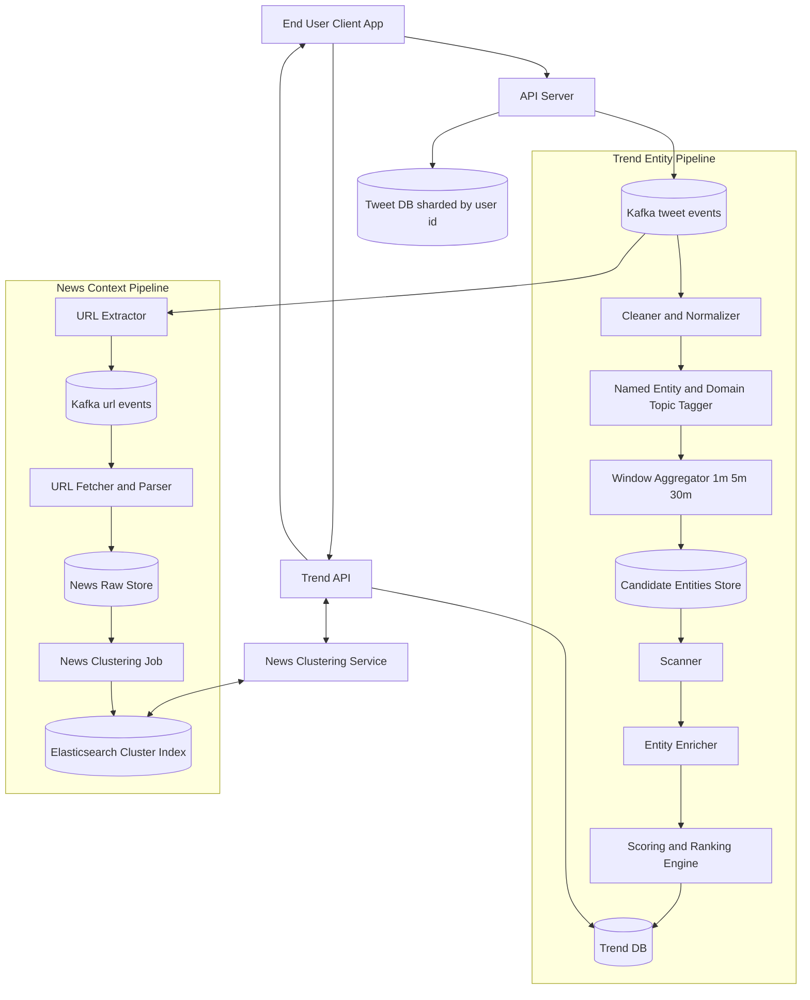
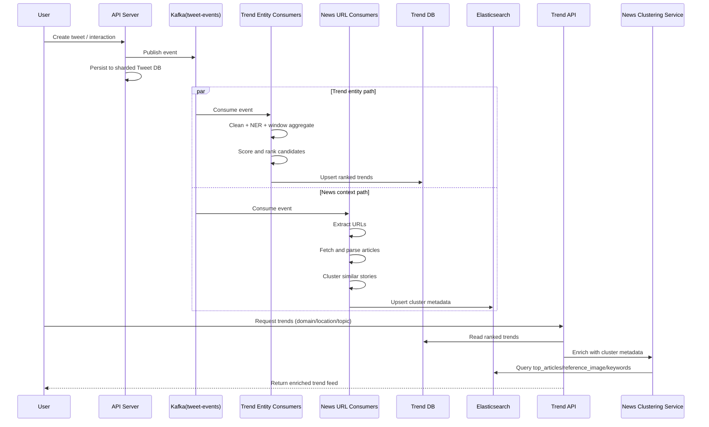
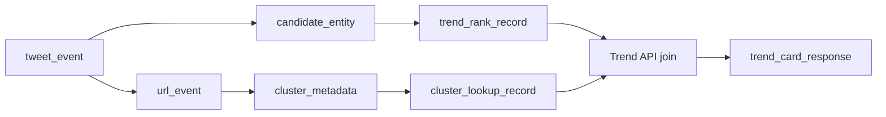
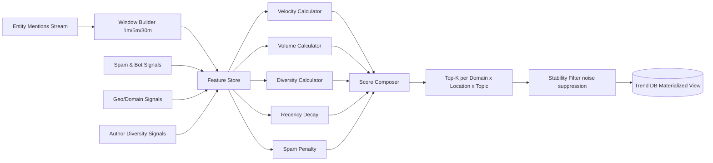

# Exercise 16 - Twitter Trends & News Clustering System Design

Design a near real-time trend system that identifies what is currently happening, enriches it with clustered news context, and serves ranked trends to end users.

**Objectives**:
1. Design a streaming pipeline for trend detection with low-latency updates
2. Build an enrichment pipeline for URLs/news clustering and metadata extraction
3. Compute trend candidates by domain, location, and topic with time-window aggregation
4. Rank and serve trends through a read-optimized API path
5. Explain trade-offs between freshness, quality, and system cost

## Context

“Trending” is time-sensitive: high-quality ranking requires both velocity (what is rising now) and quality signals (what the topic actually refers to).

This exercise combines two parallel streams:
- **Entity Trend Stream**: Extract entities from tweets and score them by time window.
- **News Context Stream**: Extract URLs from tweets, fetch linked pages, cluster related stories, and attach representative metadata.

Why this design:
- A single hot write path (`API -> Kafka`) keeps ingestion fast and resilient.
- Separate consumers let us scale extraction, enrichment, and ranking independently.
- Read-side stores are specialized for query patterns: ranking lookup vs search/cluster metadata.

### Connecting the Dots (How the Page Maps to the System)

If the trend page shows a card with **topic name + score + image + top article links**, each field comes from a different subsystem:

| Trend Page Field | Produced By | Why It Lives There |
| --- | --- | --- |
| Topic/Entity label | Entity extraction + normalization | Raw tweets are noisy; entities provide a canonical topic key |
| Trend score / rank | Scoring and Ranking Engine | Ranking must be fast, windowed, and continuously updated |
| Representative image | News Clustering Pipeline | Images are selected from clustered article context, not tweet text alone |
| Top articles / keywords | News Clustering Service + Elasticsearch | Cluster metadata is search/read heavy and best served from an index |
| Location/domain filters | Windowed aggregates + trend materialization | Needed for fast “what’s trending in X for Y” queries |

In short:
- **Entity pipeline** answers: *What is spiking now?*
- **News clustering pipeline** answers: *What does this trend mean?*
- **Trend API** combines both so the user gets a ranked and explainable trend card.

### Why Two Pipelines Instead of One

These jobs have different performance profiles:
- Trend scoring is lightweight and frequent (seconds-level refresh).
- URL fetching/parsing/clustering is heavier and can lag slightly without breaking UX.

Separating them improves reliability: even if clustering is delayed, ranking can still work, and the API can gracefully degrade by showing topic + score first, then richer metadata when available.

## Design

### Key Subsystems

1. **Ingestion Path**
   - Client posts tweet/event to API.
   - API writes raw events to Kafka.
   - API also persists tweet records in sharded Tweet DB (`user_id` shard key).

2. **Trend Candidate Pipeline**
   - Clean/filter text.
   - Perform Named Entity Recognition (NER) and domain/topic tagging.
   - Aggregate candidate entities by time windows (e.g., 1m, 5m, 30m).
   - Score and rank with recency + velocity + diversity signals.

3. **News Clustering Pipeline**
   - Extract URLs from Kafka events.
   - Fetch article content + metadata.
   - Cluster similar stories.
   - Publish cluster metadata (`top_articles`, `reference_image`, `keywords`) into Elasticsearch.

4. **Serving Path**
   - Trend API reads ranked entities from Trend DB.
   - Trend API calls News Clustering Service for enriched context.
   - End users receive ranked trends with meaningful story summaries.

### Full System Architecture



### End-to-End Data Flow



### Data Contracts and Shape Transformations

This section is grouped by pipeline so the sequencing is explicit.

#### A) Shared Ingestion Contract (source for both pipelines)

`tweet_event` (published once, consumed by both Entity and News Context pipelines)

```json
{
	"event_id": "evt_01J...",
	"tweet_id": "t_19001",
	"user_id": "u_42",
	"text": "Massive quake reported in CityX. Details: https://news.site/a1",
	"hashtags": ["#CityX", "#earthquake"],
	"lang": "en",
	"geo": { "country": "JP", "city": "Tokyo" },
	"created_at": "2026-03-25T10:11:12Z"
}
```

#### B) Entity Trend Pipeline Contracts

`candidate_entity` (windowed aggregate used for ranking)

```json
{
	"window_start": "2026-03-25T10:10:00Z",
	"window_end": "2026-03-25T10:15:00Z",
	"entity_key": "earthquake_cityx",
	"domain": "news",
	"location": "JP",
	"topic": "disaster",
	"mention_count": 1240,
	"unique_authors": 830,
	"velocity_5m": 3.2,
	"spam_score": 0.08
}
```

#### C) News Context Pipeline Contracts

`url_event` (derived from `tweet_event`)

```json
{
	"event_id": "evt_01J...",
	"tweet_id": "t_19001",
	"url": "https://news.site/a1",
	"canonical_url": "https://news.site/a1",
	"created_at": "2026-03-25T10:11:13Z"
}
```

`cluster_metadata` (stored in Elasticsearch, used for enrichment)

```json
{
	"cluster_id": "cl_7781",
	"entity_keys": ["earthquake_cityx"],
	"keywords": ["earthquake", "CityX", "aftershock"],
	"reference_image": "https://cdn.site/img/quake.jpg",
	"top_articles": [
		{ "title": "CityX hit by 6.9 quake", "url": "https://news.site/a1", "source": "NewsSite" },
		{ "title": "Rescue operations begin", "url": "https://news.site/a2", "source": "DailyWire" }
	],
	"updated_at": "2026-03-25T10:15:25Z"
}
```

#### D) Serving Join Output (Trend API)

```json
{
	"entity_key": "earthquake_cityx",
	"display_name": "Earthquake in CityX",
	"score": 91.4,
	"rank": 1,
	"location": "JP",
	"topic": "disaster",
	"velocity_5m": 3.2,
	"cluster": {
		"cluster_id": "cl_7781",
		"reference_image": "https://cdn.site/img/quake.jpg",
		"keywords": ["earthquake", "CityX", "aftershock"],
		"top_articles": [
			{ "title": "CityX hit by 6.9 quake", "url": "https://news.site/a1" }
		]
	}
}
```

### Shape Evolution and Join Points



Join logic in serving layer:
- Primary key from ranking side: `entity_key`
- Lookup key into cluster side: `entity_key -> cluster_id`
- Final response merges rank fields (`score`, `velocity`) with context fields (`reference_image`, `top_articles`, `keywords`)

### Ranking Notes (Example)

A practical ranking signal can be modeled as:

$$
score(e) = \alpha \cdot velocity(e) + \beta \cdot volume(e) + \gamma \cdot diversity(e) + \delta \cdot recency(e) - \lambda \cdot spam(e)
$$

Where `velocity` captures growth in short windows and `diversity` penalizes single-source amplification.

### Ranking Engine Internals (Detailed)



### News Clustering Internals (Detailed)


## Setup

No deployment required. This is a design-only exercise.

## Test

Validate the design against these scenarios:
1. **Breaking event spike**: sudden global growth in one topic
2. **Regional divergence**: same topic trending in one location but not another
3. **Spam burst**: repeated low-quality mentions from coordinated actors
4. **News mismatch**: trend entity exists but no strong cluster metadata yet

Expected outcomes:
- Trend ranking remains fresh and stable across windows.
- Enrichment degrades gracefully when clusters are unavailable.
- Serving API stays responsive under ingestion spikes.

## Cleanup

No teardown required (no infrastructure provisioned).

## References / Appendix

### Elasticsearch Primer

- **Index**: like a table namespace (e.g., `news-clusters-v1`)
- **Document**: one JSON object (e.g., one `cluster_metadata` record)
- **Field**: JSON property inside a document (`keywords`, `top_articles`, `updated_at`)
- **Mapping**: schema/type rules for fields (`keyword`, `text`, `date`, nested objects)
- **Shard**: horizontal partition of an index for scale
- **Replica**: copy of a shard for availability and read scaling
- **Inverted Index**: internal structure that makes text search fast
- **Refresh**: makes recent writes searchable (near real-time, not instant)
- **Query DSL**: JSON-based query language for filtering/ranking

Important distinction:
- `news-clusters-v1` is the **index name** (container/namespace), not a field inside each `cluster_metadata` JSON document.
- A document is stored *inside* an index. The index name is part of the write/read request path (or API call), not usually part of document values.

How this exercise uses Elasticsearch:
- Store `cluster_metadata` documents in a cluster index
- Query by `entity_key` / `cluster_id` in News Clustering Service
- Return `reference_image`, `keywords`, and `top_articles` to Trend API

Example `cluster_metadata` document shape in Elasticsearch:

```json
{
	"cluster_id": "cl_7781",
	"entity_keys": ["earthquake_cityx"],
	"keywords": ["earthquake", "CityX", "aftershock"],
	"reference_image": "https://cdn.site/img/quake.jpg",
	"top_articles": [
		{ "title": "CityX hit by 6.9 quake", "url": "https://news.site/a1", "source": "NewsSite" }
	],
	"updated_at": "2026-03-25T10:15:25Z"
}
```

Example lookup query (conceptual):

```json
{
	"query": {
		"term": { "entity_keys": "earthquake_cityx" }
	},
	"sort": [
		{ "updated_at": "desc" }
	],
	"size": 1
}
```

Suggested index mapping for `news-clusters-v1`:

```json
{
	"mappings": {
		"properties": {
			"cluster_id": { "type": "keyword" },
			"entity_keys": { "type": "keyword" },
			"keywords": { "type": "keyword" },
			"reference_image": { "type": "keyword", "index": false },
			"updated_at": { "type": "date" },
			"top_articles": {
				"type": "nested",
				"properties": {
					"title": {
						"type": "text",
						"fields": {
							"raw": { "type": "keyword", "ignore_above": 256 }
						}
					},
					"url": { "type": "keyword" },
					"source": { "type": "keyword" }
				}
			}
		}
	}
}
```

Why these choices:
- `keyword` fields are best for exact filters and joins (`cluster_id`, `entity_keys`).
- `date` supports recency sorting (`updated_at`).
- `nested` for `top_articles` preserves per-article field relationships during queries.
- `reference_image` is returned but not searched, so indexing can be disabled.

Example API calls (conceptual):

```http
PUT /news-clusters-v1
{ ...mapping above... }
```

```http
POST /news-clusters-v1/_doc/cl_7781
{
	"cluster_id": "cl_7781",
	"entity_keys": ["earthquake_cityx"],
	"keywords": ["earthquake", "CityX", "aftershock"],
	"reference_image": "https://cdn.site/img/quake.jpg",
	"top_articles": [
		{ "title": "CityX hit by 6.9 quake", "url": "https://news.site/a1", "source": "NewsSite" }
	],
	"updated_at": "2026-03-25T10:15:25Z"
}
```

```http
GET /news-clusters-v1/_search
{
	"query": { "term": { "entity_keys": "earthquake_cityx" } },
	"sort": [{ "updated_at": "desc" }],
	"size": 1
}
```

Why Elasticsearch here (trade-off):
- **Pros**: fast filtering/search over semi-structured metadata, flexible schema evolution, good for read-heavy enrichment
- **Cons**: eventual consistency semantics, added operational complexity, not a replacement for transactional OLTP databases

- [Apache Kafka Documentation](https://kafka.apache.org/documentation/)
- [Elasticsearch Guide](https://www.elastic.co/guide/en/elasticsearch/reference/current/index.html)
- [Named Entity Recognition Overview](https://en.wikipedia.org/wiki/Named-entity_recognition)
- [DBSCAN Clustering](https://scikit-learn.org/stable/modules/generated/sklearn.cluster.DBSCAN.html)
- [HDBSCAN Documentation](https://hdbscan.readthedocs.io/en/latest/)