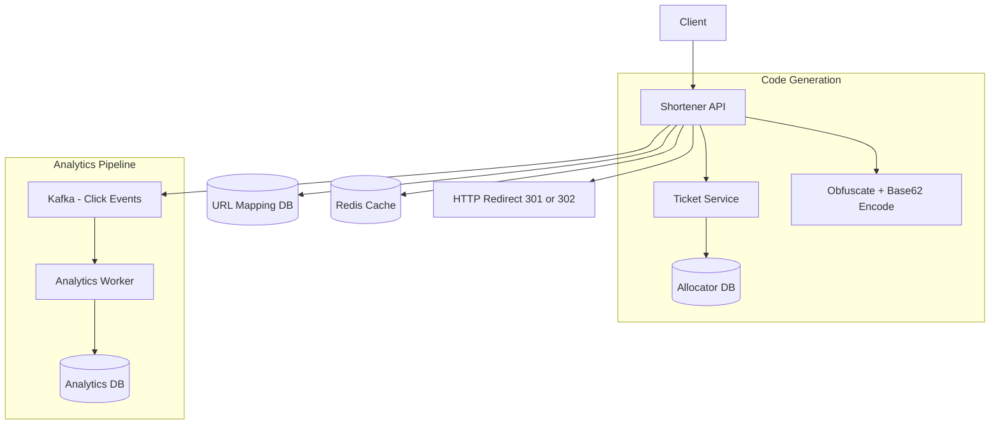
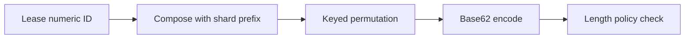
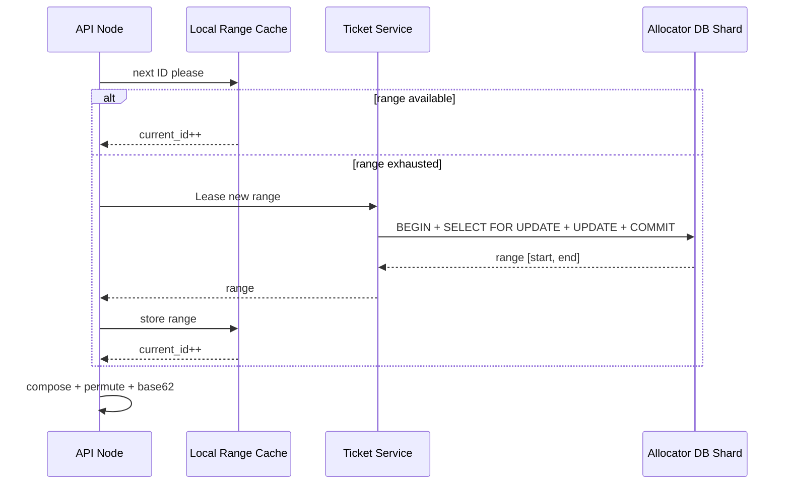
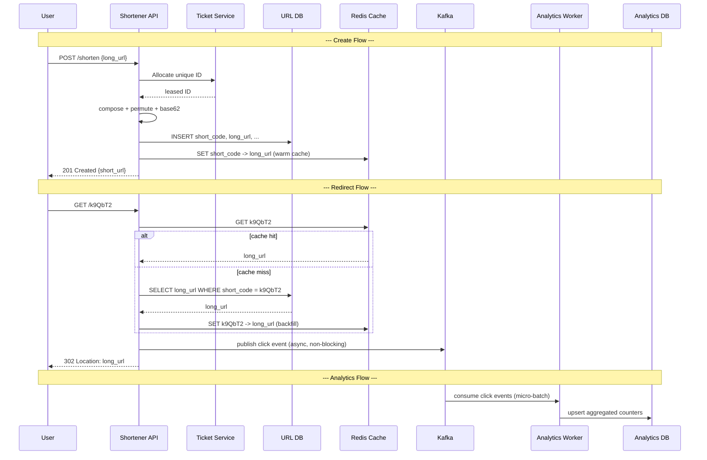

# Exercise 17 - URL Shortener System Design

## Objectives

1. Understand the anatomy of a URL shortener and why it is a classic system-design exercise.
2. Compare short-code generation strategies and justify a production-safe choice.
3. Design low-latency redirect and create flows with cache and persistent storage.
4. Reason about 301 vs 302 redirects and their impact on analytics and caching.
5. Add analytics ingestion via an asynchronous pipeline without slowing redirects.
6. Capture trade-offs between predictability, collision risk, and operational complexity.

## Context

### What Does a URL Shortener Do?

A URL shortener turns a long URL like

```
https://example.com/products/electronics/smartphones/galaxy-s25?ref=campaign-spring
```

into a short, shareable link such as `https://sho.rt/k9QbT2`. When someone visits the short link the service looks up the original URL and redirects the browser there.

Behind this simple interface lie several distributed-systems challenges:

- **Read-heavy traffic** — redirects vastly outnumber creates (often 100 : 1 or more).
- **Low-latency requirement** — every redirect adds delay to the user's navigation; it must be fast.
- **Code-generation safety** — short codes should not be easily guessable, or an attacker could enumerate and scrape all stored URLs.

### Why This Problem Is a Classic Design Exercise

URL shortening touches a broad set of backend concepts in a compact scope:

| Concept | Where It Appears |
| --- | --- |
| Unique ID generation | Ticket service, range allocation |
| Caching | Redis for the redirect hot-path |
| Persistent storage | URL mapping DB |
| Async event streaming | Kafka for click analytics |
| Encoding and obfuscation | Base62, Feistel permutation |
| HTTP semantics | 301 vs 302 redirect |

### Requirements

**Functional**:

1. Shorten a long URL and return a short code.
2. Redirect a short code to the original URL (HTTP 301 / 302).
3. Optional: custom alias, link expiration, per-link analytics dashboard.

**Non-functional**:

- High availability on the redirect path.
- Low latency (< 10 ms p99 redirect with cache hit).
- Short codes must be hard to enumerate.
- System handles 100 M new URLs / month.

### Design Assumptions (Back-of-Envelope)

| Parameter | Value | Notes |
| --- | --- | --- |
| New URLs / month | 100 M | ~38 creates / sec on average |
| Read : write ratio | ~100 : 1 | ~3 800 redirects / sec on average |
| Code alphabet | Base62 (`a-z`, `A-Z`, `0-9`) | URL-safe, no special characters |
| Code length | 3 – 8 characters | $62^7 \approx 3.5 \times 10^{12}$ capacity at length 7 |
| Average long URL size | ~120 bytes | |
| Retention | configurable TTL per link | |

## Design

### Full System Architecture (Big Picture)

Before diving into individual components, here is the end-to-end view:



| Component | Role |
| --- | --- |
| **Shortener API** | Stateless HTTP service handling *create* and *redirect* requests. |
| **Ticket Service** | Provides globally unique numeric IDs via range leasing. |
| **Allocator DB** | Stores range-lease state (small, write-heavy, strongly consistent). |
| **Obfuscate + Encode** | Transforms sequential IDs into non-predictable Base62 codes. |
| **URL Mapping DB** | Persistent store for `short_code → long_url` lookups. |
| **Redis Cache** | Caches hot short-code mappings for sub-millisecond redirects. |
| **Kafka** | Buffers click events asynchronously so redirects stay fast. |
| **Analytics Worker** | Consumes click events and aggregates counters into the analytics DB. |

### Strategy Comparison — How to Generate Short Codes

Before committing to an approach, compare the four main strategies:

| # | Strategy | Pros | Cons |
| --- | --- | --- | --- |
| 1 | **Hash the URL** (MD5 / SHA → truncate → Base62) | Deterministic: same URL → same code | Truncation causes collisions; same URL shared across users may be undesirable |
| 2 | **Sequential integer → Base62** | Simple, zero collisions | Predictable: `abc001`, `abc002` — easy to enumerate |
| 3 | **Random ID → Base62** | Harder to guess | Must handle collisions (retry loop); harder to debug |
| 4 | **Ticket ID + obfuscation + Base62** ⭐ | Collision-free *and* non-predictable | More moving parts (ticket service + key management) |

> **Recommendation**: Strategy 4 gives the best balance of safety and operability. The rest of this tutorial designs around it.

> **What is Base62?**
> Base62 encodes an integer using the 62 characters `a–z`, `A–Z`, `0–9`. It is URL-safe (no `+`, `/`, or `=` like Base64) and produces compact, human-readable strings. For example, the decimal number `238 327` encodes to `"zzz"` in Base62 ($62^3 - 1$).

### Recommended Encoding Pipeline

The short-code generation process is a deterministic pipeline with four stages:



**Stage by stage**:

1. **Allocate a unique numeric ID** from the ticket service (detailed in the next section). Each API node holds a leased range and increments a local counter — no network call per request.

2. **Compose a globally unique numeric key** by bit-packing the shard ID and the leased ID:

   ```
   composed_id = (shard_id << 40) | leased_id
   ```

   > **Bit-packing primer**: The `<<` operator shifts bits to the left. `(2 << 40)` places the shard ID `2` into the upper bits of a 64-bit integer, leaving 40 lower bits (room for ~1 trillion IDs) for the leased ID. The `|` (bitwise OR) combines them into one number. Think of it like writing the shard number on the left side of a very long form, and the ID on the right — they share the same field but never overlap.

3. **Apply a keyed reversible permutation** so that adjacent IDs produce wildly different outputs:

   ```
   obfuscated = Permute(composed_id, secret_key)
   ```

   > **What is a Feistel permutation?**
   > A Feistel cipher splits the input into two halves and mixes them through several rounds using a secret key. The transform is *bijective* — every input maps to exactly one unique output and vice versa. This guarantees **zero collisions** while making the output look random to anyone who does not know the key.

4. **Base62-encode** the obfuscated integer to produce the human-readable short code:

   ```
   short_code = base62(obfuscated)   // e.g. "k9QbT2"
   ```

5. **Enforce length policy** — left-pad if shorter than 3 characters; if longer than 8, trigger a key-version rotation and re-encode.

6. *(Optional)* Embed a tiny version tag or checksum so the system can detect which secret-key generation was used during decoding.

**Pseudo-flow summary**:

```text
id         <- lease.next()
composed   <- pack(shard_id, id)
obfuscated <- permute(composed, active_secret)
short_code <- base62(obfuscated)
short_code <- enforce_length(short_code, min=3, max=8)
```

**Why this pipeline?**

- **Uniqueness** comes from the ticket ID — no random-collision retries.
- **Unpredictability** comes from the secret-key permutation.
- **Compactness** comes from Base62 encoding.
- **Reversibility** — given the key version, the API can decode a short code back to the internal ID for debugging.

### Range Allocation Design (Ticket Service)

Issuing one ID at a time from a central database would create a bottleneck at scale. Instead, each API node **leases a range** of IDs in bulk and then serves them locally from an in-memory counter.

**Core idea**: global uniqueness comes from DB-backed range leasing; high throughput comes from local counters.

#### Range Lease Table (Allocator DB)

| Column | Type | Meaning |
| --- | --- | --- |
| `allocator_key` | `VARCHAR` PK | Logical namespace, e.g. `url_shortener_shard_2` |
| `next_id` | `BIGINT` | The next unleased global ID |
| `range_size` | `INT` | How many IDs per lease (e.g. 10 000) |
| `updated_at` | `TIMESTAMP` | Audit / observability |

#### Lease Operation (Single Transaction)

```sql
BEGIN;
  SELECT next_id
    FROM allocator
   WHERE allocator_key = 'url_shortener_shard_2'
     FOR UPDATE;                        -- lock the row

  -- Suppose next_id is currently 9,000,000.
  -- Allocate range [9,000,000 .. 9,009,999].

  UPDATE allocator
     SET next_id    = next_id + range_size,
         updated_at = NOW()
   WHERE allocator_key = 'url_shortener_shard_2';
COMMIT;
-- Return start = 9,000,000  end = 9,009,999 to the API node.
```

> **What does `SELECT … FOR UPDATE` do?**
> It acquires a row-level lock so that no other transaction can read or modify this row until the current transaction commits. This prevents two API nodes from accidentally leasing the same range.

#### On Each API Node

- Keep `current_id` and `end_id` in memory.
- On each request, return `current_id++`.
- When `current_id > end_id`, request a new lease.
- **Prefetch optimisation**: request the next range when ~80 % consumed to avoid a latency spike at exhaustion.

#### Multiple Allocator Shards

A single allocator row can become a hot-spot under extreme lease frequency. To spread the load, maintain **M allocator shards**, each with its own independent sequence:

| Shard | `allocator_key` | Independent sequence |
| --- | --- | --- |
| 0 | `url_shortener_shard_0` | 0 → 9 999 → 10 000 → … |
| 1 | `url_shortener_shard_1` | 0 → 9 999 → 10 000 → … |
| 2 | `url_shortener_shard_2` | 0 → 9 999 → 10 000 → … |
| 3 | `url_shortener_shard_3` | 0 → 9 999 → 10 000 → … |

Each API node selects a shard deterministically:

```
shard = hash(node_id) % M
```

Because the `composed_id` includes the shard ID in its upper bits, IDs from different shards **never collide** — even though each shard's local sequence starts at zero.

#### Tuning the Range Size

| Larger range (e.g. 100 k) | Smaller range (e.g. 1 k) |
| --- | --- |
| Fewer DB round-trips | More DB round-trips |
| More wasted IDs on node crash | Less waste |
| Better for high-QPS nodes | Better for bursty / low-QPS nodes |

> ID gaps from unused ranges are cosmetic — they do not affect correctness for a URL shortener.

### Ticket + Encode Sequence



### Worked Example (End-to-End Numeric Walkthrough)

Concrete numbers make the pipeline tangible. Walk through a single create request:

| Step | Value | Explanation |
| --- | --- | --- |
| **Allocator shards** | M = 4 | Four independent allocator rows |
| **API node** | `node-a` | The server handling this request |
| **Shard selection** | `hash("node-a") % 4 = 2` | `node-a` always uses shard 2 |
| **Leased range** | `[9,000,000 .. 9,009,999]` | 10 k IDs from shard 2 |
| **Next local ID** | `9,000,123` | 124th ID consumed from this lease |
| **Compose** | `(2 << 40) \| 9,000,123 = 2,199,032,255,675` | Shard 2 in upper bits, leased ID in lower bits |
| **Permute** | `Permute(2199032255675, key_v3) = 891,402,563,817` | Feistel shuffle — looks nothing like the input |
| **Base62 encode** | `base62(891402563817) = "k9QbT2"` | 6 characters — within the [3, 8] policy |
| **Length check** | pass (6 chars) | No padding or rotation needed |

**Stored record**:

```json
{
  "short_code": "k9QbT2",
  "long_url": "https://example.com/some/very/long/path",
  "id_internal": 2199032255675,
  "shard_id": 2,
  "key_version": "v3",
  "created_at": "2026-03-30T10:15:00Z",
  "expires_at": null,
  "status": "active"
}
```

**Why this matters**: the user sees `k9QbT2` — a short, random-looking code. Under the hood the system never performed a collision check, never called a random-number generator, and can deterministically reverse the code back to the internal ID (given the correct key version).

### Redirect: 301 vs 302

When the API finds the long URL for a given short code it must choose an HTTP status for the redirect. This seemingly small choice has significant design consequences:

| | **301 Moved Permanently** | **302 Found (Temporary)** |
| --- | --- | --- |
| Browser behaviour | Caches the redirect; future visits skip the shortener entirely | Does **not** cache; browser always hits the shortener |
| Analytics impact | Under-counts clicks (cached redirects are invisible to the server) | Every click passes through the API — accurate counts |
| CDN / proxy behaviour | Intermediate proxies may cache aggressively | Each request reaches origin |
| Best for | Static, never-changing mappings where maximum speed matters | Links that may expire, change destination, or need analytics |

> **Recommendation**: use **302** by default. Click analytics and expiration support both require every request to reach the API. Reserve 301 for a premium "permanent link" tier where speed is paramount and analytics are not needed.

### Caching Strategy

The redirect path is extremely latency-sensitive. A **cache-aside** pattern with Redis keeps p99 low:

1. On **create** — write `short_code → long_url` to both the DB and Redis (*cache warming*).
2. On **redirect**:
   - Check Redis first.
   - On hit → redirect immediately.
   - On miss → query DB, backfill Redis, then redirect.
3. **TTL** — set the Redis TTL equal to the link's `expires_at` (or a sensible default like 24 h for permanent links). This handles expiration automatically.
4. **Eviction** — use an LRU eviction policy. With a 95 %+ cache-hit-ratio target, size the Redis instance to hold the hot working set (often the most recent few months of URLs).

> **Why Redis and not a local in-process cache?** Multiple API nodes share the same Redis instance, so a cache-warm performed by one node benefits all others. A local cache would suffer cold starts on every node and duplicate memory across the fleet.

### Custom Aliases and Expiration

**Custom aliases** (e.g. `sho.rt/my-brand`):

- The user provides a desired code instead of receiving a generated one.
- Before accepting, check for conflicts: `INSERT … ON CONFLICT DO NOTHING` (or equivalent).
- If the alias is taken, return **HTTP 409 Conflict** with a clear error message.
- Custom aliases bypass the ticket / encode pipeline entirely — they are just a direct `short_code → long_url` insert.

**Expiration**:

- Each URL mapping has an optional `expires_at` timestamp.
- On redirect, if `NOW() > expires_at`, return **HTTP 410 Gone** (or a friendly "this link has expired" landing page).
- Redis TTLs naturally evict expired entries; a background sweep can periodically archive or hard-delete expired rows from the DB.

### Storage Model

**Primary lookup table** (`url_mappings`):

| Column | Type | Notes |
| --- | --- | --- |
| `short_code` | `VARCHAR(8)` PK | Indexed for redirect lookup |
| `long_url` | `TEXT` | Original URL |
| `id_internal` | `BIGINT` | Composed numeric ID (for reverse lookup / debugging) |
| `shard_id` | `SMALLINT` | Which allocator shard generated this ID |
| `key_version` | `VARCHAR(4)` | Permutation key version (e.g. `v3`) |
| `owner_id` | `UUID` nullable | Who created the link |
| `created_at` | `TIMESTAMP` | |
| `expires_at` | `TIMESTAMP` nullable | `NULL` means never expires |
| `status` | `ENUM` | `active` · `disabled` · `expired` |

**Analytics event** (append-only, written to Kafka):

| Field | Type | Notes |
| --- | --- | --- |
| `short_code` | `VARCHAR(8)` | Which link was clicked |
| `clicked_at` | `TIMESTAMP` | Event time |
| `ip_hash` | `VARCHAR(64)` | Privacy-preserving hashed IP |
| `country` | `VARCHAR(2)` | GeoIP lookup |
| `ua_family` | `VARCHAR(32)` | Parsed user-agent (e.g. Chrome, Safari) |
| `referrer` | `TEXT` | HTTP `Referer` header |

**Sizing back-of-envelope**:

- 100 M URLs / month × (~8 B code + ~120 B URL + ~50 B metadata) ≈ **17 GB / month** raw.
- At 100 : 1 read ratio, analytics events dominate storage long-term. A columnar analytics DB (ClickHouse, BigQuery) handles this efficiently.

### Analytics Pipeline

The redirect path must not block on analytics writes. An asynchronous pipeline decouples the two concerns:

1. **Emit** — on every redirect the API publishes a lightweight click event to a **Kafka topic**.
2. **Buffer** — Kafka absorbs traffic spikes without back-pressuring the API.
3. **Consume** — an Analytics Worker reads events in micro-batches and upserts aggregated counters (clicks per day, per country, per user-agent) into the Analytics DB.

> **Why Kafka instead of writing directly to the analytics DB?** Direct writes would couple redirect latency to analytics-DB performance. During traffic spikes, analytics inserts could slow down or fail, degrading the user-facing redirect. Kafka acts as a shock absorber — the redirect returns in milliseconds regardless of downstream lag.

### End-to-End Data Flow (Create + Redirect + Analytics)



### Trade-offs Summary

| Decision | Option A | Option B | This Design Chooses |
| --- | --- | --- | --- |
| Code generation | Random (retry on collision) | Ticket + obfuscation (no collision) | **Ticket + obfuscation** |
| Redirect status | 301 (browser-cached, faster) | 302 (always hits API) | **302** — enables analytics and expiration |
| Analytics writes | Synchronous (strong consistency) | Async via Kafka (eventual) | **Async** — keeps redirect latency low |
| Cache layer | Local in-process cache | Shared Redis | **Redis** — shared across nodes |
| Range size | Large (fewer leases, more waste) | Small (more leases, less waste) | **Tunable** per node QPS |
| Custom aliases | Same encoding pipeline | Separate conflict-check path | **Separate** path with DB uniqueness constraint |

## Setup

No deployment required. This is a design-only exercise.

## Test

Validate the design by reasoning through these scenarios:

| # | Scenario | Expected Behaviour |
| --- | --- | --- |
| 1 | High-QPS redirect spike | Cache hit ratio > 95 %; Redis absorbs load; DB sees < 5 % of traffic. |
| 2 | Cache cold start (e.g. Redis restart) | DB fallback keeps redirects within SLA; cache refills organically on misses. |
| 3 | Custom alias conflict | API returns **409 Conflict**; user picks a different alias. |
| 4 | Expired short URL | API returns **410 Gone**; Redis TTL auto-evicts; DB row marked `expired`. |
| 5 | API node crash mid-range | Unused IDs in the lost range are wasted (acceptable); no duplicates are possible. |
| 6 | Analytics lag during Kafka consumer restart | Redirects are completely unaffected; analytics counters catch up once the consumer resumes. |

## Cleanup

No teardown required (no infrastructure provisioned).

## References / Appendix

- [Base62 Encoding](https://en.wikipedia.org/wiki/Base62) — Wikipedia overview of the encoding scheme.
- [Feistel Cipher](https://en.wikipedia.org/wiki/Feistel_cipher) — the permutation structure used for ID obfuscation.
- [Twitter Snowflake](https://en.wikipedia.org/wiki/Snowflake_ID) — a related distributed ID-generation pattern.
- [Kafka Documentation](https://kafka.apache.org/documentation/) — event-streaming platform used for analytics.
- [HTTP 301 vs 302](https://developer.mozilla.org/en-US/docs/Web/HTTP/Status/302) — MDN reference on redirect semantics.
