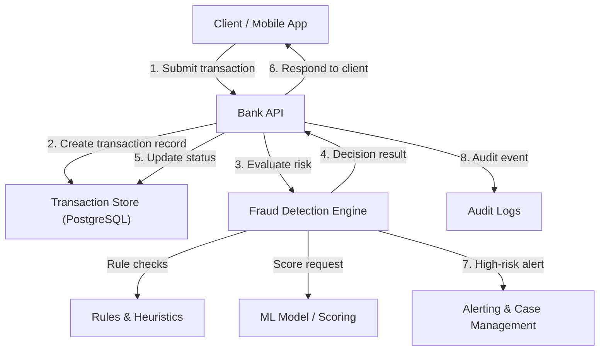
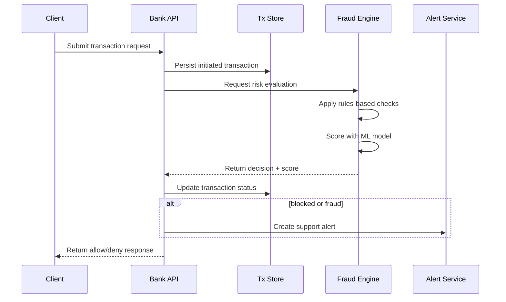

# Exercise 19 - Fraud Detection System

## Objectives
1. Describe an online fraud detection architecture for transaction processing.
2. Model transaction metadata and decision state in a relational store.
3. Compare classification and rules-based detection with a real-time blocking workflow.
4. Explain how alerts and investigation handoff integrate with support systems.
5. Understand the role of machine learning models like Random Forest in fraud detection.

## Context

Fraud detection is a critical backend engineering challenge where speed, accuracy, and explainability must coexist. The system must decide whether to allow, block, or escalate a transaction before it completes, while preserving auditability and enabling operational response.

Fraudulent activities often involve subtle patterns that are difficult to detect using simple rules. Machine learning models, such as Random Forests, are widely used to identify these patterns by analyzing historical data and making predictions based on multiple decision trees. This design-only exercise focuses on architecture, data flow, and trade-offs rather than implementation.

## Design

### System goals
- Detect fraudulent behavior in real time
- Block suspicious transactions before settlement
- Keep the customer experience fast for legitimate users
- Provide a clear audit trail for investigation and compliance
- Enable support and security teams to act on alerts

### Core components
- **Bank API**: Receives transaction requests and orchestrates checks.
- **Fraud Engine**: Evaluates risk using rules, anomaly detection, and machine learning.
- **Transaction Store**: Persists metadata, decision state, and audit history.
- **Alerting / Operations**: Notifies support agents and logs incidents.

### Architecture



### Data model

A simple relational schema captures the transaction lifecycle, risk metadata, and decision history.

```sql
CREATE TABLE transactions (
  transaction_id BIGSERIAL PRIMARY KEY,
  source_account TEXT NOT NULL,
  target_account TEXT NOT NULL,
  amount NUMERIC(18,2) NOT NULL,
  currency CHAR(3) NOT NULL,
  created_at TIMESTAMPTZ DEFAULT NOW(),
  status VARCHAR(20) NOT NULL CHECK (status IN ('initiated', 'allowed', 'blocked', 'fraud', 'review')),
  risk_score NUMERIC(5,2),
  reason TEXT,
  decision_source VARCHAR(50),
  analyst_ticket_id TEXT
);

CREATE TABLE transaction_events (
  event_id BIGSERIAL PRIMARY KEY,
  transaction_id BIGINT NOT NULL REFERENCES transactions(transaction_id) ON DELETE CASCADE,
  event_type VARCHAR(50) NOT NULL,
  event_payload JSONB,
  created_at TIMESTAMPTZ DEFAULT NOW()
);
```

### Decision workflow



### Fraud detection techniques

#### Rules-based checks
Rules-based systems are the first line of defense in fraud detection. They are simple, fast, and explainable. Examples include:
- **Velocity thresholds**: Count transactions per account within a time window.
- **Blacklists**: Block known suspicious accounts, IPs, or device IDs.
- **Amount anomalies**: Flag unusually large transfers compared to historical patterns.

#### Machine learning models
Machine learning models, such as Random Forests, are used to detect complex fraud patterns that rules cannot capture. 

- **Random Forests**: A Random Forest is an ensemble learning method that combines multiple decision trees to improve prediction accuracy. Each tree is trained on a random subset of the data and features, and the final prediction is made by aggregating the outputs of all trees (e.g., majority voting for classification).
  - **Advantages**:
    - Handles large datasets with high dimensionality.
    - Robust to overfitting due to averaging across trees.
    - Provides feature importance scores, aiding explainability.
  - **Example features for fraud detection**:
    - Transaction amount, source/target account profiles, geolocation, time of day.
    - Historical transaction patterns, device/browser fingerprints, IP reputation.

#### Hybrid decision-making
Combining rules and machine learning provides the best of both worlds:
- **Low risk**: Allow immediately.
- **Medium risk**: Require manual review or additional multi-factor authentication (MFA).
- **High risk**: Block and escalate to support teams.

### Trade-offs

- **Latency vs accuracy**
  - Simple rule checks are fast and explainable.
  - Complex ML scoring improves detection but may add processing time.
- **Blocking speed vs false positives**
  - Aggressive thresholds reduce fraud but increase legitimate transaction disruption.
  - A review queue preserves customer experience while still capturing risk.
- **Auditability vs model opacity**
  - Store decision rationale and rule hits for each transaction.
  - Use human-readable reasons alongside model scores for investigations.

## Setup

No deployment required. This exercise is design-only.

## Test

No runtime tests required. Instead, validate the design by reviewing these questions:

1. Can the API decide before settlement and still maintain an audit trail?
2. Does the schema support both instantaneous decisions and later manual review?
3. Are alerts generated for suspicious transactions without impacting normal flow?
4. Would the architecture scale if the transaction volume increases?
5. How does the Random Forest model handle new fraud patterns or adapt to evolving threats?

## Cleanup

No cleanup required.

## References / Appendix

- [OWASP Fraud Detection Cheat Sheet](https://cheatsheetseries.owasp.org/)
- [Pattern: Fraud Detection Systems](https://martinfowler.com/articles/fraud-detection.html)
- [PostgreSQL JSONB and audit logs](https://www.postgresql.org/docs/current/datatype-json.html)
- [Random Forest Algorithm](https://en.wikipedia.org/wiki/Random_forest)
