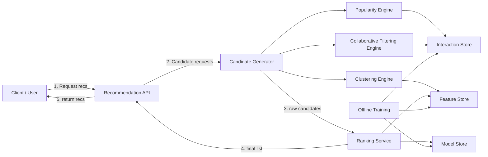

# Exercise 20 - Recommendation Engine

## Objectives
1. Understand the fundamentals of recommendation systems.
2. Compare naive, clustering, and collaborative filtering approaches.
3. Learn the difference between exploitation and exploration in recommendations.
4. Design a modular architecture for real-world recommendation services.
5. Explore the data, algorithmic choices, and evaluation trade-offs behind each component.

## Context

Recommendation engines are a core technology for products that must surface relevant items from large catalogs. They are used in e-commerce, content platforms, streaming services, and social feeds.

A practical recommendation system needs to solve two major problems:
- **Personalization**: Deliver items that match a user’s tastes.
- **Scalability**: Serve many users and items with low latency.

This tutorial helps learners move from a simple baseline to stronger machine learning solutions, showing why each component exists and how it contributes to better recommendations.

## Design

### Why multiple recommendation approaches?

No single algorithm is perfect. The design of a recommendation system should start from the simplest workable solution and grow in complexity only when the business needs justify it.

The three approaches covered here form a progression:
- **Naive popular items** solves cold start and provides a baseline.
- **Clustering** exploits known preferences using item/user features.
- **Collaborative filtering** explores hidden associations by learning from similar users.

These strategies are often combined in a hybrid system so that the engine can deliver reliable recommendations across different scenarios.

### Key concepts

- **Cold start**: The difficulty of recommending items for new users or new items with little interaction history.
- **Exploitation**: Recommending what is already known to work well for a user or similar users.
- **Exploration**: Recommending new or less obvious items to discover additional user interests.
- **Candidate generation**: Producing a small set of item candidates from a large catalog.
- **Ranking**: Ordering candidates by relevance for the final recommendation list.

### 1. Naive Approach: Most Popular Items

The simplest recommendation method is to rank items by their popularity and show the top items.

#### Why it exists
- It provides an immediate fallback when no personalization data is available.
- It is cheap to compute and easy to deploy.
- It solves the cold start problem for new users.

#### How it works
- Collect interaction counts such as views, purchases, likes, or clicks.
- Optionally weight recent events more heavily to capture freshness.
- Rank items by aggregate score.
- Serve the top K items to users.

#### Example implementation
- Increment counters in an event store or database.
- Periodically compute the top-N list in a batch job.
- Store the list in a cache for quick reads.

```sql
SELECT item_id, SUM(weighted_score) AS score
FROM item_events
GROUP BY item_id
ORDER BY score DESC
LIMIT 100;
```

#### What it teaches learners
- How to build a baseline model.
- Why popularity alone is not enough for personalization.
- The importance of caching and batch pipelines in recommendation systems.

#### Strengths and weaknesses
- Strengths: low latency, easy to maintain, good for cold start and new users.
- Weaknesses: no personalization, low diversity, popularity bias.

### 2. Machine Learning Approach: Clustering (Exploitation)

Clustering groups similar items or users by feature similarity and recommends items from the same group.

#### Why it exists
- It moves beyond global popularity and begins to personalize recommendations.
- It is a natural next step when item features are available.
- It uses exploitation: recommend more of what a user already appears to like.

#### How it works
- Define features for items or users.
  - Item features: category, price range, brand, tags, text embeddings.
  - User features: age group, location, favorite categories, average order value.
- Normalize and encode features.
- Apply a clustering algorithm such as K-Means.
- Assign each item/user to a cluster.
- Recommend items from the same cluster as the user or their recent interactions.

#### Algorithms and data structures
- **K-Means**: partitions entities into K clusters by minimizing within-cluster variance.
- **DBSCAN**: finds dense clusters and can identify outliers.
- **Feature store**: stores precomputed feature vectors for fast access.
- **Lookup table**: maps item IDs to cluster IDs and user IDs to cluster preferences.

#### Practical example
If a user has interacted mostly with electronics products, the clustering engine may place them in a tech cluster and surface other electronics items from that cluster.

#### What it teaches learners
- The role of feature engineering in recommendation quality.
- How to build a mid-level personalized system from raw metadata.
- The difference between item similarity and user similarity.

#### Strengths and weaknesses
- Strengths: personalized, interpretable, useful when item/user metadata is rich.
- Weaknesses: still limited in exploration, requires careful feature design, and has a cold start issue for completely new items/users.

### 3. Collaborative Filtering: Similar Users and Similar Items (Exploration)

Collaborative filtering predicts what a user will like based on how similar users behaved.

#### Why it exists
- It can recommend items without explicit item metadata.
- It finds hidden relationships between users and items.
- It supports exploration: the user can be introduced to relevant items they have not seen before.

#### How it works
1. Build a user-item interaction matrix.
   - Rows represent users, columns represent items.
   - Values are interactions such as ratings, purchases, clicks, or conversions.
2. Choose a collaborative filtering strategy:
   - **User-based**: find users with similar interaction patterns.
   - **Item-based**: find items that are similar because they are liked by the same users.
3. Compute similarities using metrics like cosine similarity, Pearson correlation, or Jaccard index.
4. Generate recommendations based on neighbors’ preferences.

#### Matrix factorization
A powerful technique for collaborative filtering is matrix factorization.
- Examples: Singular Value Decomposition (SVD), Alternating Least Squares (ALS), or implicit factorization.
- The idea is to approximate the interaction matrix as the product of lower-dimensional user and item matrices.
- Each user and item receives a latent factor vector.
- Predictions are made by taking the dot product of user and item vectors.

#### Benefits of matrix factorization
- Captures latent dimensions such as style, popularity, or user taste.
- Reduces noise and sparsity in the interaction matrix.
- Scales better than naive similarity computations as the dataset grows.

#### Data structures and pipelines
- Sparse matrices for storing interactions efficiently.
- Inverted indices for fast lookup of user/item neighbors.
- Offline batch jobs for training latent factor models.
- Online feature caches for real-time scoring.

#### What it teaches learners
- How to use interaction history rather than metadata.
- Why latent factors are useful for modeling preferences.
- The difference between recall-oriented candidate generation and precision-oriented ranking.

#### Strengths and weaknesses
- Strengths: personalized, captures non-obvious relationships, uses interaction data directly.
- Weaknesses: expensive for large datasets, cold start for new users/items, can be brittle with sparse data.

### Hybrid design: combining engines

A production-grade recommendation system typically combines multiple strategies.

- Use popularity for new users and fallback cases.
- Use clustering to exploit known user/item features.
- Use collaborative filtering for exploration and deeper personalization.
- Blend or rank candidates from all engines in a final stage.

This hybrid design reduces risk, improves coverage, and supports a gradual rollout of advanced models.

### Architecture



### Design thinking: how the architecture was derived

#### Step 1: Start with a reliable baseline
A baseline must work immediately. Popularity-based recommendations are easy to explain and fast to serve. This ensures the system can function even before personalization data is available.

#### Step 2: Add personalization using item/user metadata
Once item and user metadata are available, clustering can provide a stronger, personalized signal. This is an exploitation approach: recommend similar items based on established user preferences.

#### Step 3: Introduce exploration through collaborative filtering
Collaborative filtering uses interaction behavior across users to surface relevant items that are not obvious from metadata alone. This improves discovery and increases coverage.

#### Step 4: Combine and blend
A robust design does not depend on a single model. A candidate generation layer can call multiple engines, and a second-stage ranker can choose the best results by combining scores, business rules, and freshness.

#### Step 5: Separate offline model training from online serving
Training models offline and serving recommendations online creates a clean separation:
- Offline jobs produce cluster assignments, item similarities, and latent factors.
- Online services use precomputed models and feature caches for low-latency responses.

#### Step 6: Address production challenges
- **Cold start**: coverage through popularity and metadata-based recommendations.
- **Freshness**: periodic re-training and time-decayed popularity.
- **Diversity**: inject different recommendation strategies to avoid echo chambers.
- **Monitoring**: track engagement metrics, model drift, and system health.

### Trade-offs

| Approach                        | What it solves best                                 | Typical weakness                                      |
|---------------------------------|-----------------------------------------------------|-------------------------------------------------------|
| Popularity-based                | Cold start, baseline coverage, simplicity           | No personalization, popular item bias                 |
| Clustering (exploitation)       | Personalized suggestions when features are available| Requires feature engineering, limited novelty         |
| Collaborative filtering (exploration) | Discovery of hidden preferences and similar profiles | Scalability, data sparsity, cold-start new content     |

### Practical evaluation questions

To verify the design and ensure the system is learner-friendly, ask:
- Can a new user receive useful recommendations immediately?
- Does the system differentiate between broad popularity and personal taste?
- How are candidate generation and ranking separated?
- What happens if item metadata is poor or missing?
- How does the system balance recommending safe items versus new discoveries?

## Setup

No deployment required. This exercise is design-only.

## Test

No runtime tests required. Instead, validate the design by reviewing these questions:
1. Is the architecture modular enough to add or replace engines?
2. Are the roles of the offline training pipeline and online serving layer clear?
3. Does the design include fallback behavior for cold start scenarios?
4. Have you explained why each recommendation approach is useful and when to use it?
5. Can the learner trace the chain of thought from baseline to hybrid system?

## Cleanup

No cleanup required.

## References / Appendix

- [Recommendation Systems Overview](https://en.wikipedia.org/wiki/Recommender_system)
- [Collaborative Filtering](https://towardsdatascience.com/collaborative-filtering-approaches-7c7f5a9e3f94)
- [Clustering Algorithms](https://scikit-learn.org/stable/modules/clustering.html)
- [K-Means Clustering](https://en.wikipedia.org/wiki/K-means_clustering)
- [Matrix Factorization Techniques](https://surprise.readthedocs.io/en/stable/matrix_factorization.html)
- [Candidate Generation and Ranking](https://www.oreilly.com/library/view/recommender-systems-handbook/9781489977989/)