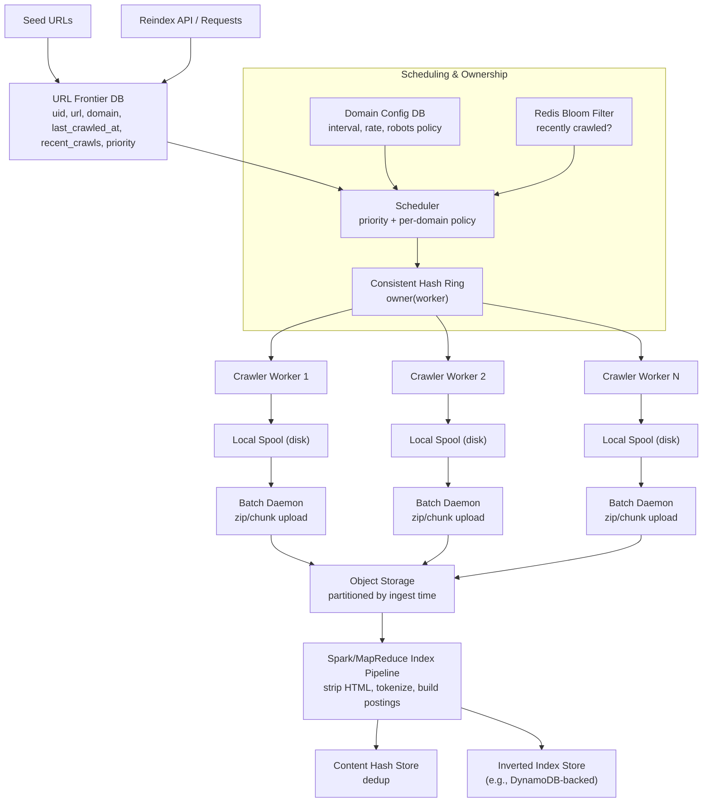
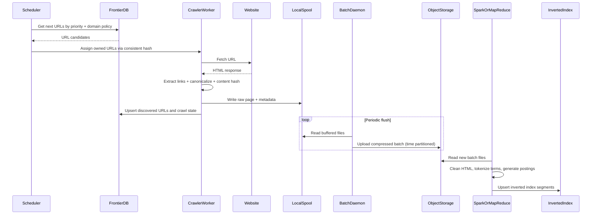

# Exercise 21 - Web Crawler

## Objectives
1. Understand how a large-scale web crawler works from seed URLs to indexed search terms.
2. Design a distributed crawling system that avoids duplicate crawl work across workers.
3. Model an inverted index and reason about storage growth at web scale.
4. Explain why object storage write patterns require batching and offline processing.
5. Design URL scheduling with per-domain crawl policies, freshness checks, and prioritization.
6. Evaluate trade-offs between freshness, politeness, cost, throughput, and index quality.

## Context

At internet scale, crawling and indexing is a **distributed systems problem**, not just a parsing problem.

The baseline crawler behavior is:
- Start from one or more **seed URLs**.
- Fetch HTML.
- Extract links.
- Add discovered links back to the frontier queue.
- Repeat, usually with **Breadth-First Search (BFS)** semantics for broad coverage.

### Inverted index fundamentals

A search engine usually uses an **inverted index**:
- Key: term (word)
- Value: posting list (documents/URLs containing that term)

Example:
- `apple -> [doc1, doc10, doc13]`

This is storage-heavy at scale.

Assume:
- `1,000,000` unique words
- `1,000,000,000` web pages
- each document ID is `32` bytes
- average word length is `8` bytes
- average posting list length is `10,000,000` docs/term (illustrative)

Approximate size:

`Index size ~= 1,000,000 x (8 + 10,000,000 x 32)`

`= 8,000,000 + 320,000,000,000,000 bytes`

`~ 320 TB`

This estimate motivates practical optimizations:
- **Compression** (delta-encoding, varints, block compression)
- **Champion lists** (store top-ranked/high-signal postings for faster top-k retrieval)

### Write path and storage constraints

Raw crawlers producing tiny per-page writes directly into object storage is inefficient. Object storage such as S3 is optimized for high-throughput object operations, not random tiny transactional writes.

A better design:
1. Crawlers write fetched artifacts to **local disk buffers**.
2. A local daemon batches files, compresses into zip (or parquet/orc bundles), and uploads in chunks.
3. Uploaded files are partitioned by ingest time (e.g., hourly prefixes).

Then an offline distributed pipeline (Spark/MapReduce style):
1. Reads batch files.
2. Cleans documents (strip HTML boilerplate, keep indexable content).
3. Tokenizes and emits term postings.
4. Merges and upserts to an inverted index store (e.g., DynamoDB-like KV backing service).

### Crawl frontier and scheduling requirements

The system needs a **URL metadata store** (frontier DB), for example:
- `uid`
- `url`
- `domain`
- `last_crawled_at`
- `recent_crawls`
- `priority`
- `status`

Partitioning by `domain` is useful for:
- politeness and rate limiting
- host-level crawl coordination
- efficient domain-scoped scans

Per-domain configuration is required because websites differ in update frequency and crawl policies:
- crawl interval
- max concurrency
- robots/crawl-delay rules
- priority overrides

Freshness optimization:
- before recrawling, check if page was recently visited.
- use a **Bloom filter** (e.g., in Redis) for fast probabilistic negative checks.
- negatives are cheap and exact enough to skip many DB reads.

### Distributed ownership and deduplication

At scale, many crawler workers run in parallel.

To prevent overlap:
- assign URL ownership via **consistent hashing** on canonical URL or host.
- each worker claims a hash range; ownership remains stable even when workers are added/removed.

To prevent duplicate content indexing:
- compute content hash (e.g., SHA-256) after normalization.
- if hash already exists, skip re-indexing and only update metadata references.

### Operational extensions

- **Priority crawling**: important domains/URLs get earlier scheduling.
- **Parallel crawlers**: increase throughput while enforcing per-domain limits.
- **Reindex requests**: allow explicit recrawl of URL/domain when content or ranking model changes.

## Design

### Key concepts

- **Crawler/Spider**: worker that fetches and parses pages.
- **Frontier**: scheduled set of URLs waiting to be crawled.
- **BFS crawling**: broad discovery strategy that avoids very deep single-site traversal early.
- **Inverted index**: term -> posting list mapping for search.
- **Canonical URL**: normalized URL representation used for dedup and ownership.
- **Politeness**: respecting robots.txt, crawl-delay, and per-host request budgets.
- **Consistent hashing**: stable partitioning strategy for distributed ownership.
- **Bloom filter**: probabilistic structure for fast membership checks.
- **Content hash dedup**: avoid re-indexing duplicate documents.
- **Batch ETL indexing**: decouple crawling from heavy indexing transforms.

### Architecture

### Crawl/index flow (sequence)

### Design thinking: how the architecture was derived

#### Step 1: Start from crawler fundamentals
The base loop is `seed -> fetch -> parse links -> enqueue discovered URLs`. BFS-like expansion gives broad coverage and avoids early depth traps on a few hosts.

#### Step 2: Add a proper frontier model
A queue alone is not enough. Real crawlers need metadata (`last_crawled_at`, `recent_crawls`, `priority`) to support freshness, retries, and domain-aware policies.

#### Step 3: Handle web politeness and heterogeneity
Different domains update at different rates and have different acceptable crawl frequencies. So scheduling must reference per-domain config, not one global interval.

#### Step 4: Avoid duplicate distributed work
With many workers, naive queue consumption causes overlap. Consistent hashing gives stable ownership and reduces coordination chatter when scaling worker count.

#### Step 5: Decouple fetch from index writes
Direct tiny writes to object storage and index backend are expensive and noisy. Local disk buffering + batch uploader improves throughput and lowers write amplification.

#### Step 6: Build index in distributed batch
Cleaning HTML, tokenization, and posting-list merges are CPU and shuffle heavy. Spark/MapReduce style jobs are better suited than in-worker indexing.

#### Step 7: Control recrawl and duplicate content
- Bloom filters reduce unnecessary recrawl checks.
- Content-hash dedup avoids re-indexing same document body under multiple URLs or repeated snapshots.

#### Step 8: Add product features
- Priority queues improve relevance/freshness for key domains.
- Reindex API supports manual/automatic correction workflows.

### Trade-offs

| Design Choice | Benefit | Cost / Risk |
|---|---|---|
| BFS-style crawling | Broad early coverage; good discovery | May delay deep pages of a domain |
| Domain partitioning | Better politeness and control | Skew if some domains dominate |
| Consistent hashing ownership | Low overlap, stable scaling behavior | Requires careful canonicalization and ring management |
| Bloom filter freshness gate | Fast negative checks, reduced DB load | False positives can skip some candidate recrawls temporarily |
| Local spool + batch upload | Efficient writes, lower object-store overhead | More moving parts (daemon, disk pressure handling) |
| Batch ETL indexing | Scales heavy transforms and merge steps | Index update latency increases vs fully real-time |
| Content hash dedup | Saves storage/compute for duplicates | Hash lookup path adds operational dependency |
| Champion list optimization | Faster top-k retrieval, smaller hot index | May reduce recall for long-tail queries |

### Practical evaluation questions

1. Can the learner explain why crawler and indexing are separated into online/offline planes?
2. Is it clear how `last_crawled_at`, per-domain policy, and priority interact in scheduling?
3. Does the architecture prevent overlap when worker count changes?
4. Can the learner reason about object storage write efficiency and why batching is needed?
5. Are index-size growth and storage optimizations (compression/champion lists) well justified?
6. Does the design describe how duplicate content is detected and handled?
7. Can the reader explain when to trigger a reindex and what path that request follows?

### Suggested extensions for advanced learners

- Incremental segment merge strategy (LSM-style index compaction).
- Change detection using `ETag`/`Last-Modified` before full fetch.
- Link-quality scoring and anti-spam heuristics for frontier prioritization.
- Separate media crawler (images/videos/PDFs) with content-type-specific parsers.

## Setup

No deployment required. This exercise is design-only.

## Test

No runtime tests required. Validate by design walkthrough:

1. Trace one URL from frontier assignment to final inverted index update.
2. Explain where duplicate prevention happens (URL-level and content-level).
3. Explain where and why batching is introduced.
4. Explain how a reindex request reaches workers and index pipeline.
5. Estimate storage impact if posting-list cardinality doubles.

Optional whiteboard checkpoint:
- Ask learners to redesign for near-real-time indexing and discuss what costs increase.

## Cleanup

No cleanup required.

## References / Appendix

- [Scrapy](https://github.com/scrapy/scrapy)
- [Apache Nutch](https://nutch.apache.org/)
- [Mercator: A Scalable, Extensible Web Crawler](https://research.google/pubs/pub33180/)
- [The Anatomy of a Large-Scale Hypertextual Web Search Engine](https://research.google/pubs/the-anatomy-of-a-large-scale-hypertextual-web-search-engine/)
- [Bloom Filters - Survey Paper](https://www.eecs.harvard.edu/~michaelm/postscripts/tr-02-05.pdf)