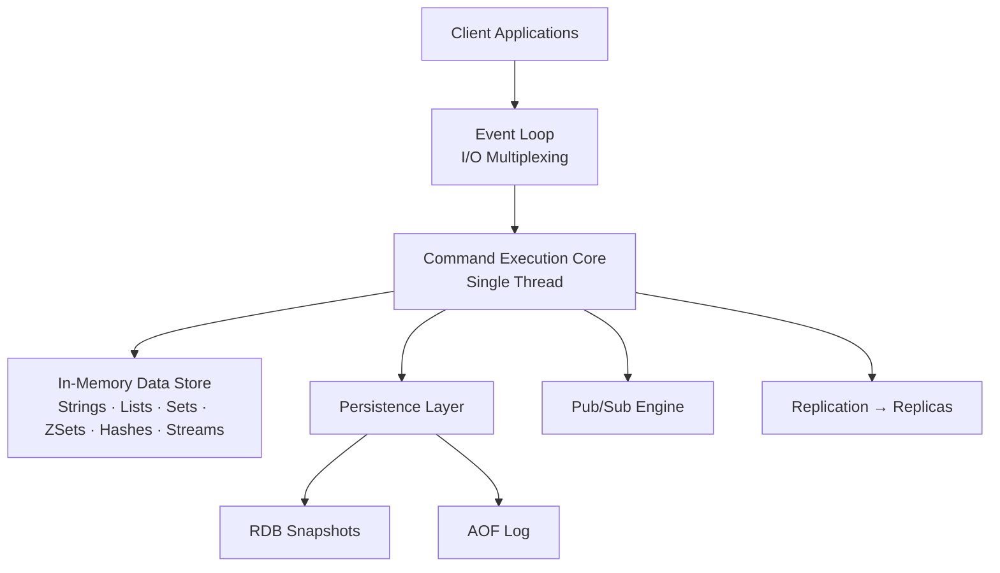

# Redis Overview: The In-Memory Data Structures Server

Redis (Remote Dictionary Server) is an open-source, in-memory key-value store used as a database, cache, message broker, and streaming engine. It is commonly called a "cache," but that undersells it — Redis is a **data structures server** where keys map to rich, purpose-built types rather than plain byte blobs.

Because all data lives in RAM, Redis delivers sub-millisecond response times and routinely handles hundreds of thousands of operations per second.

---

## 1. Core Architecture

Redis is built on three interlocking design decisions, each chosen to solve a specific problem.

**In-Memory Storage** means every key and value lives in RAM, never on disk during normal operation. Disk I/O is the slowest operation a computer performs — it is orders of magnitude slower than reading from RAM. By cutting disk out of the read/write path entirely, Redis achieves response times measured in microseconds rather than milliseconds. The cost is that dataset size is bounded by available RAM, and data can be lost if the process crashes before it has been persisted.

**Single-Threaded Command Execution** means all commands run on one thread, sequentially, one at a time. At first this sounds like a limitation — multi-threaded programs can use multiple CPU cores simultaneously. But multi-threaded access to shared data requires locking, and locking introduces race conditions, deadlocks, and context-switch overhead. Redis sidesteps all of that by never sharing the data store across threads. The result: every command is automatically atomic, and correctness is simple to reason about.

**Rich Key-Value Model** means keys always map to one of several specific data structures — List, Set, Hash, Sorted Set, and so on — rather than a raw string. This matters because the structure dictates which operations are available and how fast they run. Choosing the right type is not just aesthetic: it determines whether an operation is O(1) or O(N).

*All client commands funnel through a single execution core that operates directly on in-memory data structures.*

Lessons 02 and 03 zoom into exactly how the single-threaded core and I/O multiplexing work together at the code level.

---

## 2. Supported Data Structures

Unlike traditional key-value stores that only map strings to strings, Redis exposes rich data structures, each optimised for a specific access pattern. Picking the wrong type — for example, using a Hash to simulate a sorted list — means giving up the built-in operations that make Redis fast.

| Data Type | Description | Common Use Case |
| :--- | :--- | :--- |
| **Strings** | Binary-safe bytes, serialized JSON, or integers (up to 512 MB) | Session tokens, HTML caching, rate-limiting counters |
| **Lists** | Insertion-ordered linked lists of strings | Simple queues, activity feeds |
| **Sets** | Unordered collections of unique strings | Unique visitor tracking, tag systems, set intersection |
| **Sorted Sets (ZSets)** | Unique strings with a float score, auto-ordered by score | Leaderboards, priority queues, secondary indexes |
| **Hashes** | Field-value maps (analogous to a JSON object) | User profiles, entity state |
| **Bitmaps / HyperLogLogs** | Space-efficient bit manipulation or cardinality estimation | Daily active users (DAU), unique view counts |
| **Streams** | Append-only logs for real-time messaging | Event-driven microservices, activity logging |

Analogy: choosing the right Redis data type is like choosing the right container in a kitchen. A List is a stack of trays on a conveyor — you push onto one end and take from the other, and order is preserved. A Set is a jar of unique coins — you can instantly check whether a coin is already in there, and duplicates are automatically rejected. A ZSet is a live tournament leaderboard — every entry has a score, the whole thing stays sorted automatically, and you can query "give me ranks 10 through 20" in a single command.

---

## 3. Primary Use Cases

### 3.1 Caching

Instead of hitting the database on every read, results are stored in Redis with a **TTL (Time-To-Live)** — a countdown after which the key is automatically deleted. The next read after expiry hits the database and refreshes the cached value. Redis is well suited for this because reads are in-memory (microsecond latency), TTL management is built-in and requires no application code, and eviction policies automatically make room for new entries when memory fills up.

> Note: a cache is only valuable if cache hits are far more common than misses. If every request reads a different key, caching adds overhead without reducing database load. This ratio is called the **cache hit rate** and is the first thing to measure when tuning a cache.

### 3.2 Session Management

In a distributed system, multiple backend servers sit behind a load balancer, and a user's request can land on any one of them. If session data is stored in each server's local memory, a user whose request is routed to a different server than the one that created their session will appear to be logged out. Storing sessions in a shared Redis instance solves this: any backend server can retrieve the session for any user in microseconds, with no inter-server coordination needed.

### 3.3 Rate Limiting

Rate limiting enforces a maximum number of requests per user per time window — for example, "no more than 100 API calls per minute." Redis is the standard tool for this because `INCR` (increment a counter) and `EXPIRE` (set a TTL) are both atomic and sub-millisecond. The pattern: on each incoming request, increment the user's counter key. If the counter exceeds the limit, reject the request. Set the key to expire at the end of the window so it resets automatically. No database round-trip, no distributed lock needed.

### 3.4 Pub/Sub and Messaging

**Pub/Sub** (publish/subscribe) is a messaging pattern where senders (publishers) broadcast messages to named channels and receivers (subscribers) listen to those channels without knowing who published. Redis has built-in Pub/Sub. For workloads that also need message persistence or consumer acknowledgment — guarantees that a subscriber actually received and processed a message — Redis Streams extend Pub/Sub with a durable, replayable log.

---

## 4. Performance vs. Persistence

The speed of in-memory storage comes with a durability trade-off: if the Redis process crashes, any data that has not been written to disk is lost. Redis provides two mechanisms to limit that exposure, each with its own speed-versus-safety trade-off.

| Mechanism | How it works | Data loss risk | Write overhead |
| :--- | :--- | :--- | :--- |
| **RDB (Snapshot)** | A background fork writes a full point-in-time dump to disk at configured intervals | Up to the full interval (e.g., 5 min) | Low — the fork runs independently |
| **AOF (Append-Only File)** | Every write command is appended to a log; the log is replayed on restart to reconstruct state | Configurable: per-write, per-second, or OS-decided | Higher — more disk I/O per command |

Most production setups combine both: AOF to minimise data loss, RDB for fast restarts and point-in-time backups.

> Note: the `fsync` policy controls how aggressively AOF flushes to physical disk. `fsync always` calls the OS to flush after every command — near-zero data loss, but write throughput roughly halves because the OS cannot batch the flushes. `fsync everysec` (the default) flushes once per second — you risk losing at most one second of writes, with far better throughput. `fsync no` leaves flushing entirely to the OS — fastest, but several seconds of data can be lost on a crash.

---

## 5. Scaling and High Availability

A single Redis node is fast but is a single point of failure and has a fixed memory ceiling. Redis provides two tools for scaling, each solving a different problem.

**Redis Sentinel** solves the availability problem. It is a separate monitoring process that watches a Redis primary and its replicas. If the primary stops responding, Sentinel automatically promotes a replica to primary and reconfigures clients to point at it — failover without human intervention. The trade-off: the dataset still fits on one node. Sentinel adds redundancy, but not additional capacity.

**Redis Cluster** solves the capacity and throughput problem. It divides the entire key space into 16,384 **hash slots** and distributes those slots across multiple nodes, each of which stores only the keys that hash to its own slots. This lets datasets grow beyond the RAM of any single machine and spreads read/write load across nodes. The trade-off: multi-key commands (like `MGET`) only work if all requested keys land on the same hash slot, which requires deliberate key naming — hence the use of **hash tags** (e.g. `{user:42}:session`) to force related keys onto the same slot.

---

## 6. Practical Limits and Trade-offs

- **Speed vs. durability**: in-memory storage makes Redis fast but volatile. Every persistence option (RDB, AOF) trades some write throughput or accepts some data loss risk in return for survivability across crashes.
- **Simplicity vs. preemption**: the single-threaded execution core eliminates all locking complexity, but there is no preemption — one slow command (`KEYS *`, `SORT` on a large set) blocks every other client until it finishes.
- **Memory vs. dataset size**: the entire working set must fit in RAM. When memory fills up, the eviction policy (`maxmemory-policy`) decides which keys to drop. A wrong choice silently removes data the application still needs.
- **Simplicity vs. delivery guarantees**: Pub/Sub is easy to use but fire-and-forget — no message persistence, no acknowledgment, no replay. If a subscriber is offline when a message is published, it is gone. Streams solve this at the cost of added operational complexity.
- **Availability vs. consistency**: replication between a primary and its replicas is asynchronous by default. A primary crash before a replica has synced can lose the most recent writes — a classic availability-versus-consistency trade-off.

---

## 7. Summary

Redis is an in-memory data structures server — not just a cache. Its single-threaded execution core keeps every command atomic and predictable without any locking. Its rich data type model means it can serve as a cache, queue, session store, rate limiter, leaderboard, and pub/sub broker without additional infrastructure. Every design decision in Redis is a deliberate trade-off: RAM for speed, a single execution thread for correctness, and purpose-built types for efficient operations. Understanding those trade-offs is what separates using Redis effectively from misusing it.
