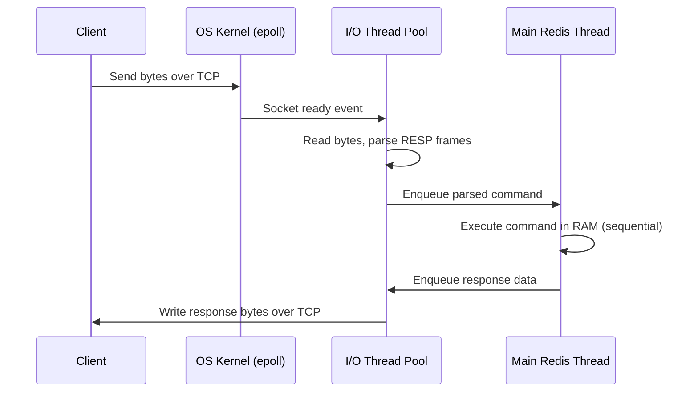

# Redis Concurrency Model: A Hybrid Architecture

Lesson 01 introduced Redis's single-threaded core as a design principle; this lesson explains how that core is actually achieved without sacrificing throughput. Redis is often described as "single-threaded," but that phrase is incomplete and misleading. Modern Redis uses a **hybrid architecture** that assigns a different concurrency strategy to each layer of work — connection handling, I/O, and command execution. Understanding which layer uses which strategy is the key to understanding both its performance and its correctness guarantees.

---

## 1. Core Concepts

### 1.1 Concurrency vs Parallelism

These two terms are often used interchangeably but describe different things. **Concurrency** means multiple tasks are in progress at the same time, but they may not be running at the exact same instant — they take turns sharing a CPU. **Parallelism** means multiple tasks are literally executing simultaneously on different hardware, such as different CPU cores.

The distinction matters because concurrency can be achieved on a single CPU core by switching between tasks rapidly, while true parallelism requires multiple cores. A system can be highly concurrent without being parallel.

Analogy: concurrency is one chef juggling three dishes — stirring one pot, then checking another, then plating a third. No two actions happen at the exact same moment, but all three dishes are in progress. Parallelism is three chefs each cooking their own dish at the same time on separate stoves.

### 1.2 Why Multi-Threading Needs Coordination

When multiple threads share the same memory, they can collide in ways that are difficult to reproduce and diagnose. There are three classic failure modes.

**Race conditions** occur when two threads read and write the same value at the same time without coordination. Each thread reads the value, modifies it locally, and writes it back — but neither thread saw the other's write. One update silently overwrites the other. The result is nondeterministic: it depends on which thread happened to run first, and that changes on every execution.

**Deadlocks** occur when two threads each wait for a resource the other is holding. Thread A holds lock X and waits for lock Y. Thread B holds lock Y and waits for lock X. Neither thread can proceed, and the program freezes indefinitely.

**Context-switch overhead** is the cost the operating system pays every time it pauses one thread and resumes another — saving the CPU registers, switching memory mappings, and invalidating CPU caches. Under hundreds or thousands of threads, this overhead accumulates and becomes a bottleneck even before any real work is done.

To prevent race conditions, threads use coordination primitives. A **mutex** (mutual exclusion lock) allows only one thread to enter a critical section at a time. A thread acquires the mutex before touching shared data and releases it when done. Other threads block and wait. Crucially, only the thread that acquired the mutex can release it — ownership is strict. A **semaphore** is a counter that controls how many threads can access a resource simultaneously. Any thread can increment or decrement the counter; there is no ownership. If the counter reaches zero, new threads block until another increments it.

Analogy: a mutex is a single key to a server room. Whoever holds the key can enter; everyone else waits outside. Only the person who took the key from the hook can return it — you cannot hand your access to someone else. A semaphore is a parking garage with a fixed number of spaces shown on a sign at the entrance. Any arriving car can take a spot, and any car that leaves frees one up for the next — no single person controls it.

---

## 2. Redis as a Three-Layer Hybrid Engine

Redis sidesteps the problems of multi-threaded shared data by assigning the right concurrency mechanism to each layer of work. The key insight is that not all work is the same: monitoring idle connections, reading network bytes, and executing commands have very different cost profiles, and each benefits from a different approach.

---

### 2.1 Layer 1 — The Switchboard (I/O Multiplexing)

One-thread-per-client fails at scale: ten thousand idle clients means ten thousand sleeping threads, burning memory and context-switch overhead even while doing nothing. (Lesson 03 quantifies this with exact numbers and shows epoll's solution in code.)

Redis uses **I/O multiplexing** instead (`epoll` on Linux, `kqueue` on macOS/BSD). I/O multiplexing is a system call that lets a single thread ask the OS kernel: "which of these thousands of sockets has data ready to read right now?" The kernel watches all the sockets and returns only the ones that are active. Redis wakes up only when there is actual work to do and never blocks waiting on an idle socket.

Analogy: imagine a hotel concierge managing a bank of room phones. The naive approach is one concierge sitting beside each phone, waiting for it to ring — most are idle at any moment. I/O multiplexing is a single concierge at a switchboard that lights up only when a room actually calls. The concierge attends only to active calls and ignores all idle lines.

### 2.2 Layer 2 — The Heavy Lifters (Multithreaded I/O)

Reading bytes from a network socket and parsing them into a Redis command is not free. Redis uses the **RESP protocol** (Redis Serialization Protocol) — a text-based format that must be decoded for every request and re-encoded for every response. Under large payloads or many simultaneously active clients, this parsing work can itself become a CPU bottleneck.

Modern Redis (version 6+) introduced background I/O threads to parallelize this work. When the event loop detects that a socket is ready, it can delegate the socket to an I/O thread that reads and parses the bytes in parallel with other sockets. On the response side, I/O threads handle writing large responses back to clients so the main thread can move on to the next command. All of this distributes network-bound CPU work across cores without touching the in-memory data store, where correctness requires single-threaded access.

> Nuance: Threaded I/O is **disabled by default**. You enable it by setting `io-threads` to a value greater than 1 in `redis.conf`. Even then, only write I/O is threaded by default; to also thread reads you add `io-threads-do-reads yes`. Command *execution* is never threaded — it always happens on the main thread regardless of the I/O configuration. This means the single-threaded execution guarantee described in §2.3 holds even when threaded I/O is on.

### 2.3 Layer 3 — The Sacred Core (Single-Threaded Execution)

After an I/O thread parses a command, it hands the command to the main Redis thread. The main thread processes commands one at a time, in order, with no other thread ever touching the in-memory data concurrently.

This is the design choice that makes Redis guarantees possible. Because no two commands ever execute simultaneously in the data store, there are no race conditions to defend against and no locks needed anywhere in the data path. Every command — regardless of how many clients are connected — sees a consistent snapshot of the data and completes fully before the next command begins.

Analogy: in a busy kitchen, prep cooks (I/O threads) wash, chop, and portion ingredients in parallel. But the head chef (main thread) calls each dish from the ticket rail in order, plates one dish at a time, and never finishes two dishes simultaneously. The kitchen is fast because prep is parallel, but the final execution is sequential and therefore predictable.

> Nuance: Redis is not "single-threaded everywhere." The single-threaded guarantee applies specifically to command execution against in-memory data. Network I/O, background persistence (RDB forks, AOF writes), and cluster communication all run outside the main thread.

---

## 3. Request Journey Through the Hybrid Pipeline

*A single client request passes through all three layers: kernel-level readiness detection, parallel I/O parsing, and sequential in-memory execution. Lesson 03 traces each of these steps with epoll system calls and code.*

Notice that the main Redis thread never touches the network directly. It only receives already-parsed commands and hands back already-formed responses. All slow network work happens in the other layers, keeping the execution core unblocked.

---

## 4. Atomicity: What Holds and What Does Not

**Atomicity** means an operation either completes fully or not at all — no other client ever sees a half-finished state. Because the main thread executes commands one at a time with no interleaving, every single Redis command is atomic by default. A `SET`, `INCR`, or `LPUSH` can never be half-done from the perspective of another client.

However, this atomicity is **command-level**, not **workflow-level**. Consider a read-modify-write pattern implemented as three separate commands: read a value, compute a new value in application code, write it back. Between the read and the write, another client can change the value. Each of the three commands is individually atomic, but the sequence as a whole is not.

Concrete example: two clients both implement "add 5 to a user's balance." Both read the balance as 10. Both compute 15. Both write 15 back. The final balance is 15, not 20 — one update was lost because neither client saw the other's write during the gap between its read and write.

To make multi-step workflows atomic, Redis provides three tools. **`MULTI` / `EXEC` transactions** queue a batch of commands and execute them all at once as a single uninterrupted block — no other client's commands can interleave. **Lua scripts** run arbitrary logic inside the Redis engine itself, treated as a single atomic unit. **`WATCH`** monitors a key between a read and a `MULTI`/`EXEC` block: if the watched key changes before `EXEC` runs, the entire transaction aborts, giving the application a chance to retry — this is optimistic locking.

---

## 5. Practical Limits and Trade-offs

- **Simplicity vs. preemption**: the single-threaded execution core eliminates all locking complexity, but there is no preemption — one slow or expensive command (`KEYS *`, `SORT` on a large dataset, `SMEMBERS` on a huge set) blocks every other client until it finishes. There is no way to interrupt it mid-flight.
- **I/O threading vs. ordering guarantees**: multithreaded I/O increases network throughput but adds complexity around command ordering. Redis carefully gates the handoff to the main thread to preserve the order in which commands arrive.
- **Speed vs. durability**: keeping data only in memory is fast but volatile. Every persistence option (RDB, AOF) trades some write throughput or accepts some data loss risk in exchange for survivability across crashes.
- **Vertical vs. horizontal scaling**: the single-node model scales vertically — more RAM, faster CPU — but hits a ceiling. Horizontal scaling via Redis Cluster distributes data across nodes but restricts which multi-key operations are legal, requiring deliberate key design.

---

## 6. Summary

Redis is a hybrid concurrency architecture, not a simply "single-threaded" one. I/O multiplexing lets a single kernel call efficiently watch thousands of idle connections. Multithreaded I/O workers parallelize the CPU cost of reading and parsing network bytes. A single-threaded execution core processes all commands sequentially against in-memory data, eliminating race conditions and making every command inherently atomic. That combination — the right mechanism at each layer — is what explains Redis's balance of high throughput, low latency, and strong correctness guarantees.
