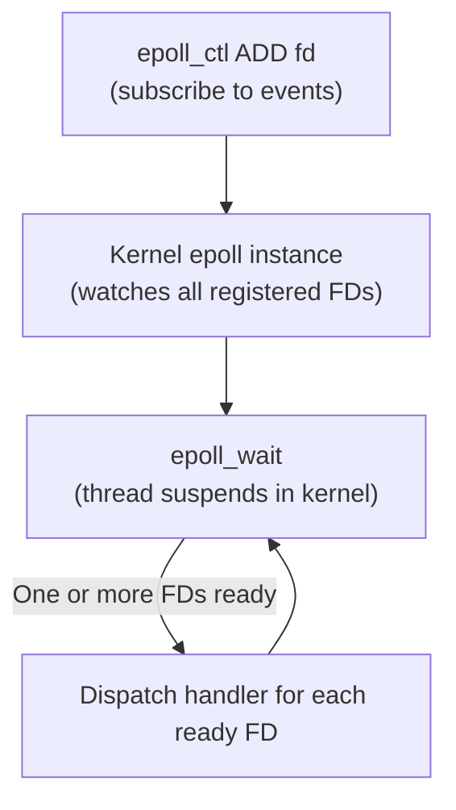
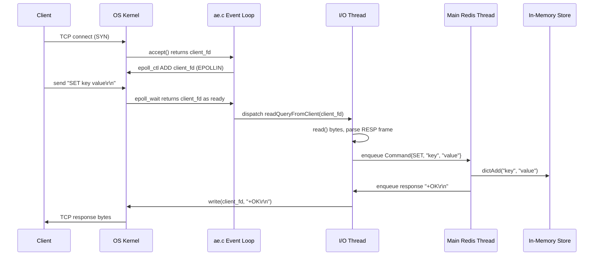

# Redis Event Loop: From TCP Packet to Command Execution

Lesson 02 described Redis's three-layer hybrid architecture — I/O multiplexing, multithreaded I/O workers, and a single-threaded execution core — at a conceptual level. This lesson opens the hood and shows the actual mechanics: what a file descriptor is, how `epoll` works, how Redis's own event library (`ae.c`) wraps it, and exactly what happens at each step between a TCP packet arriving and a command being executed.

The most common misconception about event loops is that they are busy `while(true)` loops that constantly poll for work. In reality, Redis's event loop spends most of its time suspended inside the kernel, consuming zero CPU, and only wakes up when the OS signals that real work is available.

---

## 1. File Descriptors: The Foundation

### 1.1 What Is a File Descriptor?

In Linux, every I/O resource — a file on disk, a network socket, a pipe between processes, a timer — is represented by a small non-negative integer called a **file descriptor (FD)**. The OS keeps a per-process table of open resources. The FD is the index into that table; it is just a number you hand to system calls so the kernel knows which resource you are talking about.

Three FDs are always open when a process starts: 0 is standard input (stdin), 1 is standard output (stdout), and 2 is standard error (stderr). Every new resource your process opens gets the next available integer — 3, 4, 5, and so on.

Analogy: an FD is a coat-check ticket. The ticket itself is just a number — meaningless on its own. But handing it to the right counter (passing it to a system call) lets the OS retrieve the actual resource you checked in. The ticket is a lightweight reference; the real thing lives inside the kernel.

### 1.2 Sockets Are File Descriptors

When Redis opens a listening socket to accept client connections, and when it accepts a new client, both operations return FDs. The kernel tracks what those numbers refer to; Redis just holds the integers and passes them to system calls.

```c
// Create a TCP socket — returns a file descriptor (e.g., 5)
int server_fd = socket(AF_INET, SOCK_STREAM, 0);

// Bind and listen (omitted for brevity)

// Accept a new client connection — returns a NEW file descriptor (e.g., 6)
int client_fd = accept(server_fd, NULL, NULL);

// Now read from the client using its FD
char buf[4096];
int n = read(client_fd, buf, sizeof(buf));
```

After this, `server_fd` and `client_fd` are just two integers Redis holds. Every operation on those connections — read, write, close — is done by passing the right integer to the right system call.

---

## 2. The Problem: Why Blocking I/O Breaks at Scale

The naive approach to reading from a client socket is a **blocking** `read()` call. When you call `read(client_fd, buf, n)`, the OS suspends your thread until the client sends data. The thread sleeps in the kernel, doing nothing, waiting.

```c
// Blocking read — the thread is suspended here until data arrives.
// If the client is idle, this call never returns.
int n = read(client_fd, buf, sizeof(buf));
```

As lesson 02 established, one-thread-per-client fails at scale. To put numbers to it: each thread requires its own stack — typically around 8 MB by default. Ten thousand clients therefore need roughly 80 GB of RAM just for stacks, before any application data. On top of that, every OS context switch between sleeping threads flushes CPU caches and updates memory mappings. Under thousands of threads, this **context-switch overhead** accumulates into a measurable bottleneck.

The solution is to let a single thread watch thousands of FDs simultaneously and only act when the kernel signals that a specific FD has data ready. That mechanism is `epoll`.

---

## 3. epoll: The Kernel's Notification Engine

`epoll` is a Linux system call interface that lets a single thread register interest in many file descriptors at once and then efficiently wait until one or more of them become ready. It has three system calls that work together.

### 3.1 The Three System Calls

**`epoll_create1(flags)`** creates a new epoll instance inside the kernel and returns an FD representing it. This is the monitoring object — it will track all the other FDs you want to watch.

**`epoll_ctl(epfd, op, fd, event)`** modifies the epoll instance. You use it to add an FD to the watch list (`EPOLL_CTL_ADD`), remove one (`EPOLL_CTL_DEL`), or change what events you care about (`EPOLL_CTL_MOD`). The `event` struct specifies which conditions to watch for — `EPOLLIN` means "notify me when this FD has data to read," `EPOLLOUT` means "notify me when this FD is ready to write."

**`epoll_wait(epfd, events, maxevents, timeout)`** is the call that does the actual waiting. It blocks until at least one registered FD becomes ready, then fills the `events` array with the FDs that are ready and returns how many there are. A `timeout` of `-1` means wait indefinitely.

> Nuance: `epoll_wait` is a genuine blocking system call. The process is suspended in the kernel — it uses no CPU while waiting. The OS wakes it only when a registered FD has an event. This is fundamentally different from a busy poll loop that repeatedly checks and burns CPU between checks.

### 3.2 Code: Registering and Waiting

The following snippet shows the full epoll pattern — create the monitor, register a socket, wait for events, and handle them.

```c
// Step 1: create the epoll monitor — returns an FD for the epoll instance itself
int epfd = epoll_create1(0);

// Step 2: register a client socket so epoll watches it for incoming data
struct epoll_event ev;
ev.events  = EPOLLIN;       // wake up when this FD has data to read
ev.data.fd = client_fd;     // attach the FD so we know which socket fired
epoll_ctl(epfd, EPOLL_CTL_ADD, client_fd, &ev);

// Step 3: block until one or more FDs are ready (timeout = -1 means wait forever)
struct epoll_event ready[MAX_EVENTS];
int n = epoll_wait(epfd, ready, MAX_EVENTS, -1);

// Step 4: iterate over only the FDs that fired — not all registered FDs
for (int i = 0; i < n; i++) {
    int fd = ready[i].data.fd;
    handle_readable(fd);    // read and process data from this specific socket
}
```

Analogy: this is the code-level realization of the hotel switchboard from lesson 02. `epoll_ctl` is the act of plugging a room's phone line into the switchboard — registering that you care about that room. `epoll_wait` is the concierge sitting idle at the switchboard until a light flashes. The concierge never walks the building checking each room; the switchboard (kernel) signals which room needs attention, and the concierge goes directly there.



*The epoll cycle: register interest, block until events arrive, dispatch handlers, repeat.*

---

## 4. Redis's Event Loop — ae.c

Redis does not call `epoll` directly in most of its code. Instead it wraps `epoll` (and `kqueue` on macOS, `select` as a fallback) in its own thin portable event library: `src/ae.c` (short for "async events"). This layer lets Redis register handlers against FDs without knowing which underlying multiplexing mechanism the OS provides.

### 4.1 The aeEventLoop Structure

The central structure holds everything the event loop needs: the epoll FD, a mapping from each registered FD to its handler, the events that just fired, and a list of timer callbacks.

```c
// Simplified — actual Redis ae.c has more fields
typedef struct aeEventLoop {
    int epfd;               // the epoll instance FD
    aeFileEvent *events;    // array indexed by FD: what handler to call
    aeFiredEvent *fired;    // events that fired in the last epoll_wait call
    aeTimeEvent *timeEvents;// linked list of time-based callbacks (e.g., expiry checks)
    int stop;               // set to 1 to exit the loop
} aeEventLoop;
```

### 4.2 The Main Loop in Code

`aeMain` runs forever. Each iteration calls `aeProcessEvents`, which calls `epoll_wait` once, dispatches all the handlers for the ready FDs, and then processes any due timers before looping again.

```c
// One iteration of the event loop
void aeProcessEvents(aeEventLoop *el) {
    // Block in the kernel until at least one FD is ready
    int numevents = epoll_wait(el->epfd, el->fired, MAX_EVENTS, timeout_ms);

    for (int i = 0; i < numevents; i++) {
        int fd        = el->fired[i].fd;
        aeFileEvent *fe = &el->events[fd];  // look up the handler for this FD

        if (fe->mask & AE_READABLE)
            fe->rfileProc(el, fd, fe->clientData); // e.g., readQueryFromClient
        if (fe->mask & AE_WRITABLE)
            fe->wfileProc(el, fd, fe->clientData); // e.g., sendReplyToClient
    }

    processTimeEvents(el); // run any timers that have elapsed (e.g., key expiry)
}

// The forever loop — runs until el->stop is set
void aeMain(aeEventLoop *el) {
    while (!el->stop) {
        aeProcessEvents(el);
    }
}
```

`rfileProc` is the read handler — called when a FD is readable. `wfileProc` is the write handler — called when a FD is writable (ready to send data back to the client). In Redis's actual code these are function pointers to `readQueryFromClient` and `sendReplyToClient` respectively.

### 4.3 Registering a File Event

When Redis accepts a new client connection, it immediately registers the client's FD with ae.c so future data from that client will be handled.

```c
// Called after accept() returns a new client_fd
// "When client_fd is readable, call readQueryFromClient with client as context"
aeCreateFileEvent(el, client_fd, AE_READABLE, readQueryFromClient, client);
```

Internally, `aeCreateFileEvent` calls `epoll_ctl(EPOLL_CTL_ADD)` and stores the handler in `el->events[client_fd]`. From this point forward, whenever that client sends bytes, `epoll_wait` will return `client_fd` as a ready event and `aeProcessEvents` will invoke `readQueryFromClient`.

Analogy: ae.c is a receptionist at a hotel switchboard. epoll is the physical alert system that lights up when a room calls. ae.c is the receptionist who looks up "room 42 called → transfer to guest services" and routes the call. The receptionist does not know how the alert system works internally; they just respond to the light and know which extension to ring.

---

## 5. Full Data Flow: TCP Packet to Executed Command

With all the pieces in place, here is the complete journey of a single `SET key value` command from the moment the client sends it to the moment `+OK` arrives back.



*The full lifecycle of a SET command: connection registration, event notification, I/O thread parsing, main-thread execution, and response delivery.*

**Step-by-step:**

**1. Connection accepted.** When a client connects, the OS completes the TCP handshake and `accept()` returns a new `client_fd`. Redis calls `aeCreateFileEvent(el, client_fd, AE_READABLE, readQueryFromClient, client)` to register it. Under the hood this is `epoll_ctl(EPOLL_CTL_ADD, client_fd, EPOLLIN)`.

**2. Client sends data.** The client writes `SET key value\r\n` to its socket. The kernel buffers the bytes on the server side and marks `client_fd` as readable.

**3. epoll_wait fires.** The event loop was blocked in `epoll_wait`. The kernel wakes it up and returns `client_fd` in the ready events array.

**4. I/O thread reads and parses.** In Redis 6+ with threaded I/O enabled, ae.c hands `client_fd` to a background I/O thread. The thread calls:

```c
// Read raw bytes from the socket into the client's input buffer
int n = read(client_fd, client->querybuf, PROTO_IOBUF_LEN);
```

It then parses the RESP (Redis Serialization Protocol) frame. A `SET key value` command arrives as:

```
*3\r\n          <- 3 arguments follow
$3\r\n          <- next argument is 3 bytes long
SET\r\n
$3\r\n
key\r\n
$5\r\n
value\r\n
```

The parser walks this byte-by-byte, extracts the three tokens (`SET`, `key`, `value`), and builds a command object.

**5. Main thread executes.** The parsed command is enqueued onto the main thread's pending command list. The main thread dequeues it and calls the command handler — for `SET`, that is `setCommand()`, which ultimately calls `dictAdd` on the in-memory hash table:

```c
// Simplified — Redis stores values as robj (Redis object) structs
dictAdd(db->dict, key, value);
```

**6. Response sent.** The main thread writes `+OK\r\n` to the client's output buffer and enqueues the send work for an I/O thread. The I/O thread calls `write(client_fd, "+OK\r\n", 5)`. The kernel delivers the bytes over TCP back to the client.

---

## 6. Command Batching and Pipelining

A client is not required to wait for a response before sending the next command. It can write multiple commands back-to-back into a single TCP write. This is called **pipelining**, and it dramatically improves throughput by removing the round-trip latency between each command.

When a pipelining client sends three commands at once, they may all arrive in the same TCP segment. `epoll_wait` fires once for that client FD. The I/O thread reads all the bytes in one `read()` call and parses them into three command objects, all of which are enqueued for the main thread.

Multiple clients can also become readable in a single `epoll_wait` call — if 50 clients all sent commands while the main thread was busy executing the previous batch, `epoll_wait` returns all 50 FDs as ready at once. Their commands are all parsed in parallel by I/O threads and then queued up.

```c
// After aeProcessEvents completes, the pending queue may have many commands.
// The main thread drains the entire queue in one pass.
while (!listEmpty(pending_commands)) {
    redisCommand *cmd = listPopHead(pending_commands);
    cmd->proc(client);      // execute the command against the in-memory store
    addReply(client, ...);  // write response to client's output buffer
}
```

Without pipelining, a client doing 100 sequential `SET` operations waits for a round-trip after each one — at 1 ms latency that is 100 ms total. With pipelining, all 100 commands are sent in one batch, executed in one drain pass, and all responses arrive in one reply — the latency is one round-trip regardless of how many commands are in the batch.

---

## 7. Practical Limits and Trade-offs

- **Portability vs. performance**: `epoll` is Linux-specific. macOS and BSD use `kqueue`, which has similar semantics but different system calls. ae.c abstracts this, but it means the event loop layer has conditional compilation per OS. The benefit is that Redis runs natively on all major Unix systems; the cost is added abstraction.

- **Readability vs. correctness in level-triggered mode**: by default, `epoll` operates in level-triggered mode — it re-fires the event for a given FD on every `epoll_wait` call until all available data has been read. If the read handler does not fully drain the socket buffer, `epoll_wait` will keep returning that FD as ready, causing a spin. The trade-off: level-triggered mode is easier to reason about than edge-triggered (which fires only once per new data arrival), but it demands that handlers always consume all available data.

- **Simplicity vs. preemption**: a handler that takes a long time (a blocking Lua script, a large `SORT` command) holds up the entire `aeProcessEvents` iteration. No other ready FD is dispatched until the slow handler returns. The event loop is cooperative, not preemptive — one slow handler delays everyone. The trade-off is the same as lesson 02's single-thread limitation: simplicity and no locking, but no isolation between fast and slow commands.

- **Throughput vs. synchronization overhead**: handing off parsed commands from I/O threads to the main thread requires a synchronization point — a lock-free queue or similar structure. The overhead is small but real. The gain is that network I/O, which is CPU-intensive under load, is parallelized across cores without the main thread being involved.

- **Batch size vs. latency**: `epoll_wait` accepts a `maxevents` argument capping how many events it returns in one call. Under extreme load, more events may be pending than the batch size allows, requiring multiple `aeProcessEvents` iterations to drain them. A larger batch reduces the number of system call round-trips but increases the latency of any individual event that lands at the back of a large batch.

---

## 8. Summary

File descriptors are the lingua franca of Linux I/O: sockets, epoll instances, and files are all represented as small integers that you pass to system calls. `epoll` builds on this by letting one thread register interest in thousands of FDs (`epoll_ctl`) and then block inside the kernel until any of them become ready (`epoll_wait`) — paying zero CPU cost while idle. Redis's `ae.c` wraps `epoll` in a portable event library that maps each FD to a handler function, calls `epoll_wait` once per loop iteration, and dispatches to the right handler for each ready FD. Commands batch naturally: pipelining clients and simultaneous activity from many clients both result in multiple commands being queued and drained together in a single pass through the main thread. The event loop is the glue that connects the kernel's efficient readiness notifications to Redis's single-threaded, lock-free execution guarantee.
