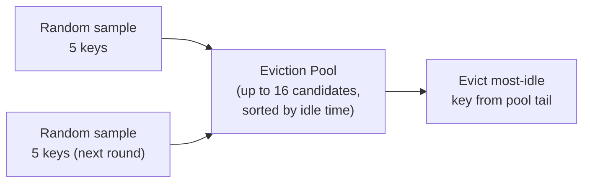
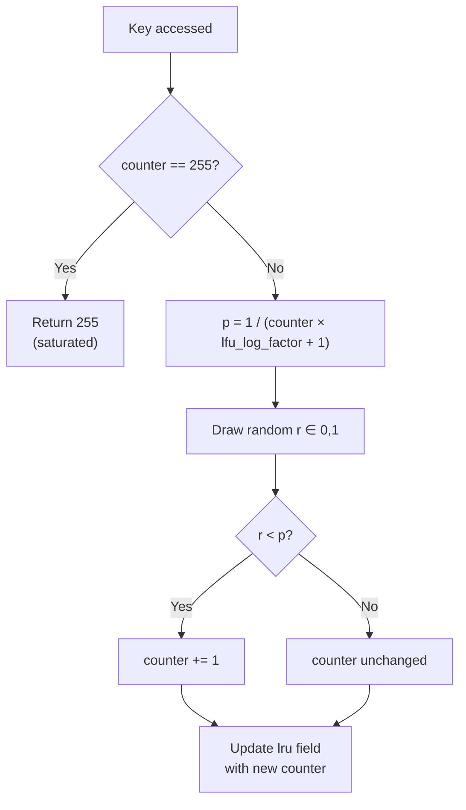

# Cache Eviction in Redis: Approximate LRU and the Morris Counter

Redis is frequently deployed as a cache with a fixed memory ceiling. When the ceiling is reached, Redis must decide which keys to remove to make room for new ones — and it must make that decision on the write hot path, thousands of times per second, without adding meaningful latency. Redis ships eight eviction policies, and they do not all work the same way. Two distinct approximation techniques appear across the policy set: the **approximate LRU** policies (`allkeys-lru`, `volatile-lru`) find victims by random sampling rather than maintaining an exact ordered list; the **LFU** policies (`allkeys-lfu`, `volatile-lfu`) maintain a probabilistic frequency counter using a Morris counter in a single byte. The remaining policies — `noeviction`, `allkeys-random`, `volatile-random`, and `volatile-ttl` — use no approximation at all; they are either deterministic or purely random. Understanding which mechanism backs which policy is essential for tuning Redis under memory pressure.

---

## 1. Redis as a Bounded Cache

### 1.1 The maxmemory Limit

Redis operates in one of two modes: unconstrained (it grows until the OS kills it) or bounded by a **`maxmemory`** directive in `redis.conf`. Once `maxmemory` is set, Redis tracks its own memory usage on every write and triggers the eviction machinery the moment a new write would breach the limit.

```text
# redis.conf
maxmemory 4gb
maxmemory-policy allkeys-lru
```

When the limit is hit, Redis does not silently drop keys. It runs the **eviction cycle**: it selects a victim key according to the configured policy and removes it, freeing memory. If it cannot free enough memory (because all keys are protected or the policy is `noeviction`), it returns an error to the client instead of executing the write.

### 1.2 Volatile vs. All-Keys Keys

Redis distinguishes between two populations of keys. A **volatile key** has an expiry time set — it is scheduled to disappear at some future moment via the **Time to Live (TTL)** mechanism. An **all-keys key** has no expiry; it is meant to live indefinitely unless evicted.

This distinction is baked into the eviction policies. Policies prefixed with `volatile-` only touch keys that already have a TTL; they leave permanent keys alone. Policies prefixed with `allkeys-` treat every key equally, regardless of whether it has a TTL.

> Note: Setting a `maxmemory-policy` that only evicts volatile keys (e.g. `volatile-lru`) when most of your keys are permanent is a common misconfiguration. If no volatile keys exist when memory pressure hits, Redis behaves like `noeviction` and starts rejecting writes, which surprises operators who expected silent eviction.

---

## 2. The Eight Eviction Policies

Redis 7.x ships with eight eviction policies. They differ on two axes: which population of keys is eligible, and what criterion selects the victim within that population. A third axis — the underlying mechanism — is often overlooked but explains why different policies have different tuning knobs.

| Policy | Eligible Keys | Victim Selection | Mechanism |
| :--- | :--- | :--- | :--- |
| `noeviction` | — | Returns an error on writes when memory is full | None |
| `allkeys-lru` | All keys | Least recently used | Approximate LRU (random sampling) |
| `allkeys-lfu` | All keys | Least frequently used | Morris counter + decay |
| `allkeys-random` | All keys | Uniformly at random | `rand()` — no approximation |
| `volatile-lru` | Keys with TTL | Least recently used | Approximate LRU (random sampling) |
| `volatile-lfu` | Keys with TTL | Least frequently used | Morris counter + decay |
| `volatile-random` | Keys with TTL | Uniformly at random | `rand()` — no approximation |
| `volatile-ttl` | Keys with TTL | Shortest remaining TTL first | Deterministic sort — no approximation |

The `maxmemory-samples` tuning knob only affects the two LRU policies — it controls how many random keys are drawn per eviction round. The `lfu-log-factor` and `lfu-decay-time` knobs only affect the two LFU policies — they shape the Morris counter's logarithmic scale and how quickly frequency counts decay. Changing either knob has no effect when the active policy is random, TTL-based, or noeviction.

**`noeviction`** is the safest choice if data integrity matters more than availability — the cache returns errors rather than silently destroying data, forcing the application to handle memory exhaustion explicitly. It is the right default for Redis used as a primary database, not a cache.

**`allkeys-lru`** is the most common choice for general-purpose caches. It evicts whatever was touched least recently across the entire keyspace, approximating the classic LRU cache contract: the working set stays warm.

**`allkeys-lfu`** is better for workloads with long-lived hot keys that are accessed repeatedly over many hours or days. LRU can evict a very popular key if it was not touched in the last few seconds; LFU's frequency counter keeps genuinely hot keys alive even through brief quiet periods.

**`volatile-ttl`** requires no access-pattern tracking at all — it simply removes the key closest to expiring anyway. It is cheap to compute but gives poor eviction quality under pressure because a key with a short TTL is not necessarily cold.

**`allkeys-random`** and **`volatile-random`** are baseline comparators. Evicting a random key requires no bookkeeping and is occasionally the right choice for uniform-access workloads where all keys are equally likely to be needed — but in practice, most workloads have hot spots, so random eviction routinely removes popular keys.

---

## 3. The Cost of Exact LRU

### 3.1 What a True LRU Data Structure Requires

A correct LRU cache is typically implemented as a combination of a hash map (for O(1) lookup) and a **doubly-linked list** sorted by recency (for O(1) move-to-front and O(1) evict-from-tail). Every node in the list needs two pointers — one to the previous node, one to the next — so the LRU machinery can splice it out in constant time when the key is accessed.

```c
// Each key in a true LRU list needs these two pointers
typedef struct LRUNode {
    struct LRUNode *prev;   // 8 bytes on 64-bit
    struct LRUNode *next;   // 8 bytes on 64-bit
    // ... the actual key and value
} LRUNode;
```

On a 64-bit system, those two pointers add **16 bytes of overhead per key**, purely for the eviction machinery. Redis commonly stores millions of keys. At ten million keys, that is 160 MB consumed exclusively by eviction bookkeeping — memory that could otherwise hold data.

### 3.2 The Write Cost on Every Read

The larger problem is not memory but latency. Every time a key is accessed — on a `GET`, a `HGET`, a `ZADD`, any command that touches a key — a true LRU implementation must move that key's node to the head of the linked list. That means:

1. Splice the node out of its current position (update four pointers).
2. Insert the node at the head (update two more pointers).
3. Do this atomically, which in a concurrent system would require a lock.

Redis's command execution is single-threaded, so locking is not an issue — but the six-pointer update still happens on every read, even for reads that have nothing to do with eviction pressure. Under 100,000 reads per second, that is six million pointer writes per second that the application never asked for.

> Nuance: Some systems (like Java's `LinkedHashMap`) do maintain an exact LRU order and accept this per-read cost. It is a valid trade-off when memory is scarce and eviction accuracy is critical. Redis's design prioritises throughput and memory efficiency over exact LRU fidelity — the approximate approach described in the next section shows why that trade-off is reasonable.

---

## 4. Redis's Approximate LRU

### 4.1 The lru Clock: One Field, Zero Extra Memory

Every Redis value — whether a string, a list, a hash, or any other type — is wrapped in a fixed-size C struct called `robj`. This struct exists for every key in the database, always, regardless of any eviction setting. It is not optional metadata; it is the object itself.

```c
// Simplified from Redis src/object.c — actual struct has more fields
typedef struct redisObject {
    unsigned type:4;     // 4 bits: what Redis type this is (string, list, …)
    unsigned encoding:4; // 4 bits: how the value is stored internally
    unsigned lru:24;     // 24 bits: last-access clock (seconds, wraps ~194 days)
    int refcount;        // 32 bits
    void *ptr;           // 64 bits: pointer to the actual value
} robj;
```

The first three fields — `type`, `encoding`, and `lru` — are C **bitfields** that pack into the same 32-bit word. `type` uses 4 bits and `encoding` uses 4 bits, leaving 24 bits in that word unused. Redis fills those 24 idle bits with the `lru` timestamp. Without the `lru` field, those 24 bits would still exist as silent alignment padding — wasted space the compiler inserts to keep the struct's total size a multiple of 4 bytes.

This is why adding `lru` costs nothing: the struct is the same size either way. No extra allocation, no new pointer to follow, no per-key heap entry. Redis just puts 24 bits that were already being paid for to work.

Contrast this with what a true LRU doubly-linked list would require. Each key would need two additional 8-byte pointers — `prev` and `next` — allocated as a separate data structure *on top of* the already-existing `robj`. At ten million keys that is 160 MB purely for list linkage, in addition to all the actual data. The `lru` bitfield approach avoids this entirely.

The global **`server.lruclock`** is updated every 100 ms by the server's background timer. It counts seconds since an arbitrary epoch, truncated to 24 bits, so it wraps around approximately every 194 days. When a key is read or written, Redis copies `server.lruclock` into the key's `lru` field — a single integer assignment, with no pointer chasing.

### 4.2 Eviction by Sampling

When memory pressure triggers eviction, Redis does not scan the entire keyspace. Instead it:

1. Randomly samples **`maxmemory-samples`** keys from the keyspace (default: 5).
2. Computes each key's **idle time**: `server.lruclock - key->lru` (modular arithmetic handles the wraparound).
3. Evicts the key with the largest idle time — the "most-stale" candidate among the sample.

```c
// Simplified from Redis src/evict.c
struct evictionPoolEntry *evictionPoolPopulate(dict *sampledict) {
    dictEntry *samples[maxmemory_samples];
    // Step 1: pick random keys
    int count = dictGetSomeKeys(sampledict, samples, maxmemory_samples);

    for (int i = 0; i < count; i++) {
        robj *o    = dictGetVal(samples[i]);
        uint64_t idle = estimateObjectIdleTime(o); // server.lruclock - o->lru
        // Step 2 & 3: insert into sorted eviction pool if idler than current entries
        evictionPoolInsert(pool, samples[i], idle);
    }
}
```

Analogy: imagine a librarian who needs to return one book to the warehouse. Rather than checking the loan date of every book in the library, she randomly pulls five books off the shelves and returns the one checked out longest ago. She will occasionally make a suboptimal choice — there may be an even older book she did not sample — but over thousands of eviction decisions, her average choice is close to optimal, and she spends a tiny fraction of the effort an exhaustive search would require.

### 4.3 The Eviction Pool: Improving Accuracy Across Rounds

Redis 3.0 introduced an **eviction pool** to carry information across eviction rounds. Instead of sampling five keys and immediately evicting the worst one, Redis maintains a sorted pool of up to 16 candidates (sorted by idle time). Each eviction round adds new samples to the pool, displacing any that are less stale. The victim is always taken from the pool's tail — the most-idle entry seen across all samples so far.



*Each eviction round adds fresh random samples to a shared pool; the victim is the most-idle candidate seen across all rounds.*

The pool effectively increases the sample size without increasing the cost of any single eviction. Over repeated rounds under memory pressure, the pool accumulates a reasonably representative view of the full keyspace's idleness distribution. Empirically, with a sample size of 10 and the pool, Redis's approximate LRU matches the eviction choices of a true LRU list with roughly 95% accuracy.

> Note: The accuracy of the approximation is tunable. A `maxmemory-samples` of 1 gives random-like eviction; a value of 10 is nearly indistinguishable from exact LRU at approximately double the per-eviction CPU cost of the default of 5. Raising it above 10 yields diminishing returns.

---

## 5. LFU Mode: Prioritizing Frequency Over Recency

Before going further, it is worth being precise about when each mechanism runs, because this is the clearest way to see that they are completely separate.

**Approximate LRU sampling runs only at eviction time** — that is, only when a write would breach `maxmemory`. Between evictions, the `lru` timestamp is written on every key access (a single integer copy), but the sampling and pool logic never fires. The mechanism answers one question: *given that we must evict someone right now, which candidate among a random sample looks least recently used?*

**The Morris counter runs on every key access, all the time.** Whether memory is full or empty, every `GET`, `SET`, or any other command that touches an LFU key calls `LFULogIncr` to probabilistically update the 8-bit frequency counter. The mechanism answers a different question: *how popular has this key been over its lifetime?*

These two problems — "find the stalest key quickly at eviction time" versus "maintain a per-key popularity score on every access" — require different solutions. The approximate LRU policies (`allkeys-lru`, `volatile-lru`) use only the first; they never call `LFULogIncr`. The LFU policies (`allkeys-lfu`, `volatile-lfu`) use only the second; they never use the sampling pool. The remaining four policies use neither. They share the same 24-bit `lru` field in the object header but interpret its bits completely differently (§5.3).

### 5.1 Where LRU Falls Short

LRU's weakness is that it is amnesiac about history beyond the most recent access. Consider a key that is accessed a million times over the course of an hour and then goes quiet for thirty seconds. A pure LRU cache will evict it — it looks cold. Meanwhile a key accessed exactly once thirty-one seconds ago looks warmer by LRU's measure and stays. For workloads with bursty hot keys that occasionally experience access gaps (database metadata, configuration objects, popular API responses), LRU can repeatedly evict the wrong key.

**Least Frequently Used (LFU)** fixes this by tracking *how often* a key has been accessed, not just *when*. A key accessed a million times has accumulated a high frequency count and remains in the cache through brief idle periods.

### 5.2 The Decay Problem

Naive LFU has the inverse problem: a key that was extremely popular six months ago but is now dead has a sky-high frequency count. It will never be evicted, crowding out keys that are actually in demand today.

Redis solves this with **counter decay**: the frequency counter is periodically decremented based on how much time has elapsed since the key was last accessed. The longer a key sits untouched, the lower its counter falls. A key that was hot last week but cold today will gradually decay toward zero and become eviction-eligible again. The decay rate is controlled by `lfu-decay-time` (default: 1 minute — the counter decrements by 1 for each full minute the key is idle).

### 5.3 Fitting LFU Into the lru Field

Redis reuses the same 24-bit `lru` field for LFU data, splitting it into two sub-fields:

- **Upper 16 bits — LDT (Last Decrement Time):** the time (in minutes, server.unixtime/60, modulo 65536) when the counter was last decayed. This wraps every ~45 days.
- **Lower 8 bits — frequency counter:** a logarithmic counter that approximates access frequency. The maximum is 255.

```c
// For LFU, the 24-bit lru field is reinterpreted as:
//   [ 16 bits: LDT in minutes ] [ 8 bits: frequency counter ]
unsigned long LFUDecrAndReturn(robj *o) {
    uint8_t  counter = o->lru & 0xFF;               // lower 8 bits
    uint16_t ldt     = (o->lru >> 8) & 0xFFFF;     // upper 16 bits

    unsigned long elapsed = LFUTimeElapsed(ldt);    // current_minutes - ldt
    if (elapsed >= server.lfu_decay_time && counter > 0)
        counter -= (elapsed / server.lfu_decay_time); // decay

    return (ldt << 8) | counter;
}
```

The 8-bit counter can only hold values from 0 to 255. Representing a true frequency in 8 bits is impossible — a popular key might be accessed billions of times. The next section explains how Redis encodes the *logarithm* of the frequency instead, making 255 levels cover an enormous range.

---

## 6. The Morris Counter: Logarithmic Counting in 8 Bits

### 6.1 The Problem with Exact Counting

If the 8-bit counter stored an exact hit count, it would saturate at 255 accesses and give every popular key the same maximum score. From that point, LFU would degrade to random eviction among all saturated keys — precisely the worst case the policy was designed to avoid.

The root issue is that a linear counter allocates the same resolution to rare values (a key accessed 10 times vs. 20 times) as to common ones (a key accessed 10,000 times vs. 10,010 times). For eviction purposes, the distinction between 10 and 20 accesses matters much more than the distinction between 10,000 and 10,010.

### 6.2 The Morris Counter: Increment Probabilistically

In 1978, Robert Morris described a **probabilistic counter** that approximates the logarithm of a value in a small fixed number of bits. The core idea: instead of incrementing the counter on every access, increment it with a probability that decreases as the counter grows.

The probability of incrementing is:

```text
P(increment) = 1 / (counter * lfu_log_factor + 1)
```

Where `lfu_log_factor` is a tunable constant (default: 10 in Redis). The result:

- When `counter = 0`: P = 1/1 = **100%** — always increment from zero.
- When `counter = 1`: P = 1/11 ≈ **9%** — increment roughly once every 11 accesses.
- When `counter = 10`: P = 1/101 ≈ **1%** — increment roughly once every 100 accesses.
- When `counter = 100`: P = 1/1001 ≈ **0.1%** — increment roughly once every 1,000 accesses.

Each counter step therefore represents an exponentially larger number of real accesses. The 8-bit counter (0–255) maps approximately to the following real access counts with the default `lfu_log_factor` of 10:

| Counter value | Approximate real accesses |
| :--- | :--- |
| 0 | 0 |
| 10 | ~100 |
| 50 | ~10,000 |
| 100 | ~100,000 |
| 200 | ~10,000,000 |
| 255 | ~1,000,000,000+ |

A counter of 255 means "this key has been accessed an enormous number of times" — the exact number is irrelevant because anything in that tier is clearly too hot to evict.

### 6.3 Redis's Implementation

```c
// From Redis src/evict.c — increment counter probabilistically
uint8_t LFULogIncr(uint8_t counter) {
    if (counter == 255) return 255; // saturated — no further increment

    double r   = (double)rand() / RAND_MAX;   // uniform random in [0, 1)
    double p   = 1.0 / (counter * server.lfu_log_factor + 1.0);

    if (r < p) return counter + 1;  // increment with probability p
    return counter;                 // otherwise leave unchanged
}
```

This function is called every time a key is accessed under LFU mode. It replaces what would have been `counter++` in an exact counter. The cost is one random number generation and one floating-point comparison per access — negligible on the hot path.

Analogy: think of the counter as a jar of marbles you fill by rolling a weighted die. When the jar is empty, every roll adds a marble — the die is always weighted in your favor. As the jar fills up, the die becomes increasingly biased against adding more — you might roll a hundred times and add only one marble. The jar never tells you exactly how many rolls you made; it tells you the *order of magnitude*, which is all you need to compare jars.



*The Morris counter increment path: a probabilistic gate whose acceptance rate falls as the counter grows, encoding frequency as a logarithm.*

### 6.4 Why This Works for Eviction

The eviction decision compares two counter values. Because both counters are logarithmic approximations of the same underlying quantity (access frequency), their *ordering* is preserved even though their *absolute values* are approximations. A key with a counter of 180 has genuinely been accessed orders of magnitude more than a key with a counter of 20, regardless of the exact numbers. The counter does not need to be exact — it only needs to reliably rank keys by relative frequency, and the probabilistic logarithm achieves that in 8 bits.

---

## 7. Practical Limits and Trade-offs

- **Approximate LRU accuracy vs. sample cost**: the default sample size of 5 is fast but imprecise. Raising `maxmemory-samples` to 10 approaches exact LRU accuracy empirically, but doubles per-eviction sampling cost. Values above 10 yield diminishing returns. Tune this when you observe that eviction is removing keys that should be hot.

- **LRU wraparound over 194 days**: the 24-bit second clock wraps around after ~194 days. A key last accessed 195 days ago has an `lru` value that looks *newer* than one accessed yesterday, so it would appear warm and avoid eviction. In practice this is rare — truly untouched keys tend to be evicted during normal pressure long before 194 days pass — but it is worth knowing if you run Redis instances with extreme key churn and very long-lived cold entries.

- **LFU decay vs. hot key persistence**: `lfu-decay-time` controls how aggressively the frequency counter drops during idle periods. A value of 1 (default) means a key that was accessed 10,000 times but went cold for 10 minutes has already shed 10 counter points. Set it too low and genuinely hot keys decay during traffic lulls; set it too high and formerly-popular-but-now-dead keys resist eviction. The right value is workload-dependent and requires profiling with `DEBUG SLEEP` and `OBJECT FREQ`.

- **`volatile-*` policies and the noeviction trap**: if `maxmemory-policy` is set to any `volatile-*` variant but the application rarely sets TTLs, there may be no eviction candidates when memory fills. Redis then behaves identically to `noeviction` and rejects writes. Always audit the ratio of volatile to persistent keys if using a volatile policy.

- **Morris counter lfu_log_factor and access distribution**: with the default `lfu_log_factor` of 10, a counter of 255 corresponds to roughly one billion accesses. For workloads that access the same keys hundreds of billions of times (large shared caches, high-frequency counters), nearly every hot key saturates at 255 and LFU degrades to random eviction among hot keys. Lower `lfu_log_factor` compresses the range further; higher values spread it out but reduce the counter's ability to distinguish keys at the low end.

- **Memory overhead: zero for LRU/LFU, real for the eviction pool**: the approximate LRU and LFU approaches add no per-key memory — both reuse the existing `lru` field in the object header. The eviction pool holds up to 16 candidate entries in a server-global array, which is a fixed overhead regardless of keyspace size. This is negligibly small compared to even a minimal Redis dataset.

---

## 8. Summary

Redis exposes eight eviction policies along two dimensions: which keys are eligible (all keys vs. only TTL-bearing volatile keys) and what criterion selects the victim (recency, frequency, TTL proximity, or pure randomness). `noeviction` returns errors rather than evicting, making it appropriate when data loss is unacceptable. For typical cache workloads, `allkeys-lru` or `allkeys-lfu` are the most common choices, with LFU being superior for workloads where hot keys need to survive brief access gaps. Redis's approximate LRU avoids the 16-byte per-key pointer overhead and per-read list maintenance of a true LRU by storing a single 24-bit timestamp in each object header and sampling a small number of random keys at eviction time — trading a small amount of accuracy for a large reduction in memory and CPU cost. The eviction pool, introduced in Redis 3.0, accumulates candidates across rounds to improve accuracy without increasing per-eviction cost. LFU reuses the same 24-bit field and adds counter decay to prevent stale-but-formerly-popular keys from crowding out currently-active ones; it encodes frequency as a logarithm using a Morris probabilistic counter, which fits the full range from zero to billions of accesses into a single byte by making increments increasingly rare as the counter grows.
