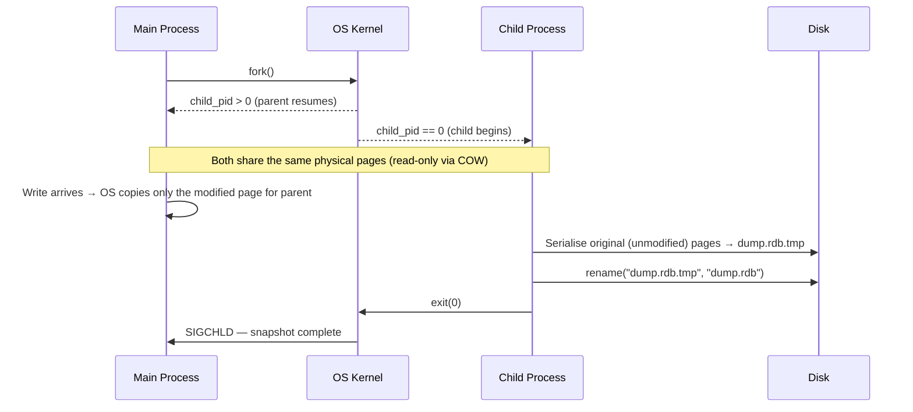
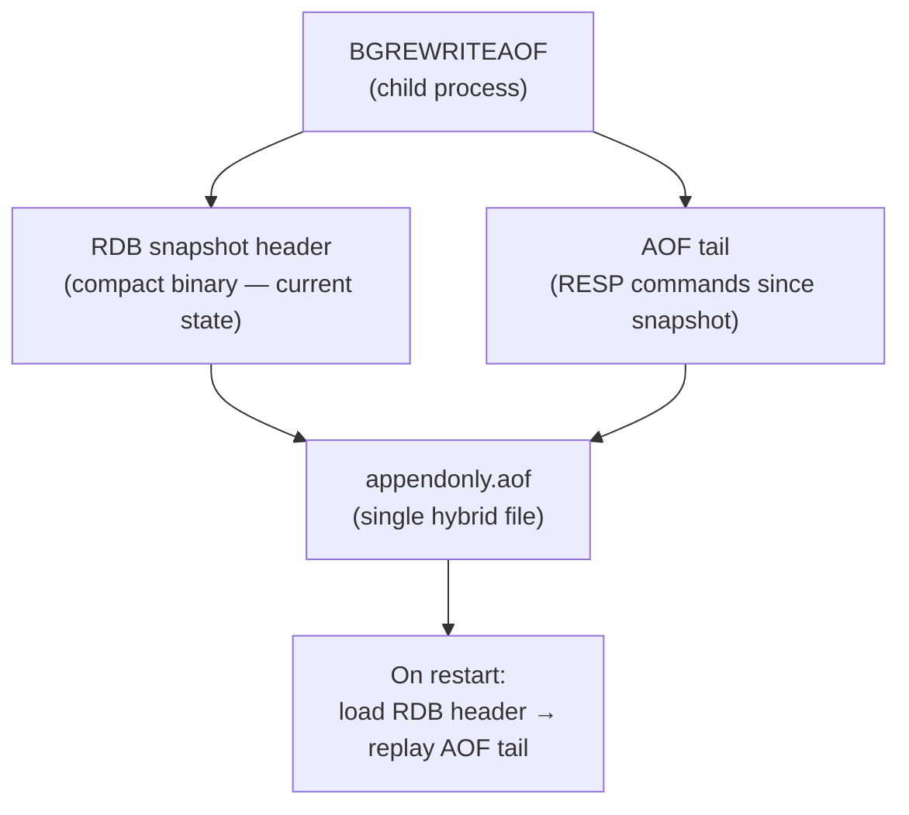
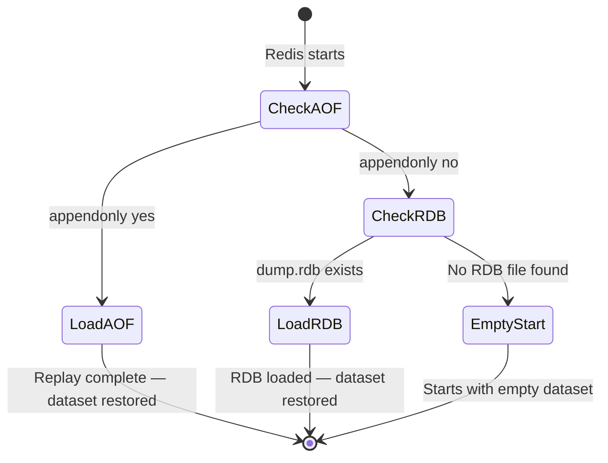

# Redis Persistence: Surviving a Crash with RDB and AOF

Redis stores every key and value in RAM, which makes it fast — but volatile. A process crash, an OS restart, or a power outage silently erases the entire dataset. Redis's persistence layer closes that gap by writing data to disk in two distinct ways: **RDB (Redis Database)** snapshots, which periodically dump a point-in-time copy of the entire dataset to a single binary file, and **AOF (Append-Only File)**, which appends every write command to an ever-growing log that can be replayed to reconstruct state. A common misconception is that RDB and AOF are mutually exclusive choices — in practice, modern Redis defaults to running both together, and lesson 01 §4 introduced their basic trade-off; this lesson goes inside each mechanism.

---

## 1. Why Persistence Exists

### 1.1 The Durability Gap

RAM is **volatile storage**: when a computer loses power, or when a process is killed, every byte in RAM disappears immediately. This is the natural consequence of how RAM works — it holds data only while electricity flows. For a cache that can be rebuilt from a database, this is acceptable. For a Redis instance acting as a primary store, a message queue, or a session backend, it is not.

The gap between what Redis has acknowledged to a client and what is safely on disk is called the **durability gap**. Consider a Redis server that just executed ten thousand writes in the last two seconds. Those writes are in RAM, responded to with `+OK`, and considered done by the applications that issued them — but if the process dies now, they are gone unless Redis has flushed them to disk.

Persistence bridges that gap by writing state to disk, which survives process crashes, OS restarts, and hardware power events. As lesson 01 §4 established, every persistence option trades some write throughput or accepts some data loss window in exchange for survivability. The two mechanisms differ in *how much* of each trade they accept.

---

## 2. RDB: Point-in-Time Snapshots

An **RDB snapshot** is a binary file containing the full state of the Redis dataset at a specific moment. It is conceptually a photograph — an atomic view of every key and value at the instant it was taken. Loading an RDB file on startup reconstructs the entire dataset in a single pass, without replaying any commands.

### 2.1 Triggering a Snapshot

Redis exposes two ways to produce a snapshot.

**`SAVE`** runs the snapshot in the foreground. The main Redis thread serialises the entire dataset to disk. No client commands are processed until `SAVE` finishes. This is safe but blocks all traffic, making it inappropriate for production use on large datasets.

**`BGSAVE`** runs the snapshot in the background. Redis calls `fork()` to create a child process, which then writes the snapshot to a temporary file and atomically renames it to `dump.rdb` upon completion. The parent — the main Redis process — continues serving commands throughout.

The `save` directive in `redis.conf` automates `BGSAVE` triggers. Multiple rules can coexist:

```text
# Trigger a BGSAVE if at least 1 key changed in the past 900 seconds
save 900 1
# Trigger a BGSAVE if at least 10 keys changed in the past 300 seconds
save 300 10
# Trigger a BGSAVE if at least 10,000 keys changed in the past 60 seconds
save 60 10000
```

Redis checks these conditions periodically and fires `BGSAVE` when any threshold is crossed.

### 2.2 fork() and Copy-on-Write: How the Snapshot Stays Consistent

The key question is: how can the child process snapshot the dataset at a frozen point in time while the parent continues writing new data? The answer is the OS mechanism called **copy-on-write (COW)**.

When `fork()` is called, the OS does **not** copy the parent's entire memory into the child's address space. Instead, both processes share the same physical memory pages, each mapped read-only. The child can read all the data as it existed at the fork instant. Only when either process *modifies* a page does the OS make a private copy of that page for the modifier — the original page stays intact for the reader.

```c
// Simplified — actual Redis fork and snapshot code is in src/rdb.c
int child_pid = fork();
if (child_pid == 0) {
    // Child process: memory pages are shared read-only with the parent.
    // Walk the entire dataset and serialise to a temp file.
    rdbSave("dump.rdb.tmp");
    // Atomically replace the live file only after a full, successful write.
    rename("dump.rdb.tmp", "dump.rdb");
    exit(0);
}
// Parent process: continues serving commands normally.
// Any page it modifies gets a private COW copy; the child sees the original.
```

Analogy: imagine a library of physical books. `fork()` gives the child a catalogue pointing to the same physical shelves. Neither party rearranges anything at first, so no copying is needed. When a librarian (the parent) edits a chapter, the library makes a photocopy of *that chapter* first — the child still reads the original. Only the edited chapter costs a copy; the rest of the library is shared for free.



*BGSAVE creates a child process via `fork()`. Copy-on-write ensures the child sees a frozen snapshot while the parent continues serving writes — only pages the parent modifies are physically duplicated.*

### 2.3 The RDB File: Compact, Fast, One-Sided

The RDB file is a compact binary format — smaller than an equivalent AOF log because it stores final values rather than the command history that produced them. It loads fast on restart (Redis reads the file once in a single pass; no command replay). It is also well-suited for offsite backups and point-in-time restores.

The cost is the data loss window: whatever writes arrived since the last `BGSAVE` are gone if the server dies before the next snapshot fires. With the configuration above, that window can be up to 900 seconds. For workloads that can tolerate losing a few minutes of writes — a pure cache, for instance — RDB alone may be sufficient.

> Note: `BGSAVE` is not free even when it completes quickly. Because every page the parent modifies *during* the snapshot triggers a COW copy, a write-heavy workload during a snapshot can temporarily push Redis's resident memory significantly higher. On a server with tight memory headroom, this can trigger the OS out-of-memory killer.

---

## 3. AOF: The Append-Only Log

**AOF** takes the opposite approach: rather than saving a snapshot of current state, Redis records every write command as it executes and appends it to a file. On restart, Redis replays the log from top to bottom to reconstruct state, exactly as if those commands were re-issued by a client.

### 3.1 What Gets Written and When

After a write command executes successfully, Redis formats it as a RESP frame (the same protocol lesson 03 §5 showed being parsed by the I/O thread) and appends it to an in-memory AOF buffer. The buffer is periodically flushed to the AOF file on disk. The log is textual enough to be inspectable — you can open `appendonly.aof` and see a sequence of `SET`, `HSET`, `ZADD`, and other commands.

Because the log records *what was done* rather than *the resulting state*, it is additive by nature: it grows without bound as long as Redis is running.

### 3.2 fsync Policies: Durability vs. Throughput

Writing to a file does not mean the bytes are on disk. The OS maintains a **page cache** — a buffer in RAM that absorbs writes and flushes them to physical storage asynchronously for efficiency. A process crash after writing to the file but before the OS page cache is flushed loses that write.

**`fsync()`** is the system call that forces the OS page cache to commit to physical storage. Redis's `appendfsync` config controls how aggressively it is called:

| Policy | When `fsync` runs | Data loss risk | Throughput impact |
| :--- | :--- | :--- | :--- |
| `always` | After every write command | Near-zero (at most one command) | High — OS cannot batch flushes |
| `everysec` | Once per second (default) | Up to ~1 second of writes | Low — OS batches within the window |
| `no` | Never (left entirely to the OS) | Several seconds possible | None — OS buffers freely |

The default `everysec` is a deliberate trade-off: it limits exposure to one second of writes while giving the OS latitude to batch flushes and maintain high throughput. `always` is appropriate only when the storage medium is fast enough (e.g., a battery-backed NVMe array) that per-command fsyncs do not become the bottleneck.

> Nuance: `fsync always` does not unconditionally guarantee zero data loss. Whether the underlying hardware honours the fsync depends on write-back caches, storage controllers, and virtualisation layers. On a system without true hardware persistence guarantees, `always` can still lose a command in a sudden power failure.

### 3.3 AOF Rewrite: Compacting the Log

The AOF file grows indefinitely. A Redis instance running for weeks can accumulate gigabytes of log entries, the vast majority of which are redundant — a key set and deleted a thousand times contributes a thousand log lines but contributes zero to the final state.

**`BGREWRITEAOF`** compacts the log. Like `BGSAVE`, it uses `fork()`: the child process walks the current in-memory dataset and writes the *minimal* set of commands that would reproduce it from scratch — one `SET` per string key, one `HSET` per hash, and so on. New writes that arrive during the rewrite are buffered by the parent and appended to the new log file once the child finishes.

```c
// Simplified from Redis src/aof.c
if (fork() == 0) {
    // Child: produce a minimal command set reproducing current in-memory state
    aofRewriteBuffer(tmp_file, db);
    rename(tmp_file, "appendonly.aof");
    exit(0);
}
// Parent: continues normal command execution.
// New writes also go into server.aof_rewrite_buf.
// After the child exits, that buffer is appended to the new file.
```

Redis can be configured to trigger rewrites automatically when the file size crosses a threshold (`auto-aof-rewrite-percentage`, `auto-aof-rewrite-min-size`), or triggered manually with `BGREWRITEAOF`.

---

## 4. Hybrid Persistence: The Best of Both

Introduced in Redis 4.0 and made the default in Redis 7 (`aof-use-rdb-preamble yes`), **hybrid persistence** combines RDB and AOF into a single file. When `BGREWRITEAOF` runs, the child writes:

1. An **RDB-format snapshot** of the current dataset as the file header — compact binary, fast to load.
2. Any commands that arrived **during** the rewrite, in RESP format, as a short AOF tail.

On the next restart, Redis loads the RDB section in one fast pass and then replays only the AOF tail — just the commands written since the last rewrite. Startup time approaches that of a pure RDB restart while the data loss window approaches that of pure AOF.



*Hybrid persistence writes an RDB header followed by a short AOF tail in a single file, combining fast startup with a small data-loss window.*

The trade-off: the file is no longer a plain RESP log. It cannot be opened and grepped for specific commands the way a pure AOF file can. Auditing, manual replay, or point-in-time recovery tools must be hybrid-aware.

---

## 5. Recovery: What Loads on Restart

When Redis starts up, it inspects configuration to decide how to rebuild the dataset.



*Redis's startup decision tree: when AOF is enabled it is always authoritative, regardless of whether an RDB file also exists.*

AOF is always authoritative when enabled because it has finer granularity — it captures writes that occurred after the last RDB snapshot. If both files exist and AOF is enabled, Redis ignores the RDB file entirely at startup.

> Note: if the AOF file is corrupt (e.g., truncated by a crash mid-write), Redis refuses to start and logs an error. `redis-check-aof --fix` trims the truncated tail and allows startup at the cost of the partial final write.

---

## 6. Practical Limits and Trade-offs

- **RDB data loss window**: the time between snapshots is the maximum data loss exposure. The default configuration can lose up to 900 seconds of writes. This is acceptable for a pure cache; it is not for a primary store where every write matters.

- **fork() memory spike**: both `BGSAVE` and `BGREWRITEAOF` use `fork()`. COW means only modified pages are duplicated, but on a write-heavy server during the snapshot window, the parent can copy a large fraction of its working set. On a server near its memory limit, this can push resident memory above the available ceiling and trigger the OS out-of-memory killer.

- **`fsync everysec` loss window**: the default policy accepts up to one second of commands lost on a crash. Most workloads tolerate this; financial transaction logs or leader-election state typically require `fsync always` and storage hardware that can honour it.

- **AOF file growth and rewrite cost**: without periodic `BGREWRITEAOF` runs, the AOF grows without bound. Each rewrite consumes I/O and CPU proportional to dataset size. Frequent rewrites on a large, write-heavy dataset create sustained disk pressure that competes with client write traffic.

- **Hybrid file opacity**: the hybrid AOF format is not human-readable in its RDB header section. Auditing, point-in-time recovery, or manual command replay requires a tool that understands the format — `redis-check-aof` or `redis-cli --rdb`; opening the file in a text editor is not useful for the RDB portion.

- **Persistence competes for disk bandwidth**: RDB and AOF writes share the server's disk bandwidth with normal Redis I/O. On a server with a single spinning disk, a background snapshot writing hundreds of megabytes can visibly increase write latency for concurrent clients.

---

## 7. Summary

Redis's persistence layer fills the durability gap that in-memory storage leaves open. RDB snapshots use `fork()` and copy-on-write to produce a compact binary dump of the entire dataset in the background without blocking the main thread — fast to load and efficient to store, but limited by the snapshot interval's data loss window. AOF logs every write command and can be flushed to disk as frequently as once per command, shrinking the loss window to near-zero at the cost of higher I/O and a file that must be periodically compacted by `BGREWRITEAOF`. Hybrid persistence, the modern default, unifies both mechanisms by writing an RDB snapshot as the head of the AOF rewrite and appending only the commands that arrived during that rewrite — achieving fast restart times alongside a small durability window, at the cost of losing the plain-text readability of a pure AOF log. Both mechanisms share the same `fork()`-plus-copy-on-write machinery, so understanding COW is the key insight: it is what allows Redis to take a consistent snapshot of a live, changing dataset without blocking a single client command.
