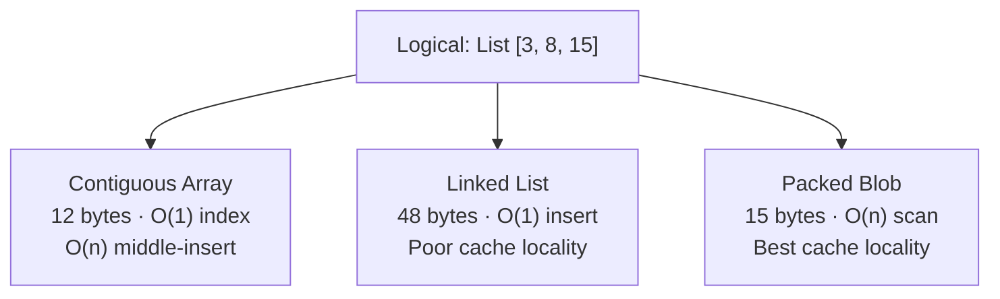
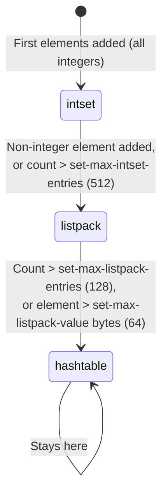

# Encoding and Objects: From Logical Type to Physical Bytes

A data type describes *what operations are possible* — push to a list, look up a key in a hash, check membership in a set. It says nothing about how the bytes sit in memory. That is the job of the **encoding**: the physical layout chosen to store the same logical value. The same list, hash, or set can be stored in completely different representations depending on its size, with each representation carrying different memory and speed trade-offs. A common misconception when working with Redis is that "a Hash is a hash table" — but small hashes use a compact contiguous blob, not a hash table at all. As lesson 04 showed, every Redis value carries an `encoding:4` bitfield in its `robj` header recording which physical layout is in use. This lesson unpacks what that choice means, starting from first principles before arriving at Redis.

---

## 1. One Logical Type, Many Physical Layouts

An **abstract data type (ADT)** is a contract: it specifies which operations exist and how they behave from the caller's perspective. A `List` supports push, pop, and indexed access. A `Set` supports add, remove, and membership test. The ADT says nothing about the bytes behind the interface.

An **encoding** — also called a *representation* or *physical layout* — is a concrete answer to the question: *how are these values actually stored in memory?* The same ADT can be realised by many different encodings. Each encoding makes different bets about the workload: how many items are typical, how large each item tends to be, which operations must be fast, and how much memory is available.

This distinction exists in every piece of software. It is not unique to Redis, databases, or any particular language. Any time a system chooses *how* to store something, it is choosing an encoding — often without telling you.

Analogy: a to-do list is an ADT. The operations are "add item," "check off item," "read all items." You can represent the same list as a handwritten sticky note, a phone app's database, or a memorised sequence in your head. The *what* (a to-do list with the same tasks) is identical across all three; the *how* (bytes, storage medium, retrieval speed) differs in every way. Switching the list from a sticky note to a phone app does not change what tasks you have — it changes how fast you can search them, how many you can store, and how much "space" they occupy.

---

## 2. A Worked Generic Example — Storing a List of Numbers

To make the idea concrete, consider storing the same logical value — the list `[3, 8, 15]` — in three different physical layouts. No Redis yet; this is a language-agnostic illustration.

**Layout A: Contiguous array**

Items are stored back-to-back in a single block of memory. Each item sits at a predictable fixed offset.

```c
// Three integers packed into a single allocation — 12 bytes total
int array[3] = {3, 8, 15};
// array[0] at address X
// array[1] at address X+4
// array[2] at address X+8
```

Strength: O(1) indexed access; all elements share the same cache line, so traversal is CPU-cache-friendly. Weakness: inserting in the middle requires shifting every subsequent element — O(n) work.

**Layout B: Linked list**

Each item is wrapped in a node that carries a pointer to the next node.

```c
// A linked-list node on a 64-bit system: 16 bytes for one integer
typedef struct Node {
    int   value;        // 4 bytes: the actual integer
    int   _padding;     // 4 bytes: compiler alignment
    struct Node *next;  // 8 bytes: pointer to the next node
} Node;
// Three integers → three Node allocations, scattered across the heap
```

Strength: O(1) prepend or append; no shifting on insert. Weakness: each element costs four times the memory of the raw integer; the nodes are scattered across the heap, so traversing the list chases pointers across many cache lines — poor locality.

**Layout C: Packed blob**

Items are serialised into a contiguous byte slice with a compact header per element.

```text
[1-byte len=4][4 bytes: value=3][1-byte len=4][4 bytes: value=8][1-byte len=4][4 bytes: value=15]
total: 15 bytes vs. 12 bytes for the raw integers, 48 bytes for the linked list
```

Strength: minimal memory — no pointer overhead, no per-node heap allocation; the whole structure fits in one or two cache lines for small sizes. Weakness: no indexed access; finding item N requires scanning from the beginning — O(n).



*The same three-integer list can be encoded as an array, a linked list, or a packed blob. Each encoding makes a different trade-off between memory footprint, access speed, and insert speed.*

All three layouts satisfy the List ADT. The right choice depends on usage: if the list is almost always small and mostly read sequentially, the packed blob wastes the least memory. If the list can be large and needs constant random access, the array wins. If inserts at arbitrary positions are common on large lists, a more sophisticated structure is needed. No single encoding is universally best — it depends on what the data looks like in practice.

---

## 3. Optimize the Small Case, Scale the Big Case

There is a recurring pattern in systems that care about both memory efficiency and performance: *use a compact encoding when values are small, and switch to a scalable encoding when they grow*. The insight behind the pattern is statistical: most real-world values are small. A hash with three fields is far more common than a hash with ten thousand fields. An application storing user sessions, feature flags, or product metadata mostly operates on small collections. Paying the overhead of a scalable data structure for every value — even the tiny ones — wastes memory and cache space on the overwhelming majority of keys.

This pattern appears throughout computing, long before Redis:

**Small-string optimization (SSO)** in C++ and Rust: a `std::string` that is short enough (typically ≤15 bytes) stores its characters *inside* the string object itself, with no heap allocation. A string that exceeds the threshold allocates on the heap. The same logical type — a string — has two physical layouts, transparently selected by the runtime.

**Inline arrays / small-vector optimization**: many high-performance libraries (LLVM's `SmallVector`, Rust's `smallvec` crate) keep the first N elements in a fixed-size inline buffer and only heap-allocate once N is exceeded. This avoids the cost of a heap allocation and a pointer indirection for the common small case.

**JVM Integer cache**: the Java Virtual Machine caches `Integer` objects for values from -128 to 127. `Integer.valueOf(5)` returns the same cached object on every call — no allocation. Outside that range, a new object is created per call. The same logical integer type is backed by a different physical representation depending on its value.

In every case, the compact form wins on the overwhelmingly common small case: lower memory, better cache behaviour, fewer allocations. The scalable form handles unlimited size at higher per-element cost. The transition happens automatically at a threshold.

This is the mental model to carry into the next section: Redis applies the same pattern to every data type it stores — and exposes the chosen encoding as an observable, tunable property.

---

## 4. Redis Applies This: Type vs. Encoding

In Redis, every stored value is wrapped in an `robj` (Redis object) struct. As lesson 04 §4.1 showed in detail, the struct's first 32 bits pack three bitfields: `type:4` records the logical type (string, list, hash, set, zset), `encoding:4` records the physical layout chosen for that value, and `lru:24` is a clock for eviction. The `type` field reflects what you created; the `encoding` field is what Redis chose for you, silently, based on what the value currently looks like.

`OBJECT ENCODING <key>` is the command that surfaces this choice:

```
> SET counter 42
OK
> OBJECT ENCODING counter
"int"

> SET greeting "hello"
OK
> OBJECT ENCODING greeting
"embstr"

> SET essay "This is a long string that exceeds the embstr threshold..."
OK
> OBJECT ENCODING essay
"raw"

> SADD small-set 1 2 3
(integer) 3
> OBJECT ENCODING small-set
"intset"
```

The logical type (string, list, hash, set, zset) is fixed once a key is created; the encoding can change as the value grows. `OBJECT ENCODING` is the feedback loop for understanding and tuning how Redis physically stores your data.

---

## 5. Two Redis Examples in Action

### 5.1 String Encodings: int, embstr, raw

A Redis **String** value uses one of three encodings, each matching a different size and usage profile:

- **`int`**: if the value can be parsed as a 64-bit signed integer, Redis stores it directly as a C `long`, not as a byte string. `INCR` and `DECR` then operate on the integer in-place with no string parsing — the compact form happens to also be the fastest for counter workloads.
- **`embstr`**: strings up to 44 bytes are stored in a single memory allocation that contains both the `robj` header and the string bytes. This fits the entire object inside a 64-byte CPU cache line (the `robj` header is 16 bytes; the remaining 48 bytes, minus one for the null terminator, give 44 usable bytes for the string). No separate heap allocation, no extra pointer to chase.
- **`raw`**: strings longer than 44 bytes use a standard dynamic-size allocation separate from the `robj` header — two allocations total, the conventional representation.

```
> SET n 1000
> OBJECT ENCODING n
"int"

> SET msg "hello"
> OBJECT ENCODING msg
"embstr"

> APPEND msg " — now this string is definitely longer than 44 bytes total"
> OBJECT ENCODING msg
"raw"
```

`embstr` is immutable by design — any modification (even `APPEND` adding one byte) immediately promotes the string to `raw`, because in-place modification would require reallocating the combined object.

### 5.2 Set Encodings: intset, listpack, hashtable

A Redis **Set** steps through three encodings as it grows, making the compact-then-scale pattern especially vivid because there are three distinct levels.



*A Redis Set starts in the most compact encoding and ratchets up as size or element type crosses a threshold — one-way only.*

- **`intset`**: if every element is an integer, Redis stores them in a sorted, fixed-width packed array — a close cousin of the packed blob from §2. Binary search gives O(log n) membership tests with no pointer overhead and near-perfect cache locality. The most memory-efficient encoding for small all-integer sets.
- **`listpack`** (Redis 7.2+, replacing the older `ziplist`): for small sets with mixed or non-integer members, Redis uses a compact contiguous memory block where each entry stores its own length prefix, enabling sequential traversal. A linear scan is acceptable because the threshold keeps these small.
- **`hashtable`**: once the set grows large, Redis promotes it to a standard hash table (the same `dict` structure used for the top-level keyspace), giving O(1) average-case add, remove, and membership at the cost of per-entry pointer overhead and heap fragmentation.

The governing config knobs are `set-max-intset-entries` (default: 512), `set-max-listpack-entries` (default: 128), and `set-max-listpack-value` (default: 64 bytes per element).

> Nuance: Redis's encoding transitions are a **one-way ratchet**. Once a set grows past the `listpack` threshold and converts to a `hashtable`, Redis never converts it back — even if elements are removed and the count drops below the threshold again. Checking on every removal would add CPU cost on the hot path for a benefit that rarely arises in practice. The compact encodings are designed to optimise the common *initial* small case, not to continuously re-compact a value that briefly became large.

### 5.3 Other Types at a Glance

The same compact-then-scale pattern applies across all Redis collection types. The compact encoding uses a `listpack` (or `intset` for integer sets); the scalable encoding promotes to a pointer-based structure.

| Type | Compact encoding (small) | Scalable encoding (large) | Key config knobs |
| :--- | :--- | :--- | :--- |
| **List** | `listpack` | `quicklist` (linked list of listpack nodes) | `list-max-listpack-size` |
| **Hash** | `listpack` | `hashtable` | `hash-max-listpack-entries`, `hash-max-listpack-value` |
| **Sorted Set** | `listpack` | `skiplist` + `hashtable` | `zset-max-listpack-entries`, `zset-max-listpack-value` |

In every case the structure is the same one seen in §3: a cache-friendly compact form for the small common case, and a pointer-based scalable form for larger collections.

---

## 6. Practical Limits and Trade-offs

- **Compact encodings are O(n) — thresholds must stay small**: `listpack` and `intset` require linear scans for operations like membership tests or element lookup. This is acceptable only because the threshold sizes are kept small by default. Raising `hash-max-listpack-entries` to, say, 5000 silently turns every `HGET` on a large-but-below-threshold hash into a linear scan. There is no error or warning — performance degrades quietly.

- **Raising thresholds trades CPU for memory**: the compact encodings use significantly less memory than their pointer-based counterparts for small collections. Lowering thresholds triggers earlier promotion and increases memory per key. Whether the trade is worthwhile depends on access patterns; benchmark with `DEBUG OBJECT <key>` and `INFO memory` before adjusting thresholds in production.

- **The one-way ratchet persists through shrinkage**: a key that briefly grew large — a set that temporarily hit 600 members before bulk-deleting down to 10 — retains its `hashtable` encoding permanently. If memory efficiency matters, the key must be deleted and recreated to reset the encoding.

- **`embstr` and the 44-byte boundary**: any operation that modifies a string value — even `APPEND` adding a single byte — converts `embstr` to `raw` immediately, because `embstr`'s single-allocation design is immutable. Avoid building strings incrementally with `APPEND` if compact encoding matters.

- **`OBJECT ENCODING` is the tuning feedback loop**: before adjusting any threshold config, inspect real keys with `OBJECT ENCODING` and `DEBUG OBJECT` to understand what encodings are actually in use and how much memory each key consumes. Threshold changes without measurement produce unknown trade-offs.

---

## 7. Summary

The central lesson here is a universal one that extends far beyond Redis: a logical type describes what a value *is* and what operations it supports, while the encoding describes how it *actually lives in memory* — these are independent concerns. Systems everywhere apply the same pattern: use a compact, cache-friendly representation for small values, and switch transparently to a scalable pointer-based structure as size grows. C++ strings avoid a heap allocation for short strings; Rust vectors keep small counts inline; the JVM caches common integers as singletons. Redis applies this same pattern to every collection type it stores, recording the chosen physical layout in a 4-bit field on each object's header and ratcheting the encoding upward as values cross configurable size thresholds. Understanding that a Redis Hash is not always a hash table, that a Set is not always an algorithmic set, and that `OBJECT ENCODING` exposes the real choice the server made — that is what separates informed Redis usage from treating the server as a black box.
