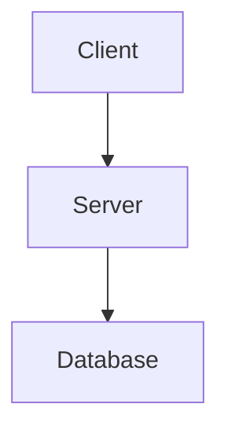

# 02-redis-internal Guidelines

## Purpose

Lesson-by-lesson notes from a Redis internals video series. Each file is a self-contained, standalone recap — technically detailed enough to serve as a future reference, and educational enough to explain *why*, not just *what*.

The goal is not a transcript. A good lesson file should let someone who missed the video understand the concept deeply, including the reasoning behind every design decision.

---

## File Naming

`NN-<topic-slug>.md` — sequential number, lowercase, hyphenated words. Example: `04-memory-allocator.md`.

---

## Document Structure

Every lesson file follows this order. Do not skip sections.

```
# <Topic>: <Optional Subtitle>

<Intro paragraph — 2–4 sentences. State the core idea upfront.
Call out any common misconception or surprising nuance right here,
before the reader has formed a wrong mental model.>

---

## 1. <First Major Section>

### 1.1 <Sub-topic>
...

---

## 2. ...

---

## N. Practical Limits and Trade-offs

<Bulleted list of real-world constraints, failure modes, and design trade-offs.
Each bullet must have a **bold label** followed by a sentence of explanation —
never a bare fact fragment. Example: "**Speed vs. durability**: in-memory
storage makes Redis fast but volatile — a crash loses any writes not yet
flushed to disk.">

---

## N+1. Summary

<3–6 sentences of prose that a reader can use as a quick recap
without re-reading the whole file. No bullet lists here — prose forces you
to show how the ideas connect, not just enumerate them.>
```

**Structural rules:**
- Separate every major section (`## N.`) with a `---` horizontal rule. In Markdown, `---` renders as a visible dividing line.
- Top-level sections use `## N.` (e.g. `## 1.`, `## 2.`).
- Sub-sections use `### N.M.` (e.g. `### 1.1`, `### 2.3`). Never use `##` for a sub-section — that makes it look like a top-level section when rendered.

---

## Writing Style

### Explain the why

For every mechanism or design decision, answer: *why did Redis choose this approach, and what problem does it solve?* Just describing how something works without explaining why it was designed that way leaves the reader unable to reason about it in a new context.

Bad: "Redis uses a single thread for command execution."
Good: "Redis uses a single thread for command execution because it eliminates lock contention and race conditions entirely — no two commands can ever interleave, so every operation is automatically atomic."

### Analogies

Use a concrete, real-world analogy for every non-trivial concept. Place the analogy *after* the technical explanation, not before — the reader needs the concept first so the analogy clicks.

An analogy is "non-trivial" if a junior engineer would not immediately grasp the concept from its name alone. For example, "mutex" and "epoll" need analogies. "String" does not.

A good analogy is specific and maps the mechanics, not just the name:

Bad analogy: "A mutex is like a lock on a door."
Good analogy: "A mutex is like a single bathroom key passed between employees. Only the person holding the key can enter (execute the critical section). If you want in and someone else has the key, you wait. Crucially, only the person who took the key can return it — no one else can release it on your behalf."

### Nuances and caveats

When a concept is commonly misunderstood or oversimplified, surface it using a Markdown blockquote prefixed with `> Nuance:` or `> Note:`. A blockquote in Markdown is a line that starts with `>` — it renders as an indented, visually distinct callout.

Example:
```
> Nuance: Redis is not "single-threaded everywhere." The single-threaded
> guarantee applies specifically to command execution, not to I/O or
> background persistence work.
```

### Trade-offs

Every significant design choice has a cost. Always name both sides: what is gained and what is given up. Common pairs to watch for:

- Speed vs. durability (in-memory vs. persisted to disk)
- Simplicity vs. throughput (single thread vs. multi-thread)
- Memory vs. precision (approximate data structures like HyperLogLog)
- Availability vs. consistency (async replication vs. sync replication)

Calling out trade-offs is what separates an educational note from a marketing brochure.

Placement rule: weave each trade-off into the prose at the point where the mechanism is introduced — *"The gain is X; the cost is Y."* Then consolidate the most important ones in the final "Practical Limits and Trade-offs" section so a reader skimming to that section gets the full picture without having to re-read the whole lesson.

### Tone

Educational and precise. Avoid over-brevity — a reader should be able to fully understand the topic from this file alone without watching the video again. At the same time, do not pad with filler. Every sentence should earn its place.

Aim for **5–8 major sections** per lesson. Fewer than five usually means a concept was not fully unpacked; more than eight usually means the lesson is covering two topics and should be split into a follow-up.

### Terminology

- **Bold every key term on first definition.** If you introduce a concept by name for the first time, bold the name at that exact sentence so readers can skim-locate definitions. Example: *"The OS keeps a per-process table of open resources. The FD is the index into that table; it is just a number…"* should instead read *"…called a **file descriptor (FD)**."*
- **Expand every acronym on first use.** Write it out in full, then show the abbreviation in parentheses: *"**Redis Serialization Protocol (RESP)**"*. After that first use, the abbreviation alone is fine. Common Redis-world acronyms to watch for: RESP, RDB, AOF, TTL, FD, AOF, HA.

---

## Diagrams

Include at least one diagram per file. Diagrams here are written in **Mermaid** — a plain-text diagram syntax that GitHub and most Markdown renderers convert into visual diagrams automatically. You write code inside a fenced code block labelled `mermaid`, and the renderer draws the picture.

Example of a Mermaid block:
````

````

Choose the diagram type that best fits what you are showing:

| Situation | Diagram type | What it looks like |
| :--- | :--- | :--- |
| Multi-layer or component architecture | `graph TD` | Boxes connected by arrows, flowing top-down |
| Request lifecycle or events over time | `sequenceDiagram` | Vertical swimlanes per participant, messages as horizontal arrows |
| Object states and transitions | `stateDiagram-v2` | Bubbles connected by labelled arrows |
| Simple short pipeline (3–4 steps) | ASCII `text` block | Plain characters, no tooling needed |

`graph TD` means "directed graph, top-down." You can also use `graph LR` for left-to-right if that suits the layout better.

**Rules for diagrams:**
- Every diagram must have a one-line italic caption immediately below it (using `*caption text*`) describing what it shows.
- Diagrams must be directly tied to the explanation in the surrounding text — no decorative diagrams.
- Keep node labels short and readable. Use `["Label text"]` for boxes with spaces or special characters.
- For multi-line node labels in `graph` diagrams, use `<br/>` as the line separator, never `\n`. GitHub's Mermaid renderer prints `\n` literally as two characters inside the node box rather than breaking the line.

---

## Tables

Use a Markdown table when comparing multiple options, mechanisms, or properties side by side. Tables make comparisons scannable in a way that prose cannot.

Table syntax in Markdown:
```
| Column A | Column B |
| :---     | :---     |
| value    | value    |
```

The `:---` in the second row is required — it tells the renderer this is a header row and aligns the column text to the left. Always use left-alignment (`:---`) unless there is a specific reason to centre or right-align.

---

## Code Snippets

Use code snippets when the mechanics of a concept cannot be adequately explained in prose — typically when showing how an API is called, what a data format looks like, or how a loop or data structure works internally.

**Language**: use C-style pseudocode for low-level internals (system calls, data structures, event loops). Use real language syntax (Python, Go, Redis CLI commands) when showing how Redis is used from an application.

**Style rules:**
- Introduce every snippet with exactly one sentence explaining what it demonstrates.
- Comment every non-obvious line inside the snippet. Do not comment the obvious (`// increment i by 1`).
- Keep snippets under roughly 20 lines. If a concept needs more, split it into two snippets with prose between them.
- Use `// Simplified — ...` to flag when pseudocode omits real detail for clarity.

---

## Cross-Lesson References

Because lessons in this series build on each other, explicitly link backward and forward where it aids understanding.

**Backward references** (linking to a previous lesson): use these in the intro paragraph or at the start of a section that zooms into something the prior lesson introduced at a higher level. Example: *"As lesson 02 established, one-thread-per-client fails at scale — here we quantify why."*

**Forward references** (pointing to a future lesson): use these at the end of a section or diagram caption when the current lesson deliberately leaves something at a high level. Example: *"Lesson 03 traces each of these steps with epoll system calls and code."*

Do not repeat a concept at the same level of detail if a prior lesson already covered it. One sentence referencing the prior lesson is enough; a reader who needs the detail can go back.

---

## What to Avoid

- **Do not produce bare bullet-point lists.** A list of fact fragments is not a lesson — it has no explanation, no reasoning, no analogy. Prose should carry the explanation. Bullets are only acceptable in the "Practical Limits and Trade-offs" section, where each item must start with a **bold label** followed by a sentence of reasoning. A bullet that reads *"— speed vs. durability"* is not acceptable; *"**Speed vs. durability**: in-memory storage is fast but volatile — a crash discards any writes not yet persisted."* is.
- **Do not skip analogies or trade-offs for the sake of brevity.** They are required, not optional.
- **Do not end a file without a Summary section.** The summary is what a reader uses to quickly re-orient after not reading the file for a month.
- **Do not copy-paste video transcripts.** Rewrite concepts in your own words — that process itself deepens understanding.
- **Do not add a standalone "why this works" or "why this is fast" section.** The explanation of why belongs inside the section where the mechanism is introduced. The Summary is the only place for restatement. A separate synthesis section adds length without adding understanding.
