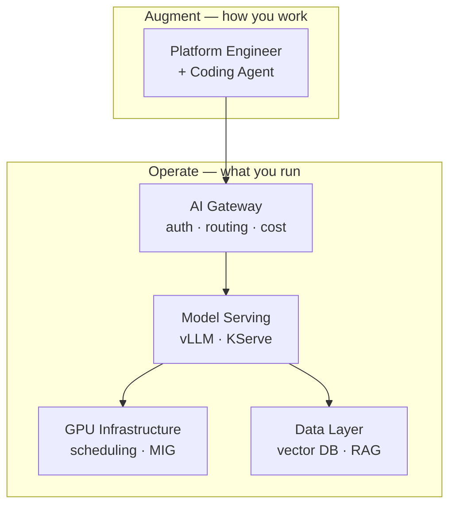
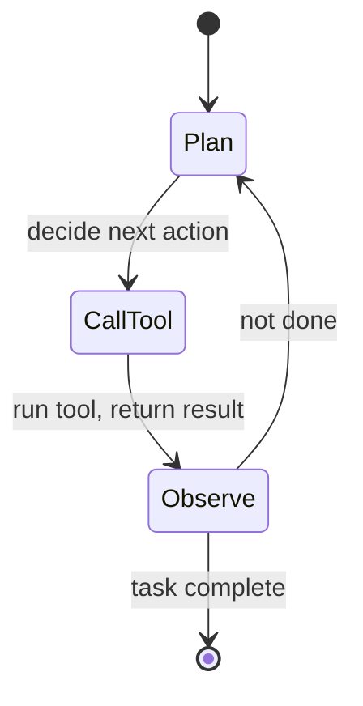

# AI for Platform Engineers: The New Layer of the Stack

Artificial intelligence is not arriving as a feature inside someone else's product — it is arriving as a new layer of the platform you build and operate. A common misconception is that "AI" means chatbots, or that it is the machine-learning team's problem and not the platform engineer's. Both are wrong. The thing reshaping the field is the **Large Language Model (LLM)** — a general-purpose engine for language and reasoning — and it lands squarely in platform territory: it needs to be served, scaled, secured, scheduled onto scarce hardware, observed, and paid for, while simultaneously changing how engineers write the very automation that runs the platform.

This overview frames the platform engineer's **dual mandate** in the AI era and maps the rest of the track. It assumes you already know Kubernetes, cloud, and CI/CD well; the job here is to connect the unfamiliar (AI internals) to the vocabulary you already own.

---

## Contents

1. [The Two Shifts: A Dual Mandate](#1-the-two-shifts-a-dual-mandate)
2. [How LLMs Actually Work (Just Enough)](#2-how-llms-actually-work-just-enough)
3. [From Chatbots to Agents](#3-from-chatbots-to-agents)
4. [The New Infrastructure Layer](#4-the-new-infrastructure-layer)
5. [What Changes for the Platform Engineer](#5-what-changes-for-the-platform-engineer)
6. [Practical Limits and Trade-offs](#6-practical-limits-and-trade-offs)
7. [Summary](#7-summary)

---

## 1. The Two Shifts: A Dual Mandate

The AI era pulls platform engineering in two directions at once, and treating them as one blurs both.

The first shift is **augmentation**: AI changes *how you work*. Coding agents draft Terraform, write Kubernetes manifests, triage incidents, and refactor pipelines — turning the platform engineer from someone who types every line into someone who directs, reviews, and bounds an agent that types most of them. This is not autocomplete; it is delegation, and delegation needs guardrails.

The second shift is **operation**: AI changes *what you run*. The moment a product team wants to ship an LLM feature, they need somewhere to serve a model, a way to feed it private data, **Graphics Processing Units (GPUs)** to run inference, and a way to know whether any of it is working. That "somewhere" is a platform — and building it is the same discipline you already practice, applied to unfamiliar components.

These two shifts reinforce each other. The tools you adopt to augment your workflow (Phase 2 of the curriculum) are themselves built from the infrastructure you must learn to operate (Phase 3) — an MCP-driven ops agent is just a client of the model-serving stack underneath it.

*The platform engineer sits on both sides: consuming AI through a gateway to augment their work, and building the serving, GPU, and data layers that make any of it possible.*

---

## 2. How LLMs Actually Work (Just Enough)

You cannot operate what you cannot reason about, so start with the engine. An LLM does not store facts in a database or execute a program. It is a function trained to predict the next **token** — a sub-word chunk of text, roughly four characters — given all the tokens before it. Generation is that prediction run in a loop: predict a token, append it, predict the next, until the response is complete. Everything the model "knows" is baked into billions of numeric weights fixed at training time.

Two consequences matter for a platform engineer. First, the model has a fixed **context window**: the maximum number of tokens it can consider at once, covering both your input and its output. The window is a hard budget, and it is what you pay for — billing is per token, in and out. Second, generation is **probabilistic**: the model samples from a distribution over possible next tokens, so the same prompt can yield different output on each call.

> Nuance: This is the single biggest mental-model shift from traditional APIs. A REST endpoint is a pure function — same input, same output, cacheable, assertable in a unit test. An LLM call is none of those by default. You cannot `assertEquals` on its output, and "it worked when I tried it" is not evidence it always will.

Think of the model as an extraordinarily well-read improviser rather than a librarian. A librarian retrieves the exact page you asked for. An improviser has internalised millions of pages and produces a fluent, plausible continuation on the spot — usually right, occasionally confidently wrong, and never word-for-word the same twice. Lesson 01 unpacks tokens, embeddings, and inference in depth.

---

## 3. From Chatbots to Agents

A raw LLM only emits text, which is why the "AI = chatbot" framing took hold. The leap that makes AI useful to a platform engineer is **tool use**: giving the model a catalogue of actions it can invoke — run a query, call an API, apply a manifest — and letting it decide when to call them. The model does not execute anything itself; it emits a structured request ("call `get_pods` with namespace `prod`"), your code runs the action, and the result is fed back into the context for the next step.

Wrap that in a loop and you have an **agent**: a system that plans, calls a tool, observes the result, and repeats until the task is done. This loop is what separates "draft me a YAML file" from "find why the deployment is failing and propose a fix."

*The agentic loop: the model reasons, requests a tool call, observes the outcome, and iterates — the same loop whether it is fixing code or triaging an incident.*

The integration problem this creates — how does any agent discover and call the tools a given system exposes? — is answered by the **Model Context Protocol (MCP)**, an open standard for describing tools so agents and systems interoperate without bespoke glue. For a platform engineer, MCP is the seam where AI meets your existing surface area: wrap your internal APIs, cloud accounts, and clusters as MCP tools and any compliant agent can drive them. Lessons 03 and 04 cover agentic workflows and MCP in depth; lesson 05 applies them to platform operations.

---

## 4. The New Infrastructure Layer

When a product team ships an AI feature, it quietly adds a stack of components your platform has never had to host. Each is a distinct operational concern, and each maps onto something you already understand.

| New component | What it does | Closest thing you already run |
| :--- | :--- | :--- |
| **Model serving** | Runs inference behind an API, batching many requests onto a GPU | A stateful, latency-sensitive service with expensive warm-up |
| **GPU infrastructure** | Provides and schedules the accelerators inference runs on | A scarce, costly node pool with its own device drivers |
| **Vector database** | Stores embeddings and answers "what is semantically similar" | A specialised index/datastore alongside your primary DB |
| **RAG pipeline** | Retrieves private data and injects it into the prompt | An ingestion + query pipeline feeding a request path |

The unifying theme is that inference is **stateful and hardware-bound** in a way stateless web services are not. A GPU holds a multi-gigabyte model in memory and a per-request **Key-Value cache (KV-cache)**; you cannot treat replicas as cheap and disposable when each one occupies a $30,000 accelerator and takes a minute to load. **Retrieval-Augmented Generation (RAG)** is the dominant pattern for grounding a model on private data — instead of retraining the model, you retrieve relevant documents at query time and paste them into the context window, leaning directly on the token budget from Section 2. Lessons 06 through 09 build this layer up from embeddings to GPU scheduling.

---

## 5. What Changes for the Platform Engineer

Your job description does not change — provide golden paths, abstract away complexity, keep things reliable and cheap — but the specifics shift in ways worth naming.

You will design **golden paths for AI**: a self-service way for a product team to get a grounded, rate-limited, observable model endpoint without standing up vLLM and a vector database themselves. You will treat the **GPU as a scheduled, scarce resource** — the way you already think about quotas and bin-packing, except the unit is an accelerator that may need partitioning via **Multi-Instance GPU (MIG)** to be shared at all (lesson 09).

The reliability story gains new failure modes that have no equivalent in stateless services. A model can **drift** — its real-world inputs shift until yesterday's good answers become today's bad ones — without any code change or alert firing. Correctness is no longer a green test suite but an **evaluation** score on a representative dataset, because a probabilistic system has no single correct output to assert against. And cost moves from a monthly surprise to a per-request, per-token line item that a runaway agent loop can balloon in minutes. These concerns — evals, drift, token cost, and the governance around them — are the subject of lessons 10 through 12.

> Note: Most of this is your existing discipline pointed at new objects. "Schedule a scarce resource," "give teams a paved road," "make the system observable," and "control spend" are platform engineering fundamentals. The novelty is in the *properties* of the workload — non-deterministic, hardware-bound, drift-prone — not in the goals.

---

## 6. Practical Limits and Trade-offs

- **Probabilistic vs. deterministic**: an LLM call is not a pure function — the same prompt can return different output, so you cannot cache it, assert on it in a unit test, or assume "it worked once" means it always will. Reliability comes from evals over datasets, not equality checks.
- **Capability vs. cost**: a larger, smarter model costs more per token and demands more GPU memory and time, so the default should be the *smallest* model that passes your evals, not the most capable one available.
- **Latency vs. throughput**: serving small batches gives each request a fast response but wastes the GPU; large batches maximise tokens-per-GPU but make individual requests wait. This is the same tuning dial you know from request handling, now governing very expensive hardware.
- **Velocity vs. governance**: self-service AI access lets teams ship fast, but every new agent and prompt widens the attack surface for prompt injection and data leakage — autonomy must be bounded by approvals, RBAC, and guardrails.
- **Build vs. buy**: self-hosting models gives you data control and predictable latency but means owning GPUs, scaling, and upgrades; managed APIs remove that burden but send your data to a third party and price per token. The right answer is workload-specific and worth revisiting as both sides evolve.

---

## 7. Summary

AI reaches the platform engineer as a dual mandate: augment how you work by delegating to agents, and operate the new infrastructure those agents and product features depend on. Underneath both sits the LLM — a probabilistic next-token predictor with a fixed, billable context window — whose behaviour breaks the deterministic-API assumptions baked into most of our tooling. Tool use and MCP turn that text engine into agents that can act on your systems, while model serving, GPUs, vector databases, and RAG form a new, stateful, hardware-bound layer the platform must host. Almost none of this asks you to abandon what you know; it asks you to point familiar disciplines — paved roads, scarce-resource scheduling, observability, cost control — at a workload with unfamiliar properties. The rest of this track works through each layer in turn, starting with the model itself in lesson 01.
