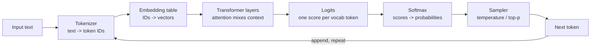
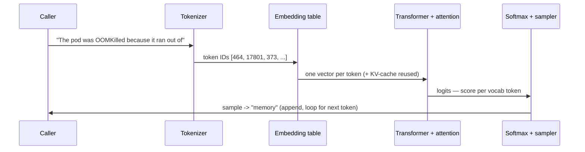

# LLM Fundamentals: What the Model Actually Computes

A **Large Language Model (LLM)** is a function trained to do one thing: given a sequence of text, predict the next chunk of text. Everything else — answering questions, writing Terraform, summarising an incident — is that single prediction run in a loop. The most common and most damaging misconception is that an LLM "looks things up" in some internal database or "understands" in the way a person does. It does neither. It has compressed statistical patterns from a vast amount of text into billions of numeric weights, and it uses those patterns to produce a plausible continuation. Internalising this one fact explains almost every surprising behaviour you will meet: hallucinations, non-determinism, knowledge cutoffs, and why the same prompt can succeed and fail on consecutive calls.

This lesson, the first in the track, builds the mental model the rest of the curriculum stands on. As `00-overview.md` put it, you cannot operate what you cannot reason about — so we will trace one prompt all the way from raw characters to a generated token, stopping to open each box along the way.

---

## 1. Tokens: The Unit the Model Sees

### 1.1 Why Sub-Word Tokens

The model never sees words or characters. Before any text reaches it, a **tokenizer** splits the text into **tokens** — sub-word chunks drawn from a fixed vocabulary, typically 50,000–200,000 entries. Why sub-words rather than whole words or single characters? Whole-word vocabularies cannot represent a word they never saw in training (every typo, identifier, and new term becomes an unknowable blank), while single characters make sequences punishingly long and force the model to relearn spelling from scratch every time. Sub-words are the compromise: common words become one token, rare ones break into reusable pieces, and *any* string — including `kubectl` or a UUID — is always representable as some sequence of known pieces.

The dominant algorithm is **Byte-Pair Encoding (BPE)**: starting from individual bytes, it repeatedly merges the most frequent adjacent pair into a new token, building a vocabulary where frequent strings collapse to single tokens and rare strings stay split. The result for a typical sentence:

```text
Text:    "Kubernetes pods autoscale nicely"
Tokens:  ["Kub", "ernetes", " pods", " autos", "cale", " nicely"]
IDs:     [42, 8769, 23532, 1300, 8002, 11526]
```

Note three things: `pods` is common enough to be one token (with its leading space, which tokenizers fold into the token), `Kubernetes` splits into two pieces because it is rarer, and what the model ultimately receives is the **ID** row — integers, not text. Roughly, one token averages ~4 characters of English, so 1,000 tokens ≈ 750 words.

### 1.2 Why This Matters to a Platform Engineer

Two practical consequences. First, **everything is billed and bounded in tokens** — both the text you send and the text generated. A 4,000-word document is ~5,300 tokens before the model writes a single word of response, and you pay for input and output tokens separately. Second, token boundaries explain otherwise baffling failures: a model can struggle to spell a word or count its letters because it sees opaque chunks like `ernetes`, not individual characters. The classic "how many r's in strawberry" failure is a tokenization artefact, not a reasoning one — the model never saw the letters.

> Note: Token counts are model-specific. The same sentence tokenizes differently across model families because each ships its own vocabulary. When you estimate cost or check whether input fits, use the tokenizer for the *exact* model you are calling — a rule of thumb is fine for planning, not for hard limits.

Tokenization is like a shipping warehouse that never handles arbitrary objects directly — it handles standard-sized boxes and pallets. Goods are packed into the nearest standard units before anything moves, and the whole logistics system reasons in pallets, not original items. The model likewise reasons in tokens, and its sense of length, cost, and even spelling is measured in that unit.

---

## 2. Embeddings: Meaning as Geometry

### 2.1 From Token ID to Vector

A token ID like `8769` is just an index — it carries no meaning, and `8769` is no closer to `8770` than to `42`. The first thing the model does is look each ID up in an **embedding table**: a giant matrix with one row per vocabulary entry, each row a vector of numbers (the **embedding**) — commonly 768 to 12,288 values for the model's internal representation. These vectors are *learned* during training such that tokens used in similar contexts end up near each other in the vector space. Meaning, in other words, becomes a *position*.

This is the model's substitute for understanding: relatedness becomes *distance*. Consider three words reduced (for illustration) to 3-dimensional vectors:

```text
"latency"     -> [ 0.81,  0.22, -0.05]
"throughput"  -> [ 0.79,  0.18, -0.11]   # near "latency" — same domain
"invoice"     -> [-0.42,  0.90,  0.33]   # far away — unrelated domain
```

`latency` and `throughput` point in nearly the same direction; `invoice` points elsewhere. The model can compute that two ideas are related by measuring how close their vectors are, with no symbolic definition of either.

### 2.2 Measuring Closeness with Cosine Similarity

The standard way to score "how close" is **cosine similarity** — the cosine of the angle between two vectors, ranging from 1 (same direction, highly similar) through 0 (perpendicular, unrelated) to −1 (opposite). Direction is used rather than raw distance so that intensity or length does not distort the comparison. The arithmetic is the dot product divided by the magnitudes:

```text
cos(latency, throughput) = (0.81·0.79 + 0.22·0.18 + (-0.05)(-0.11)) / (|latency|·|throughput|)
                         ≈ 0.640 / (0.842 · 0.812)
                         ≈ 0.936      # very similar

cos(latency, invoice)    ≈ -0.150 / (0.842 · 1.045)
                         ≈ -0.171     # unrelated / mildly opposed
```

A score of 0.94 versus −0.17 is the whole game: similar meanings score high, unrelated ones do not. This exact operation — embed text, compare by cosine — is the basis of vector search and Retrieval-Augmented Generation, which lesson 06 builds into a production data store and lesson 07 into a grounding pipeline.

An embedding is like plotting every concept as a pin on an enormous map where location is decided purely by meaning, not spelling. Pins for "GPU," "accelerator," and "CUDA" cluster in one neighbourhood; "invoice" and "billing" cluster in another, far away. To find related concepts you no longer match strings — you ask "which pins are nearest this one." Two phrases sharing no words ("the cluster ran out of memory" and "OOMKilled pods") can still land close because they appeared in similar contexts during training.

---

## 3. The Transformer and Attention

### 3.1 The Problem Attention Solves

A token's embedding (Section 2) is *context-free*: the row for `bank` is identical whether the sentence is about a river or a vault. But meaning depends on surroundings, so the model must mix information *between* token positions to make each token's representation reflect its actual context. The mechanism that does this — the heart of the **Transformer** architecture nearly every modern LLM uses — is **attention**.

### 3.2 Query, Key, and Value

For each token, the model derives three vectors from its embedding: a **query** (what this token is looking for), a **key** (what this token offers to others), and a **value** (the information it passes along if attended to). To update a token, the model scores its query against *every* token's key (a dot product, like the similarity in Section 2), turns those scores into weights, and produces a weighted blend of the value vectors. High score → that token contributes heavily.

Take "the pod crashed because **it** ran out of memory." To resolve `it`, the model scores `it`'s query against every key:

```text
Attention weights for the token "it":
  the      0.02
  pod      0.71   <- by far the strongest match
  crashed  0.14
  because  0.03
  ran      0.06
  ...
```

Because `pod` wins the weighting, `it`'s updated representation is built mostly from `pod`'s value — the model has, in effect, decided "it" refers to "pod." Stack this operation across dozens of layers and multiple parallel attention "heads" (each learning a different relationship — grammatical, topical, positional) and the model builds deeply context-sensitive meaning. The cost is that every token attends to every other, so the work grows with the *square* of the sequence length — the root reason long contexts are slow and expensive (Section 5, and lesson 08).

> Nuance: Which tokens matter is recomputed for *every* token and *every* layer — attention is not a one-time parse. The weights above are illustrative of one head at one layer; the real model blends many such weightings. The takeaway is mechanical, not numeric: meaning flows between positions by learned, content-dependent weighting.

Attention is like a researcher writing one sentence of a report while surrounded by a wall of sticky notes. For each new word, they glance across all the notes and let the few relevant ones drive what they write, ignoring the rest — and which notes matter changes with every word. They never re-read everything equally; they weight what matters for the word at hand.

---

## 4. Inference: The Generation Loop

### 4.1 Autoregressive Decoding

Producing a response is called **inference**, and it is strictly sequential. The model takes the full token sequence, runs it through all the attention layers once, and emits a vector of **logits** — one raw score per vocabulary token, saying how strongly each is favoured as the *next* token. A **softmax** function turns those logits into a probability distribution (every value 0–1, summing to 1). A **sampler** picks one token from that distribution, appends it to the sequence, and the whole process repeats with the now-longer input. This is **autoregressive** generation: each output token feeds back in to produce the next, until the model emits a special end-of-sequence token or hits a length cap. A 500-token answer is 500 forward passes.

In pseudocode, the entire generation loop is short:

```python
# Simplified — the autoregressive decode loop
tokens = tokenize(prompt)
while True:
    logits = model(tokens)          # one forward pass over the whole sequence
    probs  = softmax(logits[-1])    # distribution for the NEXT token only
    next_id = sample(probs, temperature, top_p)   # pick one token (Section 4.2)
    if next_id == END_OF_TEXT:
        break
    tokens.append(next_id)          # feed it back in and repeat
```

### 4.2 Temperature and Top-p: Steering the Sampler

The sampler is where **non-determinism** enters. Pick the single highest-probability token every time (**greedy** decoding) and generation is nearly deterministic but often bland and repetitive. In practice two knobs shape the distribution before sampling. **Temperature** scales the logits: low temperature sharpens the distribution toward the top token; high temperature flattens it so unlikely tokens get a real chance. **Top-p (nucleus) sampling** keeps only the smallest set of tokens whose probabilities sum to *p* and samples among those, cutting off the long tail. Worked on the same raw distribution:

```text
Next-token probabilities for "...ran out of ___":
  token        raw    T=0.2     T=1.0     T=1.5
  memory       0.50   0.86      0.50      0.39
  disk         0.30   0.13      0.30      0.31
  time         0.15   0.01      0.15      0.21
  patience     0.05   0.00      0.05      0.09
```

At `T=0.2` the model almost always says "memory" — focused and repeatable. At `T=1.5` "disk," "time," even "patience" become live options — varied but more error-prone. Top-p of 0.8 here would drop "patience" (and at low temperature "time" too) from consideration entirely.

> Nuance: Even temperature 0 is not a guarantee of byte-identical output. Floating-point non-associativity on GPUs, batching with other requests, and silent provider-side model updates can all shift results. Treat "deterministic" as "low variance," never as reproducible. This is the core reason, established in `00-overview.md`, that you cannot `assertEqual` on an LLM call.

The generation loop is like an improvising storyteller who can only ever speak the next single word, then must reconsider the whole story-so-far before speaking the word after. They never plan the full sentence in advance; each word is chosen in the moment, conditioned on everything already said. A tiny early swerve — one unusual word at high temperature — changes the context for every word that follows, which is why two runs of the same prompt can diverge into entirely different answers.



*One step of inference: text becomes token IDs, then vectors, flows through attention layers to logits, softmax turns those into probabilities, and the sampler picks one token — appended and fed back to generate the next.*

---

## 5. The Context Window: A Fixed, Shared Budget

### 5.1 What the Window Is

The **context window** is the maximum number of tokens the model can consider in a single call — a hard architectural limit (8K, 128K, or a few million tokens depending on the model) that must hold *both* your input and the generated output. There is no streaming-in of an unbounded document and no memory between calls: if a fact is not in the window, the model does not have it. Conversation "memory" is an illusion created by resending all prior turns as input every time — which is why a long chat gets slower and more expensive with each turn.

For a platform engineer the window is best understood as a resource to budget, exactly like a memory limit on a pod. A worked example for a 128K-token model serving a chat turn:

```text
Context budget (128,000 tokens total):
  system prompt + instructions      1,500
  retrieved documents (RAG)        12,000
  conversation history             40,000
  current user message                800
  ------------------------------ --------
  input subtotal                   54,300
  reserved for the response         4,000
  ------------------------------ --------
  used                             58,300   (~46% of window)
```

Overflow it and the oldest or least-relevant content must be dropped or summarised. Lesson 02 treats engineering this budget as a discipline in its own right.

### 5.2 The KV-Cache and "Lost in the Middle"

Two facts ride along with the window. First, regenerating attention's keys and values for every prior token on every step would be ruinous, so the model caches them — the **Key-Value cache (KV-cache)** — and computes only the new token's keys and values each step. That cache lives in GPU memory and grows with every token, which is why it dominates serving capacity in lesson 08. Second, models do not use a long context evenly.

> Nuance: A bigger window raises the ceiling on what you *can* pass — not a guarantee the model uses it all well. Relevant facts buried in the middle of a long context are frequently missed, the documented "lost in the middle" effect. Put the most important material at the start or end of the window, and never assume "it's in the context" means "the model will use it."

---

## 6. Training vs. Inference: Why the Model Has No Live Facts

### 6.1 Two Separate Phases

There are two completely separate phases in a model's life, and conflating them causes most "why doesn't it know X" confusion. **Training** is the one-time, enormously expensive process of adjusting the model's weights by showing it huge volumes of text and nudging the weights to predict each next token better. **Inference** is every subsequent use of the finished model to generate output. The decisive point: during inference the **weights are frozen**. The model does not learn from your conversation, does not remember previous users, and does not update itself with anything you tell it.

### 6.2 Knowledge Cutoff and Hallucination

Two consequences follow directly. First, every model has a **knowledge cutoff** — it knows nothing about events, APIs, or your private systems that postdate or were absent from its training data. Asking it about a service you deployed last week is hopeless; that information never existed in its weights. Second, because the weights encode statistical patterns rather than retrievable records, the model produces a fluent, confident answer even with no basis for one — a **hallucination**. It is not lying; it is doing exactly what it was built to do, generating a plausible continuation, and "plausible" and "true" are not the same thing.

The fix is not to retrain for every fact — that is impractical and slow. The fix is to put the needed facts *into the context window at inference time*, so the model generates from supplied truth rather than memory. That single move — retrieve relevant, current data and inject it into the prompt — is **Retrieval-Augmented Generation (RAG)**, the subject of lesson 07, and it is why embeddings (Section 2) and the context budget (Section 5) matter so much in practice.

A trained model is like a brilliant consultant who studied everything written up to a certain date, then walked into a sealed room with no phone or internet. They reason superbly about anything in their training, but they have zero knowledge of what happened after they entered the room — and if you ask about your specific internal system they have never heard of, they will still answer confidently from general patterns rather than admit ignorance. To get a correct answer about your world, you must hand them the relevant documents through the door. That is RAG.

---

## 7. End-to-End: One Prompt, One Token

To consolidate, here is the complete journey of a single generation step for the prompt `The pod was OOMKilled because it ran out of`, with the model about to produce the next token.



*The full path for one token: text is tokenized to IDs, IDs become vectors, attention mixes context across the sequence, logits are scored, and the sampler emits one token — which is appended and the loop runs again.*

**Step by step:**

**1. Tokenize.** The tokenizer (Section 1) splits the prompt into IDs — e.g. `["The", " pod", " was", " OOM", "Killed", " because", " it", " ran", " out", " of"]` → `[464, 7126, 373, 31436, 42, ...]`. Ten words may become eleven or twelve tokens.

**2. Embed.** Each ID is looked up in the embedding table (Section 2), producing one context-free vector per token.

**3. Attend.** Through every Transformer layer, attention (Section 3) mixes the vectors so that, for instance, the representation of `it` absorbs `pod`, and `out of` strongly anticipates a noun. Previously processed tokens' keys and values come from the KV-cache (Section 5.2), so only the newest position is computed fresh.

**4. Score.** The final layer emits logits (Section 4.1) — a score for every one of the ~100,000 vocabulary tokens. `memory` scores highest given the OOM context; `disk` and `time` trail.

**5. Sample.** Softmax turns logits into probabilities and the sampler (Section 4.2) picks one — `memory` at low temperature. It is appended, and the loop returns to step 1 with an eleven-then-twelve-token sequence to generate the token after.

The entire user-visible "the model wrote a sentence" is this five-step loop run once per token — which is exactly why latency scales with output length and why everything in lessons 02–10 is built to make these predictions reliable, grounded, and affordable.

---

## 8. Practical Limits and Trade-offs

- **Probabilistic, not deterministic**: sampling makes the same prompt yield different output across calls, so you cannot cache an LLM call, assert equality on it, or trust that "it worked once" means it always will — reliability comes from evals over datasets (lesson 10), not equality checks.
- **Creativity vs. consistency**: high temperature produces varied, exploratory output but more errors; low temperature is repeatable and focused but can be bland or repetitive — match the dial to the task, near-zero for extraction and code, higher for brainstorming.
- **Context size vs. cost and latency**: attention cost grows with the square of sequence length and the KV-cache grows linearly, so every extra token of context adds latency and money — pass what is relevant, not everything available.
- **Knowledge cutoff vs. freshness**: weights are frozen at training time, so the model is blind to anything newer or private, and closing that gap requires injecting facts at inference time (RAG, lesson 07), not hoping the model "knows."
- **Fluency vs. truth**: the model optimises for plausible continuations, so its confident tone carries no information about correctness — hallucinations look exactly like correct answers and must be caught by grounding and verification, not trusted because the prose is convincing.

---

## 9. Summary

An LLM is a next-token predictor: text is split into sub-word tokens, each token ID is looked up as an embedding that encodes meaning as position in space, attention weighs which tokens matter for each other, and inference loops — scoring logits, softmaxing to probabilities, and sampling one token at a time — to produce output. That sampling loop, steered by temperature and top-p, is why output is probabilistic and uncacheable. Everything the model considers must fit in a fixed context window shared between input and output, accelerated internally by a KV-cache that later dominates serving cost, and nothing persists between calls because the weights are frozen at training time. Those frozen weights give the model a knowledge cutoff and make hallucination an inherent behaviour, not a bug — which is precisely why later lessons inject live facts into the context (RAG) and verify output with evals rather than trusting the model's memory. Hold onto one sentence: the model does not retrieve or understand; it predicts, and your job as a platform engineer is to build systems that make those predictions reliable, grounded, and affordable.
