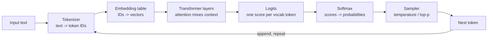
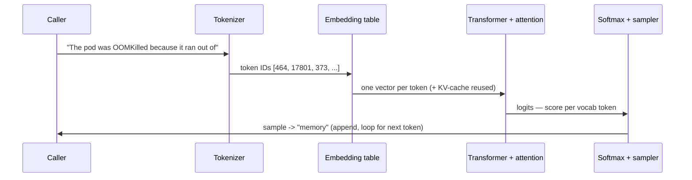

# LLM Fundamentals: What the Model Actually Computes

A **Large Language Model (LLM)** is a function trained to do one thing: given a sequence of text, predict the next chunk of text. Everything else — answering questions, writing Terraform, summarising an incident — is that single prediction run in a loop. The most common and most damaging misconception is that an LLM "looks things up" in some internal database or "understands" in the way a person does. It does neither. It has compressed statistical patterns from a vast amount of text into billions of numeric weights, and it uses those patterns to produce a plausible continuation. Internalising this one fact explains almost every surprising behaviour you will meet: hallucinations, non-determinism, knowledge cutoffs, and why the same prompt can succeed and fail on consecutive calls.

This lesson, the first in the track, builds the mental model the rest of the curriculum stands on. As `00-overview.md` put it, you cannot operate what you cannot reason about — so we will trace one prompt all the way from raw characters to a generated token, stopping to open each box along the way.

---

## 1. Tokens: The Unit the Model Sees

### 1.1 Why Sub-Word Tokens

The model never sees words or characters. Before any text reaches it, a **tokenizer** splits the text into **tokens** — sub-word chunks drawn from a fixed vocabulary, typically 50,000–200,000 entries. Why sub-words rather than whole words or single characters? Whole-word vocabularies cannot represent a word they never saw in training (every typo, identifier, and new term becomes an unknowable blank), while single characters make sequences punishingly long and force the model to relearn spelling from scratch every time. Sub-words are the compromise: common words become one token, rare ones break into reusable pieces, and *any* string — including `kubectl` or a UUID — is always representable as some sequence of known pieces.

The dominant algorithm is **Byte-Pair Encoding (BPE)**: starting from individual bytes, it repeatedly merges the most frequent adjacent pair into a new token, building a vocabulary where frequent strings collapse to single tokens and rare strings stay split. The result for a typical sentence:

```text
Text:    "Kubernetes pods autoscale nicely"
Tokens:  ["Kub", "ernetes", " pods", " autos", "cale", " nicely"]
IDs:     [42, 8769, 23532, 1300, 8002, 11526]
```

Note three things: `pods` is common enough to be one token (with its leading space, which tokenizers fold into the token), `Kubernetes` splits into two pieces because it is rarer, and what the model ultimately receives is the **ID** row — integers, not text. Roughly, one token averages ~4 characters of English, so 1,000 tokens ≈ 750 words.

### 1.2 Why This Matters to a Platform Engineer

Two practical consequences. First, **everything is billed and bounded in tokens** — both the text you send and the text generated. A 4,000-word document is ~5,300 tokens before the model writes a single word of response, and you pay for input and output tokens separately. Second, token boundaries explain otherwise baffling failures: a model can struggle to spell a word or count its letters because it sees opaque chunks like `ernetes`, not individual characters. The classic "how many r's in strawberry" failure is a tokenization artefact, not a reasoning one — the model never saw the letters.

> Note: Token counts are model-specific. The same sentence tokenizes differently across model families because each ships its own vocabulary. When you estimate cost or check whether input fits, use the tokenizer for the *exact* model you are calling — a rule of thumb is fine for planning, not for hard limits.

Tokenization is like a shipping warehouse that never handles arbitrary objects directly — it handles standard-sized boxes and pallets. Goods are packed into the nearest standard units before anything moves, and the whole logistics system reasons in pallets, not original items. The model likewise reasons in tokens, and its sense of length, cost, and even spelling is measured in that unit.

### 1.3 The Vocabulary File: The Lookup Table Both Ends Share

Where do those integer IDs come from, and why is `pods` specifically `23532`? The tokenizer ships with a **vocabulary** — a fixed file, built once during training, that lists every token string the model knows alongside the integer ID assigned to it. Tokenizing is not arithmetic on the text; it is *table lookup*. The tokenizer finds the longest known entries that cover your text and emits their IDs. Turning the model's output back into text (**detokenizing**) is the same table read in reverse: ID → string. A trimmed excerpt looks like this:

```text
# vocab.txt — one entry per line; the line number IS the token ID
...
"Kub"      -> 42
" pods"    -> 23532     # leading space is part of the token string
" autos"   -> 1300
"cale"     -> 8002
"ernetes"  -> 8769
...
```

Two things fall out of this. First, the ID is nothing but the **row number** of an entry — its position in the list. It carries no meaning of its own: `23532` is not "more" than `8002`, and ID `8769` is no more related to `8770` than to `42`; they are just neighbouring lines in a file. Second — and this is the part that makes the next section click — *this same ID is the index the model uses to look up the token's meaning*. The vocabulary is the shared contract: the tokenizer assigns the IDs, and the embedding table (the *Embeddings* section) is built with exactly one row per vocabulary entry, in the same order. The ID is the join key between the two.

A vocabulary ID is like a coat-check ticket number. The number `47` printed on the ticket tells you nothing about the coat — it is not warmer or longer than coat `46`. Its only job is to name a peg so the right coat can be fetched later. The tokenizer hands you the ticket; the embedding table is the rack the ticket retrieves from.

---

## 2. Embeddings: Meaning as Geometry

### 2.1 From Token ID to Vector

A token ID like `8769` is just an index (the *Vocabulary File* subsection) — it carries no meaning. Crucially, the ID is **not transformed into** a vector by some calculation; there is no formula that turns `8769` into meaning. Instead the ID is used as a **row number to fetch** a vector that was *already stored* during training. The model holds an **embedding table**: a giant matrix with one row per vocabulary entry — same order as the vocabulary, so row `8769` is the meaning of token `8769` — where each row is a vector of numbers (the **embedding**), commonly 768 to 12,288 values. Lookup is a plain array index:

```text
embedding_table[8769]  ->  [ 0.014, -0.221, 0.097, ..., 0.052 ]   # the pre-stored row for "ernetes"
```

These vectors are *learned* during training (the *Not a Hash* subsection below) such that tokens used in similar contexts end up near each other in the vector space. Meaning, in other words, is not derived from the ID — it is the *contents of the row the ID points to*, and that content becomes a *position* in space.

This is the model's substitute for understanding: relatedness becomes *distance*. Consider three words reduced (for illustration) to 3-dimensional vectors:

```text
"latency"     -> [ 0.81,  0.22, -0.05]
"throughput"  -> [ 0.79,  0.18, -0.11]   # near "latency" — same domain
"invoice"     -> [-0.42,  0.90,  0.33]   # far away — unrelated domain
```

`latency` and `throughput` point in nearly the same direction; `invoice` points elsewhere. The model can compute that two ideas are related by measuring how close their vectors are, with no symbolic definition of either.

### 2.2 Measuring Closeness with Cosine Similarity

The standard way to score "how close" is **cosine similarity** — the cosine of the angle between two vectors, ranging from 1 (same direction, highly similar) through 0 (perpendicular, unrelated) to −1 (opposite). Direction is used rather than raw distance so that intensity or length does not distort the comparison. The arithmetic is the dot product divided by the magnitudes:

```text
cos(latency, throughput) = (0.81·0.79 + 0.22·0.18 + (-0.05)(-0.11)) / (|latency|·|throughput|)
                         ≈ 0.685 / (0.841 · 0.818)
                         ≈ 0.996      # very similar

cos(latency, invoice)    ≈ -0.159 / (0.841 · 1.047)
                         ≈ -0.181     # unrelated / mildly opposed
```

A score of ≈1.0 versus −0.18 is the whole game: similar meanings score high, unrelated ones do not. This exact operation — embed text, compare by cosine — is the basis of vector search and Retrieval-Augmented Generation, which lesson 06 builds into a production data store and lesson 07 into a grounding pipeline.

An embedding is like plotting every concept as a pin on an enormous map where location is decided purely by meaning, not spelling. Pins for "GPU," "accelerator," and "CUDA" cluster in one neighbourhood; "invoice" and "billing" cluster in another, far away. To find related concepts you no longer match strings — you ask "which pins are nearest this one." Two phrases sharing no words ("the cluster ran out of memory" and "OOMKilled pods") can still land close because they appeared in similar contexts during training.

### 2.3 Not a Hash — a Learned Lookup

A natural guess is that the embedding table is some elaborate **hash** of the token. It is not, and the distinction matters. A hash is *designed* to scatter: it maps an input to a fixed, arbitrary output with no notion of similarity — change one character and the output is unrecognisably different, and two related words land nowhere near each other. An embedding is the opposite. There is no formula at all; each row is a set of **learned parameters** — just numbers — that start out random and are slowly *adjusted by training* until their geometry happens to encode meaning. Relatedness is not built in; it is grown.

How does random noise become meaning? Through the same loop that trains the whole model. The embeddings begin as random vectors, so at first the map is meaningless static. Then, over and over on trillions of tokens, the model is shown real text and asked to predict the next token; a **loss function** (cross-entropy) scores *how wrong* that prediction was; and **backpropagation** computes, for every number the model touched — including the embedding rows of the tokens in that example — which direction to nudge it to make the correct next token slightly more likely next time:

```python
# Simplified — one training step; the embedding table is just more weights to nudge
vecs    = embedding_table[token_ids]        # fetch current rows (the embedding lookup above)
pred    = model(vecs)                        # predict the next token
loss    = cross_entropy(pred, actual_next)   # how wrong was it? (a single number)
grads   = backprop(loss)                      # which way to nudge EVERY weight, embeddings included
weights = weights - learning_rate * grads     # take a tiny step that lowers the loss
# repeat ~trillions of times

# A hash, by contrast, is fixed and similarity-blind — nothing is learned:
hash("latency") -> 0x9f3a   ;  hash("throughput") -> 0x1c08   # no closer than any two random values
```

The meaning is an *emergent byproduct*, never designed in: because words like `latency` and `throughput` keep appearing in similar surroundings, the cheapest way for the model to lower its loss is to give them similar vectors — so over millions of nudges they drift together, while `invoice` drifts elsewhere. No one wrote a rule that latency is near throughput; the geometry settled there because it made next-token prediction more accurate.

> Note: The embedding table is not trained separately — it is part of the model's weights and is learned jointly with everything else under one loss. The same mechanism is what later **fine-tuning** uses: it continues this exact nudge-the-weights loop on a smaller, targeted dataset to adjust the model's *behaviour*. That is a different tool from injecting facts at inference time — lesson 07 draws the RAG-versus-fine-tuning line precisely.

A learned embedding is less like a filing rule fixed in advance and more like seating at a club that holds dinner every night with no assigned places. At first people sit at random. But each evening those who keep ending up in the same conversations drift to sit nearer each other, and after enough dinners the room self-organises: the database people at one end, the finance people at the other — an arrangement nobody designed, produced entirely by many small adjustments.

---

## 3. The Transformer and Attention

### 3.1 The Problem Attention Solves

A token's embedding (the *Embeddings* section) is *context-free*: the row for `bank` is identical whether the sentence is about a river or a vault. But meaning depends on surroundings, so the model must mix information *between* token positions to make each token's representation reflect its actual context. The mechanism that does this — the heart of the **Transformer** architecture nearly every modern LLM uses — is **attention**.

### 3.2 Query, Key, and Value

For each token, the model derives three vectors from its embedding: a **query** (what this token is looking for), a **key** (what this token offers to others), and a **value** (the information it passes along if attended to). To update a token, the model scores its query against *every* token's key (a dot product, like the cosine similarity in the *Embeddings* section), turns those scores into weights, and produces a weighted blend of the value vectors. High score → that token contributes heavily.

Take "the pod crashed because **it** ran out of memory." To resolve `it`, the model scores `it`'s query against every key:

```text
Attention weights for the token "it":
  the      0.02
  pod      0.71   <- by far the strongest match
  crashed  0.14
  because  0.03
  ran      0.06
  ...
```

Because `pod` wins the weighting, `it`'s updated representation is built mostly from `pod`'s value — the model has, in effect, decided "it" refers to "pod." Stack this operation across dozens of layers and multiple parallel attention "heads" — each learning a different relationship (grammatical, topical, positional), unpacked in the *Layers, Heads, and a Harder Sentence* subsection — and the model builds deeply context-sensitive meaning. The cost is that every token attends to every other, so the work grows with the *square* of the sequence length — the root reason long contexts are slow and expensive (the *Context Window* section, and lesson 08).

> Nuance: Which tokens matter is recomputed for *every* token and *every* layer — attention is not a one-time parse. The weights above are illustrative of one head at one layer; the real model blends many such weightings. The takeaway is mechanical, not numeric: meaning flows between positions by learned, content-dependent weighting.

> Nuance: Attention by itself is **order-blind**. Because a token's update is a *weighted sum* of value vectors, shuffling the inputs would shuffle the terms but produce the same blend — so raw attention cannot tell `pod crashed` from `crashed pod`. Order is supplied separately: before the first layer the model adds a **positional encoding** — a position-dependent vector (or, in modern models, a position-dependent rotation of the query/key vectors, "RoPE") — to each token's embedding, so "`pod` at position 2" and "`pod` at position 5" enter attention as distinguishable inputs. Word order is injected into the vectors, never inferred by attention on its own.

Attention is like a researcher writing one sentence of a report while surrounded by a wall of sticky notes. For each new word, they glance across all the notes and let the few relevant ones drive what they write, ignoring the rest — and which notes matter changes with every word. They never re-read everything equally; they weight what matters for the word at hand.

### 3.3 Beyond One Word: Layers, Heads, and a Harder Sentence

The `it → pod` example is one relationship resolved by one weighting. A real prompt needs *many* relationships resolved at once, and the architecture provides two axes of repetition to do it. **Heads** run side by side *within a single layer*: each head has its own query/key/value projections, so while one head tracks pronoun reference, another tracks subject–verb agreement, another tracks topic — all computed in parallel over the same tokens, then concatenated. **Layers** stack *in sequence*: each layer's output is the next layer's input, so early layers resolve local structure (which words bind to which) and later layers operate on those already-enriched vectors to assemble higher-order meaning. Depth is the model reasoning in passes; width (heads) is it tracking many relationships per pass.

Trace a harder prompt one step from completion — the model is about to predict the blank:

```text
"The database failed over to the replica after the primary lost its lease, so traffic now hits ___"
```

No single comparison answers this. A few illustrative links, across two of the dozens of layers:

```text
Layer 1 (local grammar) — a couple of heads, weights for selected tokens:
  query "its"      -> key "primary"   0.74      # whose lease? the primary's
  query "hits"     -> key "traffic"   0.66      # what hits? the subject
  query "now"      -> key "failed"    0.40      # tense / sequence cue

Layer 9 (meaning assembled on top of layer 1's output):
  query "hits ___" -> key "replica"   0.69      # after failover, traffic goes to the REPLICA
  query "hits ___" -> key "primary"   0.12      # the primary was demoted — down-weighted
```

By the upper layer the representation feeding the final score has absorbed "traffic," "failover," and "replica" while suppressing "primary." That single enriched vector for the last position is then projected into a score per vocabulary token (the mechanism is the *Autoregressive Decoding* subsection). The resulting top logits favour `the`, then `replica` — not because the model *understands* failover, but because in its training data, text about traffic after a failover overwhelmingly continued toward the replica. It is completing a pattern, not following a plan.

> Nuance: These weights are illustrative of a handful of links at two layers; the real model blends many heads across every layer, and no single number is meaningful on its own. The takeaway is structural — meaning is built up in passes, from local to global — not the specific values.

This is where the reader's sharpest question lands: *when a token is chosen, do the logits change?* Yes — completely, every step. Choosing a token does not "lock in" anything about the next one. Appending the token makes a longer sequence, and the model runs a **fresh forward pass** over that longer sequence, producing a **brand-new logit vector** — all ~100,000 scores recomputed from scratch, because the context the scores are conditioned on has changed:

```text
Before appending: "...so traffic now hits ___"
  the   0.55     replica 0.20     a 0.08     ...

After "the" is appended: "...so traffic now hits the ___"
  replica   0.71     primary 0.06     same 0.05     ...     # a different distribution entirely
```

Nothing carries over but the text itself. The model holds no belief that the answer "is" the replica; at each step it only produces a probability distribution over next tokens, recomputed from learned correlations in the now-longer string. That is the precise sense in which an LLM matches patterns rather than understands: there is no goal, plan, or fact being tracked between steps — only the next-token distribution, freshly scored each time.

This step-by-step rescoring is like an autocomplete that re-reads the entire sentence-so-far before *every single keystroke* and offers its best next fragment — with no idea what the sentence is ultimately "about." It is astonishingly good at the local guess precisely because it has seen so much text, and it never once forms an intention about the whole.

---

## 4. Inference: The Generation Loop

### 4.1 Autoregressive Decoding

Producing a response is called **inference**, and it is strictly sequential. The model takes the full token sequence and runs it through all the attention layers once, which leaves one context-rich vector per position. Only the **last position's** vector is used to predict the next token, but it is still just an embedding-sized vector (say 4,096 numbers) — not yet a score per word. One final step bridges that gap: an **output projection** (the "unembedding") multiplies that vector by a matrix with one row per vocabulary entry, producing the vector of **logits** — one raw score per vocabulary token, saying how strongly each is favoured as the *next* token:

```text
# Simplified — last layer output to logits
hidden_last  : [ 0.12, -0.84, ..., 0.31 ]        # 4,096 numbers for the final position
logits = hidden_last · Wout                       # Wout is [4,096 × ~100,000]; often the embedding matrix transposed
logits       : [ 1.2, -3.4, 8.7, ..., 0.5 ]      # ~100,000 scores — one per vocab token
```

That `Wout` is frequently the *same* embedding table from the *Embeddings* section, transposed (**weight tying**): the matrix that turns IDs into vectors going in is reused to turn the final vector back into per-token scores going out. Tying is not just tidy — it deletes a whole second matrix of `vocab × dim` parameters (for a 100k vocab × 4,096 dim, ~410M weights saved) and forces the "meaning" and "scoring" views of each token to share one representation, which also acts as a mild regulariser. A **softmax** function then turns those logits into a probability distribution (every value 0–1, summing to 1). A **sampler** picks one token from that distribution, appends it to the sequence, and the whole process repeats with the now-longer input. This is **autoregressive** generation: each output token feeds back in to produce the next, until the model emits a special end-of-sequence token or hits a length cap. A 500-token answer is 500 forward passes.

The two phases have a name and a cost asymmetry worth internalising. Consuming the prompt is one forward pass over *all* input tokens at once (**prefill**); generating the reply is one forward pass *per output token* (**decode**). That split explains two things you pay for directly: the first token is slow on a long prompt because prefill must run before any output appears, and **output tokens are billed higher than input tokens** because each one costs a full forward pass, whereas the entire input is processed in that single parallel prefill. It is also why latency scales with the length of the *output*, not the input — the prefill/decode split and its serving implications (Time To First Token vs. throughput) are lesson 08's subject.

In pseudocode, the entire generation loop is short:

```python
# Simplified — the autoregressive decode loop
tokens = tokenize(prompt)
while True:
    logits = model(tokens)          # one forward pass over the whole sequence
    probs  = softmax(logits[-1])    # distribution for the NEXT token only
    next_id = sample(probs, temperature, top_p)   # pick one token (see Temperature and Top-p, below)
    if next_id == END_OF_TEXT:
        break
    tokens.append(next_id)          # feed it back in and repeat
```

### 4.2 Temperature and Top-p: Steering the Sampler

The sampler is where **non-determinism** enters. Pick the single highest-probability token every time (**greedy** decoding) and generation is nearly deterministic but often bland and repetitive. In practice two knobs do most of the steering — others exist (top-k, min-p, repetition penalties), but these two are the common pair you will tune. **Temperature** scales the logits: low temperature sharpens the distribution toward the top token; high temperature flattens it so unlikely tokens get a real chance. **Top-p (nucleus) sampling** keeps only the smallest set of tokens whose probabilities sum to *p* and samples among those, cutting off the long tail. Worked on the same raw distribution:

```text
Next-token probabilities for "...ran out of ___":
  token        raw    T=0.2     T=1.0     T=1.5
  memory       0.50   0.86      0.50      0.39
  disk         0.30   0.13      0.30      0.31
  time         0.15   0.01      0.15      0.21
  patience     0.05   0.00      0.05      0.09
```

At `T=0.2` the model almost always says "memory" — focused and repeatable. At `T=1.5` "disk," "time," even "patience" become live options — varied but more error-prone. Top-p of 0.8 here would drop "patience" (and at low temperature "time" too) from consideration entirely.

> Nuance: Even temperature 0 is not a guarantee of byte-identical output. Floating-point non-associativity on GPUs, batching with other requests, and silent provider-side model updates can all shift results. Treat "deterministic" as "low variance," never as reproducible. This is the core reason, established in `00-overview.md`, that you cannot `assertEqual` on an LLM call.

The generation loop is like an improvising storyteller who can only ever speak the next single word, then must reconsider the whole story-so-far before speaking the word after. They never plan the full sentence in advance; each word is chosen in the moment, conditioned on everything already said. A tiny early swerve — one unusual word at high temperature — changes the context for every word that follows, which is why two runs of the same prompt can diverge into entirely different answers.



*One step of inference: text becomes token IDs, then vectors, flows through attention layers to logits, softmax turns those into probabilities, and the sampler picks one token — appended and fed back to generate the next.*

---

## 5. The Context Window: A Fixed, Shared Budget

### 5.1 What the Window Is

The **context window** is the maximum number of tokens the model can consider in a single call — a hard architectural limit (8K, 128K, or a few million tokens depending on the model) that must hold *both* your input and the generated output. There is no streaming-in of an unbounded document and no memory between calls: if a fact is not in the window, the model does not have it. Conversation "memory" is an illusion created by resending all prior turns as input every time — which is why a long chat gets slower and more expensive with each turn.

For a platform engineer the window is best understood as a resource to budget, exactly like a memory limit on a pod. A worked example for a 128K-token model serving a chat turn:

```text
Context budget (128,000 tokens total):
  system prompt + instructions      1,500
  retrieved documents (RAG)        12,000
  conversation history             40,000
  current user message                800
  ------------------------------ --------
  input subtotal                   54,300
  reserved for the response         4,000
  ------------------------------ --------
  used                             58,300   (~46% of window)
```

Overflow it and the oldest or least-relevant content must be dropped or summarised. Lesson 02 treats engineering this budget as a discipline in its own right.

### 5.2 The KV-Cache Is Not the Window

The **Key-Value cache (KV-cache)** is easy to confuse with the context window, but they are different *kinds* of thing. The context window is a **logical limit** — a rule about how many tokens may take part in a call (the *What the Window Is* subsection). The KV-cache is a **physical store in GPU memory** holding the attention **keys** and **values** (the *Query, Key, and Value* subsection) the model already computed for the tokens seen so far. They move together — both grow as tokens accumulate — but one is a budget and the other is RAM:

| | Context window | KV-cache |
| :--- | :--- | :--- |
| What it is | A token-count limit (a rule) | Computed key/value vectors (data) |
| Where it lives | Nowhere — it's a constraint | GPU memory |
| Measured in | Tokens | Bytes |
| Set by | The model's architecture | What's been processed so far this request |

Why cache at all? During decode the new token must attend to *every* prior token (the *Query, Key, and Value* subsection). Recomputing the keys and values for the whole sequence on every step would be ruinous — O(n) redundant work per token. So the model stores them once and computes only the *new* token's key and value each step.

This is exactly where the reader's second question bites: *if the logits change every step (as the "Beyond One Word" subsection showed), how can a cache help?* The resolution is to see that two different quantities are in play. The **logits do change every step and are not cached** — they are cheap and depend on the current step's attention, so they are recomputed each time. But the **keys and values of past tokens never change**: in a causal model a token's representation depends only on the tokens *before* it, never the ones generated after, so once "the primary lost its lease" has been processed, its keys and values are fixed for the rest of the generation. The cache stores that stable part; only the newest position is computed fresh. A worked count makes the saving concrete:

```text
Prompt: 1,000 tokens.  Then generate 200 tokens.
  Without cache: each new token recomputes K/V for the whole sequence
                 -> step 1 does ~1,000, step 200 does ~1,200  (O(n) per step, quadratic total)
  With cache:    each new token computes K/V for ITSELF only, reuses the rest
                 -> ~1 position of work per step  (O(1) per step)
```

> Note: The cache holds **keys and values, not logits or probabilities**. Logits are recomputed every step precisely because they change; K/V are cached precisely because, for past tokens, they do not. Conflating the two is what makes caching seem impossible — naming which is which dissolves it. The GPU-memory math (how the cache caps how many requests a GPU can serve) and the paging trick that manages it are lesson 08's subject.

The KV-cache is like a meeting minute-taker who keeps the running transcript on the desk rather than re-transcribing the whole meeting before writing each new line. The transcript-so-far never changes; only the latest line is added. What they *decide to say next* may shift with every line — but that is reasoning done fresh each time, not the transcript being rewritten.

### 5.3 "Lost in the Middle"

A second fact rides along with the window: models do not use a long context evenly.

> Nuance: A bigger window raises the ceiling on what you *can* pass — not a guarantee the model uses it all well. Relevant facts buried in the middle of a long context are frequently missed, the documented "lost in the middle" effect. Put the most important material at the start or end of the window, and never assume "it's in the context" means "the model will use it."

---

## 6. Training vs. Inference: Why the Model Has No Live Facts

### 6.1 Two Separate Phases

There are two completely separate phases in a model's life, and conflating them causes most "why doesn't it know X" confusion. **Training** is the one-time, enormously expensive process of adjusting the model's weights by showing it huge volumes of text and nudging the weights to predict each next token better. **Inference** is every subsequent use of the finished model to generate output. The decisive point: during inference the **weights are frozen**. The model does not learn from your conversation, does not remember previous users, and does not update itself with anything you tell it.

### 6.2 Knowledge Cutoff and Hallucination

Two consequences follow directly. First, every model has a **knowledge cutoff** — it knows nothing about events, APIs, or your private systems that postdate or were absent from its training data. Asking it about a service you deployed last week is hopeless; that information never existed in its weights. Second, because the weights encode statistical patterns rather than retrievable records, the model produces a fluent, confident answer even with no basis for one — a **hallucination**. It is not lying; it is doing exactly what it was built to do, generating a plausible continuation, and "plausible" and "true" are not the same thing.

The fix is not to retrain for every fact — that is impractical and slow. The fix is to put the needed facts *into the context window at inference time*, so the model generates from supplied truth rather than memory. That single move — retrieve relevant, current data and inject it into the prompt — is **Retrieval-Augmented Generation (RAG)**, the subject of lesson 07, and it is why embeddings (the *Embeddings* section) and the context budget (the *Context Window* section) matter so much in practice.

> Nuance: RAG is not free, and "it just adds context" undersells both its costs and its other benefits. The obvious cost is the one it seems to fight: every retrieved chunk *spends* the same context-window budget from the *Context Window* section, so you cannot retrieve everything — you retrieve the *most relevant* little, which is why retrieval quality matters. It also adds latency (a search runs inside the request) and a new failure mode: retrieve the wrong chunk and the model will ground a confident, wrong answer in it. The benefits, though, go beyond filling context: **freshness** — you update the model's effective knowledge by editing a document, never retraining — and **traceability** — because you know exactly which sources you injected, the answer can cite them, which a model answering from memory cannot. Budgeting the window is lesson 02; the retrieval engine and the full trade-offs are lessons 06 and 07.

A trained model is like a brilliant consultant who studied everything written up to a certain date, then walked into a sealed room with no phone or internet. They reason superbly about anything in their training, but they have zero knowledge of what happened after they entered the room — and if you ask about your specific internal system they have never heard of, they will still answer confidently from general patterns rather than admit ignorance. To get a correct answer about your world, you must hand them the relevant documents through the door. That is RAG.

---

## 7. End-to-End: One Prompt, One Token

To consolidate, here is the complete journey of a single generation step for the prompt `The pod was OOMKilled because it ran out of`, with the model about to produce the next token.



*The full path for one token: text is tokenized to IDs, IDs become vectors, attention mixes context across the sequence, logits are scored, and the sampler emits one token — which is appended and the loop runs again.*

**Step by step:**

**1. Tokenize.** The tokenizer (the *Tokens* section) splits the prompt into IDs — e.g. `["The", " pod", " was", " OOM", "Killed", " because", " it", " ran", " out", " of"]` → `[464, 17801, 373, 31436, 51872, ...]`. Ten words may become eleven or twelve tokens.

**2. Embed.** Each ID is looked up in the embedding table (the *Embeddings* section), producing one context-free vector per token.

**3. Attend.** Through every Transformer layer, attention (the *Transformer and Attention* section) mixes the vectors so that, for instance, the representation of `it` absorbs `pod`, and `out of` strongly anticipates a noun. Previously processed tokens' keys and values come from the KV-cache (the *KV-Cache Is Not the Window* subsection), so only the newest position is computed fresh.

**4. Score.** The final layer emits logits (the *Autoregressive Decoding* subsection) — a score for every one of the ~100,000 vocabulary tokens. `memory` scores highest given the OOM context; `disk` and `time` trail.

**5. Sample.** Softmax turns logits into probabilities and the sampler (the *Temperature and Top-p* subsection) picks one — `memory` at low temperature. It is appended, and the loop returns to step 1 with an eleven-then-twelve-token sequence to generate the token after.

The entire user-visible "the model wrote a sentence" is this five-step loop run once per token — which is exactly why latency scales with output length and why everything in lessons 02–10 is built to make these predictions reliable, grounded, and affordable.

---

## 8. Practical Limits and Trade-offs

- **Probabilistic, not deterministic**: sampling makes the same prompt yield different output across calls, so you cannot cache an LLM call, assert equality on it, or trust that "it worked once" means it always will — reliability comes from evals over datasets (lesson 10), not equality checks.
- **Creativity vs. consistency**: high temperature produces varied, exploratory output but more errors; low temperature is repeatable and focused but can be bland or repetitive — match the dial to the task, near-zero for extraction and code, higher for brainstorming.
- **Context size vs. cost and latency**: attention cost grows with the square of sequence length and the KV-cache grows linearly, so every extra token of context adds latency and money — pass what is relevant, not everything available.
- **Capability vs. cost**: a model's **parameters** are its learned weights (an "8B" model has ~8 billion), and more of them generally means a smarter model — but also more cost per token and larger, scarcer GPUs to serve it (more memory, slower per token). Reach for the smallest model that clears the task's quality bar, not the largest available; the serving economics are lessons 08 and 11.
- **Knowledge cutoff vs. freshness**: weights are frozen at training time, so the model is blind to anything newer or private, and closing that gap requires injecting facts at inference time (RAG, lesson 07), not hoping the model "knows."
- **Fluency vs. truth**: the model optimises for plausible continuations, so its confident tone carries no information about correctness — hallucinations look exactly like correct answers and must be caught by grounding and verification, not trusted because the prose is convincing.

---

## 9. Summary

An LLM predicts one token at a time. Text is split into sub-word tokens, and each token ID is looked up as an embedding — a point in space that encodes meaning. Attention then weighs which tokens matter to each other, and inference loops through scoring logits, softmaxing to probabilities, and sampling a token to produce output.

That sampling loop, steered by temperature and top-p, is why output is probabilistic and uncacheable. Everything the model considers must fit in a fixed context window shared between input and output, accelerated internally by a KV-cache that later dominates serving cost. Nothing persists between calls, because the weights are frozen at training time — which gives the model a knowledge cutoff and makes hallucination an inherent behaviour, not a bug.

That is precisely why later lessons inject live facts into the context (RAG) and verify output with evals, rather than trusting the model's memory. Hold onto one sentence: the model does not retrieve or understand; it predicts. Your job as a platform engineer is to build systems that make those predictions reliable, grounded, and affordable.
