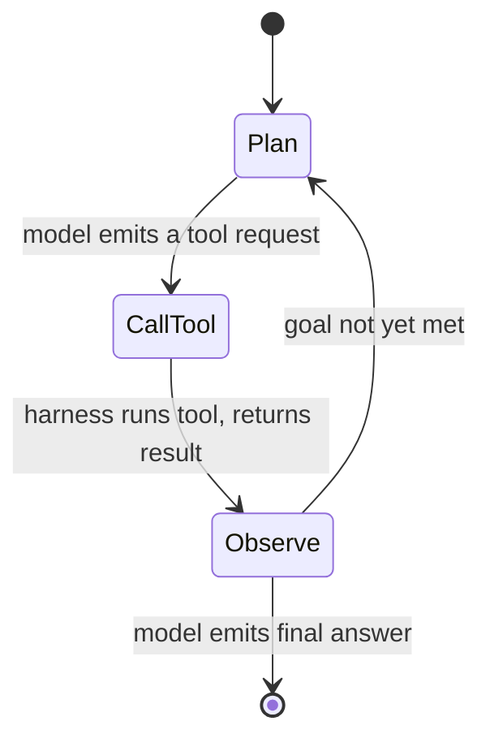
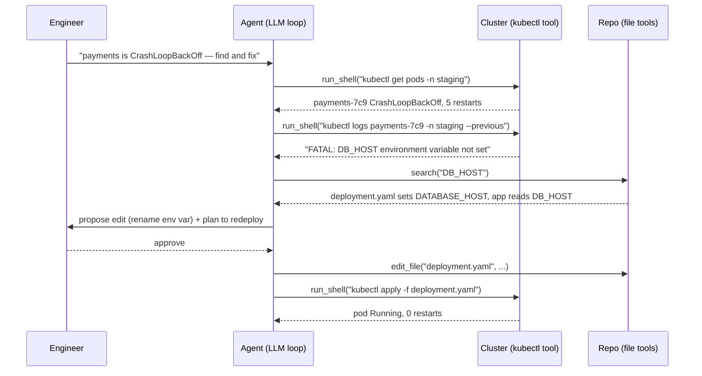

# AI Coding Agents & Agentic Workflows: Delegation, Not Autocomplete

An **AI agent** is an LLM wrapped in a loop and given tools: it plans an action, takes it, observes the result, and repeats until a task is done. A **coding agent** — Claude Code, GitHub Copilot's agent mode, Cursor — is that pattern pointed at a software repository, with tools to read and edit files, run shell commands, and search code. The misconception worth dismantling first is that these are smarter autocomplete. Autocomplete predicts the next few characters you were already going to type; an agent takes a goal you state in a sentence, decides for itself what files to read and commands to run, and produces a multi-step change while you watch. The shift is from *typing* to *delegating*, and delegation is a different skill with different risks.

As `00-overview.md` framed it, this is the first half of the platform engineer's dual mandate: using AI to change how you work. This lesson opens the loop, traces a real task through it, and marks exactly where it breaks.

---

## 1. The Agentic Loop

### 1.1 Plan, Act, Observe

Everything an agent does is the loop introduced in the overview, made concrete — and it runs on two cooperating parts. The first is the model: the stateless next-token predictor from lesson 01, which can only read text and emit text, and never touches your machine. The second is the **harness** — the ordinary program wrapped around the model that you actually launch and run. Claude Code, Cursor, and Copilot's agent mode *are* harnesses; the model is a remote service they call. The harness owns the loop: it holds the running conversation, calls the model, parses what the model asks for, executes the real tool, enforces permissions, and feeds the result back. The model proposes; the harness disposes.

With that split in mind the cycle is concrete. The model is handed a goal and a set of tool definitions (the schema mechanism from lesson 02, §4); it reasons about the next step and emits a request to call one tool; the harness executes that tool and feeds the result back into the context; and the model reasons again with that new information. The loop continues until the model decides the goal is met and emits a final answer instead of a tool call.

```python
# Simplified — the core agent loop, with the guardrail real harnesses enforce
messages = [{"role": "user", "content": goal}]
for step in range(MAX_STEPS):                # bounded — not an open `while True`
    reply = model(messages, tools=TOOLS)     # model decides: act or finish?
    if reply.stop_reason != "tool_use":
        return reply.text                    # goal met — done
    result = run_tool(reply.tool_name, reply.tool_input)   # harness executes
    messages.append(reply)                   # record what the model asked for
    messages.append({"role": "tool", "content": result})   # feed the result back
raise StepBudgetExceeded(step)               # ran out of budget without finishing
```

In that snippet the division is literal: the single `model(...)` call is the model, and everything around it — the loop, `run_tool`, and the two `messages.append` lines — is the harness. This is what separates "generate a YAML file" (one prediction) from "find why this deployment fails and fix it" (many cycles of look, hypothesise, act, check). The model never runs anything — `run_tool` does; the model only ever emits text describing the call it wants.

The loop is deliberately *bounded*, not the naive `while True` it is often drawn as. Because the agent decides for itself when it is done, a confused agent can otherwise thrash forever — retrying a failing command, ping-ponging between two edits — burning tokens and money with no human watching. So the harness imposes a **step budget** (and often a wall-clock or cost ceiling): a runaway is capped and surfaced rather than left to spin. This is the same instinct as the permission gates in Section 3 — a guardrail on autonomy, here on *how long* the agent may run rather than *what* it may touch.

The split is like a brain in a jar wired to a robot body: the model is the brain — it can only think and say what it wants done, with no hands and no memory of yesterday — while the harness is the body and notebook that read files, run commands, refuse the dangerous ones, and bring results back. Intent comes from the model; everything that actually happens to your systems is the harness.

What is that "text describing the call"? It is the same schema mechanism from lesson 02 §4, run in reverse. There, structured output made the filled schema the *answer's shape*; here the filled schema is an *action* the harness executes — the only difference is what you do with it. The model is given the tool definitions, and at the point it would otherwise write prose it instead emits a structured **tool-use** block naming a tool and its arguments:

```json
// What `reply` actually contains when stop_reason == "tool_use"
{
  "stop_reason": "tool_use",
  "tool_name": "run_shell",
  "tool_input": { "cmd": "kubectl get pods -n staging" }
}
```

This matters because it dissolves the word "decides." The model does not *decide* to act in any agentic sense — it predicts the next tokens (lesson 01), and those tokens happen to form a tool-use block instead of a sentence. The harness parses that block, runs the real command, and appends the output as a new message. That parse-run-append seam between a token predictor and your real systems is the whole subject of lesson 04.



*The agentic loop: the model plans, requests a tool call the harness executes, observes the outcome, and iterates until it judges the task complete.*

### 1.2 Non-Determinism in the Loop

The loop runs on a non-deterministic core (lesson 01). Each pass samples tokens, so two runs of the same task can take different paths, read different files, and arrive at different (sometimes both-correct, sometimes one-wrong) solutions. The loop gives the agent power; the non-determinism is why that power needs supervision. An agent is like a capable junior engineer working from a ticket: you describe the outcome, they investigate and act on their own judgement, and they usually get there — but the path is theirs, not yours, and you review the result rather than dictating each keystroke.

---

## 2. What Makes a Coding Agent

### 2.1 The Toolset

The loop is generic; what makes an agent useful for engineering is its **toolset**. A coding agent typically has a handful of primitives that compose into almost any development task:

```text
read_file(path)            -> contents          # gather context
edit_file(path, old, new)  -> diff applied      # make changes
run_shell(cmd)             -> stdout/stderr/exit # tests, git, kubectl, build
search(pattern)            -> matching files     # locate code
```

### 2.2 Autonomous Context Gathering

The capability that most distinguishes a good coding agent is **autonomous context gathering**. Recall from lesson 02 that the model only knows what is in its context window. A coding agent does not require you to paste in the relevant files — it explores the repository to find them itself, reading directory structures, grepping for a function, opening the files it judges relevant, and building the working memory it needs before acting. This is why an agent can be dropped into an unfamiliar repo and still make a coherent change: it reconstructs context the way a new engineer would, by looking around.

That same mechanism is the agent's main consumer of the token budget. Every file it reads and every command output it observes fills the context window, so on a large task the agent is constantly deciding what is worth looking at — and can run out of room, a limitation Section 5 returns to.

It is also why an agent is far costlier than a single call, and the cost grows faster than the step count. Each iteration re-sends the *entire accumulated* context (lesson 02: there is no memory between calls, so prior turns are replayed every time), so a task that grows the context a little each step pays for that whole transcript again on every step:

```text
# Simplified — input tokens reprocessed across a 10-step task (~2k tokens added/step)
  step 1 processes ~2k   step 2 ~4k   step 3 ~6k   ...   step 10 ~20k
  total input ≈ 2k·(1+2+...+10) = 2k·55 ≈ 110k input tokens   <- vs ~2k for a one-shot call
  at ~$3 / 1M input tokens  ->  ~$0.33 just to re-read context, before output is billed
```

The growth is quadratic in steps, not linear — which is why long agent runs get expensive, why **prompt caching** (lesson 02) matters so much here (the stable prefix is not re-billed at full price), and why "break the task into smaller units" (Section 5) is a cost argument as well as a reliability one.

---

## 3. How They Work in Practice

### 3.1 Permissions and Approval Gates

Because the agent can run shell commands and edit files, a well-designed harness gates dangerous actions behind approval — it reads freely but asks before running a command that writes, deletes, or reaches the network, so a single bad decision cannot quietly do damage. These gates are configurable, and treating them as a real review point rather than a thing to click through is part of using the tool safely:

```json
{
  "permissions": {
    "allow": ["Read(*)", "Bash(git status)", "Bash(kubectl get *)"],
    "ask":   ["Bash(kubectl apply *)", "Edit(*)"],
    "deny":  ["Bash(kubectl delete *)", "Bash(rm -rf *)"]
  }
}
```

### 3.2 Plan Mode vs. Act Mode

Many agents separate **planning from acting**. A planning mode researches the codebase and proposes an approach for your approval *before* touching anything, which is invaluable on a non-trivial change — you catch a misunderstanding when it is a paragraph of plan, not after the agent has edited fifteen files down the wrong path. (This very session used exactly that pattern.) Approve the plan and the agent executes it; reject it and you have spent two minutes instead of twenty.

> Note: The agent is only as good as its access to ground truth. If it cannot run your tests, reach your linter, or see the real error, it is reasoning in the dark and will guess. Giving it the means to *check its own work* — run the build, execute the test, read the actual failure — is what turns a plausible-looking change into a verified one.

The tools differ in surface but share this core. Claude Code is a terminal-native agent with broad shell and file access; IDE agents like Copilot and Cursor embed the loop in the editor with tighter UI integration. The mental model is identical: an LLM in a loop, with tools, gated by permissions, ideally planning before acting.

---

## 4. A Worked Task: Fixing a Failing Deployment

To see the loop concretely, follow an agent given the goal *"the `payments` deployment is in CrashLoopBackOff in staging — find out why and fix it."*



*One task through the agent loop: the agent gathers state with read-only tools, forms a hypothesis from the logs, locates the mismatch in the repo, and applies a gated fix — verifying the result before declaring done.*

**Step by step:**

**1. Observe the symptom.** The agent runs `kubectl get pods -n staging` (a read-only tool call, no approval needed) and sees `payments-7c9` in `CrashLoopBackOff` with 5 restarts.

**2. Get the real error.** It calls `kubectl logs ... --previous` to read the crashed container's logs and finds `FATAL: DB_HOST environment variable not set`. This is the agent checking ground truth rather than guessing — the difference Section 3.2 flagged.

**3. Find the cause in code.** It greps the repo for `DB_HOST` and discovers the mismatch: the manifest sets `DATABASE_HOST` while the application reads `DB_HOST`. The context it gathered (Section 2.2) is what makes this connection possible.

**4. Propose, then gate.** It proposes a one-line edit and a redeploy. Because `kubectl apply` and `Edit` are in the `ask` list (Section 3.1), it pauses for approval — a human confirms the fix is sane.

**5. Act and verify.** After approval it edits the manifest, applies it, and re-checks the pod: `Running, 0 restarts`. The verification step is what lets it report success with evidence rather than hope.

The whole episode is the Section 1 loop run five times, with the permission gate from Section 3 inserted at exactly the irreversible step. Strip out the gate and the verification and you have an agent that *might* have fixed it — the discipline is what makes the outcome trustworthy.

---

## 5. Where They Break Down

### 5.1 Long Horizons and Hallucinated APIs

The more steps a task requires, the more chances for one wrong turn to compound — an early misread sends the whole loop down a bad path, and the agent rarely notices it has gone wrong without an external check like a failing test. Break large tasks into smaller, verifiable units rather than handing over an epic. Separately, exactly as lesson 01 predicted, an agent will confidently call a function, flag, or Helm value that does not exist, because plausible-looking code is what it generates — most dangerously with fast-moving tools and internal libraries the model never saw in training. Anything it cannot verify by running deserves your scrutiny.

### 5.2 Context Limits and Non-Determinism

A repository can far exceed any context window, so the agent works from a partial view and can miss a caller, a config, or a convention living in a file it never opened — it does not know what it did not read. And because the loop samples (lesson 01), an agent can solve a task on one run and stumble on the next; a fix that worked once is not guaranteed to reproduce. This is fine for interactive, reviewed work but becomes a real hazard the moment you wire an agent into an automated pipeline with no human in the loop — precisely the design problem lesson 05 takes up.

> Nuance: An agent's confidence is not correlated with its correctness. It narrates every step in the same assured tone whether it is right or hallucinating, so calibrate your trust on verifiable evidence — tests passing, commands succeeding, diffs you have read — never on how convincing the explanation sounds.

---

## 6. Working Effectively on Platform Tasks

### 6.1 Scope, Context, Review

Three habits separate good results from frustration. **Scope the task**: "improve our deployment setup" gives no target, while "add a readiness probe on `/healthz:8080` to the `payments` deployment and update the matching service" gives a goal the agent can hit and you can verify. **Supply the context the agent cannot infer**: it reads the repo, but it cannot read your intent, conventions, or constraints that live in your head — state them, or capture them once in a project instructions file the agent reads automatically. **Review like a colleague's pull request**, because that is what it is: read the diff, run the tests, question anything you do not understand.

That "project instructions file" is concrete: most harnesses auto-load a `CLAUDE.md` (or equivalent) from the repo root into the context of every session, so the conventions you would otherwise re-type each time are always present:

```markdown
# CLAUDE.md — auto-loaded into the agent's context every session
- Manifests live in `deploy/`; never edit anything under `generated/` (it is templated).
- We run on GKE; default namespace is `staging` unless told otherwise.
- Always run `make test` before proposing a change; do not `kubectl apply` — emit the diff for review.
- House style: env vars are `SCREAMING_SNAKE`, Helm values are `camelCase`.
```

This is the durable, repo-level equivalent of the system prompt from lesson 02 — write the convention once, and every future task inherits it instead of relearning it from scratch (or guessing wrong).

### 6.2 The Productivity Model

The model is not "the agent does my job" but amplification: the agent collapses the time from intent to a reviewable draft, and you spend your time on direction and verification instead of typing. The trade-off is that this only pays off when you actually review — skipping the review converts a time-saver into a liability, as the worked task's gate and verification steps showed. The agent's strength is reading a lot of context fast and producing a coherent first pass on context-heavy toil (Helm charts, Terraform migrations, pipeline debugging); your strength is judgement about whether that pass is correct and safe.

---

## 7. Practical Limits and Trade-offs

- **Speed vs. review burden**: an agent collapses intent-to-draft time dramatically, but the saving is only real if you review the output — skipping review trades a few minutes now for a hard-to-find bug later.
- **Autonomy vs. control**: letting the agent gather context and act on its own judgement is what makes it powerful, but you give up step-by-step control of the path, so bound it with scoped tasks, permission gates, and plan-before-act.
- **Capability vs. verifiability**: agents excel at producing plausible code, which is exactly why anything they cannot check by running must be checked by you — plausibility is not correctness, especially for fast-moving or internal APIs.
- **Context gathering vs. context limits**: autonomously reading the repo is the agent's superpower and its bottleneck, since a large codebase overflows the window and the agent silently reasons from a partial view.
- **Interactive vs. automated use**: non-determinism is acceptable under human supervision but becomes a liability in an unattended pipeline, so the same agent that is a great pair-programmer needs heavy guardrails before it runs ops unattended (lesson 05).

---

## 8. Summary

A coding agent is an LLM running the agentic loop — plan, call a tool, observe, repeat — over a repository, with tools to read, edit, search, and run commands. Its defining ability is gathering its own context by exploring the code. That makes it a delegate, not autocomplete: you state an outcome and review a multi-step result rather than typing it, as the CrashLoopBackOff walkthrough showed — gather state, hypothesise, locate the cause, gate the fix, verify.

Used well, it amplifies a platform engineer on context-heavy toil, provided you scope the task, supply the intent it cannot infer, and review the diff like a colleague's pull request. It breaks down on long horizons, hallucinated APIs, and codebases larger than its window, and it inherits the non-determinism from lesson 01 — its confidence is never a reliable signal of correctness.

Those failure modes are tolerable under human supervision and become genuine hazards once the agent runs unattended. That is the bridge to lesson 04's tool-and-MCP mechanics and lesson 05's guardrailed ops automation.
