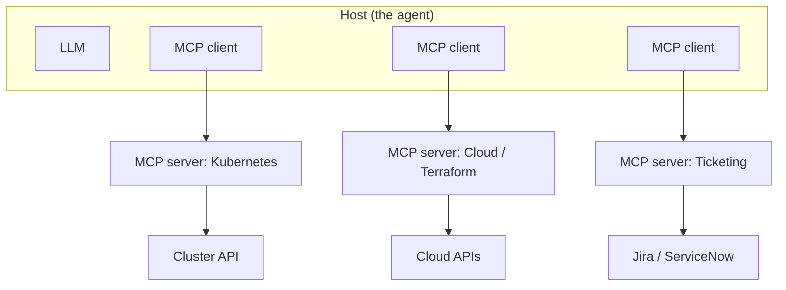
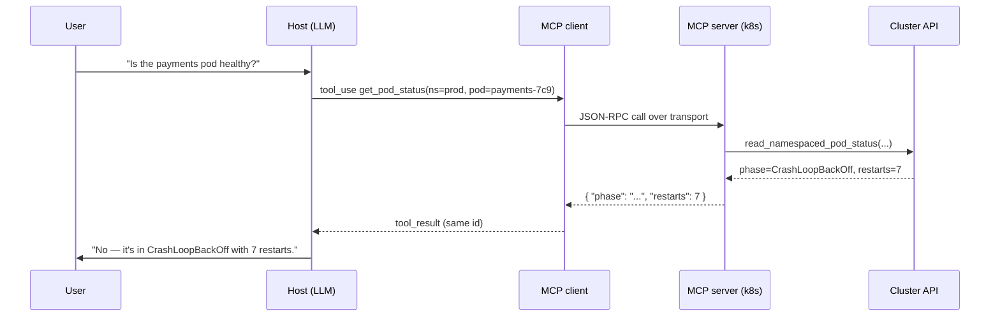

# Model Context Protocol (MCP) & Tool Use: Giving Agents Hands

Lesson 03 showed an agent calling tools without explaining how a tool call actually works. This lesson opens that box. **Tool use** is the mechanism by which a text-only model triggers real actions; the **Model Context Protocol (MCP)** is an open standard that lets any agent discover and call tools any system exposes, without bespoke integration code for every pairing. The misconception to clear immediately: the model does not *run* anything. It cannot query your cluster, call an API, or touch a disk. It only ever emits text — specifically, a structured request saying *which* tool to call with *what* arguments. Your code runs the tool and hands the result back. The model is the brain deciding what to do; your harness is the hands that do it.

For a platform engineer this is the most important seam in the track, because it is where AI meets the surface area you already own — clusters, cloud accounts, internal APIs — and where access control becomes a design problem rather than an afterthought.

---

## 1. How Tool Use Works Under the Hood

### 1.1 Declaring a Tool

Tool use rests on the structured-output capability from lesson 02 (§4). You give the model a catalogue of tools, each described by a name, a natural-language description of what it does, and a JSON schema for its arguments. The description and schema are effectively a prompt — the model chooses and fills tools based on how clearly they are written, so a vague description yields wrong or skipped calls.

```json
{
  "name": "get_pod_status",
  "description": "Return the phase and restart count of a pod in a namespace.",
  "input_schema": {
    "type": "object",
    "properties": {
      "namespace": { "type": "string", "description": "Kubernetes namespace" },
      "pod_name":  { "type": "string", "description": "Exact pod name" }
    },
    "required": ["namespace", "pod_name"]
  }
}
```

### 1.2 The Four-Step Round-Trip

A tool call is not one message but a four-step exchange. The model, reasoning about the goal, emits a structured `tool_use` block (it stops generating and waits). Your harness parses it, runs the real function, and sends the answer back as a `tool_result`. The model then continues, now able to reason over the result.

```jsonc
// Step 2: the model emits this instead of prose — it did NOT contact Kubernetes
{ "type": "tool_use", "id": "call_01",
  "name": "get_pod_status",
  "input": { "namespace": "prod", "pod_name": "api-7c9" } }

// Step 4: your harness ran kubectl and returns the result under the same id
{ "type": "tool_result", "tool_use_id": "call_01",
  "content": "{ \"phase\": \"CrashLoopBackOff\", \"restarts\": 7 }" }
```

The model produced text describing the call it *wanted*; your code is what actually ran `kubectl` and returned the answer. A tool call is like a surgeon directing a procedure by calling out precise instrument requests — "ten-blade scalpel" — while a nurse physically hands each one over. The surgeon (model) has the expertise and decides every move but never reaches into the tray; the nurse (harness) performs the physical action. Critically, the surgeon can only request instruments on the tray and named on the list you provided.

---

## 2. The Integration Problem

### 2.1 N×M Glue Code

If every agent had to be hand-wired to every system with custom glue, the cost would be combinatorial: **N** agents times **M** systems is N×M bespoke integrations, each maintained separately. Your Kubernetes integration for one agent would not work with another; a new agent means re-integrating everything. This is the same fragmentation that plagued every pre-standard integration era.

### 2.2 MCP Collapses It to N+M

MCP solves it the way good standards always do: by defining a common interface so the problem collapses from N×M to N+M. A system exposes its capabilities once as an **MCP server**; any MCP-compatible agent can consume them with no custom code. Build a Kubernetes MCP server once, and Claude Code, an IDE agent, and your internal ops bot all use it unchanged.

The canonical analogy — and an apt one — is that MCP is the **USB-C of AI tools**. Before USB-C, every device had its own connector and you needed a drawer of adapters; the port said nothing standard about what was on the other end. USB-C defined one physical and logical interface, so any compliant device works with any compliant port. MCP is that single connector between agents and tools: implement the standard on either side and they interoperate.

---

## 3. MCP Architecture

### 3.1 Host, Client, Server

MCP uses a client-server model with three roles. The **host** is the application the user interacts with — the agent itself (Claude Code, an IDE, a chatbot). Inside the host runs an **MCP client**, one per connection. A **server** is a program that exposes capabilities from one system — your cluster, a cloud account, a ticketing system. One host runs many clients, each talking to a different server, which is how a single agent gains hands on many systems at once.



*One host runs a client per server, so a single agent reaches Kubernetes, cloud, and ticketing through a uniform protocol — each server owning the real connection to its backend.*

### 3.2 Capabilities and Transports

Servers expose three kinds of capability. **Tools** are actions the model can invoke (this lesson's focus). **Resources** are read-only data the host can pull into context, like a file or config. **Prompts** are reusable templates a server offers. Communication uses one of two **transports**:

```bash
# stdio: the server runs as a local subprocess; host talks over stdin/stdout
claude mcp add k8s-local -- python3 /opt/mcp/k8s_server.py

# HTTP: the server is a shared network service reached remotely
claude mcp add k8s-prod --transport http https://mcp.internal/k8s
```

`stdio` is simple and ideal for local, per-user tools; `HTTP` is the right choice for a shared, centrally-operated server multiple users hit. The transport is an operational decision: local-per-user versus a service you run and secure like any other.

---

## 4. Exposing the Platform Surface

### 4.1 A Server Is Mostly a Wrapper

The payoff for a platform engineer is wrapping systems you already operate as MCP servers, turning them into a paved, governed way for agents to act. The handler is thin — your existing API call with a schema bolted on; the docstring and signature *become* the JSON schema from Section 1, generated from your code.

```python
# Simplified — one tool on an MCP server using the Python SDK
@server.tool()
def get_pod_status(namespace: str, pod_name: str) -> dict:
    """Return phase and restart count of a pod."""    # description the model reads
    pod = k8s.read_namespaced_pod_status(pod_name, namespace)   # your real API call
    return {
        "phase": pod.status.phase,
        "restarts": pod.status.container_statuses[0].restart_count,
    }
```

### 4.2 Choosing What to Expose

Because the hard parts (auth, the API client) you already have, building a server is mostly a wrapping exercise. What changes is that you are now exposing those calls to a non-deterministic caller — so the *selection* of what to expose, and at what privilege, is the real design work. A read-only triage server might expose `get_pod_status`, `list_deployments`, and `get_recent_events` and nothing that mutates state. Lesson 12 assembles servers like these into a self-service internal platform.

---

## 5. A Worked Round-Trip: "Is payments healthy?"

To consolidate, trace one question through an MCP-enabled agent with the Kubernetes server from Section 4.



*One question, end to end: the model emits a tool call, the client relays it to the server over the transport, the server hits the real cluster API, and the result flows back for the model to turn into an answer.*

**Step by step:**

**1. Discovery (once, at startup).** The client connects to the server and calls `list_tools`; the server returns the `get_pod_status` schema from Section 1. The host now knows this tool exists and how to call it — without any code specific to Kubernetes.

**2. The model decides to act.** Given "is payments healthy?", the model emits the `tool_use` block from Section 1.2 — `get_pod_status(namespace=prod, pod_name=payments-7c9)` — and stops.

**3. The client relays it.** The MCP client serialises the call as JSON-RPC and sends it to the server over the configured transport (stdio or HTTP from Section 3.2). The model is not involved in this hop.

**4. The server executes.** The server's handler (Section 4.1) calls the real cluster API and gets `phase=CrashLoopBackOff, restarts=7`. This is the only step that touches Kubernetes, and it runs with the *server's* credentials, not the model's — the crux of Section 6.

**5. The result returns and the model answers.** The server returns the JSON, the client wraps it as a `tool_result`, and the model — now seeing real data in its context — generates the final prose answer. The loop could continue (it might next call `get_recent_events`) but here one call suffices.

---

## 6. Auth and Blast Radius

### 6.1 Least Privilege at the Credential Layer

The instant an agent can call tools that change real systems, tool design becomes security design. The governing principle is **least privilege**, exactly as for any service account: a server exposes the narrowest set of actions for its purpose and runs with credentials scoped to only those. An incident-triage agent needs to *read* pod status and logs; it almost certainly does not need to *delete* deployments, so its server's credential must not be able to. As Section 5 step 4 showed, the call runs with the server's identity — so that identity is the real boundary:

```yaml
# The agent's reach is capped here, not in the prompt — a read-only ClusterRole
kind: ClusterRole
metadata: { name: mcp-triage-readonly }
rules:
  - apiGroups: [""]
    resources: ["pods", "pods/log", "events"]
    verbs: ["get", "list"]        # no create/update/delete — cannot mutate anything
```

### 6.2 Separate Read from Write, and Gate Mutations

Treat write tools as a different risk class: a read-only server can be granted broadly with little danger, while any server that mutates state warrants tight scoping and a human-confirmation gate (the `ask` pattern from lesson 03, §3.1) before it executes.

> Nuance: Never rely on the prompt or the tool description to constrain the agent. A model can be talked out of its instructions, and a tool you exposed *can* be called even if you told the model not to. The only durable limit on what an agent can do is what its credentials permit — enforce in the access layer, not in the prose. This is the seam prompt-injection attacks (lesson 11) target.

An MCP server is like issuing a contractor a building access badge. You do not hand over a master key with a note saying "please only enter the lobby" — you program the badge to open exactly the doors the job requires. If the badge can open the server room, the contractor can enter it regardless of any verbal instruction, and regardless of whether they were tricked into doing so. Scope the badge, not the conversation.

---

## 7. Practical Limits and Trade-offs

- **Standardisation vs. maturity**: MCP collapses N×M integrations to N+M and is becoming the default, but it is a young ecosystem — servers vary in quality and the spec still evolves, so expect rough edges and pin versions.
- **Capability vs. blast radius**: every tool you expose expands what the agent can accomplish *and* what it can break, so each tool — especially any that writes — must justify its presence and run on least-privilege credentials.
- **Read vs. write tools**: read-only servers are low-risk and can be granted broadly, while mutating tools demand tight scoping, confirmation gates, and audit — keep the two in separate risk classes rather than one permissive server.
- **Local (stdio) vs. remote (HTTP) transport**: a local per-user subprocess is simple and isolated but unmanaged, while a shared HTTP server is centrally governable and observable but is itself a network service you must secure and operate.
- **Prompt-level vs. credential-level control**: instructing the model what not to do is convenient but unenforceable, whereas scoping the server's token actually bounds the agent — always enforce at the access layer, never in the prose.

---

## 8. Summary

Tool use lets a text-only model act through a four-step round-trip: it emits a structured `tool_use` naming a tool and arguments, your harness — never the model — executes the real action, and a `tool_result` carries the answer back. MCP standardises that mechanism so any compliant agent can use any compliant server, turning a combinatorial N×M integration mess into N+M and earning its "USB-C for AI" label. Its architecture is a host running one client per server, each exposing tools, resources, and prompts over stdio or HTTP, and for a platform engineer building those servers is mostly wrapping APIs you already operate — as the "is payments healthy?" walkthrough traced from tool call to cluster API and back. The real engineering is not the wrapping but the governance: exposing least privilege, separating read from write, gating mutations behind confirmation, and binding every server to scoped credentials — because an agent's true limit is what its token permits, not what its prompt says. That access-layer discipline is what makes it safe to point agents at production, which lesson 05 turns into concrete ops automation.
