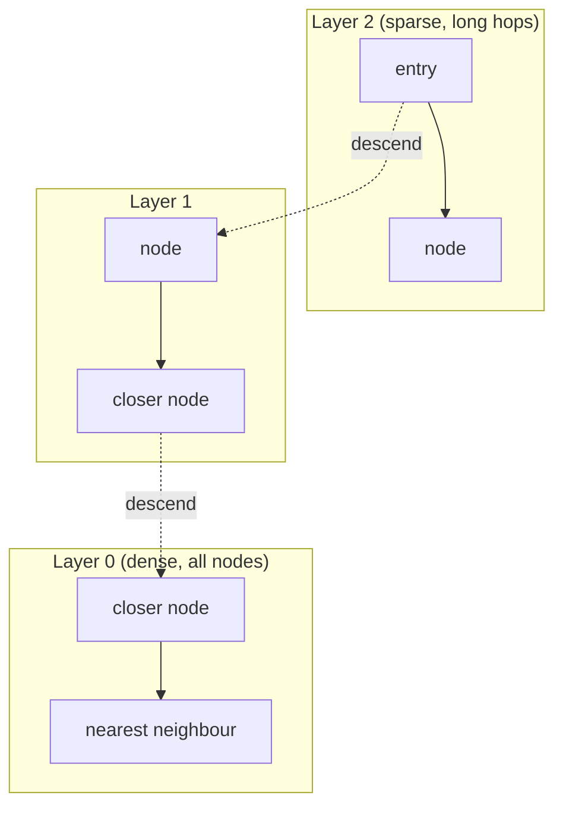
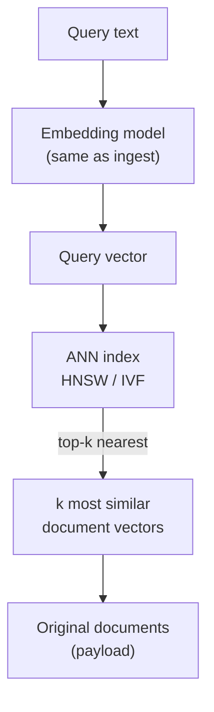

# Embeddings & Vector Databases: Searching by Meaning

Lesson 01 introduced the **embedding** — a vector of numbers that places a piece of text at a position in high-dimensional space such that similar meanings land near each other. This lesson turns that idea into infrastructure: how you generate embeddings at scale, store millions of them, and search them fast enough to serve a live request. The misconception to retire first is that a **vector database** is just "a database with a new column type." It is not a relational store with vectors bolted on; its entire reason to exist is one operation — *find the vectors nearest to this one* — and it makes deep trade-offs (notably, returning approximate rather than exact answers) to do that operation at a scale and speed an ordinary index cannot.

For a platform engineer this is the first of the new infrastructure components from `00-overview.md` (§4), and it is the foundation the next lesson (07, Retrieval-Augmented Generation) builds directly on top of.

---

## 1. From Text to Vectors: The Embedding Model

### 1.1 A Model Whose Only Job Is Vectors

An embedding is produced by an **embedding model** — a specialised, usually small model whose only output is a fixed-length vector (commonly 384 to 3,072 numbers). It is distinct from the generative **Large Language Model (LLM)** of lessons 01–05: it produces no text, only the numeric coordinates of meaning. You run a document through it once to get its vector, and you run a user's query through the *same* model at search time to get a query vector you can compare.

```python
# Simplified — the same model embeds documents (ingest) and queries (search)
vec = embed("pods were OOMKilled")     # -> [0.0123, -0.0481, ..., 0.0307]
len(vec)                                # 1024  (fixed for this model)
```

### 1.2 Meaning Becomes Direction

The crucial property, learned during training, is that **semantic similarity becomes geometric proximity**. Two texts that mean similar things produce vectors that sit close together, even when they share no words. "The cluster ran out of memory" and "pods were OOMKilled" land near each other; "the cluster ran out of memory" and "the team ran out of budget" do not, despite sharing more words. This is exactly the property keyword search lacks — and why keyword search misses relevant results that use different vocabulary.

> Note: You must embed your documents and your queries with the *same* model. Vectors from different embedding models live in different, incompatible coordinate spaces — comparing them is meaningless, like comparing a latitude from one map to a grid reference from another. Changing embedding models later means re-embedding your entire corpus.

An embedding model is like a master librarian who has read everything and files each new document not by title but by *what it is about*, placing conceptually related works on adjacent shelves regardless of their titles. Ask for "anything about container memory limits" and they walk you to one shelf where all the relevant material sits — even the book titled "Avoiding OOMKills in Production," which shares not a single word with your request.

---

## 2. Measuring Similarity: Distance in Vector Space

### 2.1 Cosine Similarity, Computed

Once text is a vector, "how similar are these two texts" becomes "how close are these two points" — pure arithmetic. The dominant measure is **cosine similarity**, the cosine of the angle between two vectors: the dot product divided by the product of their magnitudes, ranging from 1 (same direction) through 0 (unrelated) to −1 (opposite). Worked on three illustrative 3-dim vectors:

```text
A "out of memory"  = [0.90, 0.30, 0.10]
B "OOMKilled pod"  = [0.85, 0.35, 0.05]
C "out of budget"  = [0.10, 0.20, 0.95]

cos(A,B) = (0.90·0.85 + 0.30·0.35 + 0.10·0.05) / (|A|·|B|)
         = 0.875 / (0.954 · 0.921) = 0.996    -> very similar
cos(A,C) = (0.90·0.10 + 0.30·0.20 + 0.10·0.95) / (|A|·|C|)
         = 0.245 / (0.954 · 0.975) = 0.263     -> unrelated
```

Direction is used rather than raw distance because it captures "about the same thing" independent of text length or intensity. The 0.996-versus-0.263 split is the whole game: similar meanings score high, unrelated ones do not.

> Note: Cosine is the *dominant* metric but not the only one — vector databases also offer **dot product** and **Euclidean (L2)** distance. The choice is coupled to whether your embeddings are length-normalised: on normalised vectors cosine and dot product rank results identically (and dot product is cheaper, skipping the magnitude division), while L2 is preferred when absolute magnitude carries meaning. Use whichever your embedding model's documentation recommends — they are not interchangeable across models.

### 2.2 Search Is a Nearest-Neighbour Query

Search, then, is a **nearest-neighbour** query: embed the query, then find the stored vectors with the highest cosine similarity to it. Return the top *k* — the closest five or ten — and you have the most semantically relevant documents. This is the entire retrieval primitive, and it is why earlier lessons could treat "retrieve relevant context" as a single conceptual step.

Cosine similarity is like comparing two hikers' *bearings* rather than how far each has walked. Two hikers heading due north are going "the same way" whether one covered one kilometre and the other ten; a hiker heading east is going a different way regardless of distance. Meaning is the bearing, not the mileage.

> Nuance: Semantic search is not strictly better than keyword search — it has the *opposite* blind spot. Because it matches on meaning, it is weak exactly where the literal token *is* the point: a specific error code (`E1100`), a UUID, a rare flag, a product name, or a negation the embedding blurs away. Keyword/BM25 search nails those and misses vocabulary mismatches; vector search does the reverse. Production retrieval therefore often runs **hybrid search** — both a dense (vector) and a sparse (keyword) query, with the result lists merged — to get each one's strengths. Treat vector search as a powerful complement to keyword search, not a replacement; lesson 07 builds this into a retrieval pipeline.

---

## 3. The Scaling Problem: Why Exact Search Breaks

### 3.1 Brute-Force k-NN

Finding the true nearest neighbours is trivially easy and catastrophically slow at scale. The exact method, **k-nearest-neighbours (k-NN)** by brute force, compares the query against *every* stored vector:

```python
# Simplified — exact search: one full comparison per stored vector
def knn(query_vec, corpus, k):
    scored = [(cosine(query_vec, v), id) for id, v in corpus]   # touches ALL of them
    return sorted(scored, reverse=True)[:k]
```

Put numbers on it: 10 million vectors of 1,024 dimensions is ~10 million dot products of ~1,024 multiplies — ~10 billion floating-point operations *per query*. That is far too slow for a request that must return in tens of milliseconds and far too CPU-hungry to serve many users at once.

### 3.2 The Exactness-for-Speed Trade

This is the wall that motivates the entire vector-database industry. You cannot scan everything per query, so you trade a little accuracy for an enormous speed-up: instead of guaranteeing the *exact* nearest neighbours, you accept the *approximate* nearest neighbours, found by cleverly avoiding most comparisons. That trade — exactness for speed — is the defining decision of the field. Brute-force k-NN is like finding the closest coffee shop by measuring the straight-line distance to every coffee shop in the country and sorting; correct, but absurd when you needed the nearest few and there are millions of candidates.

---

## 4. Vector Indexes: HNSW and IVF

### 4.1 HNSW: Navigating a Proximity Graph

An **Approximate Nearest Neighbour (ANN)** index organises vectors so a query examines only a small, promising subset. HNSW and IVF below are the two families that dominate production vector search; others exist (ScaNN, Annoy, LSH) but are rarer and trade off differently, so this lesson covers the two you will actually meet. **HNSW (Hierarchical Navigable Small World)** builds a layered graph: upper layers hold few nodes with long-range links, lower layers are dense with short-range links. A search enters at the sparse top, greedily hops toward the query through long jumps, then descends into denser layers for fine local search — like zooming in on a map.



*HNSW search: enter at the sparse top layer, hop greedily toward the query, then descend into denser layers for fine-grained local search — visiting a few hundred nodes instead of millions.*

A 10-million-vector HNSW search might visit only a few hundred nodes — turning the ~10 billion operations of brute-force search into a few hundred thousand. The gain is excellent recall at very low latency; the cost is high memory (the full graph lives in RAM) and slower index builds.

That build cost is not incidental — it is where the graph *comes from*. The index is constructed one vector at a time: each new vector is inserted by running a search to find its nearest existing neighbours and wiring **bidirectional links** to up to `M` of them (typically 16–64). A second knob, `ef_construction`, sets how hard that insert-time search works to find good neighbours — a larger value yields a better-connected graph (higher recall later) but a slower build. Both decisions are baked in at build time and explain the costs above: every node carries up to `M` links so the whole graph must live in RAM, and each insert pays a search, so building 10M vectors is far slower than scanning them once.

```sql
-- pgvector: BUILD an HNSW index — m and ef_construction are build-time knobs
CREATE INDEX ON chunks USING hnsw (embedding vector_cosine_ops)
  WITH (m = 16, ef_construction = 64);  -- more links / harder build = better recall, slower build
-- efSearch is set separately, per query, at SEARCH time (the recall-vs-latency dial below)
```

### 4.2 IVF: Probing Clustered Cells

**IVF (Inverted File Index)** clusters vectors into groups (cells) up front. At query time it identifies the few cells nearest the query and searches only within those, skipping the rest. IVF is more memory-efficient and faster to build than HNSW, but recall depends on how many cells it probes — search too few and you miss neighbours that fell just over a cell boundary.

The cells are not given — they are *learned*. Before any vector is inserted, IVF runs **k-means** over a representative sample of the corpus to find a set of cluster centroids (the `lists` parameter sets how many), and every vector is then assigned to its nearest centroid's cell. This origin is what distinguishes IVF's `lists` from HNSW's `M`: `lists` defines a partitioning learned once from the data's distribution, so if that distribution drifts — a new tenant, a new document type — the centroids no longer fit and the index needs a rebuild to stay balanced. A query then probes the `nprobe` cells whose centroids are closest to it.

> Nuance: Do not conflate the build-time and search-time knobs. `M`/`ef_construction` (HNSW) and `lists` (IVF) are fixed when the index is *built* and changing them means rebuilding; `efSearch`/`nprobe` are set per query and tune each individual search. The recall dial below is the search-time pair.

| Property | HNSW | IVF |
| :--- | :--- | :--- |
| Structure | Layered proximity graph | Clustered cells, probe nearest |
| Recall / latency | Very high recall, very low latency | Tunable; depends on cells probed |
| Memory | High (graph in RAM) | Lower |
| Build time | Slower | Faster |
| Best for | Latency-critical search | Huge corpora, memory-constrained |

> Note: When memory is the binding constraint — and for HNSW, holding the full graph in RAM, it usually is — the lever is **quantization**: storing each vector in a compressed form instead of raw 32-bit floats. **Scalar quantization** drops each dimension to 8 bits (a ~4× shrink) for a small recall hit; **product quantization (PQ)** splits the vector into sub-blocks and replaces each with the nearest of a learned codebook of centroids, often 8–16× smaller, at a larger recall cost. The canonical production combination is **IVF-PQ** — IVF to skip most cells, PQ to make the cells that *are* searched cheap to hold. Concretely, 50M × 1,024-dim vectors are ~200 GB as raw floats but ~50 GB scalar-quantized — the difference between needing many machines and fitting on one. The trade is the same exactness-for-resource bargain as the index itself, now spent on memory rather than time.

### 4.3 The Recall-Versus-Latency Dial

The single knob both share is the **recall-versus-latency trade-off**: examine more of the graph (HNSW's `efSearch`) or more cells (IVF's `nprobe`) and you find more of the true neighbours — higher **recall** — but spend more time per query. There is no setting that maximises both:

```text
nprobe (IVF)   recall@10    latency
     1            0.71        0.4 ms
     8            0.93        1.1 ms
    32            0.99        3.8 ms
```

You tune it to the accuracy your application actually needs — which (per lesson 02) is often less than perfect, because the LLM only needs *good* context, not provably optimal context.



*Search path: the query is embedded by the same model used at ingest, the ANN index returns the approximate top-k nearest vectors, and their stored payloads are the documents handed back.*

---

## 5. The Vector Database Around the Index

### 5.1 What a Database Adds Over an Index

An index alone is not a database. A **vector database** — Pinecone, Weaviate, Qdrant, Milvus, or the `pgvector` extension for Postgres — wraps an ANN index with the operational machinery production needs: persistence, horizontal scaling and replication, concurrent inserts and updates, the stored **payload** (the original text the vector points back to), and crucially **metadata filtering** so a search can be constrained to, say, one tenant or one date range:

```sql
-- pgvector — nearest-neighbour search WITH a metadata filter, in one query
SELECT id, content
FROM   chunks
WHERE  tenant_id = 'acme'                 -- filter applied inside the search
ORDER  BY embedding <=> :query_vec        -- <=> is cosine distance in pgvector
LIMIT  5;
```

Metadata filtering is where vector search meets the access-control concerns from lesson 04: a multi-tenant system must filter every query by tenant *inside* the search, so the index never returns another customer's document in the first place. Getting this wrong is a data leak, not just a relevance bug.

### 5.2 Dedicated Database or pgvector?

The architectural question is **whether you need a dedicated vector database at all**. For up to a few hundred thousand vectors with modest query rates, `pgvector` on a Postgres instance you already run is frequently the right answer: one fewer system to operate and transactional consistency with your relational data. A dedicated vector database earns its operational cost at large scale — tens of millions of vectors, high query throughput, or demanding latency — where its purpose-built indexing and horizontal scaling pull ahead. As with any datastore decision, start with what you already operate and add a specialised system only when the workload forces it.

---

## 6. End-to-End: One Semantic Search

To consolidate, trace the query *"why are my pods getting OOMKilled"* through a vector store holding 2 million chunks on an HNSW index. The *search-path* diagram from *Vector Indexes* is exactly this flow — read it alongside the steps below.

**Step by step:**

**1. Embed the query.** The query text goes through the *same* embedding model used at ingest (the point of *A Model Whose Only Job Is Vectors*), producing a 1,024-dim vector. Using a different model here would return nonsense (*Meaning Becomes Direction*).

**2. Enter the index.** The query vector enters the HNSW graph at the sparse top layer (*HNSW: Navigating a Proximity Graph*). Note that no document text is involved yet — everything from here is geometry on vectors.

**3. Greedy descent.** The search hops toward the query through long-range links, then descends layer by layer into denser neighbourhoods, visiting ~300 of the 2 million nodes — bounded by `efSearch` (the recall-versus-latency dial).

**4. Apply the filter and rank.** Candidates are filtered by metadata (`tenant_id`, *The Vector Database Around the Index*) and ranked by cosine similarity (*Measuring Similarity*). The top 5 come back as `(id, score)` pairs — e.g. the chunk "the deployment requests 8Gi but the LimitRange caps it at 4Gi" at score 0.88.

**5. Fetch payloads.** The vector IDs are resolved to their stored payloads — the original chunk text — which is what the caller actually wanted. Those five chunks are exactly the material lesson 07 will inject into an LLM's context to answer the question.

The whole path turned a fuzzy natural-language question into a geometric query over vectors and back into relevant text — in a few milliseconds, by visiting a few hundred nodes instead of two million.

---

## 7. Practical Limits and Trade-offs

- **Exactness vs. speed**: ANN indexes deliberately return approximate neighbours to avoid scanning the whole corpus, so you accept occasionally missing a true match in exchange for the millisecond latency a live request demands — exact k-NN does not scale.
- **Recall vs. latency**: probing more of the graph or more IVF cells raises recall but costs query time, and there is no setting that maximises both — tune to the accuracy the downstream LLM actually needs, often less than perfect.
- **HNSW memory vs. IVF efficiency**: HNSW delivers the best recall and latency but holds its full graph in RAM and builds slowly, while IVF is lighter and faster to build but needs careful probe tuning to match HNSW's recall.
- **Dedicated vector DB vs. pgvector**: a purpose-built vector database scales to tens of millions of vectors and high throughput, but at small scale it is an extra system to operate when Postgres with `pgvector` would serve the same workload with less overhead.
- **Semantic vs. lexical recall**: vector search wins on vocabulary mismatch but misses exact tokens (error codes, IDs, rare names) that keyword search nails, so production retrieval often runs both as **hybrid search** rather than treating semantic search as a replacement for keyword search.
- **Memory vs. recall (quantization)**: compressing vectors with scalar or product quantization (IVF-PQ) cuts the RAM footprint several-fold and is often what makes a large index affordable, at the cost of some recall — tune the compression to the accuracy the workload tolerates.
- **Embedding quality vs. cost and lock-in**: a stronger embedding model improves retrieval relevance but costs more to run and locks your whole corpus into its vector space — changing models later forces a full, expensive re-embedding.

---

## 8. Summary

A vector database exists to do one thing fast: find the stored vectors nearest a query vector, where nearness in the geometry means similarity in meaning. Text becomes searchable by running it through an embedding model — the same model for documents and queries, since their vectors must share a coordinate space — and similarity is measured by cosine, a computation simple enough to do by hand on small vectors. Exact nearest-neighbour search scans everything and collapses at scale (~10 billion operations per query on 10M vectors), so vector databases use ANN indexes — HNSW navigating a layered proximity graph, IVF probing clustered cells — that trade a little accuracy for enormous speed, governed by a recall-versus-latency dial you tune to need. Around that index a real database adds persistence, scaling, and metadata filtering — the last a security boundary in multi-tenant systems, not just a relevance feature — though at modest scale `pgvector` on Postgres you already run is often the wiser choice than a new system. This retrieval primitive, traced end-to-end from query text to ranked payloads, is the engine of the next lesson: RAG uses exactly this "find the most relevant documents" step to ground an LLM in your private, current data.
