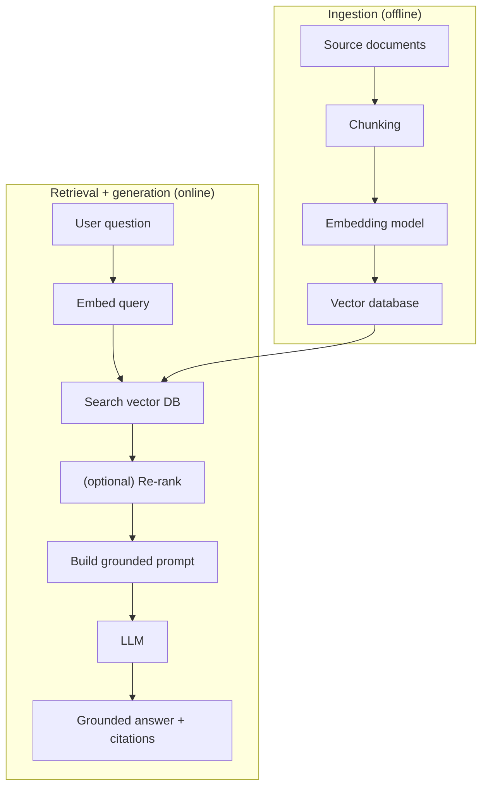
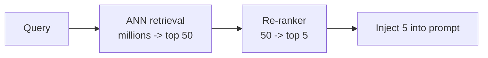

# Retrieval-Augmented Generation (RAG): Grounding a Model in Your Data

Lesson 01 left us with a problem: an LLM's knowledge is frozen at training time, so it knows nothing about your private systems or anything recent, and it hallucinates fluent answers to fill the gap. Lesson 02 named the fix in principle — put the facts in the context window — and lesson 06 built the engine that finds those facts. **Retrieval-Augmented Generation (RAG)** ties them together: at query time, retrieve the documents relevant to the question and inject them into the prompt so the model answers from supplied truth rather than memory. The misconception to dismantle is that RAG "teaches the model your data" or is a kind of training. It changes the model's weights by exactly zero. RAG is a *retrieval* system bolted in front of an unchanged model — it changes the model's *input*, not the model.

This reframes the task for a platform engineer: most of RAG's difficulty, and almost all of its failure modes, live in plumbing you already understand — pipelines, search quality, data freshness — not in the model itself.

---

## 1. Why RAG Instead of Retraining

### 1.1 Three Ways to Add Knowledge

There are three ways to make a model answer using knowledge it was not born with, and RAG is usually the right one. **Retraining/fine-tuning** bakes information into the weights — expensive, slow, stale the moment your data changes. **Stuffing everything into the context** ignores the fixed window from lesson 01: you cannot paste a 10,000-document knowledge base into a prompt. **RAG** threads the needle by fetching only the handful of documents relevant to *this* question and injecting just those, keeping the model fixed and the context small.

The decisive advantages are freshness and traceability. Because retrieval happens at query time against a live store, updating the model's effective knowledge is just updating a document — no retraining. And because you know exactly which documents you injected, you can show the user *where* an answer came from, making it auditable in a way a fine-tuned model's output never is.

### 1.2 RAG and Fine-Tuning Solve Different Problems

> Nuance: RAG and fine-tuning are not competitors. RAG gives the model *knowledge* it lacks (facts, documents, current data); fine-tuning gives the model a *behaviour* or *style* it lacks (a response format, a domain tone, a structured-output habit). "Should I RAG or fine-tune?" is usually the wrong question — you RAG for knowledge and fine-tune for behaviour, sometimes both.

RAG is like the difference between sending an analyst back to university to memorise your company handbook (retraining) versus handing them the relevant handbook pages the moment a question comes up (RAG). The second is faster, always reflects the current handbook, and lets you see exactly which pages they used.

---

## 2. The Two Phases: Ingestion and Retrieval

### 2.1 Offline and Online

Every RAG system has an offline phase and an online phase, and keeping them distinct is key to reasoning about it. **Ingestion** (offline, run when documents change) prepares the knowledge base: it loads source documents, splits them into chunks, embeds each chunk with the embedding model from lesson 06, and stores the vectors and text in the vector database. **Retrieval-and-generation** (online, run per user query) embeds the question, searches the vector store for the nearest chunks, assembles them into a grounded prompt, and calls the LLM.



*RAG's two phases: ingestion builds the searchable knowledge base offline; the online path embeds the question, retrieves and optionally re-ranks chunks, and feeds a grounded prompt to the model.*

### 2.2 Ingestion Is a Data Pipeline

The separation matters operationally. Ingestion is a data pipeline with all the concerns you know — scheduling, incremental updates, handling deletes — and its freshness directly bounds correctness: a document not yet ingested cannot be retrieved, so stale ingestion silently produces stale answers. The online path is latency-critical and sits in the user's request, so every stage in it is part of your response-time budget.

```python
# Simplified — the ingestion pipeline, run when documents change
for doc in source_documents:
    for chunk in chunk_text(doc, size=512, overlap=64):     # Section 3
        vec = embed(chunk.text)                              # same model as query time
        vectordb.upsert(id=chunk.id, vector=vec,
                        payload={"text": chunk.text, "doc": doc.id, "tenant": doc.tenant})
```

---

## 3. Chunking: The Decision That Quietly Governs Quality

### 3.1 Why Chunk At All, and the Size Tension

You cannot embed a 50-page document as one vector — a single embedding can only capture so much before it becomes a blurry average of everything, and you would retrieve the whole document when one paragraph was relevant. So ingestion splits documents into **chunks**, each embedded and retrieved independently. Chunking is the most underestimated decision in RAG: it is upstream of everything, and poor chunking caps the quality of every answer no matter how good your model is.

The core tension is **chunk size**, and concrete token counts make it real:

```text
chunk size   effect
   ~2000 tok  whole sections; embedding averages many topics -> imprecise retrieval,
              and one hit eats a big slice of the context budget
    ~100 tok  single sentences; ideas fragment across boundaries -> a chunk retrieves
              without the context needed to make sense of it
 ~300-600 tok typical sweet spot: one coherent idea per chunk, modest budget cost
```

### 3.2 Semantic Boundaries and Overlap

The usual remedies are **semantic chunking** (split on natural boundaries — paragraphs, sections, headings — rather than blindly every N tokens) and **overlap** (let consecutive chunks share a sentence or two so an idea straddling a boundary survives in at least one chunk). A 512-token chunk with 64-token overlap means each chunk repeats the last ~64 tokens of the previous one — cheap insurance against splitting a definition from the sentence that uses it.

Chunking is like cutting a reference manual into index cards filed by topic. Cut too coarsely — a whole chapter per card — and a search for one fact drags in pages of unrelated material. Cut too finely — one sentence per card — and you pull a card reading "this is critical" with no card saying what "this" was. The art is cutting on the seams of meaning so each card stands alone.

---

## 4. Retrieval Quality and Re-ranking

### 4.1 Recall, Precision, and Hybrid Search

The generation is only as good as what retrieval surfaces — "garbage in, garbage out" is the iron law of RAG. Two metrics frame quality: **recall** (did the relevant chunks make it into the retrieved set at all?) and **precision** (how much of the set is actually relevant versus noise?). Low recall starves the model of the fact it needed; low precision floods the context with distractors that, per lesson 01's "lost in the middle," can bury the chunk that mattered.

A common upgrade is **hybrid search**: combine vector (semantic) search with traditional keyword search. Semantic search catches paraphrases and synonyms; keyword search nails exact matches — error codes, function names, identifiers — that embeddings sometimes blur together. Running both and merging covers each other's blind spots.

### 4.2 The Two-Stage Retrieval Funnel

The second upgrade is **re-ranking**. Fast ANN retrieval (lesson 06) is tuned for speed and returns an approximate top-*k* — say the closest 50. A **re-ranker** (a heavier, more accurate model that scores a query-chunk *pair* directly) then re-scores just those 50 and keeps the best 5 to inject:

```python
# Simplified — cheap-and-wide, then expensive-and-precise
candidates = vectordb.search(query_vec, k=50)              # fast ANN, high recall
ranked     = reranker.score(query, [c.text for c in candidates])  # accurate, only 50 pairs
top5       = [c for _, c in sorted(zip(ranked, candidates), reverse=True)][:5]
```

This is a deliberate funnel: cheap-and-approximate to narrow millions to dozens, then expensive-and-precise to pick the final few — most of the accuracy of an expensive comparison without running it over the whole corpus.



*The retrieval funnel: fast approximate search narrows the corpus to dozens for high recall, then a precise re-ranker selects the few chunks worth spending context budget on.*

It is like a hiring funnel — a cheap keyword screen narrows thousands of applicants to fifty plausibles, then a panel interview ranks those fifty to pick five. You would never panel-interview thousands, nor hire straight off the keyword screen.

---

## 5. Assembling the Grounded Prompt

### 5.1 From Chunks to Context

The retrieved chunks do not go to the model raw; they are assembled into the grounded prompt from lesson 02 (§5), each labelled so the model can cite it:

```text
System: Answer using ONLY the context. If it is not there, say
        "Not in the knowledge base." Cite the [id] after each claim.

Context:
[c1] The payments deployment requests 8Gi per replica.
[c2] A LimitRange in namespace payments caps containers at 4Gi.

Question: Why are the payments pods being OOMKilled?
```

### 5.2 Why the Instruction Matters

The grounding-and-abstention instruction is not decoration — it is what converts RAG's worst failure (confident invention on a retrieval miss, Section 6) into an honest "Not in the knowledge base," and the `[id]` citations make every claim auditable against the chunk it came from. With this prompt the model answers "The deployment requests 8Gi [c1] but the namespace caps containers at 4Gi [c2], so the kernel kills them" — grounded, cited, checkable.

---

## 6. A Worked Query, and the Failure Modes It Exposes

### 6.1 End-to-End Trace

Trace *"why are the payments pods OOMKilled"* through the full online path.

**Step by step:**

**1. Embed.** The question is embedded by the ingest-time model (lesson 06) into a query vector.

**2. Retrieve (wide).** ANN search returns the top 50 chunks, filtered by `tenant` (lesson 06 §5.1) — high recall, some noise.

**3. Re-rank (narrow).** The re-ranker (Section 4.2) scores the 50 and keeps the 5 most relevant, e.g. the 8Gi-request and 4Gi-LimitRange chunks at the top.

**4. Assemble.** The 5 chunks become the grounded prompt of Section 5, each tagged `[c1]`–`[c5]`.

**5. Generate.** The LLM produces a cited, grounded answer — drawing on supplied facts, not its frozen weights.

### 6.2 The Quiet Failure Modes

RAG fails *plausibly* — a confident, well-formed, wrong answer with no error. The trace above breaks in four ways worth knowing:

- **Retrieval missed it** (step 2/3): the relevant chunk was never retrieved — bad chunking, a query that embeds far from the source vocabulary, or recall tuned too low. Given no good context, the model falls back on training and hallucinates. The fix is in retrieval, not the prompt.
- **Not in the corpus at all**: the user asked something the knowledge base does not cover. Without the Section 5 abstention instruction, the model answers from memory anyway — RAG silently degrades into ordinary hallucination.
- **Conflicting or stale chunks**: retrieval returns an old policy and its replacement; the model picks one, possibly wrong. This traces to ingestion freshness (Section 2.2) — deletes and updates must propagate.
- **Context overflow / distraction** (step 4): inject too many chunks and you blow the budget or bury the key one (lost in the middle). Relevant-and-concise beats comprehensive-and-noisy.

> Note: The single highest-leverage line in any RAG system is the grounding-and-abstention instruction from Section 5. It converts the worst failure — confident invention on a retrieval miss — into a visible "I don't know," and citations turn the rest into something you can audit.

---

## 7. Practical Limits and Trade-offs

- **RAG vs. fine-tuning**: RAG supplies missing *knowledge* with live, auditable documents and no retraining, while fine-tuning instils *behaviour* into the weights — they address different needs, so the choice is rarely either/or.
- **Chunk size precision vs. context completeness**: small chunks embed precisely but fragment ideas across boundaries, while large chunks preserve context but dilute the embedding and waste budget — tune on semantic boundaries with overlap rather than a fixed token count.
- **Retrieval recall vs. precision**: widening retrieval catches more relevant chunks but admits noise that can bury the key one, so re-ranking exists to restore precision after a high-recall first pass.
- **Retrieval cost vs. accuracy**: a two-stage cheap-ANN-then-heavy-re-ranker funnel adds latency and a second model to operate, but buys far better final relevance than fast retrieval alone — pay it where answer quality matters.
- **Freshness vs. ingestion effort**: answers are only as current as the last ingestion run, so keeping RAG correct means operating a real data pipeline with incremental updates and deletes, not a one-time load.

---

## 8. Summary

RAG grounds a frozen, hallucination-prone LLM by retrieving the documents relevant to each question and injecting them into the prompt — changing the model's input, never its weights — which is why it delivers fresh, auditable answers without retraining. It runs in two phases: an offline ingestion pipeline that chunks, embeds (lesson 06), and stores documents, and an online path that embeds the query, retrieves wide then re-ranks narrow, assembles a grounded prompt, and generates a cited answer. Chunking quietly governs the whole system's quality, retrieval quality (recall and precision, improved with hybrid search and a re-ranking funnel) bounds how good the answer can be, and the characteristic danger is plausible failure — confident wrong answers on a retrieval miss. The defences are the lesson-02 grounding-and-abstention instruction plus citations, which convert silent invention into an honest "I don't know" you can audit. RAG is mostly the disciplined data and search engineering you already know, pointed at filling an LLM's context with the right facts at the right moment — and lessons 08 and 09 turn to serving the models that consume those prompts.
