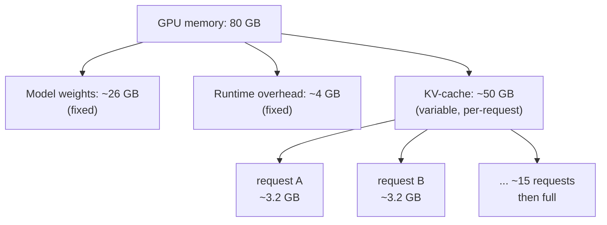
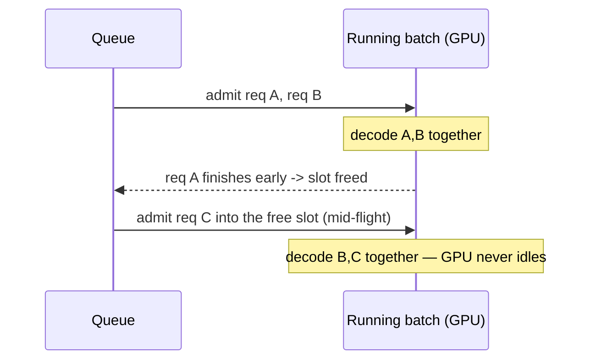
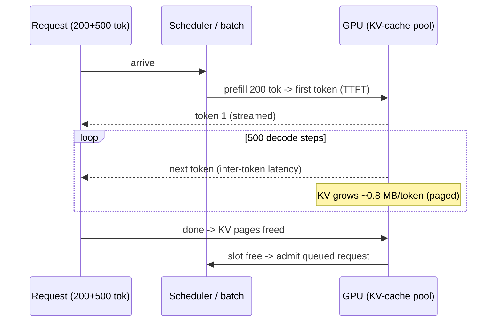

# Model Serving & Inference: Running a Model in Production

Everything so far consumed a model through an API. This lesson is about *being* that API — taking a model's weights and serving inference to many concurrent users with acceptable latency and cost. The misconception to drop at the door is that serving a **Large Language Model (LLM)** is like serving any stateless web service, where you scale by adding cheap, interchangeable replicas. It is not. Inference is **stateful within a request**, **bound to scarce and expensive Graphics Processing Units (GPUs)**, and dominated by a memory structure — the KV-cache from lesson 01 — that has no equivalent in ordinary request handling. Treat an inference server like a stateless API and you will misjudge its capacity, latency, and bill by an order of magnitude.

This is the heart of the "operate" mandate from `00-overview.md`. The good news for a platform engineer is that the tuning concepts map cleanly onto things you already know — batching, caching, latency-versus-throughput — applied to unusually costly hardware.

---

## 1. What Makes LLM Inference Different

### 1.1 Generation Is a Loop, Not a Call

Recall from lesson 01 that generation is **autoregressive**: the model produces one token, appends it, and feeds the whole sequence back to produce the next. This single fact drives everything about serving. A request is not one computation but a *loop* of computations, one per output token, so a 500-token answer is 500 sequential forward passes. Latency scales with output length, and a request holds server resources for its entire generation, not a single round-trip.

### 1.2 Prefill and Decode

Inference splits into two phases with very different performance characters:

```text
Prefill   process the ENTIRE prompt in one parallel pass -> first token
          compute-heavy, fast (all prompt tokens at once); cost ∝ prompt length
Decode    generate remaining tokens ONE at a time, sequentially
          memory-bandwidth-bound, not compute-bound; cost ∝ output length
```

This split is why the two latency metrics in *Latency, Throughput, and the Tuning Dial* exist and why the same model can feel fast to start and slow to finish, or vice versa. LLM serving is unlike a typical API the way a kitchen making a tasting menu is unlike a vending machine: a vending machine dispenses one item in one action (a stateless request), while the kitchen plates a multi-course meal one course at a time, in order, holding the table for the whole sitting — and how long it takes depends on how many courses were ordered.

---

## 2. The KV-Cache: The Memory That Governs Capacity

### 2.1 Why the Cache Exists

Lesson 01 introduced the **Key-Value cache (KV-cache)** as the reason generation is tractable; in serving it becomes the single most important resource. During decode, each new token must attend to *all* previous tokens (lesson 01's attention). Recomputing the attention keys and values for the whole sequence on every step would be ruinous, so the server caches them and computes only the new token's contribution each step.

### 2.2 The Memory Math

The consequence that catches teams off guard: the KV-cache lives in GPU memory, grows with every token, and exists *separately for every concurrent request*. GPU memory splits between the model weights (fixed) and the KV-cache (variable, per request). Since weights are constant, the KV-cache determines how many requests you can serve at once. Worked for a 13B model on an 80 GB GPU:

```text
GPU memory                       80 GB
  model weights (13B, 16-bit)  ~26 GB   (2 bytes/param)
  runtime overhead              ~4 GB
  -> free for KV-cache         ~50 GB

KV-cache per token (this model)  ~0.8 MB
  a 4,000-token request holds   ~3.2 GB
  concurrent requests that fit   50 GB / 3.2 GB  ≈ 15
```

Fifteen — not hundreds. Run out of KV-cache memory and you cannot admit another request *no matter how idle the compute units are*. Serving capacity is usually a **memory** limit, not a compute limit, and the KV-cache is what fills the memory.



*GPU memory layout: weights and overhead are fixed, so the leftover space for the per-request KV-cache is what caps concurrency — capacity is a memory problem, not a compute one.*

The KV-cache is like a court stenographer's running transcript: rather than re-listening to the whole trial before each new line, the stenographer keeps the transcript-so-far and appends. The catch is that every simultaneous trial needs its own growing transcript on the desk, and the desk (GPU memory) has a fixed size — when it is full of transcripts, no new trial can start even if the stenographer's hands are free.

---

## 3. Throughput Techniques: Batching and Paged Attention

### 3.1 Continuous Batching

A GPU is most efficient processing many sequences at once, but requests arrive at different times and finish at different lengths. **Static batching** (wait, group N requests, run them together, wait for all to finish) wastes the GPU while it waits and stalls fast requests behind slow ones. **Continuous batching** instead adds and removes requests from the running batch token-by-token: the instant one finishes, its slot is freed and a waiting request joins mid-flight.



*Continuous batching keeps the GPU saturated: finished requests free their slot immediately and waiting requests join the batch mid-flight, instead of every request waiting for the slowest to complete.*

This alone can multiply throughput several-fold over static batching, because the GPU stays busy and no request waits on an unrelated long one.

### 3.2 Paged Attention

**Paged attention** solves the KV-cache memory waste. The naive approach reserves one contiguous block sized to each request's *maximum possible* length — almost all unused — so memory fragments and concurrency caps far below the KV-cache memory math above. Paged attention borrows the operating system's virtual-memory trick: split the KV-cache into fixed-size pages allocated on demand and tracked by a lookup table, so a request uses only the memory its actual tokens need, and freed pages are immediately reusable.

> Note: These are not optional micro-optimisations. The gap between a naive server and one with continuous batching plus paged attention is often 10–20× in throughput on the *same* hardware. Because GPUs are the dominant cost (lesson 09), this multiplier is the difference between a viable and an unaffordable deployment — choosing a serving engine that implements them (vLLM, *Serving on Kubernetes*) is one of the highest-impact decisions you make.

Paged attention is the OS-paging analogy made literal: just as your laptop runs programs needing more address space than physical RAM by paging memory in fixed blocks on demand, the inference server fits more requests' KV-caches into GPU memory by paging them rather than pre-reserving each one's worst case.

---

## 4. Latency, Throughput, and the Tuning Dial

### 4.1 Two Latency Numbers

Because inference is a token loop, "latency" is two numbers, and conflating them hides the behaviour:

| Metric | What it measures | Driven by | Improve by |
| :--- | :--- | :--- | :--- |
| **TTFT** (Time To First Token) | Delay to the first token | Prefill + queue wait | Less queueing, faster prefill, streaming |
| **Inter-token latency** | Speed of streaming after the first | Decode + GPU load | Smaller batch, more GPU per request |
| **Throughput** | Total tokens/sec across all users | Batch size, KV-cache efficiency | Larger batch, paged attention |

**TTFT** governs *perceived* responsiveness — a low TTFT makes a streamed answer feel instant even if the full response takes seconds. **Inter-token latency** governs how fast the full answer completes.

### 4.2 The Batch-Size Dial

These trade against **throughput** through the batching dial. A larger running batch keeps the GPU busier and lifts total throughput — more users per GPU, lower cost-per-token — but each request shares the GPU with more others, so its inter-token latency rises. A smaller batch gives each request more of the GPU (snappier streaming) but underuses it and raises cost-per-token. This is the familiar latency-versus-throughput trade, now denominated in very expensive hardware where the cost axis bites hard. The platform engineer's job is to set this dial to the workload's **Service Level Objective (SLO)** — an interactive chat demands low TTFT and is latency-led; a bulk document-processing job is throughput-led and tolerates higher per-request latency for lower cost. There is no universally correct setting.

---

## 5. Shrinking the Model: Quantization

### 5.1 Precision for Memory

A model's weights are numbers, by default stored in 16-bit precision. **Quantization** reduces that precision — to 8-bit or 4-bit integers — shrinking the footprint roughly proportionally, which (because GPU memory is the binding constraint, per *The KV-Cache* section) is enormously consequential:

```text
13B model    16-bit  -> ~26 GB   (won't leave much KV-cache room on a 40 GB GPU)
             8-bit   -> ~13 GB   (fits a 40 GB GPU with room to spare)
             4-bit   -> ~6.5 GB  (fits a 24 GB GPU; or huge KV-cache on an 80 GB GPU)
```

A model that needed an 80 GB GPU might fit a 24 GB one, or leave far more room for KV-cache (and thus concurrency, per the memory math above) on the same GPU.

### 5.2 Validate, Don't Assume

The trade-off is precision for resources. Lower precision discards information in the weights, so output quality can degrade — usually slightly and often imperceptibly at 8-bit, more noticeably at 4-bit and below, and unpredictably depending on model and task. The discipline, foreshadowing lesson 10, is to **measure with evals** rather than assume: quantize, then test whether quality on your actual workload still meets the bar before trusting the smaller footprint. Quantization is like compressing a photo — moderate compression saves space with no visible difference; push too far and artefacts appear, and whether that is acceptable depends on what you are using the image for, decided by looking, not by trusting the ratio.

---

## 6. Serving on Kubernetes: vLLM and KServe

### 6.1 The Engine and the Platform

Two layers operationalise all of this. The **inference engine** — vLLM being the dominant open choice — implements continuous batching, paged attention, and quantization; it is the thing actually running the model on the GPU:

```bash
# vLLM exposes an OpenAI-compatible server with paged attention + continuous batching
python -m vllm.entrypoints.openai.api_server \
  --model meta-llama/Llama-3-13b \
  --quantization awq \                 # 4-bit weights (see Quantization)
  --gpu-memory-utilization 0.90 \      # how much of the GPU to use for weights + KV-cache
  --max-model-len 8192
```

The **serving platform** — **KServe**, on Kubernetes — wraps engines in the production concerns you already manage: a standard endpoint, autoscaling, canary rollouts, and routing, expressed as Kubernetes resources:

```yaml
# KServe InferenceService — a model deployment as a declarative custom resource
apiVersion: serving.kserve.io/v1beta1
kind: InferenceService
metadata: { name: llama3-13b }
spec:
  predictor:
    minReplicas: 0                     # scale-to-zero when idle (see below)
    model:
      runtime: vllm
      resources:
        limits: { nvidia.com/gpu: "1" }   # whole GPU — see lesson 09
```

### 6.2 Scale-to-Zero and the Cold-Start Wall

KServe brings LLM serving into the Kubernetes-native model: a deployment is a custom resource, scaling and traffic-splitting use familiar mechanisms. Its notable LLM-relevant capability is **scale-from-zero** for expensive GPU workloads — spinning a model down to no replicas when idle and back up on demand. But this collides with a hard reality: loading a multi-gigabyte model onto a GPU takes tens of seconds to minutes, so the first request after a scale-up pays a brutal cold start. That tension between paying for idle GPUs and tolerating cold starts is a central operational decision, and it leads directly into the GPU scheduling and capacity concerns of lesson 09.

---

## 7. End-to-End: One Request Served

### 7.1 Tracing a Single Generation

To consolidate, trace one concrete request through the serving stack: a 200-token prompt streaming a ~500-token answer, on the 13B model and 80 GB GPU from *The Memory Math*. The numbers below all come from the earlier sections — this is where they connect.

**Step by step:**

**1. Prefill (TTFT clock starts).** The server processes all 200 prompt tokens in one parallel forward pass (the prefill phase) and emits the first token. The time from request arrival to this token *is* the **TTFT** — here dominated by prefill compute plus any queue wait.

**2. KV-cache allocated, on demand.** Paged attention hands the request KV-cache pages as it produces tokens — ~0.8 MB/token for this model — so it starts around `200 × 0.8 MB ≈ 0.16 GB` and grows toward `700 × 0.8 MB ≈ 0.56 GB` by the final token, never reserving the worst case up front.

**3. Join the continuous batch.** If a slot and free KV pages exist, the request is admitted into the running batch mid-flight and decodes alongside other requests; if the ~50 GB KV budget is already full (the ~15-request ceiling), it waits in the queue — and that wait adds to its TTFT.

**4. Decode loop (inter-token latency).** The answer is generated one token at a time — ~500 sequential forward passes, each attending to the cached keys/values of all prior tokens. The gap between successive tokens is the **inter-token latency**, set by how many requests share the GPU in the current batch.

**5. Finish and free.** After the 500th token (or a stop token), the request completes; its KV pages return to the pool, immediately freeing a slot for a queued request — which is exactly how continuous batching keeps the GPU saturated.



*One request end-to-end: prefill sets TTFT, the decode loop streams tokens at the inter-token latency, the KV-cache grows page-by-page to ~0.56 GB, and freeing it on completion lets a waiting request take the slot.*

The whole request held one of ~15 KV-cache slots for its entire 500-token generation — which is why capacity is the memory math, not the compute, and why packing more requests onto the GPU is the central serving problem.

---

## 8. Practical Limits and Trade-offs

- **Memory-bound, not compute-bound**: serving capacity is usually limited by KV-cache memory, not compute, so concurrency rises by saving memory (paged attention, quantization) far more than by adding raw processing power.
- **Latency vs. throughput (batch size)**: a larger running batch lifts total throughput and lowers cost-per-token but raises each request's inter-token latency, so set the batch to the workload's SLO — latency-led for chat, throughput-led for bulk jobs.
- **TTFT vs. completion speed**: optimising time-to-first-token (perceived responsiveness, helped by streaming) is a different goal from optimising total generation speed, and a workload usually cares more about one — tune for the one that matters.
- **Quantization: footprint vs. quality**: lower precision shrinks the model so it fits cheaper GPUs or leaves room for more concurrency, but discards information that can degrade output, so validate quality with evals (lesson 10) before relying on it.
- **Idle cost vs. cold starts**: scaling expensive GPU replicas to zero saves money while idle but inflicts a multi-second-to-minute model-load delay on the next request, forcing a deliberate choice between paying for warmth and tolerating latency spikes.

---

## 9. Summary

Serving an LLM is nothing like serving a stateless API. Inference is an autoregressive token loop, split into a parallel prefill and a sequential decode, that holds GPU resources for the whole generation. The KV-cache — per-request, growing, living in GPU memory — makes serving capacity a memory problem: the math is stark, since a 13B model on an 80 GB GPU may fit only ~15 concurrent 4K-token requests.

The highest-leverage techniques — continuous batching to keep the GPU saturated, paged attention to stop the KV-cache wasting memory — are the ones that pack more requests onto the same expensive hardware, often a 10–20× difference. Latency is two numbers, TTFT and inter-token latency, which trade against throughput through the batch-size dial you set to the application's SLO. Quantization shrinks the model to fit cheaper GPUs at a quality cost you must verify with evals.

vLLM is the engine that implements these mechanics, and KServe brings them into Kubernetes with autoscaling and scale-from-zero. Its cold-start cost on multi-gigabyte models hands off directly to lesson 09's central subject: scheduling and operating the scarce, costly GPUs all of this runs on.
