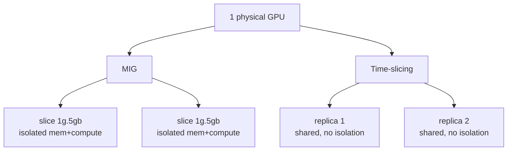
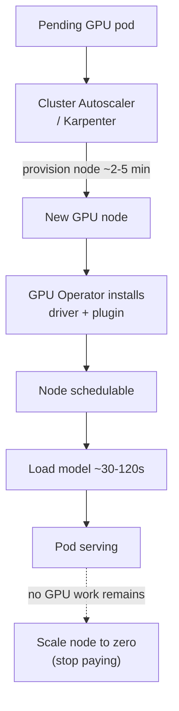

# GPUs on Kubernetes: Scheduling a Scarce, Expensive Resource

Lesson 08 ended on the hardware everything runs on: the **GPU (Graphics Processing Unit)**. This lesson is about making Kubernetes schedule, share, and operate GPUs the way it already does CPU and memory — except GPUs break several assumptions the scheduler was built on. The misconception to clear immediately is that a GPU is "just another resource like CPU or memory," requestable and divisible the same way. By default it is not. Kubernetes treats a GPU as an **indivisible, all-or-nothing device**: a pod gets a whole GPU or none, with no native fractional sharing, no overcommit, and no bin-packing of the kind you rely on for CPU. Combine that with a GPU costing ten to forty times a CPU core and frequently sitting idle, and you have a resource where scheduling decisions translate almost directly into money.

This is the most platform-native lesson in the track: the concepts — device plugins, scheduling, node pools, autoscaling — are all things you operate today, applied to hardware whose scarcity and cost change the calculus.

---

## Contents

1. [Why Kubernetes Cannot Schedule a GPU Natively](#1-why-kubernetes-cannot-schedule-a-gpu-natively)
2. [The GPU Operator: Managing the Node Stack](#2-the-gpu-operator-managing-the-node-stack)
3. [Sharing a GPU: MIG and Time-Slicing](#3-sharing-a-gpu-mig-and-time-slicing)
4. [Steering Workloads with Scheduling Constraints](#4-steering-workloads-with-scheduling-constraints)
5. [Autoscaling and the Economics of Idle GPUs](#5-autoscaling-and-the-economics-of-idle-gpus)
6. [End-to-End: A Request to a Scaled-to-Zero Service](#6-end-to-end-a-request-to-a-scaled-to-zero-service)
7. [Practical Limits and Trade-offs](#7-practical-limits-and-trade-offs)
8. [Summary](#8-summary)

---

## 1. Why Kubernetes Cannot Schedule a GPU Natively

### 1.1 CPU Is Divisible; a GPU Is Not

Kubernetes schedules CPU and memory because the kernel exposes them as divisible, measurable quantities — you request `500m` of CPU and the scheduler bin-packs fractions of cores across pods. A GPU is different on every axis: the kernel does not natively expose it as a divisible quantity; it is a PCI device driven through vendor libraries (CUDA for NVIDIA), and access is mediated by a vendor driver, not the standard cgroup machinery. So out of the box the scheduler does not even know a GPU exists.

### 1.2 The Device Plugin

That gap is filled by the **device plugin** framework — Kubernetes' official extension point for vendor hardware. The vendor ships a device plugin (a DaemonSet) that runs on every GPU node, discovers the GPUs, and *advertises* them to the kubelet as a schedulable resource under a vendor-specific name:

```yaml
# A pod requesting one whole GPU — the only granularity the default plugin offers
resources:
  limits:
    nvidia.com/gpu: 1        # advertised by the device plugin; whole devices only
```

Note what is missing: there is no `nvidia.com/gpu: 500m`. The request must be a whole integer, because the default plugin hands out entire physical GPUs. That single constraint — integer-only, whole-device allocation — is the root of nearly every GPU-on-Kubernetes challenge, and the sharing mechanisms in *Sharing a GPU* exist to work around it.

A GPU under the default plugin is like a meeting room that can only be booked whole, for the whole day, by one team. Even if that team uses it for a ten-minute standup, no one else can have it, and you cannot book "half a room." The room is expensive and often empty — exactly the pressure that forces you to share it.

---

## 2. The GPU Operator: Managing the Node Stack

### 2.1 The Stack a GPU Node Needs

Getting a GPU usable on a node is not just installing a device plugin — it requires a coordinated, version-matched stack on every GPU node:

```text
kernel driver        the NVIDIA driver matching the kernel
container toolkit     the runtime hook that exposes the GPU into containers
device plugin         advertises nvidia.com/gpu to the kubelet
node-feature labels   describe GPU model/capability for scheduling (see Scheduling Constraints)
DCGM exporter         Data Center GPU Manager (DCGM) metrics for monitoring
```

Doing this by hand across every node and through every node replacement is brittle and drifts.

### 2.2 The Operator Reconciles It

The **GPU Operator** (NVIDIA's, the dominant one) automates the whole stack as a Kubernetes operator: it deploys and lifecycle-manages the driver, toolkit, device plugin, labels, and monitoring as cluster resources, so a freshly-joined GPU node is automatically brought to a ready, schedulable state with no manual driver install. For a platform engineer this is the right abstraction level — you manage GPU capability declaratively, the operator reconciles the messy node reality, and node-scaling events (*Autoscaling and the Economics of Idle GPUs*) just work because new nodes self-provision. It is to GPU nodes what good bootstrap automation is to any node pool: declare the desired capability and a controller continuously makes every node match.

---

## 3. Sharing a GPU: MIG and Time-Slicing

Because a whole GPU is far more than many workloads need — an inference server for a small quantized model (lesson 08 §5), a notebook, a dev environment — handing each a full device wastes the most expensive resource in the cluster. Two mechanisms share one physical GPU, making opposite trade-offs. (A third, NVIDIA's **Multi-Process Service (MPS)**, also shares a device but is less commonly exposed through the Kubernetes device plugin, so it is noted only in passing here.)

### 3.1 MIG: Hardware Partitioning

**Multi-Instance GPU (MIG)** is a hardware partitioning feature on data-center GPUs (A100, H100, newer). It physically carves one GPU into up to seven isolated instances, each with its own dedicated slice of compute and memory, each advertised to Kubernetes as a separate schedulable device:

```yaml
# A pod requesting one MIG slice (1 compute unit / ~5 GB), not a whole GPU
resources:
  limits:
    nvidia.com/mig-1g.5gb: 1     # the operator advertises MIG profiles as distinct resources
```

The isolation is hardware-enforced: one instance cannot starve another's memory or compute, so a noisy neighbour in one slice cannot degrade a workload in another. The cost is rigidity — partitions come in fixed profiles, are configured at the node level, and cannot be resized on the fly.

### 3.2 Time-Slicing: Oversubscription

**Time-slicing** instead lets multiple pods take turns on the *whole* GPU, the device plugin advertising more "GPUs" than physically exist and the GPU context-switching between them:

```yaml
# Device-plugin config: advertise 4 time-shared replicas of each physical GPU
sharing:
  timeSlicing:
    resources:
      - name: nvidia.com/gpu
        replicas: 4        # 1 physical GPU now schedulable as 4 — NO isolation
```

It works on any GPU and allows oversubscription, great for bursty, low-utilisation workloads. But there is **no isolation**: pods share all memory and compute, so one greedy workload can exhaust GPU memory and crash its neighbours. It is the GPU analogue of CPU overcommit — fine until everyone wants the resource at once.



*Two ways to share one GPU: MIG carves hardware-isolated slices with guaranteed memory and compute; time-slicing oversubscribes the whole GPU with no isolation between tenants.*

> Nuance: MIG and time-slicing are not better-and-worse; they are isolation-versus-flexibility. Use MIG when workloads must not interfere — multi-tenant production inference where one team's spike cannot crash another's. Use time-slicing where utilisation is low and bursty and a crash is cheap — dev clusters, experimentation. Picking wrong means either wasted partitions or production outages from a noisy neighbour.

| Property | MIG | Time-slicing |
| :--- | :--- | :--- |
| Isolation | Hardware-enforced, strong | None — shared, best-effort |
| Memory/compute guarantee | Yes, per partition | No, contended |
| Flexibility | Fixed profiles, pre-configured | Dynamic oversubscription |
| Hardware support | High-end data-center GPUs only | Any GPU |
| Best for | Production multi-tenant serving | Dev, bursty, low-utilisation |

---

## 4. Steering Workloads with Scheduling Constraints

A cluster usually has a *mix* of nodes — cheap CPU nodes and expensive GPU nodes of several types — and you must land GPU workloads on the right GPUs while keeping ordinary workloads *off* the costly ones. This uses scheduling primitives you already know, with GPU-specific intent.

### 4.1 Taints Keep the Wrong Workloads Off

Taint every GPU node (the GPU Operator can do this automatically) so the scheduler places nothing there unless the pod carries a matching toleration:

```yaml
# On the node: repel everything by default
taints: [{ key: nvidia.com/gpu, value: "true", effect: NoSchedule }]
---
# On a GPU pod: opt in
tolerations:
  - { key: nvidia.com/gpu, operator: Exists, effect: NoSchedule }
```

Without the taint, a stateless web pod can be scheduled onto a $30,000 node and block the very GPU pods the node exists for.

### 4.2 Affinity Attracts the Right GPU

Not all GPUs are equal — a model needing 40 GB cannot run on a 24 GB card, and a MIG slice is a different resource from a whole device. Node labels (applied by the operator's node-feature discovery) describe each node's GPU, and pods select against them:

```yaml
# Land only on A100 nodes — e.g. a model that needs their memory/throughput
nodeSelector:
  nvidia.com/gpu.product: NVIDIA-A100-SXM4-80GB
```

The combination — taints to repel the wrong workloads, affinity to attract the right ones — keeps an expensive heterogeneous fleet allocated correctly.

---

## 5. Autoscaling and the Economics of Idle GPUs

### 5.1 Scale-to-Zero Against Idle Cost

GPU economics are unforgiving: an idle GPU node bills the same as a busy one, and the cost is high enough that idle capacity is a budget line you will be asked about. The **Cluster Autoscaler** (or Karpenter) adds and removes *nodes* based on pending pods — and for GPUs the key move is scaling back to zero when no GPU work remains:

```yaml
# Karpenter NodePool — provision GPU nodes on demand, remove them when empty
spec:
  template:
    spec:
      requirements:
        - { key: node.kubernetes.io/instance-type, operator: In, values: ["g5.xlarge"] }
  disruption:
    consolidationPolicy: WhenEmpty       # remove the node once no GPU pod needs it
    consolidateAfter: 5m
```

Put numbers on why this matters: an 8×A100 node at ~$32/hr left running idle is ~$23,000/month for nothing. The GPU Operator (*The GPU Operator* section) makes scale-up viable by auto-provisioning each new node's driver stack; scale-down to zero is where the savings sit.

### 5.2 The Cold-Start Collision

This collides head-on with the cold-start reality from lesson 08. Scaling GPU nodes to zero saves the most money but means the next request waits for a node to provision (~2–5 min) *and* a multi-gigabyte model to load (~30–120 s) — minutes of latency. Keeping a warm node eliminates that but pays for idle hardware around the clock. There is no free option; you choose per workload by its latency **Service Level Objective (SLO)** and traffic pattern — often a small warm baseline for interactive services plus scale-from-zero for bursty or batch ones.



*GPU autoscaling lifecycle: a pending pod triggers node provisioning, the operator makes the node schedulable, the model loads, the pod serves, and idle nodes scale to zero — the cold-start delay being the price of not paying for idle hardware.*

---

## 6. End-to-End: A Request to a Scaled-to-Zero Service

### 6.1 Tracing One Cold Request

To consolidate, follow a single request to an inference service that has scaled to zero. The lifecycle diagram above traces these same steps — read it alongside. The point is to see where the scattered numbers from this lesson land on one timeline.

**Step by step:**

**0. Idle (the state we start in).** No GPU node is running, so the service costs **$0/hr** — versus the ~$32/hr (~$23K/month) an 8×A100 node would burn sitting idle. This saving is the entire reason to tolerate what follows.

**1. Request arrives → pod goes Pending.** The request lands, the Deployment wants a pod, but every GPU node is tainted (*Taints Keep the Wrong Workloads Off*) and none exists anyway, so the pod cannot be scheduled and sits **Pending** — which is the signal the autoscaler watches.

**2. Node provisioned (~2–5 min).** The Cluster Autoscaler/Karpenter sees the pending GPU pod and launches a matching node (e.g. `g5.xlarge`), the `WhenEmpty` disruption policy meaning it will later remove it once idle.

**3. GPU Operator readies the node (~tens of s).** On the fresh node the operator reconciles the whole stack — driver, container toolkit, device plugin — so `nvidia.com/gpu` is advertised and the node becomes schedulable; without this step the node would join blind to its own GPU.

**4. Model loads (~30–120 s).** The pod is placed, but multi-gigabyte weights must stream onto the GPU before it can serve. Only now does the pod go **Ready** — and the request that arrived in step 1 has now waited **minutes**. This is the cold start in full.

**5. Serving.** The pod answers, the model occupying GPU memory as a KV-cache or MIG slice (lesson 08). Subsequent requests, with the node already warm, skip steps 2–4 entirely and respond in milliseconds.

**6. Drain → scale to zero.** Traffic stops; once no GPU pod needs the node, `consolidateAfter: 5m` elapses and the autoscaler removes it. Billing returns to **$0/hr** — back to step 0.

The first request paid minutes of latency so the organisation paid nothing while idle. That single trade — borne by the cold request, banked by the budget — is the abstract choice of *The Cold-Start Collision* made concrete, and it is why interactive services keep a small warm baseline while bursty and batch ones scale from zero.

---

## 7. Practical Limits and Trade-offs

- **Indivisible by default vs. sharing**: Kubernetes allocates whole GPUs only, so any fractional use requires MIG or time-slicing — without one, small workloads waste the cluster's most expensive resource.
- **MIG isolation vs. time-slicing flexibility**: MIG gives hardware-enforced, contention-free slices in fixed profiles, while time-slicing oversubscribes any GPU dynamically with no isolation — choose isolation for production multi-tenancy, flexibility for bursty dev.
- **Exclusivity vs. utilisation**: tainting GPU nodes keeps cheap workloads off costly hardware but means those nodes do nothing when no GPU work exists, which is precisely why scale-to-zero matters.
- **Idle cost vs. cold-start latency**: scaling GPU nodes to zero stops paying for idle hardware (~$23K/month for one idle 8×A100 node) but inflicts minutes of node-provision plus model-load delay on the next request, so warm baselines and scale-from-zero are mixed per workload SLO.
- **Operational simplicity vs. driver fragility**: the GPU Operator removes brittle manual driver management and makes autoscaling viable, but adds a privileged, version-sensitive operator that must itself be kept healthy and matched to node hardware.

---

## 8. Summary

GPUs break the scheduler's core assumptions. A GPU is an indivisible, vendor-driven device that Kubernetes only sees because a device plugin advertises it, and it only ever hands out whole GPUs, as integers rather than fractions. The GPU Operator tames the fragile per-node driver stack so nodes self-provision and autoscaling becomes possible.

MIG (hardware-isolated fixed partitions) and time-slicing (flexible, isolation-free oversubscription) are the two ways to share a device usually larger than one workload needs, chosen along an isolation-versus-flexibility axis. Taints keep cheap workloads off expensive nodes, and affinity steers each model to GPUs that fit it. The autoscaler's scale-to-zero is the main lever against the unforgiving economics of idle GPUs — an idle 8×A100 node burns ~$23K/month — bought at the price of the cold starts from lesson 08.

Throughout, the tools are the platform primitives you already operate; what changes is that every scheduling decision is also a cost decision. The resource is scarce and expensive enough that wasted capacity shows up directly on the bill — which is why lesson 11 returns to cost as a first-class governance concern.
