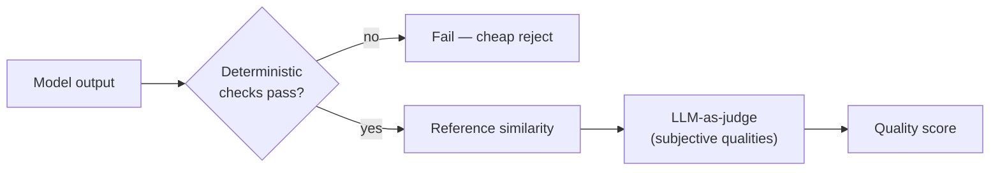
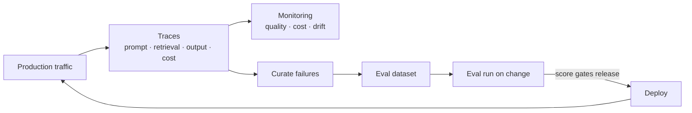

# LLMOps & Evals: Shipping Non-Deterministic Systems with Confidence

Every prior lesson has circled one fact: an LLM is probabilistic, so the same input can produce different output, and "it worked when I tried it" proves nothing. **LLMOps** is the discipline of operating LLM-powered systems despite that — the AI-era counterpart to the DevOps and MLOps practices you already run. The misconception to retire is that you can ship an LLM feature on the practices you already have: unit tests, a green CI pipeline, and error-rate dashboards. You cannot. A unit test asserts exact equality, which a probabilistic system defies; an error-rate dashboard catches crashes, but an LLM's worst failures do not crash — they return a confident, well-formed, *wrong* answer with an HTTP 200. The entire practice exists to make a system whose correctness cannot be asserted, and whose failures are invisible to ordinary monitoring, safe to depend on.

This is the operational backbone for everything in the track — the prompts of lesson 02, the agents of lessons 03–05, and the RAG and serving systems of lessons 06–08 all need it to be trustworthy in production.

---

## 1. Why Traditional Testing and Monitoring Fall Short

### 1.1 Assertion Testing Breaks

Two pillars of normal operations quietly break for LLMs. The first is **testing by assertion**. A test like `assertEqual(output, expected)` assumes a deterministic function; an LLM may phrase a correct answer ten different ways and produce a different one each run, so exact-match assertions fail on correct output and pass nothing meaningful:

```python
# Both answers are correct. An exact-match assertion fails the second one.
assert out == "The pod was OOMKilled because it exceeded its memory limit."
#   actual: "The pod hit its memory limit and was OOMKilled."   -> AssertionError
```

### 1.2 Monitoring Misses the Failure

The second is **failure visibility**. Your monitoring stack watches for exceptions, latency spikes, and error codes — failures that announce themselves. An LLM's characteristic failure (lesson 01's hallucination) produces a syntactically perfect, fast, HTTP-200 response that happens to be false. No exception fires, no error metric moves, no alert triggers.

> Note: This is the defining operational hazard of LLM systems and why LLMOps is a distinct practice, not a tweak to your pipeline. A system can be 100% "up" by every traditional metric and simultaneously be badly broken in the only dimension that matters — the correctness of what it says. You must measure *quality*, not just availability, and quality needs new tooling.

It is the difference between a smoke detector and a food inspector. A smoke detector (monitoring) screams when something is on fire — a crash, an outage. But a kitchen can pass every smoke-detector check while plating subtly spoiled food; catching that needs an inspector who actually tastes the dishes (evaluation). LLMOps adds the inspector your monitoring stack never had.

---

## 2. Evals: The Test Suite for Probabilistic Systems

### 2.1 What an Eval Is

An **eval** (evaluation) is the LLM-world replacement for the unit test: a curated dataset of representative inputs, each paired with a definition of a good response, run against your system to produce a *quality score* rather than a pass/fail on exact text. Evals are the most important practice in LLMOps because they are the only thing that converts "the demo looked good" into a defensible, repeatable measure of whether the system works — and whether a change made it better or worse.

```json
{ "input": "Why is the payments pod OOMKilled?",
  "context": "Deployment requests 8Gi; LimitRange caps containers at 4Gi.",
  "expected": "It requests more memory (8Gi) than the 4Gi namespace limit allows.",
  "rubric": ["mentions 8Gi request", "mentions 4Gi limit", "concludes limit exceeded"] }
```

### 2.2 The Eval Set Is the Asset

The eval set should reflect real usage: common cases, known hard cases, edge cases, and especially past failures — every production bug becomes a permanent eval case so it can never silently regress. Building and curating this dataset is the real work; a system with a strong eval set can be improved with confidence, and one without is changed by guesswork — the lesson-02 warning that a prompt without an eval set is a config change with no tests. An eval set is to an LLM system what a regression suite is to a codebase, with one twist: instead of asserting exact outputs, it scores quality against a rubric, because the same correct answer takes many forms.

---

## 3. How to Score a Non-Deterministic Output

If you cannot assert exact equality, how do you score? Three methods, increasing in flexibility and decreasing in objectivity; most systems blend them in the funnel of Section 3.4.

### 3.1 Deterministic Checks

Apply wherever the output has verifiable structure — valid JSON, matches the schema (lesson 02), contains a required value, number in range, cited document exists. Cheap, objective, and they should cover everything they *can*:

```python
def grounded_in_context(answer, context_ids):
    cited = re.findall(r"\[(c\d+)\]", answer)         # extract [c1], [c3], ...
    return all(c in context_ids for c in cited)       # every citation is real
```

### 3.2 Reference-Based Metrics

Compare output against a known-good answer by *similarity* rather than exact match — often the embedding cosine from lesson 06:

```python
score = cosine(embed(model_answer), embed(expected_answer))   # 1.0 = identical meaning
passed = score > 0.85                                          # tolerant of wording
```

This handles "correct but worded differently" but needs a reference per case and rewards paraphrase over correctness if used naively.

### 3.3 LLM-as-Judge

Use a second LLM to grade the first against a rubric — the only method that scales to subjective qualities (helpfulness, tone, groundedness) no formula captures:

```text
You are grading an answer. Score 1-5 for FAITHFULNESS to the context.
A 5 uses only facts present in the context; a 1 contradicts or invents.
Context: {context}   Answer: {answer}
Respond as JSON: {"score": <1-5>, "reason": "<one sentence>"}
```

> Nuance: LLM-as-judge is itself a non-deterministic, fallible LLM — it can be biased (favouring longer answers, or ones resembling its own style) and inconsistent. Treat the judge as an instrument that must be calibrated against human-labelled examples before you trust its scores. A judge you have not validated is measuring with an uncalibrated ruler.

### 3.4 The Scoring Funnel



*The scoring funnel: cheap deterministic checks gate objective properties and reject early, reference similarity handles wording, and the expensive, fallible LLM-judge is used only for the subjective qualities the cheaper methods cannot reach.*

---

## 4. Observability: Tracing What the System Actually Did

### 4.1 Capture the Whole Trace

Evals tell you how the system performs on your test set; **observability** tells you what it did on *real* traffic, which the test set can never fully anticipate. LLM observability extends the tracing you already practice with the data unique to these systems:

```json
{ "trace_id": "req_8841", "prompt_tokens": 5300, "completion_tokens": 180,
  "retrieved_chunks": ["c1", "c7", "c12"],            // lesson 07
  "tool_calls": [{"name": "get_pod_status", "ok": true}],   // lesson 04
  "ttft_ms": 240, "total_ms": 1100, "cost_usd": 0.0123, "model": "claude-opus-4-8" }
```

### 4.2 Two Non-Negotiable Needs

First, **debuggability**: when a user reports a wrong answer you cannot reproduce it by re-running (non-determinism), so the *trace of that exact call* — what context went in, what came out — is the only way to understand what happened. Without the captured prompt and retrieved chunks, a RAG failure is unanalysable. Second, **the feedback loop**: production traces are the richest source of new eval cases. Real failures captured in traces become tomorrow's eval set (Section 2), closing the loop from production back into your quality measure.



*The LLMOps loop: production traces feed both live monitoring and the curation of new eval cases, which gate every change before it deploys back to production.*

---

## 5. Managing Change: Prompts, Models, and Versions

### 5.1 Every Behaviour-Changing Variable Is Versioned

An LLM system has more moving parts that change behaviour than a normal service, and each must be versioned and rolled out deliberately. The **prompt** is configuration that materially alters output (lesson 02), so it lives in source control and code review. The **model** is a dependency you do not control: providers update and deprecate models, and a new version can change behaviour on your exact prompts, so a model upgrade is a migration to be eval-tested, never a silent bump. **RAG content, retrieval settings, and tool definitions** all shift outputs too.

### 5.2 The Eval Score Is the Gate

Because every one of these is behaviour-changing, the release discipline mirrors what you already do but gates on *quality scores*, not just passing tests:

```yaml
# CI step — block the change if eval quality regresses
- run: python run_evals.py --suite triage --prompt prompts/triage.v8.txt
  # exits non-zero if mean score < 0.90 OR drops vs the current production prompt
```

For higher-stakes changes, roll out gradually — canary a new prompt or model to a slice of traffic, watch the live quality and cost metrics from Section 4, then widen — because a probabilistic change's real effect only fully shows on real traffic. A model-version upgrade is like a major dependency bump you cannot pin forever: it may fix or break things, and the only responsible way to adopt it is to run your full eval suite against it first.

---

## 6. Cost and Drift: The Ongoing Concerns

### 6.1 Cost Is a Runtime Behaviour

Two metrics need continuous watching beyond quality. **Cost** is per-token and therefore variable and usage-driven (lesson 01): a change that lengthens prompts, retrieves more chunks, or triggers more agent loops (lesson 05) can multiply spend with no error. Token cost belongs on a dashboard next to latency, with alerts, because here cost is a runtime behaviour, not a fixed line item — and a runaway agent can move it fast.

### 6.2 Drift Degrades Quality Silently

**Drift** is the subtler threat. Even with everything on your side frozen, quality can degrade because the *world* changed: user questions shift to topics your RAG corpus does not cover, input patterns move away from what your prompts were tuned for, or a provider silently updates a model behind a stable name. Nothing in your code changed, no alert fires, yet quality slides. The only defence is continuous evaluation against a maintained eval set plus monitoring of live quality signals — drift is caught by *measuring quality over time*, which is why the Section 4 loop runs continuously rather than once.

Drift is like a well-calibrated sensor slowly going out of true: nothing dramatic breaks, every reading looks plausible, but the gap between what it reports and reality widens unnoticed. You only catch it by periodically checking against a known reference — which is exactly what running your eval set on a schedule does.

---

## 7. Practical Limits and Trade-offs

- **Availability vs. quality**: traditional monitoring proves the system is *up* but says nothing about whether its answers are *right*, so LLMOps must measure quality separately — a 100%-healthy system can still be badly broken in correctness.
- **Eval rigor vs. effort**: a strong eval set is the only foundation for confident change, but it is real, ongoing work to curate and maintain, and a system without one is improved by guesswork — the investment is the price of shipping safely.
- **Scoring flexibility vs. objectivity**: deterministic checks are cheap and trustworthy but only cover structured properties, while LLM-as-judge scales to subjective quality at the cost of being a fallible, bias-prone instrument that itself needs calibration.
- **Model freshness vs. stability**: adopting a newer model may improve results but can change behaviour on your prompts, so each upgrade is an eval-gated migration, not a free in-place bump.
- **Capability vs. cost**: richer prompts, more retrieved context, and more agent steps raise quality but also raise per-token spend and latency, so cost must be monitored as a live behaviour and traded against quality deliberately.

---

## 8. Summary

LLMOps exists because the practices that ship normal software fail for probabilistic ones: you cannot assert exact output, and the worst failures return a confident wrong answer with an HTTP 200 that no error metric catches. Evals replace unit tests with a curated dataset scored for quality rather than equality, and that score — produced by a funnel of cheap deterministic checks, reference similarity, and calibrated LLM-as-judge — becomes the gate every prompt, model, and retrieval change must pass before it ships. Observability captures the full trace of each real request, which is both the only way to debug a non-reproducible failure and the richest source of new eval cases, closing a continuous loop from production back into the quality measure. That loop must run continuously, not once, because cost is a usage-driven runtime behaviour a single change can multiply and because drift degrades quality with no code change and no alert — both caught only by measuring quality and cost over time. LLMOps is the discipline that makes everything earlier in this track — prompts, agents, RAG, serving — trustworthy enough to depend on, and it sets up the security, cost, and governance concerns that lesson 11 treats as first-class.
