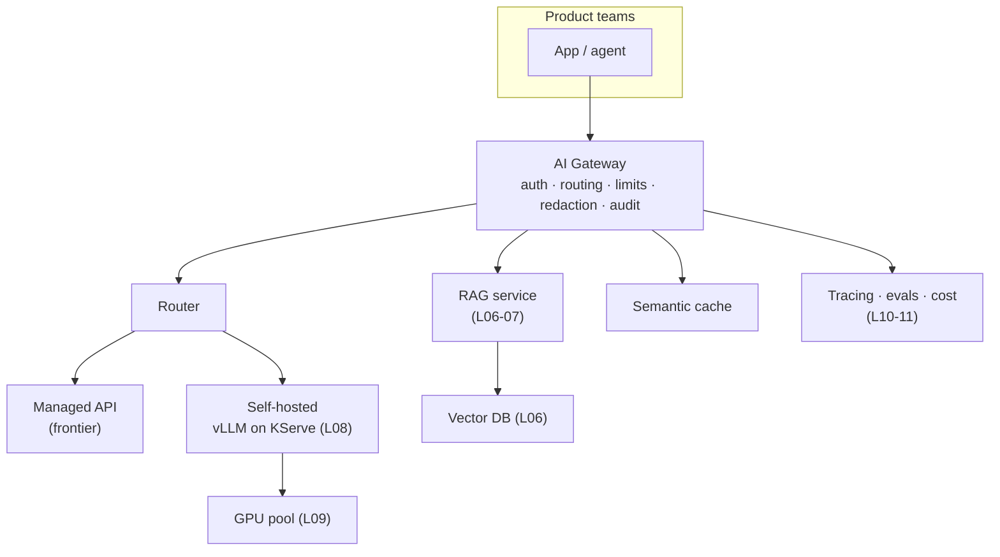
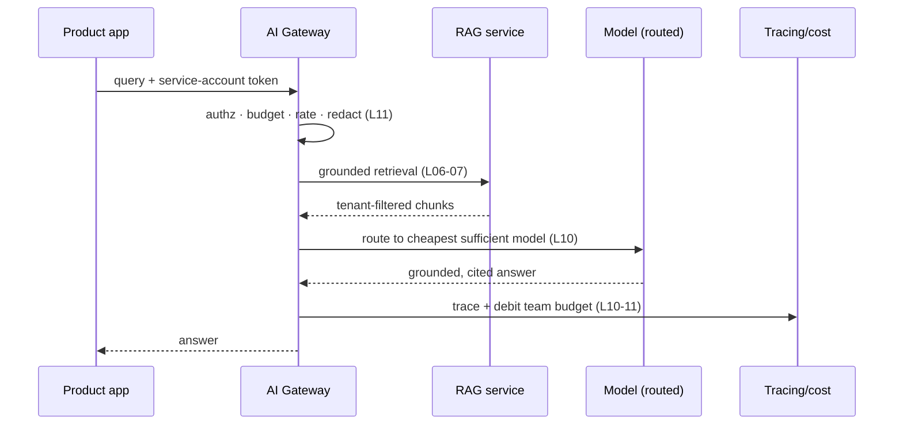

# Building an Internal AI Platform: The Capstone

This final lesson assembles everything the track has built — model fundamentals, prompting, agents, MCP, retrieval, serving, GPUs, LLMOps, and the security and cost controls of lesson 11 — into the thing a platform engineer ultimately delivers: a **paved road** that lets product teams build AI features safely without each one reinventing the stack. The misconception to retire is that an AI platform is "a model endpoint teams can call." A raw provider key handed to every team is the *opposite* of a platform: it scatters cost, security, and observability decisions across the org with no central control, no shared guardrails, and no way to answer "what are we spending and is any of it leaking." A real internal AI platform is a thin but opinionated layer that makes the *safe, observable, cost-controlled* path the *easy* path.

As `00-overview.md` framed the dual mandate, this is the "operate" thread brought home: not running one model, but running the platform an organisation builds AI on. Everything here is golden-path platform engineering — the same discipline you already practise, pointed at AI workloads.

---

## 1. Why a Platform, Not Just an Endpoint

### 1.1 What Goes Wrong Without One

When every team integrates directly with a model provider, each independently re-solves — usually badly — the same problems: where do credentials live, how is spend tracked, who stops a runaway loop, how is PII kept out of prompts, which models are allowed, how are failures debugged. The result is *shadow AI*: unreviewed endpoints, duplicated RAG pipelines, no shared eval discipline, and a security and cost surface no one can see, let alone govern. The concerns of lesson 11 become unenforceable the moment access is decentralised.

### 1.2 The Platform's Job

A platform centralises the cross-cutting concerns so individual teams do not have to:

```text
Team WITHOUT a platform          Team WITH a platform
---------------------------      ----------------------------------
own a provider key               request access via RBAC (lesson 11)
hand-roll retry/rate-limit       gateway handles it
hope PII isn't leaking           gateway redaction + audit
guess at cost                    per-team budgets + dashboard
build their own RAG              call RAG-as-a-service (golden path)
no eval discipline               shared eval + tracing built in
```

A platform is to AI what a paved internal PaaS is to deployments: a team should get a governed, observable, rate-limited model endpoint the way they get a namespace with sensible defaults — self-service, with the guardrails already wired in, not assembled by hand per project.

---

## 2. The AI Gateway: The Central Control Point

### 2.1 One Chokepoint for Every Concern

The heart of the platform is the **AI gateway** — a service every model call flows through, the single place to enforce what lesson 11 made unenforceable when decentralised. Because all traffic passes one chokepoint, the gateway is where authentication, routing, rate limiting, cost tracking, caching, guardrails, and audit all live. Teams call the gateway, never the provider directly.

```yaml
# A gateway policy for one team — every cross-cutting concern in one place
team: payments
auth: { service_account: payments-api }       # RBAC (lesson 11 §6.1)
routing:
  default: claude-haiku-4-5                    # cheap by default
  allow:  [claude-haiku-4-5, claude-opus-4-8]  # model allowlist (lesson 11)
limits:
  daily_token_budget: 5_000_000                # hard cost cap (lesson 11 §5)
  rate_limit_rpm: 120
guardrails:
  pii_redaction: true                          # strip secrets before egress
  audit_log: true                              # every prompt/response recorded (lesson 10)
cache: { semantic: true }                      # avoid repeat model calls
```

### 2.2 Why the Chokepoint Matters

A single ingress point is what turns the lesson-11 controls from per-team good intentions into enforced, observable policy. It also decouples teams from providers: switch a model, add a provider, or change a rate limit once at the gateway and every team inherits it — no client-side changes. The cost is that the gateway is now critical infrastructure on the hot path, so it must be highly available and low-latency, or it becomes the bottleneck for every AI feature in the company.

> Note: An AI gateway is the same pattern as an API gateway or a service mesh — a control point that centralises cross-cutting policy — applied to model traffic. If you already run one of those, you already understand the shape; the AI-specific additions are token-cost accounting, prompt redaction, semantic caching, and model routing.

---

## 3. Model Routing and Serving Behind One Interface

### 3.1 Unifying Managed and Self-Hosted

A mature platform serves models from two sources behind one interface: **managed APIs** (frontier capability, no ops burden) and **self-hosted models** (vLLM on KServe from lesson 08, for data-residency or high-volume workloads from lesson 11 §6.2). The gateway presents both through a uniform API so a team asking for "a model" need not know — or care — whether it runs in a provider's cloud or on your GPUs (lesson 09).

### 3.2 Routing by Cost and Capability

The gateway's **router** picks the actual model per request, and this is the single biggest cost lever (lesson 11 §5). The principle is to use the *smallest model that passes the task's evals* (lesson 10), reserving expensive frontier models for the requests that genuinely need them:

```python
# Simplified — route by declared task complexity, falling back on capability
def route(request):
    if request.task == "classify" or request.tokens < 500:
        return "claude-haiku-4-5"          # cheap, fast, fine for simple tasks
    if request.needs == "self_hosted":     # data must stay in-VPC (lesson 11)
        return "vllm/llama-3-13b"          # KServe-served (lesson 08)
    return "claude-opus-4-8"               # frontier — only when warranted
```

This is the latency/cost/capability trade-off from across the track made operational: routing turns "always use the best model" (simple but expensive) into "use the right model per request" (cheaper, with the complexity now owned by the platform rather than every team).

---

## 4. Self-Service Golden Paths

### 4.1 Paved Roads, Not Building Blocks

The platform's value multiplies when it offers not just model access but *complete, vetted patterns* teams can adopt wholesale. Four golden paths cover most needs:

```text
RAG-as-a-service     give us a document source; get a grounded, filtered
                     query endpoint (lessons 06-07) — no pipeline to build
Agent templates      a scaffolded agent with permission gates, scoped creds,
                     and loop limits already wired in (lessons 04-05)
Vetted MCP servers   a registry of reviewed, least-privilege servers for
                     common systems (k8s, cloud, tickets) — lesson 04
Prompt registry      versioned, eval-gated prompts as shared artefacts (lesson 02)
```

### 4.2 Defaults Carry the Guardrails

The point of a golden path is that the safe defaults are *baked in*. A team adopting the agent template gets least-privilege credentials, approval gates, and loop limits (lessons 05, 11) without knowing those terms — the platform encoded the lesson-11 controls into the scaffold. This is how a platform scales security: not by reviewing every team's code, but by making the reviewed, hardened pattern the easiest one to start from. The trade-off is opinion — a golden path constrains how teams build, and a team with a genuinely unusual need may find it limiting, which is why an escape hatch (direct, still-gated access for vetted exceptions) matters.

---

## 5. Cross-Cutting Platform Services

### 5.1 Observability and Evals as Shared Infrastructure

The LLMOps discipline of lesson 10 should not be re-implemented per team. The platform provides **tracing** (every gateway call captured with prompt, retrieved chunks, tool calls, tokens, latency, and cost) and an **eval harness** as shared services, so any team gets debuggability and quality measurement for free, and the org gets a single pane over quality and drift. Because traces flow through the one gateway, the production-to-eval feedback loop (lesson 10 §4) operates at platform scale.

### 5.2 Cost and Security as Platform Services

Likewise, **cost accounting** (per-team token spend, budgets, alerts — lesson 11 §5) and **security controls** (PII redaction, model allowlists, audit — lesson 11 §3, §6) live in the platform, not in application code. Centralising them is what makes them consistent and enforceable: a redaction rule or a new model restriction is deployed once at the gateway and applies everywhere, instead of depending on every team remembering to implement it.

---

## 6. The Ownership Model

### 6.1 Who Owns What

A platform is as much an organisational contract as a technical one, and ambiguous ownership is what sinks them. The clean split is **the platform team owns the paved road; product teams own what they build on it**:

| Concern | Platform team | Product team |
| :--- | :--- | :--- |
| Gateway, routing, model serving | Owns | Consumes |
| Cost controls, budgets, quotas | Sets framework | Owns their budget |
| Security guardrails (redaction, allowlist) | Owns | Complies |
| Golden-path templates | Builds + maintains | Adopts |
| Application logic, prompts, evals | Provides tooling | Owns |
| Quality of their feature | Provides tracing/evals | Owns outcome |

### 6.2 The Principle Behind the Split

The dividing line is the platform owns *capability and guardrails*, product teams own *use and outcomes*. The platform guarantees a team cannot exceed its budget or leak PII through the gateway; the team is responsible for whether their prompts and evals make a good feature. Blur this — a platform team made accountable for every team's feature quality, or product teams expected to each secure their own egress — and the model breaks. The platform's job is to make the right thing easy and the wrong thing hard, not to do every team's work.

---

## 7. Reference Architecture and a Worked Request

### 7.1 The Whole Picture



*The internal AI platform: every product team's traffic flows through one gateway that authenticates, routes to managed or self-hosted models, fronts shared RAG and caching, and emits traces, evals, and cost — the cross-cutting concerns centralised so teams inherit them.*

### 7.2 One Request, End to End

Trace a product team's call — *"summarise the open incidents for service `payments`"* — through the platform.



*One request through the platform: the gateway enforces every cross-cutting control in sequence, fronts shared retrieval, routes to the right model, and records the trace and spend — the team wrote none of it.*

**Step by step:**

**1. Authenticate and authorise.** The app calls the gateway with its service-account token. The gateway checks RBAC (lesson 11): is `payments` allowed to use the AI platform, and which models? (Section 2.1's policy.)

**2. Budget and rate check.** The gateway verifies the team is under its daily token budget and rate limit (lesson 11 §5), rejecting fast if either is exhausted — the runaway-loop and cost guard.

**3. Redact.** Outbound prompt content passes PII redaction (lesson 11 §3) before anything leaves the perimeter.

**4. Retrieve (golden path).** Because this is a grounded query, the gateway calls the RAG service (lesson 07), which embeds the question, retrieves tenant-filtered incident chunks (lesson 06), and assembles a grounded prompt.

**5. Route.** The router (Section 3.2) picks the model — a cheap model suffices for summarisation, so it routes to `claude-haiku-4-5`, not the frontier model.

**6. Cache check and generate.** The semantic cache is checked; on a miss, the model is called (managed or self-hosted, transparent to the team) and the grounded, cited answer returns.

**7. Trace and account.** The full trace — prompt, retrieved chunks, tokens, latency, cost — is recorded (lesson 10), the team's spend is debited, and the answer flows back to the app.

The product team wrote *none* of steps 1–7's controls. They asked a question and got a grounded, governed, observable answer — which is the entire point: the platform did the cross-cutting work so the team could focus on their feature.

---

## 8. Practical Limits and Trade-offs

- **Central control vs. team flexibility**: a gateway and golden paths enforce security, cost, and observability uniformly, but constrain how teams build — provide escape hatches for genuinely unusual needs so the platform enables rather than blocks.
- **Chokepoint leverage vs. critical-path risk**: routing all traffic through one gateway is what makes policy enforceable and providers swappable, but it puts the gateway on every AI feature's hot path, so it must be highly available and low-latency or it becomes the bottleneck.
- **Capability vs. cost (routing)**: defaulting to the smallest model that passes evals and reserving frontier models for hard requests cuts spend dramatically, at the cost of building and maintaining routing logic and per-task eval coverage.
- **Managed vs. self-hosted mix**: serving both behind one interface gives teams frontier capability and data-residency options, but means the platform team operates GPUs (lessons 08–09) *and* manages provider relationships — more surface to run.
- **Platform investment vs. time-to-value**: a real platform is upfront engineering that pays off only at organisational scale, so start with the gateway (the highest-leverage piece) and add golden paths as demand proves them, rather than building everything before anyone ships.

---

## 9. Summary

An internal AI platform is not a model endpoint but a paved road: a thin, opinionated layer that makes the secure, observable, cost-controlled path the easy one, so product teams build AI features without each re-solving credentials, cost, security, and debugging. Its heart is the AI gateway — a single chokepoint every model call flows through — which is what turns the lesson-11 controls from per-team good intentions into enforced, observable policy, and which decouples teams from providers by routing managed and self-hosted models (lessons 08–09) behind one interface. Above the gateway sit golden paths (RAG-as-a-service, agent templates, vetted MCP servers, a prompt registry) that bake the hardened defaults in, and cross-cutting services (tracing, evals, cost, security from lessons 10–11) provided once for everyone. A clean ownership split — the platform owns capability and guardrails, product teams own use and outcomes — keeps the contract workable, and the reference architecture's worked request shows a team getting a grounded, governed, observable answer having written none of the controls themselves. That is the culmination of the whole track: a platform engineer who understands models, agents, retrieval, serving, GPUs, and the security and cost concerns can now assemble them into the foundation an entire organisation builds AI on — the fullest expression of the dual mandate this track opened with.
