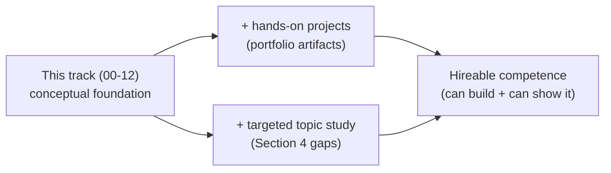

# Closing Assessment: From Foundation to Hireable Competence

This is the track's closing document — a candid self-assessment, not a lesson. It answers the question a learner should ask after finishing lessons 00–12: *if I genuinely absorb all of this, am I a competent AI engineer who could be hired?* The honest answer is nuanced, and worth stating plainly before you invest more time. This document is deliberately not written to the lesson template (no misconception intro, no analogy quota); it exists to tell you where the track leaves you, what it does not cover, and what to build next to convert knowledge into the kind of competence a hiring process can actually see.

---

## 1. The Verdict

Completing this track makes you **conceptually strong and a credible AI *platform/infrastructure* engineer — but reading it is necessary, not sufficient, to be hireable.** The gap is not about the quality or depth of the material; it is about *modality*. Hiring for AI roles screens overwhelmingly for **demonstrated competence** — systems you have built, code you have shipped, a portfolio someone can inspect — and twelve deep lessons build judgment and vocabulary, not evidence. A reader finishes able to *reason about and discuss* serving, RAG, agents, evals, and platforms convincingly, but on the strength of the track alone has not *built* any of them.

Put bluntly: this track gets you through a **system-design conversation** well. It does not, by itself, get you through a **take-home project** or a "show me your GitHub" screen. Those require the hands-on layer this track does not include.

---

## 2. What the Track Does Well

- **The infra/operate half is genuinely differentiated.** Serving internals (the KV-cache memory math, prefill/decode, paged attention), GPUs on Kubernetes (MIG, scheduling, scale-to-zero economics), and the internal-platform capstone are exactly where most self-taught AI engineers are weakest — and exactly where a platform engineer's existing skills convert into rare value. This is the track's strongest asset and its central bet.
- **It teaches the "why" and the trade-offs**, not just the "what." That produces someone who can reason in unfamiliar situations rather than recite, which is the difference between passing a design interview and stalling at the first follow-up question.
- **The application spine is coherent**: prompting and context engineering, embeddings and vector search, RAG, agents and MCP, evals, and the security/cost/governance concerns are connected, not a list of disconnected topics.
- **It is honestly scoped.** It anchors every new AI concept to existing platform fluency (Kubernetes, cloud, CI/CD, scheduling, cost), which is an efficient way for *this* audience to learn, and it does not pretend to be a full machine-learning degree.

---

## 3. The Decisive Gap: Knowledge vs. Demonstrated Competence

The single biggest barrier between finishing this track and being hireable is that the track is **entirely reading**. It contains no hands-on labs, produces no portfolio artifacts, and offers no self-assessment. A hiring manager cannot see what you understand; they can only see what you have built and what you can do under observation. Three things are missing:

- **Hands-on labs** — actually building each thing (a RAG service, a model deployment, an MCP server, an eval harness, a guardrailed agent), not just reading how they work.
- **Portfolio artifacts** — public repositories and a deployed demo, which are the primary hiring signal for AI engineering roles.
- **Self-assessment** — exercises and challenges that prove to *you* that you can do it unaided, before someone else tests it.

*The track is the foundation, not the finish line: hireable competence comes from adding built-and-published projects and a few targeted topics on top of the conceptual base.*

The fix is straightforward and is the subject of Section 6: build the things the lessons describe, in public.

---

## 4. Topic Gaps (Prioritized)

Within its stated scope the track is coherent, but several topics a working AI engineer is often expected to know are absent or only mentioned. In rough priority order:

1. **Fine-tuning and model customization** — LoRA / PEFT / QLoRA, when to fine-tune versus RAG, dataset preparation, and the training infrastructure. The track *mentions* this (lesson 07) but never teaches it; it is the most notable missing topic and a common interview and role expectation.
2. **Agent frameworks and orchestration in practice** — the concepts are covered (lessons 03–05), but not the tooling (LangGraph, LlamaIndex, and peers) or multi-agent, planning, and memory architectures.
3. **Advanced RAG** — the track stops at re-ranking; it omits query rewriting / HyDE, GraphRAG, agentic and multi-hop retrieval, and RAG-specific evaluation (e.g. RAGAS).
4. **Multimodal** — vision, audio, image generation, and multimodal retrieval are absent and increasingly expected.
5. **Evaluation and data tooling in practice** — lesson 10 is conceptually solid but not hands-on with eval frameworks, building gold datasets, or labeling and data-quality pipelines.
6. **Responsible AI beyond security** — bias and fairness, deeper hallucination mitigation, red-teaming, and model cards; lesson 11 covers the security slice but not the broader harm surface.
7. **The ML/DL fundamentals boundary** — training internals, the underlying mathematics, and model development are *deliberately* excluded. This is fine for application and infrastructure roles and a real gap for "ML engineer" or applied-scientist roles. It is listed here not as a defect but so you know which roles this track does and does not target.

---

## 5. Role-Fit Read

The track does not target one generic "AI engineer"; it fits some roles far better than others. Calibrate your expectations against the actual job you are aiming for.

| Target role | Conceptual coverage | Verdict |
| :--- | :--- | :--- |
| **AI Platform / LLMOps / Inference Infra** | ~85% | Best fit. With two or three real projects, genuinely hireable — this is where your platform background compounds. |
| **LLM Application Engineer ("AI Engineer", product)** | ~65–70% | Solid base; add fine-tuning, agent frameworks, multimodal, advanced RAG, *and* projects. |
| **ML Engineer (training) / Applied Scientist** | out of scope | Major gaps (training, mathematics, model development) — not what this track is for. |

> Recency caveat: the conceptual content here ages slowly — tokens, attention, the KV-cache, retrieval, scheduling, and platform patterns will hold. But *tool specifics* (model names, framework APIs, provider features) move fast. Treat the concepts as durable and re-check the concrete tooling against current docs when you build.

---

## 6. The Path Forward

To convert this foundation into hireable competence, build the things the lessons describe — in public — and self-study the Section 4 gaps until each becomes a demonstrable artifact. The most efficient path turns each major area of the track into one portfolio project:

| Build this (portfolio project) | Proves competence from | Demonstrable artifact |
| :--- | :--- | :--- |
| A RAG service over your own documents, with chunking, hybrid search, re-ranking, and citations | Lessons 06–07 | Public repo + a live demo endpoint |
| A model deployed on Kubernetes with vLLM, autoscaling, and scale-to-zero | Lessons 08–09 | Repo with manifests + a short write-up of the cost/latency trade-offs you made |
| A least-privilege MCP server wrapping a real system (k8s, cloud, or an API) | Lesson 04 | Published server + a demo of an agent driving it |
| An eval harness that scores a prompt or RAG system and gates a CI pipeline | Lesson 10 | Repo with an eval dataset, scorers, and a passing/failing CI run |
| A guardrailed ops agent (read plane / gated write plane, scoped creds, loop limits) | Lessons 05, 11 | Repo + a recorded worked run, including a blocked unsafe action |

For the topic gaps in Section 4, pair each with a small build so it becomes evidence rather than reading: fine-tune a small open model with LoRA on a narrow task and publish the before/after evals; rebuild one of the projects above on an agent framework (e.g. LangGraph) to learn its orchestration model; extend the RAG project with query rewriting or a multi-hop retriever and measure the lift with RAGAS-style metrics; add a multimodal capability (image or document understanding) to one project.

The highest-leverage single move is to attempt the track's own **capstone — the internal AI platform of lesson 12 — as a real (even if scaled-down) project**: a gateway that authenticates, routes between a managed API and a self-hosted model, enforces a token budget, redacts, and emits traces. It exercises nearly every lesson at once and is, by itself, a portfolio-grade artifact that signals exactly the platform-plus-AI competence this track is designed to build.

---

## 7. Closing

This track delivers what it set out to: a platform engineer who can reason deeply about how LLMs work, how to prompt and ground them, how agents and MCP let them act, how to serve and schedule them on real infrastructure, and how to keep the whole thing secure, affordable, and governed. That is a strong and genuinely differentiated foundation — necessary for the AI platform and infrastructure roles where your existing skills compound the fastest. But a foundation is not a finish line. The conceptual base becomes *hireable competence* only when you build the systems the lessons describe, publish them, and fill the targeted topic gaps with small builds of their own. Read the lessons to know *why*; build the projects to prove you *can* — and start with the lesson 12 platform, because shipping a scaled-down version of it is the most convincing single answer to "show me what you've built."
