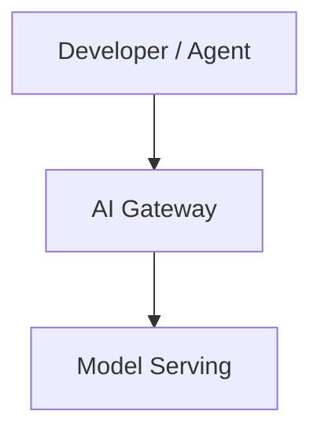

# 03-ai-platform-engineering Guidelines

## Purpose

Self-study notes on **AI for platform engineers** — equipping someone already fluent in platform tooling, Kubernetes, and cloud to evolve their craft for the AI era. Each file is a self-contained, standalone reference: technically detailed enough to return to as a future reference, and educational enough to explain *why*, not just *what*.

The goal is not a summary of blog posts. A good lesson file should let a platform engineer understand an AI concept deeply — including the reasoning behind each design decision — and connect it back to how they build and operate platforms.

The track has two intertwined threads, and most lessons touch both:

- **Augment** — using AI to evolve how you work (coding agents, MCP, agentic automation of platform tasks).
- **Operate** — building and running the infrastructure AI workloads need (model serving, GPUs on Kubernetes, RAG, evals, governance).

Start at `00-overview.md`. The full curriculum lives in `STUDY-PLAN.md`.

---

## File Naming

`NN-<topic-slug>.md` — sequential number, lowercase, hyphenated words. Example: `08-model-serving.md`. `00-overview.md` is the entry point; numbered lessons `01`–`12` follow the order in `STUDY-PLAN.md`.

---

## Document Structure

Every lesson file follows this order. Do not skip sections.

```
# <Topic>: <Optional Subtitle>

<Intro paragraph — 2–4 sentences. State the core idea upfront.
Call out any common misconception or surprising nuance right here,
before the reader has formed a wrong mental model.>

---

## 1. <First Major Section>

### 1.1 <Sub-topic>
...

---

## 2. ...

---

## N. Practical Limits and Trade-offs

<Bulleted list of real-world constraints, failure modes, and design trade-offs.
Each bullet must have a **bold label** followed by a sentence of explanation —
never a bare fact fragment. Example: "**Probabilistic vs. deterministic**: an
LLM call is not a pure function — the same prompt can return different output,
so you cannot cache or assert on it the way you would a REST API response.">

---

## N+1. Summary

<3–6 sentences of prose that a reader can use as a quick recap
without re-reading the whole file. No bullet lists here — prose forces you
to show how the ideas connect, not just enumerate them.>
```

**Structural rules:**
- Separate every major section (`## N.`) with a `---` horizontal rule. In Markdown, `---` renders as a visible dividing line.
- Top-level sections use `## N.` (e.g. `## 1.`, `## 2.`).
- Sub-sections use `### N.M.` (e.g. `### 1.1`, `### 2.3`). Never use `##` for a sub-section — that makes it look like a top-level section when rendered.
- **Decompose each major section into `### N.M` sub-sections.** A `## N.` section that is one undivided block of prose is almost always under-developed — break it into the two-to-four mechanical parts it is really made of, and give each its own sub-heading, explanation, and (where it helps) snippet or diagram. See the Depth and Length section below.

---

## Depth and Length

These notes are for *learning a topic deeply*, not skimming it. The benchmark for depth is `../02-redis-internal/03-event-loops.md`: it decomposes every section into mechanical sub-parts, shows the actual data structures and system calls in ~14 code snippets, traces one request end-to-end, and draws three diagrams. **Treat that lesson as the *minimum* depth bar, not the target** — a lesson here may go deeper where the topic warrants it.

Concrete expectations per lesson:

- **Sub-sections throughout.** Every major `## N.` section is decomposed into `### N.M` sub-parts (see Document Structure). A lesson with zero sub-sections has not been unpacked.
- **6+ code/config/data snippets** where the topic supports it (the redis lessons run 6–14). Show the real mechanics — a manifest, an API payload, a data format, an algorithm in pseudocode — not a prose description of them.
- **2–3 diagrams.** See the Diagrams section.
- **At least one end-to-end worked walkthrough** for any topic with a request or data lifecycle. See "Worked walkthroughs" below.
- **Concrete numbers.** See "Quantify" below.
- **Balanced depth.** Go deep on *both* the AI internals (how the model or algorithm actually works) *and* the operational reality (how a platform engineer builds, serves, schedules, and runs it). A lesson that only does one of the two is half-finished.

> Note: Depth is not length for its own sake. The guard is simple — every sub-section, snippet, diagram, and number must teach a distinct mechanic the reader did not already have. If a paragraph or snippet only restates something or pads the count, cut it. A tight 250-line lesson that teaches ten real mechanics beats a 400-line one that teaches six and repeats them.

---

## Writing Style

### Explain the why

For every mechanism or design decision, answer: *why is it built this way, and what problem does it solve?* Just describing how something works without explaining why leaves the reader unable to reason about it in a new context.

Bad: "vLLM uses paged attention."
Good: "vLLM uses **paged attention** because a naive server reserves a contiguous block of GPU memory for each request's maximum possible length — most of which goes unused — so memory fragments and throughput collapses. Paging the KV-cache the way an OS pages RAM lets many requests share memory efficiently, raising the number of concurrent requests a single GPU can serve."

### Build the mental model in one pass

The benchmark is not "is this correct?" but "can a first-time reader follow it without stopping to ask a question?" Most confusion comes not from a wrong fact but from a missing link the author had in their head and never wrote down. The five rules below close those gaps; the "Self-Review: The One-Pass Test" section near the end of this file is the checklist that enforces them.

- **Show the connecting artifact.** When one stage feeds another (X produces Y, Y is consumed by Z), show the concrete data structure or shared contract that joins them. Never narrate a transformation while hiding the thing being transformed — the bridge *is* the lesson.
  - Bad: "the token ID becomes a vector."
  - Good: show the vocabulary entry the ID indexes, then show that the *same* ID indexes a row of the embedding table — so the reader sees the ID is a lookup key shared by both stages, not magic.

- **Explain origin, not just definition.** For any artifact the model relies on — a table, an index, a set of weights — show *how it came to be* (how it is built, learned, or derived), not only what it is once finished. A reader who knows only the end state cannot reason about why it has the properties it does. This complements **Explain the why** above (that rule covers *why it is designed this way*; this one covers *how it came to exist*).

- **Name and refute the wrong mental model.** For any concept a reader is likely to misread, state the plausible-but-wrong intuition out loud and say why it is wrong — don't just assert the right one. Deliver this with a `> Nuance:` callout (see **Nuances and caveats**).
  - Example: "An embedding is *not* a hash. A hash is similarity-blind by design — two related inputs land at unrelated outputs. An embedding is the opposite: similar inputs are placed near each other on purpose."

- **Answer the obvious follow-up.** At each mechanism, answer the "but then what about…?" a curious reader asks the moment they understand it — don't leave the thread dangling for them to puzzle over. (E.g. having said the logits are recomputed every step, immediately answer "so does the KV-cache still help?")

- **Disambiguate confusable terms.** When you introduce a term that sounds like, or sits next to, one already introduced, contrast them explicitly — what is the same, what is different. A small two-column table (see **Tables**) is usually the clearest form. Silent adjacency is how a reader fuses two distinct concepts into one wrong one (e.g. "context window" vs. "KV-cache").

### Analogies

Use a concrete, real-world analogy for every non-trivial concept. Place the analogy *after* the technical explanation, not before — the reader needs the concept first so the analogy clicks.

An analogy is "non-trivial" if a peer platform engineer would not immediately grasp the concept from its name alone. For example, "embedding," "KV-cache," and "MIG partition" need analogies. "API key" does not.

A good analogy is specific and maps the mechanics, not just the name:

Bad analogy: "An embedding is like a fingerprint."
Good analogy: "An **embedding** is like plotting every document as a pin on a city map where 'meaning' decides location: pins for documents about the same topic cluster in the same neighbourhood, regardless of the exact words used. Finding related documents then becomes 'which pins are nearest this one' — a geometric distance query rather than a keyword match."

### Nuances and caveats

When a concept is commonly misunderstood or oversimplified, surface it using a Markdown blockquote prefixed with `> Nuance:` or `> Note:`. A blockquote in Markdown is a line that starts with `>` — it renders as an indented, visually distinct callout.

Example:
```
> Nuance: "Bigger context window" does not mean "the model reads everything
> equally well." Models attend unevenly across a long context, and relevant
> facts buried in the middle are often missed — the so-called "lost in the
> middle" effect. A large window raises the ceiling on what you *can* pass,
> not a guarantee it will all be used.
```

### Trade-offs

Every significant design choice has a cost. Always name both sides: what is gained and what is given up. Common pairs to watch for in this domain:

- Capability vs. cost (a larger model is smarter but costs more per token and per GPU-hour)
- Latency vs. throughput (small batches respond fast; large batches serve more requests per GPU)
- Velocity vs. governance (self-service AI access ships faster but widens the blast radius for data leakage and prompt injection)
- Control vs. operational burden (self-hosting models gives data control but means owning GPUs, scaling, and upgrades)
- Determinism vs. flexibility (a fixed pipeline is predictable; an agent that decides its own steps is adaptable but harder to bound)

Calling out trade-offs is what separates an engineering note from a vendor pitch.

Placement rule: weave each trade-off into the prose at the point where the mechanism is introduced — *"The gain is X; the cost is Y."* Then consolidate the most important ones in the final "Practical Limits and Trade-offs" section so a reader skimming to that section gets the full picture without re-reading the whole lesson.

Pre-empt the obvious objection. When a lesson introduces a fix or solution, name the *first* objection a sharp reader raises the instant they read it — and answer it on the spot. This is the trade-off the reader immediately *feels*, not just one for the consolidated list. If you present RAG as "inject the facts into the context," the reader instantly thinks "but that spends the very context budget it's meant to help" — so say so and resolve it, rather than leaving them arguing with the page.

### Worked walkthroughs

For any topic with a request or data lifecycle — a query flowing through a system, a pipeline transforming data, an inference step producing a token — include a **numbered, end-to-end worked walkthrough** that traces one concrete instance from start to finish. This is the single technique that most separates a deep lesson from a shallow one: it forces every intermediate state into the open. Model it on the "TCP packet → executed command" trace in `../02-redis-internal/03-event-loops.md`.

A good walkthrough: picks one concrete example (a real query string, a specific manifest, an actual incident), numbers each step, shows the data as it changes shape at each stage (often with a small snippet per step), and is paired with a `sequenceDiagram` so the reader can see the flow and the detail side by side. State real values, not placeholders — "the query `why won't my pod schedule` embeds to a 1,024-dim vector," not "the query is embedded."

Include at least one non-trivial case. A minimal example ("the dog ___") proves the mechanism exists; it does *not* prove the reader can apply it to anything real, and it hides the intermediate states that only appear under load. So whenever a mechanism would obviously be used on something harder than the toy case, also work a realistic example — a multi-clause sentence, a multi-hop lookup, a query with competing candidates — far enough to expose how the mechanism scales. The toy example builds intuition; the hard one earns the reader's trust that they actually understand it.

### Quantify

Make trade-offs tangible with concrete numbers and show the arithmetic. Abstract claims ("a larger context costs more," "the KV-cache uses GPU memory") teach far less than worked figures ("a 70B model in 16-bit needs ~140 GB; its KV-cache costs ~320 KB per token, so a 4,096-token request holds ~1.3 GB — meaning a single 80 GB GPU fits only a few dozen concurrent requests, not hundreds"). Reach for numbers wherever a reader would otherwise be left with a vague "it depends": token counts, memory math, latency figures, cost per hour or per million tokens, recall percentages. Flag rough figures as approximate (`~`) and keep the arithmetic visible so the reader can re-run it for their own case.

### Tone

Educational and precise. Avoid over-brevity — a reader should be able to fully understand the topic from this file alone. At the same time, do not pad with filler. Every sentence should earn its place. Assume the reader knows Kubernetes, cloud, and CI/CD well, but is new to AI internals — lean on that shared platform vocabulary to explain the unfamiliar.

Aim for **5–8 major sections** per lesson. Fewer than five usually means a concept was not fully unpacked; more than eight usually means the lesson is covering two topics and should be split into a follow-up.

### Terminology

- **Bold every key term on first definition.** If you introduce a concept by name for the first time, bold the name at that exact sentence so readers can skim-locate definitions. Example: *"The model never sees words — it sees **tokens**, sub-word chunks that…"*
- **Expand every acronym on first use.** Write it out in full, then show the abbreviation in parentheses: *"**Model Context Protocol (MCP)**"*. After that first use, the abbreviation alone is fine. Common acronyms in this track to watch for: **LLM** (Large Language Model), **MCP** (Model Context Protocol), **RAG** (Retrieval-Augmented Generation), **GPU** (Graphics Processing Unit), **vLLM**, **KServe**, **MIG** (Multi-Instance GPU), **TTFT** (Time To First Token), **KV-cache** (Key-Value cache), **RBAC** (Role-Based Access Control), **SLO** (Service Level Objective), **IaC** (Infrastructure as Code).

---

## Diagrams

Include **2–3 diagrams per file**: at least one architecture or concept diagram that shows how the parts fit together, plus a `sequenceDiagram` or `stateDiagram-v2` for any lifecycle or loop the lesson covers, plus an optional structure or comparison diagram where it earns its place. Diagrams are written in **Mermaid** — a plain-text diagram syntax that GitHub and most Markdown renderers convert into visual diagrams automatically. You write code inside a fenced code block labelled `mermaid`, and the renderer draws the picture.

Example of a Mermaid block:
````

````

Choose the diagram type that best fits what you are showing:

| Situation | Diagram type | What it looks like |
| :--- | :--- | :--- |
| Multi-layer or component architecture | `graph TD` | Boxes connected by arrows, flowing top-down |
| Request lifecycle or events over time | `sequenceDiagram` | Vertical swimlanes per participant, messages as horizontal arrows |
| Object states and transitions (e.g. an agent loop) | `stateDiagram-v2` | Bubbles connected by labelled arrows |
| Simple short pipeline (3–4 steps) | ASCII `text` block | Plain characters, no tooling needed |

`graph TD` means "directed graph, top-down." You can also use `graph LR` for left-to-right if that suits the layout better.

**Rules for diagrams:**
- Every diagram must have a one-line italic caption immediately below it (using `*caption text*`) describing what it shows.
- Diagrams must be directly tied to the explanation in the surrounding text — no decorative diagrams.
- Keep node labels short and readable. Use `["Label text"]` for boxes with spaces or special characters.
- For multi-line node labels in `graph` diagrams, use `<br/>` as the line separator, never `\n`. GitHub's Mermaid renderer prints `\n` literally as two characters inside the node box rather than breaking the line.

---

## Tables

Use a Markdown table when comparing multiple options, mechanisms, or properties side by side. Tables make comparisons scannable in a way that prose cannot.

Table syntax in Markdown:
```
| Column A | Column B |
| :---     | :---     |
| value    | value    |
```

The `:---` in the second row is required — it tells the renderer this is a header row and aligns the column text to the left. Always use left-alignment (`:---`) unless there is a specific reason to centre or right-align.

---

## Code Snippets

Expect **multiple snippets per lesson** — the redis lessons run 6 to 14, and this track should be similar. Whenever a mechanism has a concrete form — an API call, a manifest, a data format, a payload, an algorithm — *show it* rather than describing it in prose. A snippet of the actual thing teaches more than a paragraph about it, and the act of writing the real form surfaces detail that prose lets you gloss over. Use snippets for: how an API is called, what a config or data format looks like, how a loop or pipeline works, and each step of a worked walkthrough.

**Language**: use real-world syntax appropriate to platform engineering — **YAML** for Kubernetes manifests and CI config, **Python** for LLM/SDK calls and RAG pipelines, **JSON** for MCP/tool-definition schemas and API payloads, and CLI commands (`kubectl`, `helm`, cloud CLIs) for operational steps. Reach for pseudocode only when illustrating an algorithm that no real tool expresses cleanly.

**Style rules:**
- Introduce every snippet with exactly one sentence explaining what it demonstrates.
- Comment every non-obvious line inside the snippet. Do not comment the obvious (`# set replicas to 3`).
- Keep snippets under roughly 20 lines. If a concept needs more, split it into two snippets with prose between them.
- Use `# Simplified — ...` to flag when a snippet omits real detail for clarity.

---

## Cross-Lesson References

Because lessons in this track build on each other, explicitly link backward and forward where it aids understanding.

**Backward references** (linking to a previous lesson): use these in the intro paragraph or at the start of a section that zooms into something a prior lesson introduced at a higher level. Example: *"Lesson 01 introduced the context window as a fixed budget — here we treat it as a resource to engineer."*

**Forward references** (pointing to a future lesson): use these at the end of a section or diagram caption when the current lesson deliberately leaves something at a high level. Example: *"Lesson 09 covers how those GPUs are scheduled and partitioned on Kubernetes."*

Do not repeat a concept at the same level of detail if a prior lesson already covered it. One sentence referencing the prior lesson is enough; a reader who needs the detail can go back.

---

## Self-Review: The One-Pass Test

Before a lesson is done, read it once *as someone seeing the topic for the first time* and confirm each item below. A "no" marks a spot where the reader will have to stop and ask a question — which is exactly the failure these notes exist to prevent. Fix every "no" before considering the lesson finished.

- [ ] **Connecting artifacts shown.** Every "X produces Y" / "Y becomes Z" transition shows the concrete structure or shared key that links the two stages — no transformation is narrated with the linking artifact left invisible.
- [ ] **Origins explained.** Every artifact the model uses (table, index, weights, cache) is explained by *how it comes to be*, not only what it is once built.
- [ ] **Wrong models refuted.** Every concept a reader is likely to misread names the plausible-but-wrong intuition and says why it's wrong, not just the right answer.
- [ ] **Confusable terms contrasted.** Every new term that resembles or sits beside a prior one is explicitly contrasted with it (same vs. different), usually in a small table.
- [ ] **Follow-ups answered.** Every mechanism answers the obvious "but then what about…?" a curious reader asks the moment they grasp it.
- [ ] **A non-trivial example exists.** At least one worked example is realistic, not only the minimal toy case — enough to show the mechanism scales.
- [ ] **Objections pre-empted.** Every fix or solution names the first objection a reader feels on reading it and answers it in place.
- [ ] **Structure and depth bars met.** Sub-sections throughout, 6+ snippets, 2–3 diagrams, an end-to-end walkthrough, concrete numbers, both AI-internal and operational depth (see Depth and Length).

If a reader still has to re-read a passage to follow it, the passage — not the reader — is the problem.

---

## What to Avoid

- **Do not produce bare bullet-point lists.** A list of fact fragments is not a lesson — it has no explanation, no reasoning, no analogy. Prose should carry the explanation. Bullets are only acceptable in the "Practical Limits and Trade-offs" section, where each item must start with a **bold label** followed by a sentence of reasoning. A bullet that reads *"— capability vs. cost"* is not acceptable; *"**Capability vs. cost**: a larger model is smarter but costs more per token and per GPU-hour, so default to the smallest model that passes your evals."* is.
- **Do not skip analogies or trade-offs for the sake of brevity.** They are required, not optional.
- **Do not leave a major section as undivided prose.** If a `## N.` section has no `### N.M` sub-sections, you have summarised the topic rather than unpacked it — decompose it into its mechanical parts (see Depth and Length).
- **Do not describe in prose a mechanism you could show.** If a concept has a concrete form — a manifest, a payload, a data format, an algorithm, a computed number — show that form in a snippet or worked figure. Prose *about* a mechanism is weaker than the mechanism itself.
- **Do not end a file without a Summary section.** The summary is what a reader uses to quickly re-orient after not reading the file for a month.
- **Do not paste vendor marketing or hype.** Rewrite concepts in your own words and ground every claim in a mechanism or trade-off — that process itself deepens understanding.
- **Do not add a standalone "why this matters" section.** The explanation of why belongs inside the section where the mechanism is introduced. The Summary is the only place for restatement. A separate synthesis section adds length without adding understanding.
- **Do not narrate a transformation while hiding the artifact that links the two stages.** "The ID becomes a vector" leaves the reader unable to see *how* — show the shared lookup key or data structure that joins the stages (see Build the mental model in one pass).
- **Do not define an artifact without explaining how it comes to be.** Stating only what something *is*, never how it is built or learned, leaves the reader unable to reason about why it behaves as it does.
- **Do not introduce a term confusable with a prior one without contrasting them.** Placing "KV-cache" next to "context window" with no explicit same/different contrast invites the reader to fuse two distinct concepts into one wrong one.
- **Do not present a fix without its first obvious objection.** A solution offered with no acknowledgement of the cost the reader immediately spots reads as a sales pitch and quietly erodes trust in the rest of the lesson.
