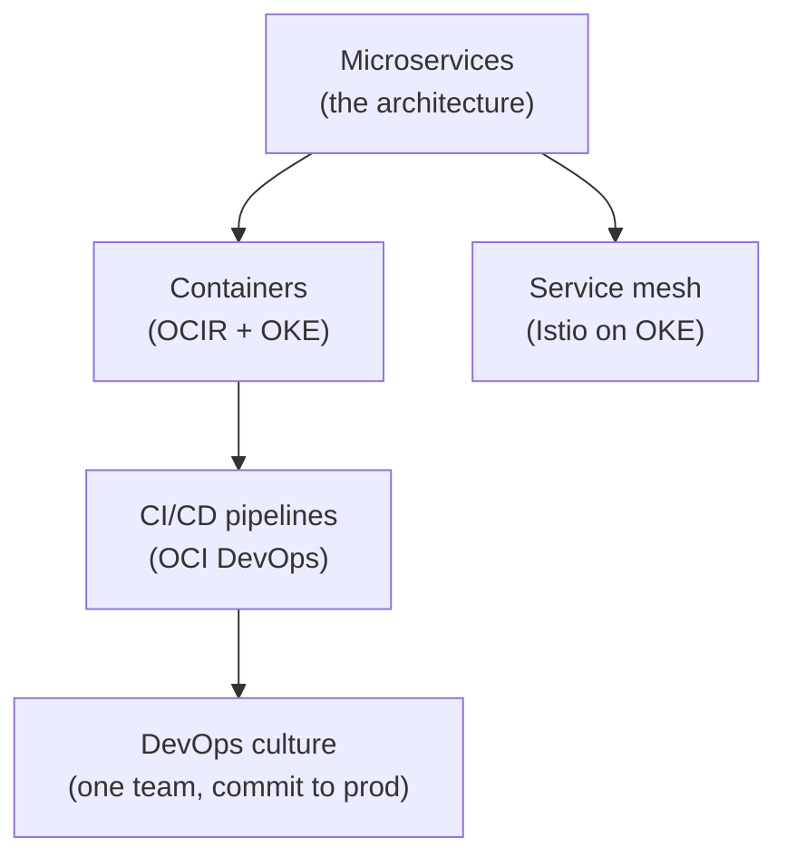
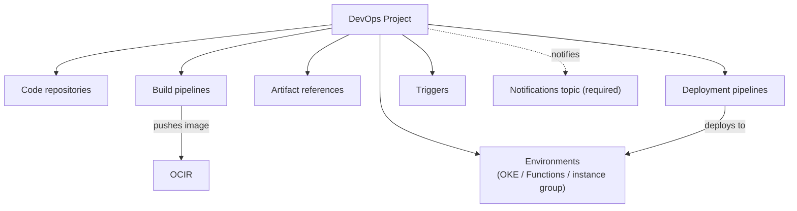
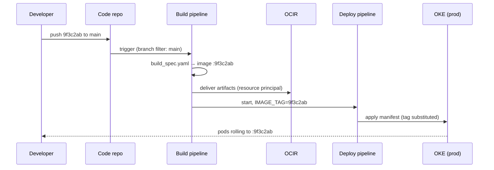

# Cloud Native Fundamentals: The Pillars, and How OCI Implements Them

**Cloud-native** does not mean "runs in the cloud" — a lift-and-shifted monolith on a compute instance is in the cloud and is not cloud-native. Cloud-native is a way of *building and operating* applications: small independently deployable services, packaged as containers, delivered through automated pipelines, and designed to tolerate the failure of any single part. This lesson anchors the five pillars behind that definition, then goes deep on the piece that is genuinely Oracle-specific — the **Oracle Cloud Infrastructure (OCI) DevOps service** and **Code Editor** — because that is where the exam questions live.

---

## Contents

1. [The Five Pillars, and Where They Live on OCI](#1-the-five-pillars-and-where-they-live-on-oci)
2. [Microservice Architecture](#2-microservice-architecture)
3. [The Twelve-Factor Methodology](#3-the-twelve-factor-methodology)
4. [The OCI DevOps Service](#4-the-oci-devops-service)
5. [Worked Walkthrough: One Commit to OKE](#5-worked-walkthrough-one-commit-to-oke)
6. [OCI Code Editor](#6-oci-code-editor)
7. [Practical Limits and Trade-offs](#7-practical-limits-and-trade-offs)
8. [Summary](#8-summary)

---

## 1. The Five Pillars, and Where They Live on OCI

### 1.1 How the pillars interlock

Oracle's course names five pillars of cloud-native development: **microservices**, **containers**, **DevOps**, **Continuous Integration / Continuous Delivery (CI/CD)**, and **service mesh**. You already know each individually; the exam-relevant framing is that they are not five separate choices but one dependency chain.

Microservices create the *need*: once an application is split into many small services, you have many things to package, deploy, and connect. Containers answer the packaging problem — one immutable, portable unit per service. CI/CD answers the deployment problem — you cannot hand-release thirty services, so pipelines must do it. DevOps is the operating culture that makes one team own a service from commit to production, and a service mesh answers the connection problem — securing and observing traffic *between* services without writing that logic into each one.

### 1.2 The OCI service map

Each pillar maps to a named OCI service, and each of those services is a later module in this track. This table is effectively the track's map.

| Pillar | OCI implementation | Covered in |
| :--- | :--- | :--- |
| Microservices | An architecture, not a service — hosted on OKE or Functions | This lesson, `03`, `04` |
| Containers | **OCI Container Registry (OCIR)** for images, **OCI Kubernetes Engine (OKE)** for running them | `02`, `03` |
| DevOps + CI/CD | **OCI DevOps service** (repos, build pipelines, deployment pipelines), OCI Code Editor | This lesson |
| Inter-service messaging | OCI Streaming, Queue, Events | `06`–`08` |
| Service mesh | Istio on OKE — **OCI Service Mesh, the managed offering, is retired** (see Practical Limits) | `03` touches it |



*The pillars as a dependency chain: microservices create the packaging, delivery, and connectivity problems the other pillars solve.*

> Note: The managed **OCI Service Mesh** product reached end of life on May 31, 2025. Older course material still names it as the fifth pillar's implementation; if an exam question offers it against Istio on OKE, the current answer is Istio. The *concept* of a mesh — sidecar proxies handling mutual TLS, retries, and traffic splitting between services — is unchanged.

---

## 2. Microservice Architecture

### 2.1 The monolith contrast — and when microservices lose

Section 1 framed microservices as the pillar that *creates* the problems the other four solve; this section unpacks what that pillar actually is, and when it is worth its cost. A **monolith** deploys as one unit: one codebase, one release, one database. Its failure mode is coupling — every team queues behind one release train, and scaling means cloning the whole application even if only one hot path needs it. A **microservice architecture** splits the application into services that each own a single business capability, deploy independently, and communicate only over network contracts (HTTP APIs or messages).

The gain is independent deployability and independent scaling; the cost is that every function call you used to make in-process becomes a network call that can fail, be slow, or arrive twice. Microservices trade *code complexity* for *operational complexity* — which is why the pillars above exist, and why a small team with one product is often better served by a well-structured monolith. That framing — "when would you *not* choose microservices" — is a recurring exam angle.

### 2.2 Design methodology

The design method the course teaches is decomposition by **business capability** (equivalently, one **bounded context** per service): each service owns one noun of the business — orders, payments, inventory — rather than one technical layer. Two rules follow from it, and both are exam bait:

- **Database per service.** Each service owns its data store; other services get to that data only through the owning service's API. A shared database silently re-couples services — two services joined at a table must now upgrade schemas together, which re-creates the monolith's release train.
- **Contract-first communication.** Services interact through explicit interfaces — synchronous REST/gRPC when the caller needs an answer now, asynchronous messages (via Streaming or Queue, modules `06`–`07`) when it doesn't. Asynchronous decoupling is what lets one service be down without cascading failure.

Think of the decomposition like a restaurant kitchen: stations (grill, pastry, sauces) each own their tools and ingredients and communicate by passing orders on tickets — not by reaching into each other's stations. A shared fridge every station rummages through is the shared database anti-pattern: the moment pastry reorganises the shelves, the grill station breaks.

In practice the move from a monolith is incremental, not a rewrite — the **strangler pattern**. Carve out one capability with clean seams (few callers, its own data), stand it up as a service with its own store, and route the monolith's callers through the new API; the monolith shrinks one capability at a time while both run side by side. Choosing a low-risk, well-bounded first service is the point: it proves the delivery pipeline and operational muscle before anything critical depends on them.

---

## 3. The Twelve-Factor Methodology

### 3.1 All twelve factors

The **twelve-factor methodology** (from 12factor.net, born at Heroku) is the course's checklist for what makes an application *behave well* on a cloud platform. The exam asks for individual factors by name, so all twelve are enumerated — with the OCI-flavoured reading of each.

| # | Factor | Rule | On OCI / cloud-native terms |
| :--- | :--- | :--- | :--- |
| I | Codebase | One codebase in version control, many deploys | One OCI DevOps code repository per service |
| II | Dependencies | Explicitly declare and isolate them | The container image carries everything; nothing assumed on the host |
| III | Config | Config lives in the environment, not the code | Env vars injected at deploy; secrets from OCI Vault (module `09`) |
| IV | Backing services | Treat them as attached resources, swappable via config | A database or queue is just a URL + credential in config |
| V | Build, release, run | Strictly separate the three stages | Build pipeline produces the image; deployment pipeline releases it |
| VI | Processes | Stateless processes; persist state in backing services | Any pod replica can serve any request; session state goes to a store |
| VII | Port binding | The app exports its service by binding a port | The container exposes a port; OKE Services route to it |
| VIII | Concurrency | Scale out via more processes, not a bigger one | More pod replicas, not a bigger VM |
| IX | Disposability | Fast startup, graceful shutdown | Pods are killed and rescheduled routinely; the app must not care |
| X | Dev/prod parity | Keep environments as similar as possible | The *same image* is deployed to every environment |
| XI | Logs | Treat logs as an event stream to stdout | Stdout scraped into OCI Logging (module `10`), never files the app manages |
| XII | Admin processes | Run one-off admin tasks in the same environment/image | A migration runs as a job from the same image, not from a laptop |

The methodology is a **building code** for applications: any unit built to code — wiring in conduits, standard fittings — can be inspected, repaired, or extended by any qualified crew without surprises. An app that follows the twelve factors can likewise be scheduled, restarted, scaled, and debugged by any platform crew, human or Kubernetes, because it behaves the standard way.

### 3.2 The load-bearing factors

All twelve matter, but four do the heavy lifting for everything later in this track, so check your understanding of these first. **Config (III)** and **backing services (IV)** are what let one image move through environments unchanged — which is also factor **X** in action. **Processes (VI)** — statelessness — is the precondition for horizontal scaling (VIII) and for disposability (IX): a pod can only be freely killed or duplicated if no request depends on *that* pod's memory. When a scenario question asks "why does this app break when OKE reschedules its pod," the answer is almost always a violated factor VI or IX.

> Nuance: "Config in the environment" does not mean *secrets* in plain environment variables are fine. The factor's point is separation — config out of the codebase. On OCI the secret half of config belongs in **OCI Vault**, and the DevOps build spec has a dedicated `vaultVariables` mechanism for exactly this (next section).

---

## 4. The OCI DevOps Service

The **OCI DevOps service** is Oracle's managed CI/CD product: source repositories, build pipelines, artifact handling, and deployment pipelines as native OCI resources. Because they are OCI resources, they get OCI's operational model for free — Identity and Access Management (IAM) policies control them, and pipelines authenticate to other services as *resources*, not as a human with stored passwords. This section is the deepest of the lesson because it is the module's real subject; the pillars above are context.

### 4.1 The resource model: a project as the umbrella

Everything in the DevOps service hangs off a **project** — the umbrella resource that groups one application's repositories, pipelines, artifact references, environments, and triggers. A project is like a binder for one deliverable: nothing inside it is shared by accident with another team's pipelines, and IAM policy can be scoped to the binder.



*The DevOps project as umbrella: repositories feed build pipelines, which feed artifacts, which deployment pipelines release into environments.*

Two prerequisites trip people up in practice and in exam questions, because neither exists in Jenkins-style tools:

- **A Notifications topic is required at project creation.** The project publishes pipeline events (build succeeded, deployment failed, approval waiting) to an Oracle Notifications Service (ONS) topic, and the console will not create the project without one. The topic alone delivers nothing — a **subscription** on it (email, Slack, a webhook) is what turns a published event into a message a human actually receives, so plan the subscriptions together with the topic.
- **Pipelines need a dynamic group and policies before they can do anything.** A build run authenticates as a *resource principal* — the pipeline itself is the identity. You put DevOps resources into a **dynamic group**, then write policies granting that group access to what the pipeline touches.

This snippet creates the project with the OCI Command Line Interface (CLI); note the topic is a creation-time argument, not an afterthought:

```bash
# The ONS topic must already exist — its OCID is mandatory at create time
oci devops project create \
  --compartment-id "$COMPARTMENT_OCID" \
  --name "orders-app" \
  --notification-config '{"topicId": "'"$TOPIC_OCID"'"}'
```

And these are the shape of the policies that let pipelines act (statements go in an IAM policy attached to the compartment):

```text
# Membership rule of the dynamic group: "all DevOps build/deploy resources in this compartment"
ALL {resource.type = 'devopsbuildpipeline', resource.compartment.id = '<compartment_ocid>'}

# Policy statements granting that group what the pipeline needs
Allow dynamic-group devops-dg to manage repos       in compartment orders   # push to OCIR
Allow dynamic-group devops-dg to read secret-family in compartment orders   # read Vault secrets
Allow dynamic-group devops-dg to manage cluster-family in compartment orders # deploy to OKE
```

> Nuance: When a pipeline fails with an authorization error, OCI often surfaces it as a **404 "not found"**, not a 403 — OCI hides resources the caller cannot see. A build that "can't find" OCIR or Vault is usually a missing dynamic-group policy, not a wrong OCID. This IAM-first debugging instinct is worth internalising for every OCI service in this track.

One scoping fact completes the model: a project and everything under it are **regional resources**. Delivering to a second region is a design decision, not a default — per-region pipelines plus images available in that region (registry replication is module `02` territory) — so a home-region outage takes your delivery system with it unless you designed otherwise.

### 4.2 Code repositories and external connections

A project can host **code repositories** — private Git repos native to OCI, cloned over HTTPS or SSH like any Git remote. Alternatively, an **external connection** attaches an existing GitHub or GitLab repository: you store a personal access token as a secret in **OCI Vault**, and the connection resource references that secret. That indirection is also the rotation story: rotate the token in Vault and the connection picks up the new value on next use — the connection itself never changes. The distinction matters for triggers (§4.7): native repos emit push events inside OCI directly, while external repos deliver them through the connection.

### 4.3 Pull requests on native code repositories

A **pull request (PR)** exists only on a native code repository — an external GitHub or GitLab connection (§4.2) keeps its own review flow on GitHub or GitLab itself, since OCI never owns that repository's data. A PR proposes merging a **source branch** into a **target branch**; it carries **reviewers**, inline and file-level **comments**, and a commit diff against the target. An author cannot approve their own PR — approval has to come from someone else on the reviewer list, and an approver can revoke their approval any time before the PR is actually merged.

What *gates* the merge is configured on the repository, not on the PR itself, and the two settings answer different questions. A **protected branch** rule on the target branch controls *how* changes may arrive — "pull request merge only" rejects any direct push, forcing every change through review. A **merge check** controls *what must be true* before a compliant PR is allowed to merge — a minimum reviewer-approval count, and optionally a **build status check**. That build check has nothing to validate unless a trigger (§4.7) is already wired to run a build pipeline on commits to the source branch: the PR feature reuses that ordinary push-triggered build rather than defining a separate PR-triggered one, which is why native repos still trigger on push only (§4.7) even though PRs are a native-repo-only feature.

```bash
# Reject direct pushes to main — every change must arrive through a reviewed, approved PR
oci devops protected-branch create-or-update \
  --repository-id "$REPO_OCID" \
  --branch-name "main" \
  --protection-levels '["PULL_REQUEST_MERGE_ONLY"]'
```

Merging a PR is, from the trigger's point of view, just another commit landing on the target branch — indistinguishable from any other push. That is what actually starts the deployment-bound build in the walkthrough (§5.1): the commit that reaches `main` in step 1 got there through a reviewed and approved PR, not a direct push.

### 4.4 Build pipelines and the `build_spec.yaml` contract

A **build pipeline** is an ordered set of stages; the central stage type, *managed build*, runs your commands on an Oracle-managed build runner — a fresh VM per run, so there is no runner fleet for you to patch or scale. The freshness cuts both ways: caches start cold, so every run re-pulls base images and dependencies — the price of never patching a runner is paying that download tax on every build. Because the runner is destroyed after the run, any cache living *on* it dies with it; mitigations move the cache somewhere that survives — slim base images, pre-baked dependency images pulled from OCIR, registry-backed layer caching. The same disposability is a security property: no state from one build can leak into, or poison, the next. What the runner executes is defined by a **`build_spec.yaml`** file, read from the repository root by default (an alternate path can be configured on the stage).

This is the contract in its verified shape — a realistic spec that builds an image and exports the tag for later stages:

```yaml
version: 0.1                      # current spec version
component: build
timeoutInSeconds: 1200
env:
  variables:
    REGISTRY: "iad.ocir.io/acme"  # non-secret config
  vaultVariables:
    API_KEY: "ocid1.vaultsecret.oc1..xyz"  # fetched from OCI Vault at run time
  exportedVariables:
    - IMAGE_TAG                   # values handed to later stages
steps:
  - type: Command
    name: "Build image"
    command: |
      IMAGE_TAG=$(git rev-parse --short HEAD)   # tag = short commit hash
      docker build -t "$REGISTRY/orders-service:$IMAGE_TAG" ${OCI_PRIMARY_SOURCE_DIR}
outputArtifacts:
  - name: orders_image
    type: DOCKER_IMAGE
    location: ${REGISTRY}/orders-service:${IMAGE_TAG}
```

Three mechanisms in that file carry most of the exam weight. **`vaultVariables`** resolves a Vault secret OCID into an environment variable at run time — secrets never sit in the spec (factor III done right). Resolution happens once, when the run starts: a secret rotated mid-run does not affect an in-flight build and takes effect from the next one. **`exportedVariables`** is the baton in the relay: a value computed in the build (here, the image tag) that later stages and even the deployment pipeline can reference. **`outputArtifacts`** names what the build produced so a subsequent *deliver artifacts* stage can push it to a registry.

### 4.5 Artifacts: the bridge from build to deploy

A build's output does not flow to deployment by magic; the bridge is an explicit **artifact** resource in the project. An artifact is a *pointer with placeholders* — for a container image, the OCIR path; for a Kubernetes manifest, an Object Storage or inline manifest — and its path may contain `${...}` placeholders that are substituted from pipeline variables at run time:

```bash
# Register the image artifact; ${IMAGE_TAG} is filled from the build's exported variable
oci devops deploy-artifact create \
  --project-id "$PROJECT_OCID" \
  --display-name "orders-image" \
  --deploy-artifact-type DOCKER_IMAGE \
  --deploy-artifact-source '{
      "deployArtifactSourceType": "OCIR",
      "imageUri": "iad.ocir.io/acme/orders-service:${IMAGE_TAG}"
    }' \
  --argument-substitution-mode SUBSTITUTE_PLACEHOLDERS
```

The *deliver artifacts* stage in the build pipeline maps the build's `outputArtifacts` (by name) onto these artifact resources — that mapping is the connecting artifact between the two pipelines. If a deployment deploys an old image forever, the classic cause is a delivery stage mapping to a fixed tag instead of a substituted one. (The anatomy of the registry path itself — region key, tenancy namespace, repository — is unpacked in module `02`.)

### 4.6 Deployment pipelines: environments, targets, strategies

A **deployment pipeline** releases delivered artifacts into an **environment** — a project resource that points at a real target: an OKE cluster, a Functions application, or a compute **instance group**. An instance group is the non-container target: a set of plain compute VMs the pipeline deploys onto directly, by running a deployment-configuration script on each host (download the package from the artifact registry, install, restart) with a rollout paced by percentage or count of instances. Choose OKE when the workload is containerized; choose an instance group when the application runs directly on VMs — a legacy or not-yet-containerized app you still want inside the same automated delivery flow.

The strategy taxonomy — and when to choose which — is a core exam topic:

| Strategy | Mechanic | Choose it when | Cost you accept |
| :--- | :--- | :--- | :--- |
| **Rolling** | Replace instances/pods of the old version incrementally in place | Default; routine releases where brief version coexistence is fine | Rollback = roll forward again; no isolated validation |
| **Blue-green** | Deploy the new version to an idle *standby* environment, validate, then switch all traffic at once | Releases needing instant, total rollback (switch traffic back) | Double capacity while both environments run |
| **Canary** | Deploy to a *canary* environment with no traffic, validate, then shift a subset of user traffic before full promotion | Risky changes you want real-traffic evidence on before full exposure | Slower rollout; two live versions serving users simultaneously |

Blue-green is running two identical theatre stages: the audience watches one while the crew dresses the other, and "release" is rotating the audience's seating — instantly reversible, but you pay for two stages. Canary sends a few audience members to the new stage first and watches their reaction. As of July 2026, blue-green and canary are supported for **OKE and instance-group** targets; other targets use rolling (see Practical Limits).

On an OKE target the strategy has a concrete shape worth knowing for the exam: blue and green are **two namespaces you pre-create** in the cluster, and your manifests must *not* name a namespace — the pipeline injects the target one at deploy time. The traffic switch is an ingress update: the DevOps service modifies the annotation on your application's **NGINX ingress resource**, flipping 100% of traffic between the namespaces — which is why an NGINX ingress controller is a hard prerequisite for the strategy, in two stage types: a blue-green *deploy* stage (into the standby namespace) and a blue-green *traffic shift* stage (the flip). The pipeline owns both namespaces: anything applied to them out-of-band (a hand-run `kubectl apply` into standby) is overwritten by the next deploy — drift correction by construction, so route every change through the pipeline.

Control stages complete the pipeline vocabulary. An **approval** stage inserts a human gate — use it where a release crosses a compliance or business boundary; it can require multiple approvals, a single rejection fails the stage and stops the run, and an unanswered request eventually times out and fails the deployment (figure in Practical Limits). A **wait** stage inserts a fixed bake period — use it after a canary traffic shift to let metrics accumulate before promotion. A factor-XII admin task such as a schema migration rides this same flow: run it as a pipeline stage using the same built image, ordered before the rollout stage — never as a hand-run script outside the pipeline.

Schema changes are also where blue-green's promise needs honesty: traffic can switch back instantly, but the database cannot un-migrate. Rollback stays real only while both versions tolerate the current schema — the **expand/contract** discipline (add columns and write both in one release; remove the old shape only releases later) is what keeps it true.

### 4.7 Triggers: closing the loop

A **trigger** starts a build pipeline on a source event, and the event set is *source-gated* — an exam-relevant asymmetry. A native OCI code repository can trigger on **push only**; external sources attached through a connection (GitHub, GitLab, Bitbucket Cloud) can additionally trigger on **pull-request events** (created, updated, merged). Push triggers can filter on branch and on file paths (include/exclude globs); file filters apply to push events only. And the set is *only* events — there is no native cron: a nightly rebuild needs an external clock invoking the pipeline through the CLI or API. The trigger is what turns the pieces above from "pipelines you run by hand" into continuous delivery: commit → trigger → build → deliver → deploy, with no human in the path except stages you deliberately gate with approvals.

Since pipelines are ordinary OCI resources, they can themselves be defined as code — here the trigger in Terraform (OCI provider), closing the loop on factor I for the pipeline itself:

```hcl
# Simplified — start the orders build pipeline on any push to main
resource "oci_devops_trigger" "on_push" {
  project_id     = oci_devops_project.orders.id
  trigger_source = "DEVOPS_CODE_REPOSITORY"
  repository_id  = oci_devops_repository.orders.id  # required for this source type
  actions {
    type              = "TRIGGER_BUILD_PIPELINE"
    build_pipeline_id = oci_devops_build_pipeline.orders_build.id
    filter {
      trigger_source = "DEVOPS_CODE_REPOSITORY"
      events         = ["PUSH"]
      include {
        head_ref = "main"       # branch filter
      }
    }
  }
}
```

---

## 5. Worked Walkthrough: One Commit to OKE

### 5.1 The trace

One concrete release, end to end. The service is `orders-service`; a developer merges commit `9f3c2ab` to `main`. Follow the identifier: the *commit hash becomes the image tag becomes the manifest's image reference* — one value threading every stage.

1. **Push.** Commit `9f3c2ab` lands on `main` in the project's code repository. The repository emits a push event.
2. **Trigger.** A trigger filtered to `main` matches the event and starts build pipeline `orders-build`. No artifact is produced by this step — it only starts the run.
3. **Managed build.** A fresh Oracle-managed runner clones the repo at `9f3c2ab` and executes `build_spec.yaml` (§4.4). The step computes `IMAGE_TAG=9f3c2ab` and builds the image `iad.ocir.io/acme/orders-service:9f3c2ab`. `IMAGE_TAG` is exported.
4. **Deliver artifacts.** The stage maps output artifact `orders_image` to the project's `orders-image` artifact resource and pushes the image to OCIR — authenticated by the resource principal from §4.1's dynamic group, not by a stored password.
5. **Deployment pipeline starts.** `orders-deploy` receives the pipeline parameters, including `IMAGE_TAG=9f3c2ab`.
6. **Manifest substitution.** The pipeline's Kubernetes-manifest artifact contains a placeholder; substitution resolves it to the exact image built in step 3:

   ```yaml
   # Deployment manifest artifact — ${IMAGE_TAG} substituted at deploy time
   spec:
     containers:
       - name: orders
         image: iad.ocir.io/acme/orders-service:${IMAGE_TAG}
   ```

7. **Rolling deploy to OKE.** The OKE environment applies the substituted manifest to namespace `prod`; Kubernetes rolls pods to `orders-service:9f3c2ab` incrementally.
8. **Notify.** Success is published to the project's ONS topic — the same topic wired at project creation in §4.1.



*One commit threading the whole system: the commit hash is the image tag is the deployed version.*

### 5.2 Why the hash threading matters

Tagging images with the commit hash rather than `latest` is what makes step 6 trustworthy: the running pods advertise exactly which source they were built from, and factor X (dev/prod parity) holds because *that same image* can be promoted to any environment. Reverse the thread for debugging: a pod's image tag names the commit, the commit names the build run, and the build run names the pipeline events on the ONS topic — one identifier connects the incident back to the change.

---

## 6. OCI Code Editor

### 6.1 What it is

**Code Editor** is the browser-based editor built into the OCI Console, riding on **Cloud Shell**: it edits files in your Cloud Shell home directory and shares Cloud Shell's 30-plus pre-installed tools (the OCI CLI, Git, kubectl, language runtimes, the Fn CLI). Because it lives inside the Console session, it needs no local install, no API-key setup, and no network path to your tenancy — the session *is* in the tenancy.

Its genuine use cases are narrow and worth knowing precisely, because exam questions test "when is Code Editor the right answer": quick edits to a DevOps code repository or `build_spec.yaml` without a local clone, developing and deploying OCI Functions in-console (the Fn tooling is pre-installed), and running guided workshops where installing nothing is the point.

### 6.2 What it is not

Code Editor is not a hosted replacement for your local IDE. It inherits Cloud Shell's constraints: a small fixed home directory, session inactivity timeouts, and a maximum session length (figures in Practical Limits below) — fine for editing a build spec, wrong for an all-day development environment or long-running builds. The wrong mental model is "VS Code in the cloud with my tenancy attached"; the right one is "a scratch editor attached to my Cloud Shell home directory."

---

## 7. Practical Limits and Trade-offs

- **A DevOps project cannot exist without a Notifications topic**: the ONS topic is a required creation-time input ([docs](https://docs.oracle.com/en-us/iaas/Content/devops/using/create_project.htm), as of Jul 2026) — plan the topic and its subscriptions before the project, not after.
- **Pipelines are powerless until IAM says otherwise**: build and deploy runs act as resource principals through a dynamic group, and a missing policy typically surfaces as a 404 rather than a permission error ([docs](https://docs.oracle.com/iaas/devops/using/devops_iampolicies.htm), as of Jul 2026), so debug pipeline "not found" failures IAM-first.
- **The build spec is versioned and located by convention**: `version: 0.1` is the current spec revision and `build_spec.yaml` is read from the repository root unless the managed-build stage overrides the path ([docs](https://docs.oracle.com/en-us/iaas/Content/devops/using/build_specs.htm), as of Jul 2026) — a misplaced spec fails the run before any of your commands execute.
- **Advanced strategies are target-gated**: blue-green and canary deployments are available for OKE and compute instance-group targets, while other targets (e.g. Functions) release rolling-style ([docs](https://docs.oracle.com/en-us/iaas/Content/devops/using/deployment_pipelines.htm), as of Jul 2026) — an exam answer pairing canary with a Functions target is a trap.
- **Blue-green doubles your bill during the window**: the standby environment is full production capacity; instant rollback is bought with 2× infrastructure while both environments exist.
- **Blue-green on OKE has hard prerequisites**: two pre-created namespaces, manifests that do not name a namespace, and an NGINX ingress controller — the traffic switch is an annotation update on your ingress resource ([docs](https://docs.oracle.com/en-us/iaas/Content/devops/using/bgoke_deploy.htm), as of Jul 2026) — no NGINX ingress, no blue-green.
- **Instance-group deployments are host-gated**: the Compute Instance Run Command plugin must be enabled and running on every target VM, and only Oracle Linux and CentOS hosts are supported ([docs](https://docs.oracle.com/en-us/iaas/Content/devops/using/deploy_instancegroups.htm), as of Jul 2026) — an Ubuntu fleet cannot be an instance-group target.
- **Trigger events are source-gated**: OCI code repositories trigger on push only; pull-request events (created, updated, merged) require an external connection (GitHub, GitLab, Bitbucket Cloud), and file-path filters apply only to push events ([docs](https://docs.oracle.com/en-us/iaas/Content/devops/using/trigger_build.htm), as of Jul 2026).
- **No native schedules**: triggers fire on source events only — a cron-style nightly build needs an external clock invoking the pipeline via CLI/API ([docs](https://docs.oracle.com/en-us/iaas/Content/devops/using/trigger_build.htm), as of Jul 2026).
- **Approvals expire**: an approval stage can demand multiple approvals, one rejection stops the run, and an unanswered request fails the deployment after a default seven-day timeout ([docs](https://docs.oracle.com/en-us/iaas/Content/devops/using/approval_stage.htm), as of Jul 2026).
- **Rollback is a traffic promise, not a data promise**: blue-green switches traffic back instantly but cannot un-migrate a schema — expand/contract migration discipline is what keeps the rollback story true.
- **Cloud Shell (and therefore Code Editor) is deliberately small**: 5 GB fixed home directory that cannot be expanded, 60-minute inactivity timeout, 24-hour maximum session, and home-directory purge after ~6 months of non-use with 60 days' notice ([docs](https://docs.oracle.com/en-us/iaas/Content/API/Concepts/cloudshellintro.htm), as of Jul 2026) — treat it as a scratchpad, never as durable storage.
- **OCI Service Mesh is retired**: the managed mesh reached end of life on May 31, 2025 ([docs](https://docs.oracle.com/en-us/iaas/Content/ContEng/Tasks/contengservice-mesh-intro-topic.htm), as of Jul 2026); the mesh pillar on OCI now means running Istio (or similar) on OKE yourself.
- **Managed CI/CD is a trade, not a free lunch**: OCI DevOps removes runner patching, scaling, and credential storage (resource principals replace stored secrets), but offers a smaller plugin ecosystem than Jenkins or GitHub Actions — the price of the managed model is customisation ceiling, the reward is near-zero pipeline infrastructure to operate.

---

## 8. Summary

Cloud-native is an operating model, not a hosting location: microservices create many small deployable units, containers make them portable, CI/CD delivers them continuously, DevOps culture makes one team own each unit end to end, and a mesh manages the traffic between them. The twelve-factor methodology is the per-application checklist that makes a service behave well under that model — stateless processes, config in the environment, logs to stdout — and most "why does this break on Kubernetes" scenarios resolve to a named factor.

On OCI, the pillar this module actually examines is the DevOps service. A project umbrellas repositories, build pipelines, artifacts, environments, deployment pipelines, and triggers; it requires a Notifications topic at birth and a dynamic group with policies before its pipelines can act. The build side is governed by the `build_spec.yaml` contract — vault variables for secrets, exported variables to hand values forward, output artifacts mapped to registry pushes. The deploy side releases those artifacts into OKE, Functions, or instance-group environments, with rolling as the default and blue-green or canary where instant rollback or real-traffic validation justifies their cost.

Code Editor rounds out the toolchain as the in-console scratch editor on top of Cloud Shell — right for build-spec edits and Functions workflows, wrong as a primary IDE. Keep the limits in mind rather than memorising them blindly: most of them exist to push real workloads onto real infrastructure, and the exam rewards knowing *why* a limit shapes a design, not just its number.
