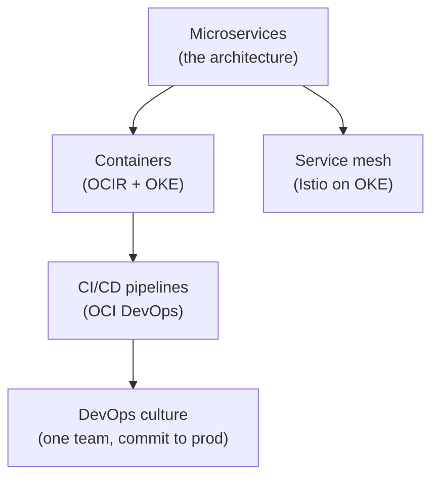
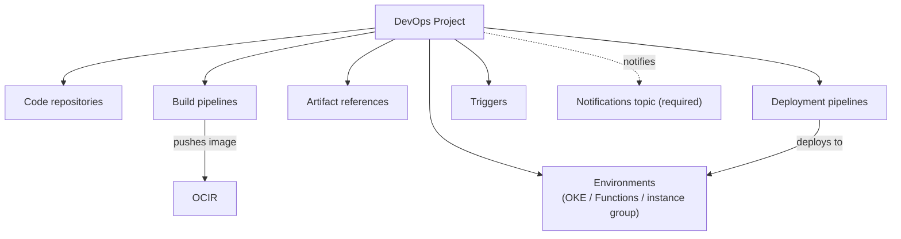
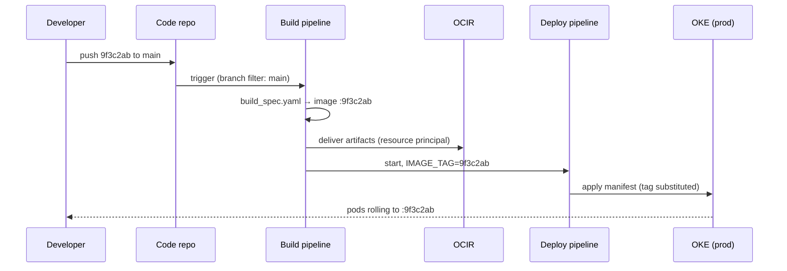

# Cloud Native Fundamentals: The Pillars, and How OCI Implements Them

**Cloud-native** means built and operated as small, independently deployable services — containerized, delivered through automated pipelines, tolerant of any single part failing. It does **not** mean "runs in the cloud": a lift-and-shifted monolith on a compute instance is in the cloud but not cloud-native. This lesson covers the five pillars behind that definition, then goes deep on the Oracle-specific piece: the **Oracle Cloud Infrastructure (OCI) DevOps service** and **Code Editor**.

---

## Contents

1. [The Five Pillars, and Where They Live on OCI](#1-the-five-pillars-and-where-they-live-on-oci)
2. [Microservice Architecture](#2-microservice-architecture)
3. [The OCI DevOps Service](#3-the-oci-devops-service)
4. [Worked Walkthrough: One Commit to OKE](#4-worked-walkthrough-one-commit-to-oke)
5. [OCI Code Editor](#5-oci-code-editor)
6. [Limits and Sources](#6-limits-and-sources)
7. [Summary](#7-summary)

---

## 1. The Five Pillars, and Where They Live on OCI

### 1.1 How the pillars interlock

**Five pillars, one dependency chain** — not five separate choices. Each solves a problem the one before it creates:

- **Microservices** split an app into many small services — creating the need to package, deploy, and connect them.
- **Containers** answer the packaging problem: one immutable, portable unit per service.
- **CI/CD** answers the deployment problem: pipelines replace hand-releasing dozens of services.
- **DevOps** is the operating culture — one team owns a service from commit to production.
- **Service mesh** answers the connection problem: securing and observing traffic *between* services without coding that logic into each one.

### 1.2 The OCI service map

**Each pillar maps to a named OCI service** — this table is the track's map:

| Pillar | OCI implementation | Covered in |
| :--- | :--- | :--- |
| Microservices | An architecture, not a service — hosted on OKE or Functions | This lesson, `03`, `04` |
| Containers | **OCI Container Registry (OCIR)** for images, **OCI Kubernetes Engine (OKE)** for running them | `02`, `03` |
| DevOps + CI/CD | **OCI DevOps service** (repos, build pipelines, deployment pipelines), OCI Code Editor | This lesson |
| Inter-service messaging | OCI Streaming, Queue, Events | `06`–`08` |
| Service mesh | Istio on OKE — **OCI Service Mesh, the managed offering, is retired** (see Limits and Sources) | `03` touches it |



*The pillars as a dependency chain: microservices create the packaging, delivery, and connectivity problems the other pillars solve.*

> Note: The managed **OCI Service Mesh** product reached end of life on May 31, 2025. Older course material still names it as the fifth pillar's implementation; where you see it presented as an alternative to Istio on OKE, Istio is the current answer.

### 1.3 Cloud-native, cloud-enabled, and cloud-based: three points on one spectrum

**Three tiers on one spectrum, and the middle one is easy to miss** — cloud-based, cloud-enabled, and cloud-native describe how far an application has actually moved, not where it runs:

| Tier | Architecture | Concrete OCI move | What it buys you |
| :--- | :--- | :--- | :--- |
| Cloud-based | Unchanged monolith | Lift-and-shift onto an OCI Compute instance | Off your own hardware; nothing else changes |
| Cloud-enabled | Unchanged monolith, one or two dependencies swapped for a managed service | Config moves to OCI Vault; file storage moves to Object Storage | A managed dependency or two; still one release train |
| Cloud-native | Independently deployable services | Containers on OCIR/OKE/Functions, delivered by OCI DevOps | Independent deployability and scaling — this lesson's actual subject |

> Note: "We moved it to OCI" alone answers nothing — the same VM lift-and-shift is cloud-based whether it sits on OCI, another cloud, or on-prem virtualization. A description mentioning no containers, independent services, or automated pipelines names the cloud-based tier, not cloud-native.

### 1.4 Benefits and challenges of cloud-native development

**Benefits** — the payoff for paying the pillars' cost:

- **Elasticity**: scale a single busy service, not the whole application — modules `03`–`04` quantify this per service.
- **Independent release cadence**: ship one service without a coordinated release of everything else.
- **Fault isolation**: one service failing doesn't necessarily take the rest down with it.

**Challenges** — the same operational trade-off individual microservices carry on their own (see Microservice Architecture, next), widened once DevOps and CI/CD enter:

- **Distributed-systems complexity**: a function call becomes a network call that can fail, be slow, or arrive twice.
- **Operational surface area**: a registry, a cluster, build and deployment pipelines — each pillar is one more real thing to run, patch, and secure.
- **Organizational cost**: a team needs working knowledge of containers, Kubernetes, and IAM before the architecture pays for itself.

---

## 2. Microservice Architecture

### 2.1 The monolith contrast — and when microservices lose

**Microservices trade code complexity for operational complexity.** A monolith deploys as one codebase, one release, and one database — a single unit with a single failure mode: coupling. Every team queues behind one release train, and scaling means cloning the whole application even when only one hot path needs the capacity.

A microservice architecture splits the application into services that each own a single business capability, deploy independently, and communicate only over network contracts — HTTP APIs or messages.

- **Gain**: independent deployability and independent scaling.
- **Cost**: every function call you used to make in-process becomes a network call that can fail, be slow, or arrive twice.
- **Choose a monolith instead when**: a small team ships one product — the pillars' overhead isn't worth paying yet.

### 2.2 Design methodology

**Decomposition rule: one business capability (bounded context) per service** — orders, payments, inventory, not technical layers. Two rules follow:

- **Database per service.** Each service owns its data store. Other services reach that data only through the owning service's API, never a direct query against its tables. A shared database silently re-couples two services: they must now upgrade schemas together, recreating the monolith's release train.
- **Contract-first communication.** Use synchronous REST or gRPC when the caller needs an answer immediately. Use asynchronous messages — OCI Streaming or Queue, modules `06`–`07` — when it doesn't; that asynchronous decoupling is what lets one service go down without cascading failure.

### 2.3 Migration path: the strangler pattern

**The strangler pattern replaces a monolith one capability at a time, with both systems serving live traffic throughout.** The name describes the mechanic: new services grow around the monolith the way a strangler fig grows around a host tree, until the monolith has nothing left to serve.

Pick the first capability to extract against four tests — if it fails one, pick a different capability instead:

| Test | Why it matters |
| :--- | :--- |
| Few inbound callers | Fewer call sites to re-point when the cutover happens |
| Owns its own tables | No shared schema to untangle first |
| Low blast radius | A failed cutover doesn't stop revenue |
| Already has a clear API boundary | You are extracting an existing seam, not designing a new one |

Then three steps carry out the extraction:

1. Stand the capability up as its own service, with its own data store.
2. Put a **façade** in front of both systems — old and new callers alike now reach the capability through one address instead of the monolith directly.
3. Re-point the façade's route for that one capability from the monolith to the new service. Every other route keeps going to the monolith, unchanged.

**Step 2 is the load-bearing one.** Without a façade, there is no single place to switch traffic — rolling back means redeploying every caller instead of reverting one route. On OCI, a façade is typically an API Gateway deployment (module `05`) with one route per capability, sitting in front of both the monolith and the extracted services.

> ⚠️ If any caller still holds the monolith's own address instead of the façade's, the migration has two live entry points and no clean cutover — the façade only works as the *sole* entry point.

---

## 3. The OCI DevOps Service

**Oracle's managed CI/CD product** — source repositories, build pipelines, artifact handling, and deployment pipelines, all as native OCI resources. Being OCI resources, they inherit OCI's operational model for free: **Identity and Access Management (IAM)** policies control them. A pipeline authenticates to other services as a *resource*, not a human with stored passwords.

> Note: OCI DevOps removes runner patching, scaling, and credential storage — resource principals replace stored secrets. Its plugin ecosystem is smaller than Jenkins or GitHub Actions, though: the trade is a customisation ceiling for near-zero pipeline infrastructure to operate.

### 3.1 The twelve-factor checklist this service enforces

The **twelve-factor methodology** (from [12factor.net](https://12factor.net), born at Heroku) is a generic checklist for behaving well on any cloud platform — not an OCI concept on its own. It matters here because OCI DevOps's pipeline model assumes it: a service that violates statelessness or config-in-environment breaks in ways that look like OCI DevOps problems but are really the app's problem.

| # | Factor | Rule | What OCI DevOps does about it |
| :--- | :--- | :--- | :--- |
| I | Codebase | One codebase, many deploys | One OCI DevOps code repository per service |
| II | Dependencies | Declare and isolate them | The container image carries everything; nothing assumed on the host |
| III | Config | Config in the environment, not the code | Env vars injected at deploy; secrets from **OCI Vault** (module `09`) via `vaultVariables` |
| IV | Backing services | Swappable via config | A database or queue is a URL plus a credential in config |
| V | Build, release, run | Strictly separate the three | Build pipeline produces the image; deployment pipeline releases it |
| VI | Processes | Stateless; state goes to a backing service | Any pod replica can serve any request |
| VII | Port binding | Export the service via a bound port | OKE Services route to the container's port |
| VIII | Concurrency | Scale via more processes | More pod replicas, not a bigger VM |
| IX | Disposability | Fast startup, graceful shutdown | Pods are killed and rescheduled routinely |
| X | Dev/prod parity | Same artifact everywhere | The *same image* is deployed to every environment |
| XI | Logs | Event stream to stdout | Stdout scraped into **OCI Logging** (module `10`) |
| XII | Admin processes | Run in the same image | A migration runs as a pipeline stage (*Control stages*, below), not from a laptop |

> ⚠️ If a pod breaks every time OKE reschedules it, the cause is almost always a violated factor VI (statelessness) or IX (disposability) — check those two first.

> Note: "Config in the environment" does not mean secrets belong in plain environment variables. The separation is config *out of the codebase*; the secret half of that belongs in OCI Vault, and the `vaultVariables` mechanism (*Build pipelines*, below) is built for exactly this handoff.

### 3.2 The resource model: a project as the umbrella

**Everything hangs off a project** — the umbrella resource grouping one application's repositories, pipelines, artifact references, environments, and triggers, scoped under one IAM boundary.



*The DevOps project as umbrella: repositories feed build pipelines, which feed artifacts, which deployment pipelines release into environments.*

**Two prerequisites** trip people up in practice, because neither exists in Jenkins-style tools:

- **A Notifications topic is required at project creation** — the console won't create a project without one. The project publishes pipeline events (build succeeded, deployment failed, approval waiting) to an **Oracle Notifications Service (ONS)** topic. The topic alone delivers nothing, so add a **subscription** (email, Slack, or a webhook) to route events to a human.
- **Pipelines need a dynamic group and policies before they can do anything.** A build run authenticates as a *resource principal* — the pipeline itself is the identity. Put DevOps resources into a **dynamic group**, then write policies granting that group access to what the pipeline touches.

This snippet creates the project with the OCI Command Line Interface (CLI); the topic is a creation-time argument, not an afterthought:

```bash
# The ONS topic must already exist — its OCID is mandatory at create time
oci devops project create \
  --compartment-id "$COMPARTMENT_OCID" \
  --name "orders-app" \
  --notification-config '{"topicId": "'"$TOPIC_OCID"'"}'
```

And these are the shape of the policies that let pipelines act (statements go in an IAM policy attached to the compartment):

```text
# Membership rule of the dynamic group: "all DevOps build/deploy resources in this compartment"
ALL {resource.type = 'devopsbuildpipeline', resource.compartment.id = '<compartment_ocid>'}

# Policy statements granting that group what the pipeline needs
Allow dynamic-group devops-dg to manage repos       in compartment orders   # push to OCIR
Allow dynamic-group devops-dg to read secret-family in compartment orders   # read Vault secrets
Allow dynamic-group devops-dg to manage cluster-family in compartment orders # deploy to OKE
```

> ⚠️ A missing dynamic-group policy often surfaces as a **404 "not found"**, not a 403 — OCI hides resources the caller cannot see. A build that "can't find" OCIR or Vault is usually an IAM problem, not a wrong OCID. This IAM-first debugging instinct is worth internalising for every OCI service in this track.

- **Regional resource.** A project and everything under it lives in one region, so a second-region delivery path is a deliberate design decision, not a default. That means per-region pipelines plus replicated images (module `02` covers registry replication) — skip the design and a home-region outage takes your delivery system down with it.

### 3.3 Code repositories and external connections

- **Code repository (native)**: a private Git repo native to OCI, cloned over HTTPS or SSH like any Git remote.
- **External connection**: attaches an existing GitHub or GitLab repository. A personal access token is stored as a secret in **OCI Vault**, and the connection only references it. Rotating the token in Vault updates the connection automatically — the connection itself never changes.
- **Trigger difference** (see Triggers, below): native repos emit push events inside OCI directly; external repos deliver them through the connection.

### 3.4 Pull requests on native code repositories

**PRs exist only on native code repositories** — an external GitHub or GitLab connection keeps its own review flow on GitHub or GitLab itself, since OCI never owns that repository's data.

- A PR proposes merging a **source branch** into a **target branch**, carrying **reviewers**, inline and file-level **comments**, and a commit diff against the target.
- An author cannot approve their own PR — approval must come from someone else on the reviewer list. An approver can revoke their approval any time before the PR is merged.

**What gates the merge** (configured on the repository, not the PR itself):

- **Protected branch** rule — controls *how* changes may arrive. "Pull request merge only" rejects any direct push, forcing every change through review.
- **Merge check** — controls *what must be true* before a compliant PR can merge: a minimum reviewer-approval count, and optionally a **build status check**.

> Note: The build status check has nothing to validate unless a trigger (see Triggers, below) is already wired to run a build pipeline on commits to the source branch. The PR feature reuses that ordinary push-triggered build rather than defining a separate PR-triggered one. That is also why native repos still trigger on push only, even though PRs are a native-repo-only feature.

```bash
# Reject direct pushes to main — every change must arrive through a reviewed, approved PR
oci devops protected-branch create-or-update \
  --repository-id "$REPO_OCID" \
  --branch-name "main" \
  --protection-levels '["PULL_REQUEST_MERGE_ONLY"]'
```

- **Merging is just a push, from the trigger's point of view** — indistinguishable from any other commit landing on the target branch. That is what starts the deployment-bound build in the worked walkthrough below.

### 3.5 Build pipelines and the `build_spec.yaml` contract

**A build pipeline is an ordered set of stages.** The central stage type, *managed build*, runs your commands on a fresh Oracle-managed build runner per run — no runner fleet for you to patch or scale.

- **Cost of freshness**: caches start cold every run, re-pulling base images and dependencies — the price of never patching a runner is paying that download tax every build.
- **Mitigation**: move the cache off the runner instead — slim base images, pre-baked dependency images pulled from OCIR, or registry-backed layer caching.
- **Security upside**: the same disposability means no state from one build can leak into, or poison, the next.

What the runner executes is defined by a **`build_spec.yaml`** file, read from the repository root by default (an alternate path can be configured on the stage):

```yaml
version: 0.1                      # current spec version
component: build
timeoutInSeconds: 1200
env:
  variables:
    REGISTRY: "iad.ocir.io/acme"  # non-secret config
  vaultVariables:
    API_KEY: "ocid1.vaultsecret.oc1..xyz"  # fetched from OCI Vault at run time
  exportedVariables:
    - IMAGE_TAG                   # values handed to later stages
steps:
  - type: Command
    name: "Build image"
    command: |
      IMAGE_TAG=$(git rev-parse --short HEAD)   # tag = short commit hash
      docker build -t "$REGISTRY/orders-service:$IMAGE_TAG" ${OCI_PRIMARY_SOURCE_DIR}
outputArtifacts:
  - name: orders_image
    type: DOCKER_IMAGE
    location: ${REGISTRY}/orders-service:${IMAGE_TAG}
```

**Three mechanisms in that file matter most:**

- **`vaultVariables`** — resolves a Vault secret OCID into an environment variable at run time; secrets never sit in the spec (factor III done right). Resolved once, at run start — a secret rotated mid-run doesn't affect an in-flight build.
- **`exportedVariables`** — the baton passed forward: a value computed in the build (here, the image tag) that later stages, and even the deployment pipeline, can reference.
- **`outputArtifacts`** — names what the build produced, so a subsequent *deliver artifacts* stage can push it to a registry.

### 3.6 Artifacts: the bridge from build to deploy

**The bridge from build to deploy is an explicit artifact resource** in the project — a *pointer with placeholders*. For a container image that pointer is the OCIR path; for a Kubernetes manifest, it's an Object Storage location or an inline manifest. The path may contain `${...}` placeholders, substituted from pipeline variables at run time:

```bash
# Register the image artifact; ${IMAGE_TAG} is filled from the build's exported variable
oci devops deploy-artifact create \
  --project-id "$PROJECT_OCID" \
  --display-name "orders-image" \
  --deploy-artifact-type DOCKER_IMAGE \
  --deploy-artifact-source '{
      "deployArtifactSourceType": "OCIR",
      "imageUri": "iad.ocir.io/acme/orders-service:${IMAGE_TAG}"
    }' \
  --argument-substitution-mode SUBSTITUTE_PLACEHOLDERS
```

- The *deliver artifacts* stage in the build pipeline maps the build's `outputArtifacts` (by name) onto these artifact resources — that mapping is the connecting link between the two pipelines.
- **Common failure**: a delivery stage mapped to a fixed tag instead of a substituted one deploys the same old image forever.
- (Registry path anatomy — region key, tenancy namespace, repository — is unpacked in module `02`.)

### 3.7 Deployment pipelines: environments, targets, strategies

**A deployment pipeline releases delivered artifacts into an environment** — a project resource pointing at a real target: an OKE cluster, a Functions application, or a compute **instance group**.

**Instance group** (the non-container target) is a set of plain compute VMs the pipeline deploys onto directly. Each host runs a deployment-configuration script — download the package, install it, restart the service. Rollout is paced by a percentage or count of instances at a time.

- **Choose OKE** when the workload is containerized; **choose an instance group** for a legacy or not-yet-containerized app you still want inside the same automated delivery flow.

**Strategy taxonomy** — and when to choose which:

| Strategy | Mechanic | Choose it when | Cost you accept |
| :--- | :--- | :--- | :--- |
| **Rolling** | Replace instances/pods of the old version incrementally in place | Default; routine releases where brief version coexistence is fine | Rollback = roll forward again; no isolated validation |
| **Blue-green** | Deploy the new version to an idle *standby* environment, validate, then switch all traffic at once | Releases needing instant, total rollback (switch traffic back) | Double capacity while both environments run |
| **Canary** | Deploy to a *canary* environment with no traffic, validate, then shift a subset of user traffic before full promotion | Risky changes you want real-traffic evidence on before full exposure | Slower rollout; two live versions serving users simultaneously |

Blue-green and canary are not available on every target — see the Limits and Sources table for exactly which ones.

> Note: Blue-green's standby environment is full production capacity — budget 2× infrastructure while both environments exist. That is the price of instant rollback.

**Blue-green on OKE — concrete mechanics:**

- Blue and green are **two namespaces you pre-create** in the cluster; your manifests must *not* name a namespace — the pipeline injects the target one at deploy time.
- The traffic switch is an ingress annotation update on your application's **NGINX ingress resource**, moving 100% of traffic from one namespace to the other in one step.
- Two stage types carry the mechanic: a blue-green *deploy* stage (into the standby namespace) and a blue-green *traffic shift* stage (the flip).
- The pipeline owns both namespaces — anything applied out-of-band (a hand-run `kubectl apply` into standby) is overwritten by the next deploy. That's drift correction by construction: route every change through the pipeline.

> ⚠️ An NGINX ingress controller is a hard prerequisite for this strategy — no NGINX ingress, no blue-green.

**Control stages:**

- **Approval** — a human gate; use it where a release crosses a compliance or business boundary. Can require multiple approvals; a single rejection fails the stage and stops the run.
- **Wait** — a fixed bake period; use it after a canary traffic shift to let metrics accumulate before promotion.
- **Admin task** (factor XII, e.g. a schema migration) runs as a pipeline stage using the same built image, ordered before the rollout stage — never as a hand-run script outside the pipeline.

> ⚠️ An unanswered approval request eventually times out and fails the deployment (see Limits and Sources for the default window).

> Note: Blue-green's rollback promise is a *traffic* promise, not a *data* promise — the database cannot un-migrate. Rollback stays real only while both versions can tolerate the current schema. That's the **expand/contract** discipline: add new columns and write to both shapes in one release, then remove the old shape only in a later release once nothing depends on it.

### 3.8 Triggers: closing the loop

**A trigger starts a build pipeline on a source event** — and which events it can react to is source-gated:

- **Native OCI repo**: push only.
- **External connection** (GitHub, GitLab, Bitbucket Cloud): push, plus pull-request events (created, updated, merged).
- **Push triggers** can filter on branch and on file paths (include/exclude globs) — file filters apply to push events only.

> ⚠️ No native cron — triggers fire on source events only. A nightly rebuild needs an external clock invoking the pipeline through the CLI or API.

This is what turns pipelines you'd otherwise run by hand into continuous delivery: commit → trigger → build → deliver → deploy, with no human in the path except stages you deliberately gate with approvals.

Pipelines are ordinary OCI resources, so they can be defined as code too — here the trigger in Terraform (OCI provider), closing the loop on factor I for the pipeline itself:

```hcl
# Simplified — start the orders build pipeline on any push to main
resource "oci_devops_trigger" "on_push" {
  project_id     = oci_devops_project.orders.id
  trigger_source = "DEVOPS_CODE_REPOSITORY"
  repository_id  = oci_devops_repository.orders.id  # required for this source type
  actions {
    type              = "TRIGGER_BUILD_PIPELINE"
    build_pipeline_id = oci_devops_build_pipeline.orders_build.id
    filter {
      trigger_source = "DEVOPS_CODE_REPOSITORY"
      events         = ["PUSH"]
      include {
        head_ref = "main"       # branch filter
      }
    }
  }
}
```

---

## 4. Worked Walkthrough: One Commit to OKE

### 4.1 The trace

One concrete release, end to end. The service is `orders-service`; a developer merges commit `9f3c2ab` to `main`. Follow the identifier: the *commit hash becomes the image tag becomes the manifest's image reference* — one value threading every stage.

1. **Push.** Commit `9f3c2ab` lands on `main` in the project's code repository. The repository emits a push event.
2. **Trigger.** A trigger filtered to `main` matches the event and starts build pipeline `orders-build`. No artifact is produced by this step — it only starts the run.
3. **Managed build.** A fresh Oracle-managed runner clones the repo at `9f3c2ab` and executes `build_spec.yaml` (the contract described above). The step computes `IMAGE_TAG=9f3c2ab` and builds the image `iad.ocir.io/acme/orders-service:9f3c2ab`. `IMAGE_TAG` is exported.
4. **Deliver artifacts.** The stage maps output artifact `orders_image` to the project's `orders-image` artifact resource and pushes the image to OCIR — authenticated by the resource principal from the project's dynamic group (described above), not by a stored password.
5. **Deployment pipeline starts.** `orders-deploy` receives the pipeline parameters, including `IMAGE_TAG=9f3c2ab`.
6. **Manifest substitution.** The pipeline's Kubernetes-manifest artifact contains a placeholder; substitution resolves it to the exact image built in step 3:

   ```yaml
   # Deployment manifest artifact — ${IMAGE_TAG} substituted at deploy time
   spec:
     containers:
       - name: orders
         image: iad.ocir.io/acme/orders-service:${IMAGE_TAG}
   ```

7. **Rolling deploy to OKE.** The OKE environment applies the substituted manifest to namespace `prod`; Kubernetes rolls pods to `orders-service:9f3c2ab` incrementally.
8. **Notify.** Success is published to the project's ONS topic — the same topic wired at project creation, described above.



*One commit threading the whole system: the commit hash is the image tag is the deployed version.*

### 4.2 Why the hash threading matters

- Tagging images with the commit hash, not `latest`, is what makes step 6 trustworthy: running pods advertise exactly which source built them. Factor X (dev/prod parity) holds for the same reason — *that same image* can be promoted to any environment unchanged.
- **Debugging in reverse**: a pod's image tag names the commit, the commit names the build run, and the build run names the pipeline events on the ONS topic — one identifier connects an incident back to the change.

---

## 5. OCI Code Editor

### 5.1 What it is

**Browser-based editor built into the OCI Console**, riding on **Cloud Shell**: it edits files in your Cloud Shell home directory and shares Cloud Shell's 30-plus pre-installed tools (the OCI CLI, Git, kubectl, language runtimes, the Fn CLI). Because it lives inside the Console session, it needs no local install, no API-key setup, and no network path to your tenancy — the session *is* in the tenancy.

**Genuine use cases:**

- Quick edits to a DevOps code repository or `build_spec.yaml` without a local clone.
- Developing and deploying OCI Functions in-console (the Fn tooling is pre-installed).
- Running guided workshops where installing nothing is the point.

### 5.2 What it is not

**Not a hosted replacement for your local IDE.** It inherits Cloud Shell's constraints: a small fixed home directory, session inactivity timeouts, and a maximum session length (see Limits and Sources). That's fine for editing a build spec, wrong for an all-day development environment or long-running builds.

> Note: The wrong mental model is "VS Code in the cloud with my tenancy attached." The right one is "a scratch editor attached to my Cloud Shell home directory."

---

## 6. Limits and Sources

Every volatile fact below is a **shape that survives the number changing** — what the limit forces you to do matters more than its exact figure. Re-verify by following the doc link when the as-of date is old.

| Limit | What it forces | As-of + docs |
| :--- | :--- | :--- |
| DevOps project requires an ONS Notifications topic at creation | Plan the topic and its subscriptions before creating the project | Jul 2026, [docs](https://docs.oracle.com/en-us/iaas/Content/devops/using/create_project.htm) |
| Missing dynamic-group policy often surfaces as a 404, not a 403 | Debug pipeline "not found" failures IAM-first | Jul 2026, [docs](https://docs.oracle.com/iaas/devops/using/devops_iampolicies.htm) |
| `build_spec.yaml` is read from the repo root; `version: 0.1` is current | A misplaced spec fails the run before any of your commands execute | Jul 2026, [docs](https://docs.oracle.com/en-us/iaas/Content/devops/using/build_specs.htm) |
| Blue-green/canary supported only on OKE and instance-group targets | Other targets (e.g. Functions) release rolling-style only | Jul 2026, [docs](https://docs.oracle.com/en-us/iaas/Content/devops/using/deployment_pipelines.htm) |
| Blue-green on OKE needs 2 pre-created namespaces + an NGINX ingress | No NGINX ingress controller, no blue-green | Jul 2026, [docs](https://docs.oracle.com/en-us/iaas/Content/devops/using/bgoke_deploy.htm) |
| Instance-group deploy needs the Compute Instance Run Command plugin; Oracle Linux/CentOS hosts only | An Ubuntu fleet cannot be an instance-group target | Jul 2026, [docs](https://docs.oracle.com/en-us/iaas/Content/devops/using/deploy_instancegroups.htm) |
| Native repos trigger on push only; PR events need an external connection | File-path filters apply to push events only | Jul 2026, [docs](https://docs.oracle.com/en-us/iaas/Content/devops/using/trigger_build.htm) |
| No native cron — triggers fire on source events only | A nightly build needs an external clock via CLI/API | Jul 2026, [docs](https://docs.oracle.com/en-us/iaas/Content/devops/using/trigger_build.htm) |
| Approval stage times out after a default 7-day window | An unanswered approval fails the deployment | Jul 2026, [docs](https://docs.oracle.com/en-us/iaas/Content/devops/using/approval_stage.htm) |
| Cloud Shell/Code Editor: 5 GB fixed home, 60-min inactivity timeout, 24-hr max session, ~6-month purge (60 days' notice) | Treat it as a scratchpad, never durable storage | Jul 2026, [docs](https://docs.oracle.com/en-us/iaas/Content/API/Concepts/cloudshellintro.htm) |
| Managed OCI Service Mesh reached end of life on May 31, 2025 | The mesh pillar now means running Istio (or similar) on OKE yourself | Jul 2026, [docs](https://docs.oracle.com/en-us/iaas/Content/ContEng/Tasks/contengservice-mesh-intro-topic.htm) |

---

## 7. Summary

Cloud-native is an operating model, not a hosting location: microservices, containers, CI/CD, DevOps culture, and a service mesh each solve the problem the previous one created. The twelve-factor methodology is the per-service discipline that makes this model work. OCI DevOps assumes a service already follows it.

OCI DevOps is this lesson's central subject: a **project** umbrellas repositories, build pipelines, artifacts, environments, and triggers, gated by a Notifications topic and a dynamic group with policies before anything can run. `build_spec.yaml` governs the build side; rolling, blue-green, and canary deployment strategies govern the release side, chosen by how much a release needs instant rollback or real-traffic validation.

**Code Editor** rounds out the toolchain as a Cloud Shell-based scratch editor — right for a quick edit, wrong as a primary IDE. The Limits table's *shapes*, not its numbers, are what's worth remembering.
