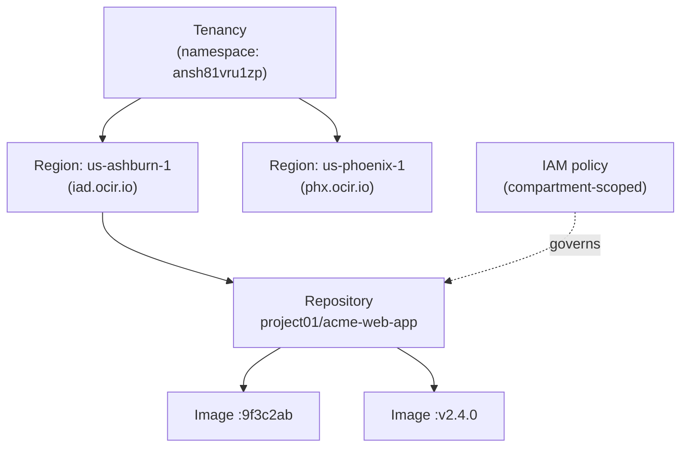
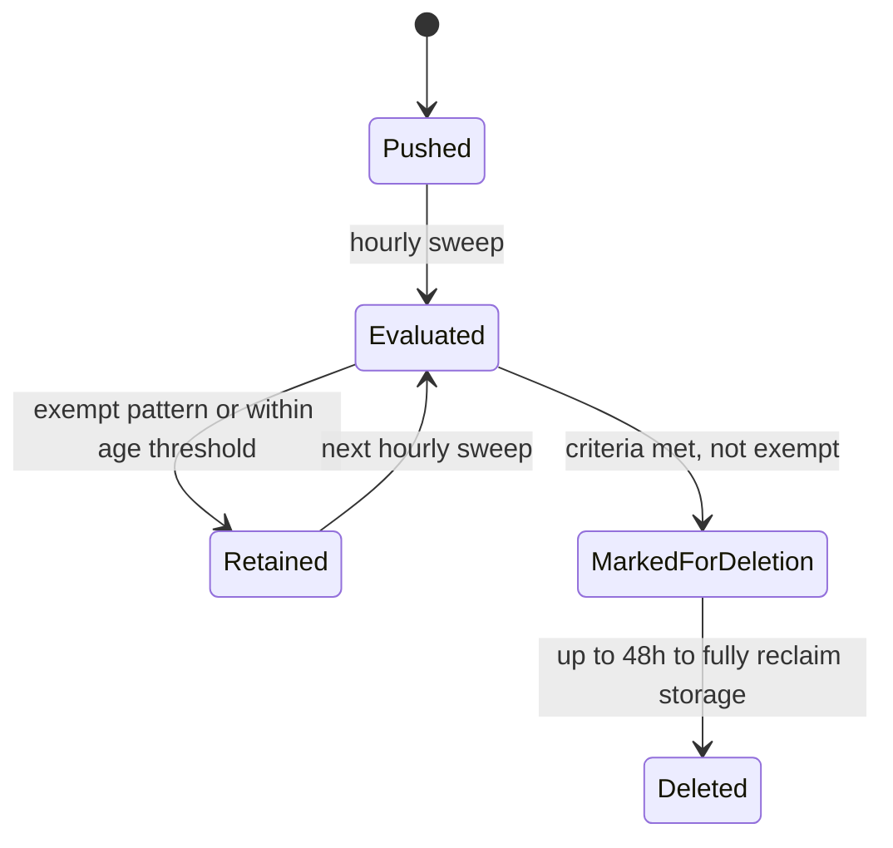
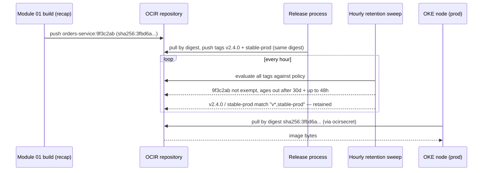

# Container-Based Application Development: The Image Supply Chain on OCI

A container image is portable by design — the same layered tarball runs on a laptop, a CI runner, or a production node, unmodified. What changes between those places is not the image but everything wrapped around it: who is allowed to push and pull it, whether a given tag can be silently repointed at different content tomorrow, and how long the registry keeps a copy around before reclaiming the space. **Oracle Cloud Infrastructure Container Registry (OCIR)** is not a private Docker Hub with an Oracle logo — it is an **Identity and Access Management (IAM)**-governed resource that lives inside your tenancy, and nearly everything that differs from a generic registry follows from that one fact. This lesson assumes you already know how a Dockerfile builds layers and how `docker push`/`docker pull` work in general; it spends its depth on OCIR's resource model, its authentication paths, and the versioning and retention machinery that decides how long an image survives.

---

## Contents

1. [The Registry as an IAM-Native Resource](#1-the-registry-as-an-iam-native-resource)
2. [Authenticating to OCIR: Three Ways In](#2-authenticating-to-ocir-three-ways-in)
3. [Tags, Digests, and the Mutable-`latest` Trap](#3-tags-digests-and-the-mutable-latest-trap)
4. [Image Lifecycle: Retention Policies](#4-image-lifecycle-retention-policies)
5. [OCIR in the Delivery Pipeline](#5-ocir-in-the-delivery-pipeline)
6. [Worked Walkthrough: One Image, Commit to Pod](#6-worked-walkthrough-one-image-commit-to-pod)
7. [Practical Limits and Trade-offs](#7-practical-limits-and-trade-offs)
8. [Summary](#8-summary)

---

## 1. The Registry as an IAM-Native Resource

### 1.1 What "IAM-native" actually changes

A generic container registry — Docker Hub, a self-hosted `registry:2` — has its own account system: you sign up, you get a namespace, you manage its permissions separately from everything else you run. OCIR has no such separate account system. A repository is an **Oracle Cloud Infrastructure (OCI)** resource like a compute instance or a bucket. It lives in a compartment, and an IAM policy governs who can read or write it. Every push or pull is authorized the same way any other OCI API call is — the registry does not maintain its own notion of "registry users" at all.

That single fact is the anchor for the rest of this lesson: authentication (§2), the audit trail behind who pushed what, and even how pipelines reach the registry (§5) are all ordinary IAM, not a bolt-on credential system.

### 1.2 Anatomy of a registry path

Every image reference to OCIR has four parts, and each one maps to a specific piece of the resource model:

```text
iad.ocir.io          / ansh81vru1zp        / project01/acme-web-app  : v2.4.0
<region-key>.ocir.io / <tenancy-namespace> / <repository-name>       : <tag>
```

| Component | What it is |
| :--- | :--- |
| `<region-key>.ocir.io` | The registry domain — one per OCI region (`iad` = Ashburn, `phx` = Phoenix, `fra` = Frankfurt, and so on). |
| `<tenancy-namespace>` | An auto-generated Object Storage namespace string, unique per tenancy, visible on the tenancy's *General Information* page. |
| `<repository-name>` | The repository — a first-class OCI resource with its own **Oracle Cloud Identifier (OCID)**, compartment, and IAM policy scope. |
| `<tag>` | A mutable pointer at one specific image version, not the version's permanent identity — the full mechanics are §3's subject. |

Two of those parts carry a fact worth stating in prose rather than a table cell. OCIR is a **regional** service: there is no single global endpoint, and a repository created in one region does not exist in another. The tenancy namespace, meanwhile, is not something OCIR invents for itself — the registry reuses the same namespace Object Storage already assigned your tenancy, which is why it looks unfamiliar the first time you see it sitting inside an image path.

> Nuance: `project01/acme-web-app` looks like a folder path, and it is tempting to read it as a directory hierarchy the way Docker Hub organizes `org/image`. It is not — the entire string, slashes included, is one flat **display name**. The proof is in the uniqueness rule: a repository name must be unique across *every* compartment in the tenancy, not just within its apparent "folder." If `project01/` were a real container, uniqueness would only need to hold *inside* it. Slashes here are a naming convention for readability, not a hierarchy the platform enforces.

### 1.3 The repository as a managed resource

Because a repository is an OCI resource, it is created and administered the same way you would a bucket or a compute instance — through the CLI, Console, or Terraform, not through a `docker push` to an unfamiliar path:

```bash
# Creates the repository as an explicit resource before any image is pushed to it
oci artifacts container repository create \
  --display-name "project01/acme-web-app" \
  --compartment-id "$COMPARTMENT_OCID"
```



*The resource model: a repository sits under a region under a tenancy namespace, and IAM policy — not a registry-specific account system — governs it directly.*

A repository created in `us-ashburn-1` simply does not exist in `us-phoenix-1`; reaching a second region is a deliberate build-side decision (push the image to both, or build separately per region), never an automatic registry behavior. That mirrors the same regional-scoping caveat Module `01` named for DevOps projects — it is a recurring OCI pattern, not a one-off.

Two quotas bound this model and matter for both the exam and real capacity planning: a tenancy can hold up to **500 repositories per enabled region**, with a combined **500 GB of image storage per region**, and each individual repository can hold up to **100,000 images** (as of Jul 2026, [docs](https://docs.oracle.com/en-us/iaas/Content/Registry/Concepts/registryoverview.htm)). A team that never prunes old images will eventually hit the 500 GB ceiling regardless of how far it is from 100,000 images — §4 is what keeps that from happening by accident.

---

## 2. Authenticating to OCIR: Three Ways In

Section 1 established that OCIR has no registry-specific account system — every push and pull is an ordinary IAM-authorized call. This section is what that looks like from the calling side: the paths OCI supports depending on who, or what, is doing the calling — and, as §2.2 details, not every one of them even ends in a distinct registry credential.

### 2.1 Auth tokens: the human, long-lived path

The most common credential is an **Auth Token** — a generated secret string tied to an IAM user, used as a Docker password, valid until you rotate or revoke it. Your OCI Console password never works for `docker login`; the token is a deliberately separate credential so that a compromised Docker config never exposes your primary login.

```bash
# The registry domain is the region key from §1.2; the "password" is the Auth Token,
# never the OCI Console password
docker login iad.ocir.io
Username: ansh81vru1zp/jdoe@acme.com
Password: <auth-token-from-console>

# Federated users (Oracle Identity Cloud Service) add a domain segment to the username
docker login iad.ocir.io
Username: ansh81vru1zp/oracleidentitycloudservice/jdoe@acme.com
Password: <auth-token-from-console>
```

> Nuance: A valid Auth Token is not, by itself, an all-access pass. Because OCIR is IAM-native (§1.1), the token only authenticates *who you are* — an IAM policy still has to authorize the push or pull, exactly like any other OCI resource. A user with a correct token but no `repos` policy grant is denied at the registry. That denial commonly surfaces as a **404 not found** rather than a **403 forbidden**, the same IAM-first debugging instinct Module `01` named for DevOps pipelines — OCI hides resources the caller has no visibility into. A "repository not found" error after a fresh token is usually a missing policy statement, not a typo in the path.

### 2.2 Automated and federated paths: bearer tokens, security tokens, and resource principals

A human is not the only caller. A script or a workload running under federated identity needs to authenticate without a person typing a password, and OCIR supports two short-lived alternatives for exactly that. A **Bearer Token (JWT)** is issued on behalf of a caller already authenticated to OCI through an API-key-based CLI or SDK profile — a script that wants a short-lived docker credential instead of a static Auth Token, for instance — and is short-lived by design: if it leaks, the exposure window is measured in hours, not until someone remembers to revoke it. (A resource principal, like the build pipeline in §5.1, is a different case again: IAM policy authorizes it directly, so it never needs a Bearer Token, or any other registry-specific credential, issued to it at all.) A **Security Token (User Principal Session Token, UPST)** goes a step further, issued through **Workload Identity Federation** so that an identity external to OCI's own principal system — a CI system outside OCI entirely, for instance — can exchange its own token for a UPST. That UPST is not itself what reaches the registry: it is exchanged a second time for the same short-lived Bearer Token described above, so a federated caller ends up authenticating to OCIR exactly the way an API-key-based caller does, just with two exchanges standing in front of it instead of zero.

| Mechanism | Who uses it | Lifetime | Obtained via |
| :--- | :--- | :--- | :--- |
| Auth Token | A human at a terminal, or a script standing in for one | Until rotated or revoked | Console → *User Settings* → *Auth Tokens* |
| Bearer Token (JWT) | An API-key-authenticated script or tool — not a resource principal, which needs no registry credential at all (§5.1) | Short-lived | Generated on request from an API-key profile |
| Security Token (UPST) | A workload under federated/external identity (no OCI API key at all) | Short-lived | Workload Identity Federation token exchange, then exchanged again for a Bearer Token — the UPST itself is never passed to `docker login` |

Selection is straightforward: reach for an Auth Token for anything a person runs by hand — local `docker login`, a one-off CLI session. Reach for a Bearer Token when the caller already holds OCI API keys and wants a short-lived credential instead of a static Auth Token. Reach for a Security Token only when the caller's identity originates *outside* OCI's own principal system and needs federation to get in — it lands you a Bearer Token at the far end of that exchange, not a credential used on its own. A resource principal is a fourth case that needs none of the three: the same pattern Module `01`'s dynamic-group-and-policy setup uses for build pipelines, where no separate registry credential is issued to the pipeline at all — its existing resource-principal identity is simply authorized, through policy, to push (§5.1).

---

## 3. Tags, Digests, and the Mutable-`latest` Trap

### 3.1 A tag is a nameplate, not a fingerprint

Continuing the building analogy from §1: if the repository is the building and the tenancy namespace is its street address, a **tag** is the nameplate on a unit's door — swappable at any time to name a different resident — while a **digest** (a `sha256` hash of the image manifest) is that resident's fingerprint: unique, permanent, and unaffected by whatever the door currently says.

> Nuance: A tag reads like a version number, and it is tempting to assume one tag always names the same content. It does not. Pushing a new image under an existing tag simply repoints that nameplate — the old content is not versioned or archived by the tag itself, it is just no longer what `:v2.4.0` resolves to. A **digest** is the only identifier that can never be reassigned; two images with the same digest are byte-for-byte identical, full stop.

```bash
# Pull by digest — this can only ever resolve to one exact set of bytes
docker pull iad.ocir.io/ansh81vru1zp/project01/acme-web-app@sha256:3fbd6a...c91e

# List an existing repository's images and see both tag and digest side by side
oci artifacts container image list \
  --compartment-id "$COMPARTMENT_OCID" \
  --repository-id "$REPO_OCID"
```

> Note: OCI's own tooling calls a tag a **version** — the retention policy's *Exempt Versions* field (§4.3) and the `--version` filter above both use that word. Docker's CLI and the image spec call the identical mechanism a **tag**. They are the same thing under two names; this lesson keeps saying "tag" because that is the vocabulary your existing Docker fluency already uses, but recognize "version" the moment it appears in an OCI CLI flag, console field, or exam question.

### 3.2 Why `:latest` is the trap it looks like

`:latest` is Docker's default tag when none is specified, and pushing without an explicit tag silently reuses it. Combine that with §3.1: every subsequent push to `:latest` repoints the same nameplate at new content, so a deployment manifest that names `:latest` can start pulling a genuinely different image tomorrow with no change to the manifest itself. That directly breaks **dev/prod parity** (twelve-factor X, Module `01` §3) — the "same image everywhere" guarantee only holds if the tag actually names one fixed thing — and it breaks the commit-hash threading from Module `01`'s walkthrough: a running pod that only shows `:latest` cannot tell you which commit produced it.

### 3.3 Immutable repositories: making the trap unrepresentable

Policy discipline ("just don't push over `:latest`") is one answer; OCIR also offers a mechanical one. Marking a repository **immutable** makes the registry itself refuse *any* push that would overwrite an existing tag — the mistake becomes impossible rather than merely discouraged:

```bash
# Once set, this repository will reject a push that reuses an existing tag
oci artifacts container repository update \
  --repository-id "$REPO_OCID" \
  --is-immutable true
```

The obvious objection lands immediately: what about a legitimate re-release under a floating pointer tag like `stable`? Immutability has no exception for "but this one's intentional" — the fix is to stop needing floating tags at all. Push every build under a unique, never-reused tag (§3.4), and if a floating pointer is genuinely required, keep it in a separate, non-immutable repository whose only job is that pointer, so the audit-worthy release artifacts stay protected while the pointer stays flexible.

> Nuance: immutability governs **pushes only**. A repository marked immutable rejects any push that would overwrite an existing tag, but pulling from it works exactly as it would against a mutable repository — nothing about read access changes. Don't over-generalize "immutable" into "locked down" more broadly than that one guarantee.

### 3.4 One digest, many tags: the versioning pattern

Module `01`'s walkthrough tagged the build output with the commit hash (`:9f3c2ab`) — a good exam-ready default because the hash is unique and traceable, but not human-friendly for a release changelog. The two are not in tension: a digest can carry any number of tags simultaneously, so a release process re-tags the *same content* under a second, readable name without rebuilding anything:

```bash
# Pull the exact image built from commit 9f3c2ab by its digest
docker pull iad.ocir.io/ansh81vru1zp/project01/acme-web-app@sha256:3fbd6a...c91e

# Give that same digest a second, human-readable tag — no rebuild, same bytes
docker tag iad.ocir.io/ansh81vru1zp/project01/acme-web-app@sha256:3fbd6a...c91e \
           iad.ocir.io/ansh81vru1zp/project01/acme-web-app:v2.4.0
docker push iad.ocir.io/ansh81vru1zp/project01/acme-web-app:v2.4.0
```

The commit-hash tag stays the traceability anchor; the semantic tag is a convenience label pointing at the identical digest — both are real tags on real content, never a `:latest`-style moving target.

---

## 4. Image Lifecycle: Retention Policies

Section 3 fixed *which* content a tag points to; this section covers something orthogonal — *how long* any given image, tagged or not, is allowed to keep existing in the repository at all.

### 4.1 Global policy first, custom policy as an override

Every region in a tenancy gets exactly one **global image retention policy**, created implicitly and defaulting to *retain everything* — no image is ever auto-deleted unless you change it. A **custom image retention policy** is an explicit resource you create to override that default for specific repositories; only one custom policy can apply to a given repository at a time, and the policy itself is region-scoped like everything else in this lesson.

Editing either kind of policy needs `manage` permission on the **tenancy**, not just on a repository — that grant is what lets you modify the global policy's criteria or create, edit, and delete a custom policy outright. `manage` permission on a **repository** is a narrower grant: it only lets you attach that repository to an existing custom policy or detach it, not touch the policy's own criteria (as of Jul 2026, [docs](https://docs.oracle.com/en-us/iaas/Content/Registry/Tasks/registrymanagingimageretention.htm)). A team that gives every repository owner "manage repos" access and expects them to also tune retention rules will find that grant doesn't reach far enough.

This is the same **managed-default-vs-fine-grained-control** trade-off that shows up across OCI: the safe, do-nothing default (retain everything) costs you nothing to set up but silently accrues storage against the 500 GB/region quota from §1.3 — a team that never configures retention eventually hits that ceiling, and *pushes*, not just deletions, start failing.

### 4.2 Selection criteria: two independent clocks

A retention policy deletes images against one of two time-based criteria, and they behave differently in a way worth naming explicitly. The **not pulled in N days** criterion measures last *pull* time, and the Exempt Versions field (§4.3) applies to it directly. The **not versioned in N days** criterion measures something else entirely — how long an image has sat *without being given a tag at all*, typically a dangling manifest left behind by a superseded build — and Exempt Versions does **not** apply to it, because an untagged image has no version identifier for the exemption pattern to match against.

> Nuance: it is easy to assume Exempt Versions is a blanket "protect this image" switch. It is not — it only ever protects against the *pull-age* criterion. An unversioned, untagged manifest ages out under the second criterion regardless of any exemption pattern, because there is no tag there to exempt.

### 4.3 Exempt versions: pattern-matching what to keep

The Exempt Versions field takes a comma-separated list of tag patterns, with `*` matching zero or more characters, so one field protects an entire release convention at once:

```text
# Never delete a tag literally named "latest", any tag starting with "prod-",
# any tag ending in "-tail", or any minor-version pattern like v2.100.3
latest,prod-*,*-tail,*.100.*
```

### 4.4 The sweep: hourly, with a deliberate delay

Enforcement is an **hourly automatic process** that checks every image in scope against its policy's criteria. Two built-in delays exist specifically to make retention policies safe to edit: a **cooling-off period of several hours** after a policy is created or updated, during which the hourly sweep ignores it entirely — time to catch a typo in a wildcard pattern before it deletes anything — and once an image is actually marked for deletion, **up to 48 hours** for the deletion and the resulting storage reclamation to fully complete (as of Jul 2026, [docs](https://docs.oracle.com/en-us/iaas/Content/Registry/Tasks/registrymanagingimageretention.htm)).



*An image's life under a custom retention policy: the sweep re-evaluates every image every hour, and only a non-exempt image past its age threshold is ever marked for deletion.*

Concretely: a repository accumulating one feature-branch image per day at roughly 180 MB each will add about 5.4 GB per month if nothing is ever pruned; a 30-day "not pulled" retention rule with `v*,stable-prod` exempted reclaims the disposable builds automatically while the handful of release tags stay untouched indefinitely.

---

## 5. OCIR in the Delivery Pipeline

Sections 1–4 covered OCIR as a standalone resource — its model, its credentials, its tagging and its lifecycle. This section is where those pieces meet the rest of the platform: the pipeline that pushes into a repository, and the compute that pulls back out of it.

### 5.1 The push side: what Module `01`'s pipeline actually lands here

Module `01`'s *deliver artifacts* build stage authenticates to OCIR the same way §2.2 describes — as a resource principal through the pipeline's dynamic group, no separate registry login involved. One repository-level setting shapes what happens when that push targets a path with no repository yet:

```bash
# When enabled, a push to a brand-new repository path auto-creates the repository
# instead of failing — but the new repository lands in the *root* compartment
oci artifacts container configuration update \
  --compartment-id "$COMPARTMENT_OCID" \
  --is-repository-created-on-first-push true
```

> Nuance: auto-creation is convenient for a first CI run against a new service, but the repository it creates always belongs to the tenancy's **root compartment**, not the compartment the pipeline itself runs in. A policy scoped to the pipeline's own compartment can then fail to cover the very repository the pipeline just created — the fix for anything beyond quick, casual use is to pre-create repositories explicitly with `oci artifacts container repository create` (§1.3) in the compartment you actually intend, rather than relying on first-push auto-creation.

### 5.2 The pull side: OKE requires an explicit secret

It is tempting to assume that because OCIR is IAM-native (§1.1) and an **OKE (OCI Kubernetes Engine)** node lives in the same tenancy and region as the registry, a pod on that node can pull images implicitly. It cannot. Kubernetes' pull mechanism is defined by the Kubernetes API, not by OCI's IAM model. Every pod that pulls from OCIR needs an explicit `imagePullSecret` built from an Auth Token, and same-tenancy, same-region access does not waive that requirement:

```bash
# Build the pull secret from an Auth Token exactly as docker login would use it
kubectl create secret docker-registry ocirsecret \
  --docker-server=iad.ocir.io \
  --docker-username=ansh81vru1zp/jdoe@acme.com \
  --docker-password="$AUTH_TOKEN" \
  --docker-email=jdoe@acme.com
```

```yaml
# The pod manifest must reference the secret by name — there is no implicit fallback
apiVersion: v1
kind: Pod
metadata:
  name: orders-service
spec:
  containers:
    - name: orders
      image: iad.ocir.io/ansh81vru1zp/project01/orders-service:v2.4.0
  imagePullSecrets:
    - name: ocirsecret
```

> Nuance: that pull secret is only as durable as the Auth Token it was built from — §2.1 already flagged that an Auth Token is tied to one IAM user and stays valid until rotated or revoked. A secret built from a specific engineer's personal token quietly breaks for every workload depending on it the moment that engineer's token is rotated or the person leaves the team. Building `ocirsecret` from a service-oriented user's token, and rotating it deliberately rather than as a side effect of someone's offboarding, avoids turning a personnel change into a cluster-wide outage.

Module `03` covers OKE's cluster and node-pool mechanics in depth; this is the one piece of that picture that belongs here, because it is a registry-side authentication fact, not a Kubernetes scheduling one.

**OCI Functions** (Module `04`) pulls from OCIR by a different path worth contrasting explicitly: a function's deployment authenticates as a first-class OCI principal under ordinary IAM policy, the same resource-principal pattern as §2.2 — there is no Kubernetes-style pull secret to wire up at all. Same registry, two different consumers, two different authentication shapes; Module `04` builds directly on the credential model introduced here.

### 5.3 Image security: scanning and signing

Everything so far governs *who can push and pull*; scanning and signing govern *whether the content itself should be trusted* — a different question the registry answers with two separate mechanisms, both scoped to the exam depth this module needs (full policy-enforcement depth is Module `09`'s subject).

**Scanning** is not a flag you flip on the repository — it is a separate **container scan target** resource, backed by the **Vulnerability Scanning Service**, that names one or more repositories to watch on your behalf:

```bash
# A scan target watches one or more repositories; the recipe defines what CVE
# database and cadence the scan runs against
oci vulnerability-scanning container scan target create \
  --compartment-id "$COMPARTMENT_OCID" \
  --container-scan-recipe-id "$RECIPE_OCID" \
  --target-registry file://target-registry.json
```

Once a target is watching a repository, every new push is scanned automatically; for a repository that already held images before the target existed, the four most recently pushed are scanned retroactively rather than the whole history. Results are matched against the public CVE database, bucketed by severity (Critical down to Minor), kept for 13 months so a repository's risk trend is comparable over time, and a target automatically re-scans its images whenever a new CVE is published — a finding can appear against an image weeks after it was pushed, with nothing about the image itself having changed.

**Signing** answers a different question — not "does this image have known vulnerabilities" but "did it come from who I think, unmodified." An image **signature** binds a **Vault** master encryption key to a specific image **digest**, never a tag — the same fingerprint-not-nameplate distinction §3.1 already drew, and the reason a signature can exist at all: only a digest is a fixed enough target to sign.

```bash
# Signs the exact digest identified by --image-id and uploads the signature in one step
oci artifacts container image-signature sign-upload \
  --compartment-id "$COMPARTMENT_OCID" \
  --image-id "$IMAGE_OCID" \
  --kms-key-id "$VAULT_KEY_OCID" \
  --kms-key-version-id "$VAULT_KEY_VERSION_OCID" \
  --signing-algorithm SHA_256_RSA_PKCS_PSS
```

Verifying a signature checks back against Vault — confirming the key existed and the signer could use it at the moment of signing — so trust in the image is only as good as trust in who could reach that Vault key, the same key-custody question Module `09` covers for Vault generally. OKE and OCI Functions can each be configured to refuse an image without a valid signature at deploy time; that enforcement policy, and how it interacts with the key's own lifecycle, is where Module `09` picks this up.

---

## 6. Worked Walkthrough: One Image, Commit to Pod

### 6.1 The trace

Module `01`'s walkthrough ended with commit `9f3c2ab` built and pushed to OCIR as `orders-service:9f3c2ab`. This walkthrough picks up exactly there and carries that image through release tagging, retention, and a cluster pull.

1. **Starting point (recap).** `orders-service:9f3c2ab` already sits in the repository, pushed by Module `01`'s build pipeline as a resource principal (§5.1). Its digest is `sha256:3fbd6a...c91e`.
2. **Release cut.** The team decides commit `9f3c2ab` is the `v2.4.0` release. Following §3.4, they pull the image by digest and push two new tags — `v2.4.0` and `stable-prod` — pointing at that same digest. No rebuild occurs; the bytes are identical to step 1.
3. **Retention policy in force.** The repository carries a custom retention policy: delete images not pulled in 30 days, with Exempt Versions set to `v*,stable-prod` (§4.3). The hourly sweep (§4.4) evaluates all three tags — `9f3c2ab`, `v2.4.0`, `stable-prod` — every hour. `v2.4.0` and `stable-prod` match the exempt pattern and are never touched; `9f3c2ab` is not exempt, so once 30 days pass without a pull against it, it is marked for deletion and reclaimed within 48 hours.
4. **Deployment.** Module `01`'s `orders-deploy` pipeline applies a manifest to the `prod` OKE environment. To avoid the mutable-tag risk from §3.2, the manifest references the image by its digest rather than by the `stable-prod` tag — the deployed content is pinned exactly, with `stable-prod` retained purely as a human-readable label.
5. **The pull.** Each OKE node scheduling a pod for this deployment authenticates using the cluster's `ocirsecret` (§5.2) and pulls the pinned digest from `iad.ocir.io`.



*One image traced from a Module 01 commit through release tagging, retention exemption, and a digest-pinned OKE pull.*

### 6.2 Why pinning by digest closes the loop

Deploying by digest rather than by `stable-prod` means the deployment can never be silently affected by a future re-push to that tag — the exact scenario §3.2 warned about. `stable-prod` remains useful as a label a human reads in the console, but nothing about the running system depends on that label continuing to mean the same thing tomorrow. That is the practical payoff of treating tags and digests as genuinely different things rather than as synonyms.

---

## 7. Practical Limits and Trade-offs

- **Regional storage and count quotas are real ceilings**: 500 repositories and 500 GB total per enabled region, with up to 100,000 images per individual repository ([docs](https://docs.oracle.com/en-us/iaas/Content/Registry/Concepts/registryoverview.htm), as of Jul 2026) — a repository with no retention policy hits the storage ceiling long before it hits the image-count one if its images are large.
- **OCIR is regional with no automatic cross-region copy**: a repository in `us-ashburn-1` simply does not exist in `us-phoenix-1`; a second region is reached only by an explicit build/push targeting it, never by default replication.
- **Auth failures surface as 404s, not 403s**: a missing IAM policy grant on `repos` typically looks like "not found," matching the same IAM-first debugging instinct Module `01` established for DevOps pipelines ([docs](https://docs.oracle.com/en-us/iaas/Content/Registry/Concepts/registryauthenticating.htm), as of Jul 2026).
- **Immutable repositories trade flexibility for guaranteed safety**: once `--is-immutable true` is set, no tag in that repository can ever be overwritten, including deliberate re-releases under a floating pointer ([docs](https://docs.oracle.com/en-us/iaas/tools/oci-cli/latest/oci_cli_docs/cmdref/artifacts/container/repository/update.html), as of Jul 2026) — the fix is unique tags plus digest-based re-tagging (§3.4), not disabling immutability.
- **Retention edits are deliberately delayed**: a cooling-off period of several hours holds a new or edited policy back from the hourly sweep, and a marked-for-deletion image can take up to 48 hours to actually free its storage ([docs](https://docs.oracle.com/en-us/iaas/Content/Registry/Tasks/registrymanagingimageretention.htm), as of Jul 2026) — do not expect an emergency cleanup to free quota within minutes.
- **Editing a retention policy needs tenancy-level `manage`, not repository-level**: `manage` on a repository only lets you attach or detach it from an existing custom policy; touching the policy's own criteria requires `manage` on the tenancy ([docs](https://docs.oracle.com/en-us/iaas/Content/Registry/Tasks/registrymanagingimageretention.htm), as of Jul 2026) — a repository owner with only repo-scoped access cannot tune the rule themselves.
- **A pull secret is only as durable as the token behind it**: an `imagePullSecret` built from one engineer's personal Auth Token breaks cluster-wide the moment that token is rotated or its owner leaves — build it from a service-oriented credential instead of a specific person's.
- **Exempt Versions only guards the pull-age criterion**: an untagged, unversioned manifest ages out under the "not versioned in N days" rule regardless of any exemption pattern, since there is no version string for the pattern to match.
- **First-push auto-creation lands in the root compartment**: `is-repository-created-on-first-push` is convenient for casual use but places the new repository outside whatever compartment the pipeline runs in ([docs](https://docs.oracle.com/en-us/iaas/tools/oci-cli/latest/oci_cli_docs/cmdref/artifacts/container/configuration/update.html), as of Jul 2026), which can leave it uncovered by a compartment-scoped policy — pre-create repositories explicitly for anything beyond quick experiments.
- **OKE never pulls implicitly, same tenancy or not**: every pod pulling from OCIR needs an explicit Kubernetes `imagePullSecret` built from an Auth Token; IAM-native does not mean automatic ([docs](https://docs.oracle.com/en-us/iaas/Content/ContEng/Tasks/contengpullingimagesfromocir.htm), as of Jul 2026).
- **Short-lived credentials trade convenience for exposure window**: Bearer Tokens and Security Tokens (UPST) never sit in a config file the way an Auth Token can, so a leak has a bounded blast radius measured in hours rather than until someone remembers to revoke it — at the cost of needing a live token-exchange step instead of a static password.
- **Scanning only backfills four images**: adding a container scan target to a repository that already holds images retroactively scans only the four most recently pushed; results are kept 13 months and a target re-scans automatically when a new CVE is published ([docs](https://docs.oracle.com/en-us/iaas/Content/Registry/Tasks/registryscanningimagesforvulnerabilities.htm), as of Jul 2026) — an old, unpushed-since image can carry an undetected vulnerability until something pushes to it again or the target is (re)watching it directly.
- **A signature binds a digest, never a tag**: signing verifies a specific set of bytes via a Vault master encryption key, and trust in the signature is only as strong as trust in who could reach that key at signing time ([docs](https://docs.oracle.com/en-us/iaas/Content/Registry/Tasks/registrysigningimages_topic.htm), as of Jul 2026) — enforcing signed-only deploys is Module `09` territory, not a registry-level default.

---

## 8. Summary

OCIR behaves the way it does because it is an IAM-native OCI resource first and a container registry second. Every push and pull is authorized by ordinary compartment-scoped policy, not by a separate registry account system. A repository's full path — region key, tenancy namespace, repository name, tag — is really a chain of ordinary OCI identifiers wearing a familiar-looking Docker mask. Authentication branches by caller: Auth Tokens for humans, Bearer Tokens for API-key-authenticated scripts and — after a Workload Identity Federation exchange — federated callers, and no separate credential at all for a resource principal, which policy authorizes directly. The same IAM-first debugging instinct from Module `01` applies to every denial, and the same offboarding care that governs an Auth Token applies to anything built from one, including a Kubernetes pull secret.

Tags and digests are not synonyms. A tag is a reassignable pointer; a digest is the content's permanent identity. That distinction is why `:latest` is dangerous, and why an immutable repository closes that gap mechanically instead of relying on discipline alone — though immutability only ever governs pushes, never pulls. Retention policies default to keeping everything forever, and left that way they cost real storage quota. Changing that default takes tenancy-level permission, and enforcement itself runs on a deliberately delayed hourly sweep, so a bad policy edit can be caught before it deletes anything.

Everything here becomes the foundation the next few modules build on directly. Module `03` assumes the `imagePullSecret` requirement from §5.2 when it covers OKE workload deployment. Module `04` contrasts its own Functions-native pull path against the resource-principal model introduced in §2.2.
