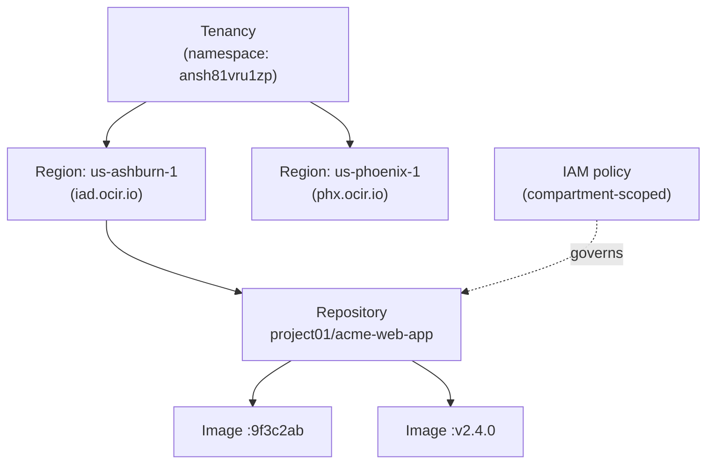
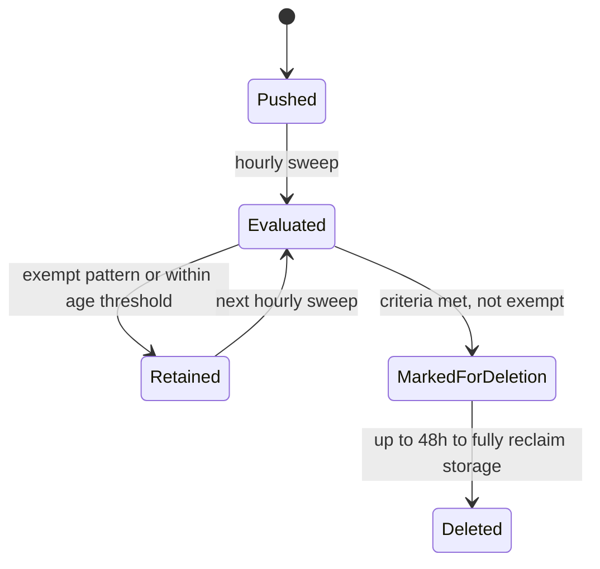
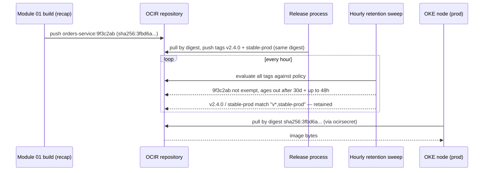

# Container-Based Application Development: The Image Supply Chain on OCI

A container image is portable by design — the same layered tarball runs on a laptop, a CI runner, or a production node, unmodified. What changes between those places is not the image but everything wrapped around it: who is allowed to push and pull it, whether a tag can be silently repointed at different content tomorrow, and how long the registry keeps a copy before reclaiming the space. **Oracle Cloud Infrastructure Container Registry (OCIR)** is not a private Docker Hub with an Oracle logo — it is an **Identity and Access Management (IAM)**-governed resource that lives inside your tenancy, and nearly everything that differs from a generic registry follows from that one fact. This lesson assumes you already know how a Dockerfile builds layers and how `docker push`/`docker pull` work; it spends its depth on OCIR's resource model, its authentication paths, and the versioning and retention machinery that decides how long an image survives.

---

## Contents

1. [The Registry as an IAM-Native Resource](#1-the-registry-as-an-iam-native-resource)
2. [Authenticating to OCIR: The Human Path and Three Automated Ones](#2-authenticating-to-ocir-the-human-path-and-three-automated-ones)
3. [Tags, Digests, and the Mutable-`latest` Trap](#3-tags-digests-and-the-mutable-latest-trap)
4. [Image Lifecycle: Retention Policies](#4-image-lifecycle-retention-policies)
5. [OCIR in the Delivery Pipeline](#5-ocir-in-the-delivery-pipeline)
6. [Worked Walkthrough: One Image, Commit to Pod](#6-worked-walkthrough-one-image-commit-to-pod)
7. [Limits and Sources](#7-limits-and-sources)
8. [Summary](#8-summary)

---

## 1. The Registry as an IAM-Native Resource

### 1.1 What "IAM-native" actually changes

**OCIR has no registry-specific account system.** A generic registry — Docker Hub, a self-hosted `registry:2` — has its own account system: sign up, get a namespace, manage permissions separately from everything else you run. A repository is instead an ordinary **Oracle Cloud Infrastructure (OCI)** resource, like a compute instance or a bucket:

- It lives in a compartment; an IAM policy governs who can read or write it.
- Every push or pull is authorized the same way any other OCI API call is.
- The registry maintains no notion of "registry users" at all.

That single fact is the anchor for the rest of this lesson: authentication (see Authenticating to OCIR, below), the audit trail behind who pushed what, and how pipelines reach the registry (see OCIR in the Delivery Pipeline, below) are all ordinary IAM, not a bolt-on credential system.

### 1.2 Anatomy of a registry path

Every image reference to OCIR has four parts:

```text
iad.ocir.io          / ansh81vru1zp        / project01/acme-web-app  : v2.4.0
<region-key>.ocir.io / <tenancy-namespace> / <repository-name>       : <tag>
```

| Component | What it is |
| :--- | :--- |
| `<region-key>.ocir.io` | The registry domain — one per OCI region (`iad` = Ashburn, `phx` = Phoenix, `fra` = Frankfurt, and so on). |
| `<tenancy-namespace>` | An auto-generated Object Storage namespace string, unique per tenancy, visible on the tenancy's *General Information* page. |
| `<repository-name>` | The repository — a first-class OCI resource with its own **Oracle Cloud Identifier (OCID)**, compartment, and IAM policy scope. |
| `<tag>` | A mutable pointer at one specific image version, not the version's permanent identity — full mechanics in Tags, Digests, and the Mutable-`latest` Trap, below. |

- **OCIR is regional.** There is no global endpoint; a repository created in one region does not exist in another.
- **The tenancy namespace isn't OCIR's own invention** — the registry reuses the same namespace Object Storage already assigned your tenancy, which is why it looks unfamiliar the first time you see it in an image path.

> Nuance: `project01/acme-web-app` looks like a folder path, and it's tempting to read it as a directory hierarchy the way Docker Hub organizes `org/image`. It is not — the entire string, slashes included, is one flat **display name**. The proof is in the uniqueness rule: a repository name must be unique across *every* compartment in the tenancy, not just within its apparent "folder." Slashes here are a naming convention for readability, not a hierarchy the platform enforces.

> Note: Flat naming doesn't put policy scoping out of reach, though. An IAM policy condition can pattern-match directly against that same flat string — `where target.repo.name = /project01-*/` covers every repository name starting with `project01-` in one statement. That's a naming-convention match against a string, not a grant against a real "project01" resource; the uniqueness rule above still holds.

### 1.3 The repository as a managed resource

**A repository is created and administered like any other OCI resource** — through the CLI, Console, or Terraform, not through a `docker push` to an unfamiliar path:

```bash
# Creates the repository as an explicit resource before any image is pushed to it
oci artifacts container repository create \
  --display-name "project01/acme-web-app" \
  --compartment-id "$COMPARTMENT_OCID"
```



*The resource model: a repository sits under a region under a tenancy namespace, and IAM policy — not a registry-specific account system — governs it directly.*

- **A repository created in one region doesn't exist in another** — the same regional-scoping caveat this track named for DevOps projects. Reaching a second region is a deliberate build-side decision (push the image to both, or build separately per region), never automatic.
- **Two quotas bound this model**: a tenancy can hold up to **500 repositories per enabled region**, with a combined **500 GB of image storage per region**, and each repository up to **100,000 images**. A repository with no retention policy (see Image Lifecycle, below) hits the 500 GB ceiling long before the image-count one.

---

## 2. Authenticating to OCIR: The Human Path and Three Automated Ones

**Every push and pull is an ordinary IAM-authorized call** — the paths below are what that looks like from the calling side, depending on who or what is doing the calling. Not every one of them ends in a distinct registry credential (see *Automated and federated paths*, below).

### 2.1 Auth tokens: the human, long-lived path

**An Auth Token is the default human credential** — a generated secret string tied to an IAM user, used as a Docker password, valid until rotated or revoked. Your OCI Console password never works for `docker login`; the token is a deliberately separate credential so a compromised Docker config never exposes your primary login.

```bash
# The registry domain is the region key from the path anatomy, above; the
# "password" is the Auth Token, never the OCI Console password
docker login iad.ocir.io
Username: ansh81vru1zp/jdoe@acme.com
Password: <auth-token-from-console>

# Federated users (Oracle Identity Cloud Service) add a domain segment to the username
docker login iad.ocir.io
Username: ansh81vru1zp/oracleidentitycloudservice/jdoe@acme.com
Password: <auth-token-from-console>
```

> ⚠️ A valid Auth Token is not, by itself, an all-access pass. Because OCIR is IAM-native, the token only authenticates *who you are* — an IAM policy still has to authorize the push or pull. A user with a correct token but no `repos` policy grant is denied at the registry. That denial commonly surfaces as a **404 not found**, not a **403 forbidden** — the same IAM-first debugging instinct Module `01` established for DevOps pipelines. A "repository not found" error after a fresh token is usually a missing policy statement, not a typo in the path.

### 2.2 Automated and federated paths: bearer tokens, security tokens, and resource principals

A human isn't the only caller — a script or a workload under federated identity needs to authenticate without a person typing a password. Two short-lived alternatives cover that, plus a fourth path that skips credentials entirely:

- **Bearer Token (JWT)** — issued on behalf of a caller already authenticated to OCI through an API-key-based CLI or SDK profile: a script that wants a short-lived docker credential instead of a static Auth Token. Short-lived by design: a leak's exposure window is hours, not until someone remembers to revoke it.
- **Security Token (User Principal Session Token, UPST)** — issued through **Workload Identity Federation**, so an identity external to OCI's own principal system (a CI system outside OCI entirely) can exchange its own token for a UPST. The UPST itself never reaches the registry — it's exchanged a second time for the same Bearer Token above, so a federated caller ends up authenticating exactly like an API-key-based caller, just with two exchanges in front of it.
- **Resource principal** — a build pipeline (see OCIR in the Delivery Pipeline, below) needs no registry credential at all: IAM policy authorizes it directly.

| Mechanism | Who uses it | Lifetime | Obtained via |
| :--- | :--- | :--- | :--- |
| Auth Token | A human at a terminal, or a script standing in for one | Until rotated or revoked | Console → *User Settings* → *Auth Tokens* |
| Bearer Token (JWT) | An API-key-authenticated script or tool — not a resource principal, which needs no registry credential at all | Short-lived | Generated on request from an API-key profile |
| Security Token (UPST) | A workload under federated/external identity (no OCI API key at all) | Short-lived | Workload Identity Federation token exchange, then exchanged again for a Bearer Token — the UPST itself is never passed to `docker login` |

**Selection:**

- **Auth Token** — anything a person runs by hand: local `docker login`, a one-off CLI session.
- **Bearer Token** — the caller already holds OCI API keys and wants a short-lived credential instead of a static one.
- **Security Token** — the caller's identity originates *outside* OCI's own principal system and needs federation to get in; it lands a Bearer Token at the far end, not a credential used on its own.
- **Resource principal** — the same dynamic-group-and-policy pattern Module `01` used for build pipelines: no separate registry credential is issued at all; the pipeline's existing identity is simply authorized, through policy, to push.

---

## 3. Tags, Digests, and the Mutable-`latest` Trap

Sections 1–2 covered who can reach a repository at all; this section is about a risk that exists once they're in — what a tag actually points to, and how that can shift under you.

### 3.1 Tags are reassignable; digests are permanent

**A tag is a reassignable pointer; a digest is the content's permanent identity.** A **tag** names one image version but can be repointed at different content at any time. A **digest** (a `sha256` hash of the image manifest) never changes — two images with the same digest are byte-for-byte identical, full stop.

```bash
# Pull by digest — this can only ever resolve to one exact set of bytes
docker pull iad.ocir.io/ansh81vru1zp/project01/acme-web-app@sha256:3fbd6a...c91e

# List an existing repository's images and see both tag and digest side by side
oci artifacts container image list \
  --compartment-id "$COMPARTMENT_OCID" \
  --repository-id "$REPO_OCID"
```

> Nuance: A tag reads like a version number, and it's tempting to assume one tag always names the same content. It does not. Pushing a new image under an existing tag simply repoints it — the old content is not versioned or archived by the tag itself, it is just no longer what `:v2.4.0` resolves to.

> Note: OCI's own tooling calls a tag a **version** — the retention policy's *Exempt Versions* field (see Image Lifecycle, below) and the `--version` filter above both use that word. Docker's CLI and the image spec call the identical mechanism a **tag**. They are the same thing under two names; this lesson keeps saying "tag" because that's the vocabulary your existing Docker fluency already uses, but recognize "version" the moment it appears in an OCI CLI flag or console field.

### 3.2 Why `:latest` is the trap it looks like

**`:latest` silently repoints, breaking dev/prod parity.** It's Docker's default tag when none is specified, and pushing without an explicit tag silently reuses it. Every subsequent push to `:latest` repoints the same pointer at new content, so a deployment manifest naming `:latest` can start pulling a genuinely different image tomorrow with no change to the manifest itself.

- Breaks **dev/prod parity** (twelve-factor X, from Module `01`'s twelve-factor methodology) — "the same image everywhere" only holds if the tag actually names one fixed thing.
- Breaks the commit-hash threading from Module `01`'s walkthrough — a running pod that only shows `:latest` cannot tell you which commit produced it.

### 3.3 Immutable repositories: making the trap unrepresentable

**Marking a repository immutable makes the mistake impossible, not just discouraged.** Policy discipline ("just don't push over `:latest`") is one answer; OCIR also offers a mechanical one — the registry refuses *any* push that would overwrite an existing tag:

```bash
# Once set, this repository will reject a push that reuses an existing tag
oci artifacts container repository update \
  --repository-id "$REPO_OCID" \
  --is-immutable true
```

> Note: The obvious objection: what about a legitimate re-release under a floating pointer tag like `stable`? Immutability has no exception for "but this one's intentional." The fix is to stop needing floating tags at all — push every build under a unique, never-reused tag (see *One digest, many tags*, below). If a floating pointer is genuinely required, keep it in a separate, non-immutable repository whose only job is that pointer.

> Nuance: immutability governs **pushes only**. Pulling from an immutable repository works exactly as it would against a mutable one — nothing about read access changes.

### 3.4 One digest, many tags: the versioning pattern

**A digest can carry any number of tags simultaneously.** Module `01`'s walkthrough tagged the build output with the commit hash (`:9f3c2ab`) — a good default because the hash is unique and traceable, but not human-friendly for a release changelog. A release process re-tags the *same content* under a second, readable name without rebuilding anything:

```bash
# Pull the exact image built from commit 9f3c2ab by its digest
docker pull iad.ocir.io/ansh81vru1zp/project01/acme-web-app@sha256:3fbd6a...c91e

# Give that same digest a second, human-readable tag — no rebuild, same bytes
docker tag iad.ocir.io/ansh81vru1zp/project01/acme-web-app@sha256:3fbd6a...c91e \
           iad.ocir.io/ansh81vru1zp/project01/acme-web-app:v2.4.0
docker push iad.ocir.io/ansh81vru1zp/project01/acme-web-app:v2.4.0
```

The commit-hash tag stays the traceability anchor; the semantic tag is a convenience label pointing at the identical digest — both are real tags on real content, never a `:latest`-style moving target.

---

## 4. Image Lifecycle: Retention Policies

Tags and digests (above) fixed *which* content a tag points to; this section covers something orthogonal — *how long* any given image, tagged or not, is allowed to keep existing in the repository at all.

### 4.1 Global policy first, custom policy as an override

- **A global image retention policy** exists implicitly per region, defaulting to *retain everything* — no image is auto-deleted unless you change it.
- **A custom image retention policy** is an explicit resource overriding that default for specific repositories; only one custom policy can apply to a given repository at a time.
- **Editing either kind needs `manage` on the tenancy, not just a repository.** `manage` on a *repository* only lets you attach or detach it from an existing custom policy — not touch the policy's own criteria.

This is the same **managed-default-vs-fine-grained-control** trade-off that shows up across OCI: the safe, do-nothing default (retain everything) costs nothing to set up, but it silently accrues storage against the 500 GB/region quota (see *The repository as a managed resource*, above). A team that never configures retention eventually hits that ceiling — and at that point, *pushes*, not just deletions, start failing.

### 4.2 Selection criteria: two independent clocks

A retention policy deletes images against one of two time-based criteria that behave differently:

- **Not pulled in N days** — measures last *pull* time; the Exempt Versions field (below) applies to it directly.
- **Not versioned in N days** — measures how long an image has sat *without being given a tag at all*, typically a dangling manifest left behind by a superseded build. Exempt Versions does **not** apply here — an untagged image has no version identifier for the exemption pattern to match against.

> Nuance: it's easy to assume Exempt Versions is a blanket "protect this image" switch. It only ever protects against the *pull-age* criterion. An unversioned, untagged manifest ages out under the second criterion regardless of any exemption pattern.

### 4.3 Exempt versions: pattern-matching what to keep

The Exempt Versions field takes a comma-separated list of tag patterns, with `*` matching zero or more characters, so one field protects an entire release convention at once:

```text
# Never delete a tag literally named "latest", any tag starting with "prod-",
# any tag ending in "-tail", or any minor-version pattern like v2.100.3
latest,prod-*,*-tail,*.100.*
```

### 4.4 The sweep: hourly, with a deliberate delay

**Enforcement is an hourly automatic process** checking every image in scope against its policy's criteria. Two built-in delays make retention policies safe to edit:

- A **cooling-off period of several hours** after a policy is created or updated, during which the hourly sweep ignores it — time to catch a typo in a wildcard pattern before it deletes anything.
- Once an image is marked for deletion, **up to 48 hours** for the deletion and storage reclamation to fully complete.



*An image's life under a custom retention policy: the sweep re-evaluates every image every hour, and only a non-exempt image past its age threshold is ever marked for deletion.*

Concretely: a repository accumulating one feature-branch image per day at roughly 180 MB each adds about 5.4 GB per month if nothing is ever pruned. A 30-day "not pulled" retention rule with `v*,stable-prod` exempted reclaims those disposable builds automatically, while release tags stay untouched indefinitely.

---

## 5. OCIR in the Delivery Pipeline

Sections 1–4 covered OCIR as a standalone resource — its model, its credentials, its tagging and its lifecycle. This section is where those pieces meet the rest of the platform: the pipeline that pushes into a repository, and the compute that pulls back out of it.

### 5.1 The push side: what Module `01`'s pipeline actually lands here

**Module `01`'s *deliver artifacts* build stage authenticates as a resource principal** through the pipeline's dynamic group, the same way *Automated and federated paths* (above) describes — no separate registry login involved. One repository-level setting shapes what happens when a push targets a path with no repository yet:

```bash
# When enabled, a push to a brand-new repository path auto-creates the repository
# instead of failing — but the new repository lands in the *root* compartment
oci artifacts container configuration update \
  --compartment-id "$COMPARTMENT_OCID" \
  --is-repository-created-on-first-push true
```

> ⚠️ Auto-creation is convenient for a first CI run against a new service, but the repository it creates always belongs to the tenancy's **root compartment**, not the compartment the pipeline itself runs in. A policy scoped to the pipeline's own compartment can then fail to cover the very repository it just created — the fix for anything beyond quick, casual use is to pre-create repositories explicitly with `oci artifacts container repository create` (*The repository as a managed resource*, above) in the compartment you actually intend.

### 5.2 The pull side: OKE requires an explicit secret

**Same tenancy and region does not mean implicit access.** It's tempting to assume that because OCIR is IAM-native and an **OKE (OCI Kubernetes Engine)** node lives in the same tenancy and region as the registry, a pod on that node can pull images implicitly. It cannot — Kubernetes' pull mechanism is defined by the Kubernetes API, not OCI's IAM model. Every pod pulling from OCIR needs an explicit `imagePullSecret` built from an Auth Token:

```bash
# Build the pull secret from an Auth Token exactly as docker login would use it
kubectl create secret docker-registry ocirsecret \
  --docker-server=iad.ocir.io \
  --docker-username=ansh81vru1zp/jdoe@acme.com \
  --docker-password="$AUTH_TOKEN" \
  --docker-email=jdoe@acme.com
```

```yaml
# The pod manifest must reference the secret by name — there is no implicit fallback
apiVersion: v1
kind: Pod
metadata:
  name: orders-service
spec:
  containers:
    - name: orders
      image: iad.ocir.io/ansh81vru1zp/project01/orders-service:v2.4.0
  imagePullSecrets:
    - name: ocirsecret
```

> ⚠️ That pull secret is only as durable as the Auth Token it was built from — an Auth Token is tied to one IAM user and stays valid until rotated or revoked (see *Auth tokens*, above). A secret built from a specific engineer's personal token quietly breaks for every workload depending on it the moment that engineer's token is rotated or the person leaves. Build `ocirsecret` from a service-oriented user's token. Rotate it deliberately, rather than as a side effect of someone's offboarding.

Module `03` covers OKE's cluster and node-pool mechanics in depth; this is the one piece that belongs here, because it's a registry-side authentication fact, not a Kubernetes scheduling one.

**OCI Functions** (Module `04`) pulls from OCIR by a different path worth contrasting: a function's deployment authenticates as a first-class OCI principal under ordinary IAM policy, the same resource-principal pattern as *Automated and federated paths* — there is no Kubernetes-style pull secret to wire up at all. Same registry, two different consumers, two different authentication shapes.

### 5.3 Image security: scanning and signing

Everything so far governs *who can push and pull*; scanning and signing govern *whether the content itself should be trusted* — full policy-enforcement depth is Module `09`'s subject.

- **Scanning** is a separate **container scan target** resource, backed by the **Vulnerability Scanning Service**, naming one or more repositories to watch:

  ```bash
  # A scan target watches one or more repositories; the recipe defines what CVE
  # database and cadence the scan runs against
  oci vulnerability-scanning container scan target create \
    --compartment-id "$COMPARTMENT_OCID" \
    --container-scan-recipe-id "$RECIPE_OCID" \
    --target-registry file://target-registry.json
  ```

  - Every new push is scanned automatically once a target is watching; for a repository that already held images, only the four most recently pushed are scanned retroactively.
  - Results are **bucketed by severity** (Critical to Minor), **retained 13 months**, and **re-scanned automatically** whenever a new CVE is published — a finding can appear weeks after a push with nothing about the image having changed.

- **Signing** answers a different question — not "does this image have known vulnerabilities" but "did it come from who I think, unmodified." An image **signature** binds a **Vault** master encryption key to a specific image **digest**, never a tag — only a digest is a fixed enough target to sign.

  ```bash
  # Signs the exact digest identified by --image-id and uploads the signature in one step
  oci artifacts container image-signature sign-upload \
    --compartment-id "$COMPARTMENT_OCID" \
    --image-id "$IMAGE_OCID" \
    --kms-key-id "$VAULT_KEY_OCID" \
    --kms-key-version-id "$VAULT_KEY_VERSION_OCID" \
    --signing-algorithm SHA_256_RSA_PKCS_PSS
  ```

  - Verifying a signature checks back against Vault, confirming the key existed and the signer could use it at signing time. Trust in the image is only as good as trust in who could reach that Vault key.
  - OKE and OCI Functions can each be configured to refuse an image without a valid signature at deploy time; that enforcement policy is Module `09` territory.

---

## 6. Worked Walkthrough: One Image, Commit to Pod

Every mechanic above — tags, digests, retention, and the two pull paths — traces through one concrete image here, start to finish.

### 6.1 The trace

Module `01`'s walkthrough ended with commit `9f3c2ab` built and pushed to OCIR as `orders-service:9f3c2ab`. This walkthrough picks up exactly there and carries that image through release tagging, retention, and a cluster pull.

1. **Starting point (recap).** `orders-service:9f3c2ab` already sits in the repository, pushed by Module `01`'s build pipeline as a resource principal. Its digest is `sha256:3fbd6a...c91e`.
2. **Release cut.** The team decides commit `9f3c2ab` is the `v2.4.0` release. Following *One digest, many tags*, they pull the image by digest and push two new tags — `v2.4.0` and `stable-prod` — pointing at that same digest. No rebuild occurs; the bytes are identical to step 1.
3. **Retention policy in force.** The repository carries a custom retention policy: delete images not pulled in 30 days, with Exempt Versions set to `v*,stable-prod`. The hourly sweep evaluates all three tags — `9f3c2ab`, `v2.4.0`, `stable-prod` — every hour. `v2.4.0` and `stable-prod` match the exempt pattern and are never touched; `9f3c2ab` is not exempt, so once 30 days pass without a pull against it, it is marked for deletion and reclaimed within 48 hours.
4. **Deployment.** Module `01`'s `orders-deploy` pipeline applies a manifest to the `prod` OKE environment. To avoid the mutable-tag risk from *Why `:latest` is the trap it looks like*, the manifest references the image by its digest rather than the `stable-prod` tag — the deployed content is pinned exactly, with `stable-prod` retained purely as a human-readable label.
5. **The pull.** Each OKE node scheduling a pod for this deployment authenticates using the cluster's `ocirsecret` and pulls the pinned digest from `iad.ocir.io`.



*One image traced from a Module 01 commit through release tagging, retention exemption, and a digest-pinned OKE pull.*

### 6.2 Why pinning by digest closes the loop

Deploying by digest rather than by `stable-prod` means the deployment can never be silently affected by a future re-push to that tag — the exact scenario `:latest` warned about. `stable-prod` remains useful as a label a human reads in the console, but nothing about the running system depends on that label continuing to mean the same thing tomorrow.

---

## 7. Limits and Sources

| Limit | What it forces | As-of + docs |
| :--- | :--- | :--- |
| 500 repositories and 500 GB total per enabled region; up to 100,000 images per repository | The quotas are per *enabled* region, so a tenancy live in three regions carries three separate 500 GB budgets, not one pooled figure | Jul 2026, [docs](https://docs.oracle.com/en-us/iaas/Content/Registry/Concepts/registryoverview.htm) |
| OCIR is regional with no automatic cross-region copy | A multi-region rollout needs the region baked into the image reference at build time — one push to `<region>.ocir.io` per region | Jul 2026, [docs](https://docs.oracle.com/en-us/iaas/Content/Registry/Concepts/registryoverview.htm) |
| Auth failures often surface as 404, not 403 | Don't re-issue the Auth Token when a push 404s — a fresh token can't close a policy gap, and rotating it burns the time the misleading error already cost | Jul 2026, [docs](https://docs.oracle.com/en-us/iaas/Content/Registry/Concepts/registryprerequisites.htm) |
| Immutable repositories reject any tag overwrite, no exceptions | Fix is unique tags plus digest-based re-tagging, not disabling immutability | Jul 2026, [docs](https://docs.oracle.com/en-us/iaas/tools/oci-cli/latest/oci_cli_docs/cmdref/artifacts/container/repository/update.html) |
| Retention edits are delayed: a cooling-off period, then up to 48h to reclaim storage | Don't expect an emergency cleanup to free quota within minutes | Jul 2026, [docs](https://docs.oracle.com/en-us/iaas/Content/Registry/Tasks/registrymanagingimageretention.htm) |
| Editing a retention policy needs tenancy-level `manage`, not repository-level | A repository owner with only repo-scoped access cannot tune the rule themselves | Jul 2026, [docs](https://docs.oracle.com/en-us/iaas/Content/Registry/Tasks/registrymanagingimageretention.htm) |
| First-push auto-creation lands in the root compartment | Auto-creation is a tenancy-level setting — leaving it on is one decision made for every team at once, not per pipeline | Jul 2026, [docs](https://docs.oracle.com/en-us/iaas/tools/oci-cli/latest/oci_cli_docs/cmdref/artifacts/container/configuration/update.html) |
| OKE never pulls implicitly, same tenancy or not | The secret carries one user's Auth Token, so every pod using it breaks when that user is deactivated or the token is rotated | Jul 2026, [docs](https://docs.oracle.com/en-us/iaas/Content/ContEng/Tasks/contengpullingimagesfromocir.htm) |
| Scanning only backfills the four most recently pushed images on an existing repository | An old, unpushed-since image can carry an undetected vulnerability until something pushes to it or a target re-watches it | Jul 2026, [docs](https://docs.oracle.com/en-us/iaas/Content/Registry/Tasks/registryscanningimagesforvulnerabilities.htm) |
| A signature binds a digest, never a tag | Re-tagging a signed image doesn't re-sign it — an enforcement policy has to reference the digest, not the release tag | Jul 2026, [docs](https://docs.oracle.com/en-us/iaas/Content/Registry/Tasks/registrysigningimages_topic.htm) |
| IAM policies can wildcard-match repository names directly (`target.repo.name = /prefix-*/`) | A naming convention can drive policy scope in one statement, even though the name itself has no real hierarchy | Aug 2026, [docs](https://docs.oracle.com/en-us/iaas/Content/Registry/Concepts/registrypolicyrepoaccess.htm) |

> Note: A pull secret is only as durable as the token behind it — covered inline above, at *The pull side*. Exempt Versions only guards the pull-age criterion — covered inline at *Selection criteria*. Short-lived credentials (Bearer/Security Tokens) trade a bounded leak-exposure window for needing a live token-exchange step instead of a static password — a real cost, but not a dated fact requiring a doc link.

---

## 8. Summary

OCIR behaves the way it does because it is an IAM-native OCI resource first and a container registry second. Every push and pull is authorized by ordinary compartment-scoped policy, not a separate registry account system. A repository's full path — region key, tenancy namespace, repository name, tag — is a chain of ordinary OCI identifiers wearing a familiar-looking Docker mask.

Authentication branches by caller — a human, an API-key-authenticated script, a federated identity, or a resource principal — each landing on a different credential path (see *Authenticating to OCIR*). Tags and digests are not synonyms: a tag is a reassignable pointer, a digest is the content's permanent identity. That's why `:latest` is dangerous. It's also why an immutable repository closes that gap mechanically, rather than relying on discipline alone.

Retention policies default to keeping everything forever, which costs real storage quota if left unconfigured. Changing that default takes tenancy-level permission. Enforcement runs on a deliberately delayed hourly sweep, so a bad edit can be caught before it deletes anything. Everything here becomes the foundation the next modules build on: Module `03` assumes the `imagePullSecret` requirement when it covers OKE workload deployment, and Module `04` contrasts its own Functions-native pull path against the resource-principal model introduced here.
