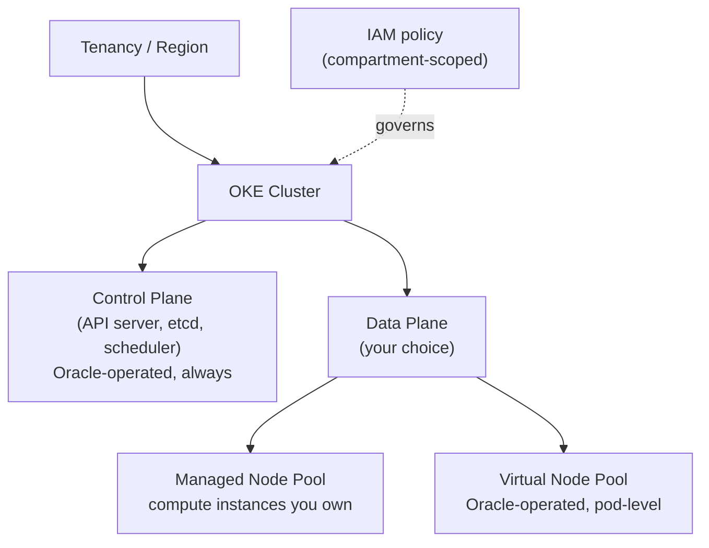
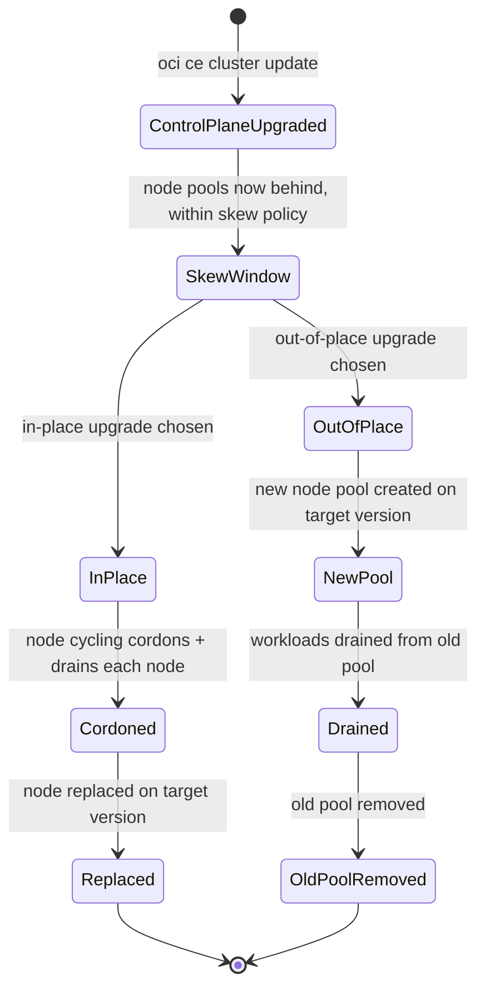
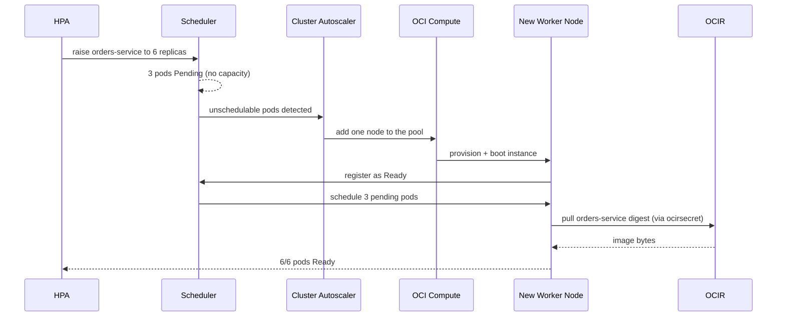

# Managed Kubernetes: The OKE Split Between What Oracle Runs and What You Do

**Oracle Cloud Infrastructure Kubernetes Engine (OKE)** is not "Kubernetes, but Oracle hosts the whole thing" — it is a series of dials that let you choose *how much* of the cluster Oracle operates versus how much you own. The control plane is always Oracle's job; everything below it — cluster tier, node type, upgrade strategy — is a choice with a real trade-off attached. Module `02` left off with an image sitting in **OCI Container Registry (OCIR)**, a digest-pinned deployment manifest, and an `imagePullSecret` named `ocirsecret`; this lesson is where those artifacts finally land on a running cluster, and it spends its depth on the OKE-specific decisions that determine what that cluster actually looks like.

---

## Contents

1. [The Managed Split: Control Plane vs. Data Plane](#1-the-managed-split-control-plane-vs-data-plane)
2. [Basic vs. Enhanced Clusters](#2-basic-vs-enhanced-clusters)
3. [Managed Nodes vs. Virtual Nodes](#3-managed-nodes-vs-virtual-nodes)
4. [Reaching the Cluster: kubeconfig, Cloud Shell, and Endpoints](#4-reaching-the-cluster-kubeconfig-cloud-shell-and-endpoints)
5. [Scaling and Upgrades](#5-scaling-and-upgrades)
6. [OSOK: Provisioning OCI Resources from Manifests](#6-osok-provisioning-oci-resources-from-manifests)
7. [Practical Limits and Trade-offs](#7-practical-limits-and-trade-offs)
8. [Summary](#8-summary)

---

## 1. The Managed Split: Control Plane vs. Data Plane

### 1.1 What Oracle always runs

Every OKE cluster, regardless of tier, gives you a Kubernetes **control plane** — the API server, `etcd`, the scheduler, the controller manager — that Oracle operates, patches, and keeps highly available across multiple **Availability Domains (ADs)**. You never SSH into it, never see its underlying compute, and never patch its OS. That is true of any managed Kubernetes offering; OKE's specific version of it is that the control plane is a first-class **Oracle Cloud Infrastructure (OCI)** resource with its own **Oracle Cloud Identifier (OCID)**, sitting inside your compartment and governed by ordinary **Identity and Access Management (IAM)** policy — the same IAM-native pattern Module `02` established for OCIR.

### 1.2 What you still choose

Everything below the control plane — how the cluster is provisioned, what runs your pods, how upgrades happen — is a **data plane** decision, and OKE gives you three independent dials for it: the cluster tier, the node type, and the upgrade strategy — each is its own section below. Think of the cluster like a serviced condo building: the building's foundation, elevators, and security desk are professionally managed no matter which unit you rent — that part is non-negotiable. But you still choose between a fully serviced unit where housekeeping handles everything, and an unfurnished unit you outfit and maintain yourself. Both units share the same building; they differ in how much day-to-day operating burden you carry.

> Nuance: it is tempting to assume "managed Kubernetes" means Oracle manages the whole cluster end to end, the way a fully outsourced platform would. It does not. OKE's management guarantee is scoped to the control plane; the moment you add a **managed node** pool, you are back to patching an OS and sizing compute instances yourself unless you deliberately choose the tier and node type that hands that back to Oracle too.



*The one fixed fact — Oracle always runs the control plane — versus the three data-plane dials the rest of this lesson covers: tier, node type, and upgrade strategy.*

This is also the answer to "how is OKE different from generic managed Kubernetes": the *concept* of a managed control plane is common to any cloud's offering, but the specific dials — a Basic/Enhanced tier split, a serverless virtual-node option, and OCI's own IAM-native governance of the whole thing — are what you actually need to reason about for the exam and in production. The rest of this lesson works through each dial in turn.

---

## 2. Basic vs. Enhanced Clusters

### 2.1 The tier dial

Section 1 named cluster tier as the first data-plane dial; this section is that dial in full. Every OKE cluster is created as one of two tiers, chosen once at creation. A **Basic cluster** gives you core Kubernetes with no additional charge for the control plane, but strips out a specific feature set. An **Enhanced cluster** unlocks that feature set in exchange for a control-plane charge and a stronger uptime guarantee. The charge is roughly $0.10/hour, capped near $70/month (as of Jul 2026, [pricing](https://www.oracle.com/cloud/cloud-native/kubernetes-engine/pricing/)). Enhanced also carries a financially-backed **Service Level Agreement (SLA)** on API server uptime that Basic simply does not offer.

| Capability | Basic cluster | Enhanced cluster |
| :--- | :--- | :--- |
| Control plane cost | No charge | ~$0.10/hr, capped monthly |
| SLA on API server uptime | None | Financially-backed |
| Virtual nodes (next section) | Not available | Available |
| Granular add-on management (CoreDNS, kube-proxy, Dashboard) | Not available | Available |
| Workload identity / fine-grained pod IAM | Not available | Available |
| Node cycling during upgrades | Not available | Available |
| Worker node ceiling | Lower | Higher, increasable on request |

(As of Jul 2026, [docs](https://docs.oracle.com/en-us/iaas/Content/ContEng/Tasks/contengworkingwithenhancedclusters.htm).)

> Nuance: it is easy to read "Enhanced" as simply "the more expensive tier" and stop there. The real distinction is a **feature gate**, not just a price tag — virtual nodes, workload identity, and add-on management are entirely unavailable on Basic, not merely metered differently. A team that needs serverless node pools has no Basic-tier path to them at all; the choice has to be made deliberately, not discovered after the fact.

### 2.2 The upgrade path is one-way

You can upgrade a Basic cluster to Enhanced later, but only if the Basic cluster already uses **VCN-Native pod networking** rather than the older Flannel overlay — a Basic cluster on Flannel has no upgrade path and must be recreated. The reverse direction does not exist at all: an Enhanced cluster can never be downgraded to Basic (as of Jul 2026, [docs](https://docs.oracle.com/en-us/iaas/Content/ContEng/Tasks/contengworkingwithenhancedclusters.htm)).

```bash
# Enhanced cluster, VCN-Native networking — the tier and networking mode are both
# set at creation and shape which upgrade paths remain open later
oci ce cluster create \
  --name "orders-cluster" \
  --compartment-id "$COMPARTMENT_OCID" \
  --vcn-id "$VCN_OCID" \
  --type ENHANCED_CLUSTER \
  --kubernetes-version "v1.31.1"
```

### 2.3 Selection guidance

Reach for **Basic** for development clusters, learning environments, or any workload that tolerates a control-plane blip without a contractual guarantee — the same "safe, do-nothing default" trade-off Module `02` named for retention policies applies here: Basic costs nothing extra to run, but you give up the SLA and the entire virtual-node option. Reach for **Enhanced** the moment production traffic, a compliance requirement for an uptime guarantee, or a plan to use virtual nodes is in scope — retrofitting Enhanced later is possible only if you built on VCN-Native networking from day one, so an exam-relevant caveat worth internalizing directly: *decide the tier before you decide you might need it*.

---

## 3. Managed Nodes vs. Virtual Nodes

### 3.1 Two different data planes

Section 1 named the data plane as the second dial; this section is that dial in full. A **managed node** is an ordinary OCI compute instance — virtual machine or bare metal — that you provision into a node pool. It behaves like a worker node in any self-managed Kubernetes cluster: an OS you patch, a capacity you size, and a machine you can reach directly if you choose. A **virtual node** has no such machine at all from your side; it is Oracle's fully-managed, serverless execution surface for pods, available only on Enhanced clusters and only from Kubernetes 1.25 onward (as of Jul 2026, [docs](https://docs.oracle.com/en-us/iaas/Content/ContEng/Tasks/contengcomparingvirtualwithmanagednodes_topic.htm)).

Returning to the condo analogy from *The Managed Split: Control Plane vs. Data Plane*: a managed node is the unfurnished unit — you buy the furniture, fix the plumbing, and decide when to repaint. A virtual node is the fully serviced unit — housekeeping (Oracle) handles the maintenance, but you also cannot renovate the walls yourself. That second half of the analogy matters more than it first appears, because it is exactly where virtual nodes' restrictions come from.

### 3.2 Resource allocation: node-level vs. pod-level

The two node types allocate resources at fundamentally different granularities. A managed node pool's capacity is fixed by the shape and count of its instances — a pod scheduled there draws from whatever headroom that node happens to have left. A virtual node has no fixed capacity at all; each pod's own `resources.requests` *is* the unit Oracle bills and provisions, scaled independently per pod.

```yaml
# On a virtual node, requests and limits must match exactly — there is no
# node-level headroom to borrow against, so Oracle provisions precisely
# what the pod spec asks for
resources:
  requests:
    cpu: "250m"
    memory: "256Mi"
  limits:
    cpu: "250m"      # must equal the request on a virtual node
    memory: "256Mi"  # must equal the request on a virtual node
```

> Nuance: on a managed node, `limits` above `requests` is the normal way to let a pod burst into unused node capacity. Try that on a virtual node and the pod is rejected — there is no shared node to burst into, because there is no node. Requests and limits collapsing into one number is not a stricter defaults policy; it is a direct consequence of billing and provisioning per pod instead of per node.

### 3.3 What virtual nodes cannot do

Because a virtual node is not a machine you can reach, an entire category of Kubernetes features that assume node-level access simply does not apply. **DaemonSets** have nothing to run one-per-node on. `kubectl exec`, `kubectl logs -f`, and SSH to the node are all unavailable, because there is no shell to attach to. **Persistent Volume Claims (PVCs)**, `hostPath`, and third-party **Container Network Interface (CNI)** plugins (Flannel, Calico, Cilium) are unsupported — only VCN-Native networking and a narrow set of ephemeral volume types (`emptyDir` capped at one per pod, `ConfigMap`, `Secret`) are allowed (as of Jul 2026, [docs](https://docs.oracle.com/en-us/iaas/Content/ContEng/Tasks/contengcomparingvirtualwithmanagednodes_topic.htm)).

```yaml
# Unsupported on a virtual node: hostPath assumes a real filesystem on a real
# machine, which a virtual node deliberately does not expose
volumes:
  - name: cache-dir
    hostPath:
      path: /data
```

The **Cluster Autoscaler** (covered fully in *Scaling and Upgrades* below) is also absent from virtual nodes for a reason worth stating plainly: there is no fixed-size node to scale in the first place, so the scaling question that the autoscaler exists to answer does not arise — a virtual node pool already scales per-pod by design.

### 3.4 Managed vs. virtual, side by side

| Aspect | Managed node | Virtual node |
| :--- | :--- | :--- |
| Underlying machine | A real OCI compute instance you own | None exposed to you — Oracle-operated |
| Resource allocation | Node-level (pod draws from node headroom) | Pod-level (request = provisioned amount) |
| Cluster tier required | Basic or Enhanced | Enhanced only |
| Scaling mechanism | Cluster Autoscaler (see *Scaling and Upgrades*) | None needed — scales per pod |
| `DaemonSets`, PVCs, `hostPath` | Supported | Not supported |
| `kubectl exec` / `logs -f` / SSH | Supported | Not supported |
| Kubernetes version floor | Any supported version | 1.25+ |

### 3.5 Selection guidance

Reach for **managed nodes** when a workload needs `DaemonSets`, `PersistentVolumeClaims`, direct node access for debugging, or a specific instance shape (GPU, bare metal) — anything that assumes a real machine underneath the pod. Reach for **virtual nodes** for stateless, horizontally-scalable services that fit the supported feature set, where the payoff is real: no node sizing, no OS patching, no Cluster Autoscaler to tune, and a serverless Kubernetes experience layered on top of a platform you already know. A cluster is not forced to pick one exclusively — a single Enhanced cluster commonly runs a stable managed-node pool for stateful or DaemonSet-dependent workloads alongside a virtual-node pool that absorbs bursty, stateless traffic.

---

## 4. Reaching the Cluster: kubeconfig, Cloud Shell, and Endpoints

### 4.1 The endpoint choice

An OKE cluster's Kubernetes API server is reachable through either a **public endpoint** — routable from the internet, restricted by IAM and any network security rules you attach — or a **private endpoint**, reachable only from inside the cluster's **Virtual Cloud Network (VCN)** or anything peered/connected to it (a bastion host, a VPN, FastConnect). The choice is made at cluster creation and shapes every subsequent `kubectl` command: a private-endpoint cluster needs a network path into the VCN before `kubectl` can reach it at all, while a public-endpoint cluster only needs the generated kubeconfig plus whatever IAM policy governs it.

### 4.2 Generating the kubeconfig

Whichever endpoint you chose, `kubectl` needs a kubeconfig file that points at it and carries OCI-based authentication. The CLI generates that file directly from the cluster's OCID:

```bash
# Writes (or merges into) ~/.kube/config with the cluster's API endpoint and an
# OCI-CLI-based auth plugin — no separate Kubernetes credential is issued
oci ce cluster create-kubeconfig \
  --cluster-id "$CLUSTER_OCID" \
  --file "$HOME/.kube/config" \
  --region us-ashburn-1 \
  --token-version 2.0.0
```

The generated kubeconfig does not embed a static credential; instead it shells out to the OCI CLI on every `kubectl` invocation to mint a short-lived token, so access to the cluster is governed by the same IAM policy as everything else in this track rather than a separate Kubernetes-native credential you would have to rotate by hand.

### 4.3 Cloud Shell: the same access, pre-authenticated

**Cloud Shell** is a browser-based terminal that OCI provisions per user, already authenticated as that user's IAM identity — no local OCI CLI install or API-key setup needed before running the `create-kubeconfig` command shown above. It is the fastest way to reach a *public-endpoint* cluster for ad hoc `kubectl` work, exam practice, or a quick node-pool check, precisely because the authentication step Module `01`'s DevOps pipelines had to configure explicitly is already done for you.

> Nuance: Cloud Shell does not grant any special network path into a *private*-endpoint cluster. It runs from an OCI-managed network, not inside your VCN, so reaching a private cluster from Cloud Shell still needs the same VCN connectivity (a bastion, a peering, a service gateway) that any other external caller would need. Cloud Shell removes the *authentication* setup step, not the *networking* one.

### 4.4 Placing this back on the spine

Reaching the cluster is not a data-plane dial the way tier or node type are — it is orthogonal to both, which is why it gets its own section rather than folding into the tier or node-type sections. Whichever tier and node type you chose, this is how you actually operate against the result.

---

## 5. Scaling and Upgrades

### 5.1 Two upgrade surfaces, upgraded separately

Section 1 named upgrade strategy as the third data-plane dial; this section covers it alongside the closely related question of scaling. An OKE cluster has two things that carry a Kubernetes version, and they are upgraded through two entirely separate actions. Upgrading the **control plane** means specifying a newer Kubernetes version for the cluster resource itself — a control-plane-only operation that touches no worker node. Upgrading a **node pool** is a second, independent action performed per pool, and different pools in the same cluster are allowed to run different Kubernetes versions simultaneously (as of Jul 2026, [docs](https://docs.oracle.com/en-us/iaas/Content/ContEng/Concepts/contengaboutupgradingclusters.htm)).

```bash
# Step 1 of 2 — the control plane only; no worker node is touched by this call
oci ce cluster update \
  --cluster-id "$CLUSTER_OCID" \
  --kubernetes-version "v1.32.1"
```

> Nuance: it is tempting to assume "upgrading the cluster" upgrades everything in it, the way patching a single server would. It does not — a control-plane upgrade with no follow-up node-pool upgrade leaves every worker node exactly where it was, and the cluster keeps running on the version skew described next.

The Kubernetes **skew policy** bounds how far apart the two are allowed to drift: worker nodes must run the same version as the control plane or an earlier compatible one, and from Kubernetes 1.28 onward the control plane may run up to three minor versions ahead of a node pool before that pool must catch up (as of Jul 2026, [docs](https://docs.oracle.com/en-us/iaas/Content/ContEng/Concepts/contengaboutupgradingclusters.htm)).

### 5.2 In-place vs. out-of-place node pool upgrades

Once the control plane is ahead, a managed node pool can be brought forward two ways. An **in-place upgrade** replaces the boot volume (or the instance itself) of each existing worker node with the new Kubernetes version, node by node, keeping the same node pool resource throughout. An **out-of-place upgrade** instead creates a *new* node pool on the target version, drains workloads onto it, then removes the old pool entirely — slower to set up, but it leaves the previous pool intact as a rollback path until the new one is proven.

The first objection to in-place upgrades lands immediately: what happens to pods running on a node mid-cycle? **Node cycling** — an Enhanced-cluster-only capability named in *Basic vs. Enhanced Clusters* above — answers it by cordoning and draining each node before replacing it, so workloads reschedule onto already-upgraded nodes rather than being cut off mid-request; Basic clusters lack node cycling and require a manual drain before each replacement.



*Once the control plane moves ahead, the node pool's own upgrade is a separate, later action — and from there it branches into the in-place or out-of-place path this section names.*

### 5.3 Scaling: manual, autoscaled, and the virtual-node exception

A managed node pool's size is either set manually (an explicit node count) or handed to the **Cluster Autoscaler**, installed as a cluster **add-on** that watches for unschedulable pods and adds or removes nodes to match:

```bash
# Enables the Cluster Autoscaler as a managed add-on rather than a
# self-hosted Deployment — Oracle handles its version and lifecycle
oci ce addon install \
  --cluster-id "$CLUSTER_OCID" \
  --addon-name ClusterAutoscaler \
  --configurations '[{"key":"nodepools","value":"[\"'"$NODE_POOL_OCID"'\"]"}]'
```

As *Managed Nodes vs. Virtual Nodes* already established, a virtual-node pool has no Cluster Autoscaler to install at all — it scales per-pod the moment a pod is scheduled, so the "how many nodes should I run" question the autoscaler exists to answer never comes up on that path.

### 5.4 Worked walkthrough: a scale-up from HPA to a running pod

This traces one concrete event — traffic to `orders-service` rising — through both the pod-level and node-level scaling machinery, picking up the image and pull secret Module `02`'s walkthrough left in place.

1. **Load rises.** A Horizontal Pod Autoscaler (HPA) watching `orders-service` raises the target replica count from 3 to 6 pods.
2. **Scheduling fails.** The Kubernetes scheduler tries to place the three new pods on the existing managed node pool and finds no node with enough free CPU/memory — they sit `Pending`.
3. **The autoscaler reacts.** The Cluster Autoscaler add-on introduced just above, watching for exactly this condition, calls the OCI API to add one more node to the pool.
4. **A node joins.** OCI provisions a new compute instance, boots it, and it registers with the cluster's control plane as `Ready`.
5. **The pods schedule.** The scheduler places the three pending pods onto the new node.
6. **The pull.** Each pod's container runtime authenticates using the `ocirsecret` `imagePullSecret` Module `02` built, and pulls `orders-service`'s pinned digest from OCIR.
7. **Ready.** All six pods report `Ready`; the HPA's target is met.



*A pod-level scale request (HPA) triggers a node-level scale action (Cluster Autoscaler) only because the existing node pool ran out of room — the two scaling mechanisms are distinct, and this is the moment they hand off to each other.*

Had `orders-service` instead run on a virtual-node pool, steps 2–4 would not occur at all: each new pod would provision its own execution slot directly, with no unschedulable state and no node to add.

---

## 6. OSOK: Provisioning OCI Resources from Manifests

### 6.1 What OSOK does

Sections 1–5 covered how much of the *cluster itself* Oracle manages for you; OSOK extends that same managed-vs-own-it choice to OCI resources that sit *outside* the cluster but that a workload running on it depends on. The **OCI Service Operator for Kubernetes (OSOK)** is a cluster **add-on**, built on the open-source Kubernetes **Operator Framework**, that lets you create and manage OCI resources as Kubernetes **Custom Resources** — applied with `kubectl` the same way you'd apply a `Deployment`. Supported resource types include an **Autonomous Database**, a MySQL HeatWave instance, and others (as of Jul 2026, [docs](https://docs.oracle.com/en-us/iaas/Content/ContEng/Tasks/contengaddingosok.htm)). Without OSOK, provisioning a database for `orders-service` to use means a separate `oci` CLI call or Terraform run, outside the cluster's own deployment flow entirely; OSOK folds that provisioning step into the same manifests and the same `kubectl apply` your application already uses.

### 6.2 The reconciliation loop

OSOK follows the standard Kubernetes **operator** pattern: you declare the *desired* state of an OCI resource as a Custom Resource, and OSOK's controller continuously reconciles OCI's *actual* state to match it — creating the resource if it doesn't exist, and (depending on the resource type) updating or tearing it down as the manifest changes.

```yaml
# Declares an Autonomous Database as a Kubernetes resource; OSOK's controller
# reconciles this against the OCI Database API, creating it if absent
apiVersion: database.oci.oracle.com/v1alpha1
kind: AutonomousDatabase
metadata:
  name: orders-adb
spec:
  compartmentId: "$COMPARTMENT_OCID"
  dbName: "ORDERSDB"
  cpuCoreCount: 1
  adminPassword:
    k8sSecret:
      name: adb-admin-secret
```

> Nuance: it is easy to read a Custom Resource as just a convenient label OSOK slaps on an existing OCI resource after the fact. It is the other way around — the manifest is the *source of truth* the controller reconciles OCI toward, so deleting the Kubernetes resource is itself the mechanism that de-provisions the OCI resource, not a side effect you have to separately clean up.

### 6.3 Authentication and installation

OSOK ships as an **Operator Lifecycle Manager (OLM)** bundle — its **Custom Resource Definitions (CRDs)**, **Role-Based Access Control (RBAC)** rules, and controller Deployment install together as one unit rather than as separate manual steps. Because it acts on your behalf against the OCI API, OSOK needs its own credentials, not the cluster's. The documented setup is a dedicated OCI IAM user with policy scoped to exactly the resource types it manages, with that user's credentials stored as a Kubernetes `Secret` rather than baked into the controller image (as of Jul 2026, [docs](https://docs.oracle.com/en-us/iaas/Content/ContEng/Tasks/contengaddingosok.htm)). That mirrors the same principle Module `02` named for the `ocirsecret` pull secret: build it from a service-scoped identity, not a specific engineer's personal credential, so the resource doesn't silently break when that person's access changes.

---

## 7. Practical Limits and Trade-offs

- **Basic vs. Enhanced is a feature gate, not just a price difference**: virtual nodes, workload identity, granular add-on management, and node cycling are entirely unavailable on Basic regardless of budget ([docs](https://docs.oracle.com/en-us/iaas/Content/ContEng/Tasks/contengworkingwithenhancedclusters.htm), as of Jul 2026) — pick the tier for the features you'll need, not just the cheapest option today.
- **The Basic-to-Enhanced upgrade only works from VCN-Native networking**: a Basic cluster still on Flannel overlay networking has no upgrade path to Enhanced and must be recreated; the reverse direction (Enhanced to Basic) never exists ([docs](https://docs.oracle.com/en-us/iaas/Content/ContEng/Tasks/contengworkingwithenhancedclusters.htm), as of Jul 2026).
- **Virtual nodes trade flexibility for zero node management**: no `DaemonSets`, `PersistentVolumeClaims`, `hostPath`, third-party CNIs, `kubectl exec`/`logs -f`, or SSH to the node — anything assuming a real machine underneath the pod is unsupported ([docs](https://docs.oracle.com/en-us/iaas/Content/ContEng/Tasks/contengcomparingvirtualwithmanagednodes_topic.htm), as of Jul 2026).
- **Virtual nodes require `requests` to equal `limits`**: there is no shared node capacity to burst into, so per-pod resource requests are provisioned exactly as declared rather than treated as a soft floor.
- **Node capacity ceilings differ sharply by CNI and tier**: a Basic cluster caps at 1,000 managed nodes; an Enhanced cluster reaches up to 5,000 (20,000 with Oracle approval) on Flannel, but only 2,000 on VCN-Native pod networking, with 256 pods per managed node and 1,000 nodes per node pool ([docs](https://docs.oracle.com/en-us/iaas/Content/General/Reference/servicelimits.htm), as of Jul 2026) — the networking mode you pick for other reasons also caps how far the node pool can scale.
- **Virtual node pools per region are scarce by default**: as few as 3 (Pay As You Go) to 9 (Universal Credits) virtual node pools per region out of the box, increasable on request ([docs](https://docs.oracle.com/en-us/iaas/Content/General/Reference/servicelimits.htm), as of Jul 2026) — plan capacity requests before a production cutover, not during one.
- **Control plane and node pool upgrades are two separate actions**: upgrading the cluster's Kubernetes version touches no worker node; node pools are upgraded per pool afterward, and the Kubernetes skew policy (three minor versions from 1.28 onward) bounds how far the two can drift apart ([docs](https://docs.oracle.com/en-us/iaas/Content/ContEng/Concepts/contengaboutupgradingclusters.htm), as of Jul 2026).
- **Node cycling during upgrades is Enhanced-only**: a Basic cluster's in-place node pool upgrade requires manually cordoning and draining each node yourself; Enhanced automates that cycling.
- **The Cluster Autoscaler does not apply to virtual nodes**: there is no fixed-size node for it to scale — virtual nodes scale per-pod by construction, so the autoscaler question only exists on managed-node pools.
- **Cloud Shell removes the authentication step, not the network one**: it runs pre-authenticated as your IAM identity, but a private-endpoint cluster still needs a real VCN network path (bastion, peering, service gateway) that Cloud Shell does not provide by itself.
- **OSOK needs its own scoped credential, not the cluster's**: a dedicated IAM user with policy limited to the resource types OSOK manages, stored as a Kubernetes `Secret` — the same "build it from a service identity, not a person's" principle Module `02` applied to `ocirsecret`.

---

## 8. Summary

OKE's core idea is a managed split, not full management. Oracle always operates the control plane — highly available, IAM-governed, patched without your involvement — but three further choices remain entirely yours: the cluster tier (Basic's no-charge simplicity versus Enhanced's SLA and feature set), the node type (a managed node you patch and size versus a virtual node Oracle operates per pod), and how upgrades and scaling happen underneath a running workload.

Those choices compound. Enhanced unlocks virtual nodes, workload identity, and node cycling that Basic simply cannot offer at any price, and the tier decision is effectively one-way once a cluster exists. Virtual nodes remove node management entirely but only for workloads that fit a real feature ceiling — no `DaemonSets`, no `PersistentVolumeClaims`, no direct node access — while managed nodes keep full Kubernetes flexibility at the cost of patching and capacity planning you own yourself.

Everything from here builds on a cluster that is already running. Module `04`'s **OCI Functions** contrasts its own scale-to-zero, no-node-at-all execution model directly against the managed- and virtual-node spectrum this lesson just covered, and Module `05`'s API Gateway will route traffic into the exact `orders-service` deployment this lesson's walkthrough scaled up.
