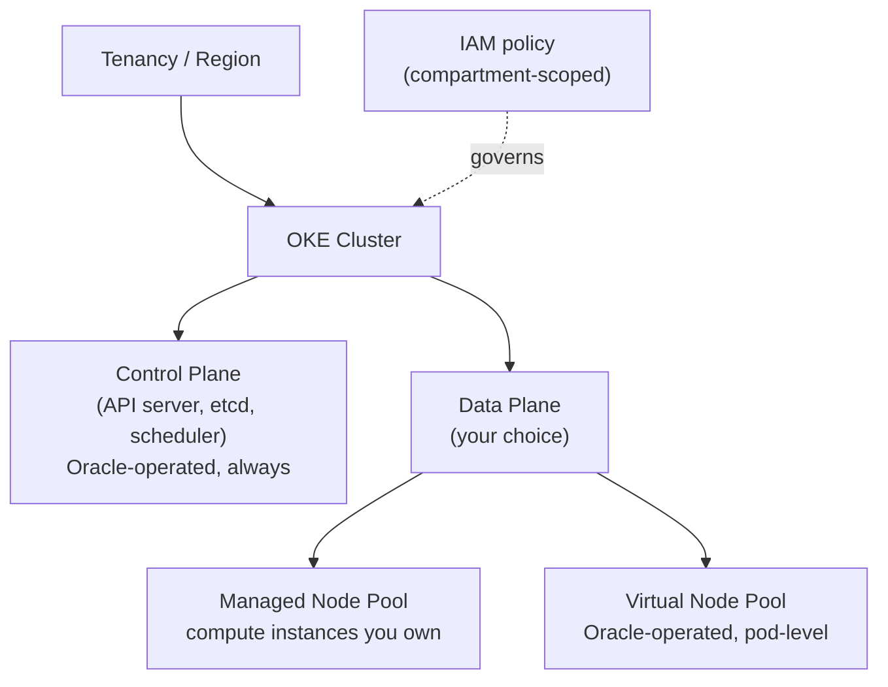
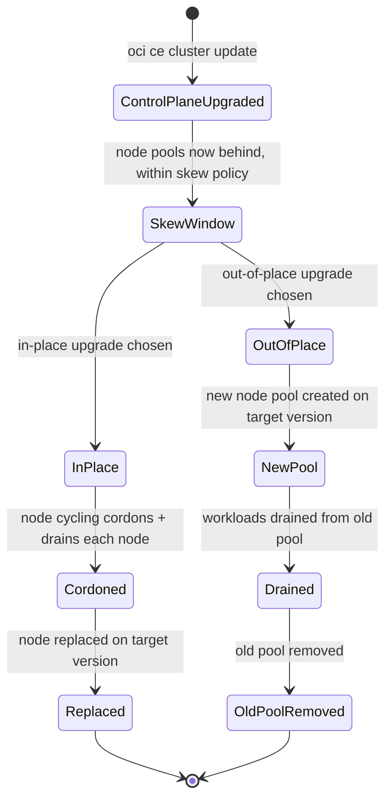
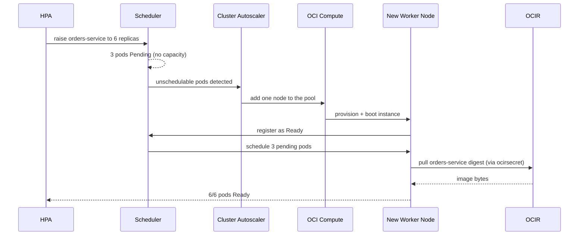

# Managed Kubernetes: The OKE Split Between What Oracle Runs and What You Do

**Oracle Cloud Infrastructure Kubernetes Engine (OKE)** is not "Kubernetes, but Oracle hosts the whole thing" — it is a series of dials that let you choose *how much* of the cluster Oracle operates versus how much you own. The control plane is always Oracle's job; everything below it — cluster tier, node type, upgrade strategy — is a choice with a real trade-off attached. Module `02` left off with an image sitting in **OCI Container Registry (OCIR)**, a digest-pinned deployment manifest, and an `imagePullSecret` named `ocirsecret`; this lesson is where those artifacts finally land on a running cluster, and it spends its depth on the OKE-specific decisions that determine what that cluster actually looks like.

---

## Contents

1. [The Managed Split: Control Plane vs. Data Plane](#1-the-managed-split-control-plane-vs-data-plane)
2. [Basic vs. Enhanced Clusters](#2-basic-vs-enhanced-clusters)
3. [Managed, Virtual, and Self-Managed Nodes](#3-managed-virtual-and-self-managed-nodes)
4. [Reaching the Cluster: kubeconfig, Cloud Shell, and Endpoints](#4-reaching-the-cluster-kubeconfig-cloud-shell-and-endpoints)
5. [Exposing and Persisting Workloads: Load Balancers and Storage](#5-exposing-and-persisting-workloads-load-balancers-and-storage)
6. [Scaling and Upgrades](#6-scaling-and-upgrades)
7. [Cluster Security: Secrets Encryption and Admission Control](#7-cluster-security-secrets-encryption-and-admission-control)
8. [OSOK: Provisioning OCI Resources from Manifests](#8-osok-provisioning-oci-resources-from-manifests)
9. [Limits and Sources](#9-limits-and-sources)
10. [Summary](#10-summary)

---

## 1. The Managed Split: Control Plane vs. Data Plane

### 1.1 What Oracle always runs

**Every OKE cluster gives you a Kubernetes control plane Oracle operates, regardless of tier.** The API server, `etcd`, the scheduler, and the controller manager are patched and kept highly available across multiple **Availability Domains (ADs)** — you never SSH into it, never see its underlying compute, never patch its OS.

- True of any managed Kubernetes offering; OKE's specific version is that the control plane is a first-class **Oracle Cloud Infrastructure (OCI)** resource with its own **Oracle Cloud Identifier (OCID)**, sitting inside your compartment and governed by ordinary **Identity and Access Management (IAM)** policy — the same IAM-native pattern Module `02` established for OCIR.

### 1.2 What you still choose

**Three independent dials sit below the control plane**, each covered in its own section of this lesson: the cluster tier, the node type, and the upgrade strategy.

> Nuance: OKE's management guarantee is scoped to the control plane specifically. The moment you add a **managed node** pool, you are back to patching an OS and sizing compute instances yourself, unless you deliberately choose the tier and node type that hands that back to Oracle too.



*The one fixed fact — Oracle always runs the control plane — versus the three data-plane dials the rest of this lesson covers: tier, node type, and upgrade strategy.*

This is also the answer to "how is OKE different from generic managed Kubernetes": a managed control plane is common to any cloud's offering, but the specific dials — a Basic/Enhanced tier split, a serverless virtual-node option, and OCI's own IAM-native governance of the whole thing — are what you actually need to reason about.

### 1.3 Prerequisites: what must exist before any cluster can be created

**None of the dials below matter until the resources a cluster is built on top of already exist:**

- A **compartment** to hold everything.
- A **VCN** sized for the whole cluster — a `/16` CIDR block is large enough for almost any real deployment; undersizing it here is a redo, not a resize.
- **At least two subnets**, splitting worker nodes, load balancers, the Kubernetes API endpoint, and pods across them depending on the networking mode chosen.
- An internet or NAT gateway, a route table, and security lists or network security groups on the VCN side.
- **Service-limit headroom** — compute, block volume, and networking are the three categories OKE draws from most — worth verifying *before* a create call fails partway through.

This is exactly what feeds the flags this lesson's own snippets use without dwelling on where they come from: `--vcn-id` and `--endpoint-subnet-id`, used in *The upgrade path is one-way* and *The endpoint choice* below, both name resources this section is the checklist for.

### 1.4 Policy configuration: the IAM policies that let you create and manage a cluster

**Two distinct policy needs sit under "can I create a cluster," and conflating them is the trap.**

- **Human/group side**: a group needs statements granting it permission to create and manage the cluster and its node pools:

  ```text
  Allow group oke-admins to manage cluster-family in compartment orders
  Allow group oke-admins to manage instance-family in compartment orders
  Allow group oke-admins to use subnets in compartment orders
  Allow group oke-admins to use vnics in compartment orders
  Allow group oke-admins to use network-security-groups in compartment orders
  Allow group oke-admins to manage public-ips in compartment orders
  Allow group oke-admins to inspect compartments in compartment orders
  ```

- **The OKE service itself as the principal** — not a human group, and not a dynamic-group resource principal (the pattern Module `01` used for build pipelines and Module `04` uses for functions). OKE needs its own permission to connect pod virtual network interface cards (VNICs) to your VCN's subnets on your behalf:

  ```text
  # A third IAM-actor shape: the OCI service itself, not a group or a dynamic group
  Allow service oke to use vnics in compartment orders
  ```

> ⚠️ A missing `use vnics` grant on either side — the group's or the service's — is the concrete, testable failure mode: cluster creation fails, or pods never get network addresses. The fix is almost always this exact statement, on whichever side was skipped.

---

## 2. Basic vs. Enhanced Clusters

### 2.1 The tier dial

**Every OKE cluster is created as one of two tiers, chosen once at creation.**

| Capability | Basic cluster | Enhanced cluster |
| :--- | :--- | :--- |
| Control plane cost | No charge | ~$0.10/hr, capped monthly (~$74/month) |
| SLA on API server uptime | None | Financially-backed |
| Virtual nodes (see *Managed, Virtual, and Self-Managed Nodes*, below) | Not available | Available |
| Granular add-on management (CoreDNS, kube-proxy, Dashboard) | Not available | Available |
| Workload identity / fine-grained pod IAM | Not available | Available |
| Node cycling during upgrades (in-place path only — see *Scaling and Upgrades*) | Not available | Available |
| Worker node ceiling | Lower | Higher, increasable on request |

(See Limits and Sources.)

- **Granular add-on management is concrete, not vague**: on Enhanced, essential add-ons like CoreDNS and kube-proxy can be individually enabled, disabled, pinned to a version, or configured with custom arguments. Basic clusters run the same add-ons with sane defaults, but a hand-edited customization isn't guaranteed to survive — if it conflicts with Oracle's own reconciliation, Basic silently reverts it back to default (see Limits and Sources).

> Nuance: it's easy to read "Enhanced" as simply "the more expensive tier" and stop there. The real distinction is a **feature gate**, not just a price tag — virtual nodes, workload identity, and add-on management are entirely unavailable on Basic, not merely metered differently. A team that needs serverless node pools has no Basic-tier path to them at all.

### 2.2 The upgrade path is one-way

**Basic → Enhanced only works from VCN-Native networking; Enhanced → Basic never works.**

- You can upgrade a Basic cluster to Enhanced later, but only if it already uses **VCN-Native pod networking** rather than the older Flannel overlay.
- A Basic cluster on Flannel has no upgrade path and must be recreated — **Enhanced clusters require VCN-Native networking as a baseline** and don't support Flannel at all, so this isn't a partial mismatch upgrading would smooth over; it's categorical incompatibility.
- The reverse direction does not exist: an Enhanced cluster can never be downgraded to Basic.

```bash
# Enhanced cluster, VCN-Native networking — the tier and networking mode are both
# set at creation and shape which upgrade paths remain open later
oci ce cluster create \
  --name "orders-cluster" \
  --compartment-id "$COMPARTMENT_OCID" \
  --vcn-id "$VCN_OCID" \
  --type ENHANCED_CLUSTER \
  --kubernetes-version "v1.35.2"
```

### 2.3 Selection guidance

- **Basic** — development clusters, learning environments, or any workload that tolerates a control-plane blip without a contractual guarantee. The same "safe, do-nothing default" trade-off Module `02` named for retention policies: Basic costs nothing extra, but you give up the SLA and the entire virtual-node option.
- **Enhanced** — the moment production traffic, a compliance requirement for an uptime guarantee, or a plan to use virtual nodes is in scope. Retrofitting Enhanced later is possible only if you built on VCN-Native networking from day one, so decide the tier before you decide you might need it.

---

## 3. Managed, Virtual, and Self-Managed Nodes

### 3.1 Two different data planes

**A managed node is a machine you own; a virtual node has no machine at all from your side.**

- A **managed node** is an ordinary OCI compute instance — VM or bare metal — that you provision into a node pool. It behaves like a worker node in any self-managed Kubernetes cluster: an OS you patch, a capacity you size, a machine you can reach directly.
- A **virtual node** is Oracle's fully-managed, serverless execution surface for pods — available only on Enhanced clusters, and only from Kubernetes 1.25 onward.

> Nuance: a virtual node isn't just "a managed node with less to configure." Oracle operates it fully, which is also exactly where its restrictions come from — see *What virtual nodes cannot do*, below.

### 3.2 Resource allocation: node-level vs. pod-level

**The two node types allocate resources at fundamentally different granularities.**

- **Managed node pool**: capacity is fixed by the shape and count of its instances — a pod scheduled there draws from whatever headroom that node happens to have left.
- **Virtual node**: no fixed capacity at all — each pod's own `resources.requests` *is* the unit Oracle bills and provisions, scaled independently per pod.

```yaml
# On a virtual node, requests and limits must match exactly — there is no
# node-level headroom to borrow against, so Oracle provisions precisely
# what the pod spec asks for
resources:
  requests:
    cpu: "250m"
    memory: "256Mi"
  limits:
    cpu: "250m"      # must equal the request on a virtual node
    memory: "256Mi"  # must equal the request on a virtual node
```

> Nuance: on a managed node, `limits` above `requests` is the normal way to let a pod burst into unused node capacity. Try that on a virtual node and the pod is rejected — there's no shared node to burst into, because there is no node. Requests and limits collapsing into one number is a direct consequence of billing and provisioning per pod instead of per node, not a stricter defaults policy.

**Per-pod billing is quantifiable:**

- Virtual nodes bill ~$0.015 per vCPU-hour and ~$0.0015 per GB-hour.
- A pod requesting `250m` CPU / `256Mi` memory costs roughly (0.25 × $0.015) + (0.25 × $0.0015) ≈ **$0.0041/hour**, or ~$3/month running continuously.
- Ten such pods cost ~$30/month in pure compute, with zero idle node capacity paid for in between.
- A managed node sized to hold those same ten pods with headroom to spare keeps costing its full instance-hour rate whether the pods are busy or idle.

The trade-off is real: virtual nodes win when utilization is bursty or unpredictable, while a managed node pool running near-constant, tightly-packed load can come out cheaper per unit of actual work — it isn't paying the per-pod convenience premium virtual nodes charge for not having to size anything yourself.

### 3.3 What virtual nodes cannot do

**Because a virtual node is not a machine you can reach, node-level Kubernetes features don't apply:**

- **DaemonSets** have nothing to run one-per-node on.
- `kubectl exec`, `kubectl logs -f`, and SSH to the node are all unavailable — there's no shell to attach to.
- **Persistent Volume Claims (PVCs)**, `hostPath`, and third-party **Container Network Interface (CNI)** plugins (Flannel, Calico, Cilium) are unsupported — only VCN-Native networking and a narrow set of ephemeral volume types (`emptyDir` capped at one per pod, `ConfigMap`, `Secret`) are allowed.
- The **Cluster Autoscaler** (see *Scaling and Upgrades*, below) is absent — there's no fixed-size node to scale in the first place; a virtual-node pool already scales per-pod by design.
- A **GPU or other specialized-shape workload** has no virtual-node path at all — only standard compute is offered; such a workload must go on a managed node.

```yaml
# Unsupported on a virtual node: hostPath assumes a real filesystem on a real
# machine, which a virtual node deliberately does not expose
volumes:
  - name: cache-dir
    hostPath:
      path: /data
```

**Debugging a crash-looping pod without `kubectl exec` or SSH still has a path:**

- `kubectl logs` (without `-f`) still works pod-by-pod — it reads from the container runtime, not the node.
- A node-level logging **DaemonSet** doesn't work, since there's no node to run one on; centralized log collection instead runs as a **sidecar** container inside each pod, using an agent like Fluent Bit to ship that pod's own stdout/stderr onward.
- This is exactly what the single allowed `emptyDir` is for: the app container writes logs to that shared volume, and the sidecar reads from the same mount to ship them — one `emptyDir`, shared between the two containers, not a second one the pod would be denied (see Limits and Sources).

### 3.4 Self-managed nodes: the third dial position

**A self-managed node sits past the "managed" end, not between managed and virtual.** Oracle either sizes and patches the machine for you (managed) or removes the machine entirely (virtual); a self-managed node is an ordinary OCI compute instance *you* create, boot, and join to the cluster yourself — OKE does not provision it, patch it, or track any node-pool resource for it.

- Resource-allocation-wise it behaves exactly like a managed node — node-level headroom, no per-pod billing. The axis that changes is *who provisions and lifecycles the machine*, not how the scheduler treats it once it's there.
- **Two gates apply before joining**: the cluster must be **Enhanced** — Basic has no self-managed path, same as the virtual-node tier gate — and the control plane must run **Kubernetes 1.25 or later** (1.27.10+ if the node needs the VCN-Native Pod Networking CNI).
- **The worker image is constrained**: only OKE-published Oracle Linux 7 or 8 images dated March 28, 2023 or later are supported.

**Joining is a cloud-init step you author, not an OKE-generated one:**

```yaml
#cloud-config
# You write and own this boot script; OKE never generates or updates it for you
runcmd:
  - oke bootstrap --ca ${cluster_ca_cert} --apiserver-host ${api_server_endpoint}
write_files:
  - path: /etc/oke/oke-apiserver
    permissions: '0644'
    content: ${api_server_endpoint}
  - encoding: b64
    path: /etc/kubernetes/ca.crt
    permissions: '0644'
    content: ${cluster_ca_cert}
```

> ⚠️ OKE's silence here cuts both ways. It never validates that the Kubernetes version baked into your image is compatible with the control plane before letting the node join. The same **skew policy** *Two upgrade surfaces, upgraded separately* covers for managed node pools still applies here — but nothing enforces it for you. A self-managed node on an incompatible version joins successfully and fails in stranger ways later.

### 3.5 Managed, virtual, and self-managed, side by side

| Aspect | Managed node | Virtual node | Self-managed node |
| :--- | :--- | :--- | :--- |
| Underlying machine | A real OCI compute instance, OKE-provisioned | None exposed to you — Oracle-operated | A real OCI compute instance, you-provisioned |
| Resource allocation | Node-level (pod draws from node headroom) | Pod-level (request = provisioned amount) | Node-level, same as managed |
| Cluster tier required | Basic or Enhanced | Enhanced only | Enhanced only |
| Scaling mechanism | Cluster Autoscaler (see *Scaling and Upgrades*) | None needed — scales per pod | None built in — you script it |
| `DaemonSets`, PVCs, `hostPath` | Supported | Not supported | Supported |
| `kubectl exec` / `logs -f` / SSH | Supported | Not supported | Supported |
| Kubernetes version floor | Any supported version | 1.25+ | 1.25+ (1.27.10+ for VCN-Native CNI) |
| Version-skew compatibility check | OKE validates it | N/A — no node version to skew | You validate it — OKE does not |

### 3.6 Selection guidance

- **Managed nodes** — a workload needs `DaemonSets`, `PersistentVolumeClaims`, direct node access for debugging, or a specific instance shape (GPU, bare metal): anything assuming a real machine underneath the pod, without wanting to own the join-and-lifecycle process by hand.
- **Virtual nodes** — stateless, horizontally-scalable services that fit the supported feature set: no node sizing, no OS patching, no Cluster Autoscaler to tune.
- **Self-managed nodes** — only when managed nodes' own provisioning path is itself the obstacle: a custom OS image or a fleet-management tool (Terraform, a configuration-management system) that must own the instance lifecycle end to end. Everything OKE would otherwise automate — version compatibility, node lifecycle, patching orchestration — becomes your responsibility.
- **Not exclusive**: a single Enhanced cluster commonly runs a stable managed-node pool for stateful/DaemonSet-dependent workloads alongside a virtual-node pool absorbing bursty, stateless traffic, with a self-managed pool reserved for the one workload whose provisioning tooling actually demands it.

---

## 4. Reaching the Cluster: kubeconfig, Cloud Shell, and Endpoints

Reaching the cluster is not a data-plane dial the way tier or node type are — it's orthogonal to both, which is why it gets its own section. Whichever tier and node type you chose, this is how you actually operate against the result.

### 4.1 The endpoint choice

**An OKE cluster's API server is reachable through a public or a private endpoint, chosen at creation.**

- **Public endpoint** — routable from the internet, restricted by IAM and any network security rules you attach.
- **Private endpoint** — reachable only from inside the cluster's **Virtual Cloud Network (VCN)** or anything peered/connected to it (a bastion host, a VPN, FastConnect).

A private-endpoint cluster needs a network path into the VCN before `kubectl` can reach it at all; a public-endpoint cluster only needs the generated kubeconfig plus whatever IAM policy governs it.

```bash
# --endpoint-public-ip-enabled sets the choice at creation; a private
# endpoint instead requires a VCN subnet to attach the endpoint to
oci ce cluster create \
  --name "orders-cluster" \
  --compartment-id "$COMPARTMENT_OCID" \
  --vcn-id "$VCN_OCID" \
  --endpoint-subnet-id "$ENDPOINT_SUBNET_OCID" \
  --endpoint-public-ip-enabled false
```

> ⚠️ The two flags have to agree with the subnet they target: setting `--endpoint-public-ip-enabled true` against a private subnet doesn't silently downgrade to a private endpoint — the provisioning call fails outright.

**The three connectivity options aren't interchangeable mechanics wearing different names:**

- **Bastion host** (via the OCI Bastion service) — a short-lived, managed SSH session into the VCN on demand, no standing infrastructure between calls.
- **VPN** — a persistent IPSec tunnel from an on-premises or other external network into the VCN, always up once configured.
- **FastConnect** — a dedicated private physical circuit to OCI, bypassing the public internet entirely.

The choice among the three is a durability-and-throughput trade-off: ad hoc access, an always-on tunnel, or a dedicated line.

### 4.2 Generating the kubeconfig

**`kubectl` needs a kubeconfig pointing at the endpoint, carrying OCI-based authentication.** The CLI generates it directly from the cluster's OCID:

```bash
# Writes (or merges into) ~/.kube/config with the cluster's API endpoint and an
# OCI-CLI-based auth plugin — no separate Kubernetes credential is issued
oci ce cluster create-kubeconfig \
  --cluster-id "$CLUSTER_OCID" \
  --file "$HOME/.kube/config" \
  --region us-ashburn-1 \
  --token-version 2.0.0
```

The generated kubeconfig does not embed a static credential — it shells out to the OCI CLI on every `kubectl` invocation to mint a short-lived token, so access is governed by the same IAM policy as everything else in this track rather than a separate credential you'd rotate by hand.

> ⚠️ That convenience carries an identity-ownership risk this track has already named twice — for `ocirsecret` in Module `02` and for OSOK's credential later in this lesson. A kubeconfig generated under one engineer's personal OCI identity stops minting tokens the moment that person's account is deactivated, silently breaking every automation or teammate relying on that file. A shared pipeline or team-wide kubeconfig should be generated under a resource principal or a service-scoped identity — the same `create-kubeconfig` command takes an `--auth=instance_principal` (or `resource_principal`) flag to mint tokens from the compute instance's or pipeline's own identity instead of the caller's personal one.

### 4.3 Cloud Shell: the same access, pre-authenticated

**Cloud Shell is a browser-based terminal, pre-authenticated as your IAM identity.** No local OCI CLI install or API-key setup is needed before running the `create-kubeconfig` command above — the fastest way to reach a *public-endpoint* cluster for ad hoc `kubectl` work, exam practice, or a quick node-pool check.

> Nuance: Cloud Shell does not grant any special network path into a *private*-endpoint cluster. It runs from an OCI-managed network, not inside your VCN, so reaching a private cluster from Cloud Shell still needs the same VCN connectivity (a bastion, a peering, a service gateway) any other external caller would need. Cloud Shell removes the *authentication* setup step, not the *networking* one. It also doesn't remove the credential-lifecycle risk from *Generating the kubeconfig* above, since it authenticates as the same personal IAM identity logged into the console.

---

## 5. Exposing and Persisting Workloads: Load Balancers and Storage

Reaching the cluster (above) is about *you* getting in; this section is about *traffic and data* getting to a workload once it's running there. Both are ordinary Kubernetes resource types — a `Service`, a `PersistentVolumeClaim` — but on OKE each one's *default behavior* is to provision a real OCI resource behind the scenes, the same "Kubernetes API in front, OCI resource behind" pattern *OSOK: Provisioning OCI Resources from Manifests* later generalizes deliberately.

### 5.1 Service type `LoadBalancer`: the annotation is the configuration surface

**On OKE, applying a `LoadBalancer` Service provisions a real OCI Load Balancer — no separate `oci` CLI call.** A standard Kubernetes `Service` spec has no field for "load balancer shape" or "internal-only," so OKE reads that configuration from **annotations** on the same manifest instead:

```yaml
apiVersion: v1
kind: Service
metadata:
  name: orders-service-lb
  annotations:
    oci.oraclecloud.com/load-balancer-type: "lb"                       # "lb" is the default if omitted
    service.beta.kubernetes.io/oci-load-balancer-shape: "flexible"
    service.beta.kubernetes.io/oci-load-balancer-shape-flex-min: "10"
    service.beta.kubernetes.io/oci-load-balancer-shape-flex-max: "100"
    service.beta.kubernetes.io/oci-load-balancer-internal: "true"       # omit for a public IP
spec:
  type: LoadBalancer
  selector:
    app: orders-service
  ports:
    - port: 80
      targetPort: 8080
```

Delete the `Service` and the OCI Load Balancer it provisioned is torn down with it — the same reconciliation direction OSOK uses for its own Custom Resources (see *The reconciliation loop*, below), just built into the cloud-controller manager rather than an add-on you install separately.

### 5.2 Load Balancer vs. Network Load Balancer

**They're architecturally different products, not two sizes of one.** `oci.oraclecloud.com/load-balancer-type` takes two values:

- **Load Balancer** (`"lb"`, the default) — a **proxy**: terminates the connection and opens a new one to your pod. Enables SSL termination and path-based routing, but the backend sees the load balancer's IP as the source, not the original client's.
- **Network Load Balancer** (`"nlb"`) — a **pass-through** device at layers 3/4: forwards packets without terminating the connection, preserving the original client's source IP at the pod and adding materially less latency, at the cost of the proxy-layer features (SSL termination, content routing).

```yaml
metadata:
  annotations:
    oci.oraclecloud.com/load-balancer-type: "nlb"   # pass-through: client IP reaches the pod unmodified
```

- **Reach for the standard Load Balancer by default** — what most Services need, and what OKE provisions if you omit the annotation entirely.
- **Reach for a Network Load Balancer** when a workload needs to see the real client IP (fraud detection, IP-based rate limiting, geolocation) or needs the lowest-latency path a Layer 4 device can offer.

### 5.3 Persistent storage: Block Volume and File Storage

**Block Volume is the default provisioner, and it's single-writer only.** *What virtual nodes cannot do* already named `PersistentVolumeClaims` as a feature virtual nodes can't use at all; this is what a PVC looks like on the managed and self-managed nodes that can.

- OKE's **Block Volume CSI driver** — `oci-bv` on clusters created with Kubernetes 1.24 or later (`oci`, an older FlexVolume plugin, on 1.23 and earlier; upgrading past 1.24 does not silently switch the default for you).
- A block volume supports `ReadWriteOnce` — one node at a time — right for a single-writer workload like a database, wrong for a workload needing the same volume mounted read-write from several pods.
- **File Storage (FSS) CSI**, provisioned through a second `StorageClass` pointing at a mount target, is what supports `ReadWriteMany` instead.

```yaml
apiVersion: v1
kind: PersistentVolumeClaim
metadata:
  name: orders-db-data
spec:
  storageClassName: oci-bv        # default Block Volume CSI class on Kubernetes 1.24+
  accessModes:
    - ReadWriteOnce
  resources:
    requests:
      storage: 50Gi
```

> ⚠️ A block volume is created in one specific **Availability Domain** — the same AD as whichever node the pod using it first schedules onto. The CSI driver enforces that ordering with `volumeBindingMode: WaitForFirstConsumer`: it waits for the scheduler to pick a node, then creates the volume in that node's AD, rather than creating the volume first and risking an AD with no matching node. The cost shows up on failure: a stateless pod can reschedule onto any node in any AD, but a pod backed by this PVC can only move to another node in the *same* AD as its volume. If no node is free there, the pod stays unschedulable — even if other ADs have room to spare.

---

## 6. Scaling and Upgrades

### 6.1 Two upgrade surfaces, upgraded separately

**Control plane and node pool are upgraded through two entirely separate actions.**

- Upgrading the **control plane** means specifying a newer Kubernetes version for the cluster resource itself — a control-plane-only operation that touches no worker node.
- Upgrading a **node pool** is a second, independent action per pool, and different pools in the same cluster are allowed to run different Kubernetes versions simultaneously.

```bash
# Step 1 of 2 — the control plane only; no worker node is touched by this call
oci ce cluster update \
  --cluster-id "$CLUSTER_OCID" \
  --kubernetes-version "v1.36.1"
```

> Nuance: it's tempting to assume "upgrading the cluster" upgrades everything in it, the way patching a single server would. It does not — a control-plane upgrade with no follow-up node-pool upgrade leaves every worker node exactly where it was, and the cluster keeps running on the version skew described next.

The Kubernetes **skew policy** bounds how far apart the two are allowed to drift: worker nodes must run the same version as the control plane or an earlier compatible one, and from Kubernetes 1.28 onward the control plane may run up to three minor versions ahead of a node pool before that pool must catch up.

### 6.2 In-place vs. out-of-place node pool upgrades

**Two ways to bring a managed node pool forward once the control plane is ahead:**

- **In-place upgrade** — replaces the boot volume (or the instance itself) of each existing worker node with the new Kubernetes version, node by node, keeping the same node pool resource throughout.
- **Out-of-place upgrade** — creates a *new* node pool on the target version, drains workloads onto it, then removes the old pool entirely. Slower to set up, but leaves the previous pool intact as a rollback path until the new one is proven.

> Note: The first objection lands immediately — what happens to pods running on a node mid-cycle? **Node cycling** — an Enhanced-cluster-only capability — answers it by cordoning and draining each node before replacing it, so workloads reschedule onto already-upgraded nodes rather than being cut off mid-request. Basic clusters lack node cycling and require a manual drain before each replacement.

That gate is specific to *in-place* upgrades. An out-of-place upgrade drains onto a brand-new pool instead, so it isn't gated behind node cycling or Enhanced at all — a Basic cluster can run one the same way an Enhanced cluster does.



*Once the control plane moves ahead, the node pool's own upgrade is a separate, later action — and from there it branches into the in-place or out-of-place path this section names.*

### 6.3 Scaling: manual, autoscaled, and the virtual-node exception

**A managed node pool's size is either set manually or handed to the Cluster Autoscaler:**

```bash
# Enables the Cluster Autoscaler as a managed add-on rather than a
# self-hosted Deployment — Oracle handles its version and lifecycle
oci ce addon install \
  --cluster-id "$CLUSTER_OCID" \
  --addon-name ClusterAutoscaler \
  --configurations '[{"key":"nodepools","value":"[\"'"$NODE_POOL_OCID"'\"]"}]'
```

The **Cluster Autoscaler**, installed as a cluster **add-on**, watches for unschedulable pods and adds or removes nodes to match. As *Managed, Virtual, and Self-Managed Nodes* already established, a virtual-node pool has no Cluster Autoscaler to install at all. It scales per-pod the moment a pod is scheduled, so "how many nodes should I run" never comes up on that path.

### 6.4 Worked walkthrough: a scale-up from HPA to a running pod

This traces one concrete event — traffic to `orders-service` rising — through both the pod-level and node-level scaling machinery. It picks up the image and pull secret Module `02`'s walkthrough left in place.

1. **Load rises.** A Horizontal Pod Autoscaler (HPA) watching `orders-service` raises the target replica count from 3 to 6 pods.
2. **Scheduling fails.** The Kubernetes scheduler tries to place the three new pods on the existing managed node pool and finds no node with enough free CPU/memory — they sit `Pending`.
3. **The autoscaler reacts.** The Cluster Autoscaler add-on, watching for exactly this condition, calls the OCI API to add one more node to the pool.
4. **A node joins.** OCI provisions a new compute instance, boots it, and it registers with the cluster's control plane as `Ready`.
5. **The pods schedule.** The scheduler places the three pending pods onto the new node.
6. **The pull.** Each pod's container runtime authenticates using the `ocirsecret` `imagePullSecret` Module `02` built, and pulls `orders-service`'s pinned digest from OCIR.
7. **Ready.** All six pods report `Ready`; the HPA's target is met.



*A pod-level scale request (HPA) triggers a node-level scale action (Cluster Autoscaler) only because the existing node pool ran out of room — the two scaling mechanisms are distinct, and this is the moment they hand off to each other.*

Had `orders-service` instead run on a virtual-node pool, steps 2–4 would not occur at all: each new pod would provision its own execution slot directly, with no unschedulable state and no node to add.

---

## 7. Cluster Security: Secrets Encryption and Admission Control

The dials so far chose what runs your pods (*Managed, Virtual, and Self-Managed Nodes*) and how you reach and expose them (*Reaching the Cluster* and *Exposing and Persisting Workloads*); this section covers what protects the cluster's own control-plane data, and what gates a pod before it's ever admitted to run at all.

### 7.1 Kubernetes Secrets encryption at rest

**A default Kubernetes Secret is only base64-encoded, not encrypted.** Anyone with direct `etcd` access reads it in plaintext. OCI already encrypts the underlying Block Volume `etcd` runs on with an Oracle-managed key — that covers "someone steals the disk," but not "an operator with `etcd`-level access reads a Secret's contents directly."

- **Customer-managed encryption** — an option in the cluster's **Custom Create** workflow, not Quick Create — closes that second gap by tying Secrets encryption to a master encryption key (MEK) you hold in **OCI Vault**.
- Mechanically it's envelope encryption: a fresh data encryption key (DEK) encrypts each Secret, and the DEK itself is encrypted by your Vault MEK — the same envelope pattern Module `09` covers in full for Vault generally.

```text
# Prerequisite policy, the same dynamic-group-and-policy pattern Module 01 used for
# build pipelines — the cluster's own identity needs permission to use the Vault key
Allow dynamic-group oke-clusters-dg to use keys in compartment orders where target.key.id = '<key_ocid>'
```

- **Locked in at creation**, the same one-way irreversibility *The upgrade path is one-way* named for Basic-to-Enhanced: you cannot turn customer-managed encryption on for a cluster created without it, and once on, it cannot be turned back off.

> ⚠️ Deleting the Vault MEK does not only block *new* Secrets — every *existing* Secret becomes immediately inaccessible, and cluster upgrades fail outright. If the deletion completes, the only way back is deleting and recreating the cluster. Rotating the key, by contrast, is safe: existing Secrets stay readable because the prior key version is retained in Vault, and only newly-written Secrets pick up the new version.

### 7.2 Admission controllers and pod security

**An admission controller is the last checkpoint before a pod exists in the cluster at all** — it intercepts a request to the API server after authentication and authorization but before the object is actually persisted.

- OKE enables the **PodSecurity** admission controller by default on any cluster running Kubernetes 1.23 or later; it checks each new pod's security context against one of three built-in policies — **Privileged**, **Baseline**, or **Restricted** — applied per *namespace* through a label, not configured pod by pod.
- **PodSecurityPolicy (PSP)**, the older mechanism, is not a second option to weigh — it no longer exists to choose. PSP was deprecated upstream in Kubernetes 1.21 and removed outright in 1.25; OKE does not support PSP, or the PodSecurityPolicy admission controller, on any cluster running Kubernetes 1.25 or later.

```yaml
# Namespace-level label — Restricted is the strictest of the three built-in policies
apiVersion: v1
kind: Namespace
metadata:
  name: orders-prod
  labels:
    pod-security.kubernetes.io/enforce: restricted
```

> ⚠️ A cluster still depending on PSP has to migrate to PodSecurity — mapping each policy to the nearest of the three built-ins — *before* it reaches 1.25, not after; there is no grace period once the upgrade lands.

Cluster **audit logs** — who called the API server, and when — along with application log collection and cluster-level metrics, are *enabled* on the cluster covered by this lesson but *analysed* in Module `10`; this section stops at the admission and encryption mechanics that protect the cluster itself.

---

## 8. OSOK: Provisioning OCI Resources from Manifests

### 8.1 What OSOK does

**OSOK extends the managed-vs-own-it choice to OCI resources outside the cluster.** The **OCI Service Operator for Kubernetes (OSOK)** is a cluster **add-on**, built on the open-source Kubernetes **Operator Framework**, that lets you create and manage OCI resources as Kubernetes **Custom Resources** — applied with `kubectl` the same way you'd apply a `Deployment`.

- Supported resource types include a **MySQL DB System**, an **Autonomous Database**, **OCI Streaming**, and **OCI Queue**, among others — not arbitrary OCI resources (see Limits and Sources).
- Without OSOK, provisioning a database for `orders-service` means a separate `oci` CLI call or Terraform run, outside the cluster's own deployment flow entirely. OSOK folds that provisioning step into the same manifests and the same `kubectl apply` your application already uses.

### 8.2 The reconciliation loop

**OSOK follows the standard Kubernetes operator pattern**: you declare the *desired* state of an OCI resource as a Custom Resource, and OSOK's controller continuously reconciles OCI's *actual* state to match it — creating the resource if it doesn't exist, and (depending on the resource type) updating or tearing it down as the manifest changes.

```yaml
# Declares a MySQL DB System as a Kubernetes resource; OSOK's controller
# reconciles this against the OCI MySQL API, creating it if absent
apiVersion: mysql.oracle.com/v1beta1
kind: DbSystem
metadata:
  name: orders-mysql
spec:
  compartmentId: "$COMPARTMENT_OCID"
  shapeName: MySQL.2
  subnetId: "$SUBNET_OCID"
  adminUsername:
    secret:
      secretName: mysql-admin-secret
  adminPassword:
    secret:
      secretName: mysql-admin-secret
```

> Nuance: it's easy to read a Custom Resource as just a convenient label OSOK slaps on an existing OCI resource after the fact. It's the other way around — the manifest is the *source of truth* the controller reconciles OCI toward, so deleting the Kubernetes resource is itself the mechanism that de-provisions the OCI resource, not a side effect you have to separately clean up.

### 8.3 Authentication and installation

**OSOK ships as an Operator Lifecycle Manager (OLM) bundle** — its **Custom Resource Definitions (CRDs)**, **Role-Based Access Control (RBAC)** rules, and controller Deployment install together as one unit.

- Because it acts on your behalf against the OCI API, OSOK needs its own credentials, not the cluster's.
- A dedicated OCI IAM user with policy scoped to exactly the resource types it manages is one documented option, with credentials stored as a Kubernetes `Secret` rather than baked into the controller image.
- An `auth_type` setting in that same `Secret` can instead point OSOK at a resource principal, an instance principal, or **OKE workload identity** — the same Enhanced-only fine-grained pod IAM named in *Basic vs. Enhanced Clusters*.

Whichever option is chosen, the principle Module `02` named for the `ocirsecret` pull secret still holds: build it from a service- or resource-scoped identity, not a specific engineer's personal credential.

---

## 9. Limits and Sources

| Limit | What it forces | As-of + docs |
| :--- | :--- | :--- |
| Basic vs. Enhanced is a feature gate, not just price: virtual nodes, workload identity, add-on management, node cycling unavailable on Basic | Pick the tier for the features you'll need, not just today's cheapest option | Jul 2026, [docs](https://docs.oracle.com/en-us/iaas/Content/ContEng/Tasks/contengworkingwithenhancedclusters.htm) |
| Basic→Enhanced upgrade only works from VCN-Native networking; Enhanced→Basic never works | A Flannel-based Basic cluster must be recreated, not upgraded | Jul 2026, [docs](https://docs.oracle.com/en-us/iaas/Content/ContEng/Tasks/contengworkingwithenhancedclusters.htm) |
| Virtual nodes unsupported: `DaemonSets`, PVCs, `hostPath`, third-party CNIs, `kubectl exec`/`logs -f`, SSH | Anything assuming a real machine underneath the pod is unsupported | Jul 2026, [docs](https://docs.oracle.com/en-us/iaas/Content/ContEng/Tasks/contengcomparingvirtualwithmanagednodes_topic.htm) |
| Node ceilings differ sharply by CNI/tier: Basic caps at 1,000 managed nodes; Enhanced reaches 5,000 (20,000 on request) on Flannel but only 2,000 on VCN-Native; 256 pods/node, 1,000 nodes/pool | The networking mode chosen for other reasons also caps how far the node pool can scale | Jul 2026, [docs](https://docs.oracle.com/en-us/iaas/Content/General/Reference/servicelimits.htm) |
| Virtual node pools per region default to 3 (Pay As You Go) to 9 (Universal Credits) | Plan capacity requests before a production cutover, not during one | Jul 2026, [docs](https://docs.oracle.com/en-us/iaas/Content/General/Reference/servicelimits.htm) |
| Control plane and node pool upgrades are two separate actions; skew policy allows up to 3 minor versions apart (1.28+) | Bounds how far control plane and node pools can drift | Jul 2026, [docs](https://docs.oracle.com/en-us/iaas/Content/ContEng/Concepts/contengaboutupgradingclusters.htm) |
| Self-managed nodes: only OKE-published Oracle Linux 7/8 images (2023-03-28+) supported; OKE never validates skew for them | Version-compatibility and lifecycle responsibility is entirely yours | Jul 2026, [docs](https://docs.oracle.com/en-us/iaas/Content/ContEng/Tasks/contengprereqsforselfmanagednodes.htm) |
| Customer-managed Secrets encryption: Custom-Create-only, cannot be added later, cannot be disabled once on | Decide it at the same moment as the cluster tier, not afterward | Jul 2026, [docs](https://docs.oracle.com/en-us/iaas/Content/ContEng/Tasks/contengencryptingdata.htm) |
| Deleting the Vault key behind Secrets encryption makes every existing Secret inaccessible and fails upgrades | Restrict key deletion on that MEK by IAM policy — a cluster backup is no help, because the Secrets in it are already unreadable without the key | Jul 2026, [docs](https://docs.oracle.com/en-us/iaas/Content/ContEng/Tasks/contengencryptingdata.htm) |
| PodSecurityPolicy removed upstream in 1.25; OKE drops support from 1.25 onward | A cluster on PSP must migrate to the PodSecurity admission controller before upgrading past 1.24 | Jul 2026, [docs](https://docs.oracle.com/en-us/iaas/Content/ContEng/Tasks/contengusingpspswithoke.htm) |
| Load Balancer vs. Network Load Balancer are different products (proxy vs. pass-through) | Choose NLB only when real client IP or lowest latency is required | Jul 2026, [docs](https://docs.oracle.com/en-us/iaas/Content/ContEng/Tasks/contengcreatingnetworkloadbalancers.htm) |
| A gateway/cluster needs at least two regional subnets; `/16` VCN CIDR is the practical floor | Undersizing the VCN up front means recreating it, not resizing it | Jul 2026, [docs](https://docs.oracle.com/en-us/iaas/Content/ContEng/Concepts/contengnetworkconfig.htm) |
| A missing `use vnics` grant (on the group or the OKE service) is a common silent creation failure | Blocks cluster creation or leaves pods without network addresses | Jul 2026, [docs](https://docs.oracle.com/en-us/iaas/Content/ContEng/Concepts/contengpolicyconfig.htm) |
| Basic clusters silently revert a hand-edited add-on customization that conflicts with Oracle's reconciliation | Don't rely on manual add-on edits surviving on Basic — only Enhanced's granular add-on management persists them | Jul 2026, [docs](https://docs.oracle.com/en-us/iaas/Content/ContEng/Tasks/contengintroducingclusteraddons.htm) |
| A virtual node allows exactly one `emptyDir` volume per pod | Auditing manifests for a second ephemeral volume is part of any node-pool→virtual-node migration — a manifest that worked on a managed node pool won't schedule | Jul 2026, [docs](https://docs.oracle.com/en-us/iaas/Content/ContEng/Tasks/contengviewingapplicationlogs-virtualnodes.htm) |
| OSOK supports a defined resource-type list (MySQL DB System, Autonomous Database, Streaming, Queue, others) — not arbitrary OCI resources | Verify a resource type is OSOK-supported before assuming any OCI resource can become a Custom Resource | Jul 2026, [docs](https://docs.oracle.com/en-us/iaas/Content/ContEng/Tasks/contengaddingosok.htm) |

> Note: A block volume PVC pins a pod to one Availability Domain — covered inline above, at *Persistent storage*. `ReadWriteMany` requires File Storage (FSS), not Block Volume — also covered there. The Cluster Autoscaler doesn't apply to virtual nodes — no fixed-size node to scale. Cloud Shell removes the authentication step but not the networking one, for a private cluster. OSOK needs its own scoped credential, not the cluster's. All three are covered inline where each applies; none is a dated fact requiring its own table row.

---

## 10. Summary

OKE's core idea is a managed split, not full management. Oracle always operates the control plane — highly available, IAM-governed, patched without your involvement. Everything below that is a choice: the cluster tier, the node type, and how upgrades and scaling happen underneath a running workload.

Those choices compound. Enhanced unlocks virtual nodes, self-managed nodes, workload identity, and node cycling that Basic cannot offer at any price. The tier decision is also effectively one-way once a cluster exists. Virtual nodes remove node management entirely, but only for workloads that fit a real feature ceiling. Managed nodes keep full Kubernetes flexibility at the cost of patching and capacity planning you own yourself, and self-managed nodes push that ownership further still.

Traffic and data reach a workload through their own layer above node choice: a `LoadBalancer` Service and a `PersistentVolumeClaim` each provision a real OCI resource by default. Protecting the cluster itself rests on two further, mostly one-time decisions — customer-managed Secrets encryption, chosen at creation, and the PodSecurity admission controller.

Everything from here builds on a cluster that is already running. Module `04`'s **OCI Functions** contrasts its own scale-to-zero, no-node-at-all execution model against the node spectrum this lesson covered, and Module `05`'s API Gateway will route traffic into the exact `orders-service` deployment this lesson's walkthrough scaled up.
