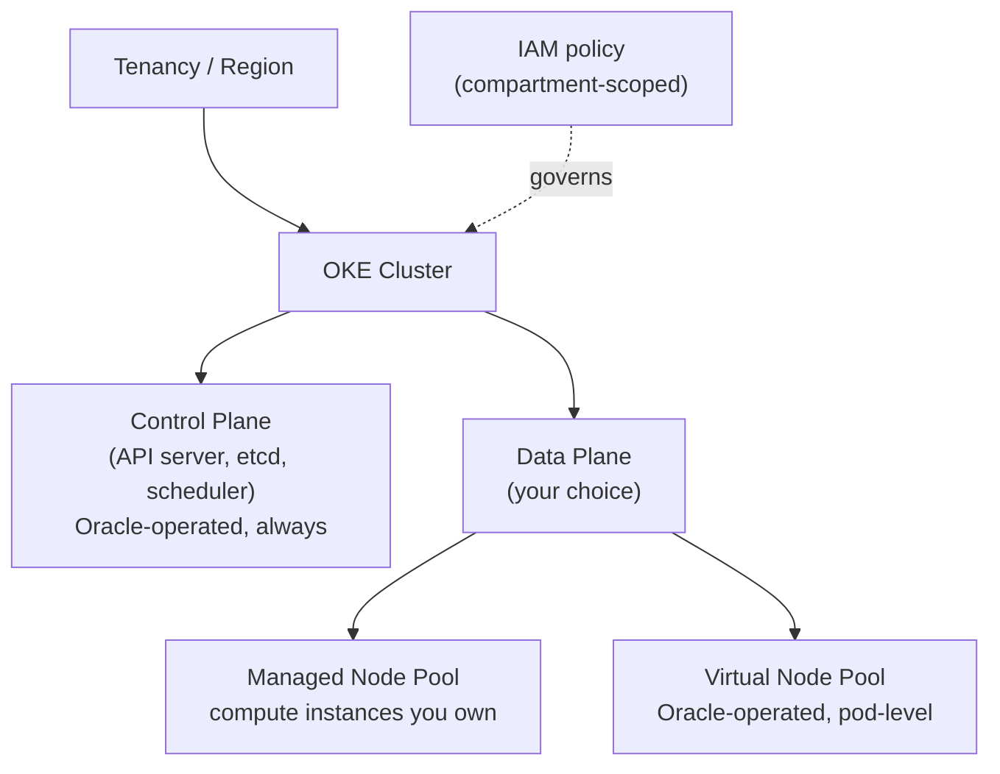
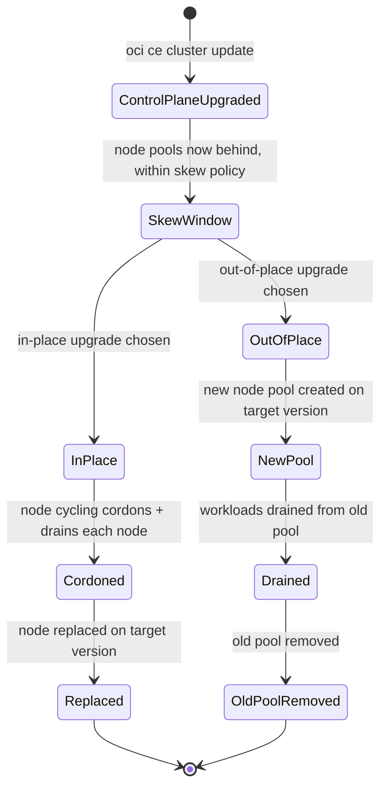
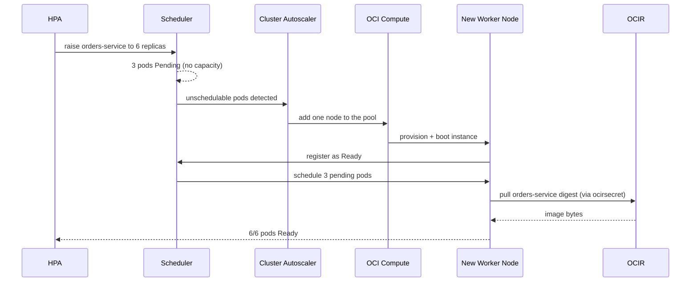

# Managed Kubernetes: The OKE Split Between What Oracle Runs and What You Do

**Oracle Cloud Infrastructure Kubernetes Engine (OKE)** is not "Kubernetes, but Oracle hosts the whole thing" — it is a series of dials that let you choose *how much* of the cluster Oracle operates versus how much you own. The control plane is always Oracle's job; everything below it — cluster tier, node type, upgrade strategy — is a choice with a real trade-off attached. Module `02` left off with an image sitting in **OCI Container Registry (OCIR)**, a digest-pinned deployment manifest, and an `imagePullSecret` named `ocirsecret`; this lesson is where those artifacts finally land on a running cluster, and it spends its depth on the OKE-specific decisions that determine what that cluster actually looks like.

---

## Contents

1. [The Managed Split: Control Plane vs. Data Plane](#1-the-managed-split-control-plane-vs-data-plane)
2. [Basic vs. Enhanced Clusters](#2-basic-vs-enhanced-clusters)
3. [Managed, Virtual, and Self-Managed Nodes](#3-managed-virtual-and-self-managed-nodes)
4. [Reaching the Cluster: kubeconfig, Cloud Shell, and Endpoints](#4-reaching-the-cluster-kubeconfig-cloud-shell-and-endpoints)
5. [Exposing and Persisting Workloads: Load Balancers and Storage](#5-exposing-and-persisting-workloads-load-balancers-and-storage)
6. [Scaling and Upgrades](#6-scaling-and-upgrades)
7. [Cluster Security: Secrets Encryption and Admission Control](#7-cluster-security-secrets-encryption-and-admission-control)
8. [OSOK: Provisioning OCI Resources from Manifests](#8-osok-provisioning-oci-resources-from-manifests)
9. [Practical Limits and Trade-offs](#9-practical-limits-and-trade-offs)
10. [Summary](#10-summary)

---

## 1. The Managed Split: Control Plane vs. Data Plane

### 1.1 What Oracle always runs

Every OKE cluster, regardless of tier, gives you a Kubernetes **control plane** — the API server, `etcd`, the scheduler, the controller manager — that Oracle operates, patches, and keeps highly available across multiple **Availability Domains (ADs)**. You never SSH into it, never see its underlying compute, and never patch its OS. That is true of any managed Kubernetes offering; OKE's specific version of it is that the control plane is a first-class **Oracle Cloud Infrastructure (OCI)** resource with its own **Oracle Cloud Identifier (OCID)**, sitting inside your compartment and governed by ordinary **Identity and Access Management (IAM)** policy — the same IAM-native pattern Module `02` established for OCIR.

### 1.2 What you still choose

Everything below the control plane — how the cluster is provisioned, what runs your pods, how upgrades happen — is a **data plane** decision, and OKE gives you three independent dials for it: the cluster tier, the node type, and the upgrade strategy — each is its own section below. Think of the cluster like a serviced condo building: the building's foundation, elevators, and security desk are professionally managed no matter which unit you rent — that part is non-negotiable. But you still choose between a fully serviced unit where housekeeping handles everything, and an unfurnished unit you outfit and maintain yourself. Both units share the same building; they differ in how much day-to-day operating burden you carry.

> Nuance: it is tempting to assume "managed Kubernetes" means Oracle manages the whole cluster end to end, the way a fully outsourced platform would. It does not. OKE's management guarantee is scoped to the control plane; the moment you add a **managed node** pool, you are back to patching an OS and sizing compute instances yourself unless you deliberately choose the tier and node type that hands that back to Oracle too.



*The one fixed fact — Oracle always runs the control plane — versus the three data-plane dials the rest of this lesson covers: tier, node type, and upgrade strategy.*

This is also the answer to "how is OKE different from generic managed Kubernetes": the *concept* of a managed control plane is common to any cloud's offering, but the specific dials — a Basic/Enhanced tier split, a serverless virtual-node option, and OCI's own IAM-native governance of the whole thing — are what you actually need to reason about for the exam and in production. The rest of this lesson works through each dial in turn.

### 1.3 Prerequisites: what must exist before any cluster can be created

None of the dials below matter until the resources a cluster is built *on top of* already exist. A **compartment** to hold everything; a **VCN** sized for the whole cluster — a `/16` CIDR block is large enough for almost any real deployment, and undersizing it here is a redo, not a resize; and **at least two subnets**, splitting worker nodes, load balancers, the Kubernetes API endpoint, and pods across them depending on the networking mode chosen. An internet or NAT gateway, a route table, and security lists or network security groups complete the VCN side. Finally, **service-limit headroom** — compute, block volume, and networking are the three categories OKE draws from most — is worth verifying *before* a create call fails partway through, not after.

This is exactly what feeds the flags this lesson's own snippets already use without dwelling on where they come from: `--vcn-id` and `--endpoint-subnet-id` in §2.2 and §4.1 both name resources that this section is the checklist for.

### 1.4 Policy configuration: the IAM policies that let you create and manage a cluster

Two distinct policy needs sit under "can I create a cluster," and conflating them is the exam trap. The first is the ordinary **human/group** side: a group needs statements granting it permission to create and manage the cluster and its node pools —

```text
Allow group oke-admins to manage cluster-family in compartment orders
Allow group oke-admins to manage instance-family in compartment orders
Allow group oke-admins to use subnets in compartment orders
Allow group oke-admins to use vnics in compartment orders
Allow group oke-admins to use network-security-groups in compartment orders
Allow group oke-admins to manage public-ips in compartment orders
Allow group oke-admins to inspect compartments in compartment orders
```

The second is a policy grant this track hasn't needed yet: the **OKE service itself** as the principal, not a human group and not a dynamic-group resource principal (the pattern Module `01` used for build pipelines and Module `04` uses for functions). OKE needs its own permission to connect pod virtual network interface cards (VNICs) to your VCN's subnets on your behalf:

```text
# A third IAM-actor shape: the OCI service itself, not a group or a dynamic group
Allow service oke to use vnics in compartment orders
```

A missing `use vnics` grant on either side — the group's or the service's — is the concrete, testable failure mode: cluster creation fails or pods never get network addresses, and the fix is almost always this exact statement, on whichever side was skipped.

---

## 2. Basic vs. Enhanced Clusters

### 2.1 The tier dial

Section 1 named cluster tier as the first data-plane dial; this section is that dial in full. Every OKE cluster is created as one of two tiers, chosen once at creation. A **Basic cluster** gives you core Kubernetes with no additional charge for the control plane, but strips out a specific feature set. An **Enhanced cluster** unlocks that feature set in exchange for a control-plane charge and a stronger uptime guarantee. The charge is roughly $0.10/hour, capped at ~$74/month (as of Jul 2026, [pricing](https://www.oracle.com/cloud/cloud-native/kubernetes-engine/pricing/)). Enhanced also carries a financially-backed **Service Level Agreement (SLA)** on API server uptime that Basic simply does not offer.

| Capability | Basic cluster | Enhanced cluster |
| :--- | :--- | :--- |
| Control plane cost | No charge | ~$0.10/hr, capped monthly |
| SLA on API server uptime | None | Financially-backed |
| Virtual nodes (next section) | Not available | Available |
| Granular add-on management (CoreDNS, kube-proxy, Dashboard) | Not available | Available |
| Workload identity / fine-grained pod IAM | Not available | Available |
| Node cycling during upgrades (in-place path only — see *Scaling and Upgrades*) | Not available | Available |
| Worker node ceiling | Lower | Higher, increasable on request |

(As of Jul 2026, [docs](https://docs.oracle.com/en-us/iaas/Content/ContEng/Tasks/contengworkingwithenhancedclusters.htm).)

"Granular add-on management" is a concrete capability, not a vague label: on Enhanced, essential add-ons like CoreDNS and kube-proxy can be individually enabled, disabled, pinned to a specific version, or configured with custom arguments through Kubernetes Engine itself. Basic clusters still run those same add-ons with sane defaults, but any hand-edited customization is not guaranteed to survive — if a customization conflicts with Oracle's own reconciliation of the add-on, Basic silently reverts it back to default (as of Jul 2026, [docs](https://docs.oracle.com/en-us/iaas/Content/ContEng/Tasks/contengintroducingclusteraddons.htm)).

> Nuance: it is easy to read "Enhanced" as simply "the more expensive tier" and stop there. The real distinction is a **feature gate**, not just a price tag — virtual nodes, workload identity, and add-on management are entirely unavailable on Basic, not merely metered differently. A team that needs serverless node pools has no Basic-tier path to them at all; the choice has to be made deliberately, not discovered after the fact.

### 2.2 The upgrade path is one-way

You can upgrade a Basic cluster to Enhanced later, but only if the Basic cluster already uses **VCN-Native pod networking** rather than the older Flannel overlay — a Basic cluster on Flannel has no upgrade path and must be recreated. This isn't an arbitrary migration hurdle: **Enhanced clusters require VCN-Native networking as a baseline** and don't support Flannel at all, so a Flannel-based Basic cluster isn't a partial mismatch upgrading would smooth over — it's categorically incompatible with what Enhanced requires. The reverse direction does not exist at all: an Enhanced cluster can never be downgraded to Basic (as of Jul 2026, [docs](https://docs.oracle.com/en-us/iaas/Content/ContEng/Tasks/contengworkingwithenhancedclusters.htm)).

```bash
# Enhanced cluster, VCN-Native networking — the tier and networking mode are both
# set at creation and shape which upgrade paths remain open later
oci ce cluster create \
  --name "orders-cluster" \
  --compartment-id "$COMPARTMENT_OCID" \
  --vcn-id "$VCN_OCID" \
  --type ENHANCED_CLUSTER \
  --kubernetes-version "v1.35.2"
```

### 2.3 Selection guidance

Reach for **Basic** for development clusters, learning environments, or any workload that tolerates a control-plane blip without a contractual guarantee — the same "safe, do-nothing default" trade-off Module `02` named for retention policies applies here: Basic costs nothing extra to run, but you give up the SLA and the entire virtual-node option. Reach for **Enhanced** the moment production traffic, a compliance requirement for an uptime guarantee, or a plan to use virtual nodes is in scope — retrofitting Enhanced later is possible only if you built on VCN-Native networking from day one, so an exam-relevant caveat worth internalizing directly: *decide the tier before you decide you might need it*.

---

## 3. Managed, Virtual, and Self-Managed Nodes

### 3.1 Two different data planes

Section 1 named the data plane as the second dial; this section is that dial in full. A **managed node** is an ordinary OCI compute instance — virtual machine or bare metal — that you provision into a node pool. It behaves like a worker node in any self-managed Kubernetes cluster: an OS you patch, a capacity you size, and a machine you can reach directly if you choose. A **virtual node** has no such machine at all from your side; it is Oracle's fully-managed, serverless execution surface for pods, available only on Enhanced clusters and only from Kubernetes 1.25 onward (as of Jul 2026, [docs](https://docs.oracle.com/en-us/iaas/Content/ContEng/Tasks/contengcomparingvirtualwithmanagednodes_topic.htm)).

Returning to the condo analogy from *The Managed Split: Control Plane vs. Data Plane*: a managed node is the unfurnished unit — you buy the furniture, fix the plumbing, and decide when to repaint. A virtual node is the fully serviced unit — housekeeping (Oracle) handles the maintenance, but you also cannot renovate the walls yourself. That second half of the analogy matters more than it first appears, because it is exactly where virtual nodes' restrictions come from.

### 3.2 Resource allocation: node-level vs. pod-level

The two node types allocate resources at fundamentally different granularities. A managed node pool's capacity is fixed by the shape and count of its instances — a pod scheduled there draws from whatever headroom that node happens to have left. A virtual node has no fixed capacity at all; each pod's own `resources.requests` *is* the unit Oracle bills and provisions, scaled independently per pod.

```yaml
# On a virtual node, requests and limits must match exactly — there is no
# node-level headroom to borrow against, so Oracle provisions precisely
# what the pod spec asks for
resources:
  requests:
    cpu: "250m"
    memory: "256Mi"
  limits:
    cpu: "250m"      # must equal the request on a virtual node
    memory: "256Mi"  # must equal the request on a virtual node
```

> Nuance: on a managed node, `limits` above `requests` is the normal way to let a pod burst into unused node capacity. Try that on a virtual node and the pod is rejected — there is no shared node to burst into, because there is no node. Requests and limits collapsing into one number is not a stricter defaults policy; it is a direct consequence of billing and provisioning per pod instead of per node.

Per-pod billing is quantifiable, not just a qualitative "no node sizing" win. Virtual nodes bill ~$0.015 per vCPU-hour and ~$0.0015 per GB-hour (as of Jul 2026, [pricing comparison](https://blogs.oracle.com/cloud-infrastructure/serverless-kubernetes-costs-eks-aks-gke-oke)) — so a pod requesting `250m` CPU / `256Mi` memory costs roughly (0.25 × $0.015) + (0.25 × $0.0015) ≈ **$0.0041/hour**, or ~$3/month if it runs continuously. Ten such pods cost ~$30/month in pure compute, with zero idle node capacity paid for in between. A managed node sized to hold those same ten pods with headroom to spare keeps costing its full instance-hour rate whether the pods are busy or idle. The trade-off is real, not just qualitative: virtual nodes win when utilization is bursty or unpredictable, while a managed node pool running near-constant, tightly-packed load can come out cheaper per unit of actual work — because it isn't paying the per-pod convenience premium virtual nodes charge for not having to size anything yourself.

### 3.3 What virtual nodes cannot do

Because a virtual node is not a machine you can reach, an entire category of Kubernetes features that assume node-level access simply does not apply. **DaemonSets** have nothing to run one-per-node on. `kubectl exec`, `kubectl logs -f`, and SSH to the node are all unavailable, because there is no shell to attach to. **Persistent Volume Claims (PVCs)**, `hostPath`, and third-party **Container Network Interface (CNI)** plugins (Flannel, Calico, Cilium) are unsupported — only VCN-Native networking and a narrow set of ephemeral volume types (`emptyDir` capped at one per pod, `ConfigMap`, `Secret`) are allowed (as of Jul 2026, [docs](https://docs.oracle.com/en-us/iaas/Content/ContEng/Tasks/contengcomparingvirtualwithmanagednodes_topic.htm)).

```yaml
# Unsupported on a virtual node: hostPath assumes a real filesystem on a real
# machine, which a virtual node deliberately does not expose
volumes:
  - name: cache-dir
    hostPath:
      path: /data
```

The **Cluster Autoscaler** (covered fully in *Scaling and Upgrades* below) is also absent from virtual nodes for a reason worth stating plainly: there is no fixed-size node to scale in the first place, so the scaling question that the autoscaler exists to answer does not arise — a virtual node pool already scales per-pod by design. The same "no machine" fact rules out a GPU or other specialized-shape workload outright: a virtual node's execution surface offers only standard compute, so a pod that needs a GPU shape has no virtual-node path at all and must go on a managed node (as of Jul 2026, [docs](https://docs.oracle.com/en-us/iaas/Content/ContEng/Tasks/contengcomparingvirtualwithmanagednodes_topic.htm)).

With `kubectl exec` and SSH both off the table, debugging a crash-looping pod on a virtual node still has a path — just not the node-level one. `kubectl logs` (without `-f`) still works pod-by-pod, because it reads from the container runtime, not the node. A node-level logging **DaemonSet** doesn't work, since there's no node to run one on; centralized log collection instead runs as a **sidecar** container inside each pod, using an agent like Fluent Bit to ship that pod's own stdout/stderr onward. This is exactly what the single allowed `emptyDir` named above is for: the app container writes logs to that shared volume, and the sidecar reads from the same mount to ship them — one `emptyDir`, shared between the two containers, not a second one the pod would be denied (as of Jul 2026, [docs](https://docs.oracle.com/en-us/iaas/Content/ContEng/Tasks/contengviewingapplicationlogs-virtualnodes.htm)).

### 3.4 Self-managed nodes: the third dial position

Managed and virtual nodes are two ends of one spectrum — Oracle either sizes and patches the machine for you (managed) or removes the machine entirely (virtual). A **self-managed node** sits past the "managed" end rather than between the two: it is an ordinary OCI compute instance *you* create, boot, and join to the cluster yourself — OKE does not provision it, does not patch it, and tracks no node-pool resource for it at all. Resource-allocation-wise it behaves exactly like a managed node from *Resource allocation: node-level vs. pod-level* above — node-level headroom, no per-pod billing — the axis that actually changes is *who provisions and lifecycles the machine*, not how the scheduler treats it once it's there.

Two gates apply before a self-managed node can join at all: the cluster must be **Enhanced** — Basic has no self-managed path, the same tier-gate *The Tier Dial* already named for virtual nodes — and the control plane must run **Kubernetes 1.25 or later** (1.27.10+ if the node needs the VCN-Native Pod Networking CNI). The worker image itself is constrained too: only OKE-published Oracle Linux 7 or 8 images dated March 28, 2023 or later are supported (as of Jul 2026, [docs](https://docs.oracle.com/en-us/iaas/Content/ContEng/Tasks/contengprereqsforselfmanagednodes.htm)).

Joining is a cloud-init step you author, not an OKE-generated one — the instance's own boot script fetches the cluster's private API endpoint and CA certificate and runs the join command directly:

```yaml
#cloud-config
# You write and own this boot script; OKE never generates or updates it for you
runcmd:
  - oke bootstrap --ca ${cluster_ca_cert} --apiserver-host ${api_server_endpoint}
write_files:
  - path: /etc/oke/oke-apiserver
    permissions: '0644'
    content: ${api_server_endpoint}
  - encoding: b64
    path: /etc/kubernetes/ca.crt
    permissions: '0644'
    content: ${cluster_ca_cert}
```

> Nuance: OKE's silence on this path cuts both ways. It never validates that the Kubernetes version baked into your image is compatible with the control plane before letting the node join — the same **skew policy** *Two upgrade surfaces, upgraded separately* covers for managed node pools still applies, but nothing enforces it for you here. A self-managed node on an incompatible version joins successfully and fails in stranger ways later, because compatibility was never OKE's job to check in the first place.

### 3.5 Managed, virtual, and self-managed, side by side

| Aspect | Managed node | Virtual node | Self-managed node |
| :--- | :--- | :--- | :--- |
| Underlying machine | A real OCI compute instance, OKE-provisioned | None exposed to you — Oracle-operated | A real OCI compute instance, you-provisioned |
| Resource allocation | Node-level (pod draws from node headroom) | Pod-level (request = provisioned amount) | Node-level, same as managed |
| Cluster tier required | Basic or Enhanced | Enhanced only | Enhanced only |
| Scaling mechanism | Cluster Autoscaler (see *Scaling and Upgrades*) | None needed — scales per pod | None built in — you script it |
| `DaemonSets`, PVCs, `hostPath` | Supported | Not supported | Supported |
| `kubectl exec` / `logs -f` / SSH | Supported | Not supported | Supported |
| Kubernetes version floor | Any supported version | 1.25+ | 1.25+ (1.27.10+ for VCN-Native CNI) |
| Version-skew compatibility check | OKE validates it | N/A — no node version to skew | You validate it — OKE does not |

### 3.6 Selection guidance

Reach for **managed nodes** when a workload needs `DaemonSets`, `PersistentVolumeClaims`, direct node access for debugging, or a specific instance shape (GPU, bare metal) — anything that assumes a real machine underneath the pod, without wanting to own the join and lifecycle process by hand. Reach for **virtual nodes** for stateless, horizontally-scalable services that fit the supported feature set, where the payoff is real: no node sizing, no OS patching, no Cluster Autoscaler to tune, and a serverless Kubernetes experience layered on top of a platform you already know. Reach for **self-managed nodes** only when managed nodes' own provisioning path is itself the obstacle — a custom OS image or a fleet-management tool (Terraform, a configuration-management system) that must own the instance lifecycle end to end — since everything OKE would otherwise automate (version compatibility, node lifecycle, patching orchestration) becomes your responsibility in exchange. A cluster is not forced to pick one exclusively — a single Enhanced cluster commonly runs a stable managed-node pool for stateful or DaemonSet-dependent workloads alongside a virtual-node pool that absorbs bursty, stateless traffic, with a self-managed pool reserved for the one workload whose provisioning tooling actually demands it.

---

## 4. Reaching the Cluster: kubeconfig, Cloud Shell, and Endpoints

### 4.1 The endpoint choice

An OKE cluster's Kubernetes API server is reachable through either a **public endpoint** — routable from the internet, restricted by IAM and any network security rules you attach — or a **private endpoint**, reachable only from inside the cluster's **Virtual Cloud Network (VCN)** or anything peered/connected to it (a bastion host, a VPN, FastConnect). The choice is made at cluster creation and shapes every subsequent `kubectl` command: a private-endpoint cluster needs a network path into the VCN before `kubectl` can reach it at all, while a public-endpoint cluster only needs the generated kubeconfig plus whatever IAM policy governs it.

```bash
# --endpoint-public-ip-enabled sets the choice at creation; a private
# endpoint instead requires a VCN subnet to attach the endpoint to
oci ce cluster create \
  --name "orders-cluster" \
  --compartment-id "$COMPARTMENT_OCID" \
  --vcn-id "$VCN_OCID" \
  --endpoint-subnet-id "$ENDPOINT_SUBNET_OCID" \
  --endpoint-public-ip-enabled false
```

The two flags have to agree with the subnet they target: setting `--endpoint-public-ip-enabled true` against a private subnet doesn't silently downgrade to a private endpoint — the provisioning call fails outright, so the subnet's own public/private status has to match the endpoint visibility you're asking for.

The three connectivity options named above aren't interchangeable mechanics wearing different names. A **bastion host** (via the OCI Bastion service) opens a short-lived, managed SSH session into the VCN on demand — no standing infrastructure between calls. A **VPN** is a persistent IPSec tunnel from an on-premises or other external network into the VCN, always up once configured. **FastConnect** is a dedicated private physical circuit to OCI, bypassing the public internet entirely — the choice among the three is really a durability-and-throughput trade-off: ad hoc access, an always-on tunnel, or a dedicated line.

### 4.2 Generating the kubeconfig

Whichever endpoint you chose, `kubectl` needs a kubeconfig file that points at it and carries OCI-based authentication. The CLI generates that file directly from the cluster's OCID:

```bash
# Writes (or merges into) ~/.kube/config with the cluster's API endpoint and an
# OCI-CLI-based auth plugin — no separate Kubernetes credential is issued
oci ce cluster create-kubeconfig \
  --cluster-id "$CLUSTER_OCID" \
  --file "$HOME/.kube/config" \
  --region us-ashburn-1 \
  --token-version 2.0.0
```

The generated kubeconfig does not embed a static credential; instead it shells out to the OCI CLI on every `kubectl` invocation to mint a short-lived token, so access to the cluster is governed by the same IAM policy as everything else in this track rather than a separate Kubernetes-native credential you would have to rotate by hand.

> Nuance: that convenience carries the same identity-ownership risk this track has already named twice — for `ocirsecret` in Module `02` and for OSOK's credential later in this lesson. A kubeconfig generated under one engineer's personal OCI identity stops minting tokens the moment that person's account is deactivated, silently breaking every automation or teammate relying on that specific file. A shared pipeline or team-wide kubeconfig should be generated under a resource principal or a service-scoped identity, not a person's own login — the same `create-kubeconfig` command takes an `--auth=instance_principal` (or `resource_principal`) flag to mint tokens from the compute instance's or pipeline's own identity instead of the caller's personal one.

### 4.3 Cloud Shell: the same access, pre-authenticated

**Cloud Shell** is a browser-based terminal that OCI provisions per user, already authenticated as that user's IAM identity — no local OCI CLI install or API-key setup needed before running the `create-kubeconfig` command shown above. It is the fastest way to reach a *public-endpoint* cluster for ad hoc `kubectl` work, exam practice, or a quick node-pool check, precisely because the authentication step Module `01`'s DevOps pipelines had to configure explicitly is already done for you.

> Nuance: Cloud Shell does not grant any special network path into a *private*-endpoint cluster. It runs from an OCI-managed network, not inside your VCN, so reaching a private cluster from Cloud Shell still needs the same VCN connectivity (a bastion, a peering, a service gateway) that any other external caller would need. Cloud Shell removes the *authentication* setup step, not the *networking* one. It also doesn't remove the credential-lifecycle risk from *Generating the kubeconfig* above — Cloud Shell authenticates as the *same personal IAM identity* logged into the console, so a kubeconfig generated there still breaks the moment that person's account is deactivated, exactly like one generated from a local OCI CLI install.

### 4.4 Placing this back on the spine

Reaching the cluster is not a data-plane dial the way tier or node type are — it is orthogonal to both, which is why it gets its own section rather than folding into the tier or node-type sections. Whichever tier and node type you chose, this is how you actually operate against the result.

---

## 5. Exposing and Persisting Workloads: Load Balancers and Storage

Reaching the cluster (*Reaching the Cluster: kubeconfig, Cloud Shell, and Endpoints*, above) is about *you* getting in; this section is about *traffic and data* getting to a workload once it's already running there — the two pieces of plumbing that turn a scheduled pod into something a user can actually reach and that can actually keep state. Both are ordinary Kubernetes resource types — a `Service`, a `PersistentVolumeClaim` — but on OKE each one's *default behavior* is to provision a real OCI resource behind the scenes, the same "Kubernetes API in front, OCI resource behind" pattern *OSOK: Provisioning OCI Resources from Manifests* later generalizes deliberately.

### 5.1 Service type `LoadBalancer`: the annotation is the configuration surface

A Kubernetes `Service` of type `LoadBalancer` is, on most self-managed clusters, a request nobody can fulfill without a cloud integration wired in by hand. On OKE, the cloud-controller manager fulfills it directly: applying the `Service` provisions a real OCI Load Balancer, no separate `oci` CLI call required. Because a standard Kubernetes `Service` spec has no field for "load balancer shape" or "internal-only," OKE reads that configuration from **annotations** on the same manifest instead — the annotation block *is* the load-balancer configuration surface:

```yaml
apiVersion: v1
kind: Service
metadata:
  name: orders-service-lb
  annotations:
    oci.oraclecloud.com/load-balancer-type: "lb"                       # "lb" is the default if omitted
    service.beta.kubernetes.io/oci-load-balancer-shape: "flexible"
    service.beta.kubernetes.io/oci-load-balancer-shape-flex-min: "10"
    service.beta.kubernetes.io/oci-load-balancer-shape-flex-max: "100"
    service.beta.kubernetes.io/oci-load-balancer-internal: "true"       # omit for a public IP
spec:
  type: LoadBalancer
  selector:
    app: orders-service
  ports:
    - port: 80
      targetPort: 8080
```

Delete the `Service` and the OCI Load Balancer it provisioned is torn down with it — the same reconciliation direction OSOK uses for its own Custom Resources (see *The reconciliation loop*, below), just built into the cloud-controller manager rather than an add-on you install separately.

### 5.2 Load Balancer vs. Network Load Balancer

`oci.oraclecloud.com/load-balancer-type` takes two values, and they are not a shape variant of the same thing — they are architecturally different products. The **Load Balancer** (`"lb"`, the default) is a **proxy**: it terminates the connection and opens a new one to your pod, which is what makes SSL termination and path-based routing possible, but it also means the backend sees the load balancer's IP as the source, not the original client's. The **Network Load Balancer** (`"nlb"`) is a **pass-through** device at layers 3/4 — it forwards packets without terminating the connection, which preserves the original client's source IP at the pod and adds materially less latency, at the cost of the proxy-layer features (SSL termination, content routing) the standard Load Balancer offers.

```yaml
metadata:
  annotations:
    oci.oraclecloud.com/load-balancer-type: "nlb"   # pass-through: client IP reaches the pod unmodified
```

Reach for the standard Load Balancer by default — it is what most Services need and what OKE provisions if you omit the annotation entirely. Reach for a Network Load Balancer specifically when a workload needs to see the real client IP (fraud detection, IP-based rate limiting, geolocation) or needs the lowest latency path a Layer 4 device can offer.

### 5.3 Persistent storage: Block Volume and File Storage

*What virtual nodes cannot do* already named `PersistentVolumeClaims` as one of the features a virtual node cannot use at all; this is what a PVC actually looks like on the managed and self-managed nodes that *can*. OKE's **Block Volume CSI driver** is the default provisioner — `oci-bv` on clusters created with Kubernetes 1.24 or later (`oci`, an older FlexVolume plugin, on 1.23 and earlier, and upgrading past 1.24 does not silently switch the default for you). A block volume supports `ReadWriteOnce` — one node at a time — which is the right fit for a single-writer workload like a database, but the wrong one for a workload that needs the same volume mounted read-write from several pods simultaneously; **File Storage (FSS) CSI**, provisioned through a second `StorageClass` pointing at a mount target, is what supports `ReadWriteMany` instead.

```yaml
apiVersion: v1
kind: PersistentVolumeClaim
metadata:
  name: orders-db-data
spec:
  storageClassName: oci-bv        # default Block Volume CSI class on Kubernetes 1.24+
  accessModes:
    - ReadWriteOnce
  resources:
    requests:
      storage: 50Gi
```

A block volume carries a constraint worth internalizing before it surprises you in production: it is created in one specific **Availability Domain**, the same AD as whichever node the pod using it first schedules onto — the CSI driver enforces this with `volumeBindingMode: WaitForFirstConsumer`, deliberately delaying volume creation until the scheduler has already picked a node, rather than creating the volume first and hoping a node in the right AD is available. The practical consequence is that a pod backed by a block-volume PVC cannot freely reschedule across ADs the way a stateless pod can — losing that AD effectively pins the pod's rescheduling options to nodes in the volume's AD, or to no node at all if none exist there.

---

## 6. Scaling and Upgrades

### 6.1 Two upgrade surfaces, upgraded separately

Section 1 named upgrade strategy as the third data-plane dial; this section covers it alongside the closely related question of scaling. An OKE cluster has two things that carry a Kubernetes version, and they are upgraded through two entirely separate actions. Upgrading the **control plane** means specifying a newer Kubernetes version for the cluster resource itself — a control-plane-only operation that touches no worker node. Upgrading a **node pool** is a second, independent action performed per pool, and different pools in the same cluster are allowed to run different Kubernetes versions simultaneously (as of Jul 2026, [docs](https://docs.oracle.com/en-us/iaas/Content/ContEng/Concepts/contengaboutupgradingclusters.htm)).

```bash
# Step 1 of 2 — the control plane only; no worker node is touched by this call
oci ce cluster update \
  --cluster-id "$CLUSTER_OCID" \
  --kubernetes-version "v1.36.1"
```

> Nuance: it is tempting to assume "upgrading the cluster" upgrades everything in it, the way patching a single server would. It does not — a control-plane upgrade with no follow-up node-pool upgrade leaves every worker node exactly where it was, and the cluster keeps running on the version skew described next.

The Kubernetes **skew policy** bounds how far apart the two are allowed to drift: worker nodes must run the same version as the control plane or an earlier compatible one, and from Kubernetes 1.28 onward the control plane may run up to three minor versions ahead of a node pool before that pool must catch up (as of Jul 2026, [docs](https://docs.oracle.com/en-us/iaas/Content/ContEng/Concepts/contengaboutupgradingclusters.htm)).

### 6.2 In-place vs. out-of-place node pool upgrades

Once the control plane is ahead, a managed node pool can be brought forward two ways. An **in-place upgrade** replaces the boot volume (or the instance itself) of each existing worker node with the new Kubernetes version, node by node, keeping the same node pool resource throughout. An **out-of-place upgrade** instead creates a *new* node pool on the target version, drains workloads onto it, then removes the old pool entirely — slower to set up, but it leaves the previous pool intact as a rollback path until the new one is proven.

The first objection to in-place upgrades lands immediately: what happens to pods running on a node mid-cycle? **Node cycling** — an Enhanced-cluster-only capability named in *Basic vs. Enhanced Clusters* above — answers it by cordoning and draining each node before replacing it, so workloads reschedule onto already-upgraded nodes rather than being cut off mid-request; Basic clusters lack node cycling and require a manual drain before each replacement. That gate is specific to *in-place* upgrades, though — node cycling exists to automate cordon-and-drain on a pool being replaced node-by-node in place. An out-of-place upgrade drains onto a brand-new pool instead, so it isn't gated behind node cycling or Enhanced at all; a Basic cluster can run an out-of-place upgrade the same way an Enhanced one does.



*Once the control plane moves ahead, the node pool's own upgrade is a separate, later action — and from there it branches into the in-place or out-of-place path this section names.*

### 6.3 Scaling: manual, autoscaled, and the virtual-node exception

A managed node pool's size is either set manually (an explicit node count) or handed to the **Cluster Autoscaler**, installed as a cluster **add-on** that watches for unschedulable pods and adds or removes nodes to match:

```bash
# Enables the Cluster Autoscaler as a managed add-on rather than a
# self-hosted Deployment — Oracle handles its version and lifecycle
oci ce addon install \
  --cluster-id "$CLUSTER_OCID" \
  --addon-name ClusterAutoscaler \
  --configurations '[{"key":"nodepools","value":"[\"'"$NODE_POOL_OCID"'\"]"}]'
```

As *Managed, Virtual, and Self-Managed Nodes* already established, a virtual-node pool has no Cluster Autoscaler to install at all — it scales per-pod the moment a pod is scheduled, so the "how many nodes should I run" question the autoscaler exists to answer never comes up on that path.

### 6.4 Worked walkthrough: a scale-up from HPA to a running pod

This traces one concrete event — traffic to `orders-service` rising — through both the pod-level and node-level scaling machinery, picking up the image and pull secret Module `02`'s walkthrough left in place.

1. **Load rises.** A Horizontal Pod Autoscaler (HPA) watching `orders-service` raises the target replica count from 3 to 6 pods.
2. **Scheduling fails.** The Kubernetes scheduler tries to place the three new pods on the existing managed node pool and finds no node with enough free CPU/memory — they sit `Pending`.
3. **The autoscaler reacts.** The Cluster Autoscaler add-on introduced just above, watching for exactly this condition, calls the OCI API to add one more node to the pool.
4. **A node joins.** OCI provisions a new compute instance, boots it, and it registers with the cluster's control plane as `Ready`.
5. **The pods schedule.** The scheduler places the three pending pods onto the new node.
6. **The pull.** Each pod's container runtime authenticates using the `ocirsecret` `imagePullSecret` Module `02` built, and pulls `orders-service`'s pinned digest from OCIR.
7. **Ready.** All six pods report `Ready`; the HPA's target is met.



*A pod-level scale request (HPA) triggers a node-level scale action (Cluster Autoscaler) only because the existing node pool ran out of room — the two scaling mechanisms are distinct, and this is the moment they hand off to each other.*

Had `orders-service` instead run on a virtual-node pool, steps 2–4 would not occur at all: each new pod would provision its own execution slot directly, with no unschedulable state and no node to add.

---

## 7. Cluster Security: Secrets Encryption and Admission Control

The dials so far chose what runs your pods (*Managed, Virtual, and Self-Managed Nodes*) and how you reach and expose them (*Reaching the Cluster* and *Exposing and Persisting Workloads*); this section covers what protects the cluster's own control-plane data, and what gates a pod before it is ever admitted to run at all.

### 7.1 Kubernetes Secrets encryption at rest

By default, a Kubernetes **Secret** sits in `etcd` only base64-**encoded** — encoding, not encryption; anyone with direct `etcd` access reads it in plaintext. OCI already encrypts the underlying Block Volume `etcd` runs on with an Oracle-managed key, which covers "someone steals the disk," but not "an operator with `etcd`-level access reads a Secret's contents directly." Choosing **customer-managed encryption** — an option in the cluster's **Custom Create** workflow, not Quick Create — closes that second gap by tying Secrets encryption to a master encryption key (MEK) you hold in **OCI Vault**. Mechanically it is envelope encryption: a fresh data encryption key (DEK) encrypts each Secret, and the DEK itself is encrypted by your Vault MEK — the same envelope pattern Module `09` covers in full for Vault generally.

```text
# Prerequisite policy, the same dynamic-group-and-policy pattern Module 01 used for
# build pipelines — the cluster's own identity needs permission to use the Vault key
Allow dynamic-group oke-clusters-dg to use keys in compartment orders where target.key.id = '<key_ocid>'
```

The choice is locked in at creation, the same one-way irreversibility *The upgrade path is one-way* already named for Basic-to-Enhanced: you cannot turn customer-managed encryption on for a cluster created without it, and once it is on, it cannot be turned back off.

> Warning: deleting the Vault MEK does not only block *new* Secrets — every *existing* Secret becomes immediately inaccessible, and cluster upgrades fail outright. If the deletion actually completes, the only way back is deleting and recreating the cluster. Rotating the key, by contrast, is safe: existing Secrets stay readable because the prior key version is retained in Vault, and only newly-written Secrets pick up the new version.

### 7.2 Admission controllers and pod security

An **admission controller** intercepts a request to the API server after authentication and authorization but before the object is actually persisted — the last checkpoint a pod passes through before it exists in the cluster at all. OKE enables the **PodSecurity** admission controller by default on any cluster running Kubernetes 1.23 or later; it checks each new pod's security context against one of three built-in policies — **Privileged**, **Baseline**, or **Restricted** — applied per *namespace* through a label, not configured pod by pod.

**PodSecurityPolicy (PSP)**, the older mechanism, is not a second option to weigh against PodSecurity — it no longer exists to choose. PSP was deprecated upstream in Kubernetes 1.21 and removed outright in 1.25; OKE does not support PSP, or the PodSecurityPolicy admission controller, on any cluster running Kubernetes 1.25 or later (as of Jul 2026, [docs](https://docs.oracle.com/en-us/iaas/Content/ContEng/Tasks/contengusingpspswithoke.htm)). A cluster still depending on PSP has to migrate to PodSecurity — mapping each policy to the nearest of the three built-ins — *before* it reaches 1.25, not after; there is no grace period once the upgrade lands.

```yaml
# Namespace-level label — Restricted is the strictest of the three built-in policies
apiVersion: v1
kind: Namespace
metadata:
  name: orders-prod
  labels:
    pod-security.kubernetes.io/enforce: restricted
```

### 7.3 What this section defers

Cluster **audit logs** — who called the API server, and when — along with application log collection and cluster-level metrics, are *enabled* on the cluster covered by this lesson but *analysed* in Module `10`; this section stops at the admission and encryption mechanics that protect the cluster itself, not the observability pipeline built on top of them.

---

## 8. OSOK: Provisioning OCI Resources from Manifests

### 8.1 What OSOK does

Sections 1–7 covered how much of the *cluster itself* Oracle manages for you; OSOK extends that same managed-vs-own-it choice to OCI resources that sit *outside* the cluster but that a workload running on it depends on. The **OCI Service Operator for Kubernetes (OSOK)** is a cluster **add-on**, built on the open-source Kubernetes **Operator Framework**, that lets you create and manage OCI resources as Kubernetes **Custom Resources** — applied with `kubectl` the same way you'd apply a `Deployment`. Supported resource types include a **MySQL DB System**, an **Autonomous Database**, **OCI Streaming**, and **OCI Queue**, among others (as of Jul 2026, [docs](https://docs.oracle.com/en-us/iaas/Content/ContEng/Tasks/contengaddingosok.htm)). Without OSOK, provisioning a database for `orders-service` to use means a separate `oci` CLI call or Terraform run, outside the cluster's own deployment flow entirely; OSOK folds that provisioning step into the same manifests and the same `kubectl apply` your application already uses.

### 8.2 The reconciliation loop

OSOK follows the standard Kubernetes **operator** pattern: you declare the *desired* state of an OCI resource as a Custom Resource, and OSOK's controller continuously reconciles OCI's *actual* state to match it — creating the resource if it doesn't exist, and (depending on the resource type) updating or tearing it down as the manifest changes.

```yaml
# Declares a MySQL DB System as a Kubernetes resource; OSOK's controller
# reconciles this against the OCI MySQL API, creating it if absent
apiVersion: mysql.oracle.com/v1beta1
kind: DbSystem
metadata:
  name: orders-mysql
spec:
  compartmentId: "$COMPARTMENT_OCID"
  shapeName: MySQL.2
  subnetId: "$SUBNET_OCID"
  adminUsername:
    secret:
      secretName: mysql-admin-secret
  adminPassword:
    secret:
      secretName: mysql-admin-secret
```

> Nuance: it is easy to read a Custom Resource as just a convenient label OSOK slaps on an existing OCI resource after the fact. It is the other way around — the manifest is the *source of truth* the controller reconciles OCI toward, so deleting the Kubernetes resource is itself the mechanism that de-provisions the OCI resource, not a side effect you have to separately clean up.

### 8.3 Authentication and installation

OSOK ships as an **Operator Lifecycle Manager (OLM)** bundle — its **Custom Resource Definitions (CRDs)**, **Role-Based Access Control (RBAC)** rules, and controller Deployment install together as one unit rather than as separate manual steps. Because it acts on your behalf against the OCI API, OSOK needs its own credentials, not the cluster's. A dedicated OCI IAM user with policy scoped to exactly the resource types it manages is one documented option, with that user's credentials stored as a Kubernetes `Secret` rather than baked into the controller image — but it isn't the only one: an `auth_type` setting in that same `Secret` can instead point OSOK at a resource principal, an instance principal, or **OKE workload identity**, the same Enhanced-only fine-grained pod IAM named in *Basic vs. Enhanced Clusters* (as of Jul 2026, [docs](https://docs.oracle.com/en-us/iaas/Content/ContEng/Tasks/contengaddingosok.htm)). Whichever option is chosen, the principle Module `02` named for the `ocirsecret` pull secret still holds: build it from a service- or resource-scoped identity, not a specific engineer's personal credential, so the resource doesn't silently break when that person's access changes.

---

## 9. Practical Limits and Trade-offs

- **Basic vs. Enhanced is a feature gate, not just a price difference**: virtual nodes, workload identity, granular add-on management, and node cycling are entirely unavailable on Basic regardless of budget ([docs](https://docs.oracle.com/en-us/iaas/Content/ContEng/Tasks/contengworkingwithenhancedclusters.htm), as of Jul 2026) — pick the tier for the features you'll need, not just the cheapest option today.
- **The Basic-to-Enhanced upgrade only works from VCN-Native networking**: a Basic cluster still on Flannel overlay networking has no upgrade path to Enhanced and must be recreated; the reverse direction (Enhanced to Basic) never exists ([docs](https://docs.oracle.com/en-us/iaas/Content/ContEng/Tasks/contengworkingwithenhancedclusters.htm), as of Jul 2026).
- **Virtual nodes trade flexibility for zero node management**: no `DaemonSets`, `PersistentVolumeClaims`, `hostPath`, third-party CNIs, `kubectl exec`/`logs -f`, or SSH to the node — anything assuming a real machine underneath the pod is unsupported ([docs](https://docs.oracle.com/en-us/iaas/Content/ContEng/Tasks/contengcomparingvirtualwithmanagednodes_topic.htm), as of Jul 2026).
- **Virtual nodes require `requests` to equal `limits`**: there is no shared node capacity to burst into, so per-pod resource requests are provisioned exactly as declared rather than treated as a soft floor.
- **Node capacity ceilings differ sharply by CNI and tier**: a Basic cluster caps at 1,000 managed nodes; an Enhanced cluster reaches up to 5,000 (20,000 with Oracle approval) on Flannel, but only 2,000 on VCN-Native pod networking, with 256 pods per managed node and 1,000 nodes per node pool ([docs](https://docs.oracle.com/en-us/iaas/Content/General/Reference/servicelimits.htm), as of Jul 2026) — the networking mode you pick for other reasons also caps how far the node pool can scale.
- **Virtual node pools per region are scarce by default**: as few as 3 (Pay As You Go) to 9 (Universal Credits) virtual node pools per region out of the box, increasable on request ([docs](https://docs.oracle.com/en-us/iaas/Content/General/Reference/servicelimits.htm), as of Jul 2026) — plan capacity requests before a production cutover, not during one.
- **Control plane and node pool upgrades are two separate actions**: upgrading the cluster's Kubernetes version touches no worker node; node pools are upgraded per pool afterward, and the Kubernetes skew policy (three minor versions from 1.28 onward) bounds how far the two can drift apart ([docs](https://docs.oracle.com/en-us/iaas/Content/ContEng/Concepts/contengaboutupgradingclusters.htm), as of Jul 2026).
- **Node cycling during upgrades is Enhanced-only**: a Basic cluster's in-place node pool upgrade requires manually cordoning and draining each node yourself; Enhanced automates that cycling.
- **The Cluster Autoscaler does not apply to virtual nodes**: there is no fixed-size node for it to scale — virtual nodes scale per-pod by construction, so the autoscaler question only exists on managed-node pools.
- **Cloud Shell removes the authentication step, not the network one**: it runs pre-authenticated as your IAM identity, but a private-endpoint cluster still needs a real VCN network path (bastion, peering, service gateway) that Cloud Shell does not provide by itself.
- **OSOK needs its own scoped credential, not the cluster's**: a dedicated IAM user, a resource principal, an instance principal, or OKE workload identity — whichever `auth_type` is chosen, it's scoped to the resource types OSOK manages and stored as a Kubernetes `Secret`, the same "build it from a service identity, not a person's" principle Module `02` applied to `ocirsecret`.
- **Self-managed nodes get none of OKE's version-compatibility validation**: only OKE-published Oracle Linux 7/8 images (2023-03-28 or later) are supported, and OKE never checks that a self-managed node's Kubernetes version respects the skew policy against the control plane — that responsibility, and everything else about the node's lifecycle, is yours alone ([docs](https://docs.oracle.com/en-us/iaas/Content/ContEng/Tasks/contengprereqsforselfmanagednodes.htm), as of Jul 2026).
- **Customer-managed Secrets encryption is a Custom-Create-only, one-way choice**: it cannot be selected through Quick Create, cannot be added to an already-running cluster, and cannot be turned back off once enabled ([docs](https://docs.oracle.com/en-us/iaas/Content/ContEng/Tasks/contengencryptingdata.htm), as of Jul 2026) — decide it at the same moment you decide the cluster tier, not afterward.
- **Deleting the Vault key behind Secrets encryption is not recoverable in place**: every existing Secret becomes immediately inaccessible and upgrades fail; a completed key deletion leaves cluster recreation as the only way forward ([docs](https://docs.oracle.com/en-us/iaas/Content/ContEng/Tasks/contengencryptingdata.htm), as of Jul 2026) — key rotation is safe, key deletion is not.
- **PodSecurityPolicy is gone, not merely discouraged**: removed upstream in Kubernetes 1.25 and unsupported by OKE from 1.25 onward; a cluster still depending on PSP must migrate to the PodSecurity admission controller before it upgrades past 1.24, not after ([docs](https://docs.oracle.com/en-us/iaas/Content/ContEng/Tasks/contengusingpspswithoke.htm), as of Jul 2026).
- **A block volume PVC pins a pod to one Availability Domain**: `volumeBindingMode: WaitForFirstConsumer` creates the volume only after the scheduler picks a node, in that node's AD — losing that AD leaves the pod with nowhere else in the cluster to reschedule to.
- **`ReadWriteMany` is not a Block Volume capability**: a workload needing the same volume mounted read-write from multiple pods needs the separate File Storage (FSS) CSI path, not a Block Volume `StorageClass` — Block Volume PVCs default to `ReadWriteOnce`.
- **Load Balancer and Network Load Balancer are different products, not two sizes of one**: the standard Load Balancer proxies and terminates the connection (enabling SSL termination and path routing, at the cost of hiding the client's real IP); the Network Load Balancer passes packets through unmodified at layers 3/4, preserving client IP at lower latency but without proxy-layer features ([docs](https://docs.oracle.com/en-us/iaas/Content/ContEng/Tasks/contengcreatingnetworkloadbalancers.htm), as of Jul 2026).
- **A cluster needs at least two subnets, sized generously**: worker nodes, load balancers, the API endpoint, and pods split across subnets depending on networking mode, and a `/16` VCN CIDR is the practical floor for real deployments — undersizing the VCN up front means recreating it, not resizing it ([docs](https://docs.oracle.com/en-us/iaas/Content/ContEng/Concepts/contengnetworkconfig.htm), as of Jul 2026).
- **A missing `use vnics` grant is a common silent OKE creation failure**: this exact statement is needed on *two* different principals — the human/group creating the cluster, and the OKE service itself connecting pod VNICs to your subnets — and skipping either one blocks creation or leaves pods without network addresses ([docs](https://docs.oracle.com/en-us/iaas/Content/ContEng/Concepts/contengpolicyconfig.htm), as of Jul 2026).

---

## 10. Summary

OKE's core idea is a managed split, not full management. Oracle always operates the control plane — highly available, IAM-governed, patched without your involvement — but several further choices remain entirely yours: the cluster tier (Basic's no-charge simplicity versus Enhanced's SLA and feature set), the node type (a managed node you patch and size, a virtual node Oracle operates per pod, or a self-managed node you provision and lifecycle end to end), and how upgrades and scaling happen underneath a running workload.

Those choices compound. Enhanced unlocks virtual nodes, self-managed nodes, workload identity, and node cycling that Basic simply cannot offer at any price, and the tier decision is effectively one-way once a cluster exists. Virtual nodes remove node management entirely but only for workloads that fit a real feature ceiling — no `DaemonSets`, no `PersistentVolumeClaims`, no direct node access — while managed nodes keep full Kubernetes flexibility at the cost of patching and capacity planning you own yourself, and self-managed nodes push that same ownership even further, to a join process and a version-skew check OKE never validates on your behalf. Getting traffic and data to a workload once it's scheduled is its own layer above node choice — a `LoadBalancer` Service and a `PersistentVolumeClaim` each provision a real OCI resource by default — and protecting the cluster itself rests on two further, mostly one-time decisions: customer-managed Secrets encryption, chosen at creation, and the PodSecurity admission controller, which replaced the now-removed PodSecurityPolicy.

Everything from here builds on a cluster that is already running. Module `04`'s **OCI Functions** contrasts its own scale-to-zero, no-node-at-all execution model directly against the managed-, virtual-, and self-managed-node spectrum this lesson just covered, and Module `05`'s API Gateway will route traffic into the exact `orders-service` deployment this lesson's walkthrough scaled up.
