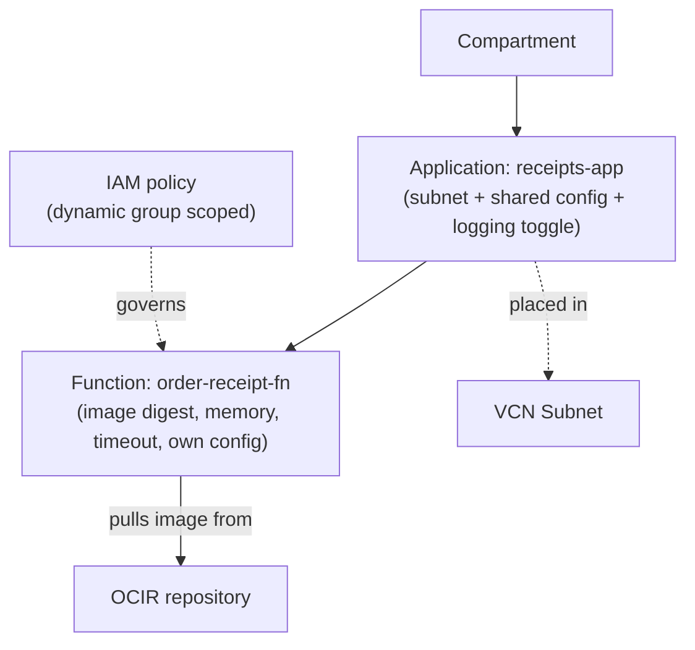
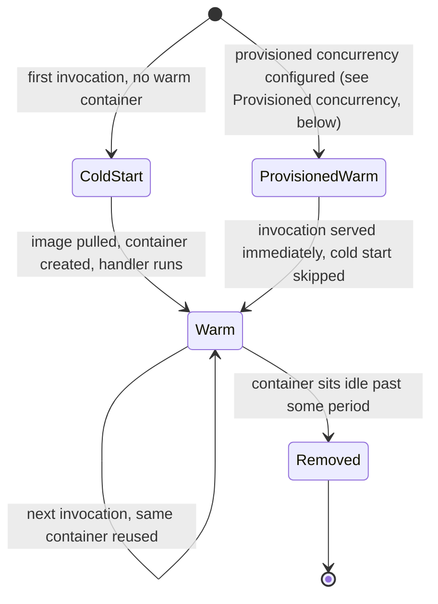
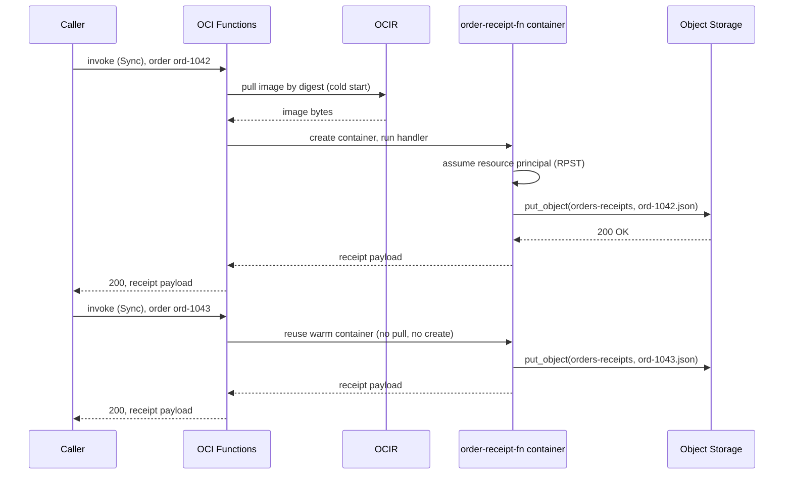

# Serverless Functions: What's Left to Configure When There's No Node

**OCI Functions** is not a smaller container platform sitting next to **OCI Kubernetes Engine (OKE)** — it is what remains once the node, the last of Module `03`'s three dials, is removed entirely. The most common misreading is to treat a function as "a tiny always-on service Oracle happens to manage" — it is *stopped*, not merely small, between invocations, and nearly every distinctive Functions behavior in this lesson follows from that one fact.

This lesson also closes a loop Module `02` opened: its own worked walkthrough contrasted a Kubernetes pod's `imagePullSecret` against a function's OCI-principal deployment — *Identity and Reach*, below, is that contrast made concrete.

---

## Contents

1. [No Node at All: Where Functions Sits on the OKE Spectrum](#1-no-node-at-all-where-functions-sits-on-the-oke-spectrum)
2. [Applications and Functions: The Boundary That Replaces the Node](#2-applications-and-functions-the-boundary-that-replaces-the-node)
3. [From Source to Deployed Function: FDK, Fn Project, and the Image](#3-from-source-to-deployed-function-fdk-fn-project-and-the-image)
4. [Invocation: The Paths In and the Timeouts Behind Them](#4-invocation-the-paths-in-and-the-timeouts-behind-them)
5. [Identity and Reach: Resource Principals, Policy, and the Subnet](#5-identity-and-reach-resource-principals-policy-and-the-subnet)
6. [Worked Walkthrough: One Invocation, Cold to Warm](#6-worked-walkthrough-one-invocation-cold-to-warm)
7. [Limits and Sources](#7-limits-and-sources)
8. [Summary](#8-summary)

---

## 1. No Node at All: Where Functions Sits on the OKE Spectrum

### 1.1 The spectrum, continued

**OCI Functions is the step past both managed and virtual nodes: no machine, no pod, no node pool at all.** Module `03` ended on a spectrum of "how much machine you see": a **managed node** is an ordinary compute instance you patch and size; a **virtual node** removes the machine but still schedules in pod-shaped units, billed per pod. The unit Oracle provisions, bills, and scales for a function is one invocation.

> Nuance: it's tempting to read "serverless function" as "an extremely small, extremely short-lived container running on someone else's Kubernetes." It is not — there is no cluster resource underneath a function, no scheduler placing it, and no node pool it draws capacity from. A function's resource model is two levels deep (application, function), not three (cluster, node pool, pod).

### 1.2 What "no node" removes, and what replaces it

A node used to answer three questions that a function still needs answered — Functions just answers each one differently:

| Question a node used to answer | OKE's answer | Functions' answer |
| :--- | :--- | :--- |
| Where does this run? (network placement) | The node's subnet | The **application**'s subnet (*Applications and Functions*, below) |
| What's its lifecycle? (always-on vs. ephemeral) | The node stays up; pods come and go on it | The **container** itself is ephemeral — cold start, warm reuse, idle teardown (*Invocation*, below) |
| Who is it, to the rest of OCI? (identity) | An instance principal, or OKE workload identity on a pod | A **resource principal** scoped to the function (*Identity and Reach*, below) |

The rest of this lesson works through the right-hand column in order.

### 1.3 OCI Functions use cases

These are the shapes a function typically fills, not an exhaustive list — each is really an instance of "no node" being the right trade rather than a limitation:

- **Event-driven backend logic** — a function reacts to something happening elsewhere in OCI (an object landing in a bucket, a row changing, a message arriving) without a service sitting idle waiting for it.
- **An API Gateway backend** — a function behind a gateway route (Module `05`) serving request/response logic without provisioning compute for it directly.
- **Scheduled automation** — a periodic task (a nightly cleanup, a report generation) invoked on a cron schedule rather than kept running (*Scheduling OCI Functions*, below).
- **A data-processing step in a larger pipeline** — one stage that transforms a message and hands it to Streaming or Queue, rather than a whole standing service built around a single transformation.

---

## 2. Applications and Functions: The Boundary That Replaces the Node

This is the first replacement *What "no node" removes, and what replaces it*, above, named: network placement, now answered by the application's subnet instead of a node's.

### 2.1 The two-level resource model

**An application is the umbrella resource a function is deployed into** — the same relationship a DevOps **project** has to its pipelines (Module `01`), except an application's job is narrower and entirely about *execution*, not delivery. Creating an application fixes three things for every function inside it: the **subnet** functions run in, a set of **configuration variables** every function can read, and whether **logging** is enabled.

```bash
# The subnet and config variables are application-level; every function created
# inside receipts-app inherits both without repeating them per function
oci fn application create \
  --compartment-id "$COMPARTMENT_OCID" \
  --display-name "receipts-app" \
  --subnet-ids '["'"$SUBNET_OCID"'"]' \
  --config '{"BUCKET_NAME": "orders-receipts", "LOG_LEVEL": "info"}'
```



*The application supplies what a node used to: a network placement and a config surface shared by everything inside it. The function underneath is where memory, timeout, and the image itself live.*

- **Isolation guarantee**: when functions belonging to *different* applications are invoked at the same time, OCI Functions keeps those executions isolated from each other — a busy function in one application cannot starve or interfere with a function in another, the same isolation boundary a Kubernetes namespace gives you, expressed as an OCI resource instead (see Limits and Sources).

### 2.2 Config resolution: application-level vs. function-level

**Function-level config overrides application-level, by key.** A function can declare its own config variables in addition to whatever its application already sets; both are read the identical way at runtime — as environment variables inside the function's process, not through a separate config-fetching call.

```bash
# BUCKET_NAME here overrides receipts-app's own BUCKET_NAME for this one
# function only; LOG_LEVEL is left to inherit from the application
oci fn function update \
  --function-id "$FUNCTION_OCID" \
  --config '{"BUCKET_NAME": "orders-receipts-canary"}'
```

> Nuance: it's easy to assume `func.yaml` (*`func.yaml` and the handler contract*, below) is where a function's configuration lives, since that's the file you edit locally. It is not — `func.yaml` holds *build and runtime metadata* (memory, timeout, the entrypoint), while config variables are a separate resource attribute set through the Console, CLI, or API and resolved at invocation time. Editing `func.yaml` and redeploying changes the image; updating config does not touch the image at all.

### 2.3 Observability toggles, and what's deferred

**The application's logging toggle is a gate, not the logging pipeline itself.** Turning it on routes a function's `stdout`/`stderr` into **OCI Logging**; tracing and metrics have their own dials layered on top. Module `10` covers what to do with all three once flowing — this lesson only needs you to know the switch exists and lives on the application, not the function.

### 2.4 Prerequisites: what must exist before an application or function can be created

Three things have to exist before `oci fn application create` succeeds at all:

- A **compartment** to hold the application.
- A **VCN and subnet** to place functions into, with a **service gateway** route out if a function needs private access to another OCI service (see *Networking*, below).
- The **dynamic-group and policy** grants (see *Identity and Reach*, below) that let a function's resource principal act once it's running.

Skip any one of the three and creation itself fails, before a single function is ever deployed.

> Note: Console users get a real shortcut here: the IAM Policy Builder ships a canned **"Functions" use case** — selecting "Let users create, deploy, and manage functions and applications" writes all the necessary policy statements in one step.

---

## 3. From Source to Deployed Function: FDK, Fn Project, and the Image

### 3.1 Three ways to get an image

**Whatever ends up deployed is, underneath, a Docker image** — Module `02`'s entire OCIR lesson applies to it unchanged. Three paths produce that image:

- **Fn Development Kit (FDK)** scaffolding — a per-language SDK from the open-source **Fn Project** that `fn init` uses to generate a handler stub, a `func.yaml`, and a Dockerfile together. The fastest path, and the one most scenarios assume.
- **An existing Docker image** — works too, provided it implements the same handler contract the FDK stub generates (read one invocation's input, write its output).
- **A custom Dockerfile** — full control over the base image and installed dependencies, while still satisfying the same contract.

```dockerfile
# Custom path: the FDK still runs inside the image, just installed by hand
# instead of scaffolded — full control over the base image and dependencies
FROM python:3.12-slim
COPY . /function
WORKDIR /function
RUN pip install --no-cache-dir -r requirements.txt fdk
ENTRYPOINT ["fdk", "func.py", "handler"]
```

**Selection:** FDK by default — fastest to a working function. An existing image when the logic already lives in a container built for another purpose and just needs the handler contract added. A custom Dockerfile when the FDK's base image is missing a system dependency or runtime version the handler needs.

### 3.2 `func.yaml` and the handler contract

**`func.yaml` is metadata — memory and timeout, not config.** It's what the FDK path generates and any path must satisfy:

```yaml
# schema_version and runtime are fixed by the FDK; memory/timeout are the two
# dials Memory and timeout, below, quantifies
schema_version: 20180708
name: order-receipt-fn
version: 0.0.1
runtime: python
entrypoint: /function/func.py handler
memory: 256
timeout: 60
```

```python
# The FDK handler contract: read the invocation body from ctx/data, return a
# response — this is the shape both an FDK-scaffolded and a bring-your-own
# image must satisfy
import io, json
from fdk import response

def handler(ctx, data: io.BytesIO = None):
    order = json.loads(data.getvalue())
    receipt = {"order_id": order["id"], "total": order["total"]}
    return response.Response(
        ctx, response_data=json.dumps(receipt),
        headers={"Content-Type": "application/json"}
    )
```

### 3.3 OCI Functions vs. open-source Fn Project

**OCI Functions is Oracle's managed deployment of the open-source Fn Project** — same handler contract, same FDKs, same `fn` command-line tool. What OCI replaces is everything *around* the handler: Fn Project's self-hosted control plane becomes OCI's managed one, an arbitrary registry becomes OCIR, and Fn's own auth becomes OCI IAM and resource principals (*Identity and Reach*, below).

```bash
# One command: build the image, push it to OCIR, and create-or-update the
# function definition to point at the new digest
fn deploy --app receipts-app --local
```

- **What's the OCI CLI for, then?** Anything that doesn't require a rebuild — the same `func.yaml` fields can be changed on the deployed function definition directly, without touching the image:

  ```bash
  # Bumps memory on the already-deployed function; no image rebuild, no fn deploy
  oci fn function update --function-id "$FUNCTION_OCID" --memory-in-mbs 512
  ```

### 3.4 Image security: deferred, not skipped

A function's image is a repository image like any other, so Module `02`'s digest-pinning and immutability tools apply to it directly. Module `09` adds two more: OCIR **scanning** for known vulnerabilities, and requiring the image be **signed** before OCI Functions will deploy it. Neither gets depth here — this lesson only needs you to know both exist.

### 3.5 Pre-built functions: when Oracle already wrote the handler

**The Pre-Built Functions catalog skips needing any build path at all.** Oracle has already written, built, and maintains the handler for a fixed set of common tasks (Console → Developer Services → Functions → Pre-Built Functions); deploying one is a configuration step, not a build step.

- **APM Log Sender** — forwards service logs to an Application Performance Monitoring domain.
- **Cost Reports FOCUS Converter** — reshapes OCI cost-report files into the FinOps Open Cost and Usage Specification.
- **Database Secret Rotation** — rotates a database credential on a schedule.
- **Object Storage** — zips or unzips objects in a bucket.

The trade is the same managed-vs-control pattern this track keeps naming: a pre-built function costs nothing to write, build, or maintain, but it only ever does exactly what Oracle built it to do — configuration parameters (a bucket name, a target APM domain) are yours to set, the handler logic isn't. Reach for the catalog when the task matches an entry exactly; reach back to *Three ways to get an image* the moment the logic needs to differ even slightly.

---

## 4. Invocation: The Paths In and the Timeouts Behind Them

This is the second replacement from that same table: a node's always-on lifecycle, replaced by the ephemeral cold-start/warm-reuse cycle this section covers.

### 4.1 Direct invoke: four doors, one authenticated call

**Every invocation is a signed call to the function's own invoke endpoint** — a per-function HTTPS URL of the shape `https://<hash>.<region>.functions.oci.oraclecloud.com/20181201/functions/<function-ocid>/actions/invoke`. Four things can produce that signed call: the OCI CLI, an OCI SDK, the Fn Project CLI, or a hand-signed HTTP request straight to the endpoint.

```bash
# OCI CLI direct invoke — the production-recommended path
oci fn function invoke \
  --function-id "$FUNCTION_OCID" \
  --file "-" \
  --body '{"id": "ord-1042", "total": 58.20}'
```

> ⚠️ The Fn Project CLI's `fn invoke` works identically for local development, but Oracle explicitly does not recommend it for production invocation — reach for the OCI CLI, an SDK, or a signed request once the caller is anything other than a developer's own terminal (see Limits and Sources).

> Nuance: it's easy to conflate "who is allowed to invoke this function" with "what this function can do once it's running." They're separate IAM questions. Invoking requires the *caller* to hold `use`/`manage` permission on the `functions-family` resource; what the function itself can subsequently reach — a bucket, a queue, another function — is governed by the function's own resource principal (*Identity and Reach*, below). A caller with invoke rights but no other grants can still trigger a function whose own permissions are much broader than the caller's.

### 4.2 Invoked by other services

A function rarely waits for a person to run a CLI command:

- **API Gateway** (Module `05`) can route a backend HTTP call straight to a function's invoke endpoint.
- An **Events** rule (Module `08`) can invoke a function the moment a matching event fires; Notifications and alarms can do the same.
- A DevOps **deployment pipeline** (Module `01`) can target a Functions *application* as an environment — but that's a **deploy**-time action, releasing a new image, not an invoke-time one. Worth remembering: a Functions environment always releases **rolling**-style, because blue-green and canary both need a standby half to switch to, and an application has none.
- A function can declare **triggers** directly on itself, bound to an Events pattern or a time-based schedule, so it fires without an external caller at all. Scheduled functions are always invoked in **Detached** mode (*Sync vs. Detached*, below) — full mechanics in *Scheduling OCI Functions*, below.

### 4.3 The container lifecycle: cold start, warm reuse, idle removal

**This is "always-on vs. ephemeral" made concrete.** The first invocation to arrive with no existing container triggers a **cold start**: OCI Functions pulls the image, creates a container, and only then runs the handler — the pull-and-create tax lands entirely on that first caller. Every invocation that follows while the container is still up reuses it directly. After the container sits idle for a period, OCI Functions removes it — the next invocation after that pays the cold-start cost again, with no fixed published idle duration to plan around.



*The default path always pays a cold start once; provisioned concurrency ("Provisioned concurrency: buying out the cold start", below) is the only way onto the branch that skips it.*

### 4.4 Sync vs. Detached: two invocation types, two timeouts

**Every invocation carries a type, and the two available types answer different questions — who waits, and how long is the function allowed to run.**

- **Sync**, the default — OCI Functions runs the request, returns an HTTP `200` and the result, and hands control back to the caller only once the function finishes.
- **Detached** — returns an HTTP `202` the moment execution *begins*, hands control back immediately, and leaves result-handling entirely to the function itself.

```bash
# Same function, Detached invocation type — control returns immediately (202),
# and the function's own execution timeout is now detachedModeTimeoutInSeconds
oci fn function invoke \
  --function-id "$FUNCTION_OCID" \
  --file "-" \
  --body '{"id": "ord-1042", "total": 58.20}' \
  --fn-invoke-type "detached"
```

> ⚠️ "Function timeout" sounds like one number, but OCI Functions tracks two distinct ones that only coincide under Sync. **Invocation timeout** is how long the *caller* waits before giving up — for the OCI CLI, the `--read-timeout` global parameter (default 60 seconds), a client-side setting unrelated to the function definition. **Execution timeout** is how long OCI Functions itself allows the function to keep running. Under Sync that's `timeoutInSeconds` from `func.yaml` (default 30s, capped at 300s). Under Detached it's the separate `detachedModeTimeoutInSeconds` field (5–3600 seconds), falling back to `timeoutInSeconds` if unset. A function can legitimately still be executing after its *caller* has already given up — that's what makes Detached the right choice for anything genuinely long-running (see Limits and Sources).

Because Detached hands result-handling to the function, it also supports **success and failure destinations**: delivering an invocation record to **Notifications**, **Queue**, or **Streaming** (Modules `06`–`08`) once the run finishes. Sync has no use for this.

### 4.5 Concurrency: the RAM-reservation ceiling

**More calls than one warm container can serve → more containers, up to a per-tenancy RAM ceiling.** A default **60 GB of RAM reserved for function execution per availability domain**, increasable on request.

- At the 128 MB default, 60 GB ≈ 61,440 MB supports roughly 61,440 ÷ 128 ≈ **480 concurrent containers**.
- Configure that same function at 1024 MB instead, and the same ceiling supports only 61,440 ÷ 1024 ≈ **60 concurrent containers** — an 8× drop from one memory setting, RAM budget unchanged.

A memory value chosen only for "will my handler fit" quietly sets a concurrency ceiling too (see Limits and Sources).

### 4.6 Memory and timeout: the two `func.yaml` dials, with real numbers

Both dials take a fixed set of values, not an arbitrary number:

- **Memory** — one of `128` (default), `256`, `512`, `1024`, `2048`, or `3072` MB. Exceeding it at runtime stops the function and logs an error; it does not throttle or degrade gracefully.
- **Timeout** — splits by invocation type: Sync defaults to 30 seconds and caps at 300; Detached ranges 5 to 3600 seconds.

**Selection** is a straight trade against *Concurrency*'s arithmetic: pick the smallest memory value the handler actually needs — both because you're billed for what you reserve, and because a smaller reservation buys more concurrent headroom out of the same RAM ceiling. Pick Sync when a caller needs the result in the same call; pick Detached the moment the work might outlast a reasonable client wait, or needs a success/failure record delivered somewhere.

### 4.7 Provisioned concurrency: buying out the cold start

**Provisioned concurrency keeps a minimum number of containers pre-started and idle-ready, so the first N calls skip the cold start.** Set in **Provisioned Concurrency Units (PCUs)**; the minimum PCU count scales *inversely* with memory:

| Memory | Minimum PCUs |
| :--- | :--- |
| 128 MB | 40 |
| 256 MB | 20 |
| 512 MB | 10 |
| 1024 MB | 10 |
| 2048 MB | 10 |
| 3072 MB | 10 |

```bash
# Reserves 20 always-warm containers at this function's configured memory —
# the first 20 concurrent invocations never pay the container-lifecycle cold-start tax
oci fn function update \
  --function-id "$FUNCTION_OCID" \
  --provisioned-concurrency '{"strategy": "CONSTANT", "count": 20}'
```

> Note: The immediate objection — if this removes the cold start, why not turn it on everywhere? Because it inverts the economics that make Functions attractive: a PCU bills continuously whether it's serving a request or not, the same standing cost this lesson's opening section contrasted against a managed node's idle time. Reach for it only where cold-start latency is genuinely unacceptable (a synchronous user-facing path) — a rarely-invoked function is exactly the case scale-to-zero billing was built for, and provisioned concurrency throws that away.

### 4.8 Scheduling OCI Functions: cron-driven, always-Detached invocation

**A Resource Schedule is its own OCI resource, separate from the function it targets** — it pairs a **cron expression** with a **resource attachment** pointing at one function (or another schedulable resource: compute instances, instance pools, Autonomous Databases).

```bash
# Attaches a cron schedule directly to a function; the function fires with no
# caller involved — invocation type is fixed to Detached, not a choice here
oci resource-scheduler schedule create \
  --compartment-id "$COMPARTMENT_OCID" \
  --display-name "nightly-receipt-rollup" \
  --action START_RESOURCE \
  --recurrence-type CRON \
  --recurrence-details "30 13 * * mon-fri" \
  --resources '[{"id": "'"$FUNCTION_OCID"'"}]'
```

- The cron expression is standard five-field syntax (`0 */2 15 * *` fires every two hours on the 15th of each month, for instance).
- **Every schedule-triggered invocation runs Detached, not a configurable choice** — there's no caller present to receive a `200` synchronously, so the function's own success/failure destination is how a scheduled run's result reaches anywhere at all.

> ⚠️ **Resource Scheduler runs entirely in UTC** and does not shift for daylight saving time — a schedule written against "9am local" silently drifts by an hour twice a year unless the cron expression itself is written in UTC from the start (see Limits and Sources).

---

## 5. Identity and Reach: Resource Principals, Policy, and the Subnet

### 5.1 The third replacement: identity

**A resource principal is what replaces a node's identity for a function.** Module `01` introduced the pattern generally — put a resource into a **dynamic group**, then grant that group access through policy, so the resource authenticates as itself rather than as a person. Module `02` named that a function's *outbound* OCIR pull uses exactly this pattern.

```text
# Matches every function in this compartment, the same rule shape Module `01`
# used for build pipelines — just a different resource.type
ALL {resource.type = 'fnfunc', resource.compartment.id = '<compartment_ocid>'}

# Grants the matched functions write access to exactly one bucket
Allow dynamic-group fn-receipts-dg to manage objects in compartment orders \
  where all {target.bucket.name = 'orders-receipts'}
```

> ⚠️ It's tempting to assume "resource principal" means access is simply *there* once the policy exists, the way a build pipeline's registry push needed no extra step in your own code. A function is different — the policy only authorizes the identity; your handler still has to explicitly *assume* it at runtime by calling the SDK's signer. Skip that call, and the policy grant sits unused no matter how correct it is.

```python
# Assumes the function's resource-principal identity, then uses it exactly
# like any other OCI SDK client — no Auth Token, no stored credential
import oci

signer = oci.auth.signers.get_resource_principals_signer()
object_storage = oci.object_storage.ObjectStorageClient({}, signer=signer)
namespace = object_storage.get_namespace().data
object_storage.put_object(namespace, "orders-receipts", "ord-1042.json", receipt_bytes)
```

Underneath that call sits a **Resource Principal Session Token (RPST)** — a signed token the runtime hands the SDK, cached for roughly 15 minutes. A policy change granting or revoking access does not take effect on a running function until that cache turns over, so a permission fix can appear to "not be working" for up to 15 minutes after it was applied (see Limits and Sources).

### 5.2 Networking: the subnet decides what a function can reach

**The application's subnet, set once at creation, decides what every function inside it can reach while running.**

- A function in a subnet with a path to a **Database as a Service** instance can reach it directly.
- Reaching Object Storage or another OCI service needs the subnet to route through a **service gateway** rather than the public internet — the standard OCI pattern for private access to Oracle-managed services from inside a VCN.

> Note: Best practice is a **regional subnet** rather than one tied to a single availability domain. OCI Functions' own control and data planes are spread across availability and fault domains for resiliency. A regional subnet lets a function keep running in another domain if one becomes unavailable — a subnet pinned to a single domain goes down with it instead (see Limits and Sources).

### 5.3 Container permissions: what the process itself can do

**The resource principal governs what a function can reach *in OCI*; container permissions govern what the process can do *on its own host* — an orthogonal control.** Every function container starts as a fixed unprivileged user — `fn`, UID and GID 1000 — with none of Docker's default Linux capabilities granted, so the container cannot escalate privileges even if the image itself tries to run as root (see Limits and Sources).

> Nuance: an unprivileged, capability-stripped container still needs *somewhere* to write scratch files — a handler that shells out to a tool expecting a writable working directory would otherwise fail outright. `/tmp` is that one exception: always writable, sized against the function's own configured memory (*Memory and timeout*, above), so a function given more memory also gets more `/tmp` scratch space as a side effect of that same dial.

---

## 6. Worked Walkthrough: One Invocation, Cold to Warm

This traces `order-receipt-fn` end to end, picking up right where *The third replacement: identity* left the resource principal and the bucket grant in place. It also shows what changes on a *second* call that arrives while the first container is still warm.

1. **The call arrives.** `oci fn function invoke` (*Direct invoke*) sends a signed Sync request to `order-receipt-fn`'s invoke endpoint with `{"id": "ord-1042", "total": 58.20}`.
2. **No warm container exists.** OCI Functions pulls `order-receipt-fn`'s image by digest from OCIR — the same registry and digest-pinning discipline Module `02` built — and creates a container: the cold start from *The container lifecycle*.
3. **The handler runs.** The FDK-shaped Python handler from *`func.yaml` and the handler contract* parses the order and builds the receipt payload.
4. **The resource principal is assumed.** The handler calls `get_resource_principals_signer()`; the runtime hands back an RPST scoped to `order-receipt-fn`'s dynamic group membership.
5. **The write happens.** Using that signer, the handler calls Object Storage's `put_object`, authorized by the policy grant on `orders-receipts` — no Auth Token, no Kubernetes-style pull secret.
6. **The response returns.** OCI Functions returns `200` and the receipt payload to the caller; control returns with it, because this was a Sync invocation.
7. **A second order lands seconds later.** The same container is still warm — no image pull, no container creation, straight to the handler. Steps 2–3 are skipped entirely; only steps 3(handler)–6 repeat.



*The first call pays every cost this lesson's "no node" premise removed a machine's help with — image pull, container creation, identity assumption. The second call, on the same warm container, pays only the last of those three again.*

Had `order-receipt-fn` been invoked with `--fn-invoke-type detached` instead, step 6 would look different: the caller would receive `202` immediately after step 2 begins, and the receipt payload from step 5 would instead go to whatever success destination (*Sync vs. Detached*) was configured — a Streaming or Queue write, not a direct response.

---

## 7. Limits and Sources

| Limit | What it forces | As-of + docs |
| :--- | :--- | :--- |
| Memory is a fixed set — `128` (default), `256`, `512`, `1024`, `2048`, `3072` MB | Exceeding it at runtime stops the function outright, no throttling | Jul 2026, [docs](https://docs.oracle.com/en-us/iaas/Content/Functions/Tasks/functionscustomizing.htm) |
| Sync timeout defaults to 30s, caps at 300; Detached ranges 5–3600s, falls back to Sync value if unset | Always confirm which invocation type is in play before reasoning about "the" timeout | Jul 2026, [docs](https://docs.oracle.com/en-us/iaas/Content/Functions/Tasks/functionsinvokingfunctions.htm) |
| Concurrency is capped by a per-AD RAM reservation (default 60 GB), not a request-count quota | A larger per-invocation memory setting shrinks how many concurrent invocations the same budget supports | Jul 2026, [docs](https://docs.oracle.com/en-us/iaas/Content/Functions/Concepts/functionsavailability.htm) |
| Provisioned concurrency has a memory-dependent minimum: 40 PCUs at 128 MB down to 10 at 512 MB+ | Every PCU bills continuously whether invoked or not — the opposite of scale-to-zero economics | Jul 2026, [docs](https://docs.oracle.com/en-us/iaas/Content/Functions/Tasks/functionsusingprovisionedconcurrency.htm) |
| The Fn Project CLI (`fn invoke`) isn't recommended for production invocation | Use the OCI CLI, an SDK, or a signed request instead | Jul 2026, [docs](https://docs.oracle.com/en-us/iaas/Content/Functions/Tasks/functionsinvokingfunctions.htm) |
| The RPST caches for roughly 15 minutes | A policy fix can appear to fail for up to that long after being applied | Jul 2026, [docs](https://docs.oracle.com/en-us/iaas/Content/Functions/Tasks/functionsaccessingociresources.htm) |
| Resource Scheduler runs in UTC only, no daylight-saving adjustment | A schedule meant for local wall-clock time must be written in UTC from the start | Jul 2026, [docs](https://docs.oracle.com/en-us/iaas/Content/resource-scheduler/tasks/create-manage.htm) |
| Pre-Built Functions: configuration is yours, handler logic is fixed | The moment the task needs to differ from a catalog entry, it's back to a build path | Jul 2026, [docs](https://docs.oracle.com/en-us/iaas/Content/Functions/Tasks/functions_pbf_catalog.htm) |
| OCI Functions isolates execution across different applications | Don't add your own rate-limiting or separate compartments purely to stop cross-tenant interference — the isolation already exists at the application boundary | Jul 2026, [docs](https://docs.oracle.com/en-us/iaas/Content/Functions/Concepts/functionsavailability.htm) |
| A regional subnet, not an AD-specific one, is best practice for a Functions application | Default to a regional subnet when creating a Functions application — an AD-specific choice made early is what you'd otherwise have to redo later | Jul 2026, [docs](https://docs.oracle.com/en-us/iaas/Content/Functions/Concepts/functionsavailability.htm) |
| Every function container runs as a fixed unprivileged user (`fn`, UID/GID 1000) with no Docker Linux capabilities granted | Don't rely on running as root anywhere in your image — the platform strips that possibility regardless of what the Dockerfile requests | Jul 2026, [docs](https://docs.oracle.com/en-us/iaas/Content/Functions/Tasks/functionsrunningasunprivileged.htm) |

> Note: A resource principal grant is inert until your own code assumes it (covered inline at *The third replacement: identity*). Idle-container teardown has no fixed published duration — don't design around a specific "warm for N minutes" number. A Functions deployment-pipeline environment always releases rolling-style, the same instance-group constraint Module `01` named, since there's no standby half to switch to. **Container Instances** is a fourth point on this spectrum, not covered here: a single always-on container with no cluster and no Functions-style scale-to-zero — worth knowing it exists as the middle ground between a virtual node and a function.

---

## 8. Summary

OCI Functions removes the node entirely, and every distinctive behavior in this lesson traces back to that one fact. The **application** takes over the node's placement job: subnet, shared config, and an isolation boundary between applications. The individual **function** underneath carries its own image, memory, and timeout. Where a node used to provide an always-on host, a function's container is ephemeral by design instead — a cold start on first demand, warm reuse while traffic keeps arriving, and removal after it stops.

Invocation splits along two axes: *how* a call arrives — directly via CLI/SDK/HTTP, or triggered by another service — and *which type* it specifies, Sync or Detached. Concurrency and memory share one ceiling, a per-availability-domain RAM reservation that a function's own memory setting divides into. Provisioned concurrency is the deliberate, continuously-billed trade against ever paying that cold start.

The identity story is the sharpest contrast with everything Module `03` covered: no Kubernetes-style secret, no node-level credential. A function assumes a **resource principal** in its own code instead, authorized through the same dynamic-group-and-policy pattern Module `01` used for build pipelines and Module `02` used for OCIR pushes. Module `05`'s API Gateway is the next place this exact function gets invoked from, this time fronted by a gateway route rather than a bare CLI call; Module `09` returns to the image this lesson built for the scanning and signing depth deferred earlier.
