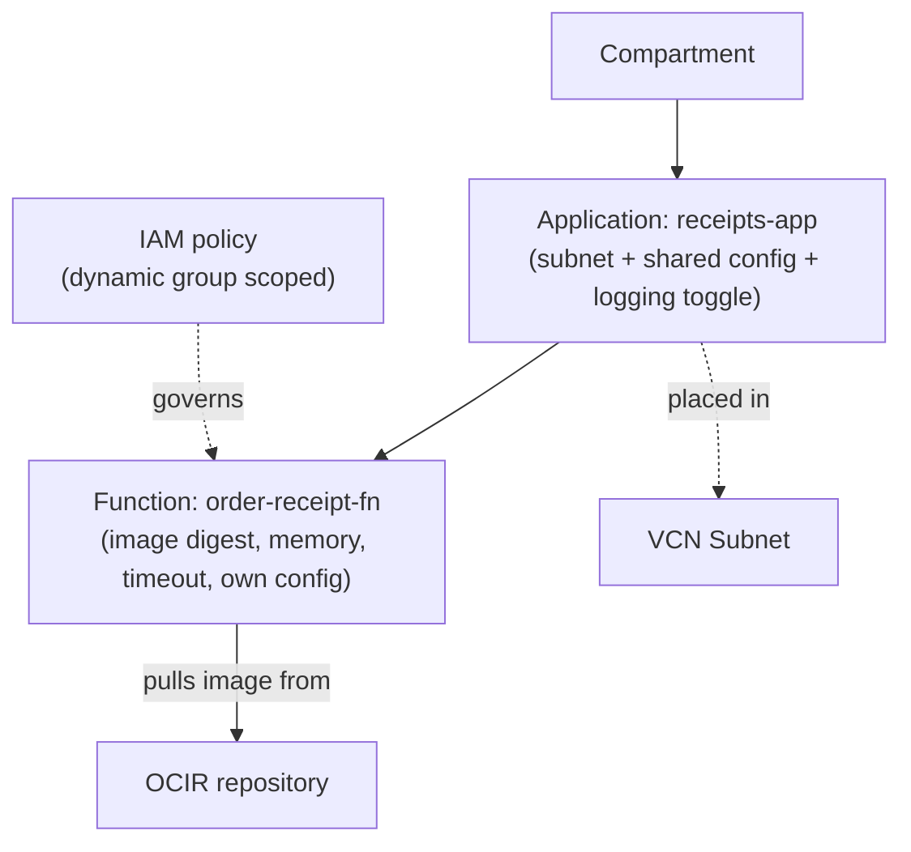
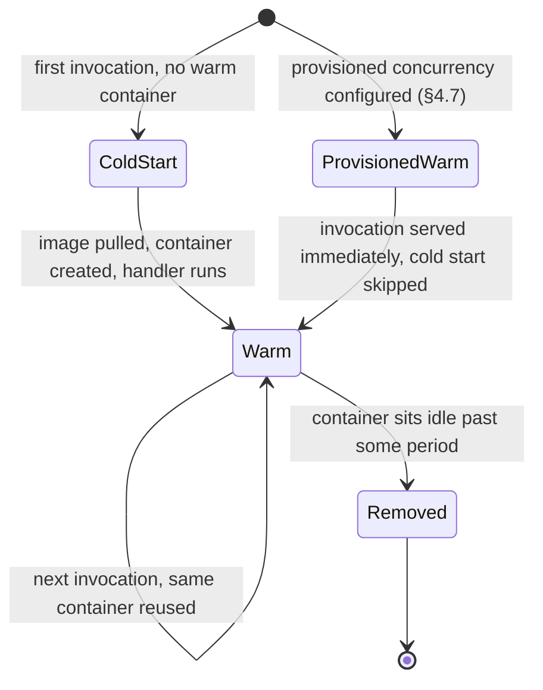
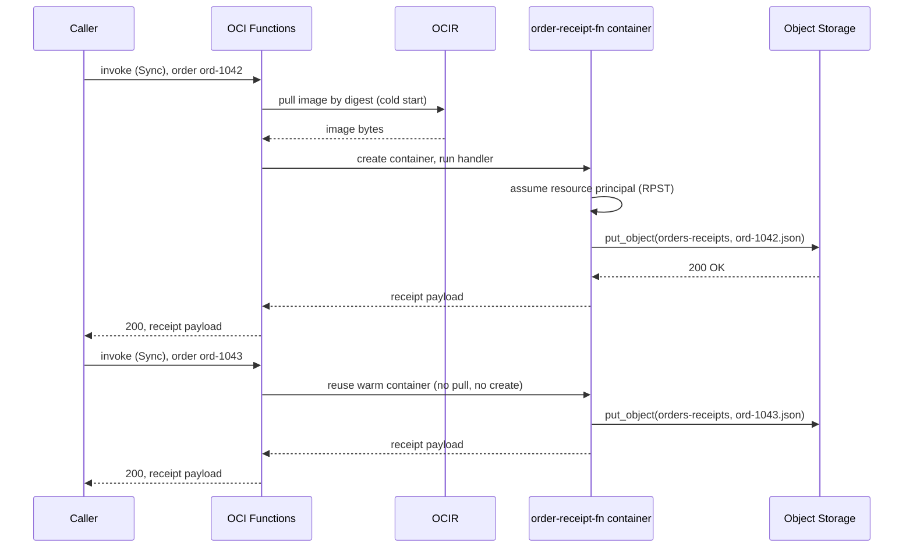

# Serverless Functions: What's Left to Configure When There's No Node

**OCI Functions** is not a smaller container platform sitting next to **OCI Kubernetes Engine (OKE)** — it is what remains once the node, the last of Module `03`'s three dials, is removed entirely. There is no cluster resource, no node pool, and no pod scheduler underneath a function; the unit Oracle bills and runs is a single invocation. The most common misreading is to treat a function as "a tiny always-on service Oracle happens to manage" — it is *stopped*, not merely small, between invocations, and nearly every distinctive Functions behavior in this lesson follows from that one fact. This lesson also closes a loop Module `02` opened: its own worked walkthrough contrasted a Kubernetes pod's `imagePullSecret` against "a function's deployment authenticates as a first-class OCI principal under ordinary IAM policy... there is no Kubernetes-style pull secret to wire up at all" — §5 below is that contrast made concrete.

---

## Contents

1. [No Node at All: Where Functions Sits on the OKE Spectrum](#1-no-node-at-all-where-functions-sits-on-the-oke-spectrum)
2. [Applications and Functions: The Boundary That Replaces the Node](#2-applications-and-functions-the-boundary-that-replaces-the-node)
3. [From Source to Deployed Function: FDK, Fn Project, and the Image](#3-from-source-to-deployed-function-fdk-fn-project-and-the-image)
4. [Invocation: The Paths In and the Timeouts Behind Them](#4-invocation-the-paths-in-and-the-timeouts-behind-them)
5. [Identity and Reach: Resource Principals, Policy, and the Subnet](#5-identity-and-reach-resource-principals-policy-and-the-subnet)
6. [Worked Walkthrough: One Invocation, Cold to Warm](#6-worked-walkthrough-one-invocation-cold-to-warm)
7. [Practical Limits and Trade-offs](#7-practical-limits-and-trade-offs)
8. [Summary](#8-summary)

---

## 1. No Node at All: Where Functions Sits on the OKE Spectrum

### 1.1 The spectrum, continued

Module `03` ended on a spectrum of "how much machine you see": a **managed node** is an ordinary compute instance you patch and size; a **virtual node** removes the machine but still schedules in pod-shaped units, billed per pod. OCI Functions is the next step past both — there is no machine, no pod, and no node pool at all. The unit Oracle provisions, bills, and scales is one function invocation.

> Nuance: it is tempting to read "serverless function" as "an extremely small, extremely short-lived container running on someone else's Kubernetes." It is not — there is no cluster resource underneath a function, no scheduler placing it, and no node pool it draws capacity from. A function's resource model is two levels deep (application, function), not three (cluster, node pool, pod), and that shallower model is why §2 through §5 look nothing like Module `03`'s cluster mechanics.

### 1.2 What "no node" removes, and what replaces it

A node used to answer three questions that a function still needs answered — Functions just answers each one differently, and each replacement gets its own section below:

| Question a node used to answer | OKE's answer | Functions' answer |
| :--- | :--- | :--- |
| Where does this run? (network placement) | The node's subnet | The **application**'s subnet (§2) |
| What's its lifecycle? (always-on vs. ephemeral) | The node stays up; pods come and go on it | The **container** itself is ephemeral — cold start, warm reuse, idle teardown (§4) |
| Who is it, to the rest of OCI? (identity) | An instance principal, or OKE workload identity on a pod | A **resource principal** scoped to the function (§5) |

This is also the fastest way to answer "how is Functions different from a virtual node, which also removes the machine": a virtual node still has a Kubernetes pod, a node-pool-shaped identity option (workload identity), and no billed idle time only *while running* — a function has none of those three even conceptually. The rest of this lesson works through the right-hand column in order.

### 1.3 OCI Functions use cases

These are the shapes a function typically fills, not an exhaustive list — each one is really an instance of "no node" being the right trade rather than a limitation. **Event-driven backend logic**: a function reacts to something happening elsewhere in OCI — an object landing in a bucket, a row changing, a message arriving — without a service sitting idle waiting for it. **An API Gateway backend**: a function behind a gateway route (Module `05`) serving request/response logic without provisioning compute for it directly. **Scheduled automation**: a periodic task — a nightly cleanup, a report generation — invoked on a cron schedule rather than kept running (§4.8). **A data-processing step in a larger pipeline**: one stage that transforms a message and hands it to Streaming or Queue (§4.4's success destinations), rather than a whole standing service built around a single transformation.

---

## 2. Applications and Functions: The Boundary That Replaces the Node

### 2.1 The two-level resource model

Section 1 named the **application** as the answer to "where does this run"; this section is that answer in full. An **application** is the umbrella resource a function is deployed into — the same relationship a DevOps **project** has to its pipelines (Module `01` §4.1), except an application's job is narrower and entirely about *execution*, not delivery. Creating an application fixes three things for every function inside it: the **subnet** functions run in, a set of **configuration variables** every function in the application can read, and whether **logging** is enabled at all.

```bash
# The subnet and config variables are application-level; every function created
# inside receipts-app inherits both without repeating them per function
oci fn application create \
  --compartment-id "$COMPARTMENT_OCID" \
  --display-name "receipts-app" \
  --subnet-ids '["'"$SUBNET_OCID"'"]' \
  --config '{"BUCKET_NAME": "orders-receipts", "LOG_LEVEL": "info"}'
```



*The application supplies what a node used to: a network placement and a config surface shared by everything inside it. The function underneath is where memory, timeout, and the image itself live.*

Oracle also uses the application boundary as an **isolation** guarantee: when functions belonging to *different* applications are invoked at the same time, OCI Functions keeps those executions isolated from each other (as of Jul 2026, [docs](https://docs.oracle.com/en-us/iaas/Content/Functions/Concepts/functionsavailability.htm)) — a busy function in one application cannot starve or interfere with a function in another, the same isolation boundary a Kubernetes namespace gives you, expressed as an OCI resource instead.

### 2.2 Config resolution: application-level vs. function-level

A function can declare its own config variables in addition to whatever its application already sets; both are read the identical way at runtime — as environment variables inside the function's process, not through a separate config-fetching call. Function-level values with the same key **override** the application's:

```bash
# BUCKET_NAME here overrides receipts-app's own BUCKET_NAME for this one
# function only; LOG_LEVEL is left to inherit from the application
oci fn function update \
  --function-id "$FUNCTION_OCID" \
  --config '{"BUCKET_NAME": "orders-receipts-canary"}'
```

> Nuance: it's easy to assume `func.yaml` (§3.2) is where a function's configuration lives, since that's the file you edit locally. It is not — `func.yaml` holds *build and runtime metadata* (memory, timeout, the entrypoint), while config variables are a separate resource attribute set through the Console, CLI, or API and resolved at invocation time. Editing `func.yaml` and redeploying changes the image; updating config does not touch the image at all.

### 2.3 Observability toggles, and what's deferred

The application's logging toggle is a gate, not the logging pipeline itself: turning it on routes a function's `stdout`/`stderr` into **OCI Logging**, and tracing and metrics have their own dials layered on top. Module `10` covers what to do with all three once they're flowing; this lesson only needs you to know the switch exists and lives on the application, not the function.

### 2.4 Prerequisites: what must exist before an application or function can be created

*Identity and Reach* (below) builds the mechanics of identity and networking individually; this is the checklist view of what has to already exist before `oci fn application create` (§2.1) succeeds at all. A **compartment** to hold the application; a **VCN and subnet** for it to place functions into (with a **service gateway** route out if a function needs private access to another OCI service — the *Networking* sub-section covers what that actually reaches); and the **dynamic-group and policy** grants (the *identity* sub-section) that let a function's resource principal act once it's running. Skip any one of the three and creation itself fails, before a single function is ever deployed.

Console users get a real shortcut here worth knowing: the IAM Policy Builder ships a canned **"Functions" use case** — selecting "Let users create, deploy, and manage functions and applications" writes all of the necessary policy statements in one step, rather than composing them by hand.

---

## 3. From Source to Deployed Function: FDK, Fn Project, and the Image

### 3.1 Three ways to get an image

Section 1 skipped over the function itself; this section is that dial in full. Whatever ends up deployed is, underneath, a Docker image — Module `02`'s entire OCIR lesson applies to it unchanged. Three paths produce that image. Scaffolding with the **Fn Development Kit (FDK)** — a per-language SDK from the open-source **Fn Project** that `fn init` uses to generate a handler stub, a `func.yaml`, and a Dockerfile together — is the fastest path and the one most exam scenarios assume. Bringing an **existing Docker image** works too, provided it implements the same handler contract the FDK stub generates (read one invocation's input, write its output). A **custom Dockerfile** gives full control over the base image and installed dependencies while still needing to satisfy that same contract.

Reach for the FDK path by default — it's the fastest way to a working function and the shape most exam scenarios assume. Reach for an existing image when the logic already lives in a container built for another purpose and just needs the handler contract added. Reach for a custom Dockerfile when the FDK's base image is missing a system dependency or runtime version the handler needs — the one case where scaffolding gets in the way rather than saving time.

```dockerfile
# Custom path: the FDK still runs inside the image, just installed by hand
# instead of scaffolded — full control over the base image and dependencies
FROM python:3.12-slim
COPY . /function
WORKDIR /function
RUN pip install --no-cache-dir -r requirements.txt fdk
ENTRYPOINT ["fdk", "handler.py", "handler"]
```

### 3.2 `func.yaml` and the handler contract

`func.yaml` is the metadata contract the FDK path generates and any path must satisfy — it is where memory and timeout live, not the config variables from §2.2:

```yaml
# schema_version and runtime are fixed by the FDK; memory/timeout are the two
# dials this lesson's §4.6 quantifies
schema_version: 20180708
name: order-receipt-fn
version: 0.0.1
runtime: python
entrypoint: /function/func.py handler
memory: 256
timeout: 60
```

```python
# The FDK handler contract: read the invocation body from ctx/data, return a
# response — this is the shape both an FDK-scaffolded and a bring-your-own
# image must satisfy
import io, json
from fdk import response

def handler(ctx, data: io.BytesIO = None):
    order = json.loads(data.getvalue())
    receipt = {"order_id": order["id"], "total": order["total"]}
    return response.Response(
        ctx, response_data=json.dumps(receipt),
        headers={"Content-Type": "application/json"}
    )
```

### 3.3 OCI Functions vs. open-source Fn Project

OCI Functions is Oracle's managed deployment of the open-source **Fn Project** — same handler contract, same FDKs, same `fn` command-line tool. What OCI replaces is everything *around* the handler: Fn Project's self-hosted control plane becomes OCI's managed one, an arbitrary registry becomes OCIR, and Fn's own auth becomes OCI IAM and resource principals (§5). One command does the whole build-push-deploy sequence on top of that:

```bash
# One command: build the image, push it to OCIR, and create-or-update the
# function definition to point at the new digest
fn deploy --app receipts-app --local
```

The follow-up question this invites: if `fn deploy` handles the image, what's the OCI CLI for? Anything that doesn't require a rebuild — the same `func.yaml` fields from §3.2 can be changed on the deployed function definition directly, without touching the image at all:

```bash
# Bumps memory on the already-deployed function; no image rebuild, no fn deploy
oci fn function update --function-id "$FUNCTION_OCID" --memory-in-mbs 512
```

### 3.4 Image security: deferred, not skipped

A function's image is a repository image like any other, so Module `02`'s digest-pinning and immutability tools apply to it directly, and Module `09` adds two more: OCIR **scanning** the image for known vulnerabilities, and requiring the image be **signed** before OCI Functions will deploy it. Neither gets depth here — this lesson only needs you to know both exist and reach the same image this section just built.

### 3.5 Pre-built functions: when Oracle already wrote the handler

§3.1 named three ways to get an image — FDK, existing image, custom Dockerfile — all of which end with *your* code in the container. The **Pre-Built Functions catalog** (Console → Developer Services → Functions → Pre-Built Functions) is a fourth path that skips needing any of the three: Oracle has already written, built, and maintains the handler for a fixed set of common tasks, and deploying one is a configuration step, not a build step. Real catalog entries ground what "common tasks" means concretely: an **APM Log Sender** function that forwards service logs to an Application Performance Monitoring domain, a **Cost Reports FOCUS Converter** that reshapes OCI cost-report files into the FinOps Open Cost and Usage Specification, **Database Secret Rotation** functions that rotate a database credential on a schedule, and **Object Storage** functions that zip or unzip objects in a bucket (as of Jul 2026, [docs](https://docs.oracle.com/en-us/iaas/Content/Functions/Tasks/functions_pbf_catalog.htm)).

The trade is the same managed-vs-control pattern this track keeps naming for other services: a pre-built function costs nothing to write, build, or maintain, but it only ever does exactly what Oracle built it to do — configuration parameters (a bucket name, a target APM domain) are yours to set, but the handler logic itself is not. Reach for the catalog when the task matches one of these entries exactly; reach back to §3.1's own build paths the moment the logic needs to differ even slightly from what's on the shelf.

---

## 4. Invocation: The Paths In and the Timeouts Behind Them

### 4.1 Direct invoke: four doors, one authenticated call

Section 1's second row named the function's *lifecycle*; before that lifecycle can be described, it needs a trigger — this section covers what starts it. Every invocation, however it arrives, is a signed call to the function's own **invoke endpoint** — a per-function HTTPS URL of the shape `https://<hash>.<region>.functions.oci.oraclecloud.com/20181201/functions/<function-ocid>/actions/invoke`. Four things can produce that signed call: the OCI CLI, an OCI SDK, the Fn Project CLI, or a hand-signed HTTP request straight to the endpoint.

```bash
# OCI CLI direct invoke — the production-recommended path
oci fn function invoke \
  --function-id "$FUNCTION_OCID" \
  --file "-" \
  --body '{"id": "ord-1042", "total": 58.20}'
```

> Nuance: the Fn Project CLI's `fn invoke` works identically for local development, but Oracle explicitly does not recommend it for production invocation (as of Jul 2026, [docs](https://docs.oracle.com/en-us/iaas/Content/Functions/Tasks/functionsinvokingfunctions.htm)) — reach for the OCI CLI, an SDK, or a signed request once the caller is anything other than a developer's own terminal.

Whichever door a caller uses, the IAM question it answers is narrower than it looks.

> Nuance: it's easy to conflate "who is allowed to invoke this function" with "what this function can do once it's running." They're separate IAM questions. Invoking requires the *caller* to hold `use`/`manage` permission on the `functions-family` resource; what the function itself can subsequently reach — a bucket, a queue, another function — is governed by the function's own resource principal, covered in §5. A caller with invoke rights but no other grants can still trigger a function whose own permissions are much broader than the caller's.

### 4.2 Invoked by other services

A function rarely waits for a person to run a CLI command. **API Gateway** (Module `05`) can route a backend HTTP call straight to a function's invoke endpoint. An **Events** rule (Module `08`) can invoke a function the moment a matching event fires. Notifications and alarms can do the same.

Distinct from all of these: a DevOps **deployment pipeline** (Module `01` §4.5) can target a Functions *application* as an environment — but that's a **deploy**-time action, releasing a new image, not an invoke-time one. Don't conflate "what deploys this function" with "what invokes it." Worth remembering from that same Module `01` table: a Functions environment always releases **rolling**-style, because blue-green and canary both need a standby half to switch to, and an application has none.

A function can also declare **triggers** directly on itself — zero, one, or several — each bound to an Events pattern or a time-based schedule, so the function fires without an external caller at all. Scheduled functions are always invoked in **Detached** mode (§4.4) for a reason that will make sense once that section defines what Detached means: a schedule has no caller sitting around to receive a synchronous response — the full scheduling mechanics are in §4.8, once Detached and provisioned concurrency are both on the table.

### 4.3 The container lifecycle: cold start, warm reuse, idle removal

This is the "always-on vs. ephemeral" row from §1.2 made concrete. The first invocation to arrive with no existing container triggers a **cold start**: OCI Functions pulls the image, creates a container, and only then runs the handler — the pull-and-create tax lands entirely on that first caller. Every invocation that follows while the container is still up reuses it directly, skipping the pull and the container creation. After the container sits idle for a period, OCI Functions removes it — the next invocation after that point pays the cold-start cost again, with no fixed published idle duration to plan around; treat "how long a container stays warm" as variable, not a number to hard-code into a design.



*The default path always pays a cold start once; provisioned concurrency (§4.7) is the only way onto the branch that skips it.*

### 4.4 Sync vs. Detached: two invocation types, two timeouts

Every invocation carries an invocation **type**, and the two available types answer a different question each: who waits, and how long is the function allowed to run? **Sync**, the default, is what §4.1's example used — OCI Functions runs the request, returns an HTTP `200` and the result, and hands control back to the caller only once the function finishes. **Detached** returns an HTTP `202` the moment execution *begins*, hands control back immediately, and leaves result-handling entirely to the function itself.

```bash
# Same function, Detached invocation type — control returns immediately (202),
# and the function's own execution timeout is now detachedModeTimeoutInSeconds
oci fn function invoke \
  --function-id "$FUNCTION_OCID" \
  --file "-" \
  --body '{"id": "ord-1042", "total": 58.20}' \
  --fn-invoke-type "detached"
```

> Nuance: "function timeout" sounds like one number, but OCI Functions tracks two distinct ones that only coincide under Sync. **Invocation timeout** is how long the *caller* waits before giving up — for the OCI CLI, that's the `--read-timeout` global parameter (default 60 seconds), a client-side setting having nothing to do with the function definition. **Execution timeout** is how long OCI Functions itself allows the function to keep running before killing it. Under Sync that's `timeoutInSeconds` from `func.yaml` (default 30s, capped at 300s). Under Detached it's the separate `detachedModeTimeoutInSeconds` field (5–3600 seconds) instead, falling back to that same `timeoutInSeconds` value if left unset. A function can legitimately still be executing after its *caller* has already given up — that's what makes Detached the right choice for anything genuinely long-running (as of Jul 2026, [docs](https://docs.oracle.com/en-us/iaas/Content/Functions/Tasks/functionsinvokingfunctions.htm)).

Because Detached hands result-handling to the function, it also supports something Sync has no use for: **success and failure destinations**, delivering an invocation record to the **Notifications**, **Queue**, or **Streaming** service once the run finishes — the exact three services Modules `06`–`08` cover, reached here from the invocation side rather than the messaging side.

### 4.5 Concurrency: the RAM-reservation ceiling

When more calls arrive than one warm container can serve, OCI Functions scales the *same* way §4.3's cold start already implied — it starts additional containers, up to a ceiling set for the tenancy: a default **60 GB of RAM reserved for function execution per availability domain**, increasable on request (as of Jul 2026, [docs](https://docs.oracle.com/en-us/iaas/Content/Functions/Concepts/functionsavailability.htm)).

That ceiling is not an abstract cap — the memory a single function reserves determines how many concurrent containers fit inside it. At the 128 MB default, 60 GB ≈ 61,440 MB supports roughly 61,440 ÷ 128 ≈ **480 concurrent containers**. Configure that same function at 1024 MB instead, and the same 60 GB ceiling supports only 61,440 ÷ 1024 ≈ **60 concurrent containers** — an 8× drop from one memory setting, with the RAM budget itself unchanged. A memory value chosen only for "will my handler fit" quietly sets a concurrency ceiling too.

### 4.6 Memory and timeout: the two `func.yaml` dials, with real numbers

Both dials from §3.2 take a fixed set of values, not an arbitrary number. **Memory** is one of `128` (the default), `256`, `512`, `1024`, `2048`, or `3072` MB — exceeding it at runtime stops the function and logs an error, it does not throttle or degrade gracefully (as of Jul 2026, [docs](https://docs.oracle.com/en-us/iaas/Content/Functions/Tasks/functionscustomizing.htm)). **Timeout** splits by invocation type exactly as §4.4 described: Sync defaults to 30 seconds and caps at 300; Detached ranges from 5 to 3600 seconds.

Selection is a straight trade against §4.5's arithmetic: pick the smallest memory value the handler actually needs, both because you're billed for what you reserve and because a smaller reservation buys more concurrent headroom out of the same RAM ceiling. Pick Sync when a caller needs the result in the same call; pick Detached the moment the work might outlast a reasonable client wait, or needs a success/failure record delivered somewhere rather than returned directly.

### 4.7 Provisioned concurrency: buying out the cold start

Section 4.3's cold start is the default; **provisioned concurrency** is how you pay to skip it, by keeping a minimum number of containers pre-started and idle-ready rather than created on first demand. It's set in **Provisioned Concurrency Units (PCUs)**, and the minimum PCU count you can request scales *inversely* with memory — a smaller function needs more pre-started containers to reserve the same effective capacity:

| Memory | Minimum PCUs |
| :--- | :--- |
| 128 MB | 40 |
| 256 MB | 20 |
| 512 MB | 10 |
| 1024 MB | 10 |
| 2048 MB | 10 |
| 3072 MB | 10 |

(As of Jul 2026, [docs](https://docs.oracle.com/en-us/iaas/Content/Functions/Tasks/functionsusingprovisionedconcurrency.htm).)

```bash
# Reserves 20 always-warm containers at this function's configured memory —
# the first 20 concurrent invocations never pay the §4.3 cold-start tax
oci fn function update \
  --function-id "$FUNCTION_OCID" \
  --provisioned-concurrency '{"strategy": "CONSTANT", "count": 20}'
```

The objection this invites immediately: if provisioned concurrency removes the cold start, why not turn it on everywhere? Because it inverts the economics that make Functions attractive in the first place — a PCU is reserved and billed continuously whether it's serving a request or not, the same standing cost §1 contrasted against a managed node's idle time. Reach for it only where cold-start latency is genuinely unacceptable (a synchronous user-facing path), not as a default; a rarely-invoked function is exactly the case scale-to-zero billing was built for, and provisioned concurrency throws that away.

### 4.8 Scheduling OCI Functions: cron-driven, always-Detached invocation

§4.2 named scheduling as a way a function fires with no external caller at all; this is that mechanism in full, and it deliberately lands here rather than earlier — it needs both Detached (§4.4) and provisioned concurrency (§4.7) already on the table to make complete sense. A **Resource Schedule** is its own OCI resource, separate from the function it targets: it pairs a **cron expression** with a **resource attachment** pointing at one function (or another schedulable resource — compute instances, instance pools, and Autonomous Databases are also supported).

```bash
# Attaches a cron schedule directly to a function; the function fires with no
# caller involved — invocation type is fixed to Detached, not a choice here
oci resource-scheduler schedule create \
  --compartment-id "$COMPARTMENT_OCID" \
  --display-name "nightly-receipt-rollup" \
  --action START_RESOURCE \
  --recurrence-type CRON \
  --recurrence-details "30 13 * * mon-fri" \
  --resources '[{"id": "'"$FUNCTION_OCID"'"}]'
```

The cron expression is the standard five-field syntax (`0 */2 15 * *` fires every two hours on the 15th of each month, for instance), with one caveat worth internalizing before it causes a real incident: **Resource Scheduler runs entirely in UTC** and does not shift for daylight saving time — a schedule written against "9am local" silently drifts by an hour twice a year unless the cron expression itself is written in UTC from the start.

Every schedule-triggered invocation runs **Detached**, not a configurable choice: there is no caller present to receive a `200` and its payload synchronously, so the function's own success/failure destination (§4.4) — not a returned HTTP response — is how a scheduled run's result reaches anywhere at all.

---

## 5. Identity and Reach: Resource Principals, Policy, and the Subnet

### 5.1 The third replacement: identity

Section 1.2's last row named a **resource principal** as what replaces a node's identity. Module `01` §4.1 already introduced the pattern generally — put a resource into a **dynamic group**, then grant that group access through policy, so the resource authenticates as itself rather than as a person. Module `02` §2.2 named that a function's *outbound* OCIR pull uses exactly this pattern: "its existing resource-principal identity is simply authorized, through policy, to push." This section is where that gets built, not just named.

```text
# Matches every function in this compartment, the same rule shape Module `01`
# used for build pipelines — just a different resource.type
ALL {resource.type = 'fnfunc', resource.compartment.id = '<compartment_ocid>'}

# Grants the matched functions write access to exactly one bucket
Allow dynamic-group fn-receipts-dg to manage objects in compartment orders \
  where all {target.bucket.name = 'orders-receipts'}
```

> Nuance: it's tempting to assume "resource principal" means access is simply *there* once the policy exists, the way a build pipeline's registry push in Module `02` needed no extra step in your own code. A function is different — the policy only authorizes the identity; your handler still has to explicitly *assume* it at runtime by calling the SDK's signer. Skip that call, and the policy grant sits unused no matter how correct it is.

```python
# Assumes the function's resource-principal identity, then uses it exactly
# like any other OCI SDK client — no Auth Token, no stored credential
import oci

signer = oci.auth.signers.get_resource_principals_signer()
object_storage = oci.object_storage.ObjectStorageClient({}, signer=signer)
namespace = object_storage.get_namespace().data
object_storage.put_object(namespace, "orders-receipts", "ord-1042.json", receipt_bytes)
```

Underneath that call sits a **Resource Principal Session Token (RPST)** — a signed token the runtime hands the SDK, identifying the function's tenancy and compartment, that the signer uses to sign every outbound request. It is cached for roughly 15 minutes, which has a concrete operational consequence: a policy change granting or revoking access does not take effect on a running function until that cache turns over, so a permission fix can appear to "not be working" for up to 15 minutes after it was applied (as of Jul 2026, [docs](https://docs.oracle.com/en-us/iaas/Content/Functions/Tasks/functionsaccessingociresources.htm)).

### 5.2 Networking: the subnet decides what a function can reach

Section 2.1 set the application's subnet once at creation; every function inside inherits it, and that subnet decides what the function can reach while running — the same "where does this run" question §1.2 raised. A function in a subnet with a path to a **Database as a Service** instance can reach it directly. Reaching Object Storage or another OCI service, as in §5.1's example, needs the subnet to route through a **service gateway** rather than the public internet — the standard OCI pattern for private access to Oracle-managed services from inside a VCN.

Best practice is a **regional subnet** rather than one tied to a single availability domain. OCI Functions' own control and data planes are spread across availability and fault domains for resiliency, and a regional subnet lets a function keep running in another domain if one becomes unavailable — a subnet pinned to a single domain goes down with it instead (as of Jul 2026, [docs](https://docs.oracle.com/en-us/iaas/Content/Functions/Concepts/functionsavailability.htm)).

### 5.3 Container permissions: what the process itself can do

§5.1's resource principal governs what a function can reach *in OCI*; a separate, orthogonal control governs what the container process can do *on its own host*. Every function container starts as a fixed unprivileged user — `fn`, UID and GID 1000 — with none of Docker's default Linux capabilities granted, so the container cannot escalate privileges even if the image itself tries to run as root (as of Jul 2026, [docs](https://docs.oracle.com/en-us/iaas/Content/Functions/Tasks/functionsrunningasunprivileged.htm)).

> Nuance: an unprivileged, capability-stripped container still needs *somewhere* to write scratch files — a handler that shells out to a tool expecting a writable working directory would otherwise fail outright. `/tmp` is that one exception: always writable, sized against the function's own configured memory (§4.6), so a function given more memory also gets more `/tmp` scratch space as a side effect of that same dial.

## 6. Worked Walkthrough: One Invocation, Cold to Warm

This traces `order-receipt-fn` end to end, picking up right where §5.1 left the resource principal and the bucket grant in place, and showing what changes on a *second* call that arrives while the first container is still warm.

1. **The call arrives.** `oci fn function invoke` (§4.1) sends a signed Sync request to `order-receipt-fn`'s invoke endpoint with `{"id": "ord-1042", "total": 58.20}`.
2. **No warm container exists.** OCI Functions pulls `order-receipt-fn`'s image by digest from OCIR — the same registry, and the same digest-pinning discipline, Module `02` built — and creates a container: the cold start from §4.3.
3. **The handler runs.** The FDK-shaped Python handler from §3.2 parses the order and builds the receipt payload.
4. **The resource principal is assumed.** The handler calls `get_resource_principals_signer()` (§5.1); the runtime hands back an RPST scoped to `order-receipt-fn`'s dynamic group membership.
5. **The write happens.** Using that signer, the handler calls Object Storage's `put_object`, authorized by the policy grant on `orders-receipts` — no Auth Token, no Kubernetes-style pull secret, exactly the contrast Module `02` promised.
6. **The response returns.** OCI Functions returns `200` and the receipt payload to the caller; control returns with it, because this was a Sync invocation.
7. **A second order lands seconds later.** The same container is still warm — no image pull, no container creation, straight to the handler. Steps 2–3 are skipped entirely; only steps 3(handler)–6 repeat.



*The first call pays every cost §1's "no node" removed a machine's help with — image pull, container creation, identity assumption. The second call, on the same warm container, pays only the last of those three again.*

Had `order-receipt-fn` been invoked with `--fn-invoke-type detached` instead, step 6 would look different: the caller would receive `202` immediately after step 2 begins, and the receipt payload from step 5 would instead go to whatever success destination (§4.4) was configured — a Streaming or Queue write, not a direct response.

---

## 7. Practical Limits and Trade-offs

- **Memory is a fixed set, not a range**: `128` (default), `256`, `512`, `1024`, `2048`, or `3072` MB — exceeding the configured value at runtime stops the function outright rather than throttling it ([docs](https://docs.oracle.com/en-us/iaas/Content/Functions/Tasks/functionscustomizing.htm), as of Jul 2026).
- **Sync timeout defaults to 30 seconds and caps at 300**; Detached timeout ranges 5–3600 seconds and falls back to the Sync value if unset — always confirm which invocation type is in play before reasoning about "the" timeout ([docs](https://docs.oracle.com/en-us/iaas/Content/Functions/Tasks/functionsinvokingfunctions.htm), as of Jul 2026).
- **Client-side read timeout is a second, independent clock**: the OCI CLI's own `--read-timeout` (default 60s) can end a caller's wait before the function's own execution timeout does — a caller giving up early does not mean the function stopped running.
- **Concurrency is capped by a per-AD RAM reservation, not a request-count quota**: a default 60 GB per availability domain, increasable on request — and the memory a single function reserves directly divides into that ceiling, so a larger per-invocation memory setting shrinks how many concurrent invocations the same RAM budget supports ([docs](https://docs.oracle.com/en-us/iaas/Content/Functions/Concepts/functionsavailability.htm), as of Jul 2026).
- **Provisioned concurrency has a memory-dependent minimum**: 40 PCUs at 128 MB down to 10 PCUs at 512 MB and above — and every PCU bills continuously whether invoked or not, the opposite of scale-to-zero economics ([docs](https://docs.oracle.com/en-us/iaas/Content/Functions/Tasks/functionsusingprovisionedconcurrency.htm), as of Jul 2026).
- **The Fn Project CLI is a development tool, not a production invocation path**: Oracle explicitly does not recommend `fn invoke` for production traffic — use the OCI CLI, an SDK, or a signed request instead ([docs](https://docs.oracle.com/en-us/iaas/Content/Functions/Tasks/functionsinvokingfunctions.htm), as of Jul 2026).
- **A resource principal grant is inert until your own code assumes it**: unlike a build pipeline's automatic registry push, a function's handler must explicitly call the SDK's resource-principal signer — the IAM policy alone grants nothing a handler doesn't ask for.
- **The RPST caches for roughly 15 minutes**: a policy change is not instantly visible to an already-running function; a permission fix can appear to fail for up to that long after it was applied ([docs](https://docs.oracle.com/en-us/iaas/Content/Functions/Tasks/functionsaccessingociresources.htm), as of Jul 2026).
- **Idle-container teardown has no fixed published duration**: don't design around a specific "warm for N minutes" number — treat cold start as always possible on any given call.
- **Deployment pipeline strategies are target-gated for Functions too**: a Functions environment always releases rolling-style, the same constraint Module `01` named for instance groups — there is no standby half to blue-green or canary switch to.
- **Container Instances is a fourth point on this spectrum, not covered here**: a single always-on container with no cluster and no Functions-style scale-to-zero — worth knowing it exists as the middle ground between a virtual node and a function, but out of this lesson's scope.
- **Resource Scheduler runs in UTC only, with no daylight-saving adjustment**: a schedule intended for a local wall-clock time has to be written in UTC from the start, or it silently drifts by an hour twice a year ([docs](https://docs.oracle.com/en-us/iaas/Content/resource-scheduler/tasks/create-manage.htm), as of Jul 2026).
- **Pre-Built Functions trade zero build effort for zero handler control**: the catalog's configuration parameters (a bucket name, a target domain) are yours to set, but the handler logic itself is fixed to whatever Oracle built — the moment the task needs to differ from a catalog entry, it's back to §3.1's own build paths ([docs](https://docs.oracle.com/en-us/iaas/Content/Functions/Tasks/functions_pbf_catalog.htm), as of Jul 2026).

---

## 8. Summary

OCI Functions removes the node entirely, and every distinctive behavior in this lesson traces back to that one fact. The **application** takes over the node's placement job — subnet, shared config, an isolation boundary between applications — while the individual function carries its own image, memory, and timeout. Where a node used to provide an always-on host, a function's container is ephemeral by design: a cold start on first demand, warm reuse while traffic keeps arriving, and removal after it stops.

Invocation splits along two axes worth keeping straight: *how* a call arrives (direct CLI/SDK/HTTP, or invoked by another service like an Events rule or, from Module `05`, an API Gateway route) and *which type* it specifies (Sync, waiting for a same-call result, or Detached, returning control immediately and routing its result elsewhere). Concurrency and memory are coupled through one shared ceiling — a per-availability-domain RAM reservation that a function's own memory setting divides into — and provisioned concurrency is the deliberate, continuously-billed trade against ever paying that cold start.

The identity story is the sharpest contrast with everything Module `03` covered: no Kubernetes-style secret, no node-level credential — a function assumes a **resource principal** in its own code, authorized through the same dynamic-group-and-policy pattern Module `01` used for build pipelines and Module `02` used for OCIR pushes. Module `05`'s API Gateway is the next place this exact function gets invoked from, this time fronted by a gateway route rather than a bare CLI call; Module `09` returns to the image this lesson built for the scanning and signing depth deferred in §3.4.
