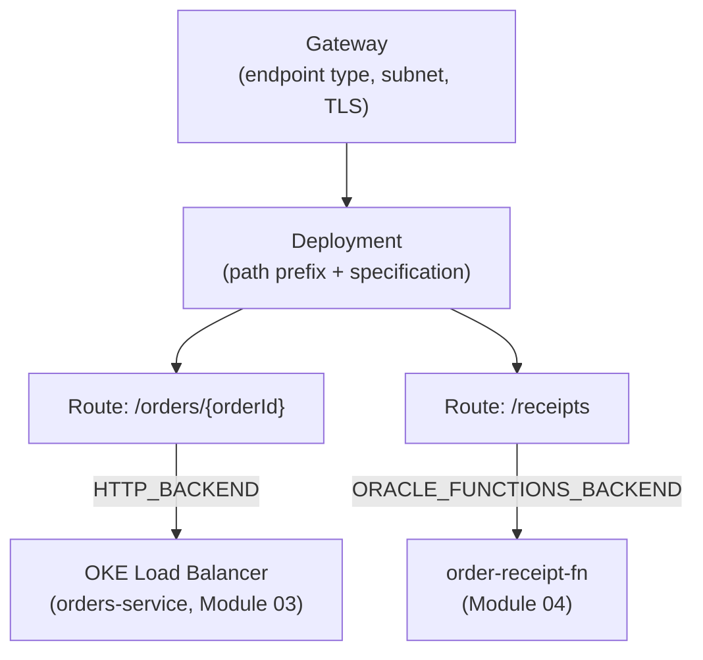
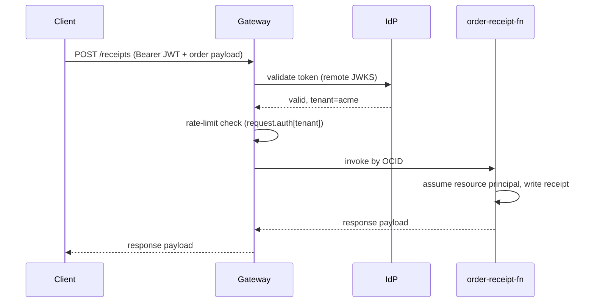

# API Management: One Gateway, Many Backends, in Front of Everything Built So Far

An **Application Programming Interface (API) Gateway** is not a load balancer with a few extra checkboxes. A load balancer distributes traffic across *identical* backends; a gateway sits in front of **different** backends — a Kubernetes service, a function, a fixed canned response — and turns them into one coherent, policed API surface: authentication, request shaping, rate limiting, and routing, all before a single line of backend code ever runs. The most common misreading is to treat the gateway as just another hop passing bytes through unchanged; every mechanic in this lesson exists because the gateway is doing real work at that hop. This lesson is also where two loose ends finally connect — Module `03`'s `orders-service` running on OKE, and Module `04`'s `order-receipt-fn` — both get their first real front door here, as two routes behind the same gateway.

---

## Contents

1. [The Resource Model: Gateway, Deployment, Route](#1-the-resource-model-gateway-deployment-route)
2. [Backend Types: Where a Route Actually Sends the Request](#2-backend-types-where-a-route-actually-sends-the-request)
3. [Request and Response Policies: The Substitution Language](#3-request-and-response-policies-the-substitution-language)
4. [Prerequisites and Networking: What Must Exist Before a Gateway Runs](#4-prerequisites-and-networking-what-must-exist-before-a-gateway-runs)
5. [Dynamic Authentication: Authorizer Functions and OAuth 2.0/OIDC](#5-dynamic-authentication-authorizer-functions-and-oauth-20oidc)
6. [Dynamic Routing: Selecting a Backend at Request Time](#6-dynamic-routing-selecting-a-backend-at-request-time)
7. [Transport Security and Monitoring](#7-transport-security-and-monitoring)
8. [Worked Walkthrough: One Request, Gateway to Backend](#8-worked-walkthrough-one-request-gateway-to-backend)
9. [Limits and Sources](#9-limits-and-sources)
10. [Summary](#10-summary)

---

## 1. The Resource Model: Gateway, Deployment, Route

### 1.1 Gateway: the network-facing shell

**A gateway is deliberately thin**: it owns a network identity — an **endpoint type** (public or private), a **subnet**, and optionally a **TLS certificate** — and nothing else. It carries no knowledge of your APIs at all; that job belongs entirely to the resource underneath it. Creating one is a networking decision, covered once the prerequisites it depends on are in place (see *Prerequisites and Networking*, below).

### 1.2 Deployment: a path prefix plus a specification

**A deployment attaches to a gateway at a path prefix and carries the specification** — the document that actually defines routes, backends, and policies (`/v1`, for instance). Multiple deployments can share one gateway, each at its own prefix: the same "one umbrella, many independent things underneath" pattern Module `01` established for a DevOps project holding many pipelines. A gateway with no deployments attached is a network shell with nothing to route.

### 1.3 The deployment specification: routes, each with a path, methods, and a backend

**The specification's core is a routes array.** Each route names a **path**, the HTTP **methods** it accepts, and a **backend** — where the request actually goes. This is where `orders-service` (Module `03`) and `order-receipt-fn` (Module `04`) get their first real front door, as two routes in the same specification:

```json
{
  "requestPolicies": {},
  "routes": [
    {
      "path": "/orders/{orderId}",
      "methods": ["GET"],
      "backend": {
        "type": "HTTP_BACKEND",
        "url": "http://10.0.1.20:80/orders/${request.path[orderId]}"
      }
    },
    {
      "path": "/receipts",
      "methods": ["POST"],
      "backend": {
        "type": "ORACLE_FUNCTIONS_BACKEND",
        "functionId": "${FUNCTION_OCID}"
      }
    }
  ]
}
```

- The `/orders/{orderId}` route targets the internal address of the OCI Load Balancer Module `03`'s `LoadBalancer` Service provisioned — the gateway calls it exactly like any other HTTP backend, with zero awareness that a Kubernetes `Service` sits behind that address.
- The `/receipts` route names `order-receipt-fn` directly by its **Oracle Cloud Identifier (OCID)** — no URL at all, because a Functions backend invokes by identity, not by address.



*One gateway, one deployment, two routes — each pointing at a genuinely different kind of backend built in an earlier module.*

---

## 2. Backend Types: Where a Route Actually Sends the Request

### 2.1 HTTP/HTTPS URL backend — reaching `orders-service`

**An HTTP_BACKEND is a plain URL**, optionally with a connect/read timeout and a flag to disable Transport Layer Security (TLS) certificate verification for internal, self-signed endpoints. This is what the `/orders/{orderId}` route (*The deployment specification*, above) uses to reach `orders-service` — the gateway treats the OKE-provisioned Load Balancer exactly like it would treat any other HTTP service, because from the gateway's side, that's all it is.

### 2.2 Oracle Functions backend — reaching `order-receipt-fn`

**An ORACLE_FUNCTIONS_BACKEND names a function by OCID** — there is no address to reach, because a function has none until it's invoked.

- The gateway's own identity needs an IAM policy grant to invoke the function — the same dynamic-group-and-policy shape this track has used for every service-to-service call so far, just with the gateway as the identity being authorized this time.
- Once that grant exists, the gateway invokes `order-receipt-fn` directly, the same OCID-based invocation Module `04`'s *Direct invoke* section already showed from the CLI — a gateway route is simply another caller.

### 2.3 Stock response backend

**A STOCK_RESPONSE_BACKEND returns a fixed status, body, and headers with no backend call at all** — useful for health checks or a deprecation notice on a retired route:

```json
{
  "path": "/healthz",
  "methods": ["GET"],
  "backend": {
    "type": "STOCK_RESPONSE_BACKEND",
    "status": 200,
    "body": "{\"status\": \"healthy\"}",
    "headers": [
      { "name": "Content-Type", "value": "application/json" }
    ]
  }
}
```

> ⚠️ The body is capped at 5 KB — fine for a health check or a JSON error stub, wrong for anything meant to stand in for a real payload (as of Jul 2026, [docs](https://docs.oracle.com/en-us/iaas/Content/APIGateway/Tasks/apigatewayaddingstockresponses.htm)).

### 2.4 OAuth2 login/logout backends

**OAUTH2_LOGIN_BACKEND and OAUTH2_LOGOUT_BACKEND are session-establishing routes** — they issue or clear a session against a configured Identity Provider (IdP).

> Nuance: don't confuse these with *Dynamic Authentication*'s mechanism, below — a login backend *produces* a session; the `JWT_AUTHENTICATION` policy *validates* one on every other route. One creates the credential, the other checks it — a route can need either, both, or neither depending on where it sits in the flow.

| Backend type | What it reaches | Choose it when |
| :--- | :--- | :--- |
| HTTP/HTTPS URL | Any HTTP(S) endpoint — a load balancer, a VM, another service | The backend already speaks HTTP and just needs fronting |
| Oracle Functions | A function, by OCID | The logic itself should scale to zero between calls |
| Stock response | Nothing — the gateway answers directly | A health check, a fixed error, a deprecated route stub |
| OAuth2 login/logout | A configured IdP | The route's job is establishing or clearing a session, not serving data |

---

## 3. Request and Response Policies: The Substitution Language

### 3.1 Validation, transformation, response caching, rate limiting

**Four policy kinds sit between a request arriving and a backend ever seeing it, each answering a different question:**

- **Validation** — is the request even well-formed (a required content type, a required parameter) before it's allowed to reach the backend at all.
- **Transformation** — rewrites headers, query parameters, or the body itself, on the way in or out.
- **Response caching** — integrates with an external cache server (Redis or KeyDB, for instance) so a repeated request can be answered from the cache instead of hitting the backend again.
- **Rate limiting** — caps how many requests a caller can make in a window; a caller that exceeds it gets an HTTP `429 Too Many Requests`, not a queued or degraded response.

### 3.2 Context variables: the table names transformation policies read from

**Transformation policies read from context variables**, each shaped `<table>[<key>]`: `request.path`, `request.query`, `request.headers`, `request.auth`, `request.cert`, and `request.host`. A header-transformation policy can set a new header from a path parameter without the backend ever needing to parse the path itself:

```json
"requestPolicies": {
  "headerTransformations": {
    "setHeaders": {
      "items": [
        { "name": "X-Order-Id", "values": ["${request.path[orderId]}"] }
      ]
    }
  }
}
```

(As of Jul 2026, [docs](https://docs.oracle.com/en-us/iaas/Content/APIGateway/Tasks/apigatewaycontextvariables.htm).)

### 3.3 Path parameters as the specific case of `request.path`

**The `{orderId}` in the deployment specification (above) is a path parameter** — a named segment of the route path, enclosed in curly braces, that varies between calls and lands in the `request.path` table under that same name.

- A wildcard form, `{anyPath*}`, captures every remaining path segment as one value, for a route that needs to forward an arbitrary sub-path rather than name each segment.
- Parameter names allow letters, digits, and underscores only (as of Jul 2026, [docs](https://docs.oracle.com/en-us/iaas/Content/APIGateway/Tasks/apigatewayaddingparamswildcards.htm)).

Once a caller is authenticated (*Dynamic Authentication*, below), the same claim that identifies them can double as a rate-limit key: the `/receipts` route can cap requests per tenant by reading `request.auth[tenant]` rather than the caller's raw IP — grouping retries from the same tenant together regardless of which client or network they call from.

---

## 4. Prerequisites and Networking: What Must Exist Before a Gateway Runs

### 4.1 VCN, regional subnet, DNS, and backend reachability

**A gateway needs a VCN with a regional subnet** — an Availability Domain-specific subnet is rejected outright, the same high-availability-by-construction requirement Module `03` named for OKE clusters' API endpoint subnets.

- The VCN also needs a **Dynamic Host Configuration Protocol (DHCP)** options set carrying a working **Domain Name System (DNS)** resolver, so host names in the deployment specification actually resolve; if the VCN doesn't already have one, it has to be created before the gateway can use it.
- The gateway must be able to *reach* whatever a route's backend names — an internet gateway on the VCN, if that backend sits on the public internet.

(As of Jul 2026, [docs](https://docs.oracle.com/en-us/iaas/Content/APIGateway/Concepts/apigatewayprerequisites.htm).) `orders-service` needs none of the internet-gateway piece: it's an internal Load Balancer address inside the same VCN, reached without ever touching the public internet.

### 4.2 The IAM policy letting a group create a gateway

**A group needs a policy grant before it can even specify a VCN and subnet at gateway-creation time**, and a further grant to manage public IPs if the gateway itself will be public:

```text
Allow group api-gateway-admins to use virtual-network-family in compartment orders
Allow group api-gateway-admins to manage public-ips in compartment orders
```

### 4.3 Public vs. private gateway placement

**The same public-vs-private choice Module `03` named for an OKE cluster's API endpoint applies here.**

- A **public** gateway is routable from the internet, restricted by IAM and whatever network security rules are attached.
- A **private** gateway is reachable only from inside its VCN or anything peered or connected to it.
- The subnet's own public/private status has to match — a public gateway needs a public subnet, and port 443 has to be open on it via a security list or network security group.

```bash
oci api-gateway gateway create \
  --display-name "orders-gateway" \
  --compartment-id "$COMPARTMENT_OCID" \
  --endpoint-type "PUBLIC" \
  --subnet-id "$SUBNET_OCID"
```

---

## 5. Dynamic Authentication: Authorizer Functions and OAuth 2.0/OIDC

### 5.1 Authorizer functions

**An authorizer function runs before the backend, on every request, and decides one thing: allow or deny.** Contrast this directly with `order-receipt-fn` (*Oracle Functions backend*, above): that function *is* the backend, doing the actual work of building a receipt; an authorizer function does none of the work — it's a gate the request has to pass through first. Its return shape is an authorization decision, not application data:

```python
# An authorizer function: same FDK contract Module 04 used, but the response
# is an allow/deny decision plus optional context, not application data
import io, json
from fdk import response

def handler(ctx, data: io.BytesIO = None):
    headers = ctx.Headers()
    token = headers.get("authorization", "")
    is_valid = token.startswith("Bearer ") and validate_token(token)  # your own check
    return response.Response(
        ctx,
        response_data=json.dumps({
            "active": is_valid,
            "context": {"tenant": "acme"} if is_valid else {}
        }),
        headers={"Content-Type": "application/json"}
    )
```

Anything the authorizer returns in `context` becomes available to later policies through the `request.auth` table (*Context variables*, above) — the mechanism *Path parameters* already used to rate-limit by tenant.

### 5.2 OAuth 2.0/OIDC with remote JWKS vs. static keys

**The gateway also validates a JWT directly, against any OAuth 2.0/OIDC-compliant IdP**, without writing an authorizer function at all:

```json
"requestPolicies": {
  "authentication": {
    "type": "JWT_AUTHENTICATION",
    "tokenAuthScheme": "Bearer",
    "isAnonymousAccessAllowed": false,
    "publicKeys": {
      "type": "REMOTE_JWKS",
      "uri": "https://idcs-example.identity.oraclecloud.com/admin/v1/SigningCert/jwk"
    }
  }
}
```

The `publicKeys.type` field is the trade-off worth internalizing:

- **Remote JSON Web Key Set (JWKS)** — fetches the IdP's current public verification keys live, at request time. A key rotated or revoked at the IdP takes effect on the very next request, at the cost of a live dependency and a small added latency per call.
- **Static Keys** — pins the verification keys directly in the policy. No live IdP call, no added latency, and the gateway keeps validating tokens even if the IdP is briefly unreachable — but a key rotated at the IdP has no effect here until the static configuration is updated by hand.

### 5.3 Multiple authentication servers

**A single deployment can name more than one authentication server** — useful when a gateway serves callers from more than one identity domain: an internal IdP for your own services, a partner's separate IdP for theirs. The token's own issuer claim tells the gateway which configured server should validate it.

---

## 6. Dynamic Routing: Selecting a Backend at Request Time

### 6.1 The selector

**Dynamic routing picks a backend at request time from a selector**, rather than a route naming one fixed backend — a header, a query parameter, a host/subdomain, a path parameter, an authentication claim, or a usage plan. A `DYNAMIC_ROUTING_BACKEND` replaces the single `backend` object with a `selectionSource` (which context variable to read) and a `routingBackends` list (which value routes where):

```json
{
  "path": "/sales",
  "methods": ["GET", "POST", "PUT", "DELETE"],
  "backend": {
    "type": "DYNAMIC_ROUTING_BACKEND",
    "selectionSource": {
      "type": "SINGLE",
      "selector": "request.subdomain[example.com]"
    },
    "routingBackends": [
      {
        "key": { "type": "ANY_OF", "values": ["cars"], "isDefault": "true", "name": "car-rule" },
        "backend": { "type": "HTTP_BACKEND", "url": "https://cars-api.example.com" }
      },
      {
        "key": { "type": "ANY_OF", "values": ["minivans", "trucks"], "name": "truck-minivan-rule" },
        "backend": { "type": "ORACLE_FUNCTIONS_BACKEND", "functionId": "$FUNCTION_OCID" }
      }
    ]
  }
}
```

(As of Jul 2026, [docs](https://docs.oracle.com/en-us/iaas/Content/APIGateway/Tasks/apigatewaydynamicroutingbasedonrequest_topic.htm).) One `routingBackends` entry can be marked `isDefault` — the catch-all when no other key matches, so an unrecognized subdomain doesn't simply fail to route anywhere.

### 6.2 The multitenant and canary pattern this enables

**This is the mechanism behind a single gateway serving multiple tenants or backend versions without a separate deployment for each**: a subdomain, a header, or a usage plan picks the tenant or the version, and the routing table — not a redeploy — is what changes when a new tenant or version is added.

> Nuance: the same shape supports a canary release at the edge — route a percentage of traffic (via a header or a usage-plan key) to a new backend version while the default rule still serves everyone else. Don't confuse this with the blue-green and canary *deployment pipeline* strategies Module `01` covered — those replace which image is running; this replaces which backend a request reaches, without touching what's deployed at all.

---

## 7. Transport Security and Monitoring

### 7.1 Custom domains and TLS certificates

**A gateway can terminate TLS for a custom domain** instead of its default assigned hostname, by attaching a **certificate** resource — a leaf certificate plus an optional intermediate chain back to its Certificate Authority (CA) — at creation or update time via `--certificate-id`. That certificate resource is provisioned through the **OCI Certificates service**, which Module `09` covers in full (issuance, CA bundles, automatic renewal); this lesson only needs you to know the gateway consumes one.

### 7.2 CORS, mTLS, and custom trust stores

- **Cross-Origin Resource Sharing (CORS)** — its own policy, naming which origins, methods, and headers a browser is allowed to call the API from; without it, a browser-based caller on a different origin is blocked by the browser itself before the gateway ever sees a legitimate second request.
- **Default CA bundle** — every gateway ships one, of well-known public CAs, used to verify TLS certificates presented by *backend* services.
- **Custom trust store** — a custom CA or CA bundle, provisioned through the Certificates service, extends that verification to an internal or private CA your backends actually use.

> ⚠️ **Mutual TLS (mTLS)** — verifying the *client's* certificate, not the backend's — deliberately does not consult the default CA bundle at all. An mTLS-enabled deployment trusts only the custom CAs and CA bundles explicitly added to it — enabling mTLS is a deliberate act of provisioning trust, never a fallback to "a well-known public CA is probably fine" (as of Jul 2026, [docs](https://docs.oracle.com/en-us/iaas/Content/APIGateway/Tasks/apigatewayaddingmtlssupport.htm)).

### 7.3 Monitoring APIs: enabled here, analysed in Module 10

**A gateway emits metrics into the `oci_apigateway` namespace** — `HttpRequests`, `Latency`, `BackendLatency`, `BytesSent`, `4xxErrors`, and `5xxErrors`, at roughly one data point per minute — and a deployment carries its own execution-logging and access-logging toggles (as of Jul 2026, [docs](https://docs.oracle.com/en-us/iaas/Content/APIGateway/Reference/apigatewaymetrics.htm)). Module `10` covers what to do with all of it — the same "the switch exists here, the analysis lives there" pattern Module `04`'s function logging toggle already used.

---

## 8. Worked Walkthrough: One Request, Gateway to Backend

One concrete call, end to end, to the `/receipts` route from *The deployment specification*.

1. **The call arrives.** A client sends a signed HTTPS `POST` to the gateway's public endpoint, `/receipts`, carrying a Bearer JWT and an order payload.
2. **Route match.** The gateway matches the request against the `/receipts` route in the deployment specification.
3. **Authentication.** The `JWT_AUTHENTICATION` policy validates the token against the configured IdP's remote JWKS. An invalid or missing token stops here — the backend never sees it.
4. **Rate limiting.** The rate-limit policy checks the caller's tenant claim (`request.auth[tenant]`, from the authorizer's context) against its quota.
5. **Invocation.** The gateway invokes `order-receipt-fn` via its OCID — no HTTP hop, no `imagePullSecret`, the same "no Kubernetes-style credential" contrast Module `04` built.
6. **The function does its own work.** Inside `order-receipt-fn`, its own resource principal (Module `04`) is what it uses to write the receipt to Object Storage — entirely unrelated to, and downstream of, the gateway's own authentication check in step 3.
7. **Response.** The function returns; the gateway relays the response back to the client, closing the request.



*Authentication and rate limiting both happen at the gateway, before the function ever runs — the function's own resource principal is a second, unrelated identity check that happens entirely inside step 5.*

Had the client instead called `GET /orders/{orderId}` — the other route in the same deployment — the trace looks nothing like this past step 2: no `JWT_AUTHENTICATION` policy is attached to that route in this example, so the gateway goes straight from route match to the `HTTP_BACKEND` call against `orders-service`'s internal Load Balancer address. Same gateway, same deployment, a completely different backend shape and no auth hop at all — because the route, not the gateway, is where each policy actually attaches.

---

## 9. Limits and Sources

| Limit | What it forces | As-of + docs |
| :--- | :--- | :--- |
| A gateway's subnet must be regional, not AD-specific | An AD-specific subnet is rejected at creation | Jul 2026, [docs](https://docs.oracle.com/en-us/iaas/Content/APIGateway/Concepts/apigatewayprerequisites.htm) |
| A stock response body is capped at 5 KB | Fine for a health check or a fixed error payload, wrong for real backend data | Jul 2026, [docs](https://docs.oracle.com/en-us/iaas/Content/APIGateway/Tasks/apigatewayaddingstockresponses.htm) |
| Path-parameter names allow letters, digits, and underscores only | Constrains how route paths can be authored | Jul 2026, [docs](https://docs.oracle.com/en-us/iaas/Content/APIGateway/Tasks/apigatewayaddingparamswildcards.htm) |
| Dynamic routing selectors read from a fixed context-variable set | Only these tables (header, subdomain, path, claim, usage plan) can drive a routing decision | Jul 2026, [docs](https://docs.oracle.com/en-us/iaas/Content/APIGateway/Tasks/apigatewaydynamicroutingbasedonrequest_topic.htm) |
| mTLS trust deliberately excludes the default CA bundle | Enabling client mTLS means explicitly provisioning custom CAs or CA bundles — no fallback | Jul 2026, [docs](https://docs.oracle.com/en-us/iaas/Content/APIGateway/Tasks/apigatewayaddingmtlssupport.htm) |
| Metrics post to `oci_apigateway` roughly once a minute | An alarm or dashboard built on it always trails live traffic by up to that interval | Jul 2026, [docs](https://docs.oracle.com/en-us/iaas/Content/APIGateway/Reference/apigatewaymetrics.htm) |

> Note: A public gateway needs a public-IP policy grant as a *separate* grant from the VCN/subnet one (covered inline at *The IAM policy letting a group create a gateway*) — missing it blocks gateway creation, not just IP assignment. Remote JWKS and static keys trade opposite failure modes (immediate key-rotation pickup vs. no live IdP dependency) — covered inline at *OAuth 2.0/OIDC*. Rate-limit key choice changes who's grouped together: a source-IP key punishes an entire NAT'd office as one caller, a JWT-claim key isolates one tenant regardless of network. **Gateway fronting vs. direct load-balancer exposure** is a trade-off, not a limit: a gateway buys edge-level policy enforcement and authentication in one place, at the cost of one extra network hop and one more resource to operate — reach for direct load-balancer exposure only when no route needs authentication, transformation, or rate limiting beyond what the load balancer itself offers.

---

## 10. Summary

An API Gateway is a thin, network-facing shell — a gateway resource with an endpoint type, a subnet, and a certificate — with all the real API definition living one layer down, in a deployment's specification. Routes inside that specification each name a path, a set of methods, and a backend, and "backend" genuinely means different things: an HTTP URL, a function invoked by OCID, a stock response with no backend call at all, or a session-establishing OAuth2 login/logout pair. Request and response policies — validation, transformation, caching, rate limiting — sit between the route match and the backend call, reading from context variables rather than hard-coded values, which is what makes the same policy reusable across callers, tenants, and versions.

Two mechanisms compound to make one gateway flexible enough to front an entire system: dynamic authentication validates a caller once, through an authorizer function or a JWT policy against remote JWKS or static keys, and dynamic routing then picks *which* backend a validated request actually reaches, from a header, a subdomain, or the very claim authentication just verified. Neither replaces the network prerequisites underneath — a regional subnet, a DNS-capable VCN, and the IAM policy letting a group stand the gateway up in the first place — and neither replaces Module `10`'s job of analysing what the gateway's own metrics and logs are actually saying.

This lesson's own worked example is the payoff for two earlier ones: `orders-service` from Module `03` and `order-receipt-fn` from Module `04` now sit behind the same gateway, reached through completely different backend types, with completely different policy attachments — proof that everything built in this track so far was building toward one door, not several disconnected services. Module `09` returns to the Certificates service this lesson only introduced consuming; Module `10` is where its metrics and logs finally get analysed rather than just enabled.
