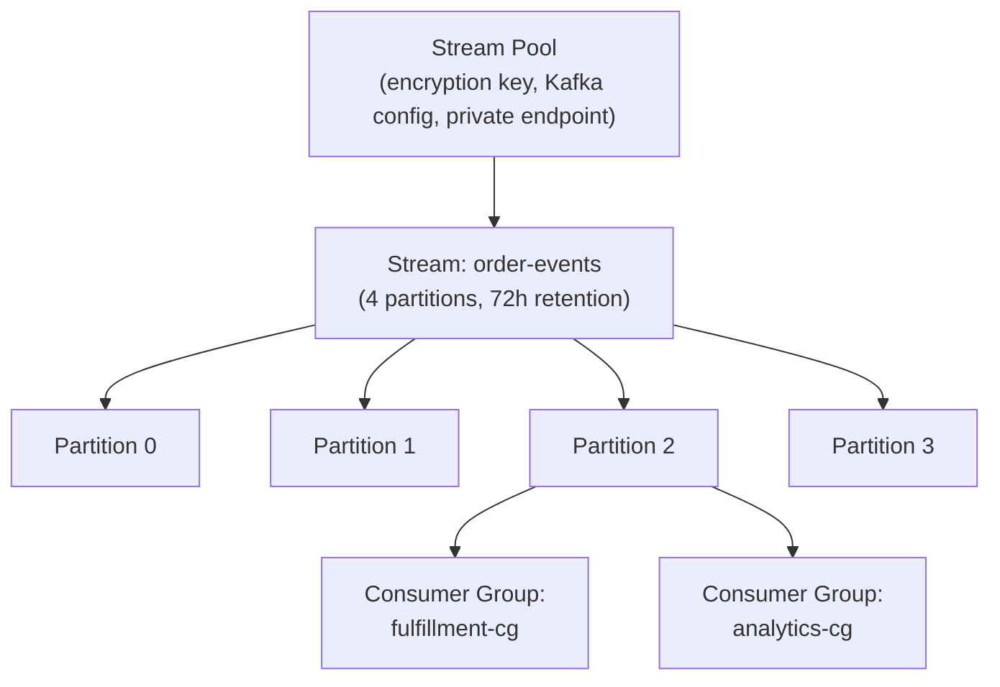
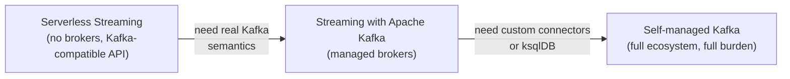
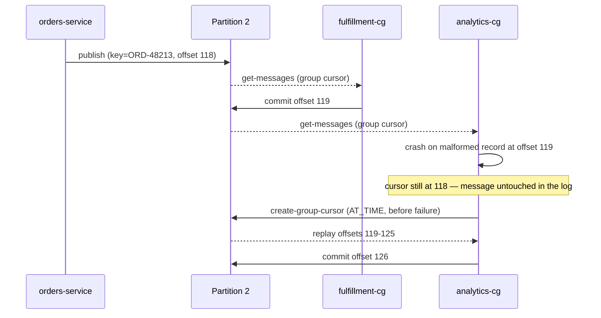

# Streaming: The Replayable Log, Serverless and Clustered

OCI ships two distinct products under the streaming umbrella, and the natural assumption — that they're the same thing at different scale — is wrong. **OCI Streaming** is a serverless, partitioned append-only log with a Kafka-compatible API layered on top; **Streaming with Apache Kafka** is a separate service that provisions real Kafka broker clusters, sized and patched through Oracle's control plane rather than your own. Both durably order and replay messages, but they differ in resource model, security mechanism, and limits. Picking between them, not just describing either one, is what this lesson is actually testing.

---

## Contents

1. [The Resource Model: Streams, Partitions, and Stream Pools](#1-the-resource-model-streams-partitions-and-stream-pools)
2. [Producing: Keys, Partition Assignment, and the Throughput Ceiling](#2-producing-keys-partition-assignment-and-the-throughput-ceiling)
3. [Consuming: Cursors, Offsets, and Consumer Groups](#3-consuming-cursors-offsets-and-consumer-groups)
4. [Retention, Replay, and Access Control](#4-retention-replay-and-access-control)
5. [Kafka Compatibility on Serverless Streaming](#5-kafka-compatibility-on-serverless-streaming)
6. [Streaming with Apache Kafka: The Clustered Service](#6-streaming-with-apache-kafka-the-clustered-service)
7. [Choosing a Streaming Backend](#7-choosing-a-streaming-backend)
8. [Worked Walkthrough: One Order Event, Produced to Replayed](#8-worked-walkthrough-one-order-event-produced-to-replayed)
9. [Limits and Sources](#9-limits-and-sources)
10. [Summary](#10-summary)

---

## 1. The Resource Model: Streams, Partitions, and Stream Pools

### 1.1 Stream: an append-only, partitioned log

**A stream is a durable, ordered log that consumers read without removing anything.** Every published message is appended, never overwritten, and stays readable by any number of independent consumers until its retention window expires — the same "many readers, one immutable log" shape as Apache Kafka's topic, which is why the Kafka-compatible API (*Kafka Compatibility*, below) can sit on top of it without inventing new semantics.

### 1.2 Partition: the unit of order, parallelism, and throughput

**A partition is where ordering is actually guaranteed** — strictly within one partition, never across a whole stream. Splitting a stream into more partitions is also the *only* way to add write throughput and parallel consumers, because each partition is an independent append log with its own throughput ceiling (*Producing*, below, quantifies it).

> ⚠️ **Partition count and retention are fixed at stream creation and cannot be changed afterward** (see Limits and Sources). Under-provisioning partitions isn't a config tweak to fix later — it's a new stream and a producer/consumer migration. Size for peak throughput, not today's volume.

### 1.3 Stream pool: the shared settings and endpoint boundary

**A stream pool groups streams under one set of shared settings** — a custom encryption key, Kafka-compatibility configuration, and, for a private pool, a **Virtual Cloud Network (VCN)** subnet that restricts the pool's endpoint to private access only. It's the same "one umbrella, many independent things underneath" pattern Module `01` used for a DevOps project holding many pipelines, and Module `05` reused for a gateway holding many deployments — here it's a pool holding many streams.

```bash
# Control plane: the pool's settings (encryption key, private endpoint) apply to
# every stream created inside it; partitions and retention are set per stream
oci streaming admin stream-pool create \
  --compartment-id "$COMPARTMENT_OCID" \
  --name "orders-pool"

oci streaming admin stream create \
  --compartment-id "$COMPARTMENT_OCID" \
  --name "order-events" \
  --partitions 4 \
  --retention-in-hours 72 \
  --stream-pool-id "$STREAM_POOL_OCID"
```



*A stream pool's settings apply to every stream inside it; partitions are where throughput and ordering actually live, and each can be read independently by more than one consumer group.*

---

## 2. Producing: Keys, Partition Assignment, and the Throughput Ceiling

The resource model above laid out the shape; this section is the first thing that actually happens to it — a message landing in a specific partition.

### 2.1 Publishing a message

**A producer calls the stream's own messages endpoint, not the control-plane API used to create it** — a separate hostname returned when the stream is created, the same control-plane/data-plane split Module `05`'s gateway used for its own management vs. runtime APIs.

```bash
# The messages endpoint is per-stream, not the compartment-wide control-plane endpoint
oci streaming stream message put-messages \
  --stream-id "$STREAM_OCID" \
  --endpoint "$MESSAGES_ENDPOINT" \
  --messages '[{"key":"T1JELTQ4MjEz","value":"eyJvcmRlcklkIjoiT1JELTQ4MjEzIn0="}]'
```

### 2.2 Key-based partition assignment

**A message's key decides which partition it lands in.** OCI Streaming hashes the key deterministically, so every message with the same key always lands in the same partition — the mechanism that keeps all events for one order in order relative to each other. A message published with no key is assigned round-robin instead, spreading load evenly but giving up any ordering guarantee between messages.

```python
import base64
import oci

# The messages endpoint (from stream creation), not the control-plane endpoint
stream_client = oci.streaming.StreamClient(
    config, service_endpoint=messages_endpoint
)
message = oci.streaming.models.PutMessagesDetailsEntry(
    key=base64.b64encode(b"ORD-48213").decode(),      # keys and values are base64
    value=base64.b64encode(b'{"orderId":"ORD-48213"}').decode(),
)
stream_client.put_messages(
    stream_id=stream_ocid,
    put_messages_details=oci.streaming.models.PutMessagesDetails(messages=[message]),
)
```

### 2.3 The throughput ceiling, and what it forces

**Each partition caps writes at 1 MB/second** (see Limits and Sources) — a 4-partition stream like `order-events` has an aggregate write ceiling of ~4 MB/s, or roughly 345 GB/day if every partition ran flat-out. There's no per-request rate limit on top of that; any number of `PutMessages` calls is fine as long as the 1 MB/s-per-partition sum isn't exceeded.

Because partition count is fixed at creation (*Stream: an append-only, partitioned log*, above), the only way to raise that ceiling is to create a new stream with more partitions and repoint every producer at it — there's no live "add a partition" operation to reach for instead.

---

## 3. Consuming: Cursors, Offsets, and Consumer Groups

Producing put a message at a specific partition and offset; this section is how a reader finds it again.

### 3.1 Cursor types: where a read starts

**A cursor is a starting position for reads, and its type decides where that position is.**

| Cursor type | Starts reading from | Choose it when |
| :--- | :--- | :--- |
| `TRIM_HORIZON` | The oldest retained message | A new consumer needs everything still in the retention window |
| `LATEST` | Only messages published after the cursor is created | A consumer only cares about new activity, not backlog |
| `AT_OFFSET` | An exact offset, inclusive | Resuming from a precisely known position |
| `AFTER_OFFSET` | The message immediately after an exact offset | Resuming without re-reading the last message already processed |
| `AT_TIME` | The first message at or after a timestamp | Replaying "everything since this incident started" |

### 3.2 Partition cursors vs. group cursors

**A partition cursor is anonymous and unmanaged** — a plain position on one partition that the caller tracks and advances by hand on every read. A **group cursor** is tied to a named consumer group instead: the service itself remembers the committed offset per partition, so a consumer that restarts resumes from its own last commit without the caller doing any bookkeeping. Don't confuse the two — a partition cursor is a one-off starting point you manage yourself; a group cursor is a durable, server-tracked position tied to an identity.

### 3.3 Consumer groups and commit semantics

**A consumer group is the identity a group cursor tracks progress against**, and the service balances the stream's partitions across the group's active members so no two members read the same partition at once. A commit tells the service "everything up to this offset has been processed" — nothing more.

> Nuance: a commit is not automatic on read. If a consumer reads a batch, crashes before committing, and restarts, it re-reads the same batch — **at-least-once delivery**, not exactly-once. Downstream processing has to tolerate a duplicate, the same idempotency obligation Module `07`'s queue consumers face for the same underlying reason.

```bash
# Create a group cursor once; every subsequent get-messages call for this group
# advances the server-tracked offset without the caller managing it by hand
oci streaming stream cursor create-group-cursor \
  --stream-id "$STREAM_OCID" \
  --endpoint "$MESSAGES_ENDPOINT" \
  --group-name "fulfillment-cg" \
  --type "TRIM_HORIZON"

oci streaming stream message get-messages \
  --stream-id "$STREAM_OCID" \
  --endpoint "$MESSAGES_ENDPOINT" \
  --cursor "$CURSOR" \
  --limit 100
```

### 3.4 The read ceiling, and what it forces

**Each consumer group is capped at 5 `GetMessages` calls/second per partition** (see Limits and Sources) — with up to 50 consumer groups allowed on one stream, a single busy partition could in principle field 250 GET calls/second total, but any one group is still bound by its own 5/s. The ceiling forces batching: pulling up to 100 messages per call (as shown above) rather than polling in a tight per-message loop is what keeps a consumer under its own rate limit while still keeping up with a busy partition.

---

## 4. Retention, Replay, and Access Control

Sections 2 and 3 covered writing and reading a message once; this section covers what happens to it afterward and who's allowed to touch it at all.

### 4.1 Retention: a fixed window, not a growing archive

**Every stream retains messages for a configured window between 24 and 168 hours** (see Limits and Sources), set once at creation alongside partition count and equally immutable afterward. A stream is not a permanent event store — anything not read (or replayed) before the window closes is gone for good.

### 4.2 Replay is a cursor, not a re-publish

**Replaying history means creating a new cursor, never republishing anything.** The messages already sit in the log exactly where they were written; an `AT_TIME` or `TRIM_HORIZON` cursor just repositions where a *read* starts. This is why replay costs nothing on the write side and why two consumer groups can independently be at completely different points in the same stream without interfering with each other — each group's cursor is its own bookmark into one shared, unmodified log.

### 4.3 IAM policies for streams and stream pools

**Access to a stream is governed by ordinary Identity and Access Management (IAM) policy**, with dedicated verbs that split producing from consuming rather than granting blanket read/write:

```text
Allow dynamic-group order-receipt-fn-dg to use stream-push in compartment orders
  where target.stream.id = '<order_events_stream_ocid>'
Allow dynamic-group fulfillment-worker-dg to use stream-pull in compartment orders
  where target.stream.id = '<order_events_stream_ocid>'
```

`order-receipt-fn` (Module `04`) assumes its resource principal exactly as it did to write a receipt to Object Storage — the same "no stored credential" pattern, just granted `stream-push` instead of object-storage access this time. A worker consuming the same stream gets `stream-pull` instead, so a compromised producer credential can't also read the log, and vice versa.

---

## 5. Kafka Compatibility on Serverless Streaming

Sections 1 through 4 used OCI Streaming's own API; this section is the same stream, reached through a Kafka client instead.

### 5.1 Mapping OCI vocabulary onto Kafka vocabulary

**A stream pool's Kafka connection settings act as the bootstrap "cluster"; each stream inside it is one Kafka topic.** A Kafka client never sees "stream pool" or "stream" as terms — it connects to a bootstrap server address (from the pool) and produces or consumes against a topic name (the stream), with partitions behaving exactly as already described.

### 5.2 Authentication: SASL/PLAIN with an auth token

**Kafka clients authenticate with SASL/PLAIN, using an auth token as the password** — the same credential type Module `02` introduced for the human `docker login` path to the registry, reused here for a different protocol.

```properties
# Kafka client properties — connects to the stream pool's bootstrap servers
security.protocol=SASL_SSL
sasl.mechanism=PLAIN
sasl.jaas.config=org.apache.kafka.common.security.plain.PlainLoginModule required \
  username="<tenancy-namespace>/<username>/<stream-pool-ocid>" \
  password="<auth-token>";
```

### 5.3 Kafka Connect: the harness, and its same-compartment limit

**A Kafka Connect configuration is called a *ConnectHarness* in the Streaming API** — the resource that lets an existing Kafka Connect connector target a stream as if it were a Kafka topic. A harness only works against streams in the same compartment as itself; a connector needing to reach a stream elsewhere has to be paired with a harness created there instead.

### 5.4 What the compatibility layer doesn't cover

**Kafka compatibility is an API surface on top of Streaming's own model, not a second implementation of Kafka** — administrative operations available through Kafka's `AdminClient` (topic creation, partition reassignment) are still not the way to manage a stream; that stays the control-plane API from *Stream pool*, above. Access control likewise stays OCI IAM policy (*IAM policies for streams and stream pools*, above), not Kafka ACLs — a client that expects to manage authorization the Kafka-native way will find nothing to configure.

---

## 6. Streaming with Apache Kafka: The Clustered Service

Everything above was serverless Streaming; this section is the second, separate product — a service that runs an actual Kafka broker cluster on your behalf.

### 6.1 Starter vs. HA clusters: the tier that sets defaults

**The cluster type chosen at creation sets the broker count, placement, and default Kafka replication settings all at once.**

| | Starter cluster | High Availability (HA) cluster |
| :--- | :--- | :--- |
| Broker count | 1–30 | 3–30, minimum 3 |
| Broker placement | No distribution guarantee | Spread across Availability Domains/Fault Domains |
| `default.replication.factor` | 1 | 3 |
| `min.insync.replicas` | 1 | 2 |
| Intended for | Development and testing | Production |

A starter cluster's single-replica defaults mean a broker failure can lose unflushed data outright; an HA cluster's 3-way replication with `min.insync.replicas=2` tolerates one broker failure with zero data loss, at the cost of running (and paying for) at least three brokers from the start.

### 6.2 Broker sizing and per-tenancy ceilings

**A tenancy is capped at 5 clusters and 150 brokers total** (see Limits and Sources), with each broker holding up to 16 TB of storage and each cluster capped at 30 brokers. An internal **coordinator cluster** — one node for two or fewer brokers, three nodes otherwise — tracks cluster-wide activity and isn't counted against the broker limit; it's infrastructure Oracle runs, not a resource you provision.

### 6.3 Supported versions and the KRaft cutover

**Every cluster pins one Apache Kafka version at creation, and Oracle retires older versions on a schedule.**

| Version | OCI release | End of life |
| :--- | :--- | :--- |
| 4.0.0 | Jun 2026 | — (current) |
| 3.9.1 | Apr 2026 | — (current) |
| 3.7.0 | Aug 2025 | May 2026 — **deprecated** |
| 3.6.1 / 3.6.0 | Aug 2025 | Apr 2026 — **deprecated** |

**3.7.0 and both 3.6.x builds have already passed end of life** — a cluster still running one of them is unsupported, not merely outdated, and should be upgraded rather than left in place. From 4.0.0 onward, **KRaft is the only coordination mode**; earlier supported versions still coordinate through ZooKeeper, which Oracle operates as part of the managed cluster rather than exposing as something you configure.

### 6.4 Security: SASL/SCRAM, mTLS, and ACLs

**Client authentication uses SASL/SCRAM, not the SASL/PLAIN-with-auth-token pattern serverless Streaming's Kafka compatibility uses** (*Authentication: SASL/PLAIN with an auth token*, above) — a real username/password pair validated against Kafka's own SCRAM credential store, independent of OCI IAM.

```properties
# Streaming with Apache Kafka client properties — SCRAM, not PLAIN
security.protocol=SASL_SSL
sasl.mechanism=SCRAM-SHA-512
ssl.truststore.location=/path/to/truststore.jks
ssl.truststore.password=<truststore-password>
sasl.jaas.config=org.apache.kafka.common.security.scram.ScramLoginModule required \
  username="<username>" password="<password>";
```

Mutual TLS (mTLS) and Kafka access-control lists (ACLs) are both supported on top of that, giving this service Kafka-native authorization that serverless Streaming's IAM-only model doesn't offer. Customer-managed encryption keys and OAuth are **not** supported (see Limits and Sources) — encryption at rest uses an Oracle-managed key regardless of what the rest of the tenancy uses elsewhere.

### 6.5 Networking: private by default, public through an add-on

**A cluster's brokers are reachable only from inside its configured VCN and subnet by default** — the same private-first posture Module `03` established for an OKE cluster's API endpoint. Public connectivity exists only as an explicit add-on installed after cluster creation, never a flag flipped at create time.

### 6.6 The broker disk-quota behavior

> ⚠️ **A broker throttles producers at 97% disk capacity and blocks them outright at 98%** (see Limits and Sources) — but consumers keep reading at either threshold. The asymmetry is deliberate: a full disk crashing the broker would also stop consumers from draining the backlog that caused the problem, so writes are cut off first specifically to let reads keep working.

---

## 7. Choosing a Streaming Backend

Sections 1–4 and 6 each described a working system on its own; this section is the decision between them.

### 7.1 Three backends, one underlying need

**Serverless Streaming, Streaming with Apache Kafka, and self-managed Kafka trade operational burden against ecosystem completeness, in that order.**

| Backend | Operational burden | Ecosystem/API completeness | Choose it when |
| :--- | :--- | :--- | :--- |
| Serverless Streaming | None — no brokers to size or patch | Kafka-*compatible* API only; no custom connectors, no native ksqlDB | Throughput fits partition math and you don't need Kafka-native tooling |
| Streaming with Apache Kafka | Oracle patches, scales, and replicates; you size the cluster | Real Kafka brokers, but still **no custom connectors, no native ksqlDB support** (see Limits and Sources) | You need genuine Kafka semantics (ACLs, transactions, broker-level tuning) without running brokers yourself |
| Self-managed Kafka | You patch, scale, and replicate everything | Full open-source ecosystem — any connector, ksqlDB, any Kafka version | The pipeline depends on a specific connector or ecosystem tool neither OCI service supports |

> Nuance: "managed" on Streaming with Apache Kafka does not mean "full Kafka feature set." Custom connectors and native ksqlDB are unsupported on *both* OCI services — reaching for the clustered product over serverless Streaming buys real broker semantics, not those two capabilities specifically.

### 7.2 Matching use cases to a backend

The TOC's named use cases split cleanly along that same operational-burden line:

- **Log aggregation and SIEM ingestion, IoT telemetry ingestion** — steady, well-understood volume that fits comfortably within serverless Streaming's per-partition math; no reason to operate brokers for it.
- **Clickstream analysis** — usually serverless Streaming too, unless the analytics stack specifically expects a Kafka Connect sink or ksqlDB, which pushes toward self-managed.
- **Event-driven microservices and analytics pipelines** — often start on serverless Streaming and move to Streaming with Apache Kafka only when the pipeline needs Kafka-native authorization (ACLs) or throughput past what practical partition counts comfortably support.



*Each step right trades less operational burden for more ecosystem completeness — the arrows name the specific gap that justifies moving.*

---

## 8. Worked Walkthrough: One Order Event, Produced to Replayed

One concrete event through `order-events`, from publish to a failed consumer's replay.

1. **Publish.** `orders-service` (Module `03`) publishes to `order-events`, keyed on `orderId=ORD-48213`.
   ```json
   {"key": "ORD-48213", "value": {"orderId": "ORD-48213", "status": "confirmed"}}
   ```
2. **Partition assignment.** OCI Streaming hashes the key `ORD-48213` and assigns it to partition 2 of 4 — every future message with this same key lands on the same partition, in order.
3. **First consumer group reads and commits.** `fulfillment-cg` reads the message at partition 2, offset 118, and commits — its group cursor now points at offset 119.
4. **Second consumer group fails on a later message.** `analytics-cg`, reading the same partition independently, hits a malformed record at offset 119 and crashes before committing — its group cursor is still at offset 118, unaffected by `fulfillment-cg`'s progress.
5. **The bug gets fixed; replay, not republish.** Once the consumer code is patched, ops create a new `AT_TIME` cursor for `analytics-cg` pointing just before the failure. The message at offset 119 is still sitting in the log, untouched — replay repositions the read, it doesn't resend anything (*Replay is a cursor, not a re-publish*, above).
6. **`analytics-cg` catches up and commits.** It reprocesses offsets 119–125 and commits again, moving its group cursor to 126 — caught up with `fulfillment-cg`, on the same underlying data, without `orders-service` ever being involved in the recovery.



*Two consumer groups read the same partition independently; one group's failure and replay never touches the log itself or the other group's progress.*

---

## 9. Limits and Sources

| Limit | What it forces | As-of + docs |
| :--- | :--- | :--- |
| Partition count and retention are fixed at stream creation | Under-provisioning either means creating a new stream and migrating producers/consumers, not a config change | Jul 2026, [docs](https://docs.oracle.com/en-us/iaas/Content/Streaming/Concepts/streamingoverview_topic-Limits_on_Streaming_Resources.htm) |
| 1 MB/s write throughput per partition | Scaling write throughput means adding partitions at creation time, not tuning an existing stream | Jul 2026, [docs](https://docs.oracle.com/en-us/iaas/Content/Streaming/Concepts/streamingoverview_topic-Limits_on_Streaming_Resources.htm) |
| 5 `GetMessages` calls/second per consumer group per partition | Consumers must batch reads (up to 100 messages/call) rather than poll in a tight per-message loop | Jul 2026, [docs](https://docs.oracle.com/en-us/iaas/Content/Streaming/Concepts/streamingoverview_topic-Limits_on_Streaming_Resources.htm) |
| Retention window: 24–168 hours, fixed at creation | A stream is a bounded window, not an archive — anything unread past the window is unrecoverable | Jul 2026, [docs](https://docs.oracle.com/en-us/iaas/Content/Streaming/Concepts/streamingoverview_topic-Limits_on_Streaming_Resources.htm) |
| 200 partitions/tenancy (Universal Credits) or 50 (Pay As You Go/Promo) | Caps how many high-throughput streams a tenancy can run concurrently before a limit increase request | Jul 2026, [docs](https://docs.oracle.com/en-us/iaas/Content/Streaming/Concepts/streamingoverview_topic-Limits_on_Streaming_Resources.htm) |
| Streaming with Apache Kafka: 5 clusters, 150 brokers/tenancy; 30 brokers/cluster max | Bounds how many independent Kafka clusters and how large any one can grow before a limit increase request | Jul 2026, [docs](https://docs.oracle.com/en-us/iaas/Content/kafka/concepts.htm) |
| Broker producer throttling at 97% disk, blocked at 98% | Writes are cut off before reads are, so consumers can keep draining the backlog that caused the pressure | Jul 2026, [docs](https://docs.oracle.com/en-us/iaas/Content/kafka/concepts.htm) |
| Kafka 3.7.0 and 3.6.x are past end of life; 4.0.0 and 3.9.1 are current | A cluster on an EOL version is unsupported and should be upgraded, not left running | Jul 2026, [docs](https://docs.oracle.com/en-us/iaas/Content/kafka/versions.htm) |
| Streaming with Apache Kafka doesn't support customer-managed encryption keys or OAuth | Encryption at rest always uses an Oracle-managed key regardless of tenancy-wide key policy | Jul 2026, [docs](https://docs.oracle.com/en-us/iaas/Content/kafka/concepts.htm) |
| Neither serverless Streaming nor Streaming with Apache Kafka supports custom Kafka Connect connectors or native ksqlDB | A pipeline needing either goes to self-managed Kafka, regardless of which OCI option it started on | Jul 2026, [docs](https://docs.oracle.com/en-us/iaas/Content/kafka/concepts.htm) |

> Note: Serverless Streaming vs. managed Kafka clusters vs. self-managed Kafka is a trade-off, not a limit — covered inline at *Choosing a Streaming Backend*: operational burden falls as ecosystem completeness (custom connectors, ksqlDB, ACL-based authorization) rises. SASL/PLAIN-with-auth-token (serverless Streaming) vs. SASL/SCRAM (Streaming with Apache Kafka) is the authentication contrast worth remembering — covered inline at *Security: SASL/SCRAM, mTLS, and ACLs*.

---

## 10. Summary

OCI Streaming is a serverless, partitioned append-only log. A stream pool groups streams under shared settings, and every message stays readable by any number of independent consumer groups until retention closes. Producing is keyed by an identity like `orderId`, so related events land in order on one partition. Consuming tracks progress through a group cursor the service manages. Replay is nothing more than a new cursor pointed at an old position — the log itself never moves.

Streaming with Apache Kafka is a different product entirely: real, managed Kafka brokers, chosen as starter or HA at creation. It authenticates with SASL/SCRAM instead of an auth token, and it supports ACLs and mTLS that serverless Streaming's IAM-only model doesn't offer. Neither OCI service supports custom connectors or native ksqlDB. That's what ultimately pushes a pipeline past both toward self-managed Kafka.

Choosing between the three is an operational-burden-versus-ecosystem-completeness trade-off, not a "which is bigger" question — most workloads never need to leave serverless Streaming at all. Module `08` returns to Streaming as one of several targets a rule can route an event to; Module `10` is where a stream's own metrics and logs finally get analysed rather than just produced.
