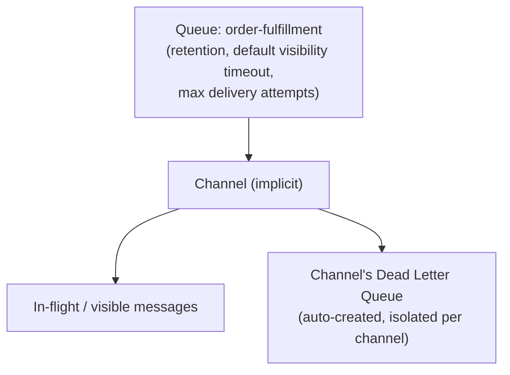
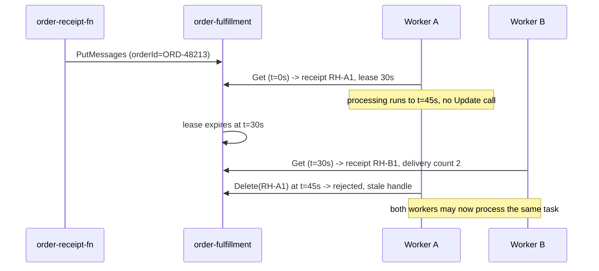
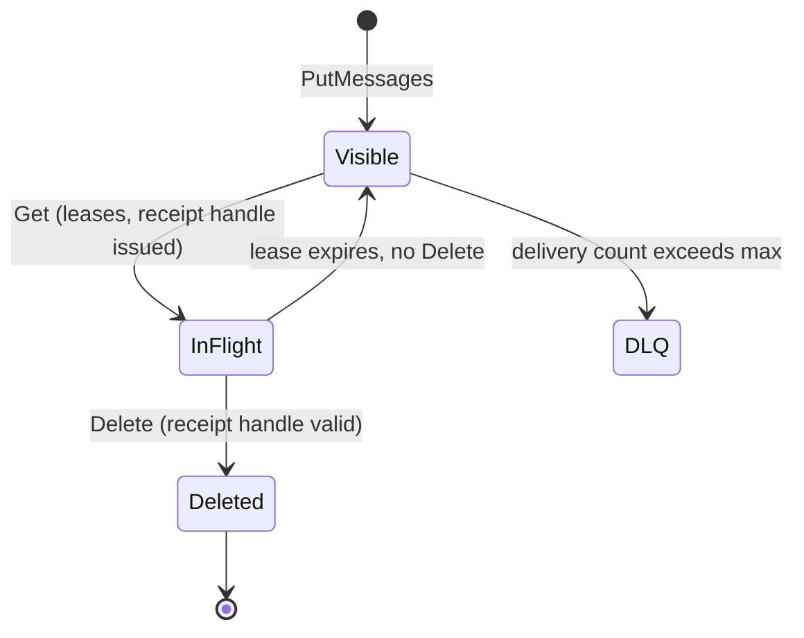

# Serverless Queues: Delivery You Have to Acknowledge

The natural assumption is that consuming a message removes it — it doesn't. A `GetMessages` call only **leases** a message for a limited window; deleting it is a separate, mandatory second call, and everything else in this lesson exists because of that gap. Visibility timeouts, delivery counts, and dead letter queues are all consequences of one design fact: a message a consumer read but never explicitly deleted is still sitting in the queue, waiting to be handed to someone else.

---

## Contents

1. [The Resource Model: Queue, Endpoints, and Settings](#1-the-resource-model-queue-endpoints-and-settings)
2. [The Message Lifecycle: Put, Get, Update, Delete](#2-the-message-lifecycle-put-get-update-delete)
3. [Channels: Ordering and Multiplexing Inside One Queue](#3-channels-ordering-and-multiplexing-inside-one-queue)
4. [Dead Letter Queues and the Delivery Count](#4-dead-letter-queues-and-the-delivery-count)
5. [Delivery Guarantees and Failure Handling](#5-delivery-guarantees-and-failure-handling)
6. [IAM and Access Control](#6-iam-and-access-control)
7. [Use Cases and Choosing Between Queue, Stream, and Events](#7-use-cases-and-choosing-between-queue-stream-and-events)
8. [Worked Walkthrough: One Fulfillment Task, Enqueue to Ack](#8-worked-walkthrough-one-fulfillment-task-enqueue-to-ack)
9. [Limits and Sources](#9-limits-and-sources)
10. [Summary](#10-summary)

---

## 1. The Resource Model: Queue, Endpoints, and Settings

### 1.1 Control plane vs. data plane: two endpoints, two APIs

**Creating a queue and sending messages through it are two different APIs against two different endpoints.** The control-plane call that creates a queue returns an **Oracle Cloud Identifier (OCID)**, but message traffic goes to a separate *messages endpoint* — retrieved with a follow-up `GetQueue` call — the same control-plane/data-plane split Module `06` established for a stream's own messages endpoint.

```bash
oci queue queue-admin queue create \
  --compartment-id "$COMPARTMENT_OCID" \
  --display-name "order-fulfillment" \
  --retention-in-seconds 86400 \
  --visibility-in-seconds 30 \
  --dlq-delivery-count 5

# The messages endpoint is a separate value, fetched after creation
oci queue queue-admin queue get --queue-id "$QUEUE_OCID" --query 'data."messages-endpoint"'
```

### 1.2 Queue-level settings are policy for every message

**Settings on the queue apply to every message published to it, not per-message:**

- **Retention** (10 seconds–7 days, default 1 day) — bounds how long an unconsumed message survives.
- **Default visibility timeout** (1 second–12 hours at the queue level, default 30 seconds) — what a `Get` call uses unless the caller overrides it.
- **`dlq-delivery-count`** (1–20) — the ceiling *Dead Letter Queues*, below, is built on.

### 1.3 The dead letter queue is a companion resource, not one you provision

**A dead letter queue (DLQ) is created automatically alongside the queue — there is no separate `create` call for it.** OCI Queue goes further than one DLQ per queue: **each channel within a queue has its own DLQ** (*Channels*, below, introduces what a channel is), so a message's failure history stays isolated to the channel it actually failed on rather than mixed into one queue-wide bucket.



*Every queue setting is policy applied to messages flowing through it; the dead letter queue exists the moment the queue does, scoped per channel rather than shared queue-wide.*

---

## 2. The Message Lifecycle: Put, Get, Update, Delete

The resource model above is static; this section is what actually happens to a message as it moves through it.

### 2.1 Put: publishing a message

**A `PutMessages` call accepts up to 20 messages and 512 KB per request** (see Limits and Sources) — batching several small messages into one call is the normal path, not an edge case.

```bash
oci queue messages put-messages \
  --queue-id "$QUEUE_OCID" \
  --endpoint "$MESSAGES_ENDPOINT" \
  --messages '[{"content":"{\"orderId\":\"ORD-48213\",\"task\":\"fulfillment\"}"}]'
```

### 2.2 Get: a lease, not a removal

**A `GetMessages` call returns a message *and* a receipt handle — the message is not removed, only made temporarily invisible to other Get calls** for the visibility timeout window. Long polling (0–30 seconds) lets a caller wait for a message to arrive rather than polling in a tight empty loop.

```python
import oci

queue_client = oci.queue.QueueClient(config, service_endpoint=messages_endpoint)
response = queue_client.get_messages(
    queue_id=queue_ocid,
    visibility_in_seconds=30,      # overrides the queue's default for this call
    timeout_in_seconds=20,         # long poll up to 20s if nothing is available yet
)
message = response.data.messages[0]
receipt_handle = message.receipt  # required by both Update and Delete, below
```

### 2.3 Update: extending (or shortening) the lease

**`UpdateMessages` extends a message's visibility timeout mid-processing**, using the receipt handle `Get` returned — the connecting artifact between the two calls. A worker that expects to run long calls `Update` before the current window expires, buying more time without losing its claim on the message.

```bash
# Extend the lease by another 30s before the current one expires — same
# receipt handle Get returned, required by both Update and Delete.
# update-messages takes a batch of entries, one per message being extended.
oci queue messages update-messages \
  --queue-id "$QUEUE_OCID" \
  --endpoint "$MESSAGES_ENDPOINT" \
  --entries '[{"receipt":"'"$RECEIPT_HANDLE"'","visibilityInSeconds":30}]'
```

### 2.4 Delete: the only call that actually removes a message

**`DeleteMessages` is the sole operation that permanently removes a message**, and it requires the same receipt handle `Get` produced. Skip it — whether from a crash, a bug, or a slow consumer — and the message simply reappears once its visibility timeout expires, exactly as if it had never been read.

> Nuance: a receipt handle is tied to *one specific lease*, not to the message itself. If a message is re-delivered to a second consumer after the first consumer's lease expires, the first consumer's now-stale receipt handle no longer matches the current lease — its `Delete` call fails rather than silently removing a message someone else is now processing (the worked walkthrough, below, traces exactly this).

---

## 3. Channels: Ordering and Multiplexing Inside One Queue

The message lifecycle above operates on one anonymous queue; channels are how one queue behaves like many addressable destinations underneath.

### 3.1 Implicit lifecycle: no create, no delete

**A channel is created the instant a message is published to a channel ID that doesn't exist yet, and deleted automatically once it's empty** — there is no `create-channel` or `delete-channel` call to make or forget. This ephemeral lifecycle is what makes channels cheap to use per-request rather than something to provision ahead of time.

### 3.2 Targeting a channel on consume

**A `Get` call can optionally name a channel ID** to read only from that channel; omitting it returns messages from any channel that has some available. Messages published to the same channel are served in roughly the order they were published, since only one lease can be outstanding against a channel's messages at a time — the queue as a whole makes no such promise across different channels.

### 3.3 The request-reply pattern channels enable

**Channels turn one queue into an addressable reply mechanism**, without standing up a second queue for responses: a caller publishes with its own generated channel ID, a worker consumes it and publishes the response back tagged with that same ID, and the original caller reads only its own channel. This is the same "one shared resource, many independent conversations" shape a gateway's routes give many backends (Module `05`) — just applied to message channels instead of HTTP paths.

### 3.4 Channel capacity and the 256-per-queue ceiling

**Up to 256 channels can exist on one queue** (see Limits and Sources), and a queue-level *channel capacity* setting caps how much of the queue's overall throughput any single channel can consume — so one noisy channel can't starve the other 255.

> Nuance: **channels** and **consumer groups** are two different, separately-capped concepts that sound alike. A channel is a message-routing destination — how a publisher addresses a subset of the queue. A **consumer group** is a distinct resource, capped at 10 per queue (see Limits and Sources), governed separately by **Identity and Access Management (IAM)** policy through its own `QUEUE_CONSUMER_GROUP_*` permissions (*IAM and Access Control*, below). Don't conflate the 256-channel ceiling with the 10-consumer-group one — they bound different things.

---

## 4. Dead Letter Queues and the Delivery Count

The message lifecycle above established that a missed `Delete` makes a message reappear; this section is what happens when that keeps happening to the same message.

### 4.1 The delivery count increments on every Get, not on explicit failure

**Every successful `Get` increments a message's delivery count** — there's no separate "failure" signal the consumer has to raise. An **unsuccessful delivery**, in the service's own terms, is simply a message whose visibility timeout expired before it was deleted; the count doesn't distinguish a consumer that crashed from one that was just slow.

### 4.2 `dlq-delivery-count`: the ceiling, 1–20

**Once a message's delivery count exceeds the queue's configured `dlq-delivery-count` (1–20, set at queue creation or update)**, the service automatically moves it to that channel's DLQ instead of redelivering it again.

> ⚠️ A consistently slow-but-eventually-successful consumer looks *identical* to a genuinely poison message, because both simply fail to delete before the timeout — the delivery count can't tell them apart. Before assuming a DLQ arrival means bad data, check whether the visibility timeout is just too short for real processing time (*Update: extending the lease*, above, is the fix for that case).

### 4.3 Inspecting and redriving a DLQ

**A DLQ message is retained until the DLQ's own retention period passes, then auto-deleted — but until then it's just another queue you can consume from.** Manually reading it lets you inspect the payload that failed, diagnose why, and republish a corrected copy back to the main queue if the fix is on the producer side rather than the consumer side.

```bash
# The channel's DLQ is itself a queue OCID — consume it exactly like any other
oci queue messages get-messages \
  --queue-id "$DLQ_OCID" \
  --endpoint "$DLQ_MESSAGES_ENDPOINT" \
  --limit 20
# Fix the payload, then republish to the original queue
oci queue messages put-messages \
  --queue-id "$QUEUE_OCID" \
  --endpoint "$MESSAGES_ENDPOINT" \
  --messages '[{"content":"{\"orderId\":\"ORD-48213\",\"task\":\"fulfillment\"}"}]'
```

---

## 5. Delivery Guarantees and Failure Handling

Sections 2–4 covered one message's mechanics; this section is what those mechanics add up to as guarantees.

### 5.1 At-least-once delivery, and the obligation it puts on the consumer

**OCI Queue guarantees at-least-once delivery, never exactly-once** — the same trade-off Module `06`'s stream consumer groups face, for the identical underlying reason: a crash between processing and deleting always looks the same as never having processed the message at all, so the service's only safe default is to redeliver. A consumer has to be idempotent — processing the same `orderId` twice must be harmless — because "delivered twice" is a normal outcome, not a bug.

### 5.2 Ordering: best-effort within a channel, none across the queue

**The per-channel ordering guarantee established in *Targeting a channel on consume*, above, is the only ordering this service offers — nothing holds across different channels or different publishers.** Don't design around strict, queue-wide ordering — if a workload genuinely needs it, that's a sign to reconsider whether a single-partition stream (Module `06`) fits better.

### 5.3 The in-flight ceiling as backpressure

**A queue caps in-flight (leased but undeleted) messages at 100,000** (see Limits and Sources). Once that ceiling is hit, further `Get` calls simply return nothing new until existing leases are deleted or expire — a slow consumer pool throttles new deliveries automatically, rather than the queue growing an unbounded backlog of outstanding leases.

### 5.4 Crash mid-processing: the timeout *is* the recovery mechanism

**The same timeout that bounds an honest processing window is also the entire crash-recovery mechanism — there's no separate detection step.** A consumer that crashes after `Get` but before `Delete` needs no special handling: its lease simply expires and the message becomes available again, exactly like a slow consumer that never called `Update`. No dead-consumer detection, no heartbeat protocol required.

---

## 6. IAM and Access Control

Every operation from *put* to *delete* is gated by policy before it's gated by anything the queue itself enforces.

### 6.1 Produce and consume are separate, dedicated permissions

**OCI Queue splits produce from consume at the policy level, the same shape Module `06` used for stream-push vs. stream-pull**: `queue-push` grants sending messages, `queue-pull` grants receiving, updating, and deleting them. A group with only `queue-push` can publish but never read anything back — useful for a producer that should have zero ability to drain the queue it feeds.

```text
Allow dynamic-group order-receipt-fn-dg to use queue-push in compartment orders
  where target.queue.id = '<order_fulfillment_queue_ocid>'
Allow dynamic-group fulfillment-worker-dg to use queue-pull in compartment orders
  where target.queue.id = '<order_fulfillment_queue_ocid>'
```

### 6.2 `order-receipt-fn` as a producer, under its own resource principal

**`order-receipt-fn` (Module `04`) enqueues a fulfillment task the same way it wrote a receipt to Object Storage** — assuming its resource principal and calling `queue-push`, with no stored credential anywhere in the function's configuration.

### 6.3 Queue management stays a separate grant from message access

**Creating, updating, or deleting the queue resource itself needs `manage queues`**, a strictly higher grant than either `queue-push` or `queue-pull` — a team that should be able to send and receive messages doesn't automatically get to change the queue's retention or delivery-count settings underneath them.

---

## 7. Use Cases and Choosing Between Queue, Stream, and Events

Sections 1–6 built the mechanics; this is where those mechanics map onto when to actually reach for a queue.

### 7.1 What a queue is good at

- **Decoupling components for independent scaling** — a producer and its consumers scale on completely different schedules, connected only by the queue between them.
- **Queue-triggered Functions for task processing** — a function invoked per message (or per batch), doing the work Sections 2–4's lifecycle already describes, then deleting on success.
- **Absorbing traffic spikes ahead of a smaller, slower consumer pool** — the in-flight ceiling (*The in-flight ceiling as backpressure*, above) means a burst of publishes queues up rather than overwhelming a fixed-size worker fleet.

### 7.2 Queue vs. Stream: competing consumers vs. replayable log

**A queue and a stream solve adjacent but different delivery problems**, and the choice comes down to whether a message should be processed once, by one worker, or replayed independently by many.

| | Queue | Stream (Module `06`) |
| :--- | :--- | :--- |
| Delivery model | Competing consumers — one worker processes and deletes each message | Replayable partitioned log — many independent consumer groups each track their own position |
| Once processed | Gone (deleted) | Still there for anyone else to read again |
| Choose it when | Work items should be done exactly once, by whichever worker picks them up first | Multiple independent readers each need their own view of the same history, or need to replay it |

Don't read "competing consumers" as a limitation — it's the correct model for task distribution, where two workers processing the same fulfillment task would be a bug, not a feature.

### 7.3 Where Events fits — deferred

**A third messaging primitive, OCI Events, is rule-routed notification rather than either a queue or a stream** — reacting to a service-emitted event rather than a message a producer explicitly sent. Module `08` covers it in full; the shape worth remembering here is that Events answers "route this occurrence to zero or more actions," a different question from "who processes this work item" (Queue) or "who gets to replay this history" (Streaming).

---

## 8. Worked Walkthrough: One Fulfillment Task, Enqueue to Ack

`order-receipt-fn` (Module `04`) enqueues one task to `order-fulfillment`, configured with a 30-second default visibility timeout and a delivery-count ceiling of 5.

1. **Enqueue.** `order-receipt-fn` calls `PutMessages` with `{"orderId": "ORD-48213", "task": "fulfillment"}`. The message is now visible with delivery count 0.
2. **Worker A leases it.** At `t=0s`, Worker A calls `Get`, receiving receipt handle `RH-A1` and a 30-second lease. Delivery count is now 1.
3. **Worker A runs long.** Processing takes 45 seconds — past the 30-second lease — and Worker A never calls `Update`.
4. **The lease expires; Worker B leases the same message.** At `t=30s`, the message becomes visible again. Worker B calls `Get`, receiving a *new* receipt handle, `RH-B1`. Delivery count is now 2.
5. **Worker A's stale delete fails.** At `t=45s`, Worker A finishes and calls `Delete` with `RH-A1` — it's rejected, because `RH-A1` no longer matches the current lease (`> Nuance` in *The Message Lifecycle*, above). Both workers may now be doing the same fulfillment work — the reason idempotent processing (*At-least-once delivery*, above) isn't optional.
6. **The fix: extend, don't overrun.** On a second, corrected run, Worker A instead calls `UpdateMessages` with `RH-A1` at `t=20s`, extending its lease by another 30 seconds before it can expire — it finishes at `t=45s` and deletes successfully with the still-valid `RH-A1`. No second worker is ever woken.
7. **A malformed message hits the DLQ.** A separate message with corrupted JSON fails parsing on every attempt; after its delivery count passes 5, the service moves it to the channel's DLQ. Ops manually consumes the DLQ, finds the malformed payload, fixes the producer, and republishes a corrected copy to `order-fulfillment`.



*The naive run: an overrun lease silently produces two workers on one task. The corrected run — `Update` before the lease expires — never reaches this state at all.*



*A message cycles between Visible and InFlight until either a valid Delete removes it or repeated timeouts push it to the dead letter queue.*

---

## 9. Limits and Sources

| Limit | What it forces | As-of + docs |
| :--- | :--- | :--- |
| 10 queues per tenancy per region | A design needing more than 10 logical queues should route through channels (*Channels*, above) instead of requesting a limit increase | Jul 2026, [docs](https://docs.oracle.com/en-us/iaas/Content/queue/overview.htm) |
| Message size 256 KB; `PutMessages` up to 512 KB / 20 messages per call; `GetMessages` up to 2 MB / 20 messages per call | Large payloads belong in object storage with a reference in the message, not inline | Jul 2026, [docs](https://docs.oracle.com/en-us/iaas/Content/queue/overview.htm) |
| Retention 10 seconds–7 days, default 1 day | Retention shorter than the longest plausible consumer outage silently drops work — the queue reports nothing when it expires | Jul 2026, [docs](https://docs.oracle.com/en-us/iaas/Content/queue/overview.htm) |
| Visibility timeout 1 second (queue-level minimum)–12 hours, default 30 seconds | Set it from measured p99 processing time, then use `UpdateMessages` for the tail — a timeout tuned to the average guarantees redelivery on every slow run | Jul 2026, [docs](https://docs.oracle.com/en-us/iaas/Content/queue/overview.htm) |
| `dlq-delivery-count` configurable 1–20 | Set it against how many transient failures are plausible, not as a retry budget — a message that fails 20 times has usually failed for a reason retrying won't fix | Jul 2026, [docs](https://docs.oracle.com/en-us/iaas/Content/queue/deadletterqueues.htm) |
| 100,000 in-flight messages per queue | A queue that sits near this ceiling is reporting a consumer-capacity problem, not a queue-sizing one — scale workers, don't request a limit increase | Jul 2026, [docs](https://docs.oracle.com/en-us/iaas/Content/queue/overview.htm) |
| 256 channels per queue; 10 consumer groups per queue (separate ceilings) | The two ceilings are independent — a design near the channel limit still has all 10 consumer-group slots free, and vice versa | Jul 2026, [docs](https://docs.oracle.com/en-us/iaas/Content/queue/overview.htm) |
| 1,000 GET requests/second per queue; 10 MB/s ingress and egress per queue; 2 GB storage per queue (20 GB per tenancy) | A single queue nearing any of these needs splitting across queues before it needs a limit-increase request | Jul 2026, [docs](https://docs.oracle.com/en-us/iaas/Content/queue/overview.htm) |
| Polling timeout 0–30 seconds | Use the full 30 s on an idle queue; a 0-second poll is the tight-loop shape long polling exists to avoid | Jul 2026, [docs](https://docs.oracle.com/en-us/iaas/Content/queue/overview.htm) |

> Note: Queue vs. Stream is a trade-off, not a limit — covered inline at *Queue vs. Stream: competing consumers vs. replayable log*. The slow-consumer-vs.-poison-message ambiguity is covered inline at *`dlq-delivery-count`: the ceiling, 1–20*.

---

## 10. Summary

An OCI queue never removes a message on read — `Get` only leases it behind a visibility timeout. `Delete`, called separately with the receipt handle that lease produced, is the only operation that actually removes it. Every other mechanic follows from that gap: a lease that expires before delete makes the message reappear automatically. That's the crash-recovery story, and it's also why at-least-once delivery — never exactly-once — is the only guarantee on offer.

Channels turn one queue into many addressable, auto-created-and-destroyed destinations, each carrying its own dead letter queue, so a request-reply pattern or a per-tenant routing scheme doesn't need a separate queue per conversation. A message that keeps failing to delete before its lease expires eventually crosses the configured delivery-count ceiling and lands in that DLQ — a diagnostic signal to inspect, not automatically proof of bad data, since a slow-but-working consumer produces the identical symptom.

Choosing a queue over a stream comes down to one question: should this be done once, by whichever worker gets to it first (queue), or does more than one independent reader need its own replayable view of the same history (stream)? Module `08` adds a third option, event-driven routing, to that same decision; Module `10` is where a queue's own metrics finally get analysed rather than just produced.
