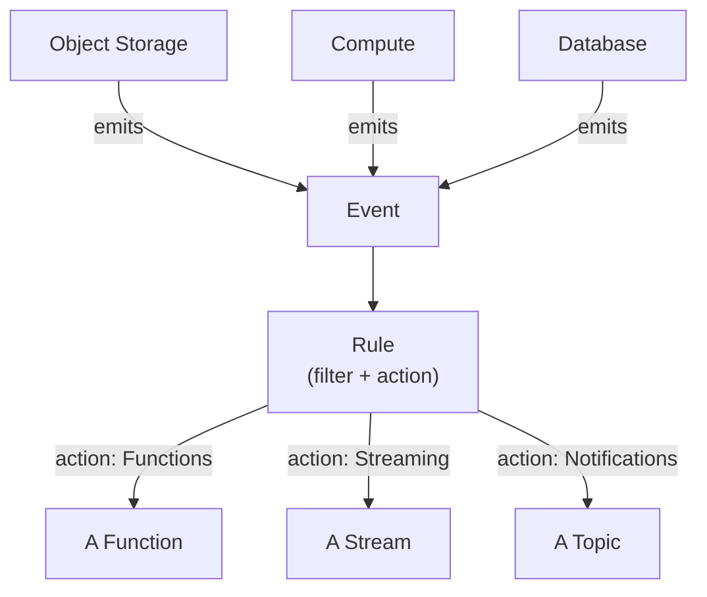
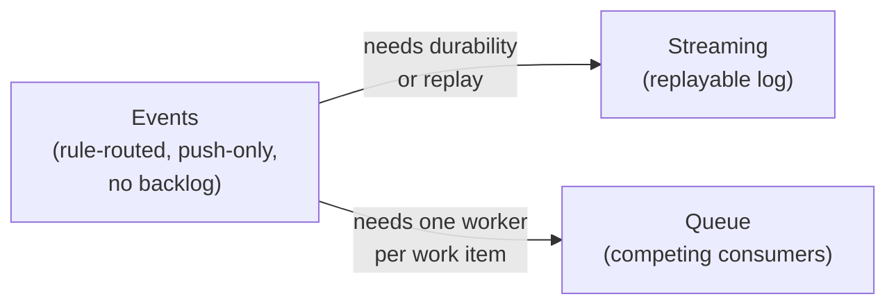
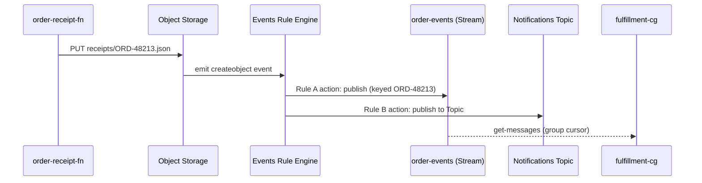

# Events: Rule-Routed Reactions to State Change

The natural assumption, coming from Streaming and Queue, is that Events works the same way — something that holds occurrences for a consumer to read. It doesn't. Events is push-only: an OCI service emits an event the instant something changes, and a **rule** you define either matches it and routes it to an action *right then*, or doesn't — there's no cursor, no backlog, no consumer group, and nothing to replay. If no rule matches at the moment an event fires, that occurrence is simply gone.

---

## Contents

1. [The Resource Model: Sources, Rules, and Actions](#1-the-resource-model-sources-rules-and-actions)
2. [The Event Envelope: What a Rule Actually Matches On](#2-the-event-envelope-what-a-rule-actually-matches-on)
3. [Filtering and Pattern Matching](#3-filtering-and-pattern-matching)
4. [Rule Actions: Functions, Streaming, Notifications, and Their IAM Prerequisites](#4-rule-actions-functions-streaming-notifications-and-their-iam-prerequisites)
5. [Compartment Scope and Fan-Out](#5-compartment-scope-and-fan-out)
6. [Use Cases: Reacting Without Polling](#6-use-cases-reacting-without-polling)
7. [Choosing Between Events, Queue, and Streaming](#7-choosing-between-events-queue-and-streaming)
8. [Worked Walkthrough: One Receipt Upload, Event to Action](#8-worked-walkthrough-one-receipt-upload-event-to-action)
9. [Limits and Sources](#9-limits-and-sources)
10. [Summary](#10-summary)

---

## 1. The Resource Model: Sources, Rules, and Actions

### 1.1 Sources: every producing service, not something you provision

**A source is any OCI service that emits state-change events, and sources aren't a resource you create.** Object Storage, Compute, database services, and dozens of others already emit events the moment something changes on them — a bucket is created, an instance stops, a backup completes — whether or not any rule is listening (as of Jul 2026, [docs](https://docs.oracle.com/en-us/iaas/Content/Events/Concepts/eventsoverview.htm)).

### 1.2 Rule: filter plus action, the one resource you actually build

**A rule is the only resource this service asks you to create** — a **filter** that narrows which events it reacts to, and an **action** that names where a match gets routed. A rule is scoped to a compartment (*Compartment Scope and Fan-Out*, below, covers exactly how far that scope reaches).

### 1.3 Action: exactly three destinations, never a generic webhook

**A rule routes to exactly one of three destination types — Functions, Streaming, or Notifications** (*Rule Actions*, below, covers each). There is no built-in "call an arbitrary HTTPS endpoint" action; reaching something outside these three always means writing a Function that makes the call itself.

```bash
oci events rule create \
  --compartment-id "$COMPARTMENT_OCID" \
  --display-name "receipt-uploaded" \
  --is-enabled true \
  --condition '{"eventType":["com.oraclecloud.objectstorage.createobject"]}' \
  --actions '{"actions":[{"actionType":"ONS","isEnabled":true,"topicId":"'"$TOPIC_OCID"'"}]}'
```



*Any number of services emit events into the same pool; a rule is the only piece you build, and it can only route to one of three action types.*

---

## 2. The Event Envelope: What a Rule Actually Matches On

The resource model above named the pieces; this section is the concrete artifact a rule's filter actually reads.

### 2.1 The CloudEvents-based schema

**Every event arrives in the same envelope shape, based on the CloudEvents standard** — a real, complete example, an Object Storage upload:

```json
{
  "cloudEventsVersion": "0.1",
  "eventID": "550e8400-e29b-41d4-a716-446655440000",
  "eventType": "com.oraclecloud.objectstorage.createobject",
  "source": "objectstorage",
  "eventTypeVersion": "1.0",
  "eventTime": "2026-07-28T21:19:24Z",
  "contentType": "application/json",
  "extensions": {
    "compartmentId": "ocid1.compartment.oc1..aaaaaaaaorders"
  },
  "data": {
    "compartmentId": "ocid1.compartment.oc1..aaaaaaaaorders",
    "resourceName": "receipts/ORD-48213.json",
    "resourceId": "ocid1.object.oc1..aaaaaaaareceipt48213",
    "additionalDetails": { "namespace": "orders-ns", "eTag": "f8ffb6e9-..." }
  }
}
```

(As of Jul 2026, [docs](https://docs.oracle.com/en-us/iaas/Content/Events/Reference/eventenvelopereference.htm).)

### 2.2 `extensions.compartmentId` vs. `data.compartmentId`

> Nuance: the same compartment **Oracle Cloud Identifier (OCID)** appears in two places, but they're not redundant. `extensions.compartmentId` is envelope-level metadata a rule's compartment scope matches against without parsing into the payload at all; `data.compartmentId` is just one more field of the resource-specific payload, alongside `resourceName` and `resourceId`. Don't read the duplication as a bug — routing and payload deliberately stay separable.

### 2.3 `eventType`: the namespaced key most filters match on

**`eventType` follows a fixed `com.oraclecloud.<service>.<action>` convention** — `com.oraclecloud.objectstorage.createobject` above names the service (`objectstorage`) and the specific occurrence (`createobject`) in one string, which is why it's the field almost every filter matches on first (*Filtering and Pattern Matching*, below).

---

## 3. Filtering and Pattern Matching

The envelope above is what exists; this section is how a rule actually picks events out of it.

### 3.1 `eventType` list: match specific occurrences

**The simplest filter is a list of `eventType` values** — a rule matches if the incoming event's type is anywhere in the list, and ignores everything else, the same shape the CLI snippet in *The Resource Model*, above, already showed.

### 3.2 Attribute matching: values inside `data`

**Attribute matching narrows further, into fields inside the event's own `data`** — matching not just "any `createobject` event" but "a `createobject` event where `resourceName` starts with `receipts/`." This is what turns a service-wide filter into one scoped to a specific bucket, table, or instance.

### 3.3 Tag matching: reaching across resource types by label

**Tag matching filters on `freeFormTags` or `definedTags` instead of a fixed field or event type** — a rule that reacts to any tagged-`Environment=prod` resource's events, regardless of which service or event type produced them.

```json
{
  "eventType": ["com.oraclecloud.objectstorage.createobject"],
  "data": {
    "resourceName": { "prefix": "receipts/" }
  },
  "definedTags": { "Operations": { "Environment": "prod" } }
}
```

### 3.4 Selection guidance: attribute vs. tag

**Reach for attribute matching when the set of event types and resources is known and fixed** — one bucket, one event type, as above. **Reach for tag matching when the target set spans services or grows over time** — anything tagged a certain way, without editing the rule every time a new resource joins that set.

---

## 4. Rule Actions: Functions, Streaming, Notifications, and Their IAM Prerequisites

Sections 2–3 covered matching; this section is what happens once a match fires.

### 4.1 Functions: custom logic, invoked by identity

**A Functions action invokes a function by OCID**, the same identity-based invocation Module `05`'s gateway route used for `order-receipt-fn` — no address, no imagePullSecret, just an authorized call. This is the action to reach for when the response to an event needs custom logic no other action type can express. The function receives the same envelope shown in *The Event Envelope*, above, as its invocation payload — the connecting artifact between a rule firing and a function actually running:

```python
# Same FDK handler contract Module 04 established — the event envelope
# arrives as the invocation body, no different from any other invoke
import io, json
from fdk import response

def handler(ctx, data: io.BytesIO = None):
    event = json.loads(data.getvalue())
    resource_name = event["data"]["resourceName"]  # e.g. "receipts/ORD-48213.json"
    return response.Response(ctx, response_data=json.dumps({"processed": resource_name}))
```

### 4.2 Streaming: durable, replayable ingestion

**A Streaming action publishes the event onto a stream**, giving it everything Module `06` already covered — replay, multiple independent consumer groups, retention. This is the third target Module `06`'s own summary named without detail — Events is exactly that third router.

```json
{
  "actions": [
    { "actionType": "OSS", "isEnabled": true, "streamId": "ocid1.stream.oc1..aaaaaaaaorderevents" }
  ]
}
```

### 4.3 Notifications: the human-facing sink

**A Notifications action publishes to a Topic**, which fans out to its subscriptions — email, Slack, PagerDuty, and more. This is the same delivery mechanism Module `10`'s monitoring alarms will also publish through; an ops team's inbox can end up receiving both an Events-triggered notice and an Alarm-triggered one through the identical Topic, with nothing in the message itself distinguishing which producer sent it unless the rule or alarm names that explicitly.

### 4.4 IAM: the Events service is the caller here, not your own resources

**Every action needs a policy grant to *the Events service itself*, not a dynamic group of your own resources** — a genuinely different shape from the resource-principal pattern this track has used everywhere else, because here it's OCI's own Events service calling out on your behalf, not one of your resources calling another.

```text
Allow service events to use fn-invocation in compartment orders
Allow service events to use stream-push in compartment orders
Allow service events to {ONS_TOPIC_PUBLISH} in compartment orders
```

> Nuance: don't reach for a dynamic-group policy here the way Module `04`'s function or Module `06`'s stream producer did — a dynamic group matches *your* resources by a rule like "all functions in this compartment." The Events service isn't one of your resources at all; it's granted access the same way any other OCI service principal is, with `service events` as the grantee.

---

## 5. Compartment Scope and Fan-Out

The resource model above named a rule as compartment-scoped; this section is what that scope actually reaches, and what happens when more than one rule reacts to the same event.

### 5.1 Scope cascades to child compartments

**A rule reacts to events from its own compartment and every child compartment beneath it** — the same downward-flowing shape Identity and Access Management (IAM) policy inheritance already established, though it's a distinct mechanism reaching the same intuition: scope broadens as you move up the compartment tree, not down.

### 5.2 Fan-out: one event, many rules, no coordination

**More than one rule can match the same event, and each fires its own action independently** — there's no ordering between them and no shared transaction; a Streaming action and a Notifications action triggered by the same event are two unrelated deliveries that happen to share a cause.

### 5.3 No match, no memory

**An event with zero matching rules at the moment it fires is simply gone** — there's no backlog sitting behind it and no way to write a new rule tomorrow and have it catch yesterday's event. This is the sharpest contrast with a stream (Module `06`): a stream's retention window means a *late* consumer group can still catch up; a *late* rule cannot, because the rule itself didn't exist when the event needed matching.

### 5.4 Metrics and troubleshooting: finding *where* a rule stopped working

**Four metrics in the `oci_cloudevents` namespace form a funnel, and comparing adjacent stages is how you localize a failure without guessing** — `PublishedEvents`, `MatchedEvents`, `DeliverySucceedEvents`, and `DeliveryFailedEvents` (as of Jul 2026, [docs](https://docs.oracle.com/en-us/iaas/Content/Events/Reference/eventsmetrics.htm)). Each metric answers a narrower question than the one before it, so where the count drops off names the failure.

| Compare | If it drops here | Likely cause |
| :--- | :--- | :--- |
| `PublishedEvents` vs. `MatchedEvents` | Few events matched despite many published | The filter itself isn't matching — check `eventType`, attribute, or tag conditions (*Filtering and Pattern Matching*, above) |
| `MatchedEvents` vs. `DeliverySucceedEvents` | Matches occur but deliveries don't succeed | The action or its IAM grant is the problem — check the policy from *IAM: the Events service is the caller here*, above |
| `DeliveryFailedEvents` | Non-zero | Delivery is actively failing — check the target action's own health (a disabled Topic, a stream at its throughput ceiling) |

This is the direct payoff of *No match, no memory*, above: since a silently-unmatched event leaves no trace in the event stream itself, `PublishedEvents` vs. `MatchedEvents` is the only way to notice the gap after the fact.

---

## 6. Use Cases: Reacting Without Polling

Sections 1–5 built the mechanics; this section is where they map onto why a rule is worth writing at all.

### 6.1 Lifecycle events across services

**Object Storage, Compute, and database lifecycle events are the common starting point** — a bucket object created, an instance stopped, a backup finished — each already emitted with no extra instrumentation required on your part.

### 6.2 One event, many purposes

**A single upload can simultaneously feed an audit trail and trigger processing**, through two independent rules matching the same event, each with its own action — the business version of the fan-out mechanic (*Fan-out: one event, many rules, no coordination*, above).

### 6.3 Replacing a poll loop or a fixed schedule

**A rule reacting to a real state change beats a Function polling for one, or running on Module `04`'s cron schedule to notice one indirectly.** If the state change already exists as an event, scheduling a Function to check "did anything change?" on a timer is strictly worse than a rule that only runs the instant something actually did.

---

## 7. Choosing Between Events, Queue, and Streaming

Three services now cover "something happened, act on it" — the choice comes down to what kind of "act on it" is actually needed.

### 7.1 Three answers to three different questions

| | Events | Queue (Module `07`) | Streaming (Module `06`) |
| :--- | :--- | :--- | :--- |
| Trigger | A service state change, matched by a rule | An explicit message a producer sent | An explicit message a producer sent |
| Delivery | Rule-routed, push-only, no backlog | Competing consumers — one worker per message | Replayable partitioned log — many independent readers |
| No match / no reader | Occurrence is lost | Message waits until retention expires | Message waits until retention expires |
| Choose it when | Reacting to something an OCI service already did | Distributing discrete work items to a worker pool | Multiple independent readers need their own replayable view |

### 7.2 They compose, rather than compete

**The worked walkthrough below is the common real shape**: an Events rule reacts to a state change and routes it *into* a stream, so replay and multiple consumer groups pick up downstream of the event — Events supplies the trigger, Streaming supplies the durability neither Events nor a bare rule action has on its own.



*Events supplies the trigger; the arrows name the specific gap that pushes a rule's action toward Streaming or Queue instead of stopping at the rule itself.*

---

## 8. Worked Walkthrough: One Receipt Upload, Event to Action

`order-receipt-fn` (Module `04`) writes a receipt after processing an order; this traces what happens next, purely from that upload, with no code in `order-receipt-fn` aware any of it is happening.

1. **The upload.** `order-receipt-fn` finishes and writes `receipts/ORD-48213.json` to its Object Storage bucket, exactly as Module `04`'s own walkthrough already showed.
2. **Object Storage emits an event.** The envelope from *The Event Envelope*, above, fires with `eventType: com.oraclecloud.objectstorage.createobject` and `data.resourceName: receipts/ORD-48213.json`.
3. **Rule A matches: Streaming action.** A rule scoped to the `orders` compartment, filtered on that `eventType` plus a `receipts/` prefix match, fires — its action publishes the event's `data` onto `order-events` (Module `06`), keyed on the order ID parsed from the object name.
4. **`fulfillment-cg` reads it like any other message.** The consumer group from Module `06`'s own walkthrough consumes this message with zero awareness it originated from an event rather than a direct `PutMessages` call — from the stream's side, a rule action is just another producer.
5. **Rule B matches independently: Notifications action.** A second rule in the same compartment, filtering on the same `eventType`, separately fires — its action publishes to a Topic that emails the ops distribution list. Rule A and Rule B share nothing but the event that triggered both; neither knows the other exists.



*One event, matched independently by two rules with two unrelated actions — neither rule coordinates with, or is even aware of, the other.*

---

## 9. Limits and Sources

| Limit | What it forces | As-of + docs |
| :--- | :--- | :--- |
| 50 rules per tenancy, per region | Bounds how many independent filter/action pairs one tenancy can run before a limit-increase request | Jul 2026, [docs](https://docs.oracle.com/en-us/iaas/Content/Events/Concepts/eventsoverview.htm) |
| Exactly three action types: Functions, Streaming, Notifications | Reaching an arbitrary external endpoint always means writing a Function to make that call — there is no direct webhook action | Jul 2026, [docs](https://docs.oracle.com/en-us/iaas/Content/Events/Concepts/eventsoverview.htm) |
| A rule's scope cascades to child compartments | A rule in a parent compartment sees events from every child compartment too, without being redefined in each | Jul 2026, [docs](https://docs.oracle.com/en-us/iaas/Content/Events/Concepts/eventsoverview.htm) |
| Events are push-only with no retention or replay | A rule created after an event fired can never see that event — unlike a stream, there is no backlog to catch up on | Jul 2026, [docs](https://docs.oracle.com/en-us/iaas/Content/Events/Concepts/eventsoverview.htm) |
| Envelope is CloudEvents 0.1-based, with a fixed `com.oraclecloud.<service>.<action>` `eventType` convention | Filters written against `eventType` transfer their shape across every producing service | Jul 2026, [docs](https://docs.oracle.com/en-us/iaas/Content/Events/Reference/eventenvelopereference.htm) |
| Four `oci_cloudevents` metrics: `PublishedEvents`, `MatchedEvents`, `DeliverySucceedEvents`, `DeliveryFailedEvents` | Comparing adjacent stages localizes a failure to filtering, delivery, or the action's own health, without guessing | Jul 2026, [docs](https://docs.oracle.com/en-us/iaas/Content/Events/Reference/eventsmetrics.htm) |

> Note: Events vs. Queue vs. Streaming is a trade-off, not a limit — covered inline at *Three answers to three different questions*: rule-routed reaction to state change vs. competing-consumer task distribution vs. replayable multi-reader log. `extensions.compartmentId` vs. `data.compartmentId` is the confusable-field pair worth remembering — covered inline at *The Event Envelope*.

---

## 10. Summary

An Events rule is push-only: it matches a CloudEvents-shaped envelope the instant a service emits it and routes a match to exactly one of three actions — Functions, Streaming, or Notifications — with no cursor, no backlog, and no way to catch an event that fired before the rule existed. Filtering narrows what a rule reacts to through `eventType`, attribute matching inside `data`, or tag matching across resource types, and IAM here grants the Events service itself as the caller, not a dynamic group of your own resources the way every other service in this track has.

More than one rule can match the same event, each firing independently with no coordination or shared ordering between them — fan-out is the default, not an edge case. Routing an event into a Streaming action is the common way to gain durability and replay that Events itself deliberately doesn't provide, which is exactly what the worked walkthrough traced: a receipt upload event feeding both a stream and a human notification, from one Object Storage write `order-receipt-fn` never had to know about.

Choosing between Events, Queue, and Streaming comes down to what triggers the reaction and what happens when nothing is listening yet: a state change an OCI service already produced (Events), a discrete work item one worker should own (Queue), or a history multiple independent readers need their own replayable view of (Streaming). A rule that stops working localizes to one of three funnel stages — matching, delivery, or the action's own health — through the `PublishedEvents`, `MatchedEvents`, and delivery metrics this lesson already covers; Module `09` turns to securing everything this track has built so far, and Module `10` is where the rest of the system's metrics and logs join those in one troubleshooting picture.
