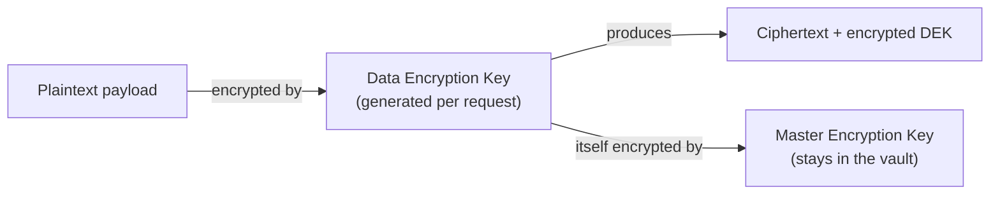
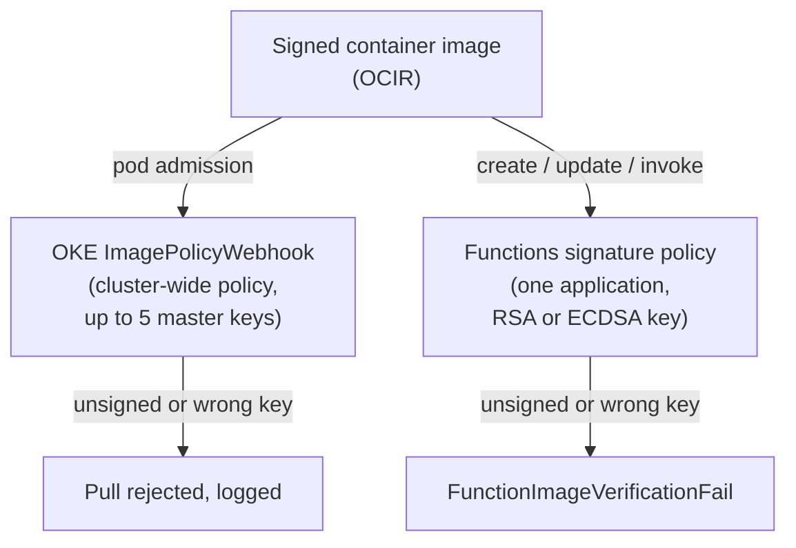
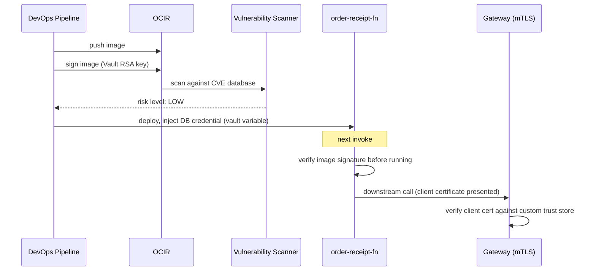

# Testing and Securing Cloud Native Applications: Verifying Behavior and Verifying Trust

Securing a cloud-native system is not one control bolted on before shipping — it's several independent, layered checks, each answering a different question, none of which substitutes for another. Scanning an image checks its *content* against known vulnerabilities; signing checks its *identity*, so an image that scans clean can still be swapped for a tampered one unless something also verifies provenance. This lesson builds that chain: testing the behavior of a distributed system, then encrypting, signing, and establishing trust across every piece this track has already built.

Two testing strategies extend the unit- and integration-testing baseline this track assumes as background:

| Strategy | Verifies | Concrete example | Catches |
| :--- | :--- | :--- | :--- |
| **Contract testing** | An interface is honored under normal operation, without either side running live | The gateway route (Module `05`) records the exact response shape it depends on from `order-receipt-fn`; the provider replays that recording in its own build pipeline (Module `01`) before ever deploying | A renamed field or changed status code, in CI, no live dependency required |
| **Resilience testing** | The system degrades and recovers the way its design claims, under a real injected failure | Killing the node running one replica of `orders-service` (Module `03`) and confirming the Kubernetes `Service` and its load balancer route around it | Redundancy that looks correct on paper but never actually failed over |

Contract testing is not a lighter integration test: an integration test only catches the same class of break after every dependency is live simultaneously — slower, and later, than a contract test's recorded-expectation check in CI. Neither substitutes for the other: a service can pass every contract test and still fall over the first time a real dependency times out, and a service that survives chaos testing can still be silently sending the wrong response shape to a caller.

> Note: this table is this track's own grounding in established industry practice for a distributed, OCI-hosted system — not verified wording from the official course.

---

## Contents

1. [OCI Vault: Vault Types, Key Protection, and Envelope Encryption](#1-oci-vault-vault-types-key-protection-and-envelope-encryption)
2. [Secrets: Versions, Rotation States, and Consuming a Secret](#2-secrets-versions-rotation-states-and-consuming-a-secret)
3. [Image Security: Scanning for Known Vulnerabilities](#3-image-security-scanning-for-known-vulnerabilities)
4. [Enforcing Signed Images: OKE's Cluster Policy vs. Functions' Application Policy](#4-enforcing-signed-images-okes-cluster-policy-vs-functions-application-policy)
5. [OCI Certificates: Authorities, Certificates, and CA Bundles](#5-oci-certificates-authorities-certificates-and-ca-bundles)
6. [Custom Trust Store and Mutual TLS](#6-custom-trust-store-and-mutual-tls)
7. [Worked Walkthrough: One Deploy, Verified Image to Verified Transport](#7-worked-walkthrough-one-deploy-verified-image-to-verified-transport)
8. [Limits and Sources](#8-limits-and-sources)
9. [Summary](#9-summary)

---

## 1. OCI Vault: Vault Types, Key Protection, and Envelope Encryption

Everything from here on depends on one resource: the encryption keys a **Vault** holds, and how those keys are actually used.

### 1.1 Vault types: Default vs. Virtual Private

**A Default vault shares Hardware Security Module (HSM) partitions with other tenants' vaults; a Virtual Private vault gets an isolated partition of its own** (see Limits and Sources).

| | Default vault | Virtual Private vault |
| :--- | :--- | :--- |
| HSM partition | Shared with other tenants | Isolated, single-tenant |
| Backup | Not supported | Supported |
| Automatic key rotation | Not supported | Supported |
| Choose it when | Standard workloads, no isolation requirement | Compliance/isolation requirements, or automatic rotation is needed |

Creating either is the same command, differing only in `--vault-type`:

```bash
oci kms management vault create \
  --compartment-id "$COMPARTMENT_OCID" \
  --display-name "orders-vault" \
  --vault-type "VIRTUAL_PRIVATE"
```

### 1.2 Key protection mode: HSM vs. Software

**A key's protection mode decides where cryptographic operations actually happen and whether the key material can ever leave OCI.** An HSM-protected key never leaves the hardware module — every operation runs on the HSM, and the key cannot be exported at all. A Software-protected key is encrypted at rest by an HSM root key but can run operations on the server or be exported to a client, trading some of that hardware isolation for flexibility.

**Choose HSM** when compliance requires key material to never exist outside dedicated hardware. **Choose Software** when a workload needs client-side cryptographic operations or lower cost, and HSM-only isolation isn't a hard requirement.

```bash
# Key operations run against the vault's own management endpoint,
# not the tenancy-wide control plane vault create used above
oci kms management key create \
  --endpoint "https://$VAULT_MANAGEMENT_ENDPOINT" \
  --compartment-id "$COMPARTMENT_OCID" \
  --display-name "orders-master-key" \
  --key-shape '{"algorithm":"AES","length":32}' \
  --protection-mode "HSM"
```

### 1.3 Envelope encryption: why the master key never touches your data directly

**A master encryption key never encrypts your actual payload — it only encrypts a much smaller, per-payload data encryption key.** Running every byte of a large payload through an HSM-backed key operation doesn't scale, so Vault generates a fresh **data encryption key (DEK)** on request instead. Your application encrypts the real payload with that DEK locally; only the DEK itself — tiny by comparison — then gets encrypted by the **master encryption key (MEK)** before being stored alongside the ciphertext.



*Only the small DEK ever touches the master key operation — the master key itself never runs against the bulk payload.*

```python
import oci

vault_client = oci.key_management.KmsCryptoClient(config, service_endpoint=crypto_endpoint)
dek_response = oci.key_management.KmsManagementClient(
    config, service_endpoint=management_endpoint
).generate_data_encryption_key(
    oci.key_management.models.GenerateKeyDetails(
        key_id=master_key_ocid, include_plaintext_key=True, key_shape={"algorithm": "AES", "length": 32}
    )
)
plaintext_dek = dek_response.data.plaintext  # used locally, then discarded
encrypted_dek = dek_response.data.ciphertext  # stored alongside the ciphertext payload
```

---

## 2. Secrets: Versions, Rotation States, and Consuming a Secret

The vault model above governs keys; a **secret** is a different resource built on top of it — a value like a database password, versioned and encrypted by a master key but never itself stored in the HSM.

### 2.1 A secret version carries a rotation state, not just a number

**Every secret version has a rotation state, and the state — not the version number — is what determines which value callers actually receive.**

| State | Meaning | Deletable? |
| :--- | :--- | :--- |
| `CURRENT` | In active use | No |
| `PENDING` | Staged and uploaded, not yet promoted — lets a new value land ahead of switching to it | No |
| `PREVIOUS` | Whatever was `CURRENT` before the last promotion — kept for rollback | No |
| `DEPRECATED` | Retired | **Yes** — the only state a version can be deleted from (see Limits and Sources) |

> Nuance: **`LATEST`** and **`CURRENT`** are easy to conflate but answer different questions. `LATEST` is purely chronological — whichever version was uploaded most recently. `CURRENT` is behavioral — whichever version callers actually get by default. A version can be `LATEST` while still sitting at `PENDING`, uploaded but not yet promoted to `CURRENT` — the two labels genuinely diverge during a staged rotation.

Uploading a new version stages it as `PENDING`; promoting it to `CURRENT` is a separate, explicit step:

```bash
oci vault secret update-base64 \
  --secret-id "$SECRET_OCID" \
  --secret-content-content "$(base64 -w0 new-db-password.txt)" \
  --secret-content-stage "PENDING"

oci vault secret update-base64 \
  --secret-id "$SECRET_OCID" \
  --current-version-number 3
```

### 2.2 Backup and replication: separate lifecycle guarantees from rotation

**Rotation changes *which* version is active; it does nothing to protect against losing the vault itself.** Backup — available only on a Virtual Private vault (*Vault types: Default vs. Virtual Private*, above) — is what actually protects against that. Replication is automatic and unconditional regardless of vault type: secrets replicate across two Availability Domains in a multi-AD region, or two fault domains in a single-AD region, so a single domain failure never makes a secret briefly unreadable.

### 2.3 Reading a secret two ways: fetched at runtime vs. injected at deploy

**A function can call the Secrets SDK directly, using its own resource principal, or a value can be injected into its configuration before it ever starts.** `order-receipt-fn` (Module `04`) could call `get_secret_bundle` at runtime the moment it needs a database credential. Alternatively, Module `01`'s DevOps deployment pipeline could inject that same credential as a vault variable instead, landing in the function's own application- or function-level config (Module `04`'s config-resolution split) before the container ever starts.

```python
import oci

secrets_client = oci.secrets.SecretsClient(config, signer=resource_principal_signer)
bundle = secrets_client.get_secret_bundle(secret_id=secret_ocid)
db_password = bundle.data.secret_bundle_content.content  # base64-encoded, current version by default
```

```yaml
# build_spec.yaml (Module 01) — a vault variable injected at deploy time,
# resolved once when the deployment pipeline runs, not on every invocation
env_variables:
  DB_PASSWORD: "${VAULT_SECRET_ID}"
```

### 2.4 Trade-off: injected at deploy time vs. fetched at runtime

**Injecting a secret at deploy time removes any runtime dependency on Vault being reachable** — the value is resolved once, and every subsequent invocation just reads local config.

> ⚠️ Rotation gap: a secret rotated in Vault has no effect on an already-deployed function until it's redeployed — every running instance keeps using the old value in the meantime, so the blast radius of a compromised credential stays open exactly that long.

**Fetching at runtime is always current on the very next call**, closing that gap, but it makes Vault a live dependency at the exact moment a function needs the secret — if Vault is unreachable, the call that needs the credential fails too. Neither choice is universally correct; it's rotation urgency against tolerance for a runtime dependency.

---

## 3. Image Security: Scanning for Known Vulnerabilities

Sections 1–2 covered protecting values; this section is the first of two image-integrity controls — checking an image's *content*.

### 3.1 Attaching a scanner: what gets scanned, and when

**Adding an image scanner to a repository scans every image pushed to it against the public Common Vulnerabilities and Exposures (CVE) database** — and, distinct from a one-time check, the registry automatically **re-scans** every already-scanned image whenever the CVE database itself gains new entries (see Limits and Sources). Enabling scanning on a repository that already has images immediately scans the four most recently pushed ones.

> ⚠️ Rescans run against a database that changes independently of your repository, so a previously clean result can go stale with zero new pushes — the image never changed, the CVE database did.

### 3.2 Risk levels and result retention

**Each scan produces a single overall risk level — Critical, High, Medium, Low, or Minor, in that priority order** — plus the individual vulnerabilities behind it, and results are retained for 13 months so a repository's trend is comparable over time, not just its latest snapshot (see Limits and Sources).

```json
{
  "imageId": "ocid1.containerimage.oc1..aaaaaaaareceiptfnimg",
  "highestProblemSeverity": "MEDIUM",
  "problemCount": 3,
  "scanCompletedAt": "2026-07-20T09:14:00Z"
}
```

### 3.3 Function image scanning is the same mechanism, not a separate feature

**Function image scanning is Oracle Cloud Infrastructure Registry (OCIR) scanning applied to a function's own backing repository, not a distinct security capability of OCI Functions.** The scanner has no awareness it's fronting a function rather than an OKE workload. `order-receipt-fn`'s image lives in an OCIR repository the same as any container image (Module `02`). Enabling it requires only granting the Vulnerability Scanning service itself permission to pull from that repository:

```text
Allow service vulnerability-scanning-service to read repos in tenancy
Allow service vulnerability-scanning-service to read compartments in tenancy
```

---

## 4. Enforcing Signed Images: OKE's Cluster Policy vs. Functions' Application Policy

Scanning checked content; this section is the second control, verifying an image's *provenance*. It splits into two genuinely different mechanisms, depending on where the image runs.

### 4.1 Two policies, two scopes, easy to conflate

**OKE's image verification policy is cluster-wide; Functions' signature-verification policy is scoped to one application.** Both name a Vault master key that must have signed an image before it's allowed to run, but they attach to different resources, enforce at different moments, and are configured independently — signing an image for one does nothing for the other.



*The same underlying idea — a Vault key must have signed the image — enforced by two independent mechanisms with different scopes and different failure signals.*

### 4.2 OKE: cluster-level enforcement via `ImagePolicyWebhook`

**An OKE image verification policy names up to five Vault master encryption keys** — RSA asymmetric, the only supported type — that must have signed an image before any pod in the cluster is allowed to pull it (see Limits and Sources). Enforcement happens at admission, through the same `ImagePolicyWebhook` path Module `03`'s admission-controllers section already introduced — this is that mechanism's specific, image-signing use. A disallowed pull is rejected and the attempt is recorded in application logs, not silently allowed through.

### 4.3 Functions: application-level enforcement across three operations

**A Functions signature-verification policy is enabled per application and requires an RSA or ECDSA Vault key.** Once enabled, it gates three separate points:

- **Create or update** — the function must already be based on a signed image.
- **Deploy** — `fn deploy` signs the image as part of the push.
- **Every invocation** — OCI Functions re-verifies the signature before running the image at all, distinct from either build-time check.

> ⚠️ AES symmetric keys aren't supported for signing — verification is inherently an asymmetric operation (see Limits and Sources for what that forces on a team standardized on AES for encryption).

```yaml
# func.yaml — signing details for `fn deploy` to sign the image on push
schema_version: 20180708
name: order-receipt-fn
signing_details:
    image_compartment_id: ocid1.tenancy.oc1..aaaaaaaaordersns
    kms_key_id: ocid1.key.oc1.phx.receiptfnsigningkey
    kms_key_version_id: ocid1.keyversion.oc1.phx.receiptfnkeyv1
    signing_algorithm: SHA_256_RSA_PKCS_PSS
```

An unsigned or wrongly-signed image fails at invoke time with `FunctionImageVerificationFail` — a live failure mode, not just a blocked deploy. A policy applies to at most 5 functions per application, and an image can carry more than one signature at once; as long as *any* signature on it matches the policy's configured key, the check passes.

### 4.4 Container permissions, revisited: verification doesn't replace runtime containment

**A correctly signed, cleanly scanned image still runs as the unprivileged `fn` user with every default Linux capability stripped** — the exact container permissions Module `04`'s own container-permissions section already established. Signature verification decides *which* image is allowed to run; container permissions bound what *that* image can do once it's actually running. Neither substitutes for the other — a compromised dependency baked into an otherwise legitimately-signed image is exactly the case unprivileged execution defends against.

---

## 5. OCI Certificates: Authorities, Certificates, and CA Bundles

Sections 1–4 secured keys, secrets, and images; this section moves to the last piece — the transport trust Module `05`'s gateway already consumed without this lesson explaining where it came from.

### 5.1 Four resources, one hierarchy: CA, subordinate CA, certificate, bundle

**A Certificate Authority (CA) issues certificates and, optionally, subordinate CAs beneath it** — building a chain of trust from one root down.

| Resource | Role | Can sign? | Source |
| :--- | :--- | :--- | :--- |
| Root CA | Top of the trust chain | Yes — self-signed | Created in OCI, or imported |
| Subordinate CA | Extends the chain from its parent | Yes | Signed by its parent CA |
| Certificate | Confirms one public key's identity | **No** — a leaf resource | Issued by a CA, or imported |
| CA bundle | A Privacy-Enhanced Mail (PEM)-formatted collection of root/intermediate certificates, packaged as one resource | No | Built from one or more CAs |

This is the resource Module `05`'s gateway attached at `--certificate-id` to terminate TLS for a custom domain, back when this service was only named as something to consume. A bundle carries its own metadata independent of any one certificate inside it — *Custom Trust Store and Mutual TLS*, below, is where this resource meets the gateway that actually consumes it.

Creating a bundle from an existing CA:

```bash
oci certs-mgmt ca-bundle create \
  --name "orders-internal-ca-bundle" \
  --compartment-id "$COMPARTMENT_OCID" \
  --ca-bundle-pem file://internal-root-ca.pem
```

### 5.2 Automatic renewal and revocation

**A certificate's renewal rule runs automatically ahead of expiry**, configured once at issuance rather than tracked by hand. A compromised certificate or CA is revoked instead, publishing it to a Certificate Revocation List (CRL) so anything checking against that CRL stops trusting it immediately, without waiting for natural expiry.

---

## 6. Custom Trust Store and Mutual TLS

The Certificates service above is the provisioning side; this section is the consuming side Module `05` already used.

### 6.1 A custom trust store is a CA bundle, purposed for verification

**A custom trust store is nothing more than a CA bundle (*Four resources, one hierarchy*, above) attached to a gateway for a specific verification purpose** — extending backend TLS verification past the default public CA set to trust an internal or private CA your own backends actually use, exactly as Module `05` first described.

### 6.2 Mutual TLS: the same service, a stricter trust decision

**Mutual TLS (mTLS) verifies the *client's* certificate, and Module `05`'s own warning about it now has its missing piece**: an mTLS-enabled deployment trusts only the custom CAs and CA bundles explicitly provisioned through this Certificates service — never falling back to the default public CA bundle that ordinary backend TLS verification uses. Provisioning trust for mTLS is a deliberate act, sourced from exactly the CA and CA-bundle resources this lesson just covered, not an automatic extension of any other trust already in place.

---

## 7. Worked Walkthrough: One Deploy, Verified Image to Verified Transport

`order-receipt-fn`'s path from build to a downstream call, with every control from this lesson layered onto the pipeline Modules `01`, `02`, and `04` already established.

1. **Build and sign.** The DevOps pipeline (Module `01`) builds `order-receipt-fn`'s image, pushes it to OCIR (Module `02`), then signs it with the application's configured Vault RSA key, using the `func.yaml` `signing_details` block from *Functions: application-level enforcement*, above.
2. **OCIR scans it.** The repository's attached scanner returns a `LOW` risk level — the pipeline's own gate checks this result before promoting the build any further.
3. **Deploy injects a secret.** The pipeline resolves a database credential from Vault and injects it as a vault variable, landing in `order-receipt-fn`'s function-level config — the *injected* side of the trade-off in *Secrets*, above, chosen here for zero runtime Vault dependency.
4. **Invoke-time verification.** On the next call, OCI Functions checks the image's signature against the application's policy *before* running it — an image tampered with after signing would fail here with `FunctionImageVerificationFail`, never reaching the handler at all.
5. **Runtime containment, regardless.** The container that does run still starts as the unprivileged `fn` user with stripped capabilities (*Container permissions, revisited*, above) — defense in depth even though two checks already passed.
6. **A downstream call, verified again.** `order-receipt-fn` calls back out through the gateway (Module `05`), which checks the caller's mTLS client certificate against a custom trust store — now traceable to the CA bundle this lesson's *Certificates* section actually explains — before the request ever reaches a route.



*Six independent checks — signing, scanning, injected-secret handling, invoke-time signature verification, unprivileged execution, and mTLS — none of which would have caught what another one did.*

---

## 8. Limits and Sources

| Limit | What it forces | As-of + docs |
| :--- | :--- | :--- |
| Virtual Private vault: 1,000 key versions included by default; asymmetric keys count as 2, symmetric as 1 | Sizing a vault for many asymmetric keys reaches the included allowance roughly twice as fast as symmetric ones | Jul 2026, [docs](https://docs.oracle.com/en-us/iaas/Content/KeyManagement/Concepts/keyoverview.htm) |
| Automatic key rotation: 60–365 day frequency, Virtual Private vaults only | Rotation frequency is set per key, so a compliance mandate expressed in days (90, 180) maps directly onto the 60–365 range rather than needing external tooling | Jul 2026, [docs](https://docs.oracle.com/en-us/iaas/Content/KeyManagement/Concepts/keyoverview.htm) |
| Secret rotation states: `CURRENT`, `PENDING`, `PREVIOUS`, `DEPRECATED`; only `DEPRECATED` versions can be deleted | Cleanup is a two-step operation, so a script that deletes old versions must deprecate first or it fails silently on every `CURRENT` and `PREVIOUS` version it hits | Jul 2026, [docs](https://docs.oracle.com/en-us/iaas/Content/KeyManagement/Concepts/secretversionsrotationstates.htm) |
| Image scan risk levels: Critical > High > Medium > Low > Minor; results retained 13 months | Anything needing a multi-year vulnerability record has to be exported before the 13-month mark — the registry won't hold it | Jul 2026, [docs](https://docs.oracle.com/en-us/iaas/Content/Registry/Tasks/registryscanningimagesforvulnerabilities.htm) |
| OKE image verification policy: up to 5 Vault master keys, RSA asymmetric only | Five key slots is enough to rotate signing keys without a flag day — sign with the new key, add it to the policy, retire the old one once nothing carries it | Jul 2026, [docs](https://docs.oracle.com/en-us/iaas/Content/ContEng/Tasks/contengenforcingsignedimagesfromocir.htm) |
| Functions signature-verification policy: up to 5 functions per application, RSA or ECDSA only (no AES) | A team standardized on AES keys for encryption needs a second, asymmetric key created specifically for signing — the two purposes can't share one key | Jul 2026, [docs](https://docs.oracle.com/en-us/iaas/Content/Functions/Tasks/functionsenforcingsignedimagesfromocir.htm) |
| OCIR automatically re-scans every already-scanned image whenever the CVE database gains new entries | Check re-scan history, not just the last scan date, when confirming an image is still clean | Jul 2026, [docs](https://docs.oracle.com/en-us/iaas/Content/Registry/Tasks/registryscanningimagesforvulnerabilities.htm) |

> Note: injected-at-deploy vs. fetched-at-runtime is a trade-off, not a limit — covered inline at *Trade-off: injected at deploy time vs. fetched at runtime*. `LATEST` vs. `CURRENT` is the confusable-state pair worth remembering — covered inline at *Secrets: Versions, Rotation States*.

---

## 9. Summary

Cloud-native testing here means two strategies beyond the unit- and integration-testing baseline: contract testing catches an interface break in CI without a live dependency, and resilience testing proves a system recovers from a real, injected failure. Neither replaces the security layers that follow.

Those layers stack rather than overlap. Vault protects keys and secrets through envelope encryption, a master key that never touches bulk data directly; secrets can be injected once at deploy or fetched fresh on every call, trading rotation latency against a runtime dependency.

Image security then splits into two orthogonal checks: scanning catches known vulnerabilities in an image's *content*, while signing verifies its *identity*. OKE's cluster-wide policy and Functions' application-scoped policy each enforce that signature check independently. Even a signed, clean image still runs under the same unprivileged container permissions Module `04` established.

The Certificates service closes the loop Module `05` left open: the custom trust store a gateway consumes for backend verification, and the stricter, explicitly-provisioned trust an mTLS deployment requires, are both just CA bundles this service issues or imports. Module `10` is where every control built here finally gets observed rather than just enforced.
