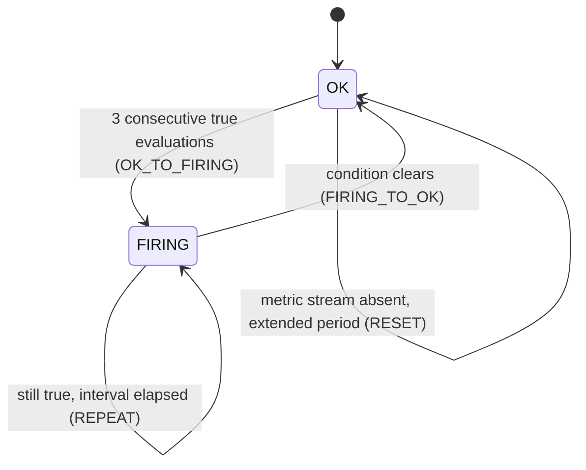
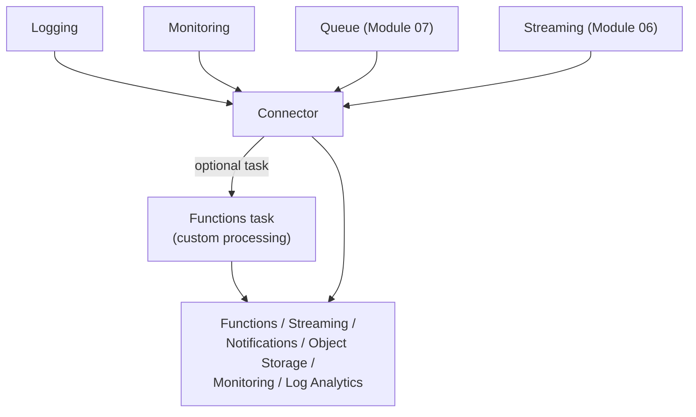
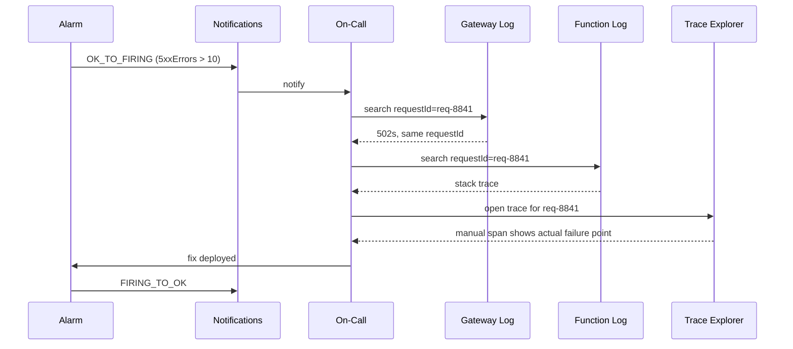

# Monitoring and Troubleshooting: Closing the Loop on Every Deferred Signal

Metrics, logs, and traces are not interchangeable tools you reach for on preference — each answers a structurally different question, and real troubleshooting moves through all three in a fixed order, never just whichever is handiest. A metric tells you *something* is wrong, in aggregate, over time; a log tells you *what happened*, on one resource, at one moment; a trace tells you *where in a chain of services* the time actually went. This lesson is where every "enabled here, analysed in Module `10`" note from Modules `03` through `05` finally gets analysed — the observability switches this track has been flipping on all along.

---

## Contents

1. [Metrics: Namespaces, Dimensions, the Monitoring Query Language, and Custom Metrics](#1-metrics-namespaces-dimensions-the-monitoring-query-language-and-custom-metrics)
2. [Alarms: From a Query to a Delivered Notification](#2-alarms-from-a-query-to-a-delivered-notification)
3. [Logging: Log Types, Log Groups, the Query Language, and Debugging OKE Workloads](#3-logging-log-types-log-groups-the-query-language-and-debugging-oke-workloads)
4. [Application Performance Monitoring: Domains, Spans, and Trace Explorer](#4-application-performance-monitoring-domains-spans-and-trace-explorer)
5. [Instrumenting Traces: Automatic Spans, Manual Spans, and Cross-Service Propagation](#5-instrumenting-traces-automatic-spans-manual-spans-and-cross-service-propagation)
6. [Connector Hub: Routing Observability Data Downstream](#6-connector-hub-routing-observability-data-downstream)
7. [Choosing Between Metrics, Logs, and Traces](#7-choosing-between-metrics-logs-and-traces)
8. [Worked Walkthrough: One Request, Correlated Across Gateway, Function, and Trace](#8-worked-walkthrough-one-request-correlated-across-gateway-function-and-trace)
9. [Limits and Sources](#9-limits-and-sources)
10. [Summary](#10-summary)

---

## 1. Metrics: Namespaces, Dimensions, the Monitoring Query Language, and Custom Metrics

### 1.1 Namespace: which service emitted a metric

**Every metric belongs to a namespace naming its source** — `oci_apigateway` is the one Module `05`'s gateway already emits into (`HttpRequests`, `Latency`, `4xxErrors`, `5xxErrors`), and OCI Functions and OKE carry their own equivalents, finally analysed rather than just named as existing.

### 1.2 Dimensions: what a query can filter and group by

**A dimension is a qualifier attached to a metric's data points** — `resourceId`, `availabilityDomain`, and service-specific ones like a gateway's `deploymentId` — that a query can filter on or group results by, rather than averaging every resource in a namespace into one indistinguishable number.

### 1.3 The Monitoring Query Language: metric, interval, dimensions, statistic

**A query in the Monitoring Query Language (MQL) has a fixed shape: `MetricName[interval]{dimensions}.groupBy(dim).statistic()`.** Reading `oci_apigateway`'s own `5xxErrors` at the 90th percentile per minute, grouped by deployment:

```text
5xxErrors[1m]{deploymentId = "ocid1.apideployment.oc1..ordersgw"}.groupBy(deploymentId).percentile(0.9)
```

Each piece answers a distinct question: the interval bounds *how data points are bucketed*, the dimension filter bounds *which resources count*, and the statistic — `max`, `min`, `sum`, `mean`, `percentile(n)` — decides *how a bucket collapses to one number*.

### 1.4 Custom metrics: the same model, published by your own code

**A custom metric is not structurally different from `5xxErrors` once it's published — it just comes from your application instead of an OCI service.** `order-receipt-fn` could call `PostMetricData` after every write, publishing a `ReceiptWriteLatency` data point under its own namespace; from that point on, the exact same MQL syntax above queries it.

```python
import oci

monitoring_client = oci.monitoring.MonitoringClient(config, signer=resource_principal_signer)
monitoring_client.post_metric_data(
    oci.monitoring.models.PostMetricDataDetails(metric_data=[
        oci.monitoring.models.MetricDataDetails(
            namespace="orders_custom",
            compartment_id=compartment_ocid,
            name="ReceiptWriteLatency",
            dimensions={"resourceId": "order-receipt-fn"},
            datapoints=[oci.monitoring.models.Datapoint(timestamp=now, value=42.3)],
        )
    ])
)
```

---

## 2. Alarms: From a Query to a Delivered Notification

The MQL queries above are read-only until an alarm wraps one in a trigger and a destination.

### 2.1 An alarm is a query plus a trigger rule — and it doesn't fire on the first breach

**An alarm evaluates its MQL query once per minute, and only fires after the condition holds true for a configured `pendingDuration` of *consecutive* evaluations** — a 3-minute `pendingDuration` means three straight one-minute evaluations must all cross the threshold before the alarm transitions to `FIRING`. A single noisy spike that clears on the next evaluation never fires anything.

```json
{
  "compartmentId": "ocid1.compartment.oc1..aaaaaaaaorders",
  "displayName": "gateway-5xx-high",
  "namespace": "oci_apigateway",
  "query": "5xxErrors[1m]{deploymentId = \"ocid1.apideployment.oc1..ordersgw\"}.sum() > 10",
  "pendingDuration": "PT3M",
  "severity": "CRITICAL",
  "destinations": ["ocid1.onstopic.oc1..opsteam"],
  "isEnabled": true
}
```

### 2.2 Four message types, not just "fired" and "cleared"

**An alarm sends one of four distinct message types, and conflating them misreads the notification stream.** `OK_TO_FIRING` is the initial transition into a firing state; `FIRING_TO_OK` is the condition clearing; `REPEAT` is sent at a configured interval *while still firing*, so an unresolved incident doesn't go silent; `RESET` fires when the underlying metric stream itself goes absent for an extended period, distinct from the condition actually clearing.



*Four distinct message types map to four distinct transitions — `REPEAT` and `RESET` are easy to conflate but trigger on opposite conditions: still-true vs. gone-entirely.*

### 2.3 Delivery: Notifications for people, Streaming for volume

**Notifications delivers to a Topic's subscriptions — email, Slack, PagerDuty — capped at 60 messages per evaluation; Streaming delivers to a stream instead, capped at 100,000.** Choose Notifications for ordinary, human-facing alerting; choose Streaming when an alarm could legitimately fan out past 60 distinct messages in one evaluation — many resources tripping the same condition at once, for instance.

> Nuance: routing a high-volume alarm into a stream doesn't bypass that stream's own limits (Module `06`) — a firehose of alarm messages can still hit the 1 MB/s-per-partition write ceiling if the destination stream is undersized for it.

### 2.4 Suppression stops notifications, not evaluation

**Suppression silences `OK_TO_FIRING`, `REPEAT`, and `RESET` messages for a scheduled window — the alarm keeps evaluating underneath it.** The wrong model is assuming suppression pauses the alarm itself; it doesn't. A condition that starts and clears entirely within a suppression window produces no messages at all, but the alarm's own evaluation history still shows it happened.

---

## 3. Logging: Log Types, Log Groups, the Query Language, and Debugging OKE Workloads

Metrics and alarms answer "is something wrong." Logs are the first place to look for "what exactly happened."

### 3.1 Three log types, three different questions

**Audit, service, and custom logs each answer a different diagnostic question, and none substitutes for another.**

| Log type | Answers | Example from this track |
| :--- | :--- | :--- |
| Audit | Who called which API, and when | Every API call against the tenancy, always on |
| Service | What did this OCI resource do | The gateway's execution/access logs (Module `05`), OKE's audit and application logs (Module `03`) |
| Custom | What did my own application code do | `order-receipt-fn`'s `stdout`/`stderr`, once its logging toggle (Module `04`) is enabled |

**A custom log reaches OCI Logging one of two ways: a direct `PutLogs` API call, or the Unified Monitoring Agent.** `order-receipt-fn`'s logging toggle handles ingestion for you — nothing calls `PutLogs` by hand. The agent is what a workload *outside* that managed path needs instead: a fluentd-based collector installed on a compute instance — an on-premises host, or a VM running something other than a managed OCI service — that reads local log files per an agent configuration and forwards them into OCI Logging the same `PutLogs` path ultimately uses.

### 3.2 Log groups: one more umbrella-and-contents resource

**A log group is a container that scopes Identity and Access Management (IAM) policy and organizes logs for correlated search** — the same "one resource, many independent things underneath" shape this track keeps reusing: a DevOps project holding pipelines (Module `01`), a gateway holding deployments (Module `05`), a stream pool holding streams (Module `06`). A log group holds logs, and moving it between compartments moves every log inside it along with it.

### 3.3 The Logging query language: correlating across logs by a shared field

**A query pipes a `search` over one or more logs through `where` filters**, and can span multiple logs, log groups, or an entire compartment in one call — the mechanism that makes cross-service correlation (*Worked Walkthrough*, below) possible at all.

```text
search "orders-compartment/gateway-logs" | where data.requestId = 'req-8841'
search "orders-compartment/receipt-fn-logs" | where data.requestId = 'req-8841'
```

Both queries filter on the same `requestId` field — the connecting artifact that ties one gateway access-log entry to the function log entry it caused, even though they live in completely separate logs.

### 3.4 Debugging OKE workloads: `kubectl` versus the Logging Service

**`kubectl logs`, `describe`, and `events` are live and local — they answer questions about a pod that still exists, and go with it once it's gone.** OCI Logging is the durable counterpart: cluster audit logs are always captured, and application logs persist there too once the logging path Module `03` deferred is enabled — the resource to search once a pod has already been rescheduled or deleted, or when correlating across pods and time is the actual question.

---

## 4. Application Performance Monitoring: Domains, Spans, and Trace Explorer

Logs answer what happened on one resource; **Application Performance Monitoring (APM)** answers where time went across several.

### 4.1 An APM domain, and its two data keys

**An APM domain is the collection instance traces and spans are sent to, and it issues two differently-trusted keys.** The **public data key** is safe to embed in client-side code — it's what the browser/RUM agent uses. The **private data key** is for server-side collectors — OpenTelemetry, the APM Java agent, and OCI Functions tracing all authenticate with it instead, and it should never ship to a client the way the public key safely can.

### 4.2 Trace and span: the tree, and its nodes

**A trace is the complete tree of spans for one request; a span is a single named operation with a start time and a duration.** One call to `order-receipt-fn` produces, at minimum, one span — the automatic invocation span *Instrumenting Traces*, below, covers — and every additional instrumented operation inside the handler adds another node to the same tree.

### 4.3 Trace Explorer and service topology

**Trace Explorer visualizes a trace's full span tree, letting you drill into the slowest or errored span directly**, rather than reconstructing timing by hand from separate logs. The topology view colors each participating service in the trace — the direct payoff of *Instrumenting Traces*' cross-service propagation, below: topology isn't inferred, it's built from IDs every span in the chain actually shares.

### 4.4 Attributes: what a trace query can filter on

**Attributes are the dimensions (string-valued) and metrics (numeric) a trace or span query can filter and aggregate on** — `Service Name` and `Operation Name` are the out-of-the-box ones every span carries regardless of instrumentation depth.

---

## 5. Instrumenting Traces: Automatic Spans, Manual Spans, and Cross-Service Propagation

The trace/span model above is static; this section is how one actually gets populated.

### 5.1 Automatic instrumentation: zero code, one span per invocation

**Enabling tracing on a Functions application produces a default invocation span with no code change at all** — Module `04`'s tracing dial, flipped on, is genuinely sufficient on its own for basic "how long did this invocation take, and did it error" visibility.

### 5.2 Manual spans: instrumenting what the automatic span can't see

**A handler can wrap its own operations in a manual span**, using tracing context OCI Functions hands it at invocation:

```python
from py_zipkin.zipkin import zipkin_span

def handler(ctx, data=None):
    tracing_context = ctx.TracingContext()
    with zipkin_span(
        service_name=tracing_context.service_name(),
        span_name="write-receipt-to-object-storage",
        transport_handler=lambda span: post_span(span, tracing_context),
        zipkin_attrs=tracing_context.zipkin_attrs(),
    ):
        object_storage.put_object(namespace, "orders-receipts", "ord-1042.json", receipt_bytes)
```

Four environment variables — `FN_APP_NAME`, `FN_FN_NAME`, `OCI_TRACE_COLLECTOR_URL`, `OCI_TRACING_ENABLED` — are what make `tracing_context` possible; they're populated automatically once tracing is enabled, the same "the switch exists, the config just appears" pattern Module `04`'s own logging toggle used.

### 5.3 Propagation: how a chain of calls stays one trace

**A chain of function-to-function calls stays one trace only because each call propagates the same trace ID forward as an `X-B3` header** — `trace_id`, `span_id`, and `parent_span_id`, read off the current span and set as headers on the next call. This is the literal mechanism behind *Trace Explorer and service topology*, above: without a shared ID threading every hop, there is no way to know two spans in different services belong to the same request at all.

```python
tracing_context = ctx.TracingContext()
if tracing_context.is_sampled():
    next_call_headers["X-B3-TraceId"] = tracing_context.trace_id()
    next_call_headers["X-B3-SpanId"] = tracing_context.span_id()
    next_call_headers["X-B3-ParentSpanId"] = tracing_context.parent_span_id()
```

### 5.4 Non-Functions instrumentation: three more ways data reaches an APM domain

**The APM Java agent auto-instruments a running JVM application with no manual spans required — the choice if a workload on OKE happens to be Java-based.** The **browser/Real User Monitoring (RUM) agent** instruments client-side page loads and user sessions instead, authenticated with the *public* data key from *An APM domain, and its two data keys*, above. Raw **OpenTelemetry (OTLP)** ingest — plus Zipkin and Jaeger span formats — is the option for anything already emitting spans in an open standard, needing no Oracle-specific agent at all.

**Choose the Java agent** for an unmodified JVM service; **choose OpenTelemetry ingest** when spans already exist in that format and re-instrumenting would be redundant; **choose the browser agent** only for genuinely client-side, end-user-facing visibility — the three aren't competing for the same job.

---

## 6. Connector Hub: Routing Observability Data Downstream

> Note: Connector Hub is grounded in real OCI documentation but isn't confirmed as official course content for this module — the same "additional depth beyond the TOC" labeling Module `06` used for Streaming with Apache Kafka. It's included here because it's the literal glue connecting this lesson's own Monitoring and Logging output to Modules `06` and `08`'s Streaming and Events.

### 6.1 Sources, an optional task, and a target

**A connector reads from one source, optionally runs a task, and writes to one target** — Logging, Monitoring, Queue, or Streaming as a source; Functions, Streaming, Notifications, Object Storage, Monitoring, or Log Analytics as a target; an optional Functions task for custom processing, or a Logging task to filter before delivery (as of Jul 2026, [docs](https://docs.oracle.com/en-us/iaas/Content/connector-hub/overview.htm)).



*Any of four observability-adjacent sources can route, optionally transformed, to any of six targets — the mechanism this track's own Streaming and Events modules only implicitly assumed existed.*

### 6.2 At-least-once delivery, sequential batches, and bounded retry

**Delivery is at-least-once and batches process sequentially — a stuck batch blocks the next one from starting**, with automatic retry bounded by the source's own retention window: 24 hours for both Logging and Monitoring, customer-defined for Streaming. A simple move can take up to a few minutes; one routed through a Functions task can take up to 17 minutes depending on batching configuration.

```bash
oci sch service-connector create \
  --compartment-id "$COMPARTMENT_OCID" \
  --display-name "gateway-logs-to-notifications" \
  --source '{"kind":"logging","logSources":[{"compartmentId":"'"$COMPARTMENT_OCID"'","logGroupId":"'"$LOG_GROUP_OCID"'"}]}' \
  --target '{"kind":"notifications","topicId":"'"$TOPIC_OCID"'"}'
```

### 6.3 A concrete use: archiving what this track has already built

**Routing Module `06`'s `order-events` stream metrics to Object Storage for long-term archival, or Module `05`'s gateway access logs straight to Notifications without writing a custom Function to poll for them, are both one connector** — no code, just a source, an optional task, and a target.

---

## 7. Choosing Between Metrics, Logs, and Traces

### 7.1 Three tools, three different diagnostic questions

**Each tool wins a different question, and none of the three substitutes for another.**

| | Metrics | Logs | Traces |
| :--- | :--- | :--- | :--- |
| Answers | Is something wrong, in aggregate, over time | What exactly happened, on one resource, at one moment | Where in a multi-service chain did the time or failure actually originate |
| Granularity | Aggregated data points | Discrete events | A causally-linked tree of spans |
| Reach for it when | You need a threshold and an alert | You need the exact error a resource produced | You need to know *which* downstream call is actually slow or failing |

### 7.2 They compose in a fixed order, not an arbitrary pick

**A metric-driven alarm tells you *that* something's wrong; a log tells you *what* the named resource actually did; a trace tells you *where in the causal chain* it went wrong** — exactly the order the worked walkthrough below follows, because that's the order that actually narrows a problem down instead of guessing which tool to open first.

---

## 8. Worked Walkthrough: One Request, Correlated Across Gateway, Function, and Trace

A failing `POST /receipts` call, traced through every mechanism this lesson covers, closing the loop on what Modules `03`–`05` each deferred.

1. **An alarm fires.** `oci_apigateway`'s `5xxErrors[1m].sum() > 10` holds true for three consecutive evaluations; `OK_TO_FIRING` delivers to the ops Notifications topic (*Alarms*, above).
2. **The gateway's access log is the first stop.** On-call opens Module `05`'s execution/access log, filters to `/receipts`, and finds a spike of `502`s, each carrying the same `requestId: req-8841`.
3. **The function's own log, filtered by the same ID.** Querying `order-receipt-fn`'s custom log (Module `04`'s toggle) for `requestId = 'req-8841'` surfaces a stack trace — the function itself is throwing, not the gateway.
4. **The trace fills in *where*.** Opening the matching trace in Trace Explorer by that same request ID shows the full span tree: the automatic invocation span, plus the manual `write-receipt-to-object-storage` span from *Instrumenting Traces*, above — and the manual span is where the actual time and the eventual exception are, a detail the log alone named but didn't localize.
5. **Fixed and redeployed, the alarm clears.** `FIRING_TO_OK` delivers to the same topic, closing the loop back to step 1.



*One shared identifier — `requestId` in the logs, the trace ID in APM — is what makes three separately-queried tools resolve to the same incident.*

---

## 9. Limits and Sources

| Limit | What it forces | As-of + docs |
| :--- | :--- | :--- |
| Alarms evaluate once per minute; `pendingDuration` requires consecutive true evaluations | A brief, single-minute spike never fires an alarm on its own — only a sustained condition does | Jul 2026, [docs](https://docs.oracle.com/en-us/iaas/Content/Monitoring/Concepts/monitoringoverview.htm) |
| Notifications: 60 messages/evaluation; Streaming: 100,000 messages/evaluation | A high-fan-out alarm needs Streaming as its destination, not Notifications, past that ceiling | Jul 2026, [docs](https://docs.oracle.com/en-us/iaas/Content/Monitoring/Concepts/monitoringoverview.htm) |
| Metric definitions and alarm history retained 90 days; up to 100,000 data points returned per query | Long-range trend analysis past 90 days needs the data exported elsewhere first (Connector Hub, above) | Jul 2026, [docs](https://docs.oracle.com/en-us/iaas/Content/Monitoring/Concepts/monitoringoverview.htm) |
| Connector Hub retention: Logging and Monitoring sources 24 hours; Streaming customer-defined | A connector's automatic retry window is bounded by its source's own retention — a Logging-sourced connector down for more than 24 hours loses unretried data | Jul 2026, [docs](https://docs.oracle.com/en-us/iaas/Content/connector-hub/overview.htm) |
| APM data keys: public (browser/RUM agent) vs. private (server-side collectors, OpenTelemetry, Functions tracing) | The public key is the only one safe to embed in client-side code; the private key must never ship there | Jul 2026, [docs](https://docs.oracle.com/en-us/iaas/application-performance-monitoring/doc/application-performance-monitoring.html) |

> Note: Metrics vs. logs vs. traces is a trade-off, not a limit — covered inline at *Choosing Between Metrics, Logs, and Traces*: aggregate trend vs. discrete event vs. causal cross-service path. This lesson stops at building and reading these signals within one tenancy; deeper Logging Analytics workflows, wider multi-tenancy observability patterns, and further APM configuration depth belong to the `observability-professional` sub-track.

---

## 10. Summary

Metrics answer "is something wrong" in aggregate, through namespaces, dimensions, and the Monitoring Query Language — the same query shape whether the metric is `oci_apigateway`'s built-in `5xxErrors` or a custom one an application publishes itself. An alarm wraps that query in a trigger rule requiring sustained, not momentary, breach, and delivers one of four distinct message types to Notifications or Streaming depending on expected volume — suppression silences those messages without ever pausing the evaluation underneath them.

Logs answer "what exactly happened" on one resource — audit, service, or custom — organized under log groups and searchable by a shared field like a request ID, the same correlating mechanic that makes cross-service troubleshooting possible at all. Traces answer the third question, "where in a chain of services," built from spans that only form one coherent tree because every hop propagates the same trace ID forward — automatically for a bare Functions invocation, manually wherever deeper visibility is worth the instrumentation.

None of the three substitutes for another, and the worked walkthrough traced the order that actually works: an alarm names that something's wrong, a log names what the resource did, and a trace names where the time or failure actually originated. Connector Hub is the piece that lets this lesson's own Logging and Monitoring output feed forward into Streaming or Events rather than dead-ending in a dashboard — closing, with this module, every signal Modules `03` through `05` deferred and every service Modules `06` through `09` built.
