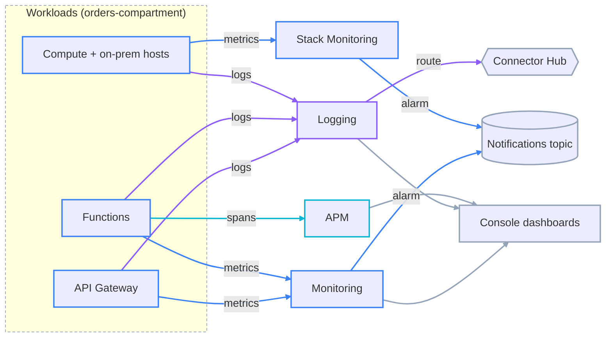
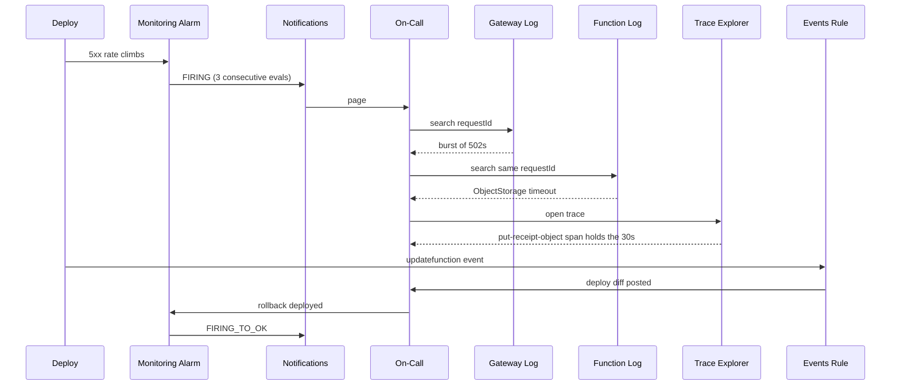

# Pillars of Observability: The Four Signals and OCI's Service Family

**Observability is inferring a system's internal state from the outputs it already emits** — metrics, logs, traces, and, on Oracle Cloud Infrastructure (OCI), resource-state events. Monitoring is the *subset* of that work set up in advance: a fixed set of checks against failure modes someone already predicted — CPU over 80%, HTTP 5xx rate over 10 per minute — cheap to run and unambiguous, but able to answer only the questions built into it before the incident. A novel failure has no pre-built panel: a dependency three services deep that slowed, a poison message stuck in one partition, a cache stampede right after a deploy. Observability is the property that you can compose a new question against telemetry already being collected, without shipping new instrumentation first — and the common misread is that it just means more dashboards, when the distinguishing property is answering what nobody anticipated. This lesson maps the four signals to the six OCI services that own them, and is the spine every later lesson in the track hangs off.

---

## Contents

1. [The Four Signals](#1-the-four-signals)
2. [The Observability and Management Service Family](#2-the-observability-and-management-service-family)
3. [How a Signal Moves Between Services](#3-how-a-signal-moves-between-services)
4. [Worked Walkthrough: One Degraded Checkout, Across Four Services](#4-worked-walkthrough-one-degraded-checkout-across-four-services)
5. [Limits and Sources](#5-limits-and-sources)
6. [Summary](#6-summary)

---

## 1. The Four Signals

Monitoring covers the known set cheaply; the four signals below are what you query for everything else. That trade-off runs through the whole track:

| | Monitoring | Observability |
| :--- | :--- | :--- |
| Set up | Ahead of time, per known failure | Query composed at incident time |
| Cost | Low, fixed | Higher storage and cardinality cost |
| Answers | "Is a known thing broken?" | "What is this unknown thing?" |
| Failure mode | Blind to novel failures | Cost blowout; needs query skill |

> Nuance: adding more dashboards does not raise the monitoring ceiling. A panel built for last week's incident just moves the boundary out by one case; the next unfamiliar failure is still on the far side of it.

OCI's tooling is organised around four signal types. Each answers a structurally different question, and none substitutes for another.

### 1.1 Metrics — owned by the Monitoring service

**A metric is a named numeric time series with dimensions, aggregated into fixed time intervals.** It is cheap to store and cheap to alarm on, and lossy by construction: you get the per-interval aggregate, never the individual request behind it.

A metric query in the Monitoring Query Language (MQL), covered in full in lesson `02`:

```text
HttpRequests[1m]{deploymentId = "ocid1.apideployment.oc1..ordersgw"}.sum()
```

### 1.2 Logs — owned by the Logging and Log Analytics services

**A log is a timestamped, structured record of one discrete event on one resource.** It keeps the per-event detail a metric throws away, costs more per byte, and is searched rather than pre-aggregated (though a query can aggregate at read time).

One gateway access-log event, filtered to a single request:

```text
search "orders-compartment/ordersgw-access" | where data.requestId = 'req-8841'
```

Two OCI services cover logs: **Logging** stores and searches raw events (lesson `03`); **Log Analytics** parses, enriches, and correlates them (lesson `05`).

### 1.3 Traces — owned by Application Performance Monitoring

**A trace is the causally-linked tree of spans for one request as it crosses services.** It answers "where did the time go", which neither an aggregate metric nor a single log line can.

```text
trace req-8841
└─ span  ordersgw            5 ms
   └─ span  order-receipt-fn  30,020 ms   ERROR
      └─ span  put-receipt-object  30,000 ms   ObjectStorage timeout
```

**Application Performance Monitoring (APM)** is lesson `06`.

### 1.4 Events — owned by the Events service

**An event is a notification that an OCI resource changed state** — a bucket was created, an instance stopped, a database failed over. It is not a performance signal; it is a control-plane fact you can trigger automation from.

The event envelope follows the CloudEvents schema:

```json
{
  "eventType": "com.oraclecloud.objectstorage.createobject",
  "source": "objectstorage",
  "resourceId": "ocid1.bucket.oc1..ordersreceipts",
  "data": { "compartmentId": "ocid1.compartment.oc1..orders" }
}
```

The Events service is lesson `04`. The envelope's field-level matching mechanics are also covered in `developer-professional/08`; this track scopes lesson `04` to the observability angle.

### 1.5 Which signal answers which question

| Question | Signal | Service |
| :--- | :--- | :--- |
| Is something wrong, in aggregate, over time? | Metrics | Monitoring |
| What exactly happened on this one resource? | Logs | Logging / Log Analytics |
| Which hop in the call chain is slow or failing? | Traces | APM |
| Did a resource's state change — and run something when it does? | Events | Events |

**Selection guidance:** start at metrics — cheapest and broadest — to confirm something is wrong and roughly where. Drop to logs for the exact error a resource produced. Drop to traces when the failure spans services and you need to localise the hop. Events sits orthogonal to all three: it drives automation off state changes, it does not diagnose performance.

---

## 2. The Observability and Management Service Family

Every section from here maps to one of the six services in the table below; this section is the whole-family map they slot into.

### 2.1 The six services this track covers

| Service | Ingests | Emits | Covered in |
| :--- | :--- | :--- | :--- |
| Monitoring | Service metrics and custom metrics | Alarms, MQL query results, dashboards | Lesson `02` |
| Logging | Service, custom, and audit logs | Searchable log events, Connector Hub feeds | Lesson `03` |
| Log Analytics | Logs via agent, Connector Hub, or Object Storage | Parsed records, dashboards, `link` correlation | Lesson `05` |
| Events | Resource state changes (nothing to provision) | Rule-matched actions to Functions, Streaming, Notifications | Lesson `04` |
| APM | Spans via agents or OpenTelemetry ingest | Traces, service topology, APM metrics, synthetics | Lesson `06` |
| Stack Monitoring | Resource metrics via the Management Agent | Fleet health, ML baselines, alarms | Lesson `07` |

### 2.2 The wider family, out of scope here

**Oracle groups more services under "Observability and Management" than this track covers.** Database Management, Operations Insights, Java Management Service, and Fleet Application Management target database, JVM, and patch-fleet operations. The exam blueprint and this track exclude them — recognise the names in the Console, but do not study them here.

### 2.3 The family as one system

The services are wired to the workloads that feed them on one side and to the places their output lands on the other.

| Flow | Colour | Carries |
| :--- | :--- | :--- |
| Metrics path | blue | Numeric time series from workloads into Monitoring, then out as alarms |
| Logs path | violet | Log events from workloads into Logging, then routed onward |
| Traces path | cyan | Spans from instrumented apps into APM |
| Shared destinations | slate | Notifications, Connector Hub, and the Console dashboards every service writes to |



*Workloads feed metrics, logs, and spans into the services that own each signal; alarms converge on a Notifications topic and logs route onward through Connector Hub.*

---

## 3. How a Signal Moves Between Services

The six services are not silos. Three wiring points let one service's output become another's input — that is what makes the family one system rather than six products.

### 3.1 Alarms deliver through Notifications

**The Monitoring service does not send email or Slack itself — an alarm publishes to a Notifications topic, and that topic's subscriptions fan the message out.** The same topic is reused by Events rules and by budget alerts. Lesson `02` defines the Notifications resource model for the whole track.

### 3.2 Logs route onward through Connector Hub

**Connector Hub moves log (and metric) data from one OCI service to another with no code:** Logging to Object Storage for archive, Logging to Streaming for a security information and event management (SIEM) system, Logging to Log Analytics for parsing. Lesson `03` covers it in full.

### 3.3 Events trigger automation

**An Events rule matches a resource-state change and fires a Function, a stream write, or a Notifications publish.** It is the glue that turns a state change into a response with no polling loop. Lesson `04`.

### 3.4 Why this composes into one system

| Wiring point | Source signal | Becomes |
| :--- | :--- | :--- |
| Alarm → Notifications | A metric breach | A delivered notification |
| Log → Connector Hub | A log event | An archived object, a stream record, or a parsed row |
| Event → rule action | A resource state change | A function invocation |

You assemble these per incident rather than living inside one tool: a breach becomes a page, a log becomes an archive, a state change becomes an automated fix.

---

## 4. Worked Walkthrough: One Degraded Checkout, Across Four Services

`order-receipt-fn` in `orders-compartment`, behind the `ordersgw` API Gateway deployment, starts returning `502`s minutes after a deploy. One request, `req-8841`, traced through every signal.

1. **Metric breach — Monitoring.** The alarm query `5xxErrors[1m]{deploymentId = "ocid1.apideployment.oc1..ordersgw"}.sum() > 10` holds true for three consecutive one-minute evaluations. The alarm transitions to `FIRING` and publishes to the `orders-oncall` Notifications topic; the on-call engineer is paged. This says *something* is wrong — not what.
2. **Log lookup — Logging.** The engineer searches the gateway access log filtered to `/receipts`: a burst of `502`s, each carrying `data.requestId`. Searching `order-receipt-fn`'s custom log for `req-8841` returns a stack trace ending in `ObjectStorage request timed out`.
3. **Trace localisation — APM.** Opening the trace for `req-8841` in Trace Explorer shows the span tree: the gateway span at 5 ms, the function span at 30 s and errored, and inside it a `put-receipt-object` child span holding all 30 s. Now the failing hop is known: the Object Storage write, not the function logic.
4. **State-change automation — Events, in parallel.** The deploy also emitted `com.oraclecloud.functions.updatefunction`. A standing Events rule matched it and invoked a Function that posted the deploy diff into the incident channel — no polling, no manual lookup.
5. **Resolution.** The engineer rolls the function back. `5xxErrors` falls below the threshold; the alarm sends `FIRING_TO_OK` to the same `orders-oncall` topic, closing the loop.



*Each signal answered a different question — is it broken, what broke, where it broke, what changed — and none replaced another.*

Lessons `02` through `06` each take one of these services in full.

---

## 5. Limits and Sources

| Limit | What it forces | As-of + docs |
| :--- | :--- | :--- |
| Metric definitions and alarm history retained 90 days | Trend analysis past 90 days needs the data exported first, via Connector Hub | Sep 2026, [docs](https://docs.oracle.com/en-us/iaas/Content/Monitoring/Concepts/monitoringoverview.htm) |
| 50 alarms per region (default, increasable) | A large tenancy consolidates conditions or files a limit-increase request | Sep 2026, [docs](https://docs.oracle.com/en-us/iaas/Content/General/Concepts/servicelimits.htm) |
| Alarm delivery: 60 messages/evaluation to a topic; 100,000 to a stream | A condition tripping across dozens of resources at once truncates silently on a topic — route wide fan-out to Streaming | Sep 2026, [docs](https://docs.oracle.com/en-us/iaas/Content/Monitoring/Concepts/monitoringoverview.htm) |
| Notifications: 100 topics per tenancy, 10 subscriptions per topic | Plan a topic per team or per severity, not a topic per alarm | Sep 2026, [docs](https://docs.oracle.com/en-us/iaas/Content/General/Concepts/servicelimits.htm) |
| Log retention 30–180 days, 30-day steps, default 30 | Anything longer-lived is archived off Logging (Connector Hub to Object Storage) | Sep 2026, [docs](https://docs.oracle.com/en-us/iaas/Content/Logging/Task/update-logging-log.htm) |
| Connector Hub: 20 connectors per region; Logging and Monitoring sources retain 24 h for retry | A connector failing for more than 24 h loses the gap in its source data | Sep 2026, [docs](https://docs.oracle.com/en-us/iaas/Content/connector-hub/overview.htm) |
| Audit log retention: default 90 days, up to 365, tenancy-wide | A compliance window beyond one year needs Audit logs exported to Object Storage | Sep 2026, [docs](https://docs.oracle.com/en-us/iaas/Content/Audit/Tasks/settingretentionperiod.htm) |

---

## 6. Summary

OCI organises observability around four signals, and the split from monitoring is the recurring trade-off: pre-declared checks answer known failures cheaply, queryable signals answer the ones nobody anticipated, and real operations run both. Metrics are cheap aggregate time series, owned by the Monitoring service. Logs are per-event structured records, owned by Logging and Log Analytics. Traces are cross-service span trees, owned by APM. Events are resource state changes, owned by the Events service and used to drive automation rather than diagnosis.

Six services produce and consume these signals, and three wiring points join them: alarms deliver through Notifications, logs route onward through Connector Hub, and Events rules fire Functions or stream writes. A signal from one service becomes the input to another, so an incident is worked by composing them — metric to log to trace — not by staying in a single tool.
