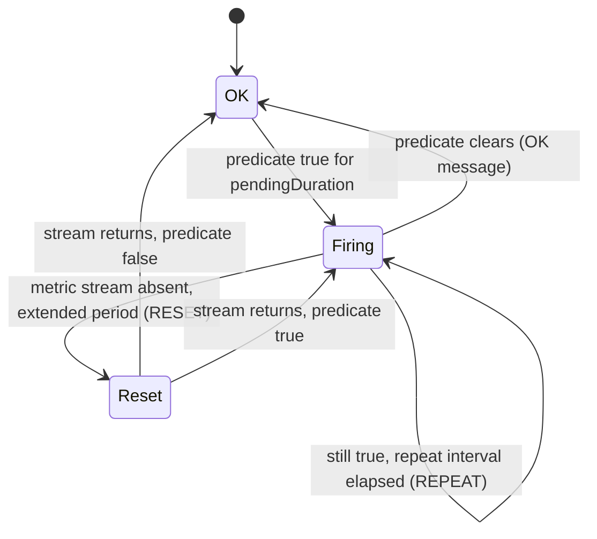
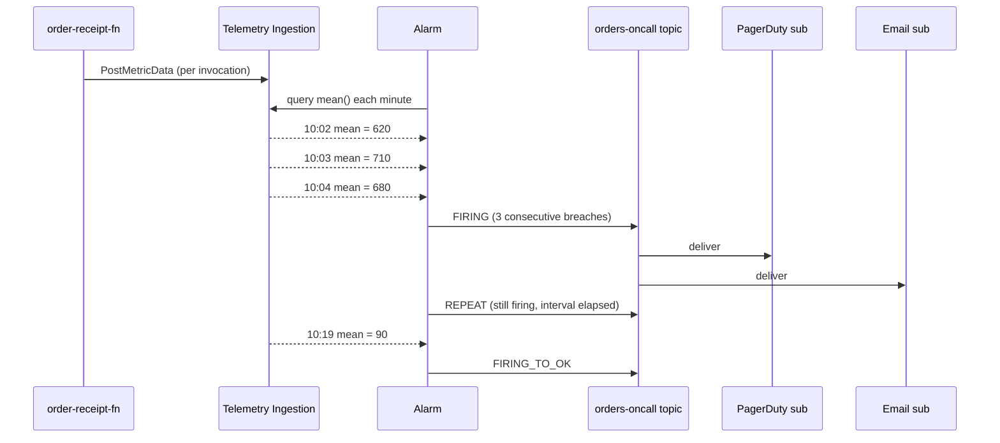

# The Monitoring Service: Metrics, the Query Language, and Alarms

The Monitoring service is OCI's metrics plane: it ingests numeric time series from OCI services and from your own code, stores them for 90 days, and lets you query them in the Monitoring Query Language (MQL) or wrap a query in an alarm. The one idea to hold onto is that a metric is **lossy on purpose** — every data point is already an aggregate over an interval, so the service is cheap and fast but can never hand back the individual request behind a number. `developer-professional/10` introduced the alarm-to-log-to-trace loop and the shape of an MQL query; this lesson is the service itself — the data model, the full query grammar, and the alarm lifecycle.

---

## Contents

1. [The Metric Data Model](#1-the-metric-data-model)
2. [Intervals, Resolution, and Statistics](#2-intervals-resolution-and-statistics)
3. [The Monitoring Query Language](#3-the-monitoring-query-language)
4. [Custom Metrics via PostMetricData](#4-custom-metrics-via-postmetricdata)
5. [Alarms: Anatomy and Lifecycle](#5-alarms-anatomy-and-lifecycle)
6. [Notifications: Topics, Subscriptions, and Protocols](#6-notifications-topics-subscriptions-and-protocols)
7. [Alarm Design in Practice](#7-alarm-design-in-practice)
8. [Access and IAM Policy](#8-access-and-iam-policy)
9. [Worked Walkthrough: From a Published Data Point to a Paged Engineer](#9-worked-walkthrough-from-a-published-data-point-to-a-paged-engineer)
10. [Limits and Sources](#10-limits-and-sources)
11. [Summary](#11-summary)

---

## 1. The Metric Data Model

### 1.1 Namespace: which service emitted the metric

**Every metric belongs to a namespace naming its source.** `oci_apigateway`, `oci_faas` (Functions), `oci_objectstorage`, `oci_vcn` are service namespaces; a custom metric you publish carries a namespace you choose, conventionally prefixed to avoid collision (`orders_custom`).

The namespace is the first filter in every query and every IAM policy scope — it is how the service keeps one team's `Latency` metric separate from another's.

### 1.2 Metric name, dimensions, and resource group

**A metric name plus a set of dimensions identifies one time series — a "metric stream".** The name is the measurement (`HttpRequests`, `Latency`); a dimension is a qualifier attached to every data point (`deploymentId`, `resourceId`, `availabilityDomain`, `httpMethod`).

- **Dimensions are what a query filters and groups on.** Without them, every gateway deployment in the namespace averages into one indistinguishable number.
- **A resource group is an optional single string** tagging a metric for coarse filtering. Only one resource group applies per metric — it is not a second dimension axis.

### 1.3 The data point and the metric stream

**A data point is a `(timestamp, value)` pair; a metric stream is the ordered series of them for one name-and-dimensions combination.** A query names a stream (or a set of streams, via a partial dimension filter) and collapses each interval of it to one number.

```text
HttpRequests  name
  {deploymentId="...ordersgw", httpMethod="POST"}  dimensions  → one stream
  (2026-09-01T10:00:00Z, 3)   data point
  (2026-09-01T10:01:00Z, 7)   data point
```

---

## 2. Intervals, Resolution, and Statistics

### 2.1 Two windows, not one

**The collection interval and the query interval are different knobs.** OCI services post most metrics once per minute (the collection interval — fixed, not yours to set). The query interval `[1m]`, `[5m]`, `[1h]` is how *you* re-bucket that stream at read time.

Asking for `[5m]` does not fetch 5-minute-resolution data; it fetches the 1-minute stream and aggregates every five points into one. You can widen the query interval but never see finer than what was collected.

> ⚠️ Alarm queries ignore the interval you write for resolution purposes: an alarm always evaluates at 1-minute resolution regardless of the `[...]` in its query. The interval still affects which statistic window is applied, but not how often the alarm looks.

### 2.2 Statistics: how an interval collapses to one number

**The statistic is the function that turns a bucket of data points into the single value the query returns.**

| Statistic | Returns |
| :--- | :--- |
| `mean()` / `avg()` | Sum divided by count |
| `sum()` | All values added |
| `count()` | Number of data points in the interval |
| `max()` / `min()` | Highest / lowest value observed |
| `percentile(p)` | The p-th percentile, `0 < p < 1` — `percentile(0.9)` is p90 |
| `rate()` | Per-second average rate of change across the interval |
| `first()` / `last()` | Value with the earliest / latest timestamp |
| `increment()` | Per-interval change in value |
| `absent(period)` | 1 if the stream had no data for the whole period, else 0 |

### 2.3 Interval bounds the time range you can query

**A finer query interval caps how far back a single query can reach**, because the service will not return more than 100,000 data points in one response.

| Query interval | Maximum time range |
| :--- | :--- |
| `1m` | 7 days |
| `5m` | 30 days |
| `1h` | 90 days |
| `1d` | 90 days |

Ninety days is the hard ceiling — it is also how long metric definitions are retained. Anything older must have been exported first (Connector Hub, lesson `03`).

---

## 3. The Monitoring Query Language

### 3.1 The grammar

**An MQL expression has a fixed shape:**

```text
metricName[interval]{dimension filters}.groupBy(dimension).statistic() <predicate>
```

Reading `5xxErrors` as a per-minute sum for one gateway deployment, alarming when it exceeds 10:

```text
5xxErrors[1m]{deploymentId = "ocid1.apideployment.oc1..ordersgw"}.sum() > 10
```

Each clause answers a distinct question, applied in order:

```mermaid
flowchart LR
    SEL["dimension filter<br/>which streams count"] --> BKT["interval<br/>bucket the points"]
    BKT --> GRP["groupBy<br/>keep apart or merge"]
    GRP --> STA["statistic<br/>bucket → one number"]
    STA --> PRD["predicate<br/>number → true / false"]
    PRD --> ALM["alarm evaluation"]

    linkStyle 0,1,2,3,4 stroke:#3b82f6,stroke-width:2px

    style SEL stroke:#3b82f6,stroke-width:2px
    style BKT stroke:#3b82f6,stroke-width:2px
    style GRP stroke:#3b82f6,stroke-width:2px
    style STA stroke:#3b82f6,stroke-width:2px
    style PRD stroke:#3b82f6,stroke-width:2px
    style ALM stroke:#94a3b8,stroke-width:2px
```



*The predicate clause is optional in a bare read query; an alarm requires it.*

### 3.2 Dimension filters and fuzzy matching

**An exact filter uses `=`; an approximate one uses `=~` with `*` (wildcard) and `|` (or).**

```text
CpuUtilization[1m]{resourceDisplayName =~ "orders-worker-*"}.mean() > 80
CpuUtilization[1m]{availabilityDomain =~ "PHX-AD-1|PHX-AD-2"}.mean()
```

Fuzzy matching is how one alarm covers a fleet whose members share a naming convention but not a fixed list.

### 3.3 `groupBy` versus `grouping`

**`groupBy(dim)` keeps one result series per distinct value of `dim`; `grouping()` collapses every matched stream into one aggregate series.**

```text
5xxErrors[1m]{}.groupBy(deploymentId).sum()   one number per deployment
5xxErrors[1m]{}.grouping().sum()              one number across all deployments
```

An alarm with `groupBy(deploymentId)` fires (and clears) per deployment independently — the mechanism behind "alert me per service, not once for the whole namespace".

### 3.4 Arithmetic and joined queries

**MQL supports `+ - * / %` within or between metrics, and `&&` / `||` to join two full queries into one condition.**

```text
100 - CpuUtilization[1m].mean()                       derive idle CPU %
TotalRequestLatency[1m].mean() / 1000                 ms → s
5xxErrors[1m].sum() > 10 && Latency[1m].mean() > 2000 both must hold
```

A joined query is what the Console calls a nested or composed query: the alarm fires only when every joined clause is simultaneously true.

### 3.5 Absence detection

**`absent(period)` returns 1 when a stream stops emitting** — the way you alarm on a silent producer rather than a bad value.

```text
HttpRequests[1m]{deploymentId = "ocid1.apideployment.oc1..ordersgw"}.groupBy(deploymentId).absent(10m)
```

The period defaults to 2 hours and accepts `1m` to `3d`. A short period catches a dead producer fast but false-fires on a genuinely idle low-traffic service; size it to the quietest legitimate gap.

---

## 4. Custom Metrics via PostMetricData

### 4.1 The publishing call

**`PostMetricData` is the single API for getting your own numbers into the Monitoring service.** Everything downstream — MQL, alarms, dashboards — then treats a custom metric exactly like a service metric.

```python
import oci, datetime

client = oci.monitoring.MonitoringClient(config, signer=resource_principal_signer)
client.post_metric_data(
    oci.monitoring.models.PostMetricDataDetails(metric_data=[
        oci.monitoring.models.MetricDataDetails(
            namespace="orders_custom",              # your chosen namespace
            compartment_id=compartment_ocid,        # where the metric is queryable
            name="ReceiptWriteLatencyMs",
            dimensions={"functionName": "order-receipt-fn", "result": "ok"},
            datapoints=[oci.monitoring.models.Datapoint(
                timestamp=datetime.datetime.utcnow(), value=42.3)],
        )
    ])
)
```

> Note: the client posts to a regional `telemetry-ingestion` endpoint, not the same host used for reads. The SDK selects it automatically; a hand-rolled HTTP client must target it explicitly.

### 4.2 The cardinality trap

**Every distinct combination of dimension values is a separate billable metric stream, and MQL queries slow as streams multiply.** Putting `requestId` or a raw user ID in a dimension creates one stream per request — thousands of near-empty series, a large bill, and slow queries.

Keep dimensions low-cardinality and bounded: `functionName`, `result`, `region` — values you could list on one hand of fingers per axis. High-cardinality identifiers belong in logs or trace attributes, not metric dimensions.

### 4.3 `developer-professional/10` overlap

That lesson introduced `PostMetricData` as one line in the troubleshooting loop. This section is the full contract: the endpoint split, the resource-principal signer, and the cardinality rule that governs what a dimension may hold.

---

## 5. Alarms: Anatomy and Lifecycle

### 5.1 The four parts of an alarm

**An alarm is an MQL query, a predicate, a `pendingDuration`, and a set of destinations.**

```json
{
  "displayName": "ordersgw-5xx-high",
  "namespace": "oci_apigateway",
  "query": "5xxErrors[1m]{deploymentId = \"ocid1.apideployment.oc1..ordersgw\"}.sum() > 10",
  "pendingDuration": "PT3M",
  "severity": "CRITICAL",
  "destinations": ["ocid1.onstopic.oc1..ordersoncall"],
  "body": "5xx rate on ordersgw exceeded 10/min for 3 minutes",
  "isEnabled": true
}
```

### 5.2 It does not fire on the first breach

**The alarm evaluates once per minute and transitions to `FIRING` only after the predicate holds for `pendingDuration` of consecutive evaluations.** `PT3M` means three straight one-minute evaluations must all be true. A single spike that clears on the next evaluation never fires.

This is the knob that trades detection speed against noise: `PT1M` pages on the first bad minute; `PT5M` waits out transients but reports an outage five minutes late.

### 5.3 The lifecycle and its message types

**An alarm emits one of four message types as it moves through its lifecycle** — conflating them misreads the notification stream. (`developer-professional/10` lists the same four from the responder's side; the lifecycle transitions are the focus here.)

| Message type | Sent when |
| :--- | :--- |
| `FIRING` (`OK_TO_FIRING`) | The predicate has held for `pendingDuration` |
| `OK` (`FIRING_TO_OK`) | The predicate clears |
| `REPEAT` | A configurable interval elapses *while still firing*, so an unresolved incident is not forgotten |
| `RESET` | The metric stream itself goes absent for an extended period — distinct from the condition clearing |



*`REPEAT` means "still broken"; `RESET` means "the signal itself vanished" — opposite conditions, easy to confuse.*

### 5.4 Delivery caps

**An alarm evaluation delivers at most 60 messages to a Notifications topic, or 100,000 to a stream.** A `groupBy` alarm that trips across 80 resources in one minute is 80 messages — it silently truncates on a topic. Route a legitimately wide fan-out to Streaming. (`developer-professional/10` covers this choice from the troubleshooting side.)

---

## 6. Notifications: Topics, Subscriptions, and Protocols

This section defines the Notifications resource model once for the whole track; lesson `04` (Events) reuses it as an action destination without re-teaching it.

### 6.1 Topic and subscription

**A topic is a named delivery channel; a subscription is one endpoint attached to it.** An alarm, an Events rule, or a budget alert *publishes* to a topic; every confirmed subscription on that topic receives a copy.

```bash
oci ons topic create --name orders-oncall --compartment-id "$COMPARTMENT_OCID"
oci ons subscription create --topic-id "$TOPIC_OCID" --compartment-id "$COMPARTMENT_OCID" \
  --protocol EMAIL --subscription-endpoint oncall@example.com
```

> ⚠️ An `EMAIL` (and `SLACK`, `PAGERDUTY`, `HTTPS`) subscription starts `Pending` and delivers nothing until the endpoint owner clicks the confirmation link. An alarm wired to an unconfirmed subscription pages no one.

### 6.2 Protocols

| Protocol | Endpoint | Typical use |
| :--- | :--- | :--- |
| `EMAIL` | Address | Human alerting |
| `SLACK` / `PAGERDUTY` | Webhook URL | Chat / on-call escalation |
| `HTTPS` (custom URL) | Any HTTPS endpoint | A custom receiver or bridge |
| `SMS` | Phone number | Last-resort human alerting |
| `ORACLE_FUNCTIONS` | Function OCID | Programmatic response |
| `STREAMING` | Stream OCID | High-volume fan-out, further processing |

### 6.3 No durable mailbox

**Notifications retries a failed delivery on a backoff, then drops the message — there is no queue to replay from.** A subscriber down for an hour misses everything sent in that hour. When a signal must survive a consumer outage, publish to a `STREAMING` subscription (replayable, lesson `04` cross-reference) rather than relying on `HTTPS`.

---

## 7. Alarm Design in Practice

### 7.1 Alarm on absence, not just on badness

**A threshold alarm cannot fire if the metric stops arriving — a crashed producer looks identical to a healthy quiet one.** Pair a value alarm with an `absent()` alarm on the same stream for anything whose silence is itself an incident (a heartbeat, a cron job's success metric).

### 7.2 Suppression stops notifications, not evaluation

**A suppression is a scheduled window that silences an alarm's messages while the alarm keeps evaluating underneath.** Use it for planned maintenance. A condition that starts and clears entirely inside the window produces no messages, but the alarm's evaluation history still records that it happened. (`developer-professional/10` states the rule; the scheduling is Console- or API-side here.)

### 7.3 One condition per alarm

**Keep each alarm to a single failure mode with its own severity and message body.** A joined query that bundles conditions fires with a body that cannot say *which* clause tripped:

```text
CpuUtilization[1m]{resourceId = "...fn"}.mean() > 85
  && ReceiptWriteLatencyMs[1m]{functionName = "order-receipt-fn"}.mean() > 500
```

When this fires, the notification says only "ordersgw-health breached" — the responder still has to open the Console to learn whether it was CPU or latency. Two alarms, `fn-cpu-high` and `fn-write-latency-high`, each page with an actionable subject line and their own severity.

### 7.4 Alarm on a metric, or detect in a log query

**A metric alarm is the right detector only when the symptom is a number crossing a line.** The trade-off against the alternative — a scheduled Logging or Log Analytics query (lesson `03`, lesson `05`) — is fixed:

| | Metric alarm | Log-query detection |
| :--- | :--- | :--- |
| Signal | Pre-aggregated number at 1-minute resolution | Any field in any log event |
| Cost / latency | Cheap, near-real-time | Higher, minutes behind |
| Catches | "Rate exceeded N", "value absent" | "This exact error string", "this user, this path, this status" |

Reach for a metric alarm for rate and threshold symptoms; reach for a log query when the trigger is a specific string or field combination a metric was never shaped to carry.

---

## 8. Access and IAM Policy

### 8.1 Verbs and resource types

**Reading metrics and managing alarms are separate grants.**

| Resource type | Grants |
| :--- | :--- |
| `metrics` | `inspect` (list metric names), `read` (get data points) |
| `alarms` | `read`, `manage` (create, update, delete alarms) |
| `ons-topics`, `ons-subscriptions` | `use` / `manage` for Notifications |

```text
Allow group Observers to read metrics in tenancy
Allow group Ops       to manage alarms  in compartment orders
Allow group Ops       to use ons-topics in compartment orders
```

### 8.2 Restricting a policy to one namespace

**A `where` condition on `target.metrics.namespace` scopes a read grant to a single service's metrics** — the mechanism for letting a team see its own metrics but not another's.

```text
Allow group OrdersTeam to read metrics in compartment orders
  where target.metrics.namespace = 'oci_apigateway'
```

Publishing custom metrics needs `use metrics` in the target compartment, and the same `where` clause locks a publisher to its own namespace so it cannot overwrite a service's streams.

---

## 9. Worked Walkthrough: From a Published Data Point to a Paged Engineer

`order-receipt-fn` publishes a custom `ReceiptWriteLatencyMs` metric after every Object Storage write. A downstream slowdown pushes write latency up. Tracing one alarm cycle end to end:

1. **Publish.** On each invocation the function calls `PostMetricData` with `namespace="orders_custom"`, `name="ReceiptWriteLatencyMs"`, `dimensions={"functionName":"order-receipt-fn","result":"ok"}`, one data point at the measured latency. During the slowdown the values climb from ~40 ms to ~900 ms.
2. **Aggregate.** The alarm query `ReceiptWriteLatencyMs[1m]{functionName = "order-receipt-fn"}.mean() > 500` re-buckets the per-invocation points into a per-minute mean. At 10:02 the mean crosses 500.
3. **Pending.** `pendingDuration` is `PT3M`. Evaluations at 10:02, 10:03, 10:04 are all above 500 — three consecutive true evaluations.
4. **Fire.** At 10:04 the alarm transitions to `FIRING` and publishes one message to the `orders-oncall` topic.
5. **Fan out.** The topic has a confirmed `PAGERDUTY` subscription and a confirmed `EMAIL` subscription; both receive a copy. The message body names the metric, the threshold, and the 3-minute breach.
6. **Repeat.** The slowdown persists past the 10-minute repeat interval; a `REPEAT` message goes to the same topic so the open incident is not forgotten.
7. **Clear.** The dependency recovers; the per-minute mean drops below 500; the next evaluation sends `FIRING_TO_OK` to the topic.



*Per-invocation data points become a per-minute mean, which becomes a sustained breach, which becomes one topic publish fanned out to two endpoints.*

---

## 10. Limits and Sources

| Limit | What it forces | As-of + docs |
| :--- | :--- | :--- |
| Metric definitions and alarm history retained 90 days | Long-range analysis exports data off Monitoring first (Connector Hub) | Sep 2026, [docs](https://docs.oracle.com/en-us/iaas/Content/Monitoring/Concepts/monitoringoverview.htm) |
| Up to 100,000 data points returned per query | A fine interval caps the time range one query can span; page or widen the interval | Sep 2026, [docs](https://docs.oracle.com/en-us/iaas/Content/Monitoring/Reference/mql.htm) |
| Alarms evaluate once per minute; alarm resolution is always `1m` | `pendingDuration` is the only detection-delay knob; the query interval does not change how often it looks | Sep 2026, [docs](https://docs.oracle.com/en-us/iaas/Content/Monitoring/Reference/mql.htm) |
| `absent()` period: default 2 h, range `1m`–`3d` | Size it to the quietest legitimate gap or a low-traffic service false-fires | Sep 2026, [docs](https://docs.oracle.com/en-us/iaas/Content/Monitoring/Reference/mql.htm) |
| Alarm delivery: 60 messages/evaluation to a topic, 100,000 to a stream | A wide `groupBy` alarm truncates on a topic; route fan-out to Streaming | Sep 2026, [docs](https://docs.oracle.com/en-us/iaas/Content/Monitoring/Concepts/monitoringoverview.htm) |
| An alarm fans out to one evaluation per matched metric stream, capped (200,000) | A near-unbounded fuzzy dimension filter can hit the cap and drop streams from evaluation | Sep 2026, [docs](https://docs.oracle.com/en-us/iaas/Content/Monitoring/Concepts/monitoringoverview.htm) |
| 50 alarms per region (default, increasable) | Consolidate by failure mode, or file a limit-increase request | Sep 2026, [docs](https://docs.oracle.com/en-us/iaas/Content/General/Concepts/servicelimits.htm) |
| Notifications: 100 topics/tenancy, 10 subscriptions/topic, 100 pending subscriptions/tenancy | Topic per team or severity, not per alarm; confirm subscriptions promptly | Sep 2026, [docs](https://docs.oracle.com/en-us/iaas/Content/General/Concepts/servicelimits.htm) |
| Notifications message size 128 KB; no durable retry queue | A large payload is dropped; a down subscriber misses the window — use a `STREAMING` subscription when the signal must survive | Sep 2026, [docs](https://docs.oracle.com/en-us/iaas/Content/connector-hub/overview.htm) |

---

## 11. Summary

A metric stream is identified by a namespace, a name, and a set of dimensions; the dimensions are the axes a query filters and groups on, and keeping them low-cardinality is what keeps queries fast and the bill small. Because every data point is already an interval aggregate, a query can widen the window but never resolve finer than the collection interval, and 90 days is the far edge of what is retained.

MQL has a fixed shape: metric, interval, dimension filter, optional `groupBy`, statistic, optional predicate. The interval re-buckets the stream at read time and bounds how far back one query can reach; the statistic collapses each bucket to one number; `absent()` alarms on silence rather than on a bad value. Arithmetic and `&&` / `||` joins compose one condition from several.

An alarm wraps a query in a predicate, a `pendingDuration`, and a set of destinations. It fires only after the predicate holds for consecutive evaluations. It then moves through four message types: `FIRING`, `OK`, `REPEAT` for still-broken, and `RESET` for when the signal itself vanished. Alarms deliver through Notifications topics. A topic fans out to its confirmed subscriptions and keeps no replay queue, so a signal that must survive a consumer outage goes to a Streaming subscription instead.
