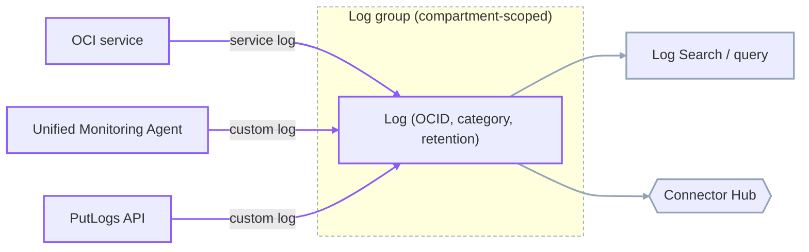
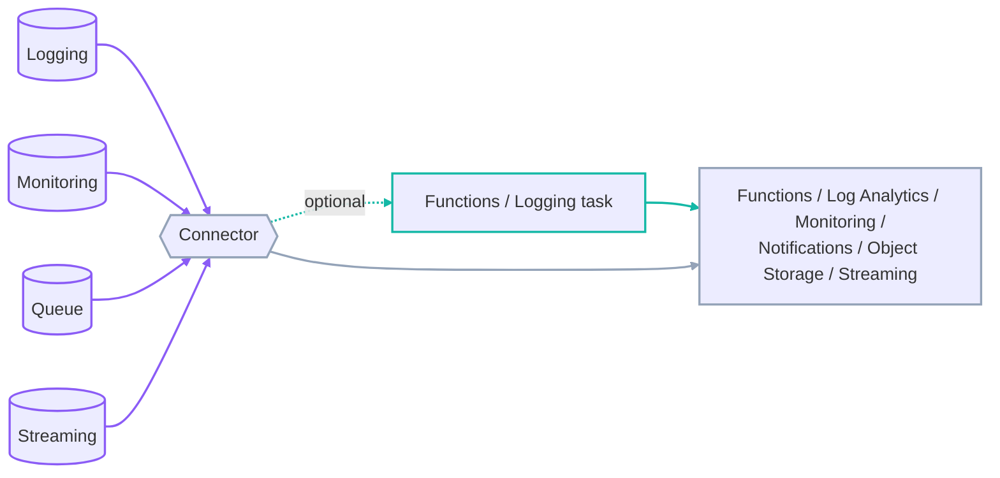
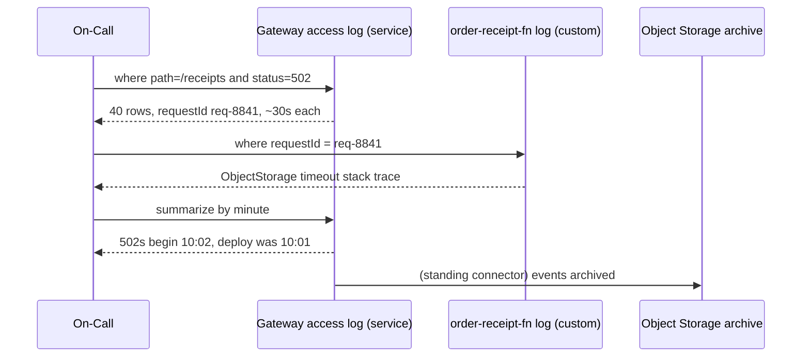

# The Logging Service: Log Types, the Query Language, and Routing

The Logging service is OCI's single pane over three log categories — **service**, **custom**, and **audit** — each answering a different question and none substituting for another. A service log says what an OCI resource did; a custom log says what your code did; an audit log says who called which API. This lesson covers the resource model that holds all three, the query language that reads them, and Connector Hub, the no-code router that moves logs onward. `developer-professional/10` introduced the three types in one table; this lesson is the service itself.

---

## Contents

1. [The Logging Resource Model](#1-the-logging-resource-model)
2. [Service Logs and the Common Envelope](#2-service-logs-and-the-common-envelope)
3. [Custom Logs and the Unified Monitoring Agent](#3-custom-logs-and-the-unified-monitoring-agent)
4. [Searching and Viewing Log Events](#4-searching-and-viewing-log-events)
5. [The Logging Query Language](#5-the-logging-query-language)
6. [Connector Hub](#6-connector-hub)
7. [Audit Logs](#7-audit-logs)
8. [Worked Walkthrough: One 502, From Service Log to Correlated Custom Log](#8-worked-walkthrough-one-502-from-service-log-to-correlated-custom-log)
9. [Limits and Sources](#9-limits-and-sources)
10. [Summary](#10-summary)

---

## 1. The Logging Resource Model

### 1.1 Log group: the IAM and organisational container

**A log group is a compartment-scoped container that holds logs and carries the IAM policy that governs them.** You write a policy against the log group, not against each log inside it, and moving a log group to another compartment moves every log with it.

It is the same "one umbrella resource, many things underneath" shape seen elsewhere in OCI — a DevOps project holding pipelines, a stream pool holding streams.

### 1.2 Log: a first-class resource with a category and a retention

**A log is a first-class OCI resource with its own Oracle Cloud Identifier (OCID), living in exactly one log group.** Three properties matter:

- **Category** — for a service log, which slice of that service's activity it captures (Object Storage `read` vs. `write` access events). Categories are defined per service and do not correspond across services.
- **Retention** — 30 to 180 days, in 30-day steps, defaulting to 30. Nothing on Logging lives longer; longer retention means routing the log elsewhere (the *Connector Hub* section).
- **Enabled state** — a disabled log ingests nothing and bills nothing, but keeps its configuration.

### 1.3 The service flow

**Every log follows the same path: it is defined in a log group, ingestion fills it, and it is then searched or routed.**



*Three ingestion paths fill one log; two consumption paths drain it.*

---

## 2. Service Logs and the Common Envelope

### 2.1 What a service log is

**A service log is emitted by an OCI service itself; you turn it on by creating a Log with the right category on that resource, and write nothing.** The gateway's access log, a load balancer's error log, VCN flow records — all are service logs.

### 2.2 The common record shape

**Every log event — service or custom — arrives with the same outer fields, and a service-specific `data` object inside.** The outer fields follow a CloudEvents-style schema.

```json
{
  "datetime": 1756725600000,
  "logContent": {
    "id": "a1b2c3",
    "source": "ordersgw",
    "type": "com.oraclecloud.apigateway.access",
    "time": "2026-09-01T10:00:00Z",
    "oracle": { "compartmentid": "ocid1.compartment.oc1..orders",
                "loggroupid": "ocid1.loggroup.oc1..gwlogs" },
    "data": {
      "requestId": "req-8841",
      "method": "POST", "path": "/receipts",
      "status": 502, "responseTimeSec": 30.02
    }
  }
}
```

- **`datetime`** is the ingestion time in epoch milliseconds; **`time`** inside `logContent` is when the event actually occurred. They differ under ingestion lag — filter on the one that matches your question.
- **`oracle`** holds OCI-injected context (compartment, log group). **`data`** is the only part whose shape depends on the emitting service.
- **`logContent`** as a bare field name in a query refers to the entire original message text.

### 2.3 Three service logs, one envelope

| Service log | Categories | `data` carries |
| :--- | :--- | :--- |
| Object Storage access | `read`, `write` | Principal, bucket, object, operation, response code |
| Load Balancer | `access`, `error` | Client IP, backend chosen, backend latency, status |
| VCN Flow Logs | `all` (with a capture filter) | Source/dest IP and port, protocol, bytes, `ACCEPT` / `REJECT` |

> ⚠️ VCN Flow Logs without a capture filter record every accepted and rejected flow on the subnet — high volume, high cost. A capture filter scopes them to the traffic you actually care about (one security list rule, one CIDR) before ingestion, not after.

---

## 3. Custom Logs and the Unified Monitoring Agent

### 3.1 Two ingestion paths

**A custom log reaches Logging either through a direct `PutLogs` API call from your code, or through the Unified Monitoring Agent reading a file.** Managed services (a Function with its logging toggle on) use the API path for you. A workload *outside* a managed path — an application on a Compute instance, an on-prem host — needs the agent.

> Note: this is the service-log versus custom-log trade-off. A service log is zero-config with a fixed schema, emitted by OCI whether or not you write any code — but you get only the fields OCI chose to include. A custom log carries whatever your code emits, at the cost of an agent (or `PutLogs` client) to deploy, a parser to maintain, and a per-line ingestion charge you own.

### 3.2 The agent configuration

**The Unified Monitoring Agent is a Fluentd-based collector; an agent configuration tells it which files to tail, how to parse them, and which log to write to.**

```yaml
# Simplified — an agent configuration's three parts
sources:
  - name: order-receipt-app
    type: LOG_TAIL
    paths: ["/var/log/orders/receipt-*.log"]
    parser:
      type: JSON              # or GROK / REGEXP for unstructured lines
      timeKey: ts
destination:
  logObjectId: ocid1.log.oc1..receiptapp   # the Log this feeds
```

The parser is what turns a raw line into the structured `data` object a query can filter on. An unparsed line still ingests, but every field lands in `logContent` as one string.

### 3.3 How the agent authenticates and reaches the service

**The agent authenticates as its host instance through a dynamic group and a matching policy — no stored credential.**

```text
# dynamic group: the instances allowed to ship logs
ANY {instance.compartment.id = 'ocid1.compartment.oc1..orders'}

# policy
Allow dynamic-group order-hosts to use log-content in compartment orders
```

The host also needs egress to two regional endpoints — `auth.<region>.oraclecloud.com` for the token exchange and `ingestion.logging.<region>.oci.oraclecloud.com` for the log data. A locked-down subnet must allow both, or the agent silently buffers and never delivers.

### 3.4 This is not the Management Agent

**The Unified Monitoring Agent ships custom logs to the Logging service. The Management Agent (lesson `05`) ships logs to Log Analytics and metrics to Stack Monitoring.** They are different binaries with different configuration models — a common exam trap. If the destination is a Log with an OCID, it is the Unified Monitoring Agent.

---

## 4. Searching and Viewing Log Events

### 4.1 Search scope

**A search targets a single log, a whole log group, or an entire compartment — widening the scope is how you correlate across logs that were filled by different services.** The Console's Log Search page and the `SearchLogs` API take the same scope identifier.

### 4.2 Viewing a record

**Each result row shows the outer fields inline and expands to the full JSON.** The expanded view is where you read the service-specific `data` object; the collapsed view is tuned for scanning `time`, `source`, and a summary of `data`.

---

## 5. The Logging Query Language

### 5.1 The query shape

**A query is a `search` over one or more log streams, piped through operators.**

```text
search "ocid1.compartment.oc1..orders/gwlogs/ordersgw-access"
  | where data.status = 502
  | sort by datetime desc
```

A log stream identifier is `"<compartment> [ /<log group> [ /<log> ] ]"` — omit the log to search the whole group, omit the group to search the compartment. List several, comma-separated, to search across them in one query.

### 5.2 Fields, nested access, and data types

- **Field names are case-sensitive**; reach into nested objects with dots: `data.status`, `data."first name"` (quote a name with spaces or symbols).
- **`logContent`** as a field is the entire original message.
- **Data types**: string, number (8-byte), boolean, timestamp, interval, array.

### 5.3 Tabular operators

**Tabular operators transform the row stream.**

| Operator | Does |
| :--- | :--- |
| `search` | Builds the initial stream from log objects |
| `where` | Keeps rows matching a boolean expression (the keyword is optional) |
| `sort by` | Orders rows, `desc` or default ascending |
| `top` | The first N rows by an expression |
| `dedup` | Drops duplicate rows on the named columns |
| `select` | Projects and renames columns via scalar expressions |
| `extend` | Adds a computed column |

### 5.4 Aggregation

**`summarize` groups and aggregates; `rounddown` buckets a timestamp so you can aggregate over time.**

```text
search "ocid1.compartment.oc1..orders/gwlogs"
  | where data.path = '/receipts'
  | summarize count(data.status) as n by data.status, rounddown(datetime, '1m') as minute
  | sort by minute desc
```

Aggregate functions: `count`, `sum`, `avg`, `min`, `max`, `first`, `last`. Scalar helpers include `contains_ci` / `contains_cs`, `concat`, `upper` / `lower`, `substr`, `isnull` / `isnotnull`, and `time_format`.

### 5.5 Live tail

**A log stream query with no stored time window runs continuously, printing matching events as they ingest** — the equivalent of `tail -f` across a log group, used while reproducing an issue rather than for forensic search.

---

## 6. Connector Hub

> Note: `developer-professional/10` previewed Connector Hub as cross-module glue and flagged it as unverified for *that* course module. It is confirmed content for this track's Module 3; this section is the fuller treatment — the support matrix, failure behaviour, and operational limits that section did not cover.

### 6.1 Source, optional task, target

**A connector reads from one source, optionally runs a task, and writes to one target.**

| Role | Options |
| :--- | :--- |
| Source | Logging, Monitoring, Queue, Streaming |
| Task (optional) | Functions (custom processing), Logging (filter — **Logging source only**) |
| Target | Functions, Log Analytics, Monitoring, Notifications, Object Storage, Streaming |



*Not every source–target pair is valid: a Monitoring source can only reach Functions, Object Storage, or Streaming, and the Logging filter task exists for the Logging source alone.*

### 6.2 Creating one, and the policy it needs

**A connector acts as its own principal type, `serviceconnector`; the policy grants that principal access to the source and target.**

```bash
oci sch service-connector create --compartment-id "$COMPARTMENT_OCID" \
  --display-name "gwlogs-to-archive" \
  --source '{"kind":"logging","logSources":[{"compartmentId":"'"$COMPARTMENT_OCID"'","logGroupId":"'"$LOG_GROUP_OCID"'"}]}' \
  --target '{"kind":"objectStorage","bucketName":"orders-log-archive","namespace":"'"$NS"'"}'
```

```text
Allow any-user to manage objects in compartment orders where all {
  request.principal.type = 'serviceconnector',
  target.bucket.name = 'orders-log-archive'
}
```

### 6.3 Delivery semantics and failure behaviour

- **At-least-once, sequential batches.** A failed batch is retried and blocks every later batch until it succeeds — a stuck target stalls the whole connector, it does not skip ahead.
- **Retry is bounded by the source's retention.** Logging and Monitoring sources retain 24 hours; a connector down longer than that loses the gap and resumes from the latest data. A Streaming source's customer-defined retention is how you buy more slack.
- **Auto-deactivation.** After 4 consecutive days of failure OCI posts a warning; after 7 it deactivates the connector.
- **An update resets the offset.** Editing a connector's source, task, or target internally resets it — it may re-deliver recently processed data, so downstream targets must tolerate duplicates.
- **Notifications target caps at 128 KB per message**; a larger payload is dropped, not truncated.

### 6.4 Latency

**A plain source-to-target move takes up to a few minutes; adding a Functions task raises that to as much as 17 minutes** depending on batch size and time settings. Connector Hub is a routing bus, not a low-latency path — an alarm still belongs on Monitoring, not on a log routed through a connector.

---

## 7. Audit Logs

### 7.1 Always on

**The Audit service records every API call against the tenancy's control plane, with nothing to enable and no Log resource to create.** Every `CreateBucket`, `UpdateFunction`, `DeleteAlarm` is captured automatically.

### 7.2 The event schema

**An audit event carries a header ID, the target resources, the event timestamp, the request parameters, and the response parameters.** The current schema (version 2, since October 2019) also records resource state changes and progress on long-running operations, which the original schema did not.

### 7.3 Viewing audit events

**Console Audit search and the `SearchEvents` API read the same store**; the API is the one to script against for compliance exports.

```bash
oci audit event list --compartment-id "$COMPARTMENT_OCID" \
  --start-time 2026-09-01T00:00:00Z --end-time 2026-09-01T23:59:59Z
```

### 7.4 Retention and access

**Audit retention is a tenancy-wide setting: 90 days by default, up to 365**, changed on the Console's Manage Regions page and applied across every region and compartment. A compliance window past one year needs audit events routed to Object Storage (via Connector Hub) before they age out.

```text
Allow group Auditors to read audit-events in tenancy
```

---

## 8. Worked Walkthrough: One 502, From Service Log to Correlated Custom Log

The `ordersgw` deployment returns `502`s on `POST /receipts`. Two logs, one shared field.

1. **Start at the service log.** The gateway's access log is a service log — already on, category `access`. Query it for the failing path:

   ```text
   search "ocid1.compartment.oc1..orders/gwlogs/ordersgw-access"
     | where data.path = '/receipts' and data.status = 502
     | sort by datetime desc
   ```

   Every row carries `data.requestId` — `req-8841` appears 40 times in two minutes.

2. **Confirm it is the backend, not the gateway.** `data.responseTimeSec` on those rows is ~30 s, and the gateway's route timeout is 30 s — the gateway is timing out waiting on the function, not rejecting the request itself.

3. **Jump to the custom log by the same field.** `order-receipt-fn`'s custom log (Unified Monitoring Agent, JSON parser) shares the `requestId` field because the function copies the incoming header into every log line:

   ```text
   search "ocid1.compartment.oc1..orders/fnlogs/order-receipt-fn"
     | where data.requestId = 'req-8841'
   ```

   The result is a stack trace ending in `ObjectStorage request timed out after 30000ms`.

4. **Aggregate to size the blast radius.** One `summarize` over the gateway log bounds the incident:

   ```text
   search "ocid1.compartment.oc1..orders/gwlogs/ordersgw-access"
     | where data.path = '/receipts'
     | summarize count(data.status) as n by data.status, rounddown(datetime, '1m') as minute
   ```

   `502`s start at 10:02, peak at 10:04, none before — it lines up with the deploy at 10:01.

5. **Route the evidence.** A standing connector (`gwlogs-to-archive`, from the *Connector Hub* section) has already copied these events to Object Storage, so the incident's raw logs survive past the 30-day retention on the log itself.



*A service log and a custom log, filled by different components, resolve to one incident because both carry `requestId`.*

---

## 9. Limits and Sources

| Limit | What it forces | As-of + docs |
| :--- | :--- | :--- |
| Log retention 30–180 days, 30-day steps, default 30 | Longer-lived logs must be routed to Object Storage via Connector Hub | Sep 2026, [docs](https://docs.oracle.com/en-us/iaas/Content/Logging/Task/update-logging-log.htm) |
| 100 log groups and 500 log objects per region | Group by team or system, not per micro-source; file a limit increase for a large estate | Sep 2026, [docs](https://docs.oracle.com/en-us/iaas/Content/General/Concepts/servicelimits.htm) |
| 100 Unified Agent configurations per region | Reuse one configuration across a fleet rather than one per host | Sep 2026, [docs](https://docs.oracle.com/en-us/iaas/Content/General/Concepts/servicelimits.htm) |
| Log Search: 100 queries/minute, 5 concurrent per tenancy | A dashboard of many log widgets can exhaust the budget; prefer routed metrics for always-on panels | Sep 2026, [docs](https://docs.oracle.com/en-us/iaas/Content/General/Concepts/servicelimits.htm) |
| Connector Hub: 20 connectors/region; Logging and Monitoring sources retain 24 h for retry | A connector failing over 24 h loses the gap; auto-deactivates after 7 days of failure | Sep 2026, [docs](https://docs.oracle.com/en-us/iaas/Content/connector-hub/overview.htm) |
| Connector Hub latency: minutes for a plain move, up to 17 minutes through a Functions task | Do not put alarming on a routed log path; keep it on Monitoring | Sep 2026, [docs](https://docs.oracle.com/en-us/iaas/Content/connector-hub/overview.htm) |
| Connector Hub Notifications target: 128 KB per message, larger dropped | A verbose log event routed to a topic can vanish silently; filter or reshape first | Sep 2026, [docs](https://docs.oracle.com/en-us/iaas/Content/connector-hub/overview.htm) |
| Audit retention: 90 days default, up to 365, tenancy-wide | A compliance window past one year needs audit events archived to Object Storage | Sep 2026, [docs](https://docs.oracle.com/en-us/iaas/Content/Audit/Tasks/settingretentionperiod.htm) |

---

## 10. Summary

The Logging service holds three log categories in one resource model. A log group is the compartment-scoped IAM and organisational container; a log is a first-class resource inside it with a category, a retention between 30 and 180 days, and an enabled state. Service logs are emitted by OCI and turned on by creating a log; custom logs come from your code through `PutLogs` or the Unified Monitoring Agent; audit logs are always on.

Every event shares an outer envelope — `datetime`, `time`, `source`, `type`, `oracle` context — with a service-specific `data` object inside, reached in queries by dotted paths. A query is a `search` over one or more log streams piped through operators: tabular operators reshape the row stream, and `summarize` with `rounddown` aggregates it over time.

Connector Hub routes logs onward with no code, along the valid source–target pairs only. Delivery is at-least-once and sequential, and retry is bounded by the 24-hour source retention. Its multi-minute latency keeps it off any alerting path. It is how a log outlives its 30-day retention, and how audit events reach an archive before the 365-day tenancy ceiling.
